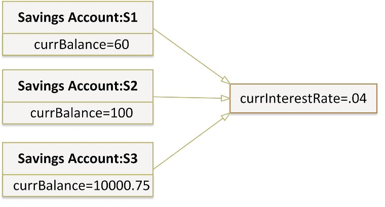
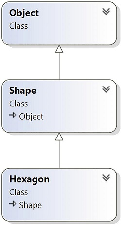
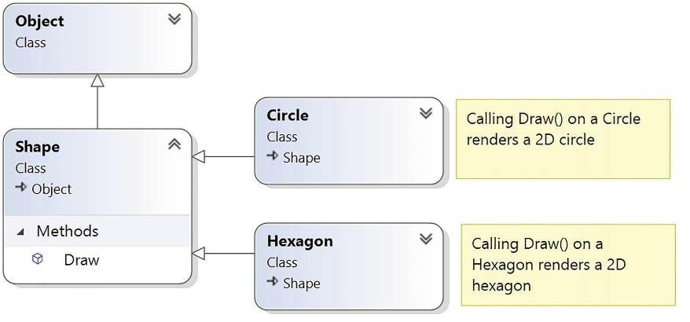

# Розуміння інкапсуляції

Тут ви почнете вивчення об'єктно-орієнтованих можливостей C#. Першим кроком є ​​вивчення процесу створення чітко визначених типів класів, які підтримують будь-яку кількість конструкторів. Після того, як ви зрозумієте основи визначення класів та виділення об'єктів, решта цього розділу розгляне роль інкапсуляції. Попутно ви дізнаєтеся, як визначати властивості класу, та зрозумієте деталі ключового слова static, синтаксису ініціалізації об'єктів, полів лише для читання, константних даних та часткових класів.

# Знайомство з типом C# class

Що стосується платформи .NET, однією з найбільш фундаментальних програмних конструкцій є тип класу. Формально клас — це визначений користувачем тип, який складається з даних поля (часто їх називають змінними-членами) і членів, які працюють з цими даними (таких як конструктори, властивості, методи, події тощо). У сукупності набір даних поля представляє «стан» екземпляра класу (інакше відомого як об’єкт). Потужність об’єктно-орієнтованих мов, таких як C#, полягає в тому, що, групуючи дані та пов’язані функції в уніфікованому визначенні класу, ви можете моделювати своє програмне забезпечення за об’єктами в реальному світі.

Створіть новий проект консольної програми C# під назвою SimpleClassExample. Далі вставте новий файл класу (з назвою Car.cs) у свій проект. Клас визначається в C# за допомогою ключового слова class. Ось найпростіша можлива декларація :

```cs
namespace SimpleClassExample;

class Car
{
}
```
Після того як ви визначили тип класу, вам потрібно буде додати набір змінних-членів, які використовуватимуться для представлення його стану. Наприклад, ви можете вирішити, що автомобілі мають тип даних int для представлення поточної швидкості та тип даних string для представлення дружнього назву автомобіля (наприклад "ластівка"). Враховуючи ці початкові примітки щодо дизайну, оновіть свій клас автомобіля наступним чином:

```cs
class Car
{
    // The 'state' of the Car.
    public string petName;
    public int currSpeed;
}
```
Зауважте, що ці змінні-члени оголошено за допомогою модифікатора доступу public. Загальнодоступні члени класу доступні безпосередньо після створення об’єкта цього типу. Термін об’єкт використовується для опису екземпляра даного типу класу, створеного за допомогою ключового слова new. 

Дані поля класу рідко (якщо взагалі взагалі) слід визначати як публічні. Щоб зберегти цілісність ваших даних про стан, набагато краще буде визначити дані як приватні (або, можливо, захищені) і дозволити контрольований доступ до даних через властивості (як показано далі в цьому розділі). Однак, щоб зробити цей перший приклад максимально простим, загальнодоступні дані відповідають вимогам.

Після того як ви визначили набір змінних-членів, що представляють стан класу, наступним кроком проектування є встановлення членів, які моделюють його поведінку. У цьому прикладі клас Car визначатиме один метод під назвою SpeedUp() та інший під назвою PrintState(). Оновіть свій клас так:

```cs
class Car
{
    // The 'state' of the Car.
    public string petName;
    public int currSpeed;

    // The functionality of the Car.
    public void PrintState()
    {
        Console.WriteLine($"{petName} is going {currSpeed} MPH.");
    }
    public void SpeedUp(int delta)
    {
        currSpeed += delta;
    }
}
```
PrintState() — це функція, яка просто виводить поточний стан певного об’єкта Car у вікно команд. SpeedUp() збільшить швидкість об’єкта Car на величину, визначену вхідним параметром int. Тепер оновіть у файлі Program.cs такий код:

```cs

using SimpleClassExample;

static void SimpleUsingObject1()
{
    // Allocate and configure a Car object.
    Car car = new Car();
    car.petName = "Henry";
    car.currSpeed = 10;

    // Speed up the car a few times and print out the
    // new state.
    for (int i = 0; i <= 10; i++)
    {
        car.SpeedUp(5);
        car.PrintState();
    }
}
SimpleUsingObject1();
```
Після запуску програми ви побачите, що змінна Car (car) підтримує свій поточний стан протягом усього терміну служби програми, як показано в наведених нижче результатах.

```console
Henry is going 15 MPH.
Henry is going 20 MPH.
Henry is going 25 MPH.
Henry is going 30 MPH.
Henry is going 35 MPH.
Henry is going 40 MPH.
Henry is going 45 MPH.
Henry is going 50 MPH.
Henry is going 55 MPH.
Henry is going 60 MPH.
Henry is going 65 MPH.
```

## Розміщення об’єктів за допомогою ключового слова new

Як показано в попередньому прикладі коду, об’єкти повинні бути виділені в пам’ять за допомогою ключового слова new. Якщо ви не використаєте ключове слово new і спробуєте використати свою змінну класу в наступному операторі коду, ви отримаєте помилку компілятора.

```cs
static void WithoutNew()
{
    // Compiler error! Forgot to use 'new' to create object!
    Car myCar;
    myCar.petName = 'Fred';
}
```
Щоб правильно створити об’єкт за допомогою ключового слова new, ви можете визначити та розмістити об’єкт Car в одному рядку коду. 

```cs
static void AboutNew()
{
    // Compiler error! Forgot to use 'new' to create object!
    //Car myCar;
    //myCar.petName = 'Fred';

    Car myCar = new();
    myCar.petName = "Lastivka";
}
```
Як альтернатива, якщо ви хочете визначити та виділити екземпляр класу в окремих рядках коду, ви можете зробити це наступним чином:

```cs
    Car yourCar;
    yourCar = new();
```
Тут перший оператор коду просто оголошує посилання на ще не визначений об'єкт. Лише після того, як ви призначите посилання на об’єкт, це посилання вказує на дійсний об’єкт у пам’яті. 
У будь-якому випадку, на даний момент у вас є тривіальний клас, який визначає кілька полів даних і деякі основні операції. Щоб підвищити функціональність нинішнього класу Car, потрібно розуміти роль конструкторів.

# Розуміння конструкторів

З огляду на те, що об’єкти мають стан (представлений значеннями змінних-членів об’єкта), програміст зазвичай бажає призначити відповідні значення даним поля об’єкта перед використанням. Наразі клас Car потребує, щоб поля petName і currSpeed ​​призначалися окремо для кожного поля. Для поточного прикладу це не надто проблематично, враховуючи, що у вас є лише дві публічні точки даних. Однак нерідко клас має десятки полів, з якими потрібно працювати. Зрозуміло, що було б небажано створювати 20 операторів ініціалізації для встановлення 20 точок даних!
C# підтримує використання конструкторів, які дозволяють встановити стан об’єкта під час створення. Конструктор — це спеціальний метод класу, який викликається опосередковано під час створення об’єкта за допомогою ключового слова new. Однак, на відміну від «звичайних» методів, конструктори ніколи не повертають значення (навіть void) і завжди мають імена, ідентичні класу, який вони створюють.

## Розуміння ролі конструктора за замовчуванням

Кожний клас C# забезпечено «халявний» конструктором за замовчуванням, який ви можете перевизначити, якщо буде потрібно. За визначенням, конструктор за замовчуванням ніколи не приймає аргументів. Після розміщення нового об’єкта в пам’яті конструктор за замовчуванням гарантує, що для всіх даних полів класу встановлено відповідне значення за замовчуванням.
Якщо ви не задоволені цими призначеннями за замовчуванням, ви можете перевизначити конструктор за замовчуванням відповідно до ваших потреб. Для ілюстрації оновіть свій клас C# Car наступним чином:

```cs
class Car
{
    // The 'state' of the Car.
    public string petName;
    public int currSpeed;
  
    // A custom default constructor.
    public Car()
    {
        petName = "No name";
    }
    //...
}
```
У цьому випадку ви змушуєте всі об’єкти Car почати життя на ім’я "No name"  зі швидкістю 0 миль на годину. Завдяки цьому ви можете створити об’єкт Car із такими значеннями за замовчуванням:

```cs
static void DefaultConstructor()
{
    // Invoking the default constructor.
    Car car = new();
    car.PrintState();
}
DefaultConstructor();
```
```
No name is going 0 MPH.
```

## Визначення настроюваних конструкторів

Як правило, класи визначають додаткові конструктори крім типових. Роблячи це, ви надаєте користувачеві об’єкта простий і послідовний спосіб ініціалізації стану об’єкта безпосередньо під час створення. Зверніть увагу на наступне оновлення класу Car, який тепер підтримує загалом три конструктори:

```cs
class Car
{
    // The 'state' of the Car.
    public string petName;
    public int currSpeed;
  
    // A custom default constructor.
    public Car()
    {
        petName = "No name";
    }

    public Car(string name)
    {
        petName = name;
    }

    public Car(string name, int speed)
    {
        petName = name;
        currSpeed = speed;
    }
}
```
Майте на увазі, що один конструктор відрізняється від іншого (в очах компілятора C#) кількістю та/або типом аргументів конструктора. Коли ви визначаєте метод з такою ж назвою, який відрізняється кількістю або типом аргументів, ви перевантажили метод. Таким чином, клас Car перевантажив конструктор, щоб надати кілька способів створення об’єкта під час оголошення. У будь-якому випадку, тепер ви можете створювати об’єкти Car за допомогою будь-якого загальнодоступного конструктора.

```cs
static void UsingConstructors()
{
    // Make a Car called No name going 0 MPH.
    Car chuck = new Car();
    chuck.PrintState();
    // Make a Car called Mary going 0 MPH.
    Car mary = new Car("Mary");
    mary.PrintState();
    // Make a Car called Daisy going 75 MPH.
    Car daisy = new Car("Daisy", 75);
    daisy.PrintState();
}
UsingConstructors();
```
```
No name is going 0 MPH.
Mary is going 0 MPH.
Daisy is going 75 MPH.

```

## Конструктори з out параметрами 

Конструктори (а також ініціалізатори полів і властивостей, розглянуті пізніше) можуть використовувати out параметри.

```cs
    public Car(string name, int speed, out bool inDanger)
    {
        petName = name;
        currSpeed = speed;
        inDanger = (speed > 100) ? true : false;
    }
```
```cs
    Car fastic = new Car("Fastic", 120, out bool danger);
    Console.WriteLine(danger);
```
```
True
```
Необхідно дотримуватися всіх правил вихідних параметрів. У цьому прикладі параметру inDanger необхідно присвоїти значення перед завершенням роботи конструктора.

## Розуміння конструктора за замовчуванням

Як ви щойно дізналися, усі класи забезпечені конструктором за замовчуванням. Вставте новий файл у свій проект під назвою Motorcycle.cs і додайте наступне:

```cs
namespace SimpleClassExample;

public class Motorcycle
{
    public void Drieve()
    {
        Console.WriteLine("I diving");
    }
}
```
Тепер ви можете створити екземпляр типу Motorcycle за допомогою конструктора за замовчуванням який надає середовище виконання.

```cs
    // Default constructor
    Motorcycle motorcycle = new();
    motorcycle.Drive();
```
```
I diving
```
Однак, як тільки ви визначаєте спеціальний конструктор з будь-якою кількістю параметрів, конструктор за замовчуванням мовчки видаляється з класу та стає недоступним. Подумайте про це так: якщо ви не визначите спеціальний конструктор, компілятор C# надає вам значення за замовчуванням, щоб дозволити користувачеві об’єкта розмістити екземпляр вашого типу з даними поля, встановленими на правильні значення за замовчуванням. Однак, коли ви визначаєте унікальний конструктор, компілятор припускає, що ви взяли справу у свої руки.

Таким чином, якщо ви хочете дозволити користувачеві об’єкта створити екземпляр вашого типу з конструктором за замовчуванням, а також ваш власний конструктор, ви повинні явно перевизначити конструктор за замовчуванням який без параметрів. З цією метою слід розуміти, що в переважній більшості випадків реалізація конструктора за замовчуванням класу навмисно порожня, оскільки все, що вам потрібно, це можливість створити об’єкт із значеннями за замовчуванням. Розглянемо таке оновлення класу :

```cs
public class Motorcycle
{
    public int speed;
    public void Drive()
    {
        Console.WriteLine($"I diving {speed}");
    }
    public Motorcycle()
    {
    }
    public Motorcycle(int speed)
    {
        this.speed = speed;
    }
}
```
Тепер, коли ви краще розумієте роль конструкторів класів, ось зручне скорочення. І Visual Studio, і Visual Studio Code надають фрагмент коду ctor. Коли ви вводите ctor і натискаєте клавішу Tab, IDE автоматично визначить настроюваний конструктор за замовчуванням. Потім ви можете додати спеціальні параметри та логіку впровадження. Або коли натисните Ctrl+. > Generete constructor. Спробуйте.

```cs
    Motorcycle motorcycle1 = new(100);
    motorcycle1.Drive();
```
```
I diving 100
```

# Розуміння ролі ключового слова this

C# надає ключове слово this, яке забезпечує доступ до поточного екземпляра класу. Одним із можливих способів використання ключового слова this є вирішення неоднозначності області видимості, яка може виникнути, коли вхідний параметр має назву, ідентичну до поля даних класу. Однак ви можете просто прийняти угоду про найменування, яка не призведе до такої неоднозначності; щоб проілюструвати це використання ключового слова this, оновіть свій клас Motorcycle новим рядковим полем (ім’я), яке представлятиме ім’я водія. Далі додайте метод під назвою SetDriverName(), реалізований наступним чином:

```cs
public class Motorcycle
{
    //...

    public string name;

    //...

    public void SetName(string name)
    {
        name = name;
    }
}
```
Незважаючи на те, що цей код компілюється, компілятор C# відобразить попереджувальне повідомлення, яке інформує вас про те, що ви призначили змінну саму собі! Для ілюстрації оновіть свій код, щоб викликати SetDriverName(), а потім роздрукуйте значення поля імені.

```cs
static void AboutThis()
{
    Motorcycle motorcycle = new();
    motorcycle.SetName("Julia");
    Console.WriteLine($"Biker:{motorcycle.name}");
}
AboutThis();
```
```
Biker:
```
Проблема полягає в тому, що реалізація SetDriverName() призначає вхідний параметр назад собі, враховуючи, що компілятор припускає, що name посилається на змінну, яка зараз знаходиться в області методу, а не на поле імені в області класу. Щоб повідомити компілятору, що ви хочете встановити поле даних імені поточного об’єкта на вхідний параметр імені, просто скористайтеся this, щоб вирішити неоднозначність.

```cs
    public void SetName(string name)
    {
        //name = name;
        this.name = name;
    }
```
Якщо двозначності немає, вам не потрібно використовувати ключове слово this під час доступу до полів даних або членів. Наприклад, якщо ви перейменуєте елемент рядкових даних з name на driverName (що також вимагатиме від вас оновлення операторів верхнього рівня), використання цього є необов’язковим, оскільки більше немає неоднозначності області видимості.

```cs
public class Motorcycle
{
    //...

    public string driverName;

    //...

    public void SetName(string name)
    {
        //name = name;
        //this.name = name;
        driverName = name;
    }
}
```
```cs
static void AboutThis()
{
    Motorcycle motorcycle = new();
    motorcycle.SetName("Julia");
    Console.WriteLine($"Biker:{motorcycle.driverName}");
}
AboutThis();
```
Незважаючи на те, що використання цього в однозначних ситуаціях мало що виграє, ви все одно можете знайти це ключове слово корисним під час реалізації членів класу, оскільки такі IDE, як Visual Studio та Visual Studio Code, увімкнуть IntelliSense, якщо це вказано. Це може бути корисним, якщо ви забули ім’я члена класу і хочете швидко пригадати визначення. Також this використовується при генерації конструеторів.

Загальна домовленість про іменування полягає в тому, щоб приватні (або внутрішні) імена змінних на рівні класу починалися з підкреслення (наприклад, _driverName), щоб IntelliSense показував усі ваші змінні у верхній частині списку. У нашому тривіальному прикладі всі поля є відкритими, тому ця угода про найменування не застосовуватиметься.

## З’єднання викликів конструктора за допомогою this

Інше використання ключового слова this полягає в створенні класу за допомогою техніки, яка називається ланцюгом конструктора. Цей шаблон проектування корисний, якщо у вас є клас, який визначає кілька конструкторів. З огляду на те, що конструктори часто перевіряють вхідні аргументи для виконання різних бізнес-правил, у наборі конструктора класу може бути досить часто знайти надлишкову логіку перевірки. Розглянемо наступний оновлений класс:

```cs
public class Motorcycle1
{
    public int driverIntensity;
    public string driverName;

    public Motorcycle1() { }
    // Redundant constructor logic!
    public Motorcycle1(int intensity)
    {
        if (intensity > 10)
        {
            intensity = 10;
        }
        driverIntensity = intensity;
    }
    public Motorcycle1(int intensity, string name)
    {
        if (intensity > 10)
        {
            intensity = 10;
        }
        driverIntensity = intensity;
        driverName = name;
    }
}
```
Тут (можливо, намагаючись забезпечити безпеку водія) кожен конструктор гарантує, що рівень інтенсивності ніколи не перевищує 10. Ми маємо надлишкові оператори коду в двох конструкторах. Це далеко не ідеально, оскільки тепер вам потрібно оновлювати код у кількох місцях, якщо ваші правила змінюються (наприклад, якщо інтенсивність не повинна перевищувати 5, а не 10). 

Одним із способів покращити поточну ситуацію є визначення методу в класі Motorcycle, який перевірятиме вхідні аргументи. Якби ви це зробили, кожен конструктор міг би викликати цей метод перед призначенням полів. Хоча цей підхід дозволяє виділити код, який потрібно оновити, коли змінюються бізнес-правила, тепер ви маєте справу з такою надмірністю:

```cs
public class Motorcycle2
{
    public int driverIntensity;
    public string driverName;

    // Constructors.
    public Motorcycle2() { }
    public Motorcycle2(int intensity)
    {
        SetIntensity(intensity);
    }
    public Motorcycle2(int intensity, string name)
    {
        SetIntensity(intensity);
        driverName = name;
    }
    public void SetIntensity(int intensity)
    {
        if (intensity > 10)
        {
            intensity = 10;
        }
        driverIntensity = intensity;
    }
}
```

Чистіший підхід полягає в тому, щоб призначити конструктор, який приймає найбільшу кількість аргументів, як «головний конструктор», а його реалізація виконувати необхідну логіку перевірки. Інші конструктори можуть використовувати ключове слово this для пересилання вхідних аргументів головному конструктору та надання будь-яких додаткових параметрів за потреби. Інші конструктори можуть використовувати ключове слово this для пересилання вхідних аргументів головному конструктору та надання будь-яких додаткових параметрів за потреби. Таким чином, вам потрібно турбуватися лише про підтримку одного конструктора для всього класу, тоді як інші конструктори в основному порожні.

```cs
public class Motorcycle3
{
    public int driverIntensity;
    public string driverName = null!;
    public Motorcycle3()
    {
    }
    public Motorcycle3(int driverIntensity) : this(driverIntensity,"")
    {
    }
    public Motorcycle3(string driverName) :this(0,driverName) 
    {
    }
    public Motorcycle3(int driverIntensity, string driverName)
    {
        if (driverIntensity > 10)
        {
            driverIntensity = 10;
        }
        this.driverIntensity = driverIntensity;
        this.driverName = driverName;
    }
}
```

Використання ключового слова this для ланцюжкових викликів конструктора ніколи не є обов’язковим. Однак, коли ви використовуєте цю техніку, ви, як правило, отримуєте більш зручне та стисле визначення класу. Знову ж таки, використовуючи цю техніку, ви можете спростити свої завдання програмування, оскільки реальна робота делегується одному конструктору (зазвичай конструктору, який має найбільше параметрів), тоді як інші конструктори просто «перекладають відповідальність».

## Спостереження за потоком конструктора

Після того, як конструктор передає аргументи призначеному головному конструктору (і цей конструктор обробив дані), конструктор, викликаний спочатку викликачем, завершить виконання будь-яких інструкцій коду, що залишилися.

```cs
public class Motorcycle4
{
    public int driverIntensity;
    public string? driverName;

    // Constructor chaining.
    public Motorcycle4()
    {
        Console.WriteLine("In default constructor");
    }
    public Motorcycle4(int driverIntensity) : this(driverIntensity,null)
    {
        Console.WriteLine("In constructor taking an int");
    }
    public Motorcycle4(string driverName) : this(default,driverName) 
    {
        Console.WriteLine("In constructor taking a string");
    }
    // This is the 'main' constructor that does all the real work.
    public Motorcycle4(int driverIntensity, string? driverName)
    {
        Console.WriteLine("In main constructor");
        if (driverIntensity > 10)
        {
            driverIntensity = 10;
        }
        this.driverIntensity = driverIntensity;
        this.driverName = driverName;
    }
    public void Drive()
    {
        Console.WriteLine($"I am {driverName}");
        for (int i = 0; i < driverIntensity; i++)
        {
            Console.WriteLine($"Yeeeeeee Haaaaaeewww!");
        }        
    }
    public void SetName(string driverName)
    {
        this.driverName = driverName;
    }
}
```
Створемо і використаємо екземпляр класу.

```cs
static void ObservingConstructorFlow()
{
    Motorcycle4 motorcycle = new(7);
    motorcycle.SetName("John");
    motorcycle.Drive();
}
ObservingConstructorFlow();
```
```
In main constructor
In constructor taking an int
I am John
Yeeeeeee Haaaaaeewww!
Yeeeeeee Haaaaaeewww!
Yeeeeeee Haaaaaeewww!
Yeeeeeee Haaaaaeewww!
Yeeeeeee Haaaaaeewww!
Yeeeeeee Haaaaaeewww!
Yeeeeeee Haaaaaeewww!
```
Як ви можете бачити, потік логіки конструктора такий:

    Ви створюєте свій об’єкт, викликаючи конструктор, який вимагає один int.

    Цей конструктор пересилає надані дані головному конструктору та надає будь-які додаткові аргументи запуску, не вказані викликачем.

    Головний конструктор призначає вхідні дані даним поля об’єкта.

    Управління повертається до конструктора, який був спочатку викликаний, і виконує будь-які залишкові оператори коду.

Приємно у використанні ланцюжка конструкторів те, що цей шаблон програмування працюватиме з будь-якою версією мови C# і платформи .NET.

## Необов’язкові аргументи в конструкторах

Необов’язкові аргументи дозволяють визначати надані значення за замовчуванням для вхідних аргументів метода або конструктора. Якщо абонента влаштовують ці значення за замовчуванням, йому не потрібно вказувати унікальне значення; однак вони можуть зробити це, щоб надати об’єкту спеціальні дані. Розглянемо наступну версію Motorcycle, яка тепер надає декілька способів створення об’єктів за допомогою єдиного визначення конструктора:

```cs
public class Motorcycle5
{
    public int driverIntensity;
    public string? driverName;

    public Motorcycle5(int driverIntensity = 0, string? driverName = null)
    {
        if (driverIntensity > 10)
        {
            driverIntensity = 10;
        }
        this.driverIntensity = driverIntensity;
        this.driverName = driverName;
    }
    public void Drive()
    {
        Console.WriteLine($"\tI am {driverName}");
        for (int i = 0; i < driverIntensity; i++)
        {
            Console.WriteLine($"Yeeeeeee Haaaaaeewww!");
        }
        Console.WriteLine();
    }
}
```
За допомогою цього єдиного конструктора тепер ви можете створити новий об’єкт Motorcycle, використовуючи нуль, один або два аргументи. Пам’ятайте, що синтаксис іменованого аргументу дозволяє вам фактично пропустити прийнятні параметри за замовчуванням

```cs
static void ConstructorWithOptionalArguments()
{
    Motorcycle5 motorcycle1 = new();
    motorcycle1.Drive();

    Motorcycle5 motorcycle2 = new(3);
    motorcycle2.Drive();

    Motorcycle5 motorcycle3 = new(driverName:"Jack");
    motorcycle3.Drive();

    Motorcycle5 motorcycle4 = new(7,"Max");
    motorcycle4.Drive();

}
ConstructorWithOptionalArguments();
```

```
        I am

        I am
Yeeeeeee Haaaaaeewww!
Yeeeeeee Haaaaaeewww!
Yeeeeeee Haaaaaeewww!

        I am Jack

        I am Max
Yeeeeeee Haaaaaeewww!
Yeeeeeee Haaaaaeewww!
Yeeeeeee Haaaaaeewww!
Yeeeeeee Haaaaaeewww!
Yeeeeeee Haaaaaeewww!
Yeeeeeee Haaaaaeewww!
Yeeeeeee Haaaaaeewww!
```
У будь-якому випадку, на цьому етапі ви можете визначити клас із даними полів (такими як змінні-члени) і різними операціями, такими як методи та конструктори.


# Розуміння ключового слова static

Клас C# може визначати будь-яку кількість статичних членів, які оголошуються за допомогою ключового слова static. Коли ви це робите, відповідний член має бути викликаний безпосередньо з рівня класу, а не з посилання на змінну об’єкта. Щоб проілюструвати відмінність, розглянемо System.Console. Як ви бачили, ви не викликаєте метод WriteLine() на рівні об’єкта:

```cs
// Compiler error! WriteLine() is not an object level method!
Console c = new Console();
c.WriteLine("I can't be printed...");
```
Замість цього просто додайте префікс імені класу до статичного члена WriteLine().

```cs
// Correct! WriteLine() is a static method.
Console.WriteLine('Much better! Thanks...');
```
Простіше кажучи, статичні члени - це елементи, які вважаються (розробником класу) настільки звичайними, що немає необхідності створювати екземпляр класу перед викликом члена. Хоча будь-який клас може визначати статичні члени, вони досить часто зустрічаються в службових класах. За визначенням, службовий клас — це клас, який не підтримує жодного стану на рівні об’єкта та не створюється за допомогою ключового слова new. Швидше, службовий клас розкриває всю функціональність за домоиогою членів рівня класу.
Наприклад, якщо ви використаєте Visual Studio Object Browser (через пункт меню View ➤ Object Browser) для перегляду системного простору імен, ви побачите, що всі члени класів Console, Math, Environment та GC відображають усі свої функції через статичні члени.
Знову ж таки, майте на увазі, що статичні члени зустрічаються не лише в класах утиліт; вони можуть бути частиною будь-якого визначення класу взагалі. Просто пам’ятайте, що статичні члени просувають даний елемент на рівень класу, а не на рівень об’єкта. Як ви побачите в наступних кількох розділах, ключове слово static можна застосувати до наступного:

    Дані класу

    Методи класу

    Властивості класу

    Конструктор

    Повне визначення класу

    У поєднанні з ключовим словом C# using

Давайте розглянемо кожен із наших варіантів, починаючи з концепції статичних даних. Ви дослідите роль статичних властивостей пізніше в цій главі, вивчаючи самі властивості.

## Визначення статичного поля даних

У більшості випадків, розробляючи клас, ви визначаєте дані як дані рівня екземпляра або, іншими словами, як нестатичні дані. Визначаючи дані на рівні екземпляра, ви знаєте, що кожного разу, коли ви створюєте новий об'єкт, об'єкт підтримує власну незалежну копію даних. Навпаки, коли ви визначаєте статичні дані класу, пам’ять використовується спільно для всіх об’єктів створених на базі класу.

Щоб побачити різницю, створіть новий проект консольної програми під назвою StaticDataAndMembers. Тепер вставте файл у свій проект під назвою SavingsAccount.cs і створіть у цьому файлі новий клас під назвою SavingsAccount. Почніть із визначення змінної рівня екземпляра (для моделювання поточного балансу) та спеціального конструктора для встановлення початкового балансу.

```cs
namespace StaticDataAndMembers;

class SavingsAccount
{
    // Instance-level data.
    public decimal currentBalance;
    public SavingsAccount(decimal currentBalance)
    {
        this.currentBalance = currentBalance;
    }
}

```
Коли ви створюєте об’єкти SavingsAccount, для кожного об’єкта виділяється пам’ять в якому є поле currentBalance. Таким чином, ви можете створити п’ять різних об’єктів SavingsAccount, кожен зі своїм унікальним балансом. Крім того, зміна балансу на одному рахунку не впливає на інші об’єкти.

Статичні дані, з іншого боку, виділяються один раз і спільно використовуються для всіх об’єктів однієї категорії класу. Додайте статичну змінну з назвою currInterestRate до класу SavingsAccount, для якого встановлено значення за замовчуванням 0,04.

```cs
class SavingsAccount
{
    // A static point of data.
    public static double currеntInterestRate = 0.04;
    // Instance-level data.
    //...
}
```
Створіть три екземпляри SavingsAccount у Program.cs:

```cs
using StaticDataAndMembers;

static void DefiningStaticFieldData()
{
    SavingsAccount s1 = new SavingsAccount(50);
    SavingsAccount s2 = new SavingsAccount(100);
    SavingsAccount s3 = new SavingsAccount(10000.75M);
}
DefiningStaticFieldData();
```
Розподіл даних у пам’яті виглядатиме приблизно так



Тут припускається, що всі ощадні рахунки повинні мати однакову процентну ставку. Оскільки статичні дані є спільними для всіх об’єктів однієї категорії, якщо ви будь-яким чином змінили їх, усі об’єкти «побачать» нове значення під час наступного доступу до статичних даних, оскільки всі вони, по суті, переглядають одне й те саме розташування пам'яті.

Щоб зрозуміти, як змінити (або отримати) статичні дані, потрібно розглянути роль статичних методів.

## Визначення статичних методів

Давайте оновимо клас SavingsAccount, щоб визначити два статичні методи. Перший статичний метод (GetInterestRate()) поверне поточну процентну ставку, тоді як другий статичний метод (SetInterestRate()) дозволить вам змінити процентну ставку.

```cs
class SavingsAccount
{
    // A static point of data.
    public static double currеntInterestRate = 0.04;
    // Instance-level data.
    public decimal currentBalance;
    public SavingsAccount(decimal currentBalance)
    {
        this.currentBalance = currentBalance;
    }

    public static void SetInterestRate(double newRate)
    {
       currеntInterestRate = newRate;
    }

    public double GetInterestRate() => currеntInterestRate;
}
```
Тепер зверніть увагу на таке використання:

```cs
static void UsingStaticMethods()
{
    SavingsAccount s1 = new SavingsAccount(50);
    SavingsAccount s2 = new SavingsAccount(100);

    // Print the current interest rate.
    Console.WriteLine($"Interest Rate is:{SavingsAccount.GetInterestRate()}");
    
    // Make new object, this does NOT 'reset' the interest rate.
    SavingsAccount s3 = new SavingsAccount(10000.75M);
    Console.WriteLine($"Interest Rate is:{SavingsAccount.GetInterestRate()}");

    SavingsAccount.SetInterestRate(0.05);
    Console.WriteLine($"Interest Rate is:{SavingsAccount.GetInterestRate()}");

    SavingsAccount s4 = new SavingsAccount(20000);
    Console.WriteLine($"Interest Rate is:{SavingsAccount.GetInterestRate()}");
}
UsingStaticMethods();
```
```
Interest Rate is:0,04
Interest Rate is:0,04
Interest Rate is:0,05
Interest Rate is:0,05
```
Як ви бачите, коли ви створюєте нові екземпляри класу SavingsAccount, значення статичних даних не скидається, оскільки CoreCLR розміщуватиме статичні дані в пам’яті рівно один раз. Після цього всі об’єкти типу SavingsAccount працюють з тим самим значенням для статичного поля currentInterestRate.

Під час проектування будь-якого класу C# одним із завдань проектування є визначення того, які фрагменти даних слід визначати як статичні члени, а які ні. Хоча жорстких правил немає, пам’ятайте, що статичне поле даних є спільним для всіх об’єктів цього типу. Таким чином, якщо ви визначаєте точку даних, яку мають спільно використовувати всі об’єкти, статика є способ як іти.

Поміркуйте, що сталося б, якби змінну відсоткової ставки не було визначено за допомогою ключового слова static. Це означає, що кожен об’єкт SavingsAccount матиме власну копію поля currentInterestRate. Тепер припустімо, що ви створили 100 об’єктів SavingsAccount і вам потрібно змінити процентну ставку. Для цього потрібно було б викликати метод SetInterestRate() 100 разів! Очевидно, що це не буде корисним способом моделювання «спільних даних». Знову ж таки, статичні дані ідеальні, коли у вас є значення, яке має бути спільним для всіх об’єктів цієї категорії.

## Визначення статичних конструкторів

Типовий конструктор використовується для встановлення значення даних рівня екземпляра об’єкта під час створення. Однак що станеться, якщо ви спробуєте призначити значення статичної точки даних у типовому конструкторі? Ви можете бути здивовані, виявивши, що значення скидається щоразу, коли ви створюєте новий об’єкт.

```cs
class SavingsAccount1
{
    public static double currеntInterestRate;
    public decimal currentBalance;

    public SavingsAccount1(decimal currentBalance)
    {
        this.currentBalance = currentBalance;
        currеntInterestRate = 0.04; // This is static data!
    }
    public static double GetInterestRate() => currеntInterestRate;

    public static void SetInterestRate(double newRate)
    {
        currеntInterestRate = newRate;
    }
}
```
Тепер припустімо, що ви створили такий код:

```cs
static void StaticDataInConstructor()
{
    SavingsAccount1 s1 = new(50);
    Console.WriteLine($"Interest Rate is: {SavingsAccount1.GetInterestRate()}");

    // Try to change the interest rate via property.
    SavingsAccount1.SetInterestRate(0.08);

    SavingsAccount1 s2 = new(100);
    Console.WriteLine($"Interest Rate is: {SavingsAccount1.GetInterestRate()}");

}
StaticDataInConstructor();
```
```
Interest Rate is: 0,04
Interest Rate is: 0,04
```
Якщо ви виконали попередній код, ви побачите, що змінна currInterestRate скидається кожного разу, коли ви створюєте новий об’єкт SavingsAccount, і вона завжди має значення 0,04. Зрозуміло, що встановлення значення статичних даних у звичайному конструкторі рівня екземпляра ніби перешкоджає меті. Щоразу, коли ви створюєте новий об’єкт, дані рівня класу скидаються. Одним із підходів до встановлення статичного поля є використання синтаксису ініціалізації члена, як ви робили спочатку.

```cs
class SavingsAccount
{
    public static double currеntInterestRate = 0.04;
    //...
}
```
Цей підхід забезпечить призначення статичного поля лише один раз, незалежно від кількості створених об’єктів. Однак що, якщо значення для ваших статичних даних необхідно отримати під час виконання? Наприклад, у типовій банківській програмі значення змінної відсоткової ставки зчитується з бази даних або зовнішнього файлу. Для виконання таких завдань зазвичай потрібна область дії методу, наприклад конструктор для виконання операторів коду. З цієї причини C# дозволяє вам визначити статичний конструктор, який дозволяє безпечно встановлювати значення ваших статичних даних. Розглянемо таке оновлення для вашого класу:

```cs
class SavingsAccount2
{
    public static double currеntInterestRate;
    public decimal currentBalance;

    // A static constructor!
    static SavingsAccount2()
    {
        Console.WriteLine("In static constructor!");
        currеntInterestRate = 0.04;
    }
    //...
}
```
Простіше кажучи, статичний конструктор — це спеціальний конструктор, який є ідеальним місцем для ініціалізації значень статичних даних, коли значення невідоме під час компіляції (наприклад, вам потрібно прочитати значення із зовнішнього файлу, прочитати значення з бази даних, згенерувати випадкове число або щось інше).

Запустили аналогічний код, ви б побачите очікуваний результат. Зверніть увагу, що повідомлення «In static constructor!» друкує лише один раз, оскільки CoreCLR викликає всі статичні конструктори перед першим використанням (і ніколи не викликає їх знову для цього екземпляра програми).

```cs
class SavingsAccount2
{
    public static double currеntInterestRate;
    public decimal currentBalance;
    // A static constructor!
    static SavingsAccount2()
    {
        Console.WriteLine("In static constructor!");
        currеntInterestRate = 0.04;
    }
    //...
}
```
```
In static constructor!
Interest Rate is: 0,04
Interest Rate is: 0,08
```
Ось кілька цікавих моментів щодо статичних конструкторів:

    Даний клас може визначати лише один статичний конструктор.Іншими словами, статичний конструктор не можна перевантажувати.

    Статичний конструктор не приймає модифікатор доступу та не може приймати жодних параметрів.

    Статичний конструктор виконується рівно один раз, незалежно від кількості створених об’єктів типу.

    Середовище виконання викликає статичний конструктор, коли створює екземпляр класу або перед доступом до першого статичного члена, викликаного абонентом.

    Статичний конструктор виконується перед будь-якими конструкторами рівня екземпляра.

Враховуючи цю модифікацію, коли ви створюєте нові об’єкти SavingsAccount, значення статичних даних зберігається, оскільки статичний член встановлюється лише один раз у статичному конструкторі, незалежно від кількості створених об’єктів.

## Визначення статичних класів

Також можна застосувати ключове слово static безпосередньо до класу. Якщо клас визначено як статичний, його неможливо створити за допомогою ключового слова new і він може містити лише члени або поля даних, позначені ключовим словом static.
Пам'ятайте, що клас (або структура), який надає лише статичну функціональність, часто називають класом корисності(a utility class). При розробці класу корисності до визначення класу рекомендується застосувати ключове слово static.

На перший погляд це може здатися досить дивною функцією, враховуючи те, що клас, який неможливо створити, не виглядає настільки корисним. Однак, якщо ви створюєте клас, який не містить нічого, крім статичних членів та/або постійних даних, класу не потрібно спочатку десь розташовувати в пам'яті. Для ілюстрації створіть новий клас під назвою TimeUtilClass і визначте його так:

```cs
namespace StaticDataAndMembers;

static class TimeUtilClass
{
    public static void PrintTime()
    {
        Console.WriteLine(DateTime.Now.ToShortTimeString());
    }
    public static void PrintDate()
    {
        Console.WriteLine(DateTime.Today.ToShortDateString());
    }
}
```
Оскільки цей клас було визначено за допомогою ключового слова static, ви не можете створити екземпляр TimeUtilClass за допомогою ключового слова new. Навпаки, всі функції доступні на рівні класу. Щоб перевірити цей клас, додайте наступне:

```cs
static void UsingAStaticClass()
{
    // These compile just fine.
    TimeUtilClass.PrintDate();
    TimeUtilClass.PrintTime();
    // Compiler error! Can't create instance of static classes!
    //TimeUtilClass u = new TimeUtilClass();
}
UsingAStaticClass();
```

### Імпорт статичних членів за допомогою ключового слова C# using

C# підтримує імпорту статичних елементів за допомогою ключового слова using. Розглянемо останій визначений класс. Оскільки ви здійснюєте виклики методу WriteLine() класу Console, а також властивостей Now і Today класу DateTime, ви повинні мати оператор using для простору імен System. Оскільки всі члени цих класів є статичними, ви можете змінити свій файл коду за допомогою таких директив static using:

```cs
// Import the static members of Console and DateTime.
using static System.Console;
using static System.DateTime;

namespace StaticDataAndMembers;

static class TimeUtilClass1
{
    public static void PrintTime()
    {
        WriteLine(Now.ToShortTimeString());
    }
    public static void PrintDate()
    {
        WriteLine(Today.ToShortDateString());
    }
}
```
Більш реалістичний приклад спрощення коду з імпортом статичних членів може включати клас C#, який значною мірою використовує клас System.Math (або інший допоміжний клас). Оскільки в цьому класі немає нічого, крім статичних членів, було б дещо простіше мати оператор static using для цього типу, а потім безпосередньо викликати члени класу Math у вашому кодовому файлі.

Однак майте на увазі, що надмірне використання статичних операторів імпорту може призвести до потенційної плутанини. По-перше, що, якщо кілька класів визначають метод WriteLine()? Компілятор заплутався, як і інші, які читають ваш код. По-друге, якщо розробники не знайомі з бібліотеками коду .NET Core, вони можуть не знати, що WriteLine() є членом класу Console. Якщо люди не помітять набір статичних імпортів у верхній частині файлу коду C#, вони можуть бути зовсім не впевнені, де насправді визначено цей метод.
У будь-якому випадку, на цьому етапі глави ви повинні відчувати себе комфортно, визначаючи прості типи класів, що містять конструктори, поля та різні статичні (і нестатичні) члени. Тепер, коли ви розумієте основи побудови класів, ви можете офіційно дослідити три стовпи об’єктно-орієнтованого програмування.

# Визначення основ ООП

Усі об’єктно-орієнтовані мови (C#, Java, C++ тощо) повинні відповідати цим трьом основним принципам, які часто називають стовпами об’єктно-орієнтованого програмування (ООП):

    Інкапсуляція: як ця мова приховує деталі внутрішньої реалізації об’єкта та зберігає цілісність даних?

    Спадкування: як ця мова сприяє повторному використанню коду?

    Поліморфізм: як ця мова дозволяє обробляти пов’язані об’єкти подібним чином?

Перш ніж заглиблюватися в деталі кожного стовпа, важливо зрозуміти їх основні ролі. Ось огляд кожного стовпа, який буде детально розглянуто в решті цього розділу та в наступному.


# Розуміння ролі інкапсуляції

Перший стовп ООП називається інкапсуляцією. Ця властивість зводиться до здатності мови приховувати від користувача об’єкта непотрібні деталі реалізації. Наприклад, припустімо, що ви використовуєте клас DatabaseReader, який має два основні методи Open() і Close().

```cs
// Assume this class encapsulates the details of opening and closing a database.
DatabaseReader dbReader = new DatabaseReader();
dbReader.Open(@"C:\AutoLot.mdf");
// Do something with data file and close the file.
dbReader.Close();
```
Вигаданий клас DatabaseReader інкапсулює внутрішні деталі пошуку, завантаження, обробки та закриття файлу даних. Програмісти люблять інкапсуляцію, оскільки ця основа ООП спрощує завдання кодування. Немає необхідності турбуватися про численні рядки коду, які працюють за лаштунками, щоб виконувати роботу класу DatabaseReader. Все, що вам потрібно зробити, це створити екземпляр і надіслати відповідні повідомлення (наприклад, «Відкрийте базу данних під назвою AutoLot.mdf, розташований на моєму диску C»).
З поняттям інкапсуляції логіки програмування тісно пов’язана ідея захисту даних. В ідеалі дані про стан об’єкта мають бути вказані за допомогою ключового слова private, internal або protected. Таким чином, зовнішній світ повинен ввічливо запитувати, щоб змінити або отримати базові значеня даних. Це добре, оскільки публічно оголошені точки даних можуть бути легко пошкоджені (в ідеалі випадково, а не навмисно!).

## Розуміння ролі успадкування

Наступний стовп ООП, успадкування, зводиться до здатності мови дозволяти створювати нові визначення класів на основі існуючих визначень класів. По суті, успадкування дозволяє вам розширити поведінку базового (або батьківського) класу, успадкувавши основні функції в похідний підклас (також званий дочірнім класом).

Відношення «is-a».


Ви можете прочитати схему на малюнку так: «A Hexagon is-a Shape that is-an Object.». Коли у вас є класи, пов’язані цією формою успадкування, ви встановлюєте зв’язки «is-a» між типами. Відношення «is-a» називають успадкуванням.
Тут можна припустити, що Shape визначає деяку кількість членів, які є спільними для всіх нащадків (можливо, значення для представлення кольору для малювання фігури та інші значення для представлення висоти та ширини). Враховуючи те, що клас Hexagon розширює Shape, він успадковує основні функції, визначені Shape і Object, а також визначає власні додаткові деталі, пов’язані з шестикутниками (якими б вони не були).

На платформах .NET System.Object завжди є найвищим батьківським елементом у будь-якій ієрархії класів, що визначає деякі загальні функції для всіх типів

У світі ООП існує ще одна форма повторного використання коду: модель обмеження/делегування, також відома як зв’язок «has-a» або агрегація.Ця форма повторного використання не використовується для встановлення стосунків батьків і дітей. Швидше, відношення «has-a» дозволяє одному класу визначати змінну-член іншого класу та надавати її функціональні можливості (якщо потрібно) користувачеві об’єкта опосередковано.
Наприклад, припустимо, що ви знову моделюєте автомобіль. Можливо, ви захочете висловити думку про те, що Car «has-a» Radio. Було б нелогічно намагатися вивести клас Car з Radio або навпаки (Car «is-a» Radio? Я думаю, ні!). Натомість у вас є два незалежних класи, які працюють разом, де клас Автомобіль створює та розкриває функціональні можливості Радіо.

Подивимось в проекті OOPExamples

```cs
namespace OOPExamples;

class Radio
{
    bool state;
    public void ChangeState(bool state)
    {
        this.state = state;
    }
    public void GetState()
    {
        string result = state ? "Radio is on" : "Radio is off";
        
        Console.WriteLine(result);
    }
}
```
```cs
class Car
{
    // Car 'has-a' Radio.
    private Radio _radio = new();
    public Car()
    {
        _radio.GetState();
    }
    public void TurnOnRadio()
    {
        // Delegate call to inner object.
        _radio.ChangeState(true);
        _radio.GetState();
    }
}
```

Зауважте, що користувач об’єкта не знає, що клас Car використовує внутрішній об’єкт Radio
```cs
using OOPExamples;

static void HasARelationship()
{
    Car car = new Car();
    car.TurnOnRadio();
}
HasARelationship();
```
```
Radio is off
Radio is on

```

## Розуміння ролі поліморфізму

Останнім стовпом ООП є поліморфізм. Ця риса фіксує здатність мови обробляти пов’язані об’єкти подібним чином. Зокрема, ця можливість об’єктно-орієнтованої мови дозволяє базовому класу визначати набір членів (офіційно названих поліморфним інтерфейсом), які доступні для всіх нащадків. Поліморфний інтерфейс класу створюється з використанням будь-якої кількості віртуальних або абстрактних членів (додаткову інформацію див. наступний розділ).
У двох словах, віртуальний член — це член базового класу, який визначає реалізацію за замовчуванням, яка може бути змінена (або більш формально кажучи, перевизначена) похідним класом. Навпаки, абстрактний метод є членом базового класу, який не забезпечує реалізацію за замовчуванням, але надає сігнатуру(дані шо отримується і шо вертається). Коли клас походить від базового класу, що визначає абстрактний метод, він повинен бути перевизначений похідним типом. У будь-якому випадку, коли похідні типи замінюють члени, визначених базовим класом, вони, по суті, перевизначають те, як вони відповідають на той самий запит.

Щоб переглянути поліморфізм, давайте надамо деякі деталі ієрархії форм, показаної на малюнку.



Припустімо, що клас Shape визначив віртуальний метод під назвою Draw(), який не приймає параметрів. З огляду на те, що кожна форма повинна відтворюватися унікальним чином, підкласи, такі як Hexagon і Circle, можуть вільно змінювати цей метод на власний смак.

Після розробки поліморфного інтерфейсу ви можете почати робити різні припущення у своєму коді. Наприклад, враховуючи, що Hexagon і Circle походять від спільного батька (Shape), масив типів Shape може містити все, що походить від цього базового класу. Крім того, враховуючи, що Shape визначає поліморфний інтерфейс для всіх похідних типів (метод Draw() у цьому прикладі), ви можете припустити, що кожен член масиву має цю функціональність.

```cs
Shape[] myShapes = new Shape[3];
myShapes[0] = new Hexagon();
myShapes[1] = new Circle();
myShapes[2] = new Hexagon();
foreach (Shape s in myShapes)
{
  // Use the polymorphic interface!
  s.Draw();
}
```

# Розуміння модифікаторів доступу C# 

Працюючи з інкапсуляцією, ви завжди повинні враховувати, які аспекти типу видимі для різних частин вашої програми. Зокрема, типи (класи, інтерфейси, структури, перерахування та делегати), а також їхні члени (властивості, методи, конструктори та поля) визначаються за допомогою певного ключового слова, щоб контролювати, наскільки «видимим» елемент є для інших частин вашого додатку. 
Хоча C# визначає численні ключові слова для керування доступом, вони відрізняються тим, де їх можна успішно застосувати (тип чи член). Таблиця документує роль кожного модифікатора доступу та місце його застосування.

Модифікатори доступу C#


|Модифікатор доступу|Може застосовуватися до|Сенс використаня|
|-------------------|-----------------------|------------------|
|public|Типи або члени типу|Загальнодоступні елементи не мають обмежень доступу.Доступ до відкритого члена можна отримати з об’єкта, а також з будь-якого похідного класу.Доступ до відкритого типу можна отримати з інших зовнішніх збірок.|
|private|Члени типу або вкладені типи|Доступ до приватних елементів може отримати лише клас (або структура), який визначає елемент.|
|protected|Члени типу або вкладені типи|Захищені елементи можуть використовуватися класом, який їх визначає, і будь-яким дочірнім класом. До них неможливо отримати доступ поза ланцюжком успадкування.|
|internal|Типи або члени типу|Внутрішні елементи доступні лише в межах поточної збірки.Іншим збіркам можна явно надати дозвіл на перегляд внутрішніх елементів.|
|protected internal|Члени типу або вкладені типи|Коли protected та internal ключові слова поєднуються в елементі, елемент доступний у визначальній збірці, у визначальному класі та похідних класах усередині чи поза визначальною збіркою.|
|private protected|Члени типу або вкладені типи|Коли private та protected ключові слова поєднуються в елементі, елемент доступний у межах визначального класу та похідних класів у тій же збірці.|

У цій главі розлядяються лише public та private ключові слова. У наступних розділах буде розглянуто роль internal і protected internal модифікаторів (корисно, коли ви створюєте бібліотеки коду та модульні тести) і модифікатор protected (корисно, коли ви створюєте ієрархії класів).

## Використання модифікаторів доступу за замовчуванням

За замовчуванням члени типу є неявно private, тоді як типи є неявно internal. Таким чином, наступне визначення класу автоматично встановлюється як internal, тоді як конструктор типу за замовчуванням автоматично встановлюється як private (однак, як ви підозрюєте, є декілька випадків, коли вам потрібен конструктор приватного класу):

```cs
// An internal class with a private default constructor.
class Radio
{
  Radio(){}
}
```
Якщо ви хочете вказати явно, ви можете додати ці ключові слова самостійно без жодних негативних наслідків.

```cs
// An internal class with a private default constructor.
internal class Radio
{
  private Radio(){}
}
```
Щоб дозволити іншим частинам програми викликати членів об’єкта, ви повинні визначити їх за допомогою ключового слова public (або, можливо, за допомогою ключового слова protected, про яке ви дізнаєтесь у наступному розділі). Крім того, якщо ви хочете надати Radio зовнішнім збіркам (знову ж таки, корисно під час створення більших рішень або бібліотек коду), вам потрібно буде додати модифікатор public.

```cs
// A public class with a public default constructor.
public class Radio
{
  public Radio(){}
}
```
## Використання модифікаторів доступу та вкладених типів

Як зазначено в таблиці модифікатори доступу private, protected, protected internal і private protected можна застосовувати до вкладеного типу. Наступний розділ детально розгляне вкладеність. Однак на цьому етапі вам потрібно знати, що вкладений тип — це тип, оголошений безпосередньо в межах класу або структури. Як приклад, ось приватне перерахування (під назвою CarColor), вкладене в публічний клас (під назвою SportsCar):

```cs
namespace OopExamples;
public class SportsCar
{
  // Nested types can be marked private.
  private enum CarColor
  {
    Red, Green, Blue
  }
}
```
Тут допустимо застосовувати модифікатор приватного доступу до вкладеного типу. Однак невкладені типи (такі як SportsCar) можна визначити лише за допомогою public або  internal модифікатора. Таким чином, таке визначення класу не має сенсу:

```cs
// Error! Non-nested types cannot be marked private!
private class SportsCar
{}
```

# Розуміння першого принципу ООП : служби інкапсуляції C#

Концепція інкапсуляції обертається навколо поняття, що дані об’єкта не повинні бути безпосередньо доступними з примірника об’єкта. Швидше, дані класу визначаються як приватні. Якщо користувач об’єкта хоче змінити стан об’єкта, він робить це опосередковано за допомогою публічних членів. 
Щоб проілюструвати потребу в службах інкапсуляції, припустимо, що ви створили таке визначення класу:

```cs
namespace OOPExamples;

class Book
{
    public int numberOfPages;
}
```
Проблема з загальнодоступними даними полягає в тому, що самі дані не здатні «розуміти», чи є поточне значення, якому вони присвоєні, дійсним щодо поточних бізнес-правил системи. Як ви знаєте, верхній діапазон C# int досить великий (2 147 483 647). Таким чином, компілятор дозволяє наступне призначення:

```cs
static void UnderstandingEncapsulation()
{
    // Humm. That is one heck of a mini-novel!
    Book miniNovel = new Book();
    miniNovel.numberOfPages = 30_000_000;
}
```
Хоча ви не вийшли за межі типу даних int, має бути зрозуміло, що міні-роман із кількістю сторінок у 30 000 000 сторінок є трохи нерозумним. Як бачите, загальнодоступні поля не дають можливості перехопити логічні верхні (або нижні) межі. Якщо у вашій поточній системі є бізнес-правило, згідно з яким книга має містити від 1 до 1000 сторінок, ви не можете застосувати це програмним шляхом. Через це загальнодоступним полям зазвичай немає місця у визначенні класу на рівні виробництва.

Точніше кажучи, члени класу, які представляють стан об’єкта, не повинні позначатися як публічні. Як ви побачите далі в цій главі, публічні константи та загальнодоступні поля лише для читання є досить корисними.

Інкапсуляція забезпечує спосіб збереження цілісності даних про стан об’єкта. Замість того, щоб визначати загальнодоступні поля (які можуть легко сприяти пошкодженню даних), ви повинні отримати звичку визначати приватні дані, якими опосередковано маніпулюють за допомогою одного з двох основних методів.

    Ви можете визначити пару публічних методів accessor (get) і mutator (set).

    Ви можете визначити загальнодоступну властивість

Яку б техніку ви не вибрали, суть полягає в тому, що добре інкапсульований клас повинен захищати свої дані та приховувати деталі того, як він працює, від цікавих очей зовнішнього світу. Це часто називають програмуванням чорної скриньки. Принадність цього підходу полягає в тому, що об’єкт може змінювати спосіб реалізації даного методу під капотом. Це робиться без порушення існуючого коду, що використовує його, за умови, що параметри та значення, що повертаються методом, залишаються постійними.

## Інкапсуляція з використанням традиційних Accessors та Mutators.

У цій главі ви створите досить повний клас, який моделює звичайного працівника. Щоб почати, створіть новий проект консольної програми під назвою EmployeeApp і створіть новий файл класу під назвою Employee.cs. Оновіть клас Employee таким простором імен, полями, методами та конструкторами:

```cs
namespace EmployeeApp;

class Employee1
{
    // Field data
    private int _id;
    private string _name = null!;
    private float _currentPay;

    // Constructors
    public Employee1()
    {
    }

    public Employee1(int id, string name, float currentPay)
    {
        _id = id;
        _name = name;
        _currentPay = currentPay;
    }

    //Methods
    public void GiveBonus(float amount)
    {
        _currentPay += amount;
    }

    public void DisplayStatus()
    {
        Console.WriteLine($"{_id}\t{_name}\t{_currentPay}");
    }
}
```
Зверніть увагу, що поля класу Employee наразі визначено за допомогою ключового слова private. Зважаючи на це, поля _empName, _empId і _currPay недоступні безпосередньо зі змінної об’єкта. Таким чином, така логіка у вашому коді призведе до помилок компілятора:

```cs
using EmployeeApp;

static void Attempt1()
{
    Employee1 emp = new();
    // Error! Cannot directly access private members
    // from an object!
    emp._empName = "Marv";
}
```
Якщо ви хочете, щоб зовнішній світ взаємодіяв із повним іменем працівника, традиційним підходом є визначення аксесора (метод get) і мутатора (метод set). Роль методу get полягає в тому, щоб повернути викликаючому поточне значення базових даних про стан. Метод set дозволяє викликаючому змінювати поточне значення базових даних стану, доки виконуються визначені бізнес-правила.
Для ілюстрації давайте інкапсулюємо поле empName. Для цього додайте такі публічні методи до класу Employee. Зверніть увагу, що метод SetName() перевіряє вхідні дані, щоб переконатися, що рядок містить 15 символів або менше. Якщо ні, на консоль виводиться повідомлення про помилку, яке повертається без змін поля _name.

```cs
    // Accessor (get method).
    public string GetName => _name;

    // Mutator (set method).
    public void SetName(string name)
    {
        // Do a check on incoming value
        // before making assignment.
        if (name.Length > 15)
        {
            Console.WriteLine("Error! Name length exceeds 15 characters!");
        }
        else
        {
            _name = name;
        }
    }
```
Ця техніка вимагає двох методів з унікальними назвами для роботи з однією точкою даних. Щоб перевірити ваші нові методи, оновіть метод коду таким чином:

```cs
void UsingAccessorAndMutator()
{
    Employee1 emp1 = new Employee1(1,"Martin",30_000);

    emp1.GiveBonus(1000);
    emp1.DisplayStatus();

    emp1.SetName("Marvin");
    Console.WriteLine(emp1.GetName);
}
UsingAccessorAndMutator();
```
```
1       Martin  31000
Marvin
```
Через код у вашому методі SetName(), якщо ви спробуєте вказати більше 15 символів , ви побачите жорстко закодоване повідомлення про помилку, надруковане на консолі.

```cs

    // Longer than 15 characters! Error will print to console.
    Employee1 emp2 = new();
    emp2.SetName("Big big and very power Max");
```
```
Error! Name length exceeds 15 characters!
```
Поки що все добре. Ви інкапсулювали приватне поле empName за допомогою двох публічних методів GetName() і SetName(). Якщо ви хочете додатково інкапсулювати дані в клас Employee, вам потрібно буде додати різні додаткові методи (такі як GetID(), SetID(), GetCurrentPay(), SetCurrentPay()). Кожен із методів-мутаторів може також мати різні рядки коду для перевірки додаткових бізнес-правил. Хоча це, звичайно, можна зробити, мова C# має корисну альтернативну нотацію для інкапсуляції даних класу.

## Інкапсуляція за допомогою властивостей

Хоча ви можете інкапсулювати частину даних поля за допомогою традиційних методів get і set, мови .NET Core віддають перевагу застосуванню інкапсуляції даних стану даних за допомогою властивостей. По-перше, зрозумійте, що властивості — це лише контейнер для «справжніх» методів доступу та мутатора, які називаються get і set відповідно. Таким чином, як розробник класу, ви все ще можете виконати будь-яку внутрішню логіку, необхідну перед присвоєнням значення (наприклад, увести значення у верхньому регістрі, очистити значення від недозволених символів, перевірити межі числового значення тощо). Ось оновлений клас Employee, який тепер забезпечує інкапсуляцію кожного поля за допомогою синтаксису властивостей, а не традиційних методів get і set:

```cs
class Employee2
{
    // Field data
    private int _id;
    private string _name = null!;
    private float _currentPay;

    // Properties!
    // The 'int' represents the type of data this property encapsulates.
    public int Id // Note lack of parentheses.
    {
        get { return _id; }
        set { _id = value; }
    }
    public string Name
    {
        get {  return _name; }
        set 
        {
            if (value.Length > 15)
            {
                Console.WriteLine("Error! Name length exceeds 15 characters!");
            }
            else
            {
                _name = value;
            }
        }
    }
    public float CurrentPay { get => _currentPay; set => _currentPay = value; }

    //Constructors
    //...
    //Methods
    //...

}
```
Властивість C# складається шляхом визначення області отримання get і встановлення області set безпосередньо в самій властивості. Зверніть увагу, що властивість визначає тип даних, які вона інкапсулює, за допомогою того, що виглядає як значення, що повертається. Також зверніть увагу, що, на відміну від методу, властивості не використовують дужки (навіть порожні дужки) під час визначення. Розгляньте наступний коментар до вашої поточної властивості ідентифікатора:

```cs
    // The 'int' represents the type of data this property encapsulates.
    public int Id // Note lack of parentheses.
    {
        get { return _id; }
        set { _id = value; }
    }
```
У межах встановленої області властивості ви використовуєте маркер із іменем value, який використовується для представлення вхідного значення, яке використовується для призначення властивості визиваючого коду. Цей маркер не є справжнім ключовим словом C#, але є те, що відомо як контекстне ключове слово. Коли значення маркера знаходиться в межах встановленої області властивості, воно завжди представляє значення, яке призначає визиваючий код, і воно завжди матиме той самий базовий тип даних, що й сама властивість. Таким чином, зверніть увагу, як властивість Name все ще може перевірити діапазон рядка таким чином:

```cs
public string Name
{
    get {  return _name; }
    set 
    {
        if (value.Length > 15)
        {
            Console.WriteLine("Error! Name length exceeds 15 characters!");
        }
        else
        {
            _name = value;
        }
    }
}
```
Після встановлення цих властивостей абоненту здається, що він отримує та встановлює загальнодоступну точку даних; однак правильний блок get і set викликається за лаштунками, щоб зберегти інкапсуляцію.

```cs
void UsingProperties()
{
    Employee2 employee = new Employee2(1, "Martin", 30_000);

    employee.GiveBonus(1000);
    employee.DisplayStatus();

    // Set and then get the Name property.
    employee.Name = "Marvin";
    Console.WriteLine(employee.Name);
}
UsingProperties();
```
```
1       Martin  31000
Marvin
```
Властивості (на відміну від методів доступу та мутаторів) також полегшують маніпулювання типами, оскільки властивості можуть реагувати на внутрішні оператори C#. Для ілюстрації припустімо, що тип класу Employee має внутрішню приватну змінну-член, яка представляє вік працівника. Ось відповідне оновлення (зверніть увагу на використання ланцюжка конструкторів):

```cs
class Employee3
{
    // Field data
    //...
    private int _age;

    //Properties
    //...
    public int Age
    {
        get { return _age; }
        set { _age = value; }
    }

    //Constructors
    public Employee3()
    {
    }
    public Employee3(int id, string name, float currentPay) 
        : this(id, name, currentPay, 0) { }
    public Employee3(int id, string name, float currentPay, int age)
    {
        _id = id;
        _name = name;
        _currentPay = currentPay;
        _age = age;
    }

    //Methods
    //...
    public void DisplayStatus()
    {
        Console.WriteLine($"{_id}\t{_name}\t{_age}\t{_currentPay}");
    }
}
```
Тепер припустімо, що ви створили об’єкт Employee під назвою joe. У його день народження ви хочете збільшити вік на одиницю. Використовуючи традиційні методи доступу та мутатор, вам потрібно буде написати шось на зразок:

```cs
Employee joe = new Employee();
joe.SetAge(joe.GetAge() + 1);
```
Однак, якщо ви інкапсулюєте _age за допомогою властивості під назвою Age, ви можете просто написати

```cs
void UsingProperties1()
{
    Employee3 joe = new Employee3(1, "Joe", 20_000, 25);
    joe.Age++;
    joe.DisplayStatus();
}
UsingProperties1();
```
```
1       Joe     26      20000
```

### Властивості як члени з тілом виразу 

Як згадувалося раніше, засоби доступу для отримання та встановлення властивостей також можуть бути записані як елементи виразу. Правила та синтаксис ті самі: однорядкові методи можна писати за допомогою лямбда-виразу. Отже, властивість Age можна записати так:

```cs
public int Age
{
  get => _age;
  set => _age = value;
}
```
Обидва синтаксиси компілюються до одного IL.

### Використання властивостей у визначенні класу

Властивості, зокрема set ​​частина властивості, є звичайними місцями для упаковки бізнес-правил вашого класу.
Наразі клас Employee має властивість Name, яка гарантує, що ім’я містить не більше 15 символів. Решта властивостей (ID, Pay і Age) також можна оновити за будь-якою відповідною логікою. Але також розглянемо, що конструктор класу зазвичай робить внутрішньо. Наразі ваш головний конструктор не перевіряє вхідні рядкові дані на дійсний діапазон, тому ви можете оновити цей член таким чином:

```cs
    public Employee3(int id, string name, float currentPay, int age)
    {
        _id = id;
        // Humm, this seems like a problem...
        if (name.Length > 15)
        {
            Console.WriteLine("Error! Name length exceeds 15 characters!");
        }
        else
        {
            _name = name;
        }
        _currentPay = currentPay;
        _age = age;
    }
```
Я впевнений, що ви бачите проблему такого підходу. Властивість Name і ваш головний конструктор виконують однакову перевірку помилок. Якби ви також перевіряли інші точки даних, у вас було б багато повторюваного коду.
Щоб оптимізувати свій код і ізолювати всю перевірку помилок у центральному місці, вам буде добре, якщо ви завжди будете використовувати властивості у своєму класі, коли вам потрібно буде отримати або встановити значення. Розглянемо такий оновлений конструктор:
```cs
    public Employee3(int id, string name, float currentPay, int age)
    {
        Id = id;
        Name = name;
        CurrentPay = currentPay;
        Age = age;
    }
```

Окрім оновлення конструкторів для використання властивостей під час присвоєння значень, корисною практикою є використання властивостей у всій реалізації класу, щоб гарантувати, що ваші бізнес-правила завжди виконуються. У багатьох випадках єдиний час, коли ви безпосередньо посилаєтеся на базову приватну частину даних, є в самій власності. З огляду на це, ось ваш оновлений клас співробітників

```cs
class Employee4
{
    // Field data
    private int _id;
    private string _name = null!;
    private float _pay;
    private int _age;

    //Properties
    public int Id { get => _id; set => _id = value; }
    public string Name
    {
        get => _name; 
        set
        {
            if (value.Length > 15)
            {
                Console.WriteLine("Error! Name length exceeds 15 characters!");
            }
            else
            {
                _name = value;
            }
        }
    }
    public float Pay { get => _pay; set => _pay = value; }
    public int Age { get => _age; set => _age = value; }

    //Constructors
    public Employee4(int id, string name, float pay, int age)
    {
        Id = id;
        Name = name;
        Pay = pay;
        Age = age;
    }
    public Employee4(int id, string name, float pay) : this(id,name,pay,default)
    {}
    public Employee4()
    {}

    // Mathods
    public void GiveBonus(float amount)
    {
        Pay += amount;
    }
    public void DisplayStatus()
    {
        Console.WriteLine($"{Id}\t{Name}\t{Age}\t{Pay}");
    }
}
```

### Властивості лише для читання 

Під час інкапсуляції даних ви можете налаштувати властивість лише для читання. Щоб зробити це, просто опустіть блок set. Наприклад, припустімо, що у вас є нова властивість під назвою SocialSecurityNumber, яка інкапсулює приватну рядкову змінну під назвою _SSN. Якщо ви хочете зробити цю властивість лише для читання, ви можете написати це:

```cs
   // Field data
   // ... 
   private string _SSN;

   public string SSN
   {
        get { return _SSN; }
   }

```

Властивості, які мають лише геттер, також можна спростити за допомогою елементів тіла виразу. Наступний рядок еквівалентний попередньому блоку коду:

```cs
    public string SSN => _SSN;
```
Тепер припустімо, що ваш конструктор класу має новий параметр, який дозволяє абоненту встановити SSN об’єкта. Оскільки властивість SocialSecurityNumber доступна лише для читання, ви не можете встановити таке значення:

```cs
public Employee4(int id, string name, float pay, int age, string ssn)
{
    Id = id;
    Name = name;
    Pay = pay;
    Age = age;
    // OOPS! This is no longer possible if the property is read only.
    SSN = ssn;
}
```
Вашим єдиним вибором із властивостями лише для читання буде використання основної змінної-члена _SSN у логіці конструктора таким чином:

```cs
    public Employee4(int id, string name, float pay, int age, string ssn)
    {
          //...
          _SSN = ssn;
    }
```

### Властивості лише для запису

Якщо ви хочете налаштувати свою властивість як властивість лише для запису, опустіть блок get, наприклад:

```cs
public int Id { set => _id = value; }
```

### Поєднання приватних і публічних методів Get/Set у властивостях

Під час визначення властивостей рівень доступу для методів get і set може бути різним. Переглядаючи номер соціального страхування, якщо мета полягає в тому, щоб запобігти зміні номера поза класом, тоді оголосите метод get як загальнодоступний, а метод set як приватний, ось так:

```cs
public string SocialSecurityNumber
{
  get => _SSN;
  private set => _SSN = value;
}
```
Зауважте, що це змінює властивість з лише для читання на читання-запис. Різниця полягає в тому, що запис приховано від будь-чого за межами визначального класу.

## Повторний перегляд ключового слова static: визначення статичних властивостей

Раніше в цьому розділі ви досліджували роль ключового слова static. Тепер, коли ви розумієте використання синтаксису властивостей C#, ви можете формалізувати статичні властивості. У проекті StaticDataAndMembers, створеному раніше в цій главі, ваш клас SavingsAccount мав два загальнодоступних статичних методу для отримання та встановлення процентної ставки. Однак було б більш стандартним загорнути цю точку даних у статичну властивість. Ось приклад (зверніть увагу на використання ключового слова static):

```cs
internal class SavingsAccount3
{
    public decimal currentBalance;
    private static double _currеntInterestRate = 0.04;
    public static double CurrentInterestRate
    {
        get => _currеntInterestRate;
        set => _currеntInterestRate = value;
    }

    public SavingsAccount3(decimal currentBalance)
    {
        this.currentBalance = currentBalance;
    }
}

```
Якщо ви хочете використовувати цю властивість замість попередніх статичних методів, ви можете оновити свій код таким чином:

```cs
static void UsingStaticProperty()
{
    Console.WriteLine($"Interest Rate is:{SavingsAccount3.CurrentInterestRate}");
    SavingsAccount3.CurrentInterestRate = 0.05;
    SavingsAccount3 account = new(10000);
    Console.WriteLine($"Interest Rate is:{SavingsAccount3.CurrentInterestRate}"  );
}
UsingStaticProperty();
```
```
Interest Rate is:0,04
Interest Rate is:0,05
```

## Шаблон зіставлення із шаблонами властивостей

Щоб налаштувати приклад, додайте новий файл (EmployeePayTypeEnum.cs) до проекту EmployeeApp для переліку типів оплати праці таким чином:

```cs
public enum EmployeePayTypeEnum
{
    Hourly,
    Salaried,
    Commission
}
```

Оновіть клас Employee властивістю для типу оплати та ініціалізуйте його з конструктора. Відповідні зміни коду наведено тут:

```cs
class Employee5
{
    // Field data

    //...

    private EmployeePayTypeEnum _payType;

    //Properties

    //...

    public EmployeePayTypeEnum PayType
    {
        get => _payType;
        set => _payType = value;
    }

    //Constructors
    public Employee5(int id, string name, float pay, int age, string ssn,
        EmployeePayTypeEnum payType)
    {
        Id = id;
        Name = name;
        Pay = pay;
        Age = age;
        // OOPS! This is no longer possible if the property is read only.
        //SSN = ssn;
        _SSN = ssn;
        PayType = payType;
    }

    public Employee5(int id, string name, float pay) :
        this(id, name, pay, 0, "",EmployeePayTypeEnum.Salaried )
    { }

}
```
Тепер, коли всі елементи готові, метод GiveBonus() можна оновити відповідно до типу оплати працівника. Commissioned (Замовлені працівники) отримують 10 відсотків премії, hourly (погодині) отримують еквівалент 40 годин пропорційної премії, а salaried (наймані) отримують зазначену суму. Оновлений метод GiveBonus() наведено тут:

```cs
    public void GiveBonus(float amount)
    {
        Pay = this switch
        {
            { PayType: EmployeePayTypeEnum.Commission } => Pay += 0.10F * amount,
            { PayType: EmployeePayTypeEnum.Hourly } => Pay += 40F * amount / 2080F,
            { PayType: EmployeePayTypeEnum.Salaried} => Pay += amount,
            _ => Pay += 0
        };
    }
```
Як і в інших операторах switch, які використовують шаблон зіставлення, або має бути оператор різноманітного вибору, або оператор switch повинен викликати виняток, якщо жоден із операторів case не зустрічається. 
Щоб перевірити це, додайте такий код:

```cs
void PatternMatchingWithProperty()
{
    Employee5 employee = new(23, "Marvin", 1000, 35,
        "111 - 11 - 1111", EmployeePayTypeEnum.Salaried);
    employee.DisplayStatus();
    employee.GiveBonus(100);
    employee.DisplayStatus();
}
PatternMatchingWithProperty();
```
```
23      Marvin  35      1000
23      Marvin  35      1100
```

Шаблон зіставлення перевіряє вирази в який фігурують властивості об'єкта і повертає відповідни результат. У шаблоні можна використовувати більше однієї властивості. 

Припустімо, ви хочете переконатися, що кожен із співробітників, які отримують премію, старше 18 років. Ви можете оновити метод до такого:

```cs
    public void GiveBonus(float amount)
    {
        Pay = this switch
        {
            { Age: >= 18, PayType: EmployeePayTypeEnum.Commission } 
            => Pay += 0.10F * amount,
            { Age: >= 18, PayType: EmployeePayTypeEnum.Hourly }
            => Pay += 40F * amount / 2080F,
            { Age: >= 18, PayType: EmployeePayTypeEnum.Salaried}
            => Pay += amount,
            _ => Pay += 0
        };
    }
```

Шаблони властивостей можна вкладати, щоб переходити вниз по ланцюжку властивостей. Щоб продемонструвати це, додайте загальнодоступну властивість для HireDate, наприклад:

```cs
    // Field data  
    private DateTime _hireDate;   

    // Properties

   public DateTime HireDate
   {
       get => _hireDate;
       set => _hireDate = value;
   }
```
Далі оновіть switch оператор, щоб переконатися, що рік найму кожного працівника був після 2020 року, щоб мати право на бонус:

```cs
    public void GiveBonus(float amount)
    {
        Pay = this switch
        {
            { Age: >= 18, PayType: EmployeePayTypeEnum.Commission, HireDate: { Year: > 2020} } 
            => Pay += 0.10F * amount,
            { Age: >= 18, PayType: EmployeePayTypeEnum.Hourly, HireDate: { Year: > 2020 } }
            => Pay += 40F * amount / 2080F,
            { Age: >= 18, PayType: EmployeePayTypeEnum.Salaried, HireDate: { Year: > 2020 } }
            => Pay += amount,
            _ => Pay += 0
        };
    }

```
Розширені шаблони властивостей можна використовувати замість вкладених нижче властивостей. Це оновлення очищає попередній приклад, як показано тут:

```cs
    public void GiveBonus(float amount)
    {
        Pay = this switch
        {
            { Age: >= 18, PayType: EmployeePayTypeEnum.Commission, HireDate.Year : > 2020 } 
            => Pay += 0.10F * amount,
            { Age: >= 18, PayType: EmployeePayTypeEnum.Hourly, HireDate.Year: > 2020 }
            => Pay += 40F * amount / 2080F,
            { Age: >= 18, PayType: EmployeePayTypeEnum.Salaried, HireDate.Year: > 2020 }
            => Pay += amount,
            _ => Pay += 0
        };
    }
```

## Розуміння автоматичних властивостей

Коли ви створюєте властивості для інкапсуляції своїх даних, часто виявляється, що set межа має код для виконання бізнес-правил вашої програми. Однак у деяких випадках вам може не знадобитися жодна логіка реалізації, крім простого отримання та встановлення значення. Це означає, що ви можете отримати багато коду, який виглядатиме так:

```cs
// An Employee Car type using standard property
// syntax.
class Car
{
   private string carName = '';
   public string PetName
   {
     get { return carName; }
     set { carName = value; }
   }
}
```
У цих випадках визначення приватних резервних полів і простих визначень властивостей кілька разів може стати досить багатослівним. Наприклад, якщо ви моделюєте клас, якому потрібні дев’ять приватних точок даних поля, ви в кінцевому підсумку створюєте дев’ять пов’язаних властивостей, які є не більш ніж тонкими оболонками для служб інкапсуляції.

Щоб прискористи процес надання простої інкапсуляції даних полів, ви можете використовувати автоматичний синтаксис властивостей. Як випливає з назви, ця функція перевантажить компілятору роботу з визначення приватного резервного поля та відповідного члена властивості C# за допомогою нового синтаксису.

Для ілюстрації створіть новий проект консольної програми під назвою AutoProps і додайте новий файл класу під назвою Car.cs. Тепер розглянемо цю переробку класу Car, яка використовує цей синтаксис для швидкого створення трьох властивостей:

Visual Studio та Visual Studio Code надають фрагмент коду prop. Якщо ви введете prop у визначенні класу та двічі натиснете клавішу Tab, IDE згенерує початковий код для нової автоматичної властивості. Потім ви можете використовувати клавішу Tab для циклічного перегляду кожної частини визначення, щоб заповнити деталі. Спробуйте!

```cs
namespace AutoProps;

class Car
{
    // Automatic properties! No need to define backing fields.
    public string PetName { get; set; }
    public int Speed { get; set; }
    public string Color { get; set; } 
}
```
Визначаючи автоматичні властивості, ви просто вказуєте модифікатор доступу, базовий тип даних, назву властивості та порожні області get/set. Під час компіляції вашому типу буде надано автоматично згенероване приватне резервне поле та відповідну реалізацію логіки get/set. Ім’я автоматично створеного приватного резервного поля не відображається у вашій базі коду C#. Єдиний спосіб побачити це — скористатися таким інструментом, як ildasm.exe.

Можна визначити «автоматичну властивість лише для читання», опустивши set область. Автоматичні властивості лише для читання можна встановити лише в конструкторі. Однак неможливо визначити властивість лише для запису. Для закріплення врахуйте наступне:

```cs
// Read-only property? This is OK!
public int MyReadOnlyProp { get; }
// Write only property? Error!
public int MyWriteOnlyProp { set; }
```

### Взаємодія з автоматичними властивостями

Оскільки компілятор визначатиме приватне резервне поле під час компіляції (і враховуючи, що ці поля недоступні безпосередньо в коді C#), автоматичні властивості, що визначають клас, завжди потребуватимуть використовувати синтаксис властивостей, щоб отримати та встановити базове значення. Це важливо відзначити, оскільки багато програмістів безпосередньо використовують приватні поля у визначенні класу, що неможливо в цьому випадку. Наприклад, якби клас Car надавав метод DisplayStats(), йому потрібно було б реалізувати цей метод за допомогою імені властивості.

```cs
class Car
{
    public string PetName { get; set; }
    public int Speed { get; set; }
    public string Color { get; set; }

    public void DisplayStats()
    {
        Console.WriteLine($"Car Name: {PetName}" );
        Console.WriteLine($"Speed: {Speed}");
        Console.WriteLine($"Color: {Color}");
    }
}
```
Коли ви використовуєте об’єкт, визначений за допомогою автоматичних властивостей, ви зможете призначати та отримувати значення за допомогою очікуваного синтаксису властивості.

```cs
void UsingAutoProperties()
{
    Car car = new Car();
    car.PetName = "Framk";
    car.Speed = 55;
    car.Color = "Red";

    Console.WriteLine($"Your car is named {car.PetName}? That\'s odd...");
    car.DisplayStats();
}
UsingAutoProperties();
```
```
Your car is named Framk? That's odd...
Car Name: Framk
Speed: 55
Color: Red
```

### Автоматичні властивості та значення за замовчуванням

Коли ви використовуєте автоматичні властивості для інкапсуляції числових або логічних даних, ви можете використовувати автоматично згенеровані властивості типу безпосередньо у своїй базі коду, оскільки прихованим резервним полям буде призначено безпечне значення за замовчуванням (false для булевих і 0 для числових даних). Однак майте на увазі, що якщо ви використовуєте автоматичний синтаксис властивостей для обгортання іншої змінної класу, для типу прихованого приватного посилання також буде встановлено значення за замовчуванням null (що може виявитися проблематичним, якщо ви не будете обережні).

Давайте вставимо у ваш поточний проект новий файл класу під назвою Garage.cs, який використовує дві автоматичні властивості.

```cs
namespace AutoProps;

class Garage
{
    // The hidden backing field is set to zero!
    public float Temperature { get; set; }
    // The hidden Car backing field is set to null!
    public Car MyCar { get; set; }
}
```
Враховуючи значення C# за замовчуванням для даних полів, ви могли б роздрукувати значення Temperature як є (оскільки йому автоматично присвоюється значення 0), але якщо ви безпосередньо викликаєте MyCar, ви отримаєте «null reference exception» на під час виконання, оскільки змінну члена Car, що використовується у фоновому режимі, не було призначено новому об’єкту.

```cs
void AutomaticPropertiesAndDefaultValues()
{
    Garage garage = new();
    // OK, prints default value of zero.
    Console.WriteLine(garage.Temperature);

    // Runtime error! Backing field is currently null!
    Console.WriteLine(garage.MyCar.PetName);
}
AutomaticPropertiesAndDefaultValues();
```
```
0
Unhandled exception. System.NullReferenceException: Object reference not set to an instance of an object.
...
```

Щоб вирішити цю проблему, ви можете оновити конструктори класів, щоб гарантувати, що об’єкт оживе безпечним способом. Ось приклад:

```cs
class Garage
{
    public float Temperature { get; set; }
    public Car MyCar { get; set; }

    public Garage()
    {
        MyCar = new Car();
    }
    public Garage(float temperature, Car myCar)
    {
        Temperature = temperature;
        MyCar = myCar;
    }
}
```
```
0

```
Завдяки цій модифікації не виникає винятку і тепер ви можете розмістити об’єкт Car у об’єкті Garag таким чином:

```cs
void AutomaticPropertiesAndDefaultValues()
{
    Garage garage = new();
    Console.WriteLine(garage.Temperature);
    Console.WriteLine(garage.MyCar.PetName);

    Car car = new() { PetName = "Lasivka" };
    garage.MyCar = car;
    Console.WriteLine(garage.MyCar.PetName);
    Console.WriteLine(garage.MyCar.Color);
    Console.WriteLine(garage.MyCar.Speed);
}
AutomaticPropertiesAndDefaultValues();
```
```
0

Lasivka

0
```

### Ініціалізація автоматичних властивостей

Існує підхід, який може спростити те, як автоматична властивість отримує початкове призначення значення.
Нагадаємо, що з початку цієї глави полю даних класу можна безпосередньо присвоїти початкове значення після оголошення.
```cs
class Car
{
  private int numberOfDoors = 2;
}
```
Подібним чином C# дозволяє призначити початкове значення базовому резервному полю, створеному компілятором. Це позбавляє вас від клопоту додавання операторів коду в конструктори класів, щоб гарантувати, що дані властивостей оживуть, як задумано. Ось оновлена ​​версія класу Garage, яка ініціалізує автоматичні властивості відповідно до значень. Зауважте, що вам більше не потрібно додавати логіку до конструктора класу за замовчуванням, щоб робити безпечні призначення.У цій ітерації ви безпосередньо призначаєте новий об’єкт Car властивості MyAuto.

```cs
class Garage1
{
    public float Temperature { get; set; } = 18;
    public Car MyCar { get; set; } = new Car();

    public Garage1() {}
    public Garage1(float temperature, Car myCar)
    {
        Temperature = temperature;
        MyCar = myCar;
    }
}
```
Як ви можете погодитися, автоматичні властивості є приємною особливістю мови програмування C#, оскільки ви можете визначити ряд властивостей для класу за допомогою спрощеного синтаксису. Майте на увазі, що якщо ви створюєте властивість, для якої потрібен додатковий код, окрім отримання та встановлення основного приватного поля (наприклад, логіка перевірки даних, запис у журнал подій, зв’язок із базою даних тощо), вам потрібно буде визначити «full» тип властивості .NET вручну. Допоможе Ctrl+"." > Convert to full property 

```cs
    private float temperature = 18;
    public float Temperature { get => temperature; set => temperature = value; }
```

Автоматичні властивості C# ніколи не роблять більше, ніж забезпечують просту інкапсуляцію основної частини (генерованих компілятором) приватних даних.

## Розуміння ініціалізації об'єктів

Як показано в цій главі, конструктор дозволяє вказувати початкові значення під час створення нового об’єкта. У зв’язку з цим властивості дозволяють отримувати та встановлювати базові дані безпечним способом. Коли ви працюєте з класами інших людей, включно з класами, які містяться в бібліотеці базових класів .NET Core, нерідко виявляється, що немає жодного конструктора, який би дозволив вам установити всі базові дані стану. Враховуючи цей момент, програміст зазвичай змушений вибрати найкращий можливий конструктор, після чого програміст робить призначення, використовуючи декілька наданих властивостей. 

### Синтаксис ініціалізації об'єкта

Щоб спростити процес заповнення даних та запуску об’єкта, C# пропонує синтаксис ініціалізатора об’єкта. Використовуючи цю техніку, можна створити нову змінну об’єкта та призначити низку властивостей та/або відкритих полів у кількох рядках коду. Синтаксично ініціалізатор об’єкта складається зі списку заданих значень, розділених комами, укладених маркерами { і }. Кожен член у списку ініціалізації відповідає імені загальнодоступного поля або загальнодоступної властивості об’єкта, що ініціалізується.

Щоб побачити цей синтаксис у дії, створіть новий проект консольної програми під назвою ObjectInitializers. Тепер розглянемо простий клас під назвою Point, створений за допомогою автоматичних властивостей (що не є обов’язковим для синтаксису ініціалізації об’єкта, але допомагає вам написати стислий код).

```cs
namespace ObjectInitializers;

class Point
{
    public int X { get; set; }
    public int Y { get; set; }

    public Point(int x, int y)
    {
        X = x;
        Y = y;
    }

    public Point()
    {
    }

    public void DisplayState()
    {
        Console.WriteLine($"[{X},{Y}]");
    }
}
```
Тепер розглянемо, як можна створювати об’єкти Point за допомогою будь-якого з наведених нижче підходів:

```cs
using ObjectInitializers;

void CreateObjects()
{
    // Make a Point by setting each property manually.
    Point point1 = new Point();
    point1.X = 10;
    point1.Y = 10;
    point1.DisplayState();

    // Or make a Point via a custom constructor.
    Point point2 = new Point(20,20);
    point2.DisplayState();

    // Or make a Point using object init syntax.
    Point point3 = new Point() { X = 30, Y = 30 };
    point3.DisplayState();
}
CreateObjects();
```
```
[10,10]
[20,20]
[30,30]
```

Остання змінна Point не використовує спеціальний конструктор (як можна було б робити традиційно), а скоріше встановлює значення загальнодоступних властивостей X і Y. За лаштунками викликається конструктор типу за замовчуванням, після чого встановлюються значення вказаних властивостей. З цією метою синтаксис ініціалізації об’єкта – це лише скорочена нотація для синтаксису, який використовується для створення змінної класу за допомогою конструктора за замовчуванням і встановлення властивості даних стану за властивістю. З цією метою синтаксис ініціалізації об’єкта – це лише скорочена нотація для синтаксису, який використовується для створення змінної класу за допомогою конструктора за замовчуванням і встановлення властивості даних стану за властивістю.

Важливо пам’ятати, що процес ініціалізації об’єкта неявно використовує частину set властивостей. Якщо параметр властивості позначено як приватний, цей синтаксис не можна використовувати.

### Використання set лише для ініціалізації

Частина set може бути тільки для ініціалізація. Це дозволяє установити значення властивості під час ініціалізації, але після завершення будівництва об’єкта властивість стає доступною лише для читання.Ці типи властивостей називають незмінними.

```cs
class Point1
{
    public int X { get; init; }
    public int Y { get; init; }

    public Point1(int x, int y)
    {
        X = x;
        Y = y;
    }

    public Point1()
    {
    }

    public void DisplayState()
    {
        Console.WriteLine($"[{X},{Y}]");
    }
}
```
Використовуйте наступний код, щоб взяти цей новий клас для тест-драйву:
```cs
void UsingInitOnlySetters()
{
    Point1 point = new(10,10);
    point.DisplayState();
    //The next two lines will not compile
    point.X = 10;

}
UsingInitOnlySetters();
```
```
[10,10]
```
Різниця полягає в тому, що значення для X або Y не можна змінити після створення класу.

### Виклик спеціальних конструкторів із синтаксисом ініціалізації

Ініціалізувати об'єкт можна наступним чином. 

```cs
    // Here, the default constructor is called implicitly.
    Point1 point = new Point1 { X = 10, Y = 10 };
```
В коді ми ініціалізували тип шляхом неявного виклику конструктора за замовчуванням для типу.

Якщо ви хочете бути зрозумілими щодо цього, допустимо явно викликати конструктор за замовчуванням наступним чином:
```cs
    // Here, the default constructor is called explicitly.
    Point1 point2 = new Point1() { X = 20, Y = 20 };
```

Майте на увазі, що коли ви створюєте тип за допомогою синтаксису ініціалізації, ви можете викликати будь-який конструктор, визначений класом.Ваш тип Point наразі визначає конструктор із двома аргументами для встановлення позиції (x, y). Таким чином, наступне оголошення Point призводить до значення X 40 і значення Y 40, незважаючи на те, що аргументи конструктора вказали значення 30 і 30:

```cs
void CallingCustomConstructorsWithInitializationSyntax()
{

    //...

    Point1 point3 = new Point1(30, 30) { X = 40, Y = 40 };
    point3.DisplayState();
}
CallingCustomConstructorsWithInitializationSyntax();
```
```
[40,40]
```
Враховуючи поточне визначення вашого типу Point, виклик спеціального конструктора під час використання синтаксису ініціалізації не дуже корисний (і більш ніж багатослівний). Проте, якщо ваш тип Point надає новий конструктор, який дозволяє абоненту встановлювати колір (через спеціальний перелік під назвою PointColor), комбінація спеціальних конструкторів і синтаксису ініціалізації об’єкта стає зрозумілою.

Додайте новий клас до свого проекту та додайте такий код, щоб створити enum для кольору:
```cs
namespace ObjectInitializers;
enum PointColorEnum
{
    LightBlue,
    BloodRed,
    Gold
}
```

```cs
class Point2
{
    public int X { get; set; }
    public int Y { get; set; }
    public PointColorEnum Color { get; set; }

    public Point2(int x, int y)
    {
        X = x;
        Y = y;
    }
    public Point2(PointColorEnum color)
    {
        Color = color;
    }
    public Point2() : this(PointColorEnum.BloodRed)
    {
    }
    public void DisplayState()
    {
        Console.WriteLine($"[{X},{Y},{Color}]");
    }
}
```
За допомогою цього нового конструктора тепер ви можете створити Gold точку (розташовану на 50, 50) наступним чином:

```cs
    Point2 point4 = new Point2(PointColorEnum.Gold) { X = 50, Y = 50 };
    point4.DisplayState();
```
```
[50,50,Gold]
```

### Ініціалізація даних за допомогою синтаксису ініціалізації

Як коротко згадувалося раніше в цій главі (і повністю розглянуто в наступній), відношення «has-a» дозволяє вам створювати нові класи, визначаючи змінні-члени існуючих класів. Наприклад, припустімо, що зараз у вас є клас Rectangle, який використовує тип Point для представлення своїх лівих верхніх/правих нижніх координат. Оскільки автоматичні властивості встановлюють значення null для всіх полів змінних класу, ви реалізуєте цей новий клас за допомогою «традиційного» синтаксису властивостей.

```cs
class Rectangle
{
    private Point2 topLeft = new();
    private Point2 bottomRight = new();

    public Point2 TopLeft 
    {
        get => topLeft; 
        set => topLeft = value; 
    }
    public Point2 BottomRight 
    { 
        get => bottomRight; 
        set => bottomRight = value; 
    }

    public void DisplayState()
    {
        Console.WriteLine($"[[{topLeft.X},{topLeft.Y},{topLeft.Color}] " +
            $"[{bottomRight.X},{bottomRight.Y},{bottomRight.Color}]]");
    }
}
```
Використовуючи синтаксис ініціалізації об’єкта, ви можете створити нову змінну Rectangle і встановити внутрішні точки наступним чином

```cs
void InitializingDataWithInitializationSyntax()
{
    Rectangle rectangle = new Rectangle
    {
        TopLeft = new Point2 { X = 10, Y = 10 },
        BottomRight = new Point2 { X = 200, Y = 200 }
    };

    rectangle.DisplayState();
}
InitializingDataWithInitializationSyntax();
```
```
[[10,10,BloodRed] [200,200,BloodRed]]
```

## Робота з константами та read-only полями даних

Іноді вам потрібна властивість, яку ви взагалі не хочете змінювати, також відома як незмінна, або з моменту її компіляції, або після встановлення під час створення. Ми вже досліджували один приклад із сеттерами лише для ініціалізації. Тепер ми розглянемо константи та поля лише для читання.

## Розуміння таких полів даних як константи

C# пропонує ключове слово const для визначення постійних даних, які ніколи не можуть змінитися після початкового призначення. Це може бути корисним, коли ви визначаєте набір відомих значень для використання у своїх програмах, які логічно пов’язані з даним класом або структурою.

Припустімо, що ви створюєте допоміжний клас під назвою MyMathClass, якому потрібно визначити значення для числа пі (для простоти ви припустите, що воно дорівнює 3,14). Почніть із створення нового проекту консольної програми під назвою ConstData та додайте файл під назвою MyMathClass.cs. Враховуючи, що ви не хочете дозволяти іншим розробникам змінювати це значення в коді, pi можна моделювати за допомогою такої константи:

```cs
namespace ConstData;

class MyMathClass
{
    public const double PI = 3.14;
}
```
Оновіть код у файлі Program.cs відповідно до цього:

```cs
using ConstData;

void UsingConstant()
{
    Console.WriteLine($"The value of PI is:{MyMathClass.PI}");
    // Error! Can't change a constant!
    // MyMathClass.PI = 3.1444;
}
UsingConstant();
```
Зверніть увагу, що ви посилаєтеся на константні дані, визначені MyMathClass, використовуючи префікс імені класу (тобто MyMathClass.PI). Це пояснюється тим, що постійні поля класу є неявно статичними. Однак дозволено визначати локальну змінну константу та отримувати доступ до неї в межах методу або властивості.

```cs
static void LocalConstStringVariable()
{
    // A local constant data point can be directly accessed.
    const string fixedStr = "Fixed string Data";
    Console.WriteLine(fixedStr);
    // Error!
    // fixedStr = 'This will not work!';
}
LocalConstStringVariable();
```
Незалежно від того, де ви визначаєте постійну частину даних, завжди пам’ятайте про те, що початкове значення, присвоєне константі, має бути вказане під час визначення константи.

Призначення значення PI у конструкторі класу, як показано в наступному коді, створює помилку компіляції:

```cs
class MyMathClass
{
   // Try to set PI in constructor?
   public const double PI;
   public MyMathClass()
   {
     // Not possible- must assign at time of declaration.
     PI = 3.14;
   }
}
```
Причина цього обмеження полягає в тому, що значення констант має бути відоме під час компіляції. Конструктори (або будь-які інші методи), як відомо, викликаються під час виконання.

### Константні інтерпольовані рядки

Константні рядкові значення можуть використовувати інтерполяцію рядків у своїх операторах присвоєння, якщо всі компоненти, які використовуються, також є константними рядками.

```cs
void ConstInterpolationString()
{
    const string string1 = "Merry";
    const string string2 = "Christmas";
    const string result = $"{string1} {string2}";
    Console.WriteLine(result);
}
ConstInterpolationString();
```

## Розуміння полів лише для читання

З постійними даними тісно пов’язане поняття даних поля лише для читання (які не слід плутати з властивістю лише для читання). Як і константу, поле лише для читання не можна змінити після початкового призначення, інакше ви отримаєте помилку під час компіляції. Однак, на відміну від константи, значення, призначене полю лише для читання, може бути визначено під час виконання, і, отже, може бути законно призначено в межах конструктора, але ніде більше. Це може бути корисним, якщо ви не знаєте значення поля до часу виконання, можливо тому, що вам потрібно прочитати зовнішній файл, щоб отримати значення, але ви хочете переконатися, що значення не зміниться після цього моменту. Для ілюстрації припустимо наступне оновлення MyMathClass:

```cs
class MyMathClass
{
    //public const double PI = 3.14;

    public readonly double PI = 3.14;

    public MyMathClass()
    {
        PI = 3.14;
    }

    // Error!
   public void ChangePI()
   { PI = 3.14444;}
}
```
Знову ж таки, будь-яка спроба зробити призначення для поля, позначеного тільки для читання, за межами області конструктора призводить до помилки компілятора.

## Розуміння статичних полів лише для читання

На відміну від констант, поля лише для читання не є неявно статичними. Таким чином, якщо ви хочете представити PI на рівні класу, ви повинні явно використовувати ключове слово static. Якщо ви знаєте значення статичного поля лише для читання під час компіляції, початкове призначення виглядає подібно до призначення константи (однак у цьому випадку було б простіше просто використати ключове слово const спочатку, оскільки ви призначають поле даних під час оголошення).

```cs
class MyMathClass
{
   public static readonly double PI = 3.14;
}
```
Однак, якщо значення статичного поля лише для читання невідоме до часу виконання, ви повинні використовувати статичний конструктор, як описано раніше в цій главі.

```cs
class MyMathClass
{
   public static readonly double PI;
   static MyMathClass()
   { PI = 3.14; }
}
```
# Розуміння часткових класів

Ключове слово partial дозволяє розділити один клас на кілька файлів коду. Коли ви створюєте базові класи Entity Framework Core із бази даних, усі створені класи створюються як часткові класи. Таким чином, будь-який код, який ви написали для доповнення цих файлів, не перезаписується, припускаючи, що ваш код знаходиться в окремих файлах класів, позначених ключовим словом partial. Інша причина полягає в тому, що, можливо, ваш клас з часом перетворився на щось складне для керування, і як проміжний крок до рефакторингу цього класу ви можете розділити його на частини. 
У C# ви можете розділити один клас на кілька файлів коду, щоб ізолювати шаблонний код від більш корисних (і складних) членів. Щоб проілюструвати, де часткові класи можуть бути корисними, відкрийте проект EmployeeApp, який ви створили раніше в цій главі, а потім відкрийте файл Employee останньої версії для редагування. Як ви пам'ятаєте, цей єдиний файл містить код усіх аспектів класу.

```cs
class Employee
{
   // Field Data
   // Properties
   // Constructors
   // Methods
}
```
Використовуючи часткові класи, ви можете перемістити (наприклад) властивості, конструктори та дані полів у новий файл із назвою Employee.Core.cs (ім’я файлу не має значення).
Першим кроком є ​​додавання часткового ключового слова до поточного визначення класу та вирізання коду, який буде розміщено в новому файлі.

```cs
partial class Employee6
{
    // Field data
    private string _name = null!;
    private string _SSN = null!;

    // Properties
    public int Id { get; set; }
    public string Name
    {
        get => _name;
        set
        {
            if (value.Length > 15)
            {
                Console.WriteLine("Error! Name length exceeds 15 characters!");
            }
            else
            {
                _name = value;
            }
        }
    }
    public float Pay { get; set; }
    public int Age { get; set; }
    public string SSN => _SSN;
    public EmployeePayTypeEnum PayType {  get; set; }

    //Constructors
    public Employee6(int id, string name, float pay, int age, string ssn,
        EmployeePayTypeEnum payType)
    {
        Id = id;
        Name = name;
        Pay = pay;
        Age = age;
        _SSN = ssn;
        PayType = payType;
    }
    public Employee6(int id, string name, float pay) :
        this(id, name, pay, 0, "", EmployeePayTypeEnum.Salaried)
    { }
    public Employee6() { }
}
```

Далі, якщо ви вставили новий файл класу у свій проект, ви можете методи до нового файлу за допомогою простої операції вирізання та вставлення. Крім того, ви повинні додати ключове слово partial до цього аспекту визначення класу. Ось приклад:

```cs
partial class Employee6
{
    // Mathods
    public void GiveBonus(float amount)
    {
        Pay = this switch
        {
            { Age: >= 18, PayType: EmployeePayTypeEnum.Commission }
            => Pay += 0.10F * amount,
            { Age: >= 18, PayType: EmployeePayTypeEnum.Hourly }
            => Pay += 40F * amount / 2080F,
            { Age: >= 18, PayType: EmployeePayTypeEnum.Salaried }
            => Pay += amount,
            _ => Pay += 0
        };
    }

    public void DisplayStatus()
    {
        Console.WriteLine($"{Id}\t{Name}\t{Age}\t{Pay}");
    }
}
```
Пам’ятайте, що кожен із часткових класів має бути позначений ключовим словом partial!

Після компіляції зміненого проекту ви не побачите жодної різниці.
```cs
void UsingPartialClass()
{
    Employee6 employee = new(23, "Marvin", 1000, 35,
        "111 - 11 - 1111", EmployeePayTypeEnum.Salaried);
    employee.DisplayStatus();
    employee.GiveBonus(100);
    employee.DisplayStatus();
}
UsingPartialClass();
```
```
23      Marvin  35      1000
23      Marvin  35      1100
```
Вся ідея часткового класу реалізується лише під час проектування. Після компіляції програми в збірці залишається лише єдиний уніфікований клас. Єдина вимога під час визначення partial типів полягає в тому, щоб ім’я типу (у цьому випадку Employee6) було ідентичним і визначене в одному просторі імен .NET.

Згадайте з обговорення операторів верхнього рівня, будь-які методи в операторах верхнього рівня повинні бути локальною функцією. Інструкції верхнього рівня неявно визначені в частковому класі Program, що дозволяє створити інший частковий клас Program для зберігання регулярних методів.

Створіть нову консольну програму під назвою FunWithPartials і додайте новий файл класу під назвою Program.Partial.cs. Оновіть код до такого:

```cs
public partial class Program
{
    public static string GetUpper(string str) =>  str.ToUpper();
}

```
Зверніть увагу шо не потрібно вказувати namespace.

Тепер ви можете викликати цей метод зі своїх операторів верхнього рівня у файлі Program.cs, наприклад:

```cs
Console.WriteLine(GetUpper("Hi girls"));
```
```
HI GIRLS
```

# Записи (Records)

Типи Records є спеціальним reference типом, який забезпечує синтезовані методи рівності за допомогою семантики значень і інкапсуляції даних. Типи record можна створювати з незмінними або стандартними властивостями. Щоб почати експериментувати із записами, створіть нову консольну програму під назвою WorkWithRecords. Розглянемо наступний клас автомобіля, модифікований на основі прикладів, наведених раніше в цьому розділі:

```cs
namespace WorkWithRecords;

class Car
{
    public string Make { get; set; }
    public string Model { get; set; }
    public string Color { get; set; }

    public Car()
    {
    }

    public Car(string make, string model, string color)
    {
        Make = make;
        Model = model;
        Color = color;
    }
}
```
Як ви вже добре знаєте, після створення екземпляра цього класу ви можете змінити будь-які властивості під час виконання.Якщо властивості для попереднього класу Car мають бути незмінними, ви можете змінити його визначення властивостей, щоб використовувати сетери лише для ініціалізації:

```cs
    public string Make { get; init; }
    public string Model { get; init; }
    public string Color { get; init; }
```
Щоб застосувати цей новий клас, наведений нижче код створює два екземпляри класу Car: один через ініціалізацію об’єкта, а інший – через настроюваний конструктор.

```cs
using WorkWithRecords;

void UsingClassCar()
{
    //Use object initialization
    Car car1 = new Car
    {
        Make = "Honda",
        Model = "Pilot",
        Color = "Blue"
    };
    DisplayCarState(car1);

    //Use the custom constructor
    Car car2 = new Car("Honda", "Pilot", "Blue");
    DisplayCarState(car2);

    Console.WriteLine($"Cars are the same? {car1.Equals(car2)}");
    Console.WriteLine($"Cars are the same reference? {ReferenceEquals(car1,car2)}");

    //Compile error if property is changed
    //car1.Color = "Red";

    void DisplayCarState(Car car)
    {
        Console.WriteLine($"{car.Make} {car.Model} {car.Color}");
    }

}
UsingClassCar();
```
```
Honda Pilot Blue
Honda Pilot Blue
Cars are the same? False
Cars are the same reference? False
```
Як і очікувалося, обидва методи створення об’єкта працюють, властивості відображаються, а спроба змінити властивість після створення викликає помилку компіляції.

## Незмінні типи record зі стандартним синтаксисом властивостей

Створення незмінного типу record Car за допомогою стандартного синтаксису властивостей подібне до створення класів із незмінними властивостями. Щоб побачити це в дії, додайте новий файл під назвою (CarRecord.cs) до свого проекту та додайте такий код:

```cs
record CarRecord
{
    public string Make { get; init; }
    public string Model { get; init; }
    public string Color { get; init; }

    public CarRecord()
    {
    }

    public CarRecord(string make, string model, string color)
    {
        Make = make;
        Model = model;
        Color = color;
    }
}
```
Типи записів дозволяють використовувати ключове слово class, щоб допомогти відрізнити їх від структур запису, але ключове слово є необов’язковим. Тому record class та record означають те саме.

Ви можете підтвердити, що поведінка така ж, як і клас Car з налаштуваннями лише ініціалізації, запустивши такий код у Program.cs:

```cs
void UsingCarRecord()
{
    //Use object initialization
    CarRecord carRecord1 = new CarRecord
    {
        Make = "Honda",
        Model = "Pilot",
        Color = "Blue"
    };
    DisplayCarRecordState(carRecord1);

    //Use the custom constructor
    CarRecord carRecord2 = new CarRecord("Honda", "Pilot", "Blue");
    DisplayCarRecordState(carRecord2);

    Console.WriteLine();

    Console.WriteLine(carRecord1.ToString());
    Console.WriteLine(carRecord2.ToString());
 
    void DisplayCarRecordState(CarRecord carRecord)
    {
        Console.WriteLine($"{carRecord.Make} {carRecord.Model} {carRecord.Color}");
    }
}
UsingCarRecord();
```
```
Honda Pilot Blue
Honda Pilot Blue

CarRecord { Make = Honda, Model = Pilot, Color = Blue }
CarRecord { Make = Honda, Model = Pilot, Color = Blue }
```

Хоча ми не розглядали рівність (наступний розділ) або спадкування (наступна глава) із записами, цей перший погляд на записи не здається великою перевагою. Поточний приклад Car включає весь код, який ми звикли очікувати.З однією помітною відмінністю у виводі: метод ToString() створено для типів записів, як показано в цьому прикладі виведення:
```cs
CarRecord { Make = Honda, Model = Pilot, Color = Blue }
CarRecord { Make = Honda, Model = Pilot, Color = Blue }
```

## Незмінні типи record із позиційним синтаксисом

Розглянемо це оновлене (і значно скорочене) визначення для Car record:
CarRecord1.cs
```cs
record CarRecord1(string Make, string Model, string Color);
```
Цей синтаксис називається типом позиційного record. Конструктор визначає властивості запису, а весь інший код видалено.

```cs
void UsingCarRecord1()
{
    //Don't work
    //CarRecord1 carRecord1 = new CarRecord1
    //{
    //    Make = "Honda",
    //    Model = "Pilot",
    //    Color = "Blue"
    //};

    //Use the internal constructor
    CarRecord1 carRecord1 = new CarRecord1("Honda", "Pilot", "Blue");
    Console.WriteLine(carRecord1.ToString());
}
UsingCarRecord1();

```
```
CarRecord1 { Make = Honda, Model = Pilot, Color = Blue }
```

Під час використання цього синтаксису враховуються три міркування: по-перше, ви не можете використовувати ініціалізацію об’єктів типів записів за допомогою синтаксису компактного визначення, по-друге, запис має бути створено з властивостями у правильній позиції, і по-третє, що регістр властивостей у конструкторі безпосередньо транслюється на регістр властивостей типу запису.

Переглянувши скорочений список IL, ми можемо підтвердити, що марки, модель і колір є властивостями лише для ініціалізації в записі автомобіля. Зверніть увагу, що для кожного з параметрів, переданих у конструктор, є резервні поля, і кожен має модифікатори private та initonly.

```
.class private auto ansi beforefieldinit FunWithRecords.CarRecord
  extends [System.Runtime]System.Object
  implements class [System.Runtime]System.IEquatable`1<class FunWithRecords.CarRecord>
{
  .field private initonly string '<Make>k__BackingField'
  .field private initonly string '<Model>k__BackingField'
  .field private initonly string '<Color>k__BackingField'
...
}
```
При використанні позиційного синтаксису типи записів надають первинний конструктор, який відповідає позиційним параметрам в декларації запису.

## Деконструкція типів record 

Типи записів із використанням позиційних параметрів також надають метод Deconstruct() із вихідним параметром для кожного позиційного параметра в декларації. Наступний код створює новий запис за допомогою наданого конструктора, а потім деконструює властивості в окремі змінні:

```cs
void DecondtructRecord()
{
    CarRecord1 carRecord1 = new CarRecord1("Honda", "Pilot", "Blue");
    carRecord1.Deconstruct(out string make, out string model, out string color);

    Console.WriteLine(make+"\t"+model+"\t"+color);
}
DecondtructRecord();
```
```
Honda   Pilot   Blue
```
Зауважте, що хоча загальнодоступні властивості запису відповідають регістру декларації, вихідні змінні в методі Deconstruct() мають відповідати лише положенню параметрів. 

Синтаксис кортежу також можна використовувати під час деконструкції записів. Зверніть увагу на таке доповнення до прикладу:

```cs
    var (p1, p2, p3) = carRecord1;
    Console.WriteLine(p1 + "\t" + p2 + "\t" + p3);
```

## Змінні типи записів

C# також підтримує змінні типи записів за допомогою стандартних set (не тільки ініціалізації).

```cs
namespace WorkWithRecords;

record CarRecord2
{
    public string Make { get; set; }
    public string Model { get; set; }
    public string Color { get; set; }
    public CarRecord2() { }
    public CarRecord2(string make, string model, string color)
    {
        Make = make;
        Model = model;
        Color = color;
    }
}

```
Хоча цей синтаксис підтримується, типи записів призначені для використання в незмінних моделях даних.

## Рівність значень із типами record

У прикладі класу Car два екземпляри Car були створені з однаковими даними. Можна подумати, що ці два класи однакові, оскільки наступний рядок коду перевіряє:

```cs
    Console.WriteLine($"Cars are the same? {car1.Equals(car2)}");
```
Однак вони не рівні. Пам’ятайте, що типи record є спеціальним типом класу, а класи є reference типами. Щоб два типи посилань були рівними, вони мають вказувати на той самий об’єкт у пам’яті. Як подальший тест перевіряеться, чи два об’єкти Car вказують на той самий об’єкт:

```cs
    Console.WriteLine($"Cars are the same reference? {ReferenceEquals(car1,car2)}");
```
Запуск програми дає цей (скорочений) результат:

```
Cars are the same? False
Cars are the same reference? False
```
Типи записів поводяться інакше. Типи записів неявно замінюють Equals, == та !=, і два типи записів вважаються рівними, якщо вони містять однакові значення та є одним типом, як якщо б екземпляри були типами значень.

```cs
void ValueEqualityWithRecord()
{
    CarRecord carRecord1 = new CarRecord("Honda", "Pilot", "Blue");
    CarRecord carRecord2 = new CarRecord("Honda", "Pilot", "Blue");

    Console.WriteLine($"CarRecords are the same? {carRecord1.Equals(carRecord2)}");
    Console.WriteLine($"CarRecords are the same reference? " +
        $"{ReferenceEquals(carRecord1,carRecord2)}");

    Console.WriteLine($"CarRecords are the same?{carRecord1 == carRecord2}");
    Console.WriteLine($"CarRecords are not the same?{carRecord1 != carRecord2}");
}
ValueEqualityWithRecord();
```
```
CarRecords are the same? True
CarRecords are the same reference? False
CarRecords are the same?True
CarRecords are not the same?False
```
Зверніть увагу, що вони вважаються рівними, навіть якщо змінні вказують на дві різні змінні в пам’яті.

## Копіювання типів записів за допомогою виразів

Для типів record призначення екземпляра новій змінній створює вказівник на те саме посилання, що є такою ж поведінкою як і для класу. Наступний код демонструє це:

```cs
void CopyingRecordUsingWithExpressions()
{
    CarRecord carRecord1 = new CarRecord("Honda", "Pilot", "Blue");
    CarRecord carRecord2 = carRecord1;

    Console.WriteLine($"CarRecords are the same? {carRecord1.Equals(carRecord2)}");
    Console.WriteLine($"CarRecords are the same reference? " +
        $"{ReferenceEquals(carRecord1, carRecord2)}");
}
CopyingRecordUsingWithExpressions();
```
```
CarRecords are the same? True
CarRecords are the same reference? True
```
Щоб створити справжню копію запису з однією або декількома зміненими властивостями (що називаються недеструктивною мутацією), ви можете використовувати вирази with. У конструкції with будь-які властивості, які потрібно оновити, вказуються з новими значеннями, а будь-які властивості, яких немає в списку, копіюються неглибоко.

```cs
    CarRecord carRecord3 = carRecord1 with { Model = "Odyssey" };
    Console.WriteLine(carRecord3);
    Console.WriteLine($"CarRecords are the same? {carRecord1.Equals(carRecord3)}");
    Console.WriteLine($"CarRecords are the same reference? " +
        $"{ReferenceEquals(carRecord1, carRecord3)}");
```
```
CarRecord { Make = Honda, Model = Odyssey, Color = Blue }
CarRecords are the same? False
CarRecords are the same reference? False
```
Код створює новий екземпляр типу CarRecord, копіюючи значення Make та Color екземпляра myCarRecord і встановлюючи в Model новий рядок.  Використовуючи вирази with, ви можете легко перенести складні типи записів у нові екземпляри типів записів із оновленими значеннями властивостей.

## Структури запису

Структури запису є еквівалентом типів записів. Структури записів також можуть використовувати позиційні параметри або стандартний синтаксис властивостей і забезпечувати рівність значень, неруйнівну мутацію та вбудоване форматування відображення. Щоб почати експериментувати, створіть нову консольну програму під назвою WorkWithRecordStructs. Однією з головних відмінностей між структурами запису та записами є те, що структура запису є змінюванною(mutable) за замовчуванням. Щоб зробити структуру запису незмінною, ви повинні використовувати модифікатор readonly.

## Змінні(mutable) структури записів

Щоб створити структуру запису, давайте повернемося до нашої знайомої структури Point. Нижче показано, як створити два різні типи структур запису, один з яких використовує позиційний синтаксис, а інший — стандартні властивості:

```cs
namespace WorkWithRecordStructs;

public record struct Point(double X,double Y, double Z);

public record struct Point1
{
    public double X { get; set; }
    public double Y { get; set; }
    public double Z { get; set; }

    public Point1()  
    {
    }

    public Point1(double x, double y, double z)
    {
        X = x;
        Y = y;
        Z = z;
    }
}
```
Наступний код демонструє pvsyyscnm двох типів структур запису, а також покращений метод ToString().
```
using WorkWithRecordStructs;

void UsingMutableRecordStruct()
{
    Point point1 = new(0, 1, 1);
    Console.WriteLine(point1);
    point1.X = 1; 
    Console.WriteLine(point1);

    Console.WriteLine();

    Point1 point2 = new(0, 2, 2);
    Console.WriteLine(point2);
    point2.X = 2;
    Console.WriteLine(point2);

}
UsingMutableRecordStruct();
```
```
Point { X = 0, Y = 1, Z = 1 }
Point { X = 1, Y = 1, Z = 1 }

Point1 { X = 0, Y = 2, Z = 2 }
Point1 { X = 2, Y = 2, Z = 2 }

```

## Незмінні структури запису

Попередні два приклади структури записів можна зробити незмінними, додавши ключове слово readonly:

```cs
public readonly record struct Point2(double X, double Y, double Z);

public readonly record struct Point3
{
    public double X { get; init; } 
    public double Y { get; init; }
    public double Z { get; init; }

    public Point3()
    {
    }

    public Point3(double x, double y, double z)
    {
        X = x;
        Y = y;
        Z = z;
    }
}
```
Ви можете підтвердити, що вони тепер незмінні (забезпечуються компілятором) за допомогою такого коду:

```cs
void UsingImmutableRecordStruct()
{
    Point2 point1 = new(0, 1, 1);
    Console.WriteLine(point1);
    //Compiler Error:
    //point1.X = 1;

    Console.WriteLine();

    Point3 point2 = new(0, 2, 2);
    Console.WriteLine(point2);
    //Compiler Error:
    //point2.X = 2;
}
UsingImmutableRecordStruct();
```
```
Point2 { X = 0, Y = 1, Z = 1 }

Point3 { X = 0, Y = 2, Z = 2 }
```

## Деконструкція структур запису

Як і типи записів, структури записів, які використовують позиційний синтаксис, також надають метод Deconstruct(). Поведінка така ж, як змінні та незмінні структури записів. Наступний код створює новий запис за допомогою наданого конструктора, а потім деконструює властивості в окремі змінні:

```cs
void DeconstructingRecordStructs()
{
    Point point1 = new(1, 1, 1);
    var (x1, y1, z1) = point1;
    Console.WriteLine($"{x1} {y1} {z1}");

    Point2 point2 = new(2, 2, 2);

    point2.Deconstruct(out double x2, out double y2, out double z2);
    Console.WriteLine($"{x2} {y2} {z2}");
}
DeconstructingRecordStructs();
```
```
1 1 1
2 2 2
```

# Підсумки

Метою цієї глави було познайомити вас із роллю типу класу C# і типу запису. Як ви бачили, класи можуть приймати будь-яку кількість конструкторів, які дозволяють користувачеві об’єкта встановити стан об’єкта після створення. У цій главі також проілюстровано кілька методів проектування класів (і відповідні ключові слова). Ключове слово this можна використовувати для отримання доступу до поточного об’єкта. Ключове слово static дозволяє визначати поля та члени, зв’язані на рівні класу (а не об’єкта). Ключове слово const, модифікатор лише для читання та налаштування лише для ініціалізації дозволяють визначити точку даних, яка ніколи не може змінюватися після початкового призначення чи створення об’єкта. Типи записів — це особливий тип класу, який є незмінним (за замовчуванням) і поводиться як типи значень під час порівняння типу запису з іншим екземпляром того самого типу запису. Структури записів — це типи значень, які є змінними (за замовчуванням) і забезпечують такі ж можливості рівності та зміни, як і типи записів.
Основна частина цього розділу присвячена деталям першої основи ООП: інкапсуляції. Ви дізналися про модифікатори доступу C# та роль властивостей типу, синтаксис ініціалізації об’єкта та часткові класи. З цим позаду ви можете перейти до наступного розділу, де ви навчитеся створювати сімейство пов’язаних класів за допомогою успадкування та поліморфізму.