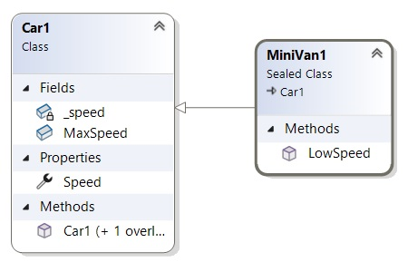
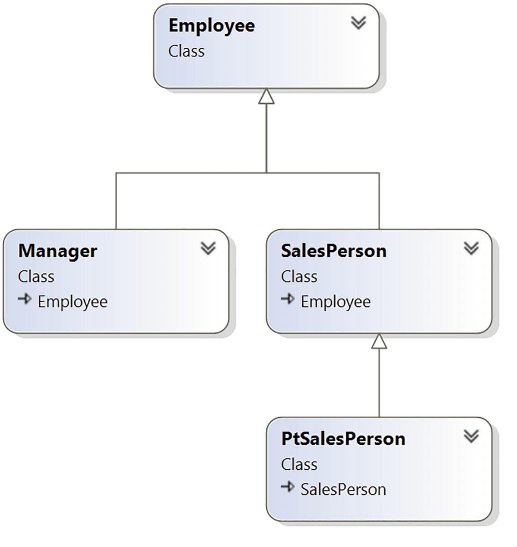
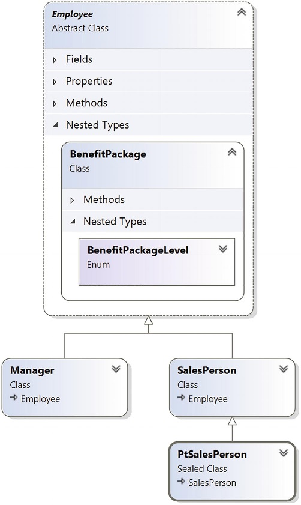
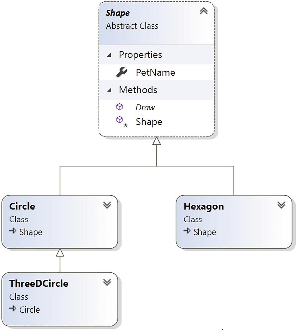

# Розуміння успадкування та поліморфізму

У попередньому розділі розглядався перший стовп ООП: інкапсуляція. Ви навчилися створювати єдиний чітко визначений тип класу з конструкторами та різними членами (полями, властивостями, методами, константами та полями лише для читання). У цій главі буде зосереджено на двох стовпах ООП, що залишилися: спадкуванні та поліморфізмі.
По-перше, ви дізнаєтесь, як створювати родини споріднених класів за допомогою успадкування.Як ви побачите, ця форма повторного використання коду дозволяє вам визначати загальну функціональність у батьківському класі, яка може бути використана та, можливо, змінена дочірніми класами. Попутно ви дізнаєтеся, як створити поліморфний інтерфейс в ієрархії класів за допомогою віртуальних і абстрактних членів, а також дізнаєтесь про роль явного приведення. 
Розділ закінчиться вивченням ролі кінцевого батьківського класу в бібліотеках базових класів .NET: System.Object.

# Розуміння основної механіки успадкування

Успадкування — це аспект ООП, який полегшує повторне використання коду. Зокрема, повторне використання коду має два варіанти: успадкування (відношення «is-a») і модель обмеження/делегування (відношення «has-a»). Давайте почнемо цю главу з вивчення класичної моделі успадкування зв’язку «is-a».
Коли ви встановлюєте зв’язки «is-a» між класами, ви створюєте залежність між двома або більше типами класів. Основна ідея класичного успадкування полягає в тому, що нові класи можна створювати, використовуючи існуючі класи як відправну точку.

Для початку з простого прикладу створіть новий проект консольної програми під назвою BasicInheritance. Тепер припустімо, що ви розробили клас під назвою Car, який моделює деякі основні деталі автомобіля.

```cs
namespace BasicInheritance;

class Car1
{
    public readonly int MaxSpeed;
    private int _speed;

    public int Speed
    {
        get => _speed;
        set
        {
            _speed = value;
            if (_speed > MaxSpeed)
            {
                _speed = MaxSpeed;
            }
        }
    }

    public Car1(int maxSpeed)
    {
        MaxSpeed = maxSpeed;
    }
    public Car1()
    {
        MaxSpeed = 55;
    }
}
```

Зверніть увагу, що клас Car використовує служби інкапсуляції для керування доступом до приватного поля _speed ​​за допомогою загальнодоступної властивості Speed. На цьому етапі ви можете використовувати свій тип автомобіля таким чином:

```cs
using BasicInheritance;

void UsingClassCar1()
{
    // Make a Car object, set max speed and current speed.
    Car1 car = new Car1(80) { Speed = 50};
    // Print current speed.
    Console.WriteLine($"My car is going {car.Speed} MPH");
}
UsingClassCar1();
```
```
My car is going 50 MPH
```

## Визначення батьківського класу існуючого класу

Припустімо, ви хочете створити новий клас під назвою MiniVan. Як і базовий Car, ви хочете визначити клас MiniVan для підтримки даних про максимальну швидкість, поточну швидкість і властивість під назвою Speed, щоб дозволити користувачеві об’єкта змінювати стан об’єкта. Очевидно, що класи Car і MiniVan пов’язані між собою; фактично, можна сказати, що MiniVan "is-a" тип Car. Відношення «is-a» (офіційно називається класичним успадкуванням) дозволяє створювати нові визначення класу, які розширюють функціональність існуючого класу.

Існуючий клас, який слугуватиме основою для нового класу, називається базовим класом, суперкласом або батьківським класом. Роль базового класу полягає у визначенні всіх загальних даних і членів для класів, які його розширюють. Класи розширення формально називаються похідними або дочірніми класами. У C# ви використовуєте оператор двокрапки у визначенні класу, щоб встановити зв’язок «is-a» між класами. 

Припустімо, ви створили такий новий клас MiniVan:

```cs
namespace BasicInheritance;

class MiniVan1 : Car1
{
}
```
Наразі цей новий клас не визначив жодного члена. Отже, що ви отримали, розширивши свій MiniVan з базового класу Car? Простіше кажучи, об’єкти MiniVan тепер мають доступ до кожного відкритого члена, визначеного в батьківському класі.

Хоча конструктори зазвичай визначаються як публічні, похідний клас ніколи не успадковує конструктори батьківського класу. Конструктори використовуються для створення лише класу, у якому вони визначені, хоча вони можуть бути викликані похідним класом через ланцюжок конструкторів. 

Враховуючи зв’язок між цими двома типами класів, тепер ви можете використовувати клас MiniVan так:

```cs
void UsingMiniVan1()
{
    // Don't work
    //MiniVan1 miniVan = new(100) { Speed = 50 };

    // Now make a MiniVan object.
    MiniVan1 miniVan = new() { Speed = 50 };
    Console.WriteLine($"My van is going {miniVan.Speed}");
}
UsingMiniVan1();
```
```
My van is going 50
```
Ще раз зауважте, що хоча ви не додали жодного члена до класу MiniVan, у вас є прямий доступ до загальнодоступної властивості Speed ​​вашого батьківського класу, тому ви повторно використовували код. Ще раз зауважте, що хоча ви не додали жодного члена до класу MiniVan, у вас є прямий доступ до загальнодоступної властивості Speed ​​вашого батьківського класу, тому ви повторно використовували код. Це набагато кращий підхід, ніж створення класу MiniVan, який має ті самі члени, що й Car, наприклад властивість Speed. Якби ви створили дублікат коду між цими двома класами, вам потрібно було б тепер підтримувати два тіла коду, що, безумовно, є нецільовим використанням вашого часу. Завжди пам’ятайте, що спадкування зберігає інкапсуляцію; отже, наступний код призводить до помилки компілятора, оскільки приватні члени ніколи не можуть бути доступні з посилання на об’єкт:

```cs
    MiniVan1 miniVan1 = new();
    miniVan1.Speed = 30;
    Console.WriteLine($"My van is going {miniVan.Speed}");

    // Error! Can't access private members! 
    //miniVan1._speed = 70;
```
У зв’язку з цим, якби MiniVan визначив власний набір членів, він усе одно не мав би доступу до жодного приватного члена базового класу Car. Пам’ятайте, доступ до приватних членів може отримати лише клас, який їх визначає. Наприклад, такий метод у MiniVan призведе до помилки компілятора:

```cs
class MiniVan1 : Car1
{

    public void LowSpeed()
    {
        // Error! Cannot access private
        // members of parent within a derived type.
        //_speed = 10;

        // OK! Can access public members
        // of a parent within a derived type.
        Speed = 10;
    }
}
```

### Щодо кількох базових класів

Говорячи про базові класи, важливо мати на увазі, що C# вимагає, щоб даний клас мав рівно один прямий базовий клас. Неможливо створити тип класу, який безпосередньо походить від двох або більше базових класів (цей прийом, який підтримується в некерованому C++, відомий як множинне успадкування або просто MI). Якщо ви спробуєте створити клас, який визначає два прямі батьківські класи, як показано в наведеному нижче коді, ви отримаєте помилки компілятора:

```cs
// Illegal! C# does not allow
// multiple inheritance for classes!
class MyClass
  : BaseClassOne, BaseClassTwo
{}
```
Як ви побачите в розділі "Робота з інтерфейсами", платформа .NET Core дійсно дозволяє певному класу або структурі реалізувати будь-яку кількість дискретних інтерфейсів. Таким чином, тип C# може демонструвати ряд поведінки, уникаючи складнощів, пов’язаних з MI. Використовуючи цю техніку, ви можете побудувати складні ієрархії інтерфейсів, які моделюють складну поведінку.

## Використання ключового слова sealed (запечатаний, закритий).

C# надає інше ключове слово, запечатане, яке запобігає успадкуванню. Коли ви позначаєте клас як закритий, компілятор не дозволить вам успадкуватися від цього типу. Наприклад, припустимо, що ви вирішили, що немає сенсу далі розширювати клас MiniVan.

```cs
sealed class MiniVan1 : Car1
{
    //...
}
```
Якби ви (або ваш товариш по команді) спробували отримати від цього класу, ви отримали б помилку під час компіляції.

```cs
// Error! Cannot extend
// a class marked with the sealed keyword!
class DeluxeMiniVan
  : MiniVan1
{
}
```
Найчастіше запечатування класу має найкращий сенс, коли ви проектуєте службовий(utility) клас. Наприклад, простір імен System визначає численні запечатані класи, наприклад клас String. Таким чином, як і MiniVan, якщо ви спробуєте створити новий клас, який розширює System.String, ви отримаєте помилку під час компіляції.

```cs
// Another error! Cannot extend
// a class marked as sealed!
class MyString
  : String
{
}
```

Структури C# завжди неявно запечатані. Таким чином, ви ніколи не можете вивести одну структуру з іншої структури, клас із структури або структуру з класу. Структури можна використовувати для моделювання лише окремих, атомарних, визначених користувачем типів даних. Якщо ви хочете використовувати зв’язок «is-a», ви повинні використовувати класи.

Як ви здогадуєтеся, є багато інших деталей про успадкування, які ви дізнаєтеся протягом решти цього розділу. Наразі просто майте на увазі, що оператор двокрапки дозволяє вам встановлювати зв’язки базовий/похідний клас, тоді як ключове слово sealed запобігає подальшому успадкуванню.

## Visual Studio Class Diagrams

Visual Studio дозволяє візуально встановлювати зв’язки базового/похідного класу під час розробки. Щоб скористатися цим аспектом IDE, ваш перший крок — включити новий файл діаграми класів у ваш поточний проект. Для цього перейдіть до пункту меню Project ➤ Add New Item і клацніть піктограму Class Diagram.
Після цього ви побачите порожню поверхню дизайнера. Щоб додати типи до конструктора класів, просто перетягніть кожен файл із вікна Solution Explorer на поверхню. Також пам’ятайте, що якщо ви видалите елемент із візуального дизайнера (просто вибравши його та натиснувши клавішу Delete), це не знищить пов’язаний вихідний код, а просто видалить елемент із поверхні дизайнера.
На малюнку показано поточну ієрархію класів.



Окрім простого відображення зв’язків типів у вашій поточній програмі, ви також можете створювати нові типи та заповнювати їхні члени за допомогою панелі інструментів Class Designer та вікна Class Details.

Якщо ви хочете використовувати ці візуальні інструменти протягом решти книги, не соромтеся. Однак завжди переконайтеся, що ви аналізуєте згенерований код, щоб мати чітке розуміння того, що ці інструменти зробили від вашого імені.

# Розуміння другого стовпа ООП: успадкування детально

Тепер, коли ви ознайомилися з основним синтаксисом успадкування, давайте створимо більш складний приклад і познайомимося з численними деталями побудови ієрархії класів. Для цього ви повторно використаєте клас Employee, розроблений у попередьному розділі. Для початку створіть новий проект C# Console Application під назвою EmployeeApp. Скопіюємо або створимо  файли класів.

EmployeePayTypeEnum.cs
```cs
namespace EmployeeApp;

public enum EmployeePayTypeEnum
{
    Hourly,
    Salaried,
    Commission
} 
```
Employee6.Core.cs
```cs
namespace EmployeeApp;

partial class Employee6
{
    // Field data
    private string _name = null!;
    private string _SSN = null!;

    // Properties
    public int Id { get; set; }
    public string Name
    {
        get => _name;
        set
        {
            if (value.Length > 15)
            {
                Console.WriteLine("Error! Name length exceeds 15 characters!");
            }
            else
            {
                _name = value;
            }
        }
    }
    public float Pay { get; set; }
    public int Age { get; set; }
    public string SSN => _SSN;
    public EmployeePayTypeEnum PayType {  get; set; }

    //Constructors
    public Employee6(int id, string name, float pay, int age, string ssn,
        EmployeePayTypeEnum payType)
    {
        Id = id;
        Name = name;
        Pay = pay;
        Age = age;
        _SSN = ssn;
        PayType = payType;
    }
    public Employee6(int id, string name, float pay) :
        this(id, name, pay, 0, "", EmployeePayTypeEnum.Salaried)
    { }
    public Employee6() { }
}
```
Employee6.cs
```cs
namespace EmployeeApp;

partial class Employee6
{
    // Mathods
    public void GiveBonus(float amount)
    {
        Pay = this switch
        {
            { Age: >= 18, PayType: EmployeePayTypeEnum.Commission }
            => Pay += 0.10F * amount,
            { Age: >= 18, PayType: EmployeePayTypeEnum.Hourly }
            => Pay += 40F * amount / 2080F,
            { Age: >= 18, PayType: EmployeePayTypeEnum.Salaried }
            => Pay += amount,
            _ => Pay += 0
        };
    }

    public void DisplayStatus()
    {
        Console.WriteLine($"{Id}\t{Name}\t{Age}\t{Pay}");
    }
}
```

За допомогою .NET Core усі файли в поточній структурі каталогів автоматично включаються у ваш проект. Простого копіювання двох файлів з іншого проекту в поточний каталог проекту достатньо, щоб включити їх до вашого проекту.

Оскільки назви проектів співпадають простори імен в файлах теж співпадають. 

```cs
namespace EmployeeApp;

partial class Employee6
{
    //...
}
```
Для перевірки використаємо метод

```cs
void UsingEmployee6Class()
{
    Employee6 employee = new(23, "Marvin", 1000, 35,
        "111 - 11 - 1111", EmployeePayTypeEnum.Salaried);
    employee.DisplayStatus();
    employee.GiveBonus(100);
    employee.DisplayStatus();
}
UsingEmployee6Class();
```
```
23      Marvin  35      1000
23      Marvin  35      1100
```
Наша мета — створити сімейство класів, які моделюють різні типи працівників компанії. Припустімо, ви хочете використати функціональність класу Employee для створення двох нових класів (SalesPerson і Manager). Новий клас SalesPerson «is-an» Employee (як і Manager). Пам’ятайте, що за класичною моделлю успадкування базові класи (такі як Employee) використовуються для визначення загальних характеристик, спільних для всіх нащадків. Підкласи (такі як SalesPerson і Manager) розширюють цю загальну функціональність, додаючи більш специфічну функціональність. У нашому прикладі ви припустите, що клас Manager розширює Employee, записуючи кількість опціонів на акції, тоді як клас SalesPerson зберігає кількість здійснених продажів.

Вставте новий файл класу, який визначає клас Manager із такою автоматичною властивістю:

```cs
namespace EmployeeApp;
// Managers need to know their number of stock options.
class Manager6 :Employee6
{
    public int StockOptions { get; set; }
}

```
Далі додайте ще один новий файл класу (SalesPerson.cs), який визначає клас SalesPerson із відповідною автоматичною властивістю.

```cs
namespace EmployeeApp;
// Salespeople need to know their number of sales.
class SalesPerson6
{
    public int SalesNumber { get; set; }
}

```
Тепер, коли ви встановили зв’язок «is-a», SalesPerson і Manager автоматично успадкували всіх відкритих членів базового класу Employee. Щоб проілюструвати, оновіть Program.cs:

```cs
void UsingSalesPerson6()
{
    SalesPerson6 salesPerson = new()
    {
        Name = "Fred",
        Age = 31,
        SalesNumber = 50
    };

    salesPerson.DisplayStatus();
}
UsingSalesPerson6();
```
```
0       Fred    31      0
```

## Виклик конструкторів базового класу за допомогою ключового слова base

Наразі SalesPerson і Manager можна створити лише за допомогою конструктора за замовчуванням «халявного» без параметрів. Маючи це на увазі, припустимо, що ви рішили додали новий конструктор із семи аргументів до типу Manager. Для цього ви можете реалізувати цей спеціальний конструктор у класі Manager наступним чином:

```cs
    public Manager6(int id, string name, float pay, int age, string ssn, 
        EmployeePayTypeEnum payType, int stockOptions )
    {
        // This property is defined by the Manager class.
        StockOptions = stockOptions;

        // Assign incoming parameters using the
        // inherited properties of the parent class.
        Id = id;
        Name = name;
        Pay = pay;
        Age = age;
        // OOPS! This would be a compiler error,
        // if the SSN property were read-only! 
        _SSN = ssn;
        PayType = payType;
    }
```
Якщо ви подивитеся на список параметрів, то чітко побачите, що більшість цих аргументів мають зберігатися в змінних-членах, визначених базовим класом Employee.
Перша проблема з цим підходом полягає в тому, що якщо ви визначили будь-яку властивість як доступну лише для читання (наприклад, властивість SocialSecurityNumber), ви не можете призначити параметр вхідного рядка цьому полю, як показано в кінцевому операторі коду цього спеціального конструктора.
Друга проблема полягає в тому, що ви опосередковано створили досить неефективний конструктор, враховуючи, що в C#, якщо ви не вкажете інше, конструктор за замовчуванням базового класу викликається автоматично перед виконанням логіки похідного конструктора. Після цього моменту поточна реалізація отримує доступ до багатьох загальнодоступних властивостей базового класу Employee, щоб встановити його стан. Таким чином, ви справді зробили вісім звернень (шість успадкованих властивостей і два виклики конструктора) під час створення об’єкта Manager! 
Щоб оптимізувати створення похідного класу, вам буде краще застосувати ваші конструктори підкласів, щоб явно викликати відповідний настроюваний конструктор базового класу, а не типовий. Таким чином ви можете зменшити кількість викликів успадкованих членів ініціалізації (що економить час обробки).
По-перше, переконайтеся, що ваш батьківський клас Employee має такий конструктор із шістьма аргументами:

```cs
public Employee6(int id, string name, float pay, int age, string ssn,
    EmployeePayTypeEnum payType)
{
    Id = id;
    Name = name;
    Pay = pay;
    Age = age;
    _SSN = ssn;
    PayType = payType;
}
```
Тепер давайте модернізуємо спеціальний конструктор типу Manager, щоб викликати цей конструктор за допомогою ключового слова base.

```cs
    public Manager6(int id, string name, float pay, int age, string ssn, 
         int stockOptions) 
        : base(id, name, pay, age, ssn, EmployeePayTypeEnum.Salaried)
    {
        StockOptions = stockOptions;
    }
```
Тут ключове слово base залежить від сігнатури конструктора (подібно до синтаксису, який використовується для об’єднання конструкторів в один клас за допомогою ключового слова this), що завжди вказує на те, що похідний конструктор передає дані безпосередньо у батьковій конструктор. У цій ситуації ви явно викликаєте конструктор із шістьма параметрами, визначений Employee, і заощаджуєте собі непотрібні виклики під час створення дочірнього класу. Крім того, ви додали особливу поведінку до класу менеджера, оскільки тип оплати завжди встановлюється на Salaried.
Настроюваний конструктор SalesPerson виглядає майже ідентично, за винятком того, що для типу оплати встановлено Commission.

```cs
    public SalesPerson6(int id, string name, float pay, int age, string ssn, 
        int salesNumber) 
        : base(id, name, pay, age, ssn, EmployeePayTypeEnum.Commission)
    {
        SalesNumber = salesNumber;
    }
```
Ви можете використовувати ключове слово base щоразу, коли підклас хоче отримати доступ до публічного або захищеного члена, визначеного батьківським класом. Використання цього ключового слова не обмежується логікою конструктора. Ви побачите приклади використання бази таким чином під час дослідження поліморфізму, далі в цій главі.
Зрештою, пам’ятайте, що коли ви додаєте власний конструктор до визначення класу, конструктор за замовчуванням мовчки видаляється. Тому обов’язково перевизначте конструктор за замовчуванням для типів SalesPerson і Manager. Ось приклад:

```cs
void CallingBaseClassConstructors()
{
    Manager6 manager = new Manager6(5, "Alexandr", 1000, 35, "1234-234-32",
        EmployeePayTypeEnum.Commission, 123);
    manager.DisplayStatus();
}
CallingBaseClassConstructors();
```
```
5       Alexandr        35      1000
```

## Зберігання сімейних таємниць: ключове слово protected

Як ви вже знаєте, public елементи доступні з будь-якого місця, тоді як private елементи можуть бути доступні лише для класу, який їх визначив. C# бере на себе лідерство серед багатьох інших сучасних об’єктних мов і надає додаткове ключове слово для визначення доступності учасників: protected.
Коли базовий клас визначає protected дані або protected члени, він встановлює набір елементів, до яких може отримати прямий доступ будь-який нащадок. Якщо ви хочете дозволити дочірнім класам SalesPerson і Manager прямий доступ до сектора даних, визначеного Employee, ви можете оновити оригінальне визначення класу Employee (у файлі EmployeeCore.cs) таким чином:

```cs
partial class Employee7
{
    // Field data
    protected string name = null!;
    protected string ssn = null!;
    //...

}    
```
Згідно з умовами, захищені члени мають назву PascalCased (EmpName), а не underscore-camelCase (_empName). Це не вимога мови, а загальний стиль коду.

Перевага визначення захищених членів у базовому класі полягає в тому, що похідним типам більше не потрібно опосередковано отримувати доступ до даних за допомогою публічних методів або властивостей. Звичайно, можлива помилка полягає в тому, що коли похідний тип має прямий доступ до внутрішніх даних свого батька, можна випадково обійти існуючі бізнес-правила, знайдені в загальнодоступних властивостях. Коли ви визначаєте захищені члени, ви створюєте рівень довіри між батьківським класом і дочірнім класом, оскільки компілятор не виявить жодних порушень бізнес-правил вашого типу. 
Нарешті, зрозумійте, що щодо користувача об’єкта захищені дані вважаються приватними (оскільки користувач знаходиться «поза» родиною).

```cs
void TheProtectedKeyword()
{
    Employee7 employee = new();
    // Error! Can't access protected data from client code.
    employee.name = "John";
}
```
Хоча захищені дані поля можуть порушити інкапсуляцію, досить безпечно (і корисно) визначати захищені методи. Під час побудови ієрархії класів зазвичай визначають набір методів, які призначені лише для використання похідними типами і не призначені для використання зовнішнім світом.

## Додавання sealed класу

Запечатаний(sealed) клас не може бути розширений іншими класами. Як згадувалося, цей прийом найчастіше використовується, коли ви проектуєте utility(корисний) клас. Однак під час побудови ієрархії класів ви можете виявити, що певну гілку в ланцюжку успадкування слід «закрити», оскільки немає сенсу далі розширювати родовід. Наприклад, припустімо, що ви додали ще один клас до своєї програми (PtSalesPerson), який розширює існуючий тип SalesPerson.



PtSalesPerson — це клас, який, звісно, ​​представляє продавця, який працює неповний робочий день. Для аргументації, скажімо, ви хочете переконатися, що жоден інший розробник не зможе створити підклас від PTSalesPerson. Щоб заборонити іншим розширювати клас, використовуйте ключове слово sealed.

```cs
namespace EmployeeApp;

sealed class PtSalesPerson6 : SalesPerson6
{
    public PtSalesPerson6(int id, string name, float pay, int age, string ssn, int salesNumber) 
        : base(id, name, pay, age, ssn, salesNumber)
    {
    }
    
}
```

# Розуміння успадкування з record

Типи record також підтримують успадкування. Щоб дослідити це, додайте новий проект із типом consoleapp під назвою RecordInheritance.

## Спадкування для типів record зі стандартними властивостями

Додайте два нових файли з іменами Car1.cs і MiniVan1.cs і додайте такий код визначення запису до відповідних файлів:

```cs
public record Car1
{
    public string Make { get; init; } = null!;
    public string Model { get; init; } = null!;
    public string Color { get; init; } = null!;

    public Car1(string make, string model, string color)
    {
        Make = make;
        Model = model;
        Color = color;
    }
}
```
```cs
namespace RecordInheritance;

public sealed record MiniVan1 : Car1
{
    public int Seating {  get; set; }

    public MiniVan1(string make, string model, string color, int seating) 
        : base(make, model, color)
    {
        Seating = seating;
    }
}
```
Зверніть увагу, що між цими прикладами використання типів записів і попередніми прикладами використання класів немає великої різниці. Модифікатор sealed для типу запису запобігає похідним від інших типів записів із запечатаних типів записів. Незважаючи на те, що він не використовується в перелічених прикладах, модифікатор protected до властивостей і методів поводиться так само, як із успадкуванням класу. Це пояснюється тим, що типи записів є лише особливим типом класу.
Типи записів також включають неявні приведення до свого базового класу, як показано в наступному коді:

```cs
using RecordInheritance;

void ImplicitCastsRecords()
{
    Car1 c = new Car1("Honda", "Pilot", "Blue");
    MiniVan1 m = new MiniVan1("Honda", "Pilot", "Blue", 10);
    Console.WriteLine($"Checking MiniVan is-a Car:{m is Car1}");
}
ImplicitCastsRecords();
```
```
Checking MiniVan is-a Car:True
```
Важливо зазначити, що навіть якщо типи записів є спеціалізованими класами, ви не можете перехресно успадкувати між класами та записами. Щоб було зрозуміло, класи не можуть успадковувати типи записів, а типи записів не можуть успадковуватись від класів. Розглянемо наступний код і зауважимо, що останні два приклади не компілюються:

```cs
namespace RecordInheritance;
public class TestClass { }
public record TestRecord { }
//Classes cannot inherit records
//public class Test2 : TestRecord { }
//Records types cannot inherit from classes
//public record Test2 : TestClass {  }
```

## Успадкування для типів record із позиційними параметрами

Спадкування також працює з типами позиційних записів. Похідний record оголошує позиційні параметри для всіх параметрів у базовому записі. Похідний record не приховує їх, а використовує з базового запису. Похідний record лише створює та ініціалізує властивості, яких немає в базовому. Щоб побачити це в дії, створіть новий файл. Додайте наступний код у свій файл:

```cs
namespace RecordInheritance;

public record Car2(string Make, string Model, string Color);
public record MiniVan2(string Make, string Model, string Color,int Seating)
    : Car2(Make, Model,Color);


public record MotorCycle(string Make, string Model);
public record Scooter(string Make, string Model):MotorCycle(Make, Model);
public record FancyScooter(string Make, string Model, string FancyColor)
    : Scooter(Make, Model);
```

Спробуємо використати.

```cs
void UsingPosotionalRecord()
{
    MiniVan2 vito = new MiniVan2("Mercedes", "Vito 110", "DarkGrey", 18);
    Console.WriteLine(vito);

    FancyScooter scooter = new FancyScooter("Honda", "Reveals","Red-Blue");
    Console.WriteLine(scooter);
}
UsingPosotionalRecord();
```
```
MiniVan2 { Make = Mercedes, Model = Vito 110, Color = DarkGrey, Seating = 18 }
FancyScooter { Make = Honda, Model = Reveals, FancyColor = Red-Blue }
```

## Мутація без деконструкції з успадкованими типами record

Під час створення нових екземплярів типу record за допомогою виразу with результуючий тип record є тим самим типом часу виконання операнда. Візьмемо такий приклад:

```cs
void NondestructiveMutationWithInheritedRecord()
{
    MotorCycle motorCycle1 = new FancyScooter("Harley", "Lowrider", "Gold");
    Console.WriteLine(motorCycle1);
    Console.WriteLine($"motorCycle1 is FancyScooter :{motorCycle1 is FancyScooter}");

    MotorCycle motorCycle2 = motorCycle1 with { Model = "Low Rider S" };
    Console.WriteLine(motorCycle2);
    Console.WriteLine($"motorCycle2 is FancyScooter :{motorCycle2 is FancyScooter}");
}
NondestructiveMutationWithInheritedRecord();
```
```
FancyScooter { Make = Harley, Model = Lowrider, FancyColor = Gold }
motorCycle1 is FancyScooter :True
FancyScooter { Make = Harley, Model = Low Rider S, FancyColor = Gold }
motorCycle2 is FancyScooter :True
```

## Рівність із успадкованими типами record

Типи записів використовують семантику значення для визначення рівності. Ще одна деталь щодо типів записів полягає в тому, що тип запису є частиною розгляду рівності. Візьміть до уваги попередні типи MotorCycle і Scooter:

```cs
public record MotorCycle(string Make, string Model);
public record Scooter(string Make, string Model):MotorCycle(Make, Model);
```
Ігноруючи той факт, що зазвичай успадковані класи розширюють базові класи, ці прості приклади визначають два різні типи записів, які мають однакові властивості. Під час створення екземплярів з однаковими значеннями властивостей вони не проходять перевірку на рівність через те, що є різними типами. Візьмемо, наприклад, такий код і результати:

```cs
void EqualityWithInheritedRecord()
{
    MotorCycle motorCycle = new MotorCycle("Harley", "Low Rider");
    MotorCycle scooter = new Scooter("Harley", "Low Rider");
    Console.WriteLine($"MotorCycle and Scooter are equal: {Equals(motorCycle,scooter)}");
    Console.WriteLine(motorCycle);
    Console.WriteLine(scooter);
}
EqualityWithInheritedRecord();
```
```
MotorCycle and Scooter are equal: False
MotorCycle { Make = Harley, Model = Low Rider }
Scooter { Make = Harley, Model = Low Rider }

```
Зверніть увагу, що змінні оголошено як типи записів MotorCycle. Незважаючи на це, типи не однакові, оскільки типи середовища виконання різні.

## Поведінка деконструктора з успадкованими типами record

Метод Deconstruct() похідного record повертає значення всіх позиційних властивостей оголошеного типу під час компіляції. Однак, якщо змінна приведена до похідного типу, тоді всі позиційні властивості похідного типу деконструюються, як показано тут:

```cs
void DeconstructorBehaviorWithInheritedRecord()
{
    MotorCycle motorCycle = new FancyScooter("Harley", "Low rider", "Gold");
    var (make1, model1) = motorCycle;
    Console.WriteLine(make1+"\t"+model1);

    // You need to cast the variable to the derived type
    var (make2, model2,color2) = (FancyScooter)motorCycle;
    Console.WriteLine(make2 + "\t" + model2+"\t"+color2);
}
DeconstructorBehaviorWithInheritedRecord();
```
```
Harley  Low rider
Harley  Low rider       Gold
```

## Програмування для утримання/делегування

Повторне використання коду буває двох варіантів. Ви щойно дослідили класичне співвідношення «is-a». Перш ніж вивчати третій стовп ООП (поліморфізм), давайте розглянемо зв’язок «має» (також відомий як модель утримання/делегування або агрегації).
Повертаючись до проекту EmployeeApp, створіть новий файл під назвою BenefitPackage.cs і додайте код для моделювання пакета пільг для співробітників, як показано нижче:

```cs
namespace EmployeeApp;

// This new type will function as a contained class
class BenefitPackage
{
    // Assume we have other members that represent
    // dental/health benefits, and so on.
    public double ComputePayDeduction()
    {
        return 125.0;
    }
}

```

Очевидно, було б досить дивно встановити зв’язок «is-a» між класом BenefitPackage і типами співробітників. Однак має бути зрозуміло, що між ними можуть бути встановлені певні стосунки. Коротше кажучи, ви хотіли б висловити ідею, що кожен працівник «has-a» BenefitPackage. Для цього ви можете оновити визначення класу Employee таким чином:

Employee7.Core.cs
```cs
partial class Employee7
{
    // Field data
    //...

    protected BenefitPackage employeeBenefits = new();
    // ...
}
```
На цьому етапі ви успішно розмістили інший об’єкт. Однак надання зовнішньому світу функціональності об’єкта, що міститься, вимагає делегування. Делегування — це просто акт додавання публічних членів до класу-вмісту, які використовують функціональні можливості вміщеного об’єкта. Наприклад, ви можете оновити клас Employee, щоб відкрити об’єкт empBenefits, що міститься, за допомогою спеціальної властивості, а також використовувати його функціональні можливості всередині за допомогою нового методу під назвою GetBenefitCost().

Employee7.Core.cs
```cs
partial class Employee7
{
    // Field data
    // ...
    protected BenefitPackage employeeBenefits = new();

    // Properties
    //...
    public BenefitPackage Benefits 
    { 
        get => employeeBenefits; 
        set => employeeBenefits = value; 
    }    
    // ...
}

Employee7.cs
```cs
partial class Employee7
{
    // Mathods
    //...

    // Expose certain benefit behaviors of object.
    public double GetBenefitCost() => employeeBenefits.ComputePayDeduction();
}
```
У наступному оновленому коді зверніть увагу на те, як можна взаємодіяти з внутрішнім типом BenefitsPackage, визначеним типом Employee:

```cs
void ClassUseOtherClass()
{
    Manager7 manager = new Manager7(15, "John", 100000, 50, "333-23-2322", 9000);
    manager.DisplayStatus();
    Console.WriteLine($"Benefit Cost:{manager.GetBenefitCost()}");
}
ClassUseOtherClass();
```
```
15      John    50      100000
Benefit Cost:125
```

## Розуміння визначень вкладених типів

Концепція вкладених типів — це розгортання зв’язку «has-a», який ви щойно розглянули. У C# (як і в інших мовах .NET) можна визначити тип (enum, клас, інтерфейс, структуру або делегат) безпосередньо в межах класу або структури. Коли ви це зробите, вкладений (або «inner») тип вважається членом в який вкладається (або «outer») класу, і в очах середовища виконання ним можна маніпулювати, як і будь-яким іншим членом (поля, властивості, методи, та події). Синтаксис, який використовується для вкладення типу, досить простий.

```cs
public class OuterClass
{
  // A public nested type can be used by anybody.
  public class PublicInnerClass {}
  // A private nested type can only be used by members
  // of the containing class.
  private class PrivateInnerClass {}
}
```
Хоча синтаксис досить зрозумілий, зрозуміти, чому ви хочете це зробити, може бути неочевидним.

    Вкладені типи дозволяють отримати повний контроль над рівнем доступу внутрішнього типу, оскільки вони можуть бути оголошені приватно (нагадаємо, що невкладені класи не можуть бути оголошені за допомогою ключового слова private).

    Оскільки вкладений тип є членом класу, що містить, він може отримати доступ до приватних членів класу, що містить.

    Часто вкладений тип корисний лише як помічник для зовнішнього класу і не призначений для використання зовнішнім світом.

Коли тип вкладає інший тип класу, він може створювати змінні-члени цього типу, як це було б для будь-якої точки даних. Однак, якщо ви хочете використовувати вкладений тип поза типом, що містить, ви повинні кваліфікувати його за сферою дії типу вкладення. Розглянемо наступний код:

```cs
// Create and use the public inner class. OK!
OuterClass.PublicInnerClass inner;
inner = new OuterClass.PublicInnerClass();
// Compiler Error! Cannot access the private class.
OuterClass.PrivateInnerClass inner2;
inner2 = new OuterClass.PrivateInnerClass();
```

Щоб використати цю концепцію в прикладі працівника, припустімо, що тепер ви вклали BenefitPackage безпосередньо в тип класу Employee.

Employee7.Core.cs
```cs
partial class Employee7
{
    //...
    // Class member
    public class BenefitPackage
    {
        public double ComputePayDeduction()
        {
            return 125.0;
        }
    }
    //...
}
```
Процес вкладення може бути настільки «глибоким», як вам потрібно. Наприклад, припустімо, що ви хочете створити перелік під назвою BenefitPackageLevel, який документує різні рівні виплат, які може вибрати працівник. Щоб програмно забезпечити тісний зв’язок між Employee, BenefitPackage і BenefitPackageLevel, ви можете вкласти перерахування таким чином:

```cs
partial class Employee7
{
    //...
    // Class member
    public class BenefitPackage
    {
        public enum BenefitPackageLevel
        {
        Standard, Gold, Platinum
        }

        public double ComputePayDeduction()
        {
            return 125.0;
        }
    }
    //...
}
```
Через взаємозв’язки вкладеності зверніть увагу на те, як ви повинні використовувати цей перелік

```cs
void ClassUseOtherClass()
{

    //...

    Employee7.BenefitPackage.BenefitPackageLevel packageLevel =
        Employee7.BenefitPackage.BenefitPackageLevel.Platinum;
    Console.WriteLine(packageLevel);
}
ClassUseOtherClass();

```
```
...
Platinum
```
На цьому етапі ви познайомилися з низкою ключових слів (і концепцій), які дозволяють вам будувати ієрархії пов’язаних типів за допомогою класичного успадкування, утримування та вкладених типів. Якщо деталі зараз нечіткі, не переймайтеся. До кінця ви побудуєте ряд додаткових ієрархій. Далі розглянемо останній стовп ООП: поліморфізм.

# Розуміння третьої основи ООП: підтримка поліморфізма в C#

Нехай в базовий класі Employee визначив метод під назвою GiveBonus(), який реалізований як спочату наступним чином :

```cs
    public void GiveBonus(float amount)
    {
        Pay += amount;
    }
```
Оскільки цей метод було визначено за допомогою ключового слова public, тепер ви можете надавати бонуси продавцям і менеджерам (а також продавцям, які працюють неповний робочий день).

```cs
void UsingGiveBonus()
{
    Manager7 manager = new(3, "Jack", 100000, 50, "3256-56-2536", 9000);
    manager.GiveBonus(300);
    manager.DisplayStatus();

    SalesPerson7 salesPerson = new(8, "Olga", 3000, 35, "2342-34-3432", 31);
    salesPerson.GiveBonus(200);
    salesPerson.DisplayStatus();
}
UsingGiveBonus();
```
```
3       Jack    50      100300
8       Olga    35      3200
```
Проблема з поточним дизайном полягає в тому, що публічно успадкований метод GiveBonus() працює однаково для всіх підкласів. В ідеалі бонус продавця повинен враховувати кількість продажів. Можливо, менеджерам варто отримати додаткові опціони на акції в поєднанні з підвищенням зарплати. Враховуючи це, ви раптом стикаєтеся з цікавим питанням: «Як споріднені типи можуть по-різному відповідати на той самий запит?»

## Використання virtual і override ключових слів

Поліморфізм надає можливість для підкласу визначати власну версію методу, визначеного його базовим класом, використовуючи процес, який називається перевизначенням методу. Щоб модернізувати свій поточний дизайн, вам потрібно зрозуміти значення ключових слів virtual і override. Якщо базовий клас хоче визначити метод, який може бути (але не обов’язково) перевизначений підкласом, він повинен позначити метод ключовим словом virtual.

```cs
 // This method can now be 'overridden' by a derived class.
 public virtual void GiveBonus(float amount)
 {
     Pay += amount;
 }
```
Методи, позначені ключовим словом virtual, називаються віртуальними методами. Коли підклас хоче змінити деталі реалізації віртуального методу, він робить це за допомогою ключового слова override. Наприклад, SalesPerson і Manager можуть замінити GiveBonus() наступним чином (припустимо, що PTSalesPerson не замінить GiveBonus() і, отже, просто успадковує версію, визначену SalesPerson):

```cs
class SalesPerson7 : Employee7
{

    //...

    public override void GiveBonus(float amount)
    {
        int salesBonus = 0;

        if (SalesNumber >= 0 && SalesNumber <= 100)
        {
            salesBonus = 10;
        }
        else
        {
            if (SalesNumber >= 101 && SalesNumber <= 200)
            {
                salesBonus = 15;
            }
            else
            {
                salesBonus = 20;
            }
        }
        base.GiveBonus(amount*salesBonus);
    }
}
```
```cs
class Manager7 :Employee7
{
 
    //...

    public override void GiveBonus(float amount)
    {
        base.GiveBonus(amount);
        Random r = new Random();
        StockOptions += r.Next(500);
    }
}
```
Зверніть увагу, що кожен перевизначений метод може вільно використовувати поведінку за замовчуванням за допомогою ключового слова base. Таким чином, вам не потрібно повністю реалізовувати логіку GiveBonus(), але ви можете повторно використовувати (і, можливо, розширити) типову поведінку батьківського класу. Також припустимо, що поточний метод DisplayStats() класу Employee оголошено віртуально.

```cs
partial class Employee7
{
    // Mathods

    //...

    public virtual void DisplayStatus()
    {
        Console.WriteLine($"Id:\t{Id}");
        Console.WriteLine($"Name:\t{Name}");
        Console.WriteLine($"Age:\t{Age}");
        Console.WriteLine($"Pay:\t{Pay}");
        Console.WriteLine($"SSN:\t{SSN}");
    }

    //...
}
```
Зробивши так, кожен підклас може перевизначити цей метод для відображення кількості продажів (для продавців) і поточних опціонів на акції (для менеджерів). Наприклад, розглянемо версію методу DisplayStats() від менеджера (клас SalesPerson реалізує DisplayStats() подібним чином, щоб показати кількість продажів).

Manager7.cs
```cs
    public override void DisplayStatus()
    {
        base.DisplayStatus();
        Console.WriteLine($"StockOptions:\t{StockOptions}");
    }
```
SalesPerson7.cs
```cs
    public override void DisplayStatus()
    {
        base.DisplayStatus();
        Console.WriteLine($"SalesNumber:\t{SalesNumber}");
    }
```
Тепер, коли кожен підклас може інтерпретувати значення цих віртуальних методів для себе, кожен екземпляр об’єкта поводиться як більш незалежна сутність.

```cs
void UsingGiveBonus()
{
    Manager7 manager = new(3, "Jack", 100000, 50, "3256-56-2536", 9000);
    manager.GiveBonus(300);
    manager.DisplayStatus();

    SalesPerson7 salesPerson = new(8, "Olga", 3000, 35, "2342-34-3432", 31);
    salesPerson.GiveBonus(200);
    salesPerson.DisplayStatus();
}
UsingGiveBonus();
```
```

Id:     3
Name:   Jack
Age:    50
Pay:    100300
SSN:    3256-56-2536
StockOptions:   9324

Id:     8
Name:   Olga
Age:    35
Pay:    5000
SSN:    2342-34-3432
SalesNumber:    31
```

## Перевизначення віртуальних членів із кодом Visual Studio/Visual Studio

Як ви вже могли помітити, коли ви змінюєте член, ви повинні згадати тип кожного параметра, не кажучи вже про назву методу та правила передачі параметрів (ref, out і params). І Visual Studio, і Visual Studio Code мають корисну функцію, якою можна скористатися під час заміни віртуального члена. Якщо ви введете слово override в межах типу класу (потім натисніть пробіл), IntelliSense автоматично відобразить список усіх елементів, які можна замінити, визначених у ваших батьківських класах, за винятком уже перевизначених методів. Коли ви вибираєте учасника та натискаєте клавішу Enter, IDE відповідає, автоматично заповнюючи заглушку методу від вашого імені. Зауважте, що ви також отримуєте оператор коду, який викликає вашу батьківську версію віртуального члена (ви можете видалити цей рядок, якщо він не потрібен). Наприклад, якщо ви використали цю техніку під час заміни методу DisplayStats(), ви можете знайти такий автоматично згенерований код:

```cs
    public override void DisplayStatus()
    {
        base.DisplayStatus();
    }
```

## Запечатування віртуальних учасників (sealed)

Згадайте, що ключове слово sealed можна застосувати до типу класу, щоб запобігти іншим типам розширювати його поведінку через успадкування. Як ви, мабуть, пам’ятаєте, ви запечатали PtSalesPerson, оскільки вважали, що іншим розробникам немає сенсу далі розширювати цю лінію успадкування. 
У зв’язку з цим, інколи ви не хочете закривати весь клас, а просто хочете запобігти перевизначення похідними типами конкретних віртуальних методів. Наприклад, припустімо, що ви не хочете, щоб продавці, які працюють неповний робочий день, отримували індивідуальні бонуси. Щоб запобігти заміні класом PTSalesPerson віртуального методу GiveBonus(), ви можете ефективно закріпити цей метод у класі SalesPerson таким чином:

```cs
class SalesPerson7 : Employee7
{

    // ...

    public override sealed void GiveBonus(float amount)
    {
        // ...
    }

    // ...

}
```
Тут SalesPerson справді перевизначив віртуальний метод GiveBonus(), визначений у класі Employee; однак він явно позначив його як запечатаний. Таким чином, якщо ви спробуєте перевизначити цей метод у класі PtSalesPerson, ви отримаєте помилки під час компіляції, як показано в наступному коді:

```cs
sealed class PtSalesPerson7 : SalesPerson7
{
    // Compiler error! Can't override this method
    // in the PTSalesPerson class, as it was sealed.
    public override void GiveBonus(float amount)
    {
        base.GiveBonus(0);
    }
}

```

# Розуміння абстрактних класів

Наразі базовий клас Employee розроблено для надання різноманітних членів даних для своїх нащадків, а також надання двох віртуальних методів (GiveBonus() і DisplayStats()), які можуть бути перевизначені певним нащадком. Хоча це все добре, є досить дивний побічний продукт поточного дизайну; Ви можете безпосередньо створювати екземпляри базового класу Employee.

```cs
// What exactly does this mean?
Employee X = new Employee();
```
У цьому прикладі єдиною реальною метою базового класу Employee є визначення спільних членів для всіх підкласів. Цілком імовірно, ви не мали на меті створення прямого екземпляра цього класу, тому що сам тип Employee є надто загальним поняттям. Цілком імовірно, ви не мали на меті створення прямого екземпляра цього класу, тому що сам тип Employee є надто загальним поняттям. Наприклад, якби я підійшов до вас і сказав: «Я найманий працівник», я б поспорив, що ваше перше запитання до мене було б: «Який ви найманий працівник? Ви консультант, тренер, помічник адміністратора, редактор копій чи помічник Білого дому?».
З огляду на те, що багато базових класів, як правило, є досить туманними сутностями, набагато кращим дизайном для цього прикладу є запобігання можливості безпосереднього створення нового об’єкта Employee у коді. У C# ви можете застосувати це програмно, використовуючи ключове слово abstract у визначенні класу, таким чином створюючи абстрактний базовий клас.

```cs
// Update the Employee class as abstract
// to prevent direct instantiation.
abstract partial class Employee7
{
  ...
}
```
Таким чином, якщо ви зараз спробуєте створити екземпляр класу Employee, ви отримаєте помилку під час компіляції.

```cs
// Error! Cannot create an instance of an abstract class!
Employee X = new Employee();
```
На перший погляд може здатися дивним визначення класу, екземпляр якого ви не можете створити безпосередньо. Пам’ятайте, однак, що базові класи (абстрактні чи ні) корисні, оскільки вони містять усі загальні дані та функціональні можливості похідних типів. Використовуючи цю форму абстракції, ви можете змоделювати, що «ідея» працівника є цілком справедливою; це просто не конкретна сутність. Також зрозумійте, що хоча ви не можете безпосередньо створити екземпляр абстрактного класу, він все одно збирається в пам’яті під час створення похідних класів. Таким чином, цілком нормально (і звичайно) для абстрактних класів визначати будь-яку кількість конструкторів, які викликаються опосередковано, коли створюються похідні класи.
На цьому етапі ви побудували досить цікаву ієрархію співробітників. Ви додасте трохи більше функціональних можливостей до цієї програми пізніше в цьому розділі під час вивчення правил приведення C#. А поки малюнок ілюструє суть вашого поточного дизайну.



## Розуміння поліморфного інтерфейсу

Коли клас визначено як абстрактний(за допомогою ключового слова abstract), він може визначати будь-яку кількість абстрактних членів. Абстрактні члени можна використовувати щоразу, коли ви хочете визначити член, який не забезпечує реалізацію за замовчуванням, але повинен бути врахований кожним похідним класом. Роблячи так, ви нав’язуєте поліморфний інтерфейс для кожного нащадка, залишаючи їм боротися із завданням надання деталей ваших абстрактних методів.
Простіше кажучи, поліморфний інтерфейс абстрактного базового класу просто відноситься до його набору віртуальних і абстрактних методів. Це набагато цікавіше, ніж здається на перший погляд, оскільки ця особливість ООП дозволяє створювати легко розширювані та гнучкі програмні додатки. Для прикладу, ви будете реалізовувати (і трохи змінювати) ієрархію форм. 

Для початку створіть новий проект C# Console Application під назвою Shapes. На малюнку зауважте, що типи Hexagon і Circle розширюють базовий клас Shape. Як і будь-який базовий клас, Shape визначає ряд членів (у цьому випадку властивість PetName і метод Draw(), які є спільними для всіх нащадків).



Подібно до ієрархії співробітників, ви повинні бути в змозі сказати, що ви не хочете дозволяти користувачеві об’єкта безпосередньо створювати екземпляр Shape, оскільки це надто абстрактне поняття. Знову ж таки, щоб запобігти прямому створенню типу Shape, ви можете визначити його як абстрактний клас. Крім того, враховуючи, що ви хочете, щоб похідні типи однозначно реагували на метод Draw(), давайте позначимо його як віртуальний і визначимо реалізацію за замовчуванням. Зверніть увагу, що конструктор позначено як захищений, тому його можна викликати лише з похідних класів.

```cs
namespace Shapes;
// The abstract base class of the hierarchy.
abstract class Shape
{
    public string PetName { get; set; } 

    protected Shape(string petName = "NoName")
    {
        PetName = petName;
    }
    // A single virtual method.
    public virtual void Draw()
    {
        Console.WriteLine("Inside Shape.Draw()");
    }
}

```
Зверніть увагу, що віртуальний метод Draw() забезпечує реалізацію за замовчуванням, яка просто друкує повідомлення, яке інформує вас про те, що ви викликаєте метод Draw() у базовому класі Shape. Тепер згадайте, що коли метод позначено ключовим словом virtual, метод забезпечує реалізацію за замовчуванням, яку всі похідні типи автоматично успадковують. Якщо дочірній клас вирішить, він може перевизначити метод, але не обов’язково. Враховуючи це, розглянемо наступну реалізацію типів Circle і Hexagon:

```cs
class Circle : Shape
{
    public Circle()
    {        
    }
    public Circle(string name) : base(name)
    {
    }
}
```
```cs
class Hexagon : Shape
{
    public Hexagon()
    {        
    }
    public Hexagon(string name) : base(name)
    {
    }

    public override void Draw()
    {
        Console.WriteLine($"Drawing {PetName} the Hexagon");
    }
}

```
Корисність абстрактних методів стає кристально зрозумілою, коли ви ще раз згадуєте, що підкласи ніколи не вимагаються для перевизначення віртуальних методів (як у випадку Circle). Таким чином, якщо ви створите екземпляр типів Hexagon і Circle, ви побачите, що Hexagon розуміє, як правильно «малювати» себе або принаймні вивести відповідне повідомлення на консоль. Circle, однак, більш ніж трохи заплутаний.

```cs
void UsingVirualMethodInAbstractClass()
{
    Hexagon hexagon = new Hexagon("Beth");
    hexagon.Draw();

    Circle circle = new Circle("Cindy");
    circle.Draw();
}
UsingVirualMethodInAbstractClass();
```
```
Drawing Beth the Hexagon
Inside Shape.Draw()
```
Зрозуміло, що це не розумний дизайн для поточної ієрархії. Щоб змусити кожен дочірній клас перевизначати метод Draw(), ви можете визначити Draw() як абстрактний метод класу Shape, що за визначенням означає, що ви не надаєте жодної реалізації за замовчуванням. Щоб позначити метод як абстрактний у C#, ви використовуєте ключове слово abstract. Зауважте, що абстрактні члени не забезпечують жодної реалізації.

```cs
abstract class Shape1
{
    public string PetName { get; set; } 

    protected Shape1(string petName = "NoName")
    {
        PetName = petName;
    }
    // A single virtual method.
    public abstract void Draw();
}

```
Абстрактні методи можуть бути визначені тільки в абстрактних класах. 

Методи, позначені abstract , є чистим протоколом. Вони просто визначають назву, тип повернення (якщо є) і набір параметрів (якщо потрібно). Тут абстрактний клас Shape повідомляє похідним типам, що «у мене є метод під назвою Draw(), який не приймає аргументів і нічого не повертає. Якщо ви походить від мене, ви з'ясуєте деталі». Враховуючи це, тепер ви зобов’язані перевизначити метод Draw() у класі Circle.
Якщо ви цього не зробите, Circle також вважатиметься абстрактним типом, який не можна буде створити, і його слід прикрашати ключовим словом abstract (яке, очевидно, не корисно в цьому прикладі). Ось оновлення коду:

```cs
class Circle1 : Shape1
{
    public Circle1() {}
    public Circle1(string name) : base(name) {}
    public override void Draw()
    {
        Console.WriteLine($"Drawing {PetName} the Circle"); 
    }
}
```


Тепер ви можете припустити, що все, що походить від Shape, справді має унікальну версію методу Draw(). Щоб проілюструвати повну історію поліморфізму, розглянемо такий код:

```cs
void UsingPolymorphism()
{
    Shape1[] shapes = {
        new Hexagon1(), new Circle1(),
        new Hexagon1("Mick"), new Circle1("Beth"),
        };

    foreach (Shape1 shape in shapes)
    {
        shape.Draw();
    }
}
UsingPolymorphism();
```
```
Drawing NoName the Hexagon
Drawing NoName the Circle
Drawing Mick the Hexagon
Drawing Beth the Circle
```
Цей код найкраще ілюструє поліморфізм. Хоча неможливо безпосередньо створити екземпляр абстрактного базового класу (Shape), ви можете вільно зберігати посилання на будь-який підклас за допомогою абстрактної базової змінної. Таким чином, коли ви створюєте масив Shape, масив може містити будь-який об’єкт, що походить від базового класу Shape (якщо ви спробуєте розмістити несумісні з Shape об’єкти в масиві, ви отримаєте помилку компілятора).
Враховуючи, що всі елементи в масиві справді походять від Shape, ви знаєте, що всі вони підтримують той самий «поліморфний інтерфейс» (або кажучи простіше, усі вони мають метод Draw()). Коли ви переглядаєте масив посилань Shape, саме під час виконання визначається базовий тип. У цей момент у пам’яті викликається правильна версія методу Draw().
Ця техніка також спрощує безпечне розширення поточної ієрархії.Наприклад, припустімо, що ви отримали більше класів від абстрактного базового класу Shape1 (трикутник, квадрат тощо). Завдяки поліморфному інтерфейсу код у вашому циклі foreach не потребує жодних змін, оскільки компілятор забезпечує розміщення в масиві лише типів, сумісних із Shape1.

## Розуміння затінення(shadowing) членів

C# надає можливість, яка є логічною протилежністю перевизначення методу, що називається затіненням. Формально кажучи, якщо похідний клас визначає член, ідентичний члену, визначеному в базовому класі, похідний клас затьмарює батьківську версію. У реальному світі ймовірність цього є найбільшою, коли ви створюєте підклас із класу, який ви (або ваша команда) не створили самі (наприклад, коли ви купуєте програмний пакет стороннього виробника). Для ілюстрації припустімо, що ви отримали клас під назвою ThreeDCircle від колеги, який визначає підпрограму під назвою Draw() без аргументів.

```cs
namespace Shapes;

class ThreeDCircle1
{
    public void Draw()
    {
        Console.WriteLine("Drawing a 3D Circle");
    }
}
```

Ви вважаєте, що ThreeDCircle «is-a» Circle, тому ви виходите з існуючого типу Circle1.

```cs
class ThreeDCircle1 : Circle1
{
    public void Draw()
    {
        Console.WriteLine("Drawing a 3D Circle");
    }
}
```
Ви побачите таке попередження: 

```
'ThreeDCircle1.Draw()' hides inherited member 'Circle1.Draw()'. To make the current member override that implementation, add the override keyword. Otherwise add the new keyword.
```

Проблема полягає в тому, що у вас є похідний клас (ThreeDCircle), який містить метод, ідентичний успадкованому методу. Для вирішення цієї проблеми у вас є декілька варіантів. Ви можете просто оновити дочірню версію Draw() за допомогою ключового слова override (як запропоновано компілятором). За допомогою такого підходу тип ThreeDCircle може розширити поведінку батьківського елемента за замовчуванням за потреби. Однак, якщо у вас немає доступу до коду, що визначає базовий клас (знову ж таки, як у багатьох сторонніх бібліотеках), ви не зможете змінити метод Draw() як віртуальний член, оскільки ви не мають доступу.
Як альтернативу, ви можете включити ключове слово new до дубльваного члена Draw() похідного типу (ThreeDCircle, у цьому прикладі). Це явно вказує на те, що реалізація похідного типу навмисно розроблена для ефективного ігнорування батьківської версії (знову ж таки, у реальному світі це може бути корисним, якщо зовнішнє програмне забезпечення якимось чином конфліктує з вашим поточним програмним забезпеченням).

```cs
    // Hide any Draw() implementation above me.
    public new void Draw()
    {
        Console.WriteLine("Drawing a 3D Circle");
    }
```
Ви також можете застосувати ключове слово new до будь-якого типу члена, успадкованого від базового класу (поле, константа, статичний член або властивість). Як наступний приклад припустимо, що ThreeDCircle хоче приховати успадковану властивість PetName. 

```cs
    // Hide the PetName property above me.
    public new string PetName { get; set; }
```
Нарешті, майте на увазі, що все ще можливо запустити реалізацію базового класу затіненого члена за допомогою явного приведення, як описано в наступному розділі. Наступний код показує приклад:

```cs
void UsingNew()
{
    ThreeDCircle1 circle = new();
    circle.Draw();

   ((Circle1)circle).Draw();
}
UsingNew();
```
```
Drawing a 3D Circle
Drawing NoName the Circle
```

# Розуміння правил приведення базового класу/похідного класу

Тепер, коли ви можете створити сімейство пов’язаних типів класів, вам потрібно вивчити правила операцій приведення класів. Для цього давайте повернемося до ієрархії співробітників, створеної раніше в цій главі, і додамо кілька нових методів до файлу Program.cs (проект EmployeeApp). 
Як описано далі в цій главі, основним базовим класом у системі є System.Object. Тому все «is-an» Object і може розглядатися як таке. Враховуючи цей факт, законно зберігати екземпляр будь-якого типу в об’єктній змінній.

```cs
void CastingExample1()
{
    // A Manager 'is-a' System.Object, so we can
    // store a Manager reference in an object variable just fine.
    object frank = new Manager7(9, "Frank Zappa", 40000, 45, "111-11-1111", 5);
}
```
У проекті типи Managers, SalesPerson і PtSalesPerson розширюють Employee, тому ви можете зберігати будь-який із цих об’єктів у дійсному посиланні на базовий клас.

```cs
void CastingExample1()
{
    // A Manager 'is-a' System.Object, so we can
    // store a Manager reference in an object variable just fine.
    object frank = new Manager7(9, "Frank Zappa", 40000, 45, "111-11-1111", 5);

    // A Manager 'is-an' Employee too.
    Employee7 moonUnit = new Manager7(10, "MoonUnit Zappa", 30000, 35, "111-12-1234", 3);

    SalesPerson7 jill = new SalesPerson7(12, "Jill", 10000, 25, "234-23-4335", 30);
}
```
Перший закон приведення між типами класів полягає в тому, що коли два класи пов’язані відношенням «is-a», завжди безпечно зберігати похідний об’єкт у посиланні на базовий клас. Формально це називається неявним приведенням, оскільки «це просто працює», враховуючи закони успадкування. Це призводить до деяких потужних конструкцій програмування. Наприклад, припустімо, що ви визначили новий метод у поточному файлі Program.cs.

```cs
static void GivePromotion(Employee7 employee)
{
    // Increase pay...
    // Give new parking space in company garage...
    Console.WriteLine($"{employee.Name} was promoted!");
}
```
Оскільки цей метод приймає один параметр типу Employee, ви можете фактично передати будь-якого нащадка з класу Employee у цей метод безпосередньо, враховуючи зв’язок «is-a». 

```cs
void CastingExample2()
{
    Employee7 moonUnit = new Manager7(10, "MoonUnit Zappa", 30000, 35, "111-12-1234", 3);
    GivePromotion(moonUnit);

    SalesPerson7 jill = new SalesPerson7(12, "Jill", 10000, 25, "234-23-4335", 30);
    GivePromotion(jill);    
}
CastingExample2();
```
```
MoonUnit Zappa was promoted!
Jill was promoted!
```
Попередній код компілюється з урахуванням неявного приведення від типу базового класу (Employee) до похідного типу. 
Якщо ви передасте зміну типу object безпосередньо в цей метод, ви побачите помилку компілятора наступним чином:

```cs
void CastingExample2()
{
    //...

    object frank = new Manager7(9, "Frank Zappa", 40000, 45, "111-11-1111", 5);
    GivePromotion(frank);
}
CastingExample2();
```
Проблема полягає в тому, що ви намагаєтеся передати змінну, яка оголошена не як Employee, а як більш загальний System.Object. Враховуючи, що object знаходиться вище в ланцюжку успадкування, ніж Employee, компілятор не допускатиме неявного приведення, намагаючись зберегти ваш код максимально безпечним для типів.

Навіть якщо ви можете з’ясувати, що посилання на об’єкт вказує на клас, сумісний із Employee, у пам’яті, компілятор не зможе, оскільки це не буде відомо до часу виконання.Ви можете задовольнити компілятор, виконавши явне приведення. Це другий закон приведення: у таких випадках ви можете явно виконувати приведення за допомогою оператора приведення C#. Основний шаблон, якого слід дотримуватися під час виконання явного приведення, виглядає приблизно так


    (ClassIWantToCastTo)referenceIHave

Таким чином, щоб передати змінну об’єкта в метод GivePromotion(), ви можете створити такий код:

```cs
void CastingExample2()
{
    //...
    //GivePromotion(frank);
    GivePromotion((Employee7)frank);
}
CastingExample2();
```
```
...
Frank Zappa was promoted!
```

## Використання ключового слова as

Майте на увазі, що явне приведення оцінюється під час виконання, а не під час компіляції. Для аргументації припустімо, що у вашому проекті EmployeeApp є копія класу Hexagon, створеного раніше в цьому розділі. Для простоти ви можете додати наступний клас до поточного проекту: 

```cs
namespace EmployeeApp;

class Hexagon
{
    public void Draw()
    {
        Console.WriteLine("Drawing a hexagon!");
    }
}

```
Хоча приведення об’єкта Manager до об’єкта Hexogen не має абсолютно ніякого сенсу, такий код може скомпілюватися без помилок:

```cs
void CastingExample3()
{
    object frank = new Manager7();
    Hexagon hexFrank = (Hexagon)frank;
}
CastingExample3();
```
```
Unhandled exception. System.InvalidCastException: Unable to cast object of type 'EmployeeApp.Manager7' to type 'EmployeeApp.Hexagon'.
```

Однак ви отримаєте помилку виконання або, більш формально, виняток часу виконання. Розділ далі детально розгляне структуровану обробку винятків; однак наразі варто зазначити, що коли ви виконуєте явне приведення, ви можете перехопити можливість недійсного приведення за допомогою ключових слів try і catch.

```cs
void CastingExample3()
{
    object frank = new Manager7();
    //Hexagon hexFrank = (Hexagon)frank;
    
    // Catch a possible invalid cast.
    try
    {
        Hexagon hexFrank = (Hexagon)frank;
    }
    catch (Exception ex)
    {
        Console.WriteLine(ex.Message);
    }
}
CastingExample3();
```
```
Unable to cast object of type 'EmployeeApp.Manager7' to type 'EmployeeApp.Hexagon'.
```

Очевидно, це надуманий приклад; ви б ніколи не турбувалися про кастинг між цими типами в цій ситуації. Однак припустімо, що у вас є масив типів System.Object, лише деякі з яких містять Employee-сумісні об’єкти. У цьому випадку ви хотіли б спочатку визначити, чи є елемент у масиві сумісним, і, якщо так, виконати приведення.
C# надає ключове слово as, щоб під час виконання швидко визначити, чи даний тип сумісний з іншим. Коли ви використовуєте ключове слово as, ви можете визначити сумісність, перевіряючи значення на null , що повертається. Зверніть увагу на наступне:

```cs
void CastingExample4()
{
    // Use "as" to test compatibility.
    object[] things = new object[4];
    things[0] = false;
    things[1] = new Hexagon();
    things[2] = new Manager7();
    things[3] = "Last thing";

    foreach (object item in things)
    {
        Hexagon? hexagon = item as Hexagon;

        if (hexagon == null)
        {
            Console.WriteLine("Item is not a hexagon");
        }
        else
        {
            hexagon.Draw();
        }
    }
}
CastingExample4();
```
```
Item is not a hexagon
Drawing a hexagon!
Item is not a hexagon
Item is not a hexagon
```
Тут ви проходите по кожному елементу в масиві об’єктів, перевіряючи кожен на сумісність із класом Hexagon. Якщо (і тільки якщо!) ви знайдете Hexagon-сумісний об’єкт, ви викликаєте метод Draw(). Інакше ви просто повідомите про несумісність елементів.

## Використання ключового слова is

На додаток до ключового слова as, мова C# надає ключове слово is для визначення сумісності двох елементів. Проте, на відміну від ключового слова as, ключове слово is повертає false, а не null, якщо типи несумісні. Наразі метод GivePromotion() розроблено для отримання будь-якого можливого типу, похідного від Employee.
Розглянемо наступне оновлення, яке тепер перевіряє, який саме «тип працівника» було передано:

```cs
static void GivePromotion1(Employee7 employee)
{
    Console.WriteLine($"{employee.Name} was promoted!");

    if (employee is SalesPerson7)
    {
        Console.WriteLine($"{employee.Name} made " +
            $"{((SalesPerson7)employee).SalesNumber} sale(s)!");
    }
    if (employee is Manager7)
    {
        Console.WriteLine($"{employee.Name} had " +
            $"{((Manager7)employee).StockOptions} stock options...");
    }
}

void CastingExample5()
{
    Employee7 moonUnit = new Manager7(10, "MoonUnit Zappa", 30000, 35, "111-12-1234", 3);
    GivePromotion1(moonUnit);

    SalesPerson7 jill = new SalesPerson7(12, "Jill", 10000, 25, "234-23-4335", 30);
    GivePromotion1(jill);

    object frank = new Manager7(9, "Frank Zappa", 40000, 45, "111-11-1111", 5);
    //GivePromotion(frank);
    GivePromotion1((Employee7)frank);
}
CastingExample5();
```
```
MoonUnit Zappa was promoted!
MoonUnit Zappa had 3 stock options...
Jill was promoted!
Jill made 30 sale(s)!
Frank Zappa was promoted!
Frank Zappa had 5 stock options...
```
Тут ви виконуєте перевірку під час виконання, щоб визначити, на що в пам’яті фактично вказує вхідне посилання базового класу. Після того, як ви визначите, чи отримали ви тип SalesPerson або Manager, ви можете виконати явне приведення, щоб отримати доступ до спеціалізованих членів класу. Також зауважте, що вам не потрібно загортати ваші операції приведення в структуру try/catch, оскільки ви знаєте, що приведення є безпечним, якщо ви введете будь-яку область if, враховуючи вашу умовну перевірку.
Ключове слово is також може призначити перетворений тип змінній, якщо приведення працює. Це очищає попередній метод, запобігаючи проблемі «подвійного приведення». У попередньому прикладі перше приведення виконується під час перевірки, чи збігається тип, і якщо це так, то змінну потрібно привести знову. Розгляньте це оновлення попереднього методу:

```cs
static void GivePromotion2(Employee7 employee)
{
    Console.WriteLine($"{employee.Name} was promoted!");

    if (employee is SalesPerson7 salesPerson)
    {
        Console.WriteLine($"{salesPerson.Name} made " +
            $"{salesPerson.SalesNumber} sale(s)!");
    }
    if (employee is Manager7 manager)
    {
        Console.WriteLine($"{manager.Name} had " +
            $"{manager.StockOptions} stock options...");
    }
}

void CastingExample6()
{
    Employee7 moonUnit = new Manager7(10, "MoonUnit Zappa", 30000, 35, "111-12-1234", 3);
    GivePromotion2(moonUnit);

    SalesPerson7 jill = new SalesPerson7(12, "Jill", 10000, 25, "234-23-4335", 30);
    GivePromotion2(jill);

    object frank = new Manager7(9, "Frank Zappa", 40000, 45, "111-11-1111", 5);
    //GivePromotion(frank);
    GivePromotion2((Employee7)frank);
}
CastingExample6();
```
```
MoonUnit Zappa was promoted!
MoonUnit Zappa had 3 stock options...
Jill was promoted!
Jill made 30 sale(s)!
Frank Zappa was promoted!
Frank Zappa had 5 stock options...
```
Є додаткові можливості зіставлення шаблонів. Ці оновлені збіги шаблонів можна використовувати з ключовим словом is. Наприклад, щоб перевірити, чи співробітник не є менеджером і не продавцем, скористайтеся таким кодом:

```cs
if (employee is not Manager and not SalesPerson)
{
  Console.WriteLine("Unable to promote {employee.Name}. Wrong employee type");
}
```

Ключове слово is також можна використовувати в поєднанні з заповнювачем змінної відмови. Якщо ви хочете створити перехоплення в операторі if або switch, ви можете зробити це наступним чином:

```cs
if (obj is var _)
{
//do something
}
```
Це збігається з усім, тому будьте обережні з порядком, у якому ви використовуєте порівняння з відхиленням. Оновлений метод GivePromotion() показано тут:

```cs
static void GivePromotion3(object employee)
{
    if (employee is SalesPerson7 salesPerson)
    {
        Console.WriteLine($"{salesPerson.Name} made " +
            $"{salesPerson.SalesNumber} sale(s)!");
    }
    else if (employee is Manager7 manager)
    {
        Console.WriteLine($"{manager.Name} had " +
            $"{manager.StockOptions} stock options...");
    }
    else if(employee is var _)
    {
        Console.WriteLine($"Unable to promote {employee} Wrong employee type");
    }
}

void CastingExample7()
{
    Employee7 moonUnit = new Manager7(10, "MoonUnit Zappa", 30000, 35, "111-12-1234", 3);
    GivePromotion3(moonUnit);

    SalesPerson7 jill = new SalesPerson7(12, "Jill", 10000, 25, "234-23-4335", 30);
    GivePromotion3(jill);

    object frank = new();
    GivePromotion3(frank);
}
CastingExample7();
```
```
MoonUnit Zappa had 3 stock options...
Jill made 30 sale(s)!
Unable to promote System.Object Wrong employee type
```
Остатоній оператор if перехопить будь-який екземпляр object, який не є Manager, SalesPerson або PtSalesPerson. Пам’ятайте, що ви можете перейти до базового класу, тому PtSalesPerson зареєструється як SalesPerson.

## Повторний перегляд патерна зіставлення.

Тепер, коли ви добре розумієте правила приведення, настав час для кращого прикладу. Попередній приклад тепер можна чітко оновити, щоб використовувати оператор swith у шаблоні зіставлення, як показано нижче:

```cs
static void GivePromotion4(Employee7 employee)
{
    Console.WriteLine($"{employee.Name} was promoted!");

    switch (employee)
    {
        case SalesPerson7 salesPerson:
            Console.WriteLine($"{salesPerson.Name} made {salesPerson.SalesNumber} sale(s)!");
            break;
        case Manager7 manager:
            Console.WriteLine($"{manager.Name} had {manager.StockOptions} stock options...");
            break;
    }
}

void CastingExample8()
{
    Employee7 moonUnit = new Manager7(10, "MoonUnit Zappa", 30000, 35, "111-12-1234", 3);
    GivePromotion4(moonUnit);

    SalesPerson7 jill = new SalesPerson7(12, "Jill", 10000, 25, "234-23-4335", 30);
    GivePromotion4(jill);

    object frank = new Manager7(9, "Frank Zappa", 40000, 45, "111-11-1111", 5);
    //GivePromotion(frank);
    GivePromotion4((Employee7)frank);
}
CastingExample8();
```
```
MoonUnit Zappa was promoted!
MoonUnit Zappa had 3 stock options...
Jill was promoted!
Jill made 30 sale(s)!
Frank Zappa was promoted!
Frank Zappa had 5 stock options...
```
При додаванні речення when до оператора case повне визначення об’єкта, як він приводиться, доступне для використання. Наприклад, властивість SalesNumber існує лише в класі SalesPerson, а не в класі Employee. Якщо приведення в першому операторі case вдасться, змінна буде містити екземпляр класу SalesPerson, тому оператор case можна оновити до такого:

```cs
case SalesPerson s when s.SalesNumber > 5:
```
Ці нові доповнення до операторів is і switch забезпечують приємні покращення, які допомагають зменшити кількість коду для виконання відповідності, як продемонстрували попередні приклади. Відкидання також можна використовувати в операторах switch, як показано в наступному коді:

```cs
    switch (employee)
    {
        case SalesPerson7 salesPerson:
            Console.WriteLine($"{salesPerson.Name} made {salesPerson.SalesNumber} sale(s)!");
            break;
        case Manager7 manager:
            Console.WriteLine($"{manager.Name} had {manager.StockOptions} stock options...");
            break;
        case Employee7 _:
            Console.WriteLine($"Unable to promote {employee.Name}. Wrong employee type");
            break;
    }
```
Кожен тип, який надходить, уже є Employee, тому остаточне твердження case завжди вірне. Однак, як обговорювалося, коли зіставлення шаблонів було представлено в минудих главах, як тільки збіг зроблено, оператор switch завершується. Це демонструє важливість отримання правильного порядку. Якби остаточне твердження було перенесено вгору, жоден працівник ніколи не отримав би підвищення.

# Розуміння супербатьківського класу: System.Object

Читаючи попередній розділ, ви могли помітити, що базові класи у ваших ієрархіях (Car, Shape, Employee) ніколи явно не вказують свої батьківські класи. 

```cs
// Who is the parent of Car?
class Car
{...}
```
У всесвіті .NET Core кожен тип зрештою походить від базового класу під назвою System.Object, який може бути представлений ключовим словом object (о в нижньому регістрі). Клас Object визначає набір спільних членів для кожного типу. Фактично, коли ви створюєте клас, який явно не визначає свого батька, компілятор автоматично отримує ваш тип від Object. Якщо ви хочете чітко уточнити свої наміри, ви можете визначати класи, які є похідними від Object, наступним чином (проте, знову ж таки, це робити не потрібно):
```cs
// Here we are explicitly deriving from System.Object.
class Car : object
{...}
```

Як і будь-який клас, System.Object визначає набір членів. У наведеному нижче формальному визначенні C# зверніть увагу, що деякі з цих елементів оголошено віртуальними, що вказує на те, що даний член може бути перевизначений підкласом, тоді як інші позначені статичними (і тому викликаються на рівні класу):

```cs
public class Object
{
  // Virtual members.
  public virtual bool Equals(object obj);
  protected virtual void Finalize();
  public virtual int GetHashCode();
  public virtual string ToString();
  // Instance-level, nonvirtual members.
  public Type GetType();
  protected object MemberwiseClone();
  // Static members.
  public static bool Equals(object objA, object objB);
  public static bool ReferenceEquals(object objA, object objB);
}
```
Таблиця пропонує короткий перелік функцій, які надають деякі методи, які ви, швидше за все, використаєте.

Основні члени System.Object

|Метод екземпляра класу Object| Сенс методу|
|-----------------------------|------------|
|Equals()|За замовчуванням цей метод повертає true, лише якщо порівнювані елементи посилаються на той самий елемент у пам’яті. Таким чином, Equals() використовується для порівняння посилань на об’єкти, а не стану об’єкта. Як правило, цей метод перевизначається, щоб повернути true, лише якщо об’єкти, які порівнюються, мають однакові значення внутрішнього стану (тобто семантику на основі значень).Майте на увазі, що якщо ви замінюєте Equals(), ви також повинні замінити GetHashCode(), оскільки ці методи використовуються внутрішньо типами Hashtable для отримання підоб’єктів із контейнера. Також пам’ятайте, що клас ValueType перевизначає цей метод для всіх структур, тому вони працюють із порівняннями на основі значень.|
|Finalize()|На даний момент ви можете зрозуміти, що цей метод (якщо перевизначено) викликається для звільнення будь-яких виділених ресурсів до того, як об’єкт буде знищено.|
|GetHashCode()|Цей метод повертає int, який ідентифікує конкретний екземпляр об’єкта.|
|ToString()|Цей метод повертає рядкове представлення цього об’єкта, використовуючи формат <простір імен>.<ім’я типу> (називається повним іменем).Цей метод часто перевизначається підкласом, щоб повернути токенізований рядок пар ім’я-значення, які представляють внутрішній стан об’єкта, а не його повне ім’я.|
|GetType()|Цей метод повертає об’єкт Type, який повністю описує об’єкт, на який ви зараз посилаєтеся. Коротше кажучи, це метод ідентифікації типу виконання (RTTI), доступний для всіх об’єктів.|
|MemberwiseClone()|Цей метод існує для повернення почленної копії поточного об’єкта, який часто використовується під час клонування об’єкта.|

Щоб проілюструвати поведінку за замовчуванням, яку забезпечує базовий клас Object, створіть проект консольної програми під назвою ObjectOverrides. Вставте новий тип класу C#, який містить таке пусте визначення класу для типу з іменем Person:

```cs

namespace ObjectOverrides;
// Remember! Person extends Object.
class Person
{
}
```
Тепер метод в Program.cs для взаємодії з успадкованими членами System.Object наступним чином:

```cs
void InteractionWithMembersOfSystemObject()
{
    Person person1 = new Person();

    // Use inherited members of System.Object.
    Console.WriteLine($"ToString()\t: {person1.ToString()}");
    Console.WriteLine($"GetHashCode()\t: {person1.GetHashCode()}");
    Console.WriteLine($"GetType() : {person1.GetType()}");

    // Make some other references to person1.

    Person person2 = person1;
    object objectPerson = person2;

    // Are the references pointing to the same object in memory?
    if (objectPerson.Equals(person1) && person1.Equals(objectPerson) )
    {
        Console.WriteLine("The variables are pointing to the same object in memory.");
        Console.WriteLine(person1.GetHashCode());
        Console.WriteLine(person2.GetHashCode());
        Console.WriteLine(objectPerson.GetHashCode());
    }
}
InteractionWithMembersOfSystemObject();
```
```
ToString()      : ObjectOverrides.Person
GetHashCode()   : 54267293
GetType() : ObjectOverrides.Person
The variables are pointing to the same object in memory.
54267293
54267293
54267293
```
Зверніть увагу, як стандартна реалізація ToString() повертає повне ім’я поточного типу (ObjectOverrides.Person). Як ви побачите пізніше під час вивчення побудови власних просторів імен, кожен проект C# визначає «кореневий простір імен», який має таку саму назву, як і сам проект. Тут ви створили проект під назвою ObjectOverrides; таким чином, тип Person і файл Program.cs були розміщені в просторі імен ObjectOverrides. 
За замовчуванням Equals() перевіряє, чи дві змінні вказують на той самий об’єкт у пам’яті. Тут ви створюєте нову змінну Person з іменем person2. На цьому етапі новий об’єкт Person розміщується в керованій купі. person2 також належить до типу Person. Однак ви не створюєте новий екземпляр, а призначаєте цю змінну для посилання на об'єкт на який вказує person1. Таким чином, person1 і person2 вказують на той самий об’єкт у пам’яті, як і змінна objectPerson (типу object, яку було додано для гарної міри). Враховуючи, що всі person1, person2 та objectPerson вказують на одне й те саме місце пам’яті, перевірка на рівність успішна.

Хоча шаблонна поведінка System.Object може відповідати вимогам у ряді випадків, досить часто ваші користувацькі типи замінюють деякі з цих успадкованих методів. Для ілюстрації оновіть клас Person для підтримки деяких властивостей, що представляють ім’я, прізвище та вік особи, кожне з яких можна встановити спеціальним конструктором.

```cs
namespace ObjectOverrides;
class Person1
{
    public string FirstName { get; set; } = null!;
    public string LastName { get; set; } = null!;
    public int Age { get; set; }

    public Person1(string firstName, string lastName, int age)
    {
        FirstName = firstName;
        LastName = lastName;
        Age = age;
    }

    public Person1()
    {
    }
}

```

## Перевизначення System.Object.ToString()

Багато класів (і структур), які ви створюєте, можуть отримати вигоду від перевизначення ToString() для повернення рядкового текстового представлення поточного стану типу. Це може бути дуже корисним для цілей налагодження (серед інших причин). Спосіб побудови цього рядка є особистим вибором; проте рекомендований підхід полягає в тому, щоб відокремлювати кожну пару ім’я-значення крапкою з комою та брати весь рядок у квадратні дужки (багато типів у бібліотеках базових класів .NET Core дотримуються цього підходу). Розглянемо такий перевизначений ToString() для вашого класу Person:
```cs
    public override string? ToString() =>
        $"[FirstName:{FirstName};LastName:{LastName};Age:{Age}]";
```
```cs
void OverrideToString()
{
    Person1 person = new Person1("John","Connor",16);

    Console.WriteLine(person);
}
OverrideToString();
```
```
[FirstName:John;LastName:Connor;Age:16]
```
Ця реалізація ToString() досить проста, враховуючи, що клас Person має лише три частини даних стану. Однак завжди пам’ятайте, що правильне перевизначення ToString() має також враховувати будь-які дані, визначені в ланцюжку успадкування.  Коли ви замінюєте ToString() для класу, що розширює настроюваний базовий клас, перш за все потрібно отримати значення ToString() від батьківського класу за допомогою ключового слова base. Отримавши рядкові дані батьківського класу, ви можете додати спеціальну інформацію похідного класу.
Наприклад:
```cs
    public override string? ToString() => base.ToString()+"\t"+
        $"[FirstName:{FirstName};LastName:{LastName};Age:{Age}]";
```
```
ObjectOverrides.Person1 [FirstName:John;LastName:Connor;Age:16]
```

## Перевизначення System.Object.Equals()

Давайте також перевизначимо поведінку Object.Equals() для роботи із семантикою на основі значень. За замовчуванням Equals() повертає true, лише якщо два порівнювані об’єкти посилаються на один і той самий екземпляр об’єкта в пам’яті. За замовчуванням Equals() повертає true, лише якщо два порівнювані об’єкти посилаються на один і той самий екземпляр об’єкта в пам’яті.
Для класу Person може бути корисно реалізувати Equals() для повернення true, якщо дві порівнювані змінні містять однакові значення стану (наприклад, ім’я, прізвище та вік).По-перше, зауважте, що вхідний аргумент методу Equals() є загальним System.Object. Враховуючи це, ваш перший порядок роботи полягає в тому, щоб переконатися, що абонент дійсно передав об’єкт Person і, як додатковий запобіжний засіб, переконатися, що вхідний параметр не є нульовим посиланням. Після того, як ви встановили, що абонент передав вам призначену особу, одним із підходів до реалізації Equals() є виконання порівняння по полях даних вхідного об’єкта з даними поточного об’єкта.

```cs
public override bool Equals(object? obj)
{
    return obj is Person1 person &&
           FirstName == person.FirstName &&
           LastName == person.LastName &&
           Age == person.Age;
}
```
```cs
void OverrideEquals()
{
    Person1 person1 = new Person1("John", "Connor", 16);

    Person1 person2 = new Person1("John", "Connor", 16);

    Console.WriteLine(ReferenceEquals(person1,person2));

    Console.WriteLine(person1.Equals(person2));
}
OverrideEquals();
```
```
False
True
```
Тут ви порівнюєте значення вхідного об’єкта зі значеннями ваших внутрішніх значень. Якщо імена та вік кожного ідентичні, у вас є два об’єкти з однаковими даними про стан і, отже, повертається true. Будь-яка інша можливість призводить до повернення false.
Незважаючи на те, що цей підхід справді працює, ви можете уявити, наскільки трудомістким буде реалізація спеціального методу Equals() для нетривіальних типів, які можуть містити десятки полів даних. Одним із поширених ярликів є використання власної реалізації ToString(). Якщо клас має основну реалізацію ToString(), яка враховує всі дані полів у ланцюжку успадкування, ви можете просто виконати порівняння рядкових даних об’єкта (перевірка на нуль).

```cs
// No need to cast 'obj' to a Person anymore,
// as everything has a ToString() method.
public override bool Equals(object obj)
  => obj?.ToString() == ToString();
```
Зауважте, що в цьому випадку вам більше не потрібно перевіряти, чи вхідний аргумент має правильний тип (у цьому прикладі Person), оскільки все в .NET підтримує метод ToString(). Навіть краще, вам більше не потрібно виконувати перевірку на рівність властивостей, оскільки тепер ви просто перевіряєте значення, повернуте ToString().

## Перевизначення System.Object.GetHashCode()

Коли клас замінює метод Equals(), вам також слід замінити реалізацію за замовчуванням GetHashCode(). Простіше кажучи, хеш-код — це числове значення, яке представляє об’єкт як певний стан. Наприклад, якщо створити дві рядкові змінні, які містять значення Hello, ви отримаєте однаковий хеш-код. Однак, якби один із рядкових об’єктів був повністю написаний малими літерами (hello), ви б отримали різні хеш-коди.

```cs
void OverrideGetHashCode()
{
    string string1 = "Hello";
    string string2 = "Hello";
    string string3 = "hello";

    Console.WriteLine(string1.GetHashCode());
    Console.WriteLine(string2.GetHashCode());
    Console.WriteLine(string3.GetHashCode());

}
OverrideGetHashCode();
```
```
1550734820
1550734820
-632229151
```
За замовчуванням System.Object.GetHashCode() використовує поточне розташування вашого об’єкта в пам’яті для отримання хеш-значення. Однак, якщо ви створюєте спеціальний тип, який збираєтеся зберігати в типі Hashtable (у просторі імен System.Collections), вам слід завжди перевизначати цей член, оскільки Hashtable буде внутрішньо викликати Equals() і GetHashCode() для отримання правильного об'єкта.
Точніше кажучи, клас System.Collections.Hashtable внутрішньо викликає GetHashCode(), щоб отримати загальне уявлення про розташування об’єкта, але наступний (внутрішній) виклик Equals() визначає точний збіг.

Хоча в цьому прикладі ви не збираєтеся розміщувати свою особу в System.Collections.Hashtable, для завершення давайте перевизначимо GetHashCode(). Є багато алгоритмів, які можна використовувати для створення хеш-коду — одні дивовижні, інші не дуже. У більшості випадків ви можете створити значення хеш-коду, використовуючи реалізацію GetHashCode() System.String. 
Враховуючи, що клас String уже має надійний алгоритм хеш-коду, який використовує символьні дані рядка для обчислення хеш-значення, якщо ви можете ідентифікувати частину даних поля у вашому класі, яка має бути унікальною для всіх екземплярів (наприклад, номер соціального страхування), просто викличте GetHashCode() у цій точці даних поля. Таким чином, якщо клас Person визначив властивість SSN, ви можете створити такий код:

```cs
namespace ObjectOverrides;
class Person2
{
    public string FirstName { get; set; } = null!;
    public string LastName { get; set; } = null!;
    public int Age { get; set; }
    public string SSN { get; } = null!;

    public Person2(string firstName, string lastName, int age, string sSN)
    {
        FirstName = firstName;
        LastName = lastName;
        Age = age;
        SSN = sSN;
    }
    public Person2()
    {
    }
    public override string? ToString() => base.ToString() + "\t" +
        $"[FirstName:{FirstName};LastName:{LastName};Age:{Age};SSN:{SSN}]";
    
    public override bool Equals(object? obj)
    {
        return obj is Person2 person &&
               FirstName == person.FirstName &&
               LastName == person.LastName &&
               Age == person.Age &&
               SSN == person.SSN;
    }
    public override int GetHashCode() => SSN.GetHashCode();
}
```
Після створення об’єкта хеш-код має бути незмінним. У попередньому прикладі властивість SSN має лише метод get, який робить властивість лише для читання та може бути встановлена ​​лише в конструкторі. Якщо ви не можете знайти жодної точки унікальних рядкових даних, але ви перевизначили ToString() (що відповідає угоді лише для читання), викличте GetHashCode() у своєму власному рядковому представленні.

```cs
// Return a hash code based on the person's ToString() value.
public override int GetHashCode() => ToString().GetHashCode();
```
Провіримо.

```cs
void OverrideGetHashCode()
{
    //string string1 = "Hello";
    //string string2 = "Hello";
    //string string3 = "hello";

    //Console.WriteLine(string1.GetHashCode());
    //Console.WriteLine(string2.GetHashCode());
    //Console.WriteLine(string3.GetHashCode());

    Person2 person1 = new Person2("John", "Connor", 32, "1234-23-45");
    Person2 person2 = new Person2("Sara", "Connor", 32, "1234-23-45");

    Console.WriteLine(person1.GetHashCode() == person2.GetHashCode() );
    Console.WriteLine(person1.Equals(person2));
}
OverrideGetHashCode();
```
```
True
False
```

## Використання статичних членів System.Object

На додаток до елементів рівня екземпляра, які ви щойно розглянули, System.Object визначає два статичні члени, які також перевіряють рівність на основі значень або посилань. Розглянемо наступний код:

```cs
void StaticMemebersSystemObject()
{
    Person1 person1 = new("Tomy", "Stark", 40);
    Person1 person2 = new("Tomy", "Stark", 40);

    Console.WriteLine(Equals(person1,person2));
    Console.WriteLine(ReferenceEquals(person1,person2));
}
StaticMemebersSystemObject();
```
```
True
False
```
Такми чином статичний метод System.Object.Equals() використвує ваше визначення в класі Person1. Якщо ви закоментуєте метод результат буде іншим.

```
False
False
```

# Висновки

У цій главі досліджено роль і деталі успадкування та поліморфізму. Ви познайомилися з численними новими ключовими словами та маркерами для підтримки кожного з цих методів. Наприклад, пригадайте, що маркер двокрапки використовується для встановлення батьківського класу даного типу. Батьківські типи можуть визначати будь-яку кількість віртуальних та/або абстрактних членів для встановлення поліморфного інтерфейсу. Похідні типи замінюють такі члени за допомогою ключового слова override.
Окрім побудови численних ієрархій класів, у цій главі також розглядалося, як явно перемикатися між базовим і похідним типами, і завершилося зануренням у деталі супер батьківського класу в бібліотеках базових класів .NET: System.Object.

