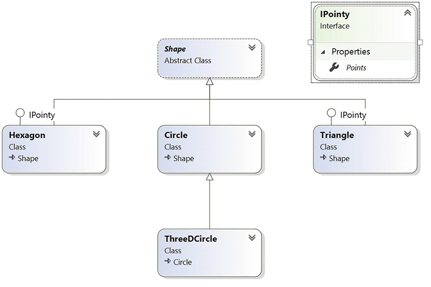
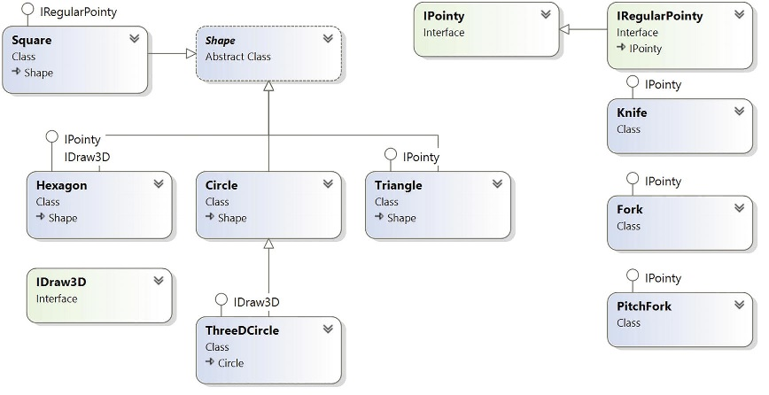
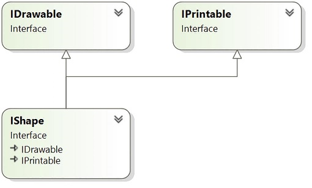

# Робота з інтерфейсами

Інтерфейс виражає поведінку, яку даний клас або структура може підтримувати. Згадайте, що абстрактні методи є чистим протоколом, оскільки вони не забезпечують реалізацію за замовчуванням. Інтерфейс може мати іменований набір абстрактних членів. Конкретні члени, визначені інтерфейсом, залежать від конкретної поведінки, яку він моделює. Крім того, клас або структура може підтримувати стільки інтерфейсів, скільки необхідно, таким чином підтримуючи (по суті) кілька видів поведінки.
Функція методів інтерфейсу за замовчуванням дозволяє методам інтерфейсу містити реалізацію, яка може або не може бути замінена класом реалізації.

Як ви могли здогадатися, бібліотеки базових класів .NET поставляються з численними попередньо визначеними типами інтерфейсів, які реалізуються різними класами та структурами. Наприклад, ADO.NET постачається з кількома постачальниками даних, які дозволяють вам спілкуватися з певною системою керування базами даних. Таким чином, в ADO.NET ви можете вибрати з багатьох об’єктів підключення (SqlConnection, OleDbConnection, OdbcConnection тощо). Крім того, сторонні постачальники баз даних (а також численні проекти з відкритим кодом) надають бібліотеки .NET для зв’язку з великою кількістю інших баз даних (MySQL, Oracle тощо), усі з яких містять об’єкти, що реалізують ці інтерфейси. Хоча кожен клас з’єднання має унікальне ім’я, визначається в іншому просторі імен і об’єднується в іншу збірку, усі класи з’єднань реалізують загальний інтерфейс під назвою IDbConnection.

```cs
// The IDbConnection interface defines a common
// set of members supported by all connection objects.
public interface IDbConnection : IDisposable
{
   // Methods
   IDbTransaction BeginTransaction();
   IDbTransaction BeginTransaction(IsolationLevel il);
   void ChangeDatabase(string databaseName);
   void Close();
   IDbCommand CreateCommand();
   void Open();
   // Properties
   string ConnectionString { get; set;}
   int ConnectionTimeout { get; }
   string Database { get; }
   ConnectionState State { get; }
}
```
Згідно з домовленістю, назви інтерфейсів .NET починаються з великої літери I. Коли ви створюєте власні власні інтерфейси, вважається найкращою практикою робити те саме.

Не турбуйтеся про подробиці того, що роблять ці члени на даний момент. Просто зрозумійте, що інтерфейс IDbConnection визначає набір членів, спільних для всіх класів підключення ADO.NET. Враховуючи це, вам гарантовано, що кожен об’єкт підключення підтримує такі члени, як Open(), Close(), CreateCommand() і так далі. Крім того, враховуючи, що члени інтерфейсу завжди абстрактні, кожен об’єкт з’єднання може вільно реалізувати ці методи власним унікальним способом. Під час роботи з іншим розділом ви познайомитеся з десятками інтерфейсів, які постачаються з бібліотеками базових класів .NET . Як ви побачите, ці інтерфейси можна реалізувати у ваших власних класах і структурах для визначення типів, які тісно інтегруються. Крім того, як тільки ви зрозумієте корисність типу інтерфейсу, ви обов’язково знайдете причини створити свій власний.

## Типи інтерфейсів порівняно з абстрактними базовими класами

Враховуючи вашу попередню роботу з класами, тип інтерфейсу може здатися чимось схожим на абстрактний базовий клас. Згадайте, що коли клас позначено як абстрактний, він може визначати будь-яку кількість абстрактних членів, щоб забезпечити поліморфний інтерфейс для всіх похідних типів. Однак, навіть коли клас дійсно визначає набір абстрактних членів, він також може вільно визначати будь-яку кількість конструкторів, даних полів, неабстрактних членів (з реалізацією) і так далі. Інтерфейси можуть містити визначення членів (як абстрактні члени), члени з реалізаціями за замовчуванням (як віртуальні методи) і статичні члени. Є лише дві реальні відмінності: інтерфейси не можуть мати нестатичні конструктори, а клас може реалізувати декілька інтерфейсів. Детальніше про цей другий пункт далі.

Поліморфний інтерфейс, створений абстрактним батьківським класом, страждає від одного основного обмеження, оскільки лише похідні типи підтримують членів, визначених абстрактним батьківським класом. Однак у великих програмних системах зазвичай розробляють кілька ієрархій класів, які не мають спільного батька за межами System.Object. Враховуючи, що абстрактні члени в абстрактному базовому класі застосовуються лише до похідних типів, у вас немає можливості налаштувати типи в різних ієрархіях для підтримки того самого поліморфного інтерфейсу.

Для початку створіть новий проект консольної програми під назвою CustomInterfaces. Додайте наступний абстрактний клас до проекту:

```cs
namespace CustomInterfaces;

public abstract class CloneableType
{
    // Only derived types can support this
    // 'polymorphic interface.' Classes in other
    // hierarchies have no access to this abstract
    // member.

    public abstract object Clone();
}

```
Враховуючи це визначення, тільки члени, які розширюють CloneableType, можуть підтримувати метод Clone(). Якщо ви створюєте новий набір класів, які не розширюють цей базовий клас, ви не можете отримати цей поліморфний інтерфейс. Крім того, пам’ятайте, що C# не підтримує множинне успадкування для класів. Тому, якщо ви хочете створити MiniVan, який «is-a» Car і «is-a» CloneableType, ви не зможете цього зробити. 

```cs
// Nope! Multiple inheritance is not possible in C#
// for classes.
public class MiniVan : Car, CloneableType
{
}
```
Як неважко здогадатися, на допомогу приходять типи інтерфейсів. Після визначення інтерфейсу його можна реалізувати будь-яким класом або структурою, будь-якою ієрархією та будь-яким простором імен або будь-якою збіркою. Як бачите, інтерфейси дуже поліморфні. Розглянемо стандартний інтерфейс .NET під назвою ICloneable, визначений у просторі імен System. Цей інтерфейс визначає єдиний метод під назвою Clone().

```cs
public interface ICloneable
{
  object Clone();
}
```
Якщо ви дослідите бібліотеки базових класів .NET, ви побачите, що багато, здавалося б, непов’язаних типів (System.Array, System.Data.SqlClient.SqlConnection, System.OperatingSystem, System.String тощо) реалізують цей інтерфейс. Хоча ці типи не мають спільного батька (окрім System.Object), ви можете обробляти їх поліморфно за допомогою типу інтерфейсу ICloneable.

```cs
void UsingInterfaceIClonable()
{
    // All of these classes support the ICloneable interface.
    string myString = "Hi girl";
    OperatingSystem unix = new OperatingSystem(PlatformID.Unix, new Version());

    // Therefore, they can all be passed into a method taking ICloneable.
    CloneMe(myString);
    CloneMe(unix);


    // Helper function
    // Clone whatever we get and print out the name.
    static void CloneMe(ICloneable clonable)
    {
        object theClone = clonable.Clone();
        Console.WriteLine($"Your clone is a: {theClone.GetType().Name}");
    }
}
UsingInterfaceIClonable();
```
```
Your clone is a: String
Your clone is a: OperatingSystem
```

Ім’я кожного класу друкується на консолі за допомогою методу GetType(), який ви успадковуєте від System.Object. Як буде детально пояснено в іншій главі, цей метод дозволяє зрозуміти композицію будь-якого типу під час виконання.

Іншим обмеженням абстрактних базових класів є те, що кожен похідний тип повинен боротися з набором абстрактних членів і забезпечувати реалізацію. Щоб побачити цю проблему, пригадайте ієрархію фігур. Припустімо, ви визначили новий абстрактний метод у базовому класі Shape під назвою GetNumberOfPoints(), який дозволяє похідним типам повертати кількість точок, потрібну для відтворення фігури.

```cs
abstract class Shape
{
...
  // Every derived class must now support this method!
  public abstract byte GetNumberOfPoints();
}
```
Очевидно, що єдиний клас, якому це потрібно, це Hexagon. Однак із цим оновленням кожен похідний клас (Circle, Triangle і ThreeDCircle) тепер повинен забезпечувати конкретну реалізацію цієї функції, навіть якщо це не має сенсу. Знову ж таки, тип інтерфейсу пропонує рішення. Якщо ви визначаєте інтерфейс, який представляє поведінку «наявності точок», ви можете просто підключити його до типу Hexagon, залишивши Circle і ThreeDCircle недоторканими.

Можливості інтерфейсу значно наближають їх до функціональності абстрактних класів, додавши можливість для класу реалізувати декілька інтерфейсів. Обережно ступати в цих водах і керуватися здоровим глуздом. Просто тому, що ви можете щось робити, не означає, що ви повинні.

## Визначення спеціальних інтерфейсів

Тепер, коли ви краще розумієте загальну роль типів інтерфейсів, давайте подивимося приклад визначення та впровадження користувацьких інтерфейсів.

В проект CustomInterfaces додайте класи.

```cs
namespace CustomInterfaces;

abstract class Shape1
{
    public string PetName { get; set; }

    protected Shape1(string petName = "NoName")
    {
        PetName = petName;
    }
    public abstract void Draw();
}
```
```cs
namespace CustomInterfaces;

class Hexagon1 : Shape1
{
    public Hexagon1() { }
    public Hexagon1(string name) : base(name) { }

    public override void Draw()
    {
        Console.WriteLine($"Drawing {PetName} the Hexagon");
    }
}

```
```cs
namespace CustomInterfaces;

class Circle1 : Shape1
{
    public Circle1() { }
    public Circle1(string name) : base(name) { }
    public override void Draw()
    {
        Console.WriteLine($"Drawing {PetName} the Circle");
    }
}
```
```cs
namespace CustomInterfaces;

class ThreeDCircle1 : Circle1
{
    // Hide the PetName property above me.
    public new string PetName { get; set; }

    // Hide any Draw() implementation above me.
    public new void Draw()
    {
        Console.WriteLine("Drawing a 3D Circle");
    }
}
```
Тепер вставте новий файл у свій проект під назвою IPointy.cs.

```cs
namespace CustomInterfaces;

// This interface defines the behavior of 'having points.'
public interface IPointy
{
    // Implicitly public and abstract.
    byte GetNumbetOfPoints();
}
```
На синтаксичному рівні інтерфейс визначається за допомогою ключового слова C# interface. На відміну від класу, інтерфейси ніколи не вказують базовий клас (навіть System.Object; однак, як ви побачите далі в цьому розділі, інтерфейс може вказувати базові інтерфейси). Також можна визначити private, internal, protected, та навіть static члени.
Інтерфейси не можуть визначати поля даних або нестатичні конструктори. Отже, наступна версія IPointy призведе до різних помилок компілятора:

```cs
// Ack! Errors abound!
public interface IPointy
{
  // Error! Interfaces cannot have data fields!
  public int numbOfPoints;
  // Error! Interfaces do not have nonstatic constructors!
  public IPointy() { numbOfPoints = 0;}
}
```

Типи інтерфейсів також можуть визначати будь-яку кількість прототипів властивостей. Ми могли би замінити метод GetNumbetOfPoints() на властивість тільки для читання 

```cs
public interface IPointy
{
    // Implicitly public and abstract.
    //byte GetNumbetOfPoints();
    byte Points { get; }
}
```
Типи інтерфейсів також можуть містити визначення event та індексаторів.

Типи інтерфейсів самі по собі абсолютно марні, оскільки ви не можете створити екземпляр типу інтерфейс, як клас або структуру.

```cs
// Ack! Illegal to allocate interface types.
IPointy p = new IPointy(); // Compiler error!
```
Інтерфейси не приносять багато чого, поки вони не реалізовані класом або структурою. Тут IPointy — це інтерфейс, який виражає поведінку «наявності точок». Ідея проста: деякі класи в ієрархії форм мають точки (наприклад, Hexagon), а інші (наприклад, Circle) не мають.

## Реалізація інтерфейсу

Коли клас (або структура) вирішує розширити свою функціональність шляхом підтримки інтерфейсів, він робить це за допомогою списку, розділеного комами, у визначенні типу. Майте на увазі, що прямий базовий клас має бути першим елементом у списку після оператора двокрапки. Коли ваш тип класу походить безпосередньо від System.Object, ви можете просто перерахувати інтерфейс (або інтерфейси), які підтримуються класом, оскільки компілятор C# розширить ваші типи від System.Object, якщо ви не вкажете інше. У зв’язку з цим, враховуючи, що структури завжди походять від System.ValueType, просто вкажіть кожен інтерфейс безпосередньо після визначення структури. Поміркуйте над такими прикладами:

```cs
// This class derives from System.Object and
// implements a single interface.
public class Pencil : IPointy
{...}

// This class derives from a custom base class
// and implements a single interface.
public class Fork : Utensil, IPointy
{...}

// This struct implicitly derives from System.ValueType and
// implements two interfaces.
public struct PitchFork : ICloneable, IPointy
{...}

```
Реалізація інтерфейсу — це пропозиція «все або нічого» для елементів інтерфейсу, які не включають реалізацію за замовчуванням. Підтримуючий тип не може вибірково вибрати, які члени він реалізує. З огляду на те, що інтерфейс IPointy визначає єдину властивість лише для читання, це не є надто великим тягарем. Однак, якщо ви реалізуєте інтерфейс, який визначає десять членів (наприклад, інтерфейс IDbConnection, показаний раніше), тип тепер відповідає за конкретизацію деталей усіх десяти абстрактних членів.

Для цього прикладу вставте новий тип класу під назвою Triangle1, який "is-a " Shape1 та підтримує IPointy. Зауважте, що реалізація властивості Points тільки для читання (реалізована за допомогою синтаксису члена з тілом виразу) просто повертає правильну кількість точок.

```cs
namespace CustomInterfaces;

class Triangle1 : Shape1, IPointy
{
    public Triangle1() {}
    public Triangle1(string petName) : base(petName) {}
    public override void Draw()
    {
        Console.WriteLine($"Drawing {PetName} the Triangle");
    }
    public byte Points => 3;
}
```
Тепер оновіть наявний тип Hexagon1, щоб також підтримувати тип інтерфейсу IPointy.

```cs
class Hexagon1 : Shape1, IPointy
{
    //...    
    public byte Points => 6;
}

```
Підводячи підсумок опису, можна сказати, що діаграма класів, ілюструє класи, сумісні з IPointy, використовуючи популярну нотацію «льодяник».



## Виклик членів інтерфейсу на рівні об’єкта

Тепер, коли у вас є кілька класів, які підтримують інтерфейс IPointy, наступне питання полягає в тому, як ви взаємодієте з новою функціональністю. Найпростіший спосіб взаємодії з функціональними можливостями, які надає певний інтерфейс, — це викликати члени безпосередньо з рівня об’єкта (за умови, що члени інтерфейсу не реалізовані явно; ви можете знайти докладнішу інформацію пізніше в розділі «Явна реалізація інтерфейсу»). Наприклад, розглянемо такий код:

```cs
void InvokingInterfaceMembersAtTheObjectLevel()
{
    Hexagon1 hexagon = new();
    Console.WriteLine(hexagon.Points);
}
InvokingInterfaceMembersAtTheObjectLevel();
```
```
6
```
Цей підхід добре працює в цьому випадку, якщо ви розумієте, що тип Hexagon реалізував відповідний інтерфейс і, отже, має властивість Points. Однак іноді ви не зможете визначити, які інтерфейси підтримуються даним типом. Наприклад, припустімо, що у вас є масив, що містить 50 типів, сумісних із Shape, лише деякі з яких підтримують IPointy. Очевидно, якщо ви спробуєте викликати властивість Points для типу, який не реалізував IPointy, ви отримаєте помилку. Отже, як ви можете динамічно визначити, чи підтримує клас або структура правильний інтерфейс?
Один із способів визначити під час виконання, чи підтримує тип певний інтерфейс, - це використовувати явне приведення. Якщо тип не підтримує потрібний інтерфейс, ви отримаєте виключення InvalidCastException. Щоб правильно впоратися з цією можливістю, використовуйте структуровану обробку винятків, як у наступному прикладі:

```cs
void InvokingInterfaceMembersWithExplicitCasting()
{
    Hexagon1 hexagon = new();
    Circle1 circle = new();

    List<Shape1> shapes = [ circle, hexagon ];

    IPointy? pointy = null;

    foreach (var shape in shapes)
    {
        try
        {
            pointy = (IPointy)shape;
            Console.WriteLine(pointy.Points);
        }
        catch (Exception ex)
        {
            Console.WriteLine(ex.Message);
        }
    }
}
InvokingInterfaceMembersWithExplicitCasting();
```
```
Unable to cast object of type 'CustomInterfaces.Circle1' to type 'CustomInterfaces.IPointy'.
6
```
Хоча ви можете використовувати логіку try/catch та сподіватися на краще, було б ідеально визначити, які інтерфейси підтримуються, перш ніж викликати члени інтерфейсу в першу чергу. Давайте розглянемо два способи зробити це.

## Отримання посилань на інтерфейс: ключове слово as

Ви можете визначити, чи підтримує даний тип інтерфейс, використовуючи ключове слово as. Якщо об’єкт можна розглядати як вказаний інтерфейс, вам повертається посилання на відповідний інтерфейс. Якщо ні, ви отримаєте null. Тому обов’язково перевірте на null значення, перш ніж продовжити.

```cs
void InvokingInterfaceMembersWithAs()
{
    Hexagon1 hexagon = new();
    Circle1 circle = new();

    List<Shape1> shapes = [circle, hexagon];

    IPointy? pointy = null;

    foreach (var shape in shapes)
    {
        pointy = shape as IPointy;

        if (pointy != null)
        {
            Console.WriteLine(pointy.Points);
        }
    }
}
InvokingInterfaceMembersWithAs();
```
```
6
```
Зауважте, що коли ви використовуєте ключове слово as, вам не потрібно використовувати логіку try/catch; якщо посилання не null, ви знаєте, що викликаєте дійсне посилання на інтерфейс.

## Отримання посилань на інтерфейс: ключове слово is

Ви також можете перевірити реалізований інтерфейс за допомогою ключового слова is. Якщо відповідний об’єкт несумісний із вказаним інтерфейсом, вам повертається значення false. Якщо ви вказуєте ім’я змінної в інструкції, тип призначається змінній, усуваючи необхідність виконувати перевірку типу та виконувати приведення.

```cs
void InvokingInterfaceMembersWithIs()
{
    Hexagon1 hexagon = new();
    Circle1 circle = new();

    List<Shape1> shapes = [circle, hexagon];

    foreach (var shape in shapes)
    {
        if (shape is IPointy pointy)
        {
            Console.WriteLine(pointy.Points);
        }
    }
}
InvokingInterfaceMembersWithIs();
```
```
6
```

## Реалізації за замовчуванням

В інтерфейсі ви можете мати методи та властивості для реалізації за замовчуванням. Додайте новий інтерфейс під назвою IRegularPointy для представлення багатокутника правильної форми. Додайте новий інтерфейс під назвою IRegularPointy для представлення багатокутника правильної форми.

```cs
interface IRegularPointy : IPointy
{
    int SideLength { get; set; }
    int NumberOfSides { get; set; }
    int Perimeter => SideLength * NumberOfSides;
}
```
Додайте до проекту новий клас під назвою Square.cs, успадкуйте базовий клас Shape і реалізуйте інтерфейс IRegularPointy наступним чином:

```cs
namespace CustomInterfaces;

class Square : Shape1, IRegularPointy
{
    public Square() {}
    public Square(string petName) : base(petName) {}

    //These come from the IRegularPointy interface
    public int SideLength { get; set; }
    public int NumberOfSides { get; set; }

    //This comes from the IPointy interface
    public byte Points => 4;
    //Draw comes from the Shape base class
    public override void Draw()
    {
        Console.WriteLine("Drawing a square");
    }
    //Note that the Perimeter property is not implemented
}
```
Тут ми мимоволі ввели першу «заковику» використання стандартних реалізацій в інтерфейсах. Властивість Perimeter, визначена в інтерфейсі IRegularPointy, не визначена в класі Square, що робить її недоступною з екземпляра Square. Щоб побачити це в дії, створіть новий екземпляр класу Square і виведіть відповідні значення на консоль, як це:

```cs
void DefaultImplementations()
{
    Square square = new("Boxy") { SideLength = 10, NumberOfSides = 4 } ;
    square.Draw();

    //This won't compile 
    //Console.WriteLine($"Perimeter: {square.Perimeter}");

    Console.WriteLine($"Perimeter: {((IRegularPointy)square).Perimeter}"  );

}
DefaultImplementations();
```
```
Drawing a square Boxy
Perimeter: 40
```
Натомість екземпляр Square має бути явно приведений до інтерфейсу IRegularPointy (оскільки саме там живе реалізація), і тоді можна буде отримати доступ до властивості Perimeter.

Один із варіантів вирішення цієї проблеми — це завжди кодувати інтерфейс типу. Змініть визначення екземпляра Square на IRegularPointy замість Square, ось так:

```cs
void DefaultImplementations2()
{
    IRegularPointy pointy = new Square("Boxy") { SideLength = 20, NumberOfSides = 4 };
    
    if(pointy is Square square)
    {
        square.Draw();
    }
    Console.WriteLine($"Perimeter: {pointy.Perimeter}");
    
    //Console.WriteLine(pointy.PetName);
}
DefaultImplementations2();
```
```
Drawing a square Boxy
Perimeter: 80
```
Проблема з цим підходом (у нашому випадку) полягає в тому, що метод Draw() і властивість PetName не визначені в інтерфейсі, що спричиняє помилки компіляції. Хоча це тривіальний приклад, він демонструє одну з проблем інтерфейсів за замовчуванням. Перш ніж використовувати цю функцію у своєму коді, переконайтеся, що ви вимірюєте наслідки коду виклику, щоб знати, де існує реалізація.

## Статичні конструктори та члени

Існує можливість мати статичні конструктори та члени, які функціонують так само, як статичні члени на визначення класу, але визначаються на інтерфейсах. Оновіть інтерфейс IRegularPointy за допомогою зразка статичної властивості та статичного конструктора.

```cs
interface IRegularPointy : IPointy
{
    int SideLength { get; set; }
    int NumberOfSides { get; set; }

    //Static members are also allowed 
    static string? ExampleProperty { get; set; }

    static IRegularPointy()
    {
        ExampleProperty = "Something";
    }

    int Perimeter => SideLength * NumberOfSides;
}
```
Статичні конструктори не повинні мати параметрів і мати доступ лише до статичних властивостей і методів. Щоб отримати доступ до статичної властивості інтерфейсу, додайте такий код:

```cs
void StaticMembers()
{
    Console.WriteLine(IRegularPointy.ExampleProperty);
    IRegularPointy.ExampleProperty = "Something red";
    Console.WriteLine(IRegularPointy.ExampleProperty);
}
StaticMembers();
```
```
Something
Something red
```
Зверніть увагу, що властивість static має бути викликана з інтерфейсу, а не зі змінної екземпляра.

## Інтерфейси як параметри

Враховуючи, що інтерфейси є допустимими типами, ви можете створювати методи, які приймають інтерфейси як параметри, як показано на прикладі методу CloneMe() раніше в цьому розділі. У цьому прикладі припустимо, що ви визначили інший інтерфейс під назвою IDraw3D.

```cs
public interface IDraw3D
{
    void Draw3D();
}
```
Далі припустімо, що дві з трьох фігур (ThreeDCircle і Hexagon) налаштовано для підтримки цієї нової поведінки.

```cs
class ThreeDCircle1 : Circle1 ,IDraw3D
{
    // ...

    public void Draw3D()
    {
        Console.WriteLine("Drawing Circle in 3D");
    }
}

```
```cs

class Hexagon1 : Shape1, IPointy, IDraw3D
{
    //...

    public void Draw3D()
    {
        Console.WriteLine("Drawing Hexagon in 3D");
    }
}
```
Якщо тепер ви визначите метод, який приймає інтерфейс IDraw3D як параметр, ви зможете ефективно надсилати будь-який об’єкт, що реалізує IDraw3D. Якщо ви спробуєте передати тип, який не підтримує необхідний інтерфейс, ви отримаєте помилку під час компіляції.
Ви можете перевірити, чи підтримує елемент у масиві Shape цей новий інтерфейс, і, якщо так, передати його в метод DrawIn3D() для обробки.

```cs
void InterfaceAsParameter()
{
    Shape1[] shapes = { new Hexagon1(),new Circle1(),
        new Triangle1(),new ThreeDCircle1() };

    for (int i = 0; i < shapes.Length; i++)
    {
        if (shapes[i] is IDraw3D shape)
        {
            DrawIn3D(shape);
        }
    }

    // I'll draw anyone supporting IDraw3D.
    void DrawIn3D(IDraw3D shapeWith3D)
    {
        shapeWith3D.Draw3D();
    }
}
InterfaceAsParameter();

```
```
Drawing Hexagon in 3D
Drawing Circle in 3D
```

## Інтерфейси як значення, що повертаються

Інтерфейси також можна використовувати як значення, що повертаються методами. Наприклад, ви можете написати метод, який приймає масив об’єктів Shape і повертає посилання на перший елемент, який підтримує IPointy.
```cs
void InterfacesAsReturnValues()
{
    Shape1[] shapes = {
        new Circle1(),
        new Hexagon1(),
        new Triangle1(),
        new ThreeDCircle1() 
    };

    Console.WriteLine(FindFirstPointyShape(shapes));

    // This method returns the first object in the
    // array that implements IPointy.
    static IPointy? FindFirstPointyShape(Shape1[] shapes)
    {
        foreach (var shape in shapes)
        {
            if (shape is IPointy resultShape)
            {
                return resultShape;
            }
        }
        return null;
    }
}
InterfacesAsReturnValues();
```
```
CustomInterfaces.Hexagon1
```

## Масиви типів інтерфейсів

Пам’ятайте, що один і той самий інтерфейс може бути реалізований багатьма типами, навіть якщо вони не належать до однієї ієрархії класів і не мають спільного батьківського класу за межами System.Object. Це може дати деякі потужні конструкції програмування. Наприклад, припустімо, що ви розробили три нові типи класів у своєму поточному проекті, які моделюють кухонне начиння (за допомогою класів Knife і Fork) та інше моделювання садового обладнання (PitchFork). 

```cs
namespace CustomInterfaces;

class Fork : IPointy
{
    public byte Points => 4;
}
```
```cs
namespace CustomInterfaces;

class Knife : IPointy
{
    public byte Points => 1;
}
```
```cs
namespace CustomInterfaces;

class PitchFork : IPointy
{
    public byte Points => 3;
}
```

Пам’ятайте, що інтерфейси можуть бути «підключені» до будь-якого типу в будь-якій частині ієрархії класів.

Діаграма класів



Якщо ви визначили типи PitchFork, Fork і Knife, тепер ви можете визначити масив IPointy-сумісних об’єктів. Враховуючи, що всі ці члени підтримують однаковий інтерфейс, ви можете перебирати масив і розглядати кожен елемент як об’єкт, сумісний з IPointy, незалежно від загальної різноманітності ієрархій класів.

```cs
void ArraysOfInterfaceTypes()
{
    IPointy[] pointies = {
        new Hexagon1(), 
        new Knife(),
        new Triangle1(), 
        new Fork(), 
        new PitchFork()
        };

    foreach (var pointy in pointies)
    {
        Console.WriteLine(pointy.Points+"\t"+pointy);
    }
}
ArraysOfInterfaceTypes();
```
```
6       CustomInterfaces.Hexagon1
1       CustomInterfaces.Knife
3       CustomInterfaces.Triangle1
4       CustomInterfaces.Fork
3       CustomInterfaces.PitchFork
```
Щоб підкреслити важливість цього прикладу, запам’ятайте наступне: коли у вас є масив даного інтерфейсу, масив може містити будь-який клас або структуру, яка реалізує цей інтерфейс.

### Реалізація інтерфейсів за допомогою Visual Studio або коду Visual Studio

Незважаючи на те, що програмування на основі інтерфейсу є потужною технікою, реалізація інтерфейсів може спричинити здорову кількість набору тексту. Враховуючи, що інтерфейси є іменованим набором абстрактних членів, ви повинні ввести визначення та реалізацію для кожного методу інтерфейсу для кожного типу, який підтримує поведінку. Тому, якщо ви хочете підтримувати інтерфейс, який визначає загалом п’ять методів і три властивості, вам потрібно врахувати всі вісім членів (інакше ви отримаєте помилки компілятора).
Як ви сподіваєтеся, Visual Studio і Visual Studio Code підтримують різні інструменти, які роблять завдання реалізації інтерфейсів менш обтяжливим. За допомогою простого тесту вставте клас у свій поточний проект під назвою PointyTestClass. Коли ви додаєте такий інтерфейс, як IPointy (або будь-який інший інтерфейс) до типу класу, ви могли помітити, що коли ви закінчуєте вводити ім’я інтерфейсу (або коли наводите курсор миші на ім’я інтерфейсу у вікні коду), Visual Studio та Visual Studio Code додають лампочку, яку також можна викликати за допомогою комбінації клавіш Ctrl+крапка (.). Коли ви клацнете лампочку, вам буде запропоновано розкривний список, який дозволить вам реалізувати інтерфейс. Зверніть увагу, що вам запропоновано два варіанти, другий з яких (явна реалізація інтерфейсу) буде розглянуто в наступному розділі. На даний момент виберіть перший варіант, і ви побачите, що Visual Studio/Visual Studio Code створив заглушку для оновлення.

```cs
namespace CustomInterfaces;

internal class PointyTestClass : IPointy
{
    public byte Points => throw new NotImplementedException();
}

```
Зверніть увагу, що реалізація за замовчуванням створює виключення System.NotImplementedException, яке, очевидно, можна видалити.
Visual Studio/Visual Studio Code також підтримує рефакторинг інтерфейсу Extract, доступний у опції Extract Interface меню Quick Actions. Це дозволяє витягти нове визначення інтерфейсу з існуючого визначення класу. Наприклад, ви можете бути на півдорозі до написання класу, коли ви розумієте, що можете узагальнити поведінку в інтерфейс (і таким чином відкрити можливість альтернативних реалізацій).

## Явна реалізація інтерфейсу

Як було показано раніше в цьому розділі, клас або структура може реалізувати будь-яку кількість інтерфейсів. Враховуючи це, завжди існує ймовірність реалізації інтерфейсів, які містять ідентичні члени і, отже, мають конфлікт імен. Щоб проілюструвати різні способи вирішення цієї проблеми, створіть новий проект консольної програми під назвою InterfaceNameClash. Додайте три інтерфейси, які представляють різні місця, куди реалізований тип може відтворювати свій вихід.

```cs
namespace InterfaceNameClash;
interface IDrawToForm
{
    void Draw();
}
```
```cs
namespace InterfaceNameClash;
interface IDrawToMemory
{
    void Draw();
}
```
```cs
namespace InterfaceNameClash;
interface IDrawToPrinter
{
    void Draw();
}
```
Зверніть увагу, що кожен інтерфейс визначає метод під назвою Draw() з однаковою сигнатурою. Якщо тепер ви хочете підтримувати кожен із цих інтерфейсів в одному типі класу під назвою Octagon, компілятор дозволить таке визначення:

```cs
namespace InterfaceNameClash;

class Octagon : IDrawToForm, IDrawToMemory, IDrawToPrinter
{
    public void Draw()
    {
        // Shared drawing logic.
        Console.WriteLine("Drawing the Octagon...");
    }
}
```
Хоча код компілюється чисто, у вас є можлива проблема. Простіше кажучи, надання єдиної реалізації методу Draw() не дозволяє вам приймати унікальні напрямки дій на основі того, який інтерфейс отримано від об’єкта Octagon. Наприклад, наступний код викличе той самий метод Draw(), незалежно від того, який інтерфейс ви отримаєте:

```cs
void ExplicitInterfaceImplementation1()
{
    Octagon octagon = new Octagon();

    octagon.Draw();

    // Both of these invocations call
    // the same Draw() method!

    ((IDrawToForm)octagon).Draw();
    
    if (octagon is IDrawToPrinter)
    {
        octagon.Draw();
    }
}
ExplicitInterfaceImplementation1();
```
```
Drawing the Octagon...
Drawing the Octagon...
Drawing the Octagon...

```
Зрозуміло, що тип коду, необхідний для рендерингу зображення у вікні, суттєво відрізняється від коду, необхідного для рендерингу зображення на мережевому принтері або в області пам’яті. Коли ви реалізуєте кілька інтерфейсів, які мають ідентичні члени, ви можете вирішити цей вид конфлікту імен, використовуючи явний синтаксис реалізації інтерфейсу. Розглянемо наступне оновлення типу Octagon

```cs
class Octagon1 : IDrawToForm, IDrawToMemory, IDrawToPrinter
{
    void IDrawToForm.Draw()
    {
        Console.WriteLine("Drawing to form...");
    }

    void IDrawToMemory.Draw()
    {
        Console.WriteLine("Drawing to memory...");
    }

    void IDrawToPrinter.Draw()
    {
        Console.WriteLine("Drawing to a printer...");
    }
}

```
Як ви бачите, при явній реалізації члена інтерфейсу загальний шаблон розбивається на це

```
returnType InterfaceName.MethodName(params){}
```
Зауважте, що використовуючи цей синтаксис, ви не вказуєте модифікатор доступу; явно реалізовані члени автоматично стають приватними. Наприклад, такий синтаксис є недопустимим:

```cs
// Error! No access modifier!
public void IDrawToForm.Draw()
{
   Console.WriteLine('Drawing to form...');
}
```
Оскільки явно реалізовані члени завжди неявно приватні, ці члени більше не доступні на рівні об’єктів. Насправді, якби ви застосували оператор точки до типу Octagon1, ви виявили б, що IntelliSense не показує жодного члена Draw(). Як і очікувалося, ви повинні використовувати явне приведення для доступу до необхідних функцій.

```cs
void ExplicitInterfaceImplementation2()
{
    Octagon1 octagon1 = new Octagon1();

    //octagon1.Draw();

    // We now must use casting to access the Draw()
    // members.
    ((IDrawToForm)octagon1).Draw();

    ((IDrawToMemory)octagon1).Draw();

    if (octagon1 is IDrawToPrinter printerOctagon1)
    {
        printerOctagon1.Draw();
    }
}
ExplicitInterfaceImplementation2();
```
```
Drawing to form...
Drawing to memory...
Drawing to a printer...
```
Хоча цей синтаксис дуже корисний, коли вам потрібно вирішити конфлікти імен, ви можете використовувати явну реалізацію інтерфейсу, щоб просто приховати більш «просунуті» члени на рівні об’єктів. Таким чином, коли користувач об’єкта застосовує оператор точки, користувач бачитиме лише підмножину загальної функціональності типу. Однак ті, кому потрібні більш просунуті поведінки, можуть отримати потрібний інтерфейс за допомогою явного приведення.

## Проектування ієрархій інтерфейсу

Інтерфейси можуть бути організовані в ієрархії інтерфейсів. Подібно до ієрархії класів, коли інтерфейс розширює існуючий інтерфейс, він успадковує абстрактні члени, визначені батьківським елементом (або батьками). Похідний інтерфейс просто розширює власне визначення додатковими абстрактними членами. Похідні інтерфейси успадковують реалізації за замовчуванням, а також розширюють визначення та потенційно додають нові реалізації за замовчуванням. Ієрархії інтерфейсів можуть бути корисними, коли ви хочете розширити функціональні можливості існуючого інтерфейсу, не порушуючи існуючі основи коду.
Для ілюстрації створіть новий проект консольної програми під назвою InterfaceHierarchy. Тепер давайте розробимо новий набір інтерфейсів, орієнтованих на візуалізацію, щоб IDrawable був коренем сімейного дерева.

```cs
namespace InterfaceHierarchy;

interface IDrawable
{
    void Draw();
}

```
З огляду на те, що IDrawable визначає базову поведінку малювання, тепер ви можете створити похідний інтерфейс, який розширює цей інтерфейс за допомогою можливості рендерингу в змінених форматах.

```cs
namespace InterfaceHierarchy;

interface IAdvancedDraw : IDrawable
{
    void DrawInBoundingBox(int top, int left, int bottom, int right);
    void DrawUpsideDown();
}

```
Враховуючи таку структуру, якби клас реалізовував IAdvancedDraw, тепер потрібно було б реалізувати кожен член, визначений у ланцюжку успадкування (зокрема, методи Draw(), DrawInBoundingBox() і DrawUpsideDown()).

```cs
namespace InterfaceHierarchy;

class BitmapImage : IAdvancedDraw
{
    public void Draw()
    {
        Console.WriteLine("Drawing...");
    }

    public void DrawInBoundingBox(int top, int left, int bottom, int right)
    {
        Console.WriteLine("Drawing in a box...");
    }

    public void DrawUpsideDown()
    {
        Console.WriteLine("Drawing upside down!");
    }
}
```

Тепер, коли ви використовуєте BitmapImage, ви можете викликати кожен метод на рівні об’єкта (оскільки всі вони загальнодоступні), а також витягувати посилання на кожен підтримуваний інтерфейс явно за допомогою приведення.

```cs
void InterfaceHierarchies1()
{
    // Call from object level.
    BitmapImage image = new BitmapImage();
    image.Draw();
    image.DrawInBoundingBox(1, 1, 10, 10);
    image.DrawUpsideDown();

    // Get IAdvancedDraw explicitly.
    if (image is IAdvancedDraw draw)
    {
        draw.DrawUpsideDown();
    }
}
InterfaceHierarchies1();
```
```
Drawing...
Drawing in a box...
Drawing upside down!
Drawing upside down!
```

### Ієрархії інтерфейсу з реалізаціями за замовчуванням

Ієрархії інтерфейсів також включають реалізації за замовчуванням, нижчі інтерфейси можуть вибрати перенесення реалізації з базового інтерфейсу або створити нову реалізацію за замовчуванням. Оновіть інтерфейс IDrawable до такого:

```cs
interface IDrawable
{
    void Draw();
    int TimeToDraw() => 5;
}
```

Реалізацію за замовченням можна використати для типів похідного інтерфейсу.

```cs
void InterfaceHierarchiesWithDefaultImplementations()
{
    BitmapImage image = new BitmapImage();
  
    if (image is IAdvancedDraw draw)
    {
        Console.WriteLine( draw.TimeToDraw());
    }
}
InterfaceHierarchiesWithDefaultImplementations();
```
```
5
```
Цей код не тільки компілюється, але й виводить значення 5 для методу TimeToDraw(). Це пояснюється тим, що реалізації за замовчуванням автоматично переносяться до інтерфейсів-нащадків. Переведення BitMapImage в інтерфейс IAdvancedDraw надає доступ до методу TimeToDraw(), навіть якщо екземпляр BitMapImage не має доступу до реалізації за замовчуванням. Щоб підтвердити це, введіть наступний код і перегляньте помилку компіляції:

```cs
    BitmapImage image = new BitmapImage();
    //This does not compile
    image.TimeToDraw();
```
Якщо низхідний інтерфейс хоче надати власну реалізацію за замовчуванням, він повинен приховати реалізацію вище. Наприклад, якщо для малювання методу IAdvancedDraw TimeToDraw() потрібно 15 одиниць, оновіть інтерфейс до такого визначення:

```cs
interface IAdvancedDraw : IDrawable
{
    //...
    new int TimeToDraw() => 15;
}
```
```cs
InterfaceHierarchiesWithDefaultImplementations();
```
```
15
```

Звичайно, клас BitMapImage також може вільно реалізувати метод TimeToDraw(). На відміну від методу IAdvancedDraw TimeToDraw(), класу потрібно лише реалізувати метод, а не приховати його.

```cs
class BitmapImage : IAdvancedDraw
{
    //...
    public int TimeToDraw() => 12;
}
```
Під час перетворення екземпляра BitmapImage до інтерфейсу IAdvancedDraw або IDrawable метод екземпляра все ще виконується.

```cs
void InterfaceHierarchiesWithDefaultImplementations1()
{
    BitmapImage image = new BitmapImage();

    Console.WriteLine(image.TimeToDraw());
    Console.WriteLine(((IDrawable)image).TimeToDraw());
    Console.WriteLine(((IAdvancedDraw)image).TimeToDraw());
}
InterfaceHierarchiesWithDefaultImplementations1();
```
```
12
12
12
```

## Множинне успадкування з типами інтерфейсів

На відміну від типів класів, інтерфейс може розширювати кілька базових інтерфейсів, дозволяючи вам створювати деякі потужні та гнучкі абстракції. Створіть новий проект консольної програми під назвою MiInterfaceHierarchy. Ось ще одна колекція інтерфейсів, які моделюють різні рендеринги та абстракції форм. Зауважте, що інтерфейс IShape розширює як IDrawable, так і IPrintable.

```cs
namespace MiInterfaceHierarchy;

interface IDrawable
{
    void Draw();
}

```
```cs
namespace MiInterfaceHierarchy;

interface IPrintable
{
    void Print();
    void Draw();// <-- Note possible name clash here!
}
```

```cs
namespace MiInterfaceHierarchy;
// Multiple interface inheritance.
interface IShape : IDrawable,IPrintable
{
    int GetNumberOfSide();
}
```



На цьому етапі виникає запитання: «Якщо у вас є клас, що підтримує IShape, скільки методів потрібно буде реалізувати?» Відповідь: залежить. Якщо ви хочете забезпечити просту реалізацію методу Draw(), вам потрібно надати лише три елементи, як показано в наступному типі Rectangle:

```cs
namespace MiInterfaceHierarchy;

class Rectangle : IShape
{
    public void Draw()
    {
        Console.WriteLine("Drawing...");
    }
    public void Print()
    {
        Console.WriteLine("Printing...");
    }
    public int GetNumberOfSide() => 4;
}
```
```cs
using MiInterfaceHierarchy;

void MultipleInheritance1()
{
    Rectangle rectangle = new Rectangle();
    rectangle.Draw();
}
MultipleInheritance1()
```
```
Drawing...
```
Якщо ви бажаєте мати конкретні реалізації для кожного методу Draw() (що в даному випадку було б найбільш доцільним), ви можете вирішити конфлікт імен за допомогою явної реалізації інтерфейсу, як показано на наступному типі Square:

```cs
void MultipleInheritance2()
{
    Square square = new();

    ((IDrawable) square).Draw();

    ((IPrintable) square).Draw();

}
MultipleInheritance2();
```
```
Drawing for IDrawable...
Drawing for IPrintable...
```

В ідеалі, на цьому етапі ви відчуваєте себе більш комфортно з процесом визначення та впровадження користувацьких інтерфейсів за допомогою синтаксису C#. Чесно кажучи, програмування на основі інтерфейсу може зайняти деякий час, щоб звикнути до нього, тому, якщо ви насправді все ще трохи чухаєте голову, це цілком нормальна реакція.
Однак майте на увазі, що інтерфейси є фундаментальним аспектом .NET. Незалежно від типу програми, яку ви розробляєте (веб-інтерфейси, графічні інтерфейси для настільних ПК, бібліотеки доступу до даних тощо), робота з інтерфейсами буде частиною процесу. Підводячи підсумок, пам’ятайте, що інтерфейси можуть бути надзвичайно корисними в таких випадках:

 1. У вас є єдина ієрархія, де лише підмножина похідних типів підтримує спільну поведінку.

 2. Вам потрібно змоделювати загальну поведінку, яку можна знайти в кількох ієрархіях без спільного батьківського класу за межами System.Object.

Тепер, коли ви детально ознайомилися зі специфікою побудови та впровадження користувацьких інтерфейсів, у решті цієї глави розглядаються кілька попередньо визначених інтерфейсів, які містяться в бібліотеках базових класів .NET. Як ви побачите, ви можете реалізувати стандартні інтерфейси .NET у своїх користувальницьких типах, щоб гарантувати їх бездоганну інтеграцію у фреймворк.

# Інтерфейси IEnumerable та IEnumerator

Щоб почати досліджувати процес реалізації існуючих інтерфейсів .NET, давайте спочатку подивимося на роль IEnumerable та IEnumerator. Для ілюстрації почніть із створення нового проекту консольної програми під назвою CustomEnumerator. Згадайте, що C# підтримує ключове слово foreach, яке дозволяє вам переглядати вміст будь-якого типу масиву.

```cs
void UsingForeach()
{
    // Iterate over an array of items.
    int[] myArrayOfInts = { 10, 20, 30, 40 };
    foreach (int i in myArrayOfInts)
    {
        Console.WriteLine(i);
    }
}
UsingForeach();
```
```
10
20
30
40
```
Хоча може здатися, що лише типи масивів можуть використовувати цю конструкцію, правда полягає в тому, що будь-який тип, який підтримує метод під назвою GetEnumerator(), може бути оцінений конструкцією foreach.

Додайте до проекту класи Car.cs і Radio.cs.

```cs
namespace CustomEnumerator;

class Radio
{
    public void TurnOn(bool on)
    {
        Console.WriteLine(on ? "Jamming..." : "Quiet time...");
    }
}
```
```cs
namespace CustomEnumerator;

class Car
{
    // Constant for maximum speed.
    public const int MaxSpeed = 100;

    // Car properties.
    public int CurrentSpeed { get; set; }
    public string PetName { get; set; } = "NoName";

    // Is the car still operational?
    private bool _carIsDead;

    private readonly Radio _radio = new Radio();

    public Car()
    {
    }
    public Car(string petName, int currentSpeed)
    {
        CurrentSpeed = currentSpeed;
        PetName = petName;
    }

    public void CrankTunes(bool state)
    {
        // Delegate request to inner object.
        _radio.TurnOn(state);
    }

}
```
Тепер вставте новий клас під назвою Garage, який зберігає набір об’єктів Car у System.Array. 

```cs
namespace CustomEnumerator;
// Garage contains a set of Car objects.
class Garage
{
    private Car[] carArray = new Car[4];
    // Fill with some Car objects upon startup.
    public Garage()
    {
        carArray[0] = new Car("Rusty", 30);
        carArray[1] = new Car("Clunker", 55);
        carArray[2] = new Car("Zippy", 30);
        carArray[3] = new Car("Fred", 30);
    }
}
```
В ідеалі було б зручно перебирати піделементи об’єкта Garage за допомогою конструкції foreach, як і масив значень даних. Оновіть файл Program.cs до такого:

```cs
void ShowGarage()
{
    Garage garage = new Garage();

    foreach (Car car in garage)
    {
        Console.WriteLine($"{car.PetName} is going {car.CurrentSpeed} MPH");
    }
}
ShowGarage();
```
На жаль, компілятор повідомляє вам, що клас Garage не реалізує метод під назвою GetEnumerator(). Цей метод формалізований інтерфейсом IEnumerable, який знаходиться в просторі імен System.Collections.

У розділі "Узагальнені колекції" ви дізнаєтеся про роль generics і простору імен System.Collections.Generic. Як ви побачите, цей простір імен містить узагальнені версії IEnumerable/IEnumerator, які забезпечують більш безпечний спосіб перебору елементів.

Класи або структури, які підтримують поведінку IEnumerable, повідомляють про те, що вони можуть надавати можливість перебирати елементи, що містяться в ньому (у цьому прикладі перебор за допомогою foreach). Ось визначення цього стандартного інтерфейсу:

```cs
// This interface informs the caller
// that the object's items can be enumerated.
public interface IEnumerable
{
   IEnumerator GetEnumerator();
}
```
Як бачите, метод GetEnumerator() повертає посилання на ще один інтерфейс під назвою System.Collections.IEnumerator. Цей інтерфейс забезпечує інфраструктуру, яка дозволяє абоненту проходити внутрішні об’єкти, що містяться в контейнері, сумісному з IEnumerable.

```cs
// This interface allows the caller to
// obtain a container's items.
public interface IEnumerator
{
   bool MoveNext ();  // Advance the internal position of the cursor.
   object Current { get;}  // Get the current item (read-only property).
   void Reset (); // Reset the cursor before the first member.
}
```
Якщо ви хочете оновити тип Garage для підтримки цих інтерфейсів, ви можете піти довгим шляхом і реалізувати кожен метод вручну. Хоча ви, безумовно, можете надавати персоналізовані версії GetEnumerator(), MoveNext(), Current і Reset(), є простіший спосіб. Оскільки тип System.Array (як і багато інших класів колекцій) уже реалізує IEnumerable та IEnumerator, ви можете просто делегувати запит System.Array наступним чином (зверніть увагу, що вам потрібно буде імпортувати простір імен System.Collections у ваш кодовий файл):

```cs
using System.Collections;

namespace CustomEnumerator;

class Garage : IEnumerable 
{

    //...

    public IEnumerator GetEnumerator() => carArray.GetEnumerator();
}
```
Після того, як ви оновили свій тип Garage, ви можете безпечно використовувати тип у конструкції C# foreach. Крім того, враховуючи те, що метод GetEnumerator() визначено публічно, користувач об’єкта також може взаємодіяти з типом IEnumerator.

```cs
void ShowGarage()
{
    Garage garage = new Garage();

    foreach (Car car in garage)
    {
        Console.WriteLine($"{car.PetName} is going {car.CurrentSpeed} MPH");
    }

    Console.WriteLine( );

    System.Collections.IEnumerator enumerator = garage.GetEnumerator();

    enumerator.MoveNext();
    Console.WriteLine(((Car)enumerator.Current).PetName);
 
}
ShowGarage();
```
```
Rusty is going 30 MPH
Clunker is going 55 MPH
Zippy is going 30 MPH
Fred is going 30 MPH

Rusty
```
Однак, якщо ви бажаєте приховати функціональні можливості IEnumerable на рівні об’єктів, просто скористайтеся явною реалізацією інтерфейсу. 

```cs
    IEnumerator IEnumerable.GetEnumerator() => carArray.GetEnumerator();
```
Таким чином звичайний користувач об’єкта не знайде метод GetEnumerator() Garage, тоді як конструкція foreach за потреби отримає інтерфейс у фоновому режимі.


## Створення методів ітератора з ключовим словом yield

Існує альтернативний спосіб побудови типів, які працюють із циклом foreach через ітератори. Простіше кажучи, ітератор — це член, який визначає, як повинні повертатися внутрішні елементи контейнера під час обробки foreach. Для ілюстрації створіть новий проект консольної програми під назвою CustomEnumeratorWithYield і вставте типи Car, Radio та Garage з попереднього прикладу (перейменувавши визначення простору імен на поточний проект). Тепер модернізуйте поточний тип Garage наступним чином:

```cs
using System.Collections;

namespace CustomEnumeratorWithYield;

class Garage : IEnumerable 
{

    //...

    // Iterator method.
    public IEnumerator GetEnumerator()
    {
        foreach (Car car in carArray)
        {
            yield return car;
        }
    }
}
```
Зауважте, що ця реалізація GetEnumerator() повторює піделементи, використовуючи внутрішню логіку foreach, і повертає кожну машину викликаючому за допомогою синтаксису yield return. Ключове слово yield використовується для вказівки значення (або значень), яке буде повернуто конструкцією foreach викликаючого. Коли досягнуто оператора yield return, поточне розташування в контейнері зберігається, і виконання перезапускається з цього місця під час наступного виклику ітератора.

Методам ітератора не потрібно використовувати ключове слово foreach для повернення його вмісту. Також допустимо визначити цей метод ітератора наступним чином:

```cs
public IEnumerator GetEnumerator()
{
   yield return carArray[0];
   yield return carArray[1];
   yield return carArray[2];
   yield return carArray[3];
}
```
У цій реалізації зверніть увагу, що метод GetEnumerator() явно повертає нове значення абоненту під час кожного проходу. Робити це для цього прикладу не має сенсу, враховуючи, що якби ви додали більше об’єктів до змінної-члена carArray, ваш метод GetEnumerator() тепер би не синхронізувався. Тим не менш, цей синтаксис може бути корисним, якщо ви хочете повернути локальні дані з методу для обробки за допомогою синтаксису foreach.

Жоден код у методі GetEnumerator() не виконується, доки не буде виконано перше повторення елементів (або доступ до будь-якого елемента). Це означає, що якщо є виняткова ситуація перед оператором yield, вона не буде викинута під час першого виклику методу, а лише під час першого виклику MoveNext(). Щоб перевірити це, оновіть метод GetEnumerator до цього:

```cs
    public IEnumerator GetEnumerator()
    {
        //This will not get thrown until MoveNext() is called
        throw new Exception("This won't get called");
        foreach (Car car in carArray)
        {
            yield return car;
        }
    }
```
```cs
void GuardClausesWithLocalFunctions()
{
    Garage garage = new();
    System.Collections.IEnumerator enumerator = garage.GetEnumerator();
}
GuardClausesWithLocalFunctions();
```
Якщо ви викликаєте функцію таким чином і більше нічого не робите, виняток ніколи не буде створено:

```cs
void GuardClausesWithLocalFunctions()
{
    Garage garage = new();
    System.Collections.IEnumerator enumerator = garage.GetEnumerator();
}
GuardClausesWithLocalFunctions();
```

Лише після виклику MoveNext() код буде виконано, і буде створено виняток. Залежно від потреб вашої програми це може бути цілком нормально. Але може й не бути. Ваш метод GetEnumerator може мати захисну пропозицію, яка повинна виконуватися під час першого виклику методу. Наприклад, припустимо, що список зібрано з бази даних. Ви можете перевірити, чи можна відкрити підключення до бази даних під час виклику методу, а не під час повторення списку. Або ви можете перевірити вхідні параметри методу Iterator (розглянуто далі) на дійсність.

Локальні функції є приватними функціями всередині інших функцій. Завдяки переміщенню yield return у локальну функцію, яка повертається з основного тіла методу, код у операторах верхнього рівня (до повернення локальної функції) виконується негайно. Локальна функція виконується під час виклику MoveNext(). Оновіть метод до цього:

```cs
    public IEnumerator GetEnumerator()
    {
        //This will get thrown immediately
        throw new Exception("This will get called");
        return ActualImplementation();
        //this is the local function and the actual IEnumerator implementation
        IEnumerator ActualImplementation()
        {
            foreach (Car c in carArray)
            {
                yield return c;
            }
        }
    }
```
Перевірте це, оновивши код виклику до цього:
```cs
void GuardClausesWithLocalFunctions1()
{
    Garage garage = new Garage();
    try
    {
        //Error at this time
        var enumerator = garage.GetEnumerator();
    }
    catch (Exception ex)
    {
        Console.WriteLine($"Exception occurred on GetEnumerator");
        Console.WriteLine(ex.Message);
    }
}
GuardClausesWithLocalFunctions1();
```
```
Exception occurred on GetEnumerator
This will get called
```
Завдяки оновленню методу GetEnumerator() виняток виникає негайно, а не під час виклику MoveNext().

## Створення іменованого ітератора

Також цікаво відзначити, що технічно ключове слово yield можна використовувати в будь-якому методі, незалежно від його назви. Ці методи (які технічно називаються іменованими ітераторами) також унікальні тим, що вони можуть приймати будь-яку кількість аргументів. Під час створення іменованого ітератора пам’ятайте, що метод повертатиме інтерфейс IEnumerable, а не очікуваний тип, сумісний із IEnumerator. Для ілюстрації ви можете додати такий метод до типу Garage (використовуючи локальну функцію для інкапсуляції функціональних можливостей ітерації):

```cs
    public IEnumerable GetTheCars(bool returnReversed)
    {
        //do some error checking here
        return ActualImplementation();
        IEnumerable ActualImplementation()
        {
            // Return the items in reverse.
            if (returnReversed)
            {
                for (int i = carArray.Length; i != 0; i--)
                {
                    yield return carArray[i - 1];
                }
            }
            else
            {
                // Return the items as placed in the array.
                foreach (Car c in carArray)
                {
                    yield return c;
                }
            }
        }
    }
```
Зверніть увагу, що новий метод дозволяє абоненту отримувати піделементи в послідовному порядку, а також у зворотному порядку, якщо вхідний параметр має значення true. Тепер ви можете взаємодіяти зі своїм новим методом наступним чином(не забудьте закоментувати throw new Exception в методі GetEnumerator):

```cs
void NamedIterator()
{
    Garage garage = new Garage();
    // Get items using GetEnumerator()
    foreach (Car car in garage)
    {
        Console.WriteLine($"{car.PetName} is going {car.CurrentSpeed} MPH");
    }
    Console.WriteLine();

    // Get items (in reverse!) using named iterator.
    foreach (Car car in garage.GetTheCars(true))
    {
        Console.WriteLine($"{car.PetName} is going {car.CurrentSpeed} MPH");
    }
    Console.WriteLine();

    foreach (Car car in garage.GetTheCars(false))
    {
        Console.WriteLine($"{car.PetName} is going {car.CurrentSpeed} MPH");
    }
}
NamedIterator();
```
```
Rusty is going 30 MPH
Clunker is going 55 MPH
Zippy is going 30 MPH
Fred is going 30 MPH

Fred is going 30 MPH
Zippy is going 30 MPH
Clunker is going 55 MPH
Rusty is going 30 MPH

Rusty is going 30 MPH
Clunker is going 55 MPH
Zippy is going 30 MPH
Fred is going 30 MPH
```
Як ви можете погодитися, іменовані ітератори є корисними конструкціями, оскільки один спеціальний контейнер може визначати кілька способів запиту повернутого набору. 

Отже, щоб завершити цей погляд на створення перелічуваних об’єктів, пам’ятайте, що для того, щоб ваші власні типи працювали з ключовим словом C# foreach, контейнер повинен визначати метод під назвою GetEnumerator(), який був формалізований типом інтерфейсу IEnumerable. Реалізація цього методу зазвичай досягається простим делегуванням його внутрішньому члену, який утримує підоб’єкти; однак також можна використовувати синтаксис yield return для надання кількох методів «іменованого ітератора».

# Інтерфейс ICloneable

Як ви пам’ятаєте, System.Object визначає метод під назвою MemberwiseClone(). Цей метод використовується для отримання поверхневої копії поточного об'єкта. Користувачі об’єктів не викликають цей метод безпосередньо, оскільки він protected. Однак певний об’єкт може сам викликати цей метод під час процесу клонування. Для ілюстрації створіть новий проект консольної програми під назвою CustomClonable, який визначає клас під назвою Point.

```cs
namespace CustomClonable;

public class Point
{
    public int X { get; set; }
    public int Y { get; set; }
    public Point(int x, int y)
    {
        X = x;
        Y = y;
    }
    public Point()
    {
    }
    public override string? ToString() => $"{X}:{Y}";
}

```
Враховуючи те, що ви вже знаєте про типи посилань і типи значень, ви знаєте, що якщо ви призначаєте одну змінну посилання іншій, у вас буде два посилання, що вказують на той самий об’єкт у пам’яті. Таким чином, наступна операція призначення призводить до двох посилань на той самий об’єкт Point у купі; модифікації з використанням будь-якого посилання впливають на той самий об’єкт у купі:

```cs
using CustomClonable;

void PointsInMemory()
{
    Point point1 = new(10, 10);
    Point point2 = point1;

    point2.X = 20;

    Console.WriteLine(point1);
}
PointsInMemory();
```
```
20:10
```
Якщо ви хочете надати своєму спеціальному типу можливість повертати ідентичну свою копію абоненту, ви можете застосувати стандартний інтерфейс ICloneable. Цей тип визначає один метод під назвою Clone().

```cs
public interface ICloneable
{
  object Clone();
}
```
Очевидно, що реалізація методу Clone() залежить від ваших класів. Однак базова функціональність, як правило, така сама: скопіюйте значення ваших змінних-членів у новий екземпляр об’єкта того самого типу та поверніть його користувачеві. Для ілюстрації поміркуйте над наступним оновленням класу Point:
```cs
// The Point now supports 'clone-ability.'
public class Point : ICloneable
{

    //...

    public object Clone() => new Point(X, Y);
}
```
Таким чином ви можете створити точні автономні копії типу Point, як показано в наступному коді:

```cs
void ShallowCloning()
{
    Point point1 = new(10, 10);
    Point point2 = (Point)point1.Clone();
   
    point2.X = 20;

    Console.WriteLine(point1);
}
ShallowCloning();
```
```
10:10
```
Хоча поточна реалізація Point відповідає вимогам, ви можете трохи оптимізувати речі. Оскільки тип Point не містить внутрішніх змінних посилального типу, ви можете спростити реалізацію методу Clone() наступним чином:

```cs
public class Point : ICloneable
{

    //...
    public object Clone() => this.MemberwiseClone() ;
    
}
```
```cs
ShallowCloning();
```
```
10:10
```
Однак майте на увазі, що якщо Point містив будь-які змінні-члени посилального типу, MemberwiseClone() скопіював би посилання на ці об’єкти (тобто поверхнева копія). Якщо ви хочете підтримати справжню глибоку копію, вам потрібно буде створити новий екземпляр будь -яких змінних довідкового типу під час процесу клонування. Давайте подивимось приклад далі.

## Більш детальний приклад клонування

Тепер припустімо, що клас Point містить змінну-член посилання типу PointDescription. Цей клас підтримує зрозумілу назву точки, а також ідентифікаційний номер, виражений у вигляді System.Guid (унікальний глобальний ідентифікатор [GUID] — це статистично унікальне 128-бітне число). Ось реалізація:

```cs
namespace CustomClonable;
// This class describes a point.
public class PointDescription
{
    public string PetName { get; set; }
    public Guid PointId { get; set; }

    public PointDescription()
    {
        PetName = "No-name";
        PointId = Guid.NewGuid();
    }
}
```
Класу Point1 включають модифікацію ToString() для врахування цих нових частин даних стану, а також визначення та створення посилання типу PointDescription. Щоб дозволити зовнішньому світу встановити улюблене ім’я для Point, ви також оновлюєте аргументи, передані в перевантажений конструктор.

```cs
namespace CustomClonable;

public class Point1 : ICloneable
{
    public int X { get; set; }
    public int Y { get; set; }
    public PointDescription Description { get; set; } = new PointDescription();

    public Point1()
    {
    }
    public Point1(int x, int y)
    {
        X = x;
        Y = y;
    }
    public Point1(int x, int y, string petName) : this(x,y)
    {
        Description.PetName = petName;
    }
    public override string? ToString() => $"{X}:{Y}\t{Description.PetName}\t{Description.PointId}";

    public object Clone() => MemberwiseClone();
}
```

Зверніть увагу, що ви ще не оновили свій метод Clone(). Таким чином, коли користувач об’єкта запитує клон, використовуючи поточну реалізацію, досягається поверхнева (почленна) копія. Для ілюстрації припустімо, що ви оновили код виклику таким чином:

```cs
void ShallowCloning1()
{
    Point1 point1 = new(10, 10, "Jane");
    Point1 point2 = (Point1)point1.Clone();

    Console.WriteLine("Before modification:");
    Console.WriteLine(point1);
    Console.WriteLine(point2);

    point2.X += 10;
    point2.Description.PetName = "My new name";

    Console.WriteLine();
    Console.WriteLine("After modification:");
    Console.WriteLine(point1);
    Console.WriteLine(point2);
}
ShallowCloning1();

```
```
Before modification:
10:10   Jane    84660a37-2790-415d-acfd-4d4960994df3
10:10   Jane    84660a37-2790-415d-acfd-4d4960994df3

After modification:
10:10   My new name     84660a37-2790-415d-acfd-4d4960994df3
20:10   My new name     84660a37-2790-415d-acfd-4d4960994df3
```

Щоб ваш метод Clone() зробив повну глибоку копію типів внутрішніх посилань, вам потрібно налаштувати об’єкт, який повертає MemberwiseClone(), щоб враховувати назву поточної точки (тип System.Guid насправді є структурою, тому числові дані справді копіюються). Ось одна з можливих реалізацій:

```cs
    public object Clone()
    {
        // First get a shallow copy.
        Point1 newPoint = (Point1)MemberwiseClone();

        // Then fill in the gaps.
        PointDescription newDescription = new()
        {
            PetName = Description.PetName
        };
        newPoint.Description = newDescription;

        return newPoint;
    }
```
Якщо ви ще раз запустите програму та переглянете вихідні дані (показано далі), ви побачите, що точка, повернута з Clone(), справді копіює внутрішні змінні-члени посилального типу (зауважте, що Description тепер унікальне як для point1, так і для point2).

```cs
ShallowCloning1();
```
```
Before modification:
10:10   Jane    202442ac-ad22-4832-bac7-3af8ca738d51
10:10   Jane    4439aa4b-c463-4b40-b27a-0c8f43995058

After modification:
10:10   Jane    202442ac-ad22-4832-bac7-3af8ca738d51
20:10   My new name     4439aa4b-c463-4b40-b27a-0c8f43995058
```
Щоб підсумувати процес клонування, якщо у вас є клас або структура, яка містить лише типи значень, реалізуйте свій метод Clone() за допомогою MemberwiseClone(). Однак, якщо у вас є спеціальний тип, який підтримує інші типи посилань, ви можете створити новий об’єкт, який враховує кожну змінну-член посилального типу, щоб отримати «поглиблену копію».


# Інтерфейс IComparable

Інтерфейс System.IComparable визначає поведінку, яка дозволяє сортувати об’єкт на основі певного вказаного правила. Ось формальне визначення:

```cs
// This interface allows an object to specify its
// relationship between other like objects.
public interface IComparable
{
  int CompareTo(object o);
}
```
Загальна версія цього інтерфейсу (IComparable<T>) забезпечує більш безпечний спосіб обробки порівнянь між об’єктами. Ви перевірите це пізніше.

Створіть новий проект консольної програми під назвою CustomComparable. Додайте класи Car.

```cs
namespace CustomComparable;

class Car
{
    // Constant for maximum speed.
    public const int MaxSpeed = 100;

    // Car properties.
    public int CurrentSpeed { get; set; }
    public string PetName { get; set; } = "No-name";

    public Car()
    {
    }
    public Car(string petName, int currentSpeed)
    {
        CurrentSpeed = currentSpeed;
        PetName = petName;
    }
}
```
Оновіть клас Car, додавши нову властивість для представлення унікального ідентифікатора для кожного автомобіля та модифікований конструктор:

```cs
class Car
{
    //...
    public int CarId { get; set; }
    //...
    public Car(int carId, string petName, int currentSpeed):this(petName,currentSpeed)
    {
        CarId = carId;
    }
    //...
}
```

Тепер припустімо, що у вашому методі є масив об’єктів Car, як показано нижче:

```cs
void ShowCarArray()
{
    Car[] cars =
    [
        new Car(1, "Rusty",80),
        new Car(234, "Mary", 40),
        new Car(34, "Viper", 30),
        new Car(4, "Mel", 70),
        new Car(5, "Chucky", 80),
    ];
}
```
Клас System.Array визначає статичний метод під назвою Sort(). Коли ви викликаєте цей метод для масиву внутрішніх типів (int, short, string тощо), ви можете сортувати елементи в масиві в числовому/алфавітному порядку, оскільки ці внутрішні типи даних реалізують IComparable. Але що, якби ви надіслали масив з Car в метод Sort() наступним чином?

```cs
void ShowCarArray()
{
    Car[] cars = new Car[5];
    cars[0] = new Car(1, "Rusty",80);
    cars[1] = new Car(234, "Mary", 40);
    cars[2] = new Car(34, "Viper", 30);
    cars[3] = new Car(4, "Mel", 70);
    cars[4] = new Car(5, "Chucky", 80);

    Array.Sort(cars);

}
ShowCarArray();
```
```
Unhandled exception. System.InvalidOperationException: Failed to compare two elements in the array.
 ---> System.ArgumentException: At least one object must implement IComparable.
 ...

```
Якщо ви запустите цей тест, ви отримаєте виняток під час виконання, оскільки клас Car не підтримує потрібний інтерфейс. Коли ви створюєте власні типи, ви можете реалізувати IComparable, щоб дозволити сортувати масиви ваших типів. Коли ви конкретизуєте деталі CompareTo(), ви вирішуєте, якою буде базова лінія операції впорядкування. Для типу автомобіля внутрішній CarID здається логічним кандидатом.


```cs
class Car : IComparable
{
    //...

    public int CompareTo(object? obj)
    {
        if (obj is Car anotherCar)
        {
            if (CarId > anotherCar.CarId)
            {
               return 1;
            }
            if(CarId < anotherCar.CarId)
            {
                return -1;                
            }
            return 0;
        }
        else
        {
            throw new ArgumentException("Parameter is not a type Car!");
        }
    }
}
```
Як бачите, логіка CompareTo() полягає у перевірці вхідного об’єкта на поточний екземпляр на основі певної точки даних. Повернене значення CompareTo() використовується для визначення того, чи є цей тип меншим, більшим або рівним об’єкту, з яким він порівнюється.

Повернуті значення CompareTo

|Повернене значення|Description|
|------------------|-----------|
|Будь-яке число менше нуля|Цей екземпляр стоїть перед вказаним об’єктом у порядку сортування.|
|Нуль|Цей екземпляр дорівнює зазначеному об'єкту.|
|Будь-яке число більше нуля|Цей екземпляр іде після вказаного об’єкта в порядку сортування.|

```cs
void ShowCarArray()
{
    Car[] cars = new Car[5];
    cars[0] = new Car(1, "Rusty",80);
    cars[1] = new Car(234, "Mary", 40);
    cars[2] = new Car(34, "Viper", 30);
    cars[3] = new Car(4, "Mel", 70);
    cars[4] = new Car(5, "Chucky", 80);

    Array.Sort(cars);

    foreach (Car car in cars)
    {
        Console.WriteLine($"{car.CarId}\t{car.PetName}\t{car.CurrentSpeed}");
    }
}
ShowCarArray();
```
```
1       Rusty   80
4       Mel     70
5       Chucky  80
34      Viper   30
234     Mary    40
```
Ви можете оптимізувати попередню реалізацію CompareTo(), враховуючи, що тип даних C# int (який є лише скороченою нотацією для System.Int32) реалізує IComparable. Ви можете реалізувати CompareTo() в Car таким чином:

```cs
class Car : IComparable
{
    //...

    public int CompareTo(object? obj)
    {
        if (obj is Car anotherCar)
        {
            return CarId.CompareTo(anotherCar.CarId);
        }
        else
        {
            throw new ArgumentException("Parameter is not a type Car!");
        }
    }
}
```

## Вказування кількох порядків сортування за допомогою IComparer

У цій версії типу Car ви використовували CarId як основу для порядку сортування. Інша конструкція могла використовувати PetName як основу для алгоритму сортування (для перерахування за алфавітом). А що, якби ви хотіли побудувати Car, який можна було б сортувати за CarId, а також за PetName?
Якщо вас цікавить саме такий тип поведінки, вам потрібно подружитися з іншим стандартним інтерфейсом під назвою IComparer, визначеним у просторі імен System.Collections наступним чином:

```cs
// A general way to compare two objects.
interface IComparer
{
  int Compare(object o1, object o2);
}
```
Загальна версія цього інтерфейсу (IComparer<T>) забезпечує більш безпечний спосіб обробки порівнянь між об’єктами.

На відміну від інтерфейсу IComparable, IComparer зазвичай не реалізовано для типу, який ви намагаєтеся відсортувати (тобто Car). Натомість ви реалізуєте цей інтерфейс на будь-якій кількості допоміжних класів, по одному для кожного порядку сортування (PetName, CarId тощо). Наразі тип Car вже знає, як порівнювати себе з іншими на основі CarId. Таким чином, щоб дозволити користувачеві об’єкта сортувати масив об’єктів Car за PetName, знадобиться додатковий допоміжний клас, який реалізує IComparer. Ось код:

```cs
using System.Collections;

namespace CustomComparable;

public class PetNameComparer : IComparer
{
    public int Compare(object? x, object? y)
    {
        if (x is Car car1 && y is Car car2)
        {
            return string.Compare(car1.PetName, car2.PetName,
                StringComparison.OrdinalIgnoreCase);
        }
        else
        {
            throw new ArgumentException("Parameter in not type Car");
        }
    }
}
```
Код користувача об'єктів може використовувати цей допоміжний клас. System.Array має кілька перевантажених методів Sort(), один з яких просто приймає об’єкт, що реалізує IComparer.

```cs
void ShowCarArrayWithComparer()
{
    Car[] cars = new Car[5];
    cars[0] = new Car(1, "Rusty", 80);
    cars[1] = new Car(234, "Mary", 40);
    cars[2] = new Car(34, "Viper", 30);
    cars[3] = new Car(4, "Mel", 70);
    cars[4] = new Car(5, "Chucky", 80);

    Array.Sort(cars,new PetNameComparer());

    foreach (Car car in cars)
    {
        Console.WriteLine($"{car.CarId}\t{car.PetName}\t{car.CurrentSpeed}");
    }
}
ShowCarArrayWithComparer();
```
```
5       Chucky  80
234     Mary    40
4       Mel     70
1       Rusty   80
34      Viper   30
```

## Настроювані властивості та настроювані типи сортування

Варто зазначити, що ви можете використовувати настроювану статичну властивість, щоб допомогти користувачеві об’єкта під час сортування типів Car за певною точкою даних. Припустімо, що клас Car додав статичну властивість SortByPetName лише для читання, яка повертає екземпляр об’єкта, що реалізує інтерфейс IComparer (у цьому випадку PetNameComparer; обов’язково імпортуйте System.Collections).

```cs
using System.Collections;

namespace CustomComparable;
class Car : IComparable
{
    //...

    // Property to return the PetNameComparer.
    public static IComparer SortByPetName => new PetNameComparer();

    //...
}
```
Код користувача об’єктів тепер може сортувати за іменем тварини за допомогою тісно пов’язаної властивості, а не просто «потрібно знати», щоб використовувати окремий тип класу PetNameComparer.

```cs
void ShowCarArrayWithComparer()
{
    //...
    //Array.Sort(cars,new PetNameComparer());
    Array.Sort(cars, Car.SortByPetName);
    //...
}
ShowCarArrayWithComparer();
```

В ідеалі на цьому етапі ви не тільки розумієте, як визначати та впроваджувати власні інтерфейси, але й розумієте їх корисність. Безсумнівно, інтерфейси можна знайти в кожному основному просторі імен .NET, і ви продовжите працювати з різними стандартними інтерфейсами в інших розділах.

# Висновки

Інтерфейс можна визначити як іменований набір абстрактних членів. Зазвичай розглядають інтерфейс як поведінку, яка може підтримуватися певним типом. Коли два або більше класів реалізують один і той самий інтерфейс, ви можете обробляти кожен тип однаково (поліморфізм на основі інтерфейсу), навіть якщо типи визначені в унікальних ієрархіях класів.
C# надає ключове слово interface, щоб дозволити вам визначити новий інтерфейс. Як ви бачили, тип може підтримувати скільки завгодно інтерфейсів за допомогою списку, розділеного комами.Крім того, дозволено створювати інтерфейси, які походять від кількох базових інтерфейсів. 
На додаток до створення ваших власних інтерфейсів, бібліотеки .NET визначають кілька стандартних (тобто інтерфейсів, що надаються платформою). Як ви бачили, ви можете створювати власні типи, які реалізують ці попередньо визначені інтерфейси, щоб отримати кілька бажаних характеристик, таких як клонування, сортування та перерахування.