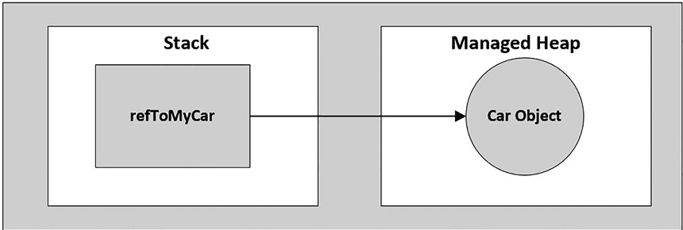
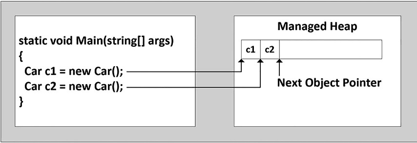
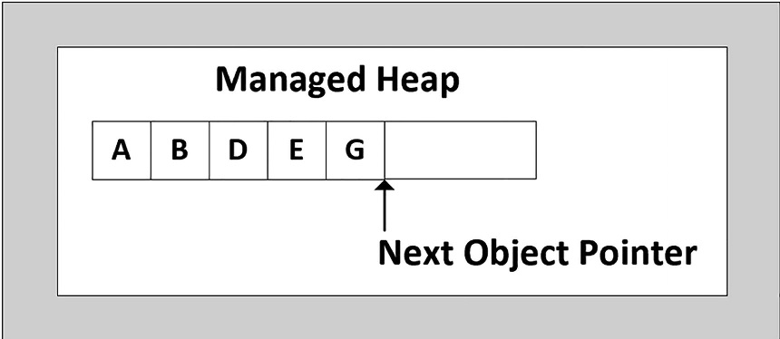
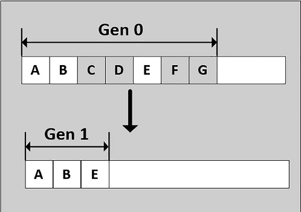

# Розуміння часу життя об’єкта

На цьому етапі ви багато дізналися про те, як створювати власні типи класів за допомогою C#. Тепер ви побачите, як середовище виконання керує виділеними екземплярами класу (також об’єктами) за допомогою збирання сміття (GC). Програмісти на C# ніколи безпосередньо не вилучають керований об’єкт із пам’яті (нагадаємо, що в мові C# немає ключового слова delete). Натомість об’єкти .NET Core розміщуються в області пам’яті, що називається керованою купою, де вони будуть автоматично знищені збирачем сміття «колись у майбутньому».
Ознайомившись із основними деталями процесу збирання, ви дізнаєтеся, як програмно взаємодіяти зі збирачем сміття за допомогою типу класу System.GC (це те, що вам зазвичай не потрібно буде робити для більшості ваших проектів). Далі ви дослідите, як віртуальний метод System.Object.Finalize() та інтерфейс IDisposable можна використовувати для створення класів, які звільняють внутрішні некеровані ресурси передбачуваним і своєчасним способом. 
Ви також заглибитесь у деякі функціональні можливості збирача сміття, включаючи фонове збирання сміття та відкладене створення екземплярів за допомогою загального класу System.Lazy<>. Коли ви закінчите цю главу, ви матимете чітке розуміння того, як середовище виконання керує об’єктами .NET Core.

# Класи, об'єкти та посилання

Щоб сформулювати теми, які розглядаються в цій главі, важливо додатково прояснити різницю між класами, об’єктами та посилальними змінними. Пам’ятайте, що клас – це не що інше, як план, який описує, як екземпляр цього типу виглядатиме та почуватиметься в пам’яті. Звичайно, класи визначаються у файлі коду (який у C# приймає розширення *.cs за домовленістю). Розглянемо наступний простий клас Car, визначений у новому проекті C# Console Application під назвою SimpleGC:

```cs
namespace SimpleGC;

public class Car
{
    public int CurrentSpeed { get; set; }
    public string? PetName { get; set; }

    public Car(string petName,int currentSpeed)
    {
        CurrentSpeed = currentSpeed;
        PetName = petName;
    }

    public Car()
    {
    }

    public override string? ToString() => $"{PetName} is going {CurrentSpeed} MPH";
}
```

Після визначення класу ви можете виділити будь-яку кількість об’єктів за допомогою ключового слова C# new. Зрозумійте, однак, що ключове слово new повертає посилання на об’єкт у купі, а не фактичний об’єкт. Якщо ви оголошуєте посилальну змінну як локальну змінну в області методу, вона зберігається в стеку для подальшого використання у вашій програмі. Якщо ви хочете викликати членів об’єкта, застосуйте оператор C# "." до збереженого посилання, наприклад:

```cs
void CreateInstanceOfType()
{
    // Create a new Car object on the managed heap.
    // We are returned a reference to the object 
    Car refToMyCar = new Car("Zippy",50);

    // The C# dot operator (.) is used to invoke members
    // on the object using our reference variable.
    Console.WriteLine(refToMyCar.CurrentSpeed);
    Console.WriteLine(refToMyCar.ToString());
}
CreateInstanceOfType();
```
```
50
Zippy is going 50 MPH
```

Посилання на об’єкти в керованій купі


Пам’ятайте, що структури – це типи значень, які завжди розподіляються безпосередньо в стеку та ніколи не розміщуються в керованій купі .NET Core. Розподіл купи відбувається лише тоді, коли ви створюєте екземпляри класів.

## Основи часу життя об'єкта

Коли ви створюєте програми на C#, ви правильно припускаєте, що середовище виконання .NET Core подбає про керовану купу без вашого прямого втручання. Насправді золоте правило керування пам’яттю .NET Core просте.

    Виділіть екземпляр класу в керовану купу за допомогою ключового слова new і забудьте про це.

Після створення екземпляра збирач сміття знищить об’єкт, коли він більше не потрібен. Наступне очевидне питання, звісно, ​​таке: «Як збирач сміття визначає, що об’єкт більше не потрібен?». Коротка (тобто неповна) відповідь полягає в тому, що збирач сміття видаляє об’єкт із купи, лише якщо він недоступний для будь-якої частини вашої кодової бази. Припустімо, що у вас є метод, який виділяє локальний об’єкт Car наступним чином:

```cs
static void MakeACar()
{
    // If myCar is the only reference to the Car object,
    // it *may* be destroyed when this method returns.

    Car myCar = new();
}
```

Зверніть увагу, що це посилання (myCar) було створено безпосередньо в методі MakeACar() і не було передано за межі визначеної області (через значення, що повертається, або параметри ref/out). Таким чином, після завершення виклику цього методу посилання myCar більше не доступне, і пов’язаний об’єкт Car тепер є кандидатом для збирання сміття. Зрозумійте, однак, що ви не можете гарантувати, що цей об’єкт буде вилучено з пам’яті одразу після завершення MakeACar(). Усе, що ви можете припустити на даний момент, це те, що коли середовище виконання виконає наступне збирання сміття, об’єкт myCar можна безпечно знищити.
Як ви напевно виявите, програмування в середовищі зібраного сміття значно спрощує розробку вашої програми. Навпаки, програмісти на C++ болісно усвідомлюють, що якщо їм не вдається вручну видалити об’єкти, виділені в купі, витоки пам’яті завжди залишаються позаду. Насправді відстеження витоків пам’яті є одним із найбільш трудомістких (і виснажливих) аспектів програмування в некерованих середовищах. Дозволивши збиральнику сміття взяти на себе відповідальність за знищення об’єктів, тягар керування пам’яттю було знято з ваших плечей і покладено на плечі середовища виконання.

## CIL оператора new

Коли компілятор C# зустрічає ключове слово new, він видає інструкцію CIL newobj. Якщо ви скомпілюєте поточний приклад коду та дослідите отриману збірку за допомогою ildasm.exe, ви знайдете такі оператори CIL у методі MakeACar():

```
.method assembly hidebysig static
          void  '<<Main>$>g__MakeACar|0_0'() cil managed
{
    // Code size       8 (0x8)
    .maxstack  1
    .locals init (class SimpleGC.Car V_0)
    IL_0000: nop
    IL_0001: newobj     instance void SimpleGC.Car::.ctor()
    IL_0006: stloc.0
    IL_0007: ret
  }
```
Перш ніж вивчати точні правила, які визначають, коли об’єкт видаляється з керованої купи, давайте перевіримо роль інструкції CIL newobj трохи детальніше. По-перше, зрозумійте, що керована купа — це більше, ніж просто випадкова частина пам’яті, до якої звертається середовище виконання. Збирач сміття .NET Core є досить акуратним економом купи, враховуючи, що він ущільнюватиме порожні блоки пам’яті (за потреби) з метою оптимізації. Щоб допомогти в цьому, керована купа підтримує вказівник (зазвичай званий вказівником наступного об’єкта або вказівником нового об’єкта), який точно визначає, де буде розташований наступний об’єкт. Тим не менш, інструкція newobj повідомляє середовищу виконання наступні основні операції:

1. Обчисліть загальний обсяг пам’яті, необхідної для об’єкта, який буде розміщено (включно з пам’яттю, необхідною для членів даних і базових класів).
2. Перевірте керовану купу, щоб переконатися, що в ній справді достатньо місця для розміщення об’єкта, який потрібно розмістити. Якщо є, викликається вказаний конструктор, і викликаю в кінцевому рахунку повертається посилання на новий об’єкт у пам’яті, чия адреса просто збігається з останньою позицією покажчика наступного об’єкта.
3. Перш ніж повертати посилання абоненту, перемістіть вказівник наступного об’єкта на наступний доступний слот у керованій купі.

Деталі розміщення об’єктів у керованій купі



Оскільки ваша програма зайнята розподілом об’єктів, простір у керованій купі може з часом заповнитися. Під час обробки інструкції newobj, якщо середовище виконання визначає, що керована купа не має достатньо пам’яті для виділення запитуваного типу, вона виконає збір сміття, намагаючись звільнити пам’ять. Таким чином, наступне правило збирання сміття також досить просте.

    Якщо в керованій купі недостатньо пам’яті для виділення запитуваного об’єкта, відбудеться збірка сміття.

Проте те, як саме відбувається збирання сміття, залежить від того, який тип збирання сміття використовує ваша програма. Ви подивитеся на відмінності трохи пізніше в цьому розділі.

## Встановлення посилань на об’єкт на null

Програмісти C/C ++ часто встановлюють змінні вказівника на NULL, щоб переконатися, що вони більше не посилаються на некеровану пам'ять. Враховуючи це, ви можете задатися питанням, який кінцевий результат присвоєння посилань на об’єкти значення null у C#. Наприклад, припустимо, що MakeACar() оновлено наступним чином:

```cs
static void MakeACar()
{
    Car myCar = new();
    myCar = null;
}
```
Коли ви призначаєте посилання на об’єкт значення null, компілятор генерує код CIL, який гарантує, що посилання (у цьому прикладі myCar) більше не вказує на жодний об’єкт. Якщо ви ще раз використали ildasm.exe для перегляду CIL-коду модифікованого MakeACar(), ви побачите код операції ldnull (який надсилає нульове значення у стек віртуального виконання), а потім код операції stloc.0 (який встановлює нульове посилання на змінну). 
Однак ви повинні розуміти, що призначення посилання null жодним чином не змушує збирач сміття запуститися саме в цей момент і видалити об’єкт із купи. Єдине, чого ви досягли, це явно відсікання зв’язку між посиланням і об’єктом, на який воно раніше вказувало. Враховуючи це, встановлення посилань на null у C# є набагато менш послідовним, ніж це в інших мовах на основі C; однак це точно не завдасть шкоди.

## Визначення того, чи живий об’єкт

А тепер повернемося до теми того, як збирач сміття визначає, коли об’єкт більше не потрібен. Збирач сміття використовує таку інформацію, щоб визначити, чи активний об’єкт:

    Коріння стека: змінні стека, надані компілятором і стеком

    Дескриптори збору сміття: дескриптори, які вказують на керовані об’єкти, на які можна посилатися з коду або середовища виконання

    Статичні дані: статичні об’єкти в доменах програми, які можуть посилатися на інші об’єкти

Під час процесу збирання сміття середовище виконання досліджуватиме об’єкти в керованій купі, щоб визначити, чи доступні вони програмі. Для цього середовище виконання побудує граф об’єктів, який представляє кожен доступний об’єкт у купі. Графи об’єктів пояснюються досить детально під час обговорення серіалізації об’єктів. Наразі просто зрозумійте, що графи об’єктів використовуються для документування всіх доступних об’єктів. Крім того, майте на увазі, що збирач сміття ніколи не побудує графік того самого об’єкта двічі, таким чином уникаючи неприємного циклічного підрахунку посилань, який зустрічається в програмуванні COM.
Припустімо, що керована купа містить набір об’єктів з іменами A, B, C, D, E, F і G. Під час збирання сміття ці об’єкти (а також будь-які внутрішні посилання на об’єкти, які вони можуть містити) перевіряються. Після побудови графа недосяжні об’єкти (якими можна вважати об’єкти C і F) позначаються як сміття.На малюнку зображено можливий граф об’єктів для щойно описаного сценарію (ви можете прочитати стрілки напрямків, використовуючи фразу залежить від або вимагає; наприклад, E залежить від G і ​​B, A не залежить ні від чого тощо).

Графи об’єктів будуються, щоб визначити, які об’єкти доступні для коренів програми


Після того, як об’єкти були позначені для знищення (у цьому випадку C і F, оскільки вони не враховані в графі об’єктів), вони очищаються з пам’яті. У цей момент простір, що залишився в купі, ущільнюється, що, у свою чергу, змушує середовище виконання змінювати набір основних покажчиків, щоб посилатися на правильне розташування пам’яті (це робиться автоматично та прозоро). І останнє, але не менш важливе, покажчик наступного об’єкта змінюється, щоб вказувати на наступний доступний слот.

Чиста і утрамбована купа


Власне кажучи, збирач сміття використовує дві різні купи, одна з яких спеціально використовується для зберігання великих об’єктів. До цієї купи звертаються рідше під час циклу збору, враховуючи можливі втрати продуктивності, пов’язані з переміщенням великих об’єктів. У .NET Core велику купу можна стиснути на вимогу або коли досягнуто необов’язкових жорстких обмежень для абсолютного чи відсоткового використання пам’яті.

## Розуміння генерацій об’єктів

Коли середовище виконання намагається знайти недоступні об’єкти, воно не перевіряє буквально кожен об’єкт, розміщений у керованій купі. Очевидно, що це займе значний час, особливо у великих (тобто реальних) програмах. Щоб оптимізувати процес, кожному об’єкту в купі призначається певне значення «генерації». Ідея, що лежить в основі поколінь, проста: чим довше об’єкт існував у купі, тим більша ймовірність, що він там залишиться. Наприклад, клас, який визначив головне вікно настільної програми, буде в пам’яті, доки програма не завершить роботу. Навпаки, об’єкти, які нещодавно були розміщені в купі (наприклад, об’єкт, виділений у межах методу), швидше за все, будуть недоступні досить швидко. З огляду на ці припущення, кожен об’єкт у купі належить до колекції в одному з наступних поколінь:

Покоління 0: ідентифікує щойно виділений об’єкт, який ніколи не позначався для збору (за винятком великих об’єктів, які спочатку поміщаються в колекцію покоління 2). Більшість об’єктів обираються для збирання сміття в поколінні 0 і тепер виживають до покоління 1.

Покоління 1: Ідентифікує об’єкт, який пережив збирання сміття. Це покоління також служить буфером між короткоживучими об’єктами та довгоіснуючими об’єктами.

Покоління 2: Ідентифікує об’єкт, який витримав більше одного циклу збирання сміття, або значно великий об’єкт, який почався у збиранні покоління 2.

Покоління 0 і 1 називаються ефемерними поколіннями. Як пояснюється в наступному розділі, ви побачите, що процес збирання сміття по-різному обробляє ефемерні покоління.
Збирач сміття спочатку дослідить усі об’єкти покоління 0. Якщо позначення та очищення (або, простіше кажучи, позбавлення) цих об’єктів призводить до отримання необхідного обсягу вільної пам’яті, усі вцілілі об’єкти підвищуються до покоління 1. Щоб побачити, як генерація об’єкта впливає на процес збирання, поміркуйте на малюнку, на якому показано, як набір уцілілих об’єктів покоління 0 (A, B та E) просувається після того, як потрібна пам’ять була звільнена.

Об’єкти покоління 0, які вижили після збирання сміття, підвищуються до покоління 1


Якщо всі об’єкти покоління 0 було оцінено, але все ще потрібна додаткова пам’ять, об’єкти покоління 1 перевіряються на доступність і збираються відповідно. Уцілілі об’єкти покоління 1 потім підвищуються до покоління 2. Якщо збиральник сміття все ще потребує додаткової пам’яті, об’єкти покоління 2 оцінюються. На цьому етапі, якщо об’єкт покоління 2 виживає після збирання сміття, він залишається об’єктом покоління 2, враховуючи попередньо визначену верхню межу поколінь об’єктів. Суть полягає в тому, що, призначаючи значення покоління об’єктам у купі, нові об’єкти (такі як локальні змінні) будуть швидко видалені, тоді як старі об’єкти (такі як головне вікно програми) не «турбуються» так часто.

Збирання сміття запускається, коли в системі мало фізичної пам’яті, коли пам’ять, виділена в керованій купі, перевищує допустиме порогове значення або коли в коді програми викликається GC.Collect().
Якщо все це здається трохи чудовим і кращим, ніж необхідність самостійно керувати пам’яттю, пам’ятайте, що процес збирання сміття не без певних витрат. Час збирання сміття та те, що збирається, як правило, поза контролем розробників, хоча на збирання сміття, безперечно, можна вплинути добре чи погано. А коли виконується збирання сміття, використовуються цикли ЦП, що може вплинути на продуктивність програми. У наступних секціях глави розглядаються різні типи збирання сміття.

### Ефемерні покоління та сегменти

Як згадувалося раніше, покоління 0 і 1 є короткочасними і відомі як ефемерні покоління. Ці покоління розподіляються в сегменті пам’яті, відомому як ефемерний сегмент. У міру збирання сміття нові сегменти, отримані за допомогою збору сміття, стають новими ефемерними сегментами, а сегмент, що містить об’єкти, що пережили минуле покоління 1, стає сегментом нового покоління 2. Розмір ефемерного сегмента залежить від ряду факторів, таких як тип збирання сміття (розглянемо далі) і розрядність системи.

Ефемерні розміри сегментів
|Garbage Collection Type|32-bit|64-bit|
|-----------------------|------|------|
|Workstation|16 MB|256 MB|
|Server|64 MB|4 GB|
|Server with > 4 logical CPUs|32 MB|2 GB|
|Server with > 8 logical CPUs|16 MB|1 GB|

### Види збору сміття

Існує два типи збирання сміття, яке забезпечує середовище виконання:

    Збірка сміття робочої станції: призначена для клієнтських програм і є типовою для автономних програм. GC на робочій станції може бути фоновим (розглянемо далі) або без парралельності.

    Збірка серверного сміття: призначена для серверних програм, які потребують високої пропускної здатності та масштабованості. GC сервера може бути фоновим або неконкурентним, як і GC робочої станції.

Назви вказують на параметри за замовчуванням для програм робочої станції та сервера, але метод збирання сміття можна налаштувати за допомогою runtimeconfig.json машини або змінних системного середовища.

GC робочої станції відбувається в тому самому потоці, який ініціював збирання сміття, і залишається з тим самим пріоритетом, що й під час його запуску. Це може спричинити конкуренцію з іншими потоками в програмі. 
GC сервера виникає в кількох виділених потоках, для яких встановлено рівень пріоритету THREAD_PRIORITY_HIGHEST. Кожен ЦП отримує виділену купу та виділений потік для збирання сміття. Це може призвести до того, що збір сміття сервера стане дуже ресурсомістким.

### Фонове збирання сміття

Починаючи з .NET 4.0 (і продовжуючи в .NET Core), збирач сміття може мати справу з призупиненням потоку, коли він очищає об’єкти в керованій купі, використовуючи фонове збирання сміття. Незважаючи на назву, це не означає, що збирання сміття тепер відбувається на додаткових фонових потоках виконання. Навпаки, якщо фонове збирання сміття відбувається для об’єктів, що живуть у неефемерному поколінні, середовище виконання .NET Core тепер може збирати об’єкти в ефемерних поколіннях за допомогою виділеного фонового потоку.
У зв’язку з цим збирання сміття .NET 4.0 і новіших версій було вдосконалено, щоб ще більше скоротити час, протягом якого певний потік, пов’язаний із деталями збирання сміття, має бути призупинено. Кінцевим результатом цих змін є те, що процес очищення невикористаних об’єктів, що живуть у поколінні 0 або поколінні 1, було оптимізовано та може призвести до кращої продуктивності ваших програм під час виконання (що дуже важливо для систем реального часу, яким потрібен малий і передбачуваний час зупинки GC). 
Однак майте на увазі, що впровадження цієї нової моделі збирання сміття не впливає на те, як ви створюєте свої програми .NET Core. Для всіх практичних цілей ви можете просто дозволити збиральнику сміття виконувати свою роботу без вашого прямого втручання (і радіти, що люди з Microsoft покращують процес збирання сміття прозорим чином).

# Тип  System.GC

Збірка mscorlib.dll надає тип класу під назвою System.GC, який дозволяє програмно взаємодіяти зі збирачем сміття за допомогою набору статичних членів. Тепер майте на увазі, що вам рідко (якщо колись) потрібно буде використовувати цей клас безпосередньо у вашому коді. Як правило, ви використовуєте члени System.GC лише тоді, коли ви створюєте класи, які внутрішньо використовують некеровані ресурси. Це може статися, якщо ви створюєте клас, який здійснює виклики API на основі Windows C за допомогою протоколу виклику платформи .NET Core або, можливо, через деяку дуже низькорівневу та складну логіку взаємодії COM. Таблиця надає короткий перелік деяких найбільш цікавих членів (зверніться до документації .NET Framework SDK для повної інформації).

Деякі члени типу System.GC

|Член класу|Опис|
|----------|----|
|AddMemoryPressure() RemoveMemoryPressure()|Дозволяє вказати числове значення, яке представляє «рівень терміновості» об’єкта виклику щодо процесу збирання сміття. Майте на увазі, що ці методи мають одночасно змінювати тиск і, таким чином, ніколи не зменшувати тиск більше, ніж загальна кількість, яку ви додали.|
|Collect()|Змушує GC виконувати збір сміття.Цей метод було перевантажено, щоб указати покоління для збору, а також режим збору (через перерахування GCCollectionMode).|
|CollectionCount()|Повертає числове значення, яке вказує, скільки разів певне покоління було переміщено.|
|GetGeneration()|Повертає покоління, до якого зараз належить об’єкт.|
|GetTotalMemory()|Повертає приблизний обсяг пам’яті (у байтах), який наразі виділено в керованій купі.Логічний параметр визначає, чи повинен виклик очікувати збирання сміття перед поверненням.|
|MaxGeneration|Повертає максимальну кількість поколінь, підтримуваних цільовою системою.|
|SuppressFinalize()|Встановлює прапорець, який вказує, що вказаний об’єкт не повинен викликати метод Finalize().|
|WaitForPendingFinalizers()|Призупиняє поточний потік, доки всі об’єкти, які можна завершити, не будуть завершені. Цей метод зазвичай викликається безпосередньо після виклику GC.Collect().|

Щоб проілюструвати, як тип System.GC можна використовувати для отримання різних деталей, орієнтованих на збирання сміття, створіть метод проекту SimpleGC, який використовує кілька членів GC:

```cs
void MemebersSystemGC()
{
    Console.WriteLine($"Estimated bytes on heap: {GC.GetTotalMemory(false)}");
    Console.WriteLine($"This OS has {GC.MaxGeneration+1} object generations.");
    Car car = new("Zippy", 50);
    Console.WriteLine(car);
    Console.WriteLine($"Generation of car is: {GC.GetGeneration(car)}");
}
MemebersSystemGC();
```
```
Estimated bytes on heap: 82864
This OS has 3 object generations.
Zippy is going 50 MPH
Generation of car is: 0
```

## Примусове збирання сміття

Знову ж таки, цільовим призначенням збирача сміття є керування пам’яттю від вашого імені. Однак у деяких рідкісних випадках може бути корисним програмно примусово збирати сміття за допомогою GC.Collect(). Ось дві поширені ситуації, коли ви можете розглянути можливість взаємодії з процесом збору:

1. Ваша програма збирається ввести блок коду, який ви не хочете переривати можливим збиранням сміття.
2. Ваша програма щойно завершила розміщення надзвичайно великої кількості об’єктів, і ви хочете якомога швидше видалити якомога більше отриманої пам’яті.

Якщо ви визначите, що може бути корисним, щоб збирач сміття перевіряв недоступні об’єкти, ви можете явно запустити збирання сміття, як показано нижче:

```cs
// Force a garbage collection and wait for
// each object to be finalized.
GC.Collect();
GC.WaitForPendingFinalizers();
```

Коли ви вручну примусово збираєте сміття, вам завжди слід викликати GC.WaitForPendingFinalizers(). Завдяки такому підходу ви можете бути впевнені, що всі об’єкти, які можна завершити (описані в наступному розділі), мали можливість виконати будь-яке необхідне очищення перед продовженням роботи вашої програми. Під капотом GC.WaitForPendingFinalizers() призупинить виклик потоку під час процесу збору. Це добре, оскільки це гарантує, що ваш код не викликає методи об’єкта, який зараз знищується!
Методу GC.Collect() також можна надати числове значення, яке ідентифікує найстаріше покоління, на якому буде виконано збирання сміття. Наприклад, щоб наказати середовищу виконання досліджувати лише об’єкти покоління 0, ви повинні написати наступне:

```cs
// Only investigate generation 0 objects.
GC.Collect(0);
GC.WaitForPendingFinalizers();
```
Крім того,у метод Collect() можна передати у значення перерахування GCCollectionMode як другий параметр, щоб точно налаштувати, як саме середовище виконання має примусово збирати сміття. Цей перелік визначає такі значення:

```cs
public enum GCCollectionMode
{
  Default,  // Forced is the current default.
  Forced,   // Tells the runtime to collect immediately!
  Optimized // Allows the runtime to determine whether the current time is optimal to reclaim objects.
}
```
Як і будь-яке збирання сміття, виклик GC.Collect() сприяє збереженню поколінь.

```cs
void ForcingAGarbageCollection()
{
    Console.WriteLine($"Estimated bytes on heap: {GC.GetTotalMemory(false)}");
    Console.WriteLine($"This OS has {GC.MaxGeneration + 1} object generations.");
    Car car = new("Zippy", 50);
    Console.WriteLine(car);
    Console.WriteLine($"Generation of car is: {GC.GetGeneration(car)}");
    Console.WriteLine();

    // Make a ton of objects for testing purposes.
    object[] tonsOfObjects = new object[50000];
    for (int i = 0; i < 50000; i++)
    {
        tonsOfObjects[i] = new object();
    }

    // Collect only gen 0 objects.
    Console.WriteLine("Force Garbage Collection");
    GC.Collect(0, GCCollectionMode.Forced);
    GC.WaitForPendingFinalizers();
    Console.WriteLine();

    // Print out generation of car.
    Console.WriteLine($"Generation of car is: {GC.GetGeneration(car)}");

    // See if tonsOfObjects[9000] is still alive.
    if (tonsOfObjects[9000]!=null)
    {
        Console.WriteLine($"Generation of tonsOfObjects[9000] is: " +
            $"{GC.GetGeneration(tonsOfObjects[9000])}");
    }
    else
    {
        Console.WriteLine("tonsOfObjects[9000] is no longer alive.");
    }
    Console.WriteLine();

    // Print out how many times a generation has been swept.
    Console.WriteLine($"Gen 0 has been swept {GC.CollectionCount(0)} times");
    Console.WriteLine($"Gen 1 has been swept {GC.CollectionCount(1)} times");
    Console.WriteLine($"Gen 2 has been swept {GC.CollectionCount(2)} times");
    Console.WriteLine();

    Console.WriteLine($"Estimated bytes on heap: {GC.GetTotalMemory(false)}");
}
ForcingAGarbageCollection();
```
```
Estimated bytes on heap: 86488
This OS has 3 object generations.
Zippy is going 50 MPH
Generation of car is: 0

Force Garbage Collection

Generation of car is: 1
Generation of tonsOfObjects[9000] is: 1

Gen 0 has been swept 1 times
Gen 1 has been swept 0 times
Gen 2 has been swept 0 times

Estimated bytes on heap: 1699248
```
Тут спеціально створено великий масив типів об’єктів (точніше 50 000) для цілей тестування. 

На цьому етапі, я сподіваюся, ви почуваєтесь зручніше щодо деталей тривалості життя об’єкта. У наступній секції ви розглянете процес збирання сміття трохи далі, розглянувши, як ви можете створити об’єкти, які можна завершити, а також об’єкти одноразового використання. Майте на увазі, що наведені нижче прийоми зазвичай необхідні, лише якщо ви створюєте класи C#, які підтримують внутрішні некеровані ресурси.

# Створення фіналізованих об’єктів

Найвищий базовий клас .NET Core, System.Object, визначає віртуальний метод під назвою Finalize(). Стандартна реалізація цього методу взагалі нічого не робить.

```cs
// System.Object
public class Object
{
  ...
  protected virtual void Finalize() {}
}
```
Коли ви перевизначаєте Finalize() для своїх користувацьких класів, ви встановлюєте конкретне розташування для виконання будь-якої необхідної логіки очищення для вашого типу. Враховуючи, що цей член визначено як захищений, неможливо напряму викликати метод Finalize() об’єкта з екземпляра класу через оператор крапки. Навпаки, збирач сміття викличе метод Finalize() об’єкта (якщо підтримується) перед видаленням об’єкта з пам’яті.

Перевизначення Finalize() для типів структур є незаконним. Це має досконалий сенс, враховуючи, що структури є типами значень, які ніколи не розміщуються в купі, і, отже, не збираються сміттям! Однак, якщо ви створюєте структуру, яка містить некеровані ресурси, які потрібно очистити, ви можете реалізувати інтерфейс IDisposable (описано коротко). Пам’ятайте, що ref struct та ref struct red-only лише для читання не можуть реалізувати інтерфейс, але можуть реалізувати метод Dispose(). 
Звичайно, виклик Finalize() відбуватиметься під час стандартного збору сміття або, можливо, коли ви програмно примусово збиратимете його за допомогою GC.Collect(). У попередніх версіях .NET (не .NET Core) фіналізатор кожного об’єкта викликається після завершення роботи програми. У .NET Core немає жодного способу примусово виконати фіналізатор, навіть якщо програму закрито.
Тепер, незважаючи на те, що може підказувати вам інстинкт розробника, переважна більшість ваших класів C# не потребуватимуть жодної явної логіки очищення чи спеціального фіналізатора. Причина проста: якщо ваші класи просто використовують інші керовані об’єкти, зрештою все буде зібрано як сміття. Єдиний раз, коли вам знадобиться створити клас, який може очищати після себе, це коли ви використовуєте некеровані ресурси (такі як необроблені дескриптори файлів ОС, необроблені некеровані підключення до бази даних, шматки некерованої пам’яті або інші некеровані ресурси). На платформі .NET Core некеровані ресурси отримують шляхом прямого виклику API операційної системи за допомогою служб виклику платформи (PInvoke) або в результаті деяких складних сценаріїв взаємодії COM. Враховуючи це, розглянемо наступне правило збору сміття.

    Єдина вагома причина перевизначити Finalize() полягає в тому, що ваш клас C# використовує некеровані ресурси через PInvoke або складні завдання сумісності COM (зазвичай через різні члени, визначені типом System.Runtime.InteropServices.Marshal). Причина полягає в тому, що за таких сценаріїв ви маніпулюєте пам’яттю, якою середовище виконання не може керувати.

## Перевизначення System.Object.Finalize()

У тих рідкісних випадках, коли ви створюєте клас C#, який використовує некеровані ресурси, ви, очевидно, захочете переконатися, що використанна пам’ять звільняється передбачуваним чином.

Припустімо, що ви створили новий проект C# Console Application під назвою SimpleFinalize і вставили клас під назвою MyResourceWrapper, який використовує некерований ресурс (що б це не було), і ви хочете перевизначити Finalize(). Дивна річ у C# полягає в тому, що ви не можете зробити це за допомогою очікуваного ключового слова override.

```cs
namespace SimpleFinalize;
class MyResourceWrapper
{
  // Compile-time error!
  protected override void Finalize(){ }
}
```
Натомість, коли ви хочете налаштувати власні типи класів C# для заміни методу Finalize(), ви використовуєте (подібний до C++) синтаксис деструктора, щоб досягти того самого ефекту. Причина цієї альтернативної форми перевизначення віртуального методу полягає в тому, що коли компілятор C# обробляє синтаксис фіналізатора, він автоматично додає велику частину необхідної інфраструктури в неявно перевизначений метод Finalize().
Фіналізатори C# виглядають подібно до конструкторів, оскільки вони мають імена, ідентичні класу, у якому вони визначені. Крім того, перед фіналізаторами ставиться символ тильди (~). Однак, на відміну від конструктора, фіналізатор ніколи не приймає модифікатор доступу (вони неявно захищені), ніколи не приймає параметри та не може бути перевантажений (лише один фіналізатор на клас).
Нижче наведено спеціальний фіналізатор для MyResourceWrapper, який видасть системний звуковий сигнал під час виклику. Очевидно, що цей приклад лише для ознайомлення. Реальний фіналізатор не зробить нічого, крім того, щоб звільнити будь-які некеровані ресурси, і не взаємодіятиме з іншими керованими об’єктами, навіть з тими, на які посилається поточний об’єкт, оскільки ви не можете вважати, що вони все ще живі в момент, коли збирач сміття викликає ваш метод Finalize().

```cs
namespace SimpleFinalize;

class MyResourceWrapper
{
    // Override System.Object.Finalize() via finalizer syntax.
    ~MyResourceWrapper()
    {
        // Clean up unmanaged resources here.

        // Beep when destroyed (testing purposes only!)
        Console.Beep();
    }
}
```
Якби ви перевірили цей деструктор C# за допомогою ildasm.exe, ви б побачили, що компілятор вставляє необхідний код перевірки помилок. По-перше, оператори коду в межах вашого методу Finalize() розміщуються в блоці try. Пов’язаний блок finally гарантує, що метод Finalize() вашого базового класу завжди виконуватиметься, незалежно від будь-яких винятків, які трапляються в області try.

```
.method family hidebysig virtual instance void
  Finalize() cil managed
  {
    .override [System.Runtime]System.Object::Finalize
    // Code size       17 (0x11)
    .maxstack  1
    .try
    {
      IL_0000:  call  void [System.Console]System.Console::Beep()
      IL_0005: nop
      IL_0006: leave.s    IL_0010
    }  // end .try
    finally
    {
      IL_0008:  ldarg.0
      IL_0009:  call instance void [System.Runtime]System.Object::Finalize()
      IL_000e:  nop
      IL_000f:  endfinally
    }  // end handler
    IL_0010:  ret
  } // end of method MyResourceWrapper::Finalize
```
Якщо ви потім перевірили тип MyResourceWrapper, ви побачите, що системний звуковий сигнал виникає під час виконання фіналізатора.

```cs
using SimpleFinalize;

void FinalizerExecutes()
{
    Console.WriteLine("Hit return to create the objects ");
    Console.WriteLine("then force the GC to invoke Finalize()");
    Console.ReadLine();
    CreateObject(10);
    //Artificially inflate the memory pressure
    GC.AddMemoryPressure(2147483647);
    GC.Collect(0, GCCollectionMode.Forced);
    GC.WaitForPendingFinalizers();

    static void CreateObject(int count)
    {
        MyResourceWrapper[]? tonsOfObjects = new MyResourceWrapper[count];
        for (int i = 0; i < count; i++)
        {
            tonsOfObjects[i] = new MyResourceWrapper();
        }
        //tonsOfObjects = null;
    }
}
FinalizerExecutes();
```

## Деталі процесу фіналізації

Важливо завжди пам’ятати, що роль методу Finalize() полягає в тому, щоб гарантувати, що об’єкт .NET Core може очищати некеровані ресурси під час збирання сміття. Таким чином, якщо ви будуєте клас, який не використовує некеровану пам'ять (на сьогоднішній день найпоширеніший випадок), фіналізація мало користі. Насправді, якщо це взагалі можливо, ви повинні проектувати свої типи так, щоб уникнути підтримки методу Finalize() з тієї простої причини, що фіналізація вимагає часу.
Коли ви розміщуєте об’єкт у керованій купі, середовище виконання автоматично визначає, чи підтримує ваш об’єкт спеціальний метод Finalize(). Якщо так, об’єкт позначається як такий, що можна завершити, а вказівник на цей об’єкт зберігається у внутрішній черзі під назвою «черга фіналізації». Черга завершення — це таблиця, яка підтримується збирачем сміття, яка вказує на кожен об’єкт, який потрібно завершити перед видаленням із купи. Коли збирач сміття визначає, що настав час звільнити об’єкт із пам’яті, він перевіряє кожен запис у черзі фіналізації та копіює об’єкт із купи в іншу керовану структуру, яка називається таблицею доступності для фіналізації (часто скорочена як freachable і вимовляється як «eff-reachable»). На цьому етапі створюється окремий потік для виклику методу Finalize() для кожного об’єкта в таблиці, яка може бути використана під час наступного збору сміття. Враховуючи це, знадобиться щонайменше дві збірки сміття, щоб справді завершити об’єкт.
Суть полягає в тому, що, незважаючи на те, що фіналізація об’єкта гарантує, що об’єкт може очищати некеровані ресурси, вона все ще є недетермінованою за своєю природою та, через додаткову приховану обробку, значно повільніша.

# Створення Dispoasble (якого можна позбутися, утілізувати)  об’єктів.

Як ви бачили, фіналізатори можна використовувати для звільнення некерованих ресурсів, коли спрацьовує збирач сміття. Однак, враховуючи те, що багато некерованих об’єктів є «дорогоцінними елементами» (наприклад, необроблена база даних або дескриптори файлів), було б корисно звільнити їх якомога швидше, а не покладатися на збирання сміття. Як альтернатива заміні Finalize(), ваш клас може реалізувати інтерфейс IDisposable, який визначає єдиний метод під назвою Dispose() наступним чином:

```cs
public interface IDisposable
{
  void Dispose();
}
```
Коли ви реалізуєте інтерфейс IDisposable, припускається, що коли користувач об’єкта закінчує використовувати об’єкт, користувач об’єкта вручну викликає Dispose(), перш ніж дозволити посиланню на об’єкт вийти за межі області. Таким чином, об’єкт може виконати будь-яке необхідне очищення некерованих ресурсів, не ставлячи його в чергу фіналізації та не чекаючи, поки збирач сміття запустить логіку фіналізації класу. 

Структури без посилань і типи класів можуть реалізувати IDisposable (на відміну від перевизначення Finalize(), який зарезервований для типів класів), оскільки користувач об’єкта (а не збирач сміття) викликає метод Dispose().

Щоб проілюструвати використання цього інтерфейсу, створіть новий проект C# Console Application під назвою SimpleDispose. Ось оновлений клас MyResourceWrapper, який тепер реалізує IDisposable, а не перевизначає System.Object.Finalize():

```cs
namespace SimpleDispose;

class MyResourceWrapper : IDisposable
{
    // The object user should call this method
    // when they finish with the object.
    public void Dispose()
    {
        // Clean up unmanaged resources...
        // Dispose other contained disposable objects...
        // Just for a test.
        Console.WriteLine("I'm cleaning up unmanaged resources in Dispose.");
    }
}

```
Зауважте, що метод Dispose() не лише відповідає за звільнення некерованих ресурсів типу, але також може викликати Dispose() для будь-яких інших наявних disposable методів. На відміну від Finalize(), обмінюватися даними з іншими керованими об’єктами в рамках методу Dispose() цілком безпечно. Причина проста: збирач сміття не має поняття про інтерфейс IDisposable і ніколи не викличе Dispose(). Таким чином, коли користувач об’єкта викликає цей метод, об’єкт все ще живе продуктивним життям у керованій купі та має доступ до всіх інших об’єктів, виділених у купі. Показана тут логіка виклику проста:

```cs
static void InvokeDispose()
{
    // Create a disposable object and call Dispose()
    // to free any internal resources.
    MyResourceWrapper myResource = new MyResourceWrapper();
    myResource.Dispose();
}
InvokeDispose();
```
```
I'm cleaning up unmanaged resources in Dispose.
```

Звичайно, перш ніж спробувати викликати Dispose() для об’єкта, ви захочете переконатися, що тип підтримує інтерфейс IDisposable. Хоча зазвичай ви дізнаєтеся, які типи бібліотек базового класу реалізують IDisposable, звернувшись до документації, програмну перевірку можна виконати за допомогою ключового слова is або as.

```cs
static void InvokeDisposeWithChecking()
{
    MyResourceWrapper myResource = new();
    if (myResource is IDisposable)
    {
        myResource.Dispose();
    }
}
InvokeDispose();
```
```
I'm cleaning up unmanaged resources in Dispose.
```
 
Цей приклад демонструє ще одне правило щодо керування пам’яттю.

    Доцільно викликати Dispose() для будь-якого безпосередньо створеного об’єкта, якщо об’єкт підтримує IDisposable. Припущення, яке ви повинні зробити, полягає в тому, що якщо розробник класу вирішив підтримувати метод Dispose(), тип має виконати певне очищення. Якщо ви забудете, пам’ять з часом буде очищено (тому не панікуйте), але це може зайняти більше часу, ніж потрібно.

До попереднього правила є одне застереження. Деякі типи в бібліотеках базових класів, які реалізують інтерфейс IDisposable, надають (дещо заплутаний) псевдонім методу Dispose(), намагаючись зробити метод, орієнтований на утилізацію, звучащим більш природним для визначального типу. Як приклад, хоча клас System.IO.FileStream реалізує IDisposable і тому підтримує метод Dispose(), він також визначає наступний метод Close(), який використовується з тією ж метою:

```cs
static void DisposeFileStream()
{
    FileStream fileStream = new FileStream("myFile.txt", FileMode.OpenOrCreate);
    // Confusing, to say the least!
    // These method calls do the same thing!
    fileStream.Close();
    fileStream.Dispose();
}
```
Хоча більш природно «закрити» файл, а не «утилізувати» його, таке подвоєння методів очищення може збити з пантелику. Для кількох типів, які надають псевдонім, просто пам’ятайте, що якщо тип реалізує IDisposable, виклик Dispose() завжди є безпечним способом дії.

## Ще одне використання ключового слова C# using

Коли ви працюєте з керованим об’єктом, який реалізує IDisposable, досить поширеним є використання структурованої обробки винятків, щоб забезпечити виклик методу Dispose() типу у випадку виняткової ситуації під час виконання, наприклад:

```cs
static void TryAndDispose()
{
    MyResourceWrapper resource = new();

    try
    {
        // Use the members of resource.
    }
    finally
    {
        resource.Dispose();
    }
}
```
Хоча це чудовий приклад захисного програмування, правда полягає в тому, що небагато розробників у захваті від перспективи загортання кожного одноразового типу в блок try/finally лише для забезпечення виклику методу Dispose(). Щоб досягти того самого результату набагато менш нав’язливим способом, C# підтримує спеціальний синтаксис, який виглядає так:

```cs

static void KeywordUsing1()
{
    // Dispose() is called automatically when the using scope exits.
    using (MyResourceWrapper resource = new())
    {
        Console.WriteLine("Use the members of resource.");
    }
}
KeywordUsing1();
```
```
Use the members of resource.
I'm cleaning up unmanaged resources in Dispose.
```
Якщо ви подивитеся на наведений нижче CIL-код інструкцій верхнього рівня за допомогою ildasm.exe, ви побачите, що синтаксис використання справді розширюється до логіки try/finally з очікуваним викликом Dispose():

```
.method private hidebysig static void
    '<Main>$'(string[] args) cil managed
{
...
  .try
  {
  }  // end .try
  finally
  {
      IL_0019:  callvirt   instance void [System.Runtime]System.IDisposable::Dispose()
  }  // end handler
} // end of method '<Program>$'::'<Main>$'
```
Якщо ви спробуєте використати об’єкт, який не реалізує IDisposable, ви отримаєте помилку компілятора.

Хоча цей синтаксис усуває необхідність вручну обгортати одноразові об’єкти в логіку try/finally, ключове слово C# using, на жаль, тепер має подвійне значення (імпорт просторів імен і виклик методу Dispose()). Тим не менш, коли ви працюєте з типами, які підтримують інтерфейс IDisposable, ця синтаксична конструкція забезпечить автоматичний виклик методу Dispose() об’єкта, який «використовується», після завершення блоку using.
Також майте на увазі, що можна оголосити декілька об’єктів одного типу в межах використання. Як і слід було очікувати, компілятор вставлятиме код для виклику Dispose() до кожного оголошеного об’єкта.
```cs

```
```
Use the members of resource1.
Use the members of resource2.
I'm cleaning up unmanaged resources in Dispose.
I'm cleaning up unmanaged resources in Dispose.
```
Використання using як декларування — це оголошення змінної, якому передує ключове слово using. Це функціонально такий же синтаксис, як і в останньому питанні, за винятком явного блоку коду, позначеного дужками ({}).
```cs
static void UsingDeclaration()
{
    using MyResourceWrapper resource = new();

    Console.WriteLine("Use the members of resource.");
}
UsingDeclaration();
```
```
Use the members of resource.
I'm cleaning up unmanaged resources in Dispose.
```

Ця нова функція, по суті, є магією компілятора, що економить кілька натискань клавіш. Будьте обережні, використовуючи його, оскільки новий синтаксис не такий явний, як попередній синтаксис.

# Створення Finalizable і Disposable типів

На цьому етапі ви побачили два різні підходи до побудови класу, який очищає внутрішні некеровані ресурси. З одного боку, можна використовувати фіналізатор. Використовуючи цю техніку, ви матимете душевний спокій, який приходить із знанням, що об’єкт самостійно очищається після збирання сміття (коли б це не було) без необхідності взаємодії з користувачем. З іншого боку, ви можете реалізувати IDisposable, щоб забезпечити спосіб для користувача об’єкта очистити об’єкт, як тільки він закінчиться. Однак, якщо абонент забуває викликати Dispose(), некеровані ресурси можуть зберігатися в пам’яті необмежений час.
Як ви можете підозрювати, можна поєднати обидва методи в одному визначенні класу. Роблячи це, ви отримуєте найкраще з обох моделей. Якщо користувач об’єкта пам’ятає про виклик Dispose(), ви можете повідомити збиральнику сміття обійти процес фіналізації, викликавши GC.SuppressFinalize(). Якщо користувач об’єкта забуде викликати Dispose(), об’єкт буде остаточно фіналізовано та матиме шанс звільнити внутрішні ресурси. Хороша новина полягає в тому, що внутрішні некеровані ресурси об’єкта так чи інакше будуть звільнені. Ось наступна ітерація MyResourceWrapper, яку тепер можна фіналізувати та використовувати IDisposable, визначену в проекті C# Console Application під назвою FinalizableDisposableClass:

```cs
namespace FinalizableDisposableClass;

// A sophisticated resource wrapper.
public class MyResourceWrapper : IDisposable
{
    // The garbage collector will call this method
    // if the object user forgets to call Dispose().
    ~MyResourceWrapper()
    {
        // Clean up any internal unmanaged resources.
        // Do **not** call Dispose() on any managed objects.
        Console.Beep();
    }

    // The object user will call this method
    // to clean up resources ASAP.
    public void Dispose()
    {
        // Clean up unmanaged resources here.
        // Call Dispose() on other contained disposable objects.
        // No need to finalize if user called Dispose(), so suppress finalization.
        Console.WriteLine("I'm cleaning up unmanaged resources in Dispose.");
        GC.SuppressFinalize(this);
    }
}

```

Використання.

```cs
static void UsingDisposeAndFinalizer()
{
    UsingDispose();
    UsingFinalizer();

    static void UsingDispose()
    {

        using MyResourceWrapper resource1 = new();

        Console.WriteLine("Use the members of resource.");
    }

    static void UsingFinalizer()
    {
        CreateObject();
        GC.Collect(0, GCCollectionMode.Forced);
        GC.WaitForPendingFinalizers();

        static void CreateObject()
        {
            MyResourceWrapper resource = new();
        }
    }
}
UsingDisposeAndFinalizer();
```
```
Use the members of resource.
I'm cleaning up unmanaged resources in Dispose.
```
Зверніть увагу, що цей метод Dispose() було оновлено для виклику GC.SuppressFinalize(), який інформує середовище виконання про те, що більше не потрібно викликати деструктор, коли цей об’єкт збирається як сміття, оскільки некеровані ресурси вже звільнено за допомогою логіки Dispose().

# Формалізована схема утилізації (Disposal Pattern)

Поточна реалізація MyResourceWrapper працює досить добре; однак у вас все ще є кілька дрібних недоліків. По-перше, методи Finalize() і Dispose() повинні очистити ті самі некеровані ресурси. Це може призвести до дублювання коду, обслуговування якого може стати кошмаром. В ідеалі ви б визначили приватну допоміжну функцію, яка викликається будь-яким методом. Далі ви хочете переконатися, що метод Finalize() не намагається позбутися будь-яких керованих об’єктів, тоді як метод Dispose() повинен робити це. Нарешті, ви також хочете переконатися, що користувач об’єкта може безпечно викликати Dispose() кілька разів без помилок. Наразі метод Dispose() не має таких гарантій.
Щоб вирішити ці проблеми дизайну, корпорація Майкрософт визначила формальний, первинний і належний шаблон утилізації, який забезпечує баланс між надійністю, ремонтопридатністю та продуктивністю. Ось остаточна (і анотована) версія MyResourceWrapper, яка використовує цей офіційний шаблон (проект Disposal Pattern):

```cs
namespace DisposalPattern;

public class MyResourceWrapper : IDisposable
{
    // Used to determine if Dispose() has already been called.
    private bool disposed = false;

    private void CleanUp(bool disposing)
    {
        // Be sure we have not already been disposed!
        if (!disposed)
        {
            // If disposing equals true, dispose all managed resources.
            if (disposing)
            {
                // Dispose managed resources.
                Console.WriteLine("Dispose managed resources.");
            }
            // Clean up unmanaged resources here.
            Console.WriteLine("Clean up unmanaged resources here");
        }
        disposed = true;
    }

    ~MyResourceWrapper()
    {
        // Call our helper method.
        // Specifying 'false' signifies that the GC triggered the cleanup.
        CleanUp(false);
    }
    public void Dispose()
    {
        // Call our helper method.
        // Specifying 'true' signifies that the object user triggered the cleanup.
        CleanUp(true);
        // Now suppress finalization.
        GC.SuppressFinalize(this);
    }
}
```

Зверніть увагу, що MyResourceWrapper тепер визначає приватний допоміжний метод під назвою CleanUp(). Вказуючи true як аргумент, ви вказуєте, що користувач об’єкта ініціював очищення, тому вам слід очистити всі керовані та некеровані ресурси. Однак, коли збирач сміття ініціює очищення, ви вказуєте false під час виклику CleanUp(), щоб гарантувати, що внутрішні disposable об’єкти не будуть утилізовані (оскільки ви не можете вважати, що вони все ще знаходяться в пам’яті!). І останнє, але не менш важливе: для змінної-члена bool (disposed) встановлюється значення true перед виходом із CleanUp(), щоб переконатися, що Dispose() можна викликати багато разів без помилок.

Після того, як об’єкт було «disposed», клієнт все ще може викликати його учасників, оскільки він все ще знаходиться в пам’яті. Таким чином, надійний клас-оболонка ресурсів також повинен оновлювати кожного члена класу додатковою логікою кодування, яка, по суті, каже: «Якщо мене викидають, нічого не робіть і повертайтеся від цього члена».


```cs
using FinalizableDisposableClass;

static void UsingDisposeAndFinalizer()
{
    Console.WriteLine("\tUsingDispose");
    UsingDispose();
    Console.WriteLine("\n\tUsingFinalizer");
    UsingFinalizer();

    static void UsingDispose()
    {

        using MyResourceWrapper resource1 = new();

        Console.WriteLine("Use the members of resource.");
    }

    static void UsingFinalizer()
    {
        CreateObject();
        GC.Collect(0, GCCollectionMode.Forced);
        GC.WaitForPendingFinalizers();

        static void CreateObject()
        {
            MyResourceWrapper resource2 = new();
        }
    }
}
UsingDisposeAndFinalizer();
```
```
        UsingDispose
Use the members of resource.
I'm cleaning up unmanaged resources in Dispose.

        UsingFinalizer
```

Зверніть увагу, що ви явно викликаєте Dispose() для об’єкта resource1, тому виклик деструктора пригнічується.
Однак ви не викликати Dispose() для об’єкта resource2. Не хвилюйтеся — фіналізатор все одно виконуватиметься, коли об’єкт буде зібрано.

На цьому ваше дослідження того, як середовище виконання керує вашими об’єктами за допомогою збирання сміття, закінчено. Хоча є додаткові (дещо езотеричні) деталі щодо процесу збору, про які я тут не розповідав (наприклад, слабкі посилання та відновлення об’єктів), тепер ви в ідеальній позиції для подальшого самостійного дослідження.

# Розуміння створення відкладених(lazy) об’єктів

Коли ви створюєте класи, іноді вам може знадобитися врахувати певну змінну-член у коді, яка насправді ніколи не знадобиться, оскільки користувач об’єкта може не викликати метод (або властивість), який її використовує.
Однак це може бути проблематично, якщо відповідна змінна-член потребує великого об’єму пам’яті для створення екземпляра.
Наприклад, припустимо, що ви пишете клас, який інкапсулює операції цифрового музичного плеєра. На додаток до очікуваних методів, таких як Play(), Pause() і Stop(), ви також хочете надати можливість повертати колекцію об’єктів Song (через клас під назвою AllTracks), який представляє кожен окремий цифровий музичний файл на пристрої. Створіть новий проект консольної програми під назвою LazyObjectInstantiation і визначте такі типи класів:

```cs
namespace LazyObjectInstantiation;
// Represents a single song.
class Song
{
    public string Artist { get; set; } = string.Empty;
    public string TrackName { get; set; } = string.Empty;
    public double TrackLength { get; set; }
}
```

```cs
namespace LazyObjectInstantiation;
// Represents all songs on a player.
class AllTracks
{
    // Our media player can have a maximum
    // of 10,000 songs.
    private Song[] _allSongs = new Song[10000];

    public AllTracks()
    {
        // Assume we fill up the array
        // of Song objects here.
        Console.WriteLine("Filling up the songs!");
    }
}
```
```cs
namespace LazyObjectInstantiation;
// The MediaPlayer has-an AllTracks object.
class MediaPlayer
{
    // Assume these methods do something useful.
    public void Play() { /* Play a song */ }
    public void Pause() { /* Pause the song */ }
    public void Stop() { /* Stop playback */ }
    private AllTracks _allSongs = new AllTracks();

    public AllTracks GetAllTracks()
    {
        // Return all of the songs.
        return _allSongs;
    }
}
```
Поточна реалізація MediaPlayer передбачає, що користувач об’єкта захоче отримати список пісень за допомогою методу GetAllTracks(). Ну, а якщо користувачеві об’єкта не потрібно отримувати цей список? У поточній реалізації змінна-член AllTracks все одно буде виділена, таким чином створюючи 10 000 об’єктів Song у пам’яті, як показано нижче:
```cs
using LazyObjectInstantiation;

static void CreateMediaPlayer()
{
    // This caller does not care about getting all songs,
    // but indirectly created 10,000 objects!
    MediaPlayer mediaPlayer = new MediaPlayer();
    mediaPlayer.Play();
}
CreateMediaPlayer();
```
```
Filling up the songs!
175208
```
Очевидно, що ви не хочете створювати 10 000 об’єктів, які ніхто не використовуватиме, оскільки це значно навантажить збирач сміття .NET Core. Хоча ви можете вручну додати деякий код, щоб гарантувати, що об’єкт _allSongs буде створено, лише якщо він використовується (можливо, використовуючи шаблон проектування фабричного методу), є простіший спосіб. 
Бібліотеки базових класів надають корисний загальний клас під назвою Lazy<>, визначений у системному просторі імен mscorlib.dll. Цей клас дозволяє вам визначати дані, які не будуть створені, якщо ваша кодова база фактично не використовує їх. Оскільки це загальний клас, ви повинні вказати тип елемента, який буде створено під час першого використання, який може бути будь-яким типом із бібліотеками базових класів .NET Core або спеціальним типом, який ви створили самостійно. Щоб увімкнути відкладене створення змінної-учасника AllTracks, ви можете просто оновити код MediaPlayer таким чином:

```cs
class MediaPlayer
{

    //...

    private Lazy<AllTracks> _allTracks = new Lazy<AllTracks>();

    public AllTracks GetAllTracks()
    {
        // Return all of the songs.
        return _allTracks.Value;
    }
}
```
Крім того, що ви зараз представляєте змінну-член AllTracks як тип Lazy<>, зауважте, що реалізацію попереднього методу GetAllTracks() також було оновлено. Зокрема, ви повинні використовувати властивість Value лише для читання класу Lazy<>, щоб отримати фактично збережені дані (у цьому випадку об’єкт AllTracks, який підтримує 10 000 об’єктів Song). 
За допомогою цього простого оновлення зверніть увагу, що наступний оновлений код опосередковано виділить об’єкти Song, лише якщо GetAllTracks() справді викликається:

```cs
static void UsingLazy()
{
    // No allocation of AllTracks object here!
    MediaPlayer mediaPlayer = new();
    mediaPlayer.Play();
    Console.WriteLine(GC.GetTotalMemory(false));

    // Allocation of AllTracks happens when you call GetAllTracks().
    _ = mediaPlayer.GetAllTracks();
    Console.WriteLine(GC.GetTotalMemory(false));
}
UsingLazy();
```
```
78264
Filling up the songs!
181328
```

Відкладена інстанціація об’єктів корисна не лише для зменшення виділення непотрібних об’єктів. Ви також можете використовувати цю техніку, якщо певний учасник має дорогий код створення, наприклад, виклик віддаленого методу, зв’язок із реляційною базою даних тощо.

## Налаштування створення відкладених даних

Коли ви оголошуєте змінну Lazy<>, фактичний внутрішній тип даних створюється за допомогою конструктора за замовчуванням, наприклад:

```cs
// Default constructor of AllTracks is called when the Lazy<>
// variable is used.
private Lazy<AllTracks> _allTracks = new Lazy<AllTracks>();
```
Хоча в деяких випадках це може бути добре, що, якби клас AllTracks мав додаткові конструктори, і ви хочете переконатися, що викликається правильний? Крім того, що робити, якщо у вас є додаткова робота (крім простого створення об’єкта AllTracks), коли створено змінну Lazy<>? На щастя, клас Lazy<> дозволяє вказати загальний делегат як необов’язковий параметр, який вказуватиме метод для виклику під час створення загорнутого типу. Узагальнений делегат, про який йде мова, має тип System.Func<>, який може вказувати на метод, який повертає той самий тип даних, створений пов’язаною змінною Lazy<>, і може приймати до 16 аргументів (які вводяться за допомогою параметрів загального типу). У більшості випадків вам не потрібно буде вказувати параметри для передачі методу, на який вказує Func<>. Крім того, щоб значно спростити використання необхідного Func<>, я рекомендую використовувати лямбда-вираз.
Маючи це на увазі, нижче наведено остаточну версію MediaPlayer, яка додає трохи спеціального коду під час створення загорнутого об’єкта AllTracks. Пам’ятайте, що перед закінченням цей метод має повернути новий екземпляр типу, обгорненого Lazy<>, і ви можете використовувати будь-який конструктор, який ви виберете (тут ви все ще викликаєте конструктор за замовчуванням AllTracks).

```cs
class MediaPlayer
{
    // ...

    private Lazy<AllTracks> allTracks = new Lazy<AllTracks>( () =>
    {
        Console.WriteLine("Creating AllTracks object!");
        return new AllTracks();
    });
}
```
```cs
UsingLazy();
```
```
86488
Creating AllTracks object!
Filling up the songs!
181112
```
Сподіваюся, ви бачите корисність класу Lazy<>. По суті, цей загальний клас дозволяє гарантувати, що дорогі об’єкти виділяються лише тоді, коли вони потрібні користувачеві об’єкта.

# Підсумки

Суть цього розділу полягала в тому, щоб розкрити таємницю процесу збору сміття. Як ви бачили, збирач сміття запускатиметься лише тоді, коли він не зможе отримати необхідну пам’ять із керованої купи (або коли розробник викликає GC.Collect()). Коли збирання все-таки відбувається, ви можете бути впевнені, що алгоритм збирання Microsoft оптимізовано за допомогою генерації об’єктів, вторинних потоків для завершення об’єкта та керованої купи, призначеної для розміщення великих об’єктів. У цьому розділі також показано, як програмно взаємодіяти зі збирачем сміття за допомогою типу класу System.GC. Як згадувалося, єдиний раз, коли вам справді потрібно буде це зробити, це коли ви будуєте finalizable або diaposable типи класів, які працюють на некерованих ресурсах. 
Згадайте, що фіналізовані типи — це класи, які надали деструктор (фактично перевизначаючи метод Finalize()) для очищення некерованих ресурсів під час збирання сміття. З іншого боку, одноразові об’єкти — це класи (або структури без посилань), які реалізують інтерфейс IDisposable, який має викликатися користувачем об’єкта, коли він закінчить використовувати зазначені об’єкти. Нарешті ви дізналися про офіційний шаблон «утилізації», який поєднує обидва підходи.
Цей розділ закінчився розглядом загального класу під назвою Lazy<>. Як ви бачили, ви можете використовувати цей клас, щоб відкласти створення дорогого (з точки зору споживання пам’яті) об’єкта, доки це дійсно не знадобиться абоненту. Таким чином ви можете допомогти зменшити кількість об’єктів, що зберігаються в керованій купі, а також гарантувати, що дорогі об’єкти створюватимуться лише тоді, коли це дійсно потрібно.