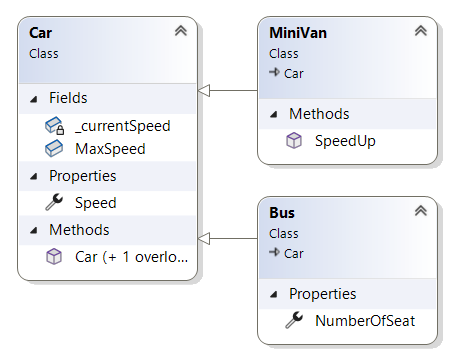

# Успадкування

Можливості одного класу можуть бути використовани іншим. І це дозволює повторно використовувати код. Один клас може бути відправною точкою іншого. Проект BasicInheritance.

```cs
    internal class Car
    {
        public readonly int MaxSpeed;
        private int _currentSpeed;
        public Car(int maxSpeed)
        {
            MaxSpeed = maxSpeed;
        }
        public Car():this(60) 
        {
        }
        public int Speed 
        { 
            get { return _currentSpeed; }
            set
            {
                if (value > MaxSpeed)
                {
                    _currentSpeed = MaxSpeed;
                }
                else
                {
                    _currentSpeed = value;
                }
            }
        }
    }
```
```cs
ExamineParentClass();
void ExamineParentClass()
{
    Car car = new Car();

    car.Speed = 50;
    Console.WriteLine($"Car with a speed {car.Speed}");

    car.Speed = 80;
    Console.WriteLine($"Car with a speed {car.Speed}");

    Car redCar = new Car(120);

    redCar.Speed = 70;
    Console.WriteLine($"Car with a speed {redCar.Speed}");

    redCar.Speed = 150;
    Console.WriteLine($"Car with a speed {redCar.Speed}");

}
```
```
Car with a speed 50
Car with a speed 60
Car with a speed 70
Car with a speed 120
```
Як видно тут за допомогою загальнодоступної властивості інкапсулюється приватне поле. Тобко клас реалізовує свою логіку поведінки. Цю логіку може успадкувати клас нащадок.

```cs
    internal class MiniVan : Car
    {
        public void SpeedUp()
        {
            Speed++;
            //_currentSpeed++; //he hasn't access
        }
    }
```
```cs
void ExamineInheritancedClass()
{
    MiniVan van = new();
    Console.WriteLine(van.Speed);

    MiniVan van1 = new();
    van1.Speed = 100;
    Console.WriteLine(van1.Speed);

    MiniVan van2 = new() { Speed = 80 };
    Console.WriteLine(van2.Speed);

    //MiniVan van3 = new(100) //   doesn`t contain constructor

    Console.WriteLine(van2 is MiniVan);
    Console.WriteLine(van2 is Car);
}
```
```
0
60
60
True
True
```
Таке відношення класі називають "is a". Ми можемо cказати MiniVan is a type of Car, або Person is a LiveOrganism. Так відношеня дозволяє створювати класи які розширюють функціональність існуючого.  Клас якій служе основою називають базовим, суперкласом або батьківським. Роль цього класу визначити всі загальні властивості і члени для всіх класів шо його розширюють. Клас розширення називають похідним або дочірнім. Таким чином не треба дублювати з базового в похідний клас і підтримувати код в обох класах.

Похідний клас не має доступу до приватних полів базового. 

Як видно з прикладу похідний клас не успадковує жодного конструктора. Конструктор можна визвати тільки з класу у якому він визначений. Можна викликати конструктор базового класу в ланцюгу конструкторів.

Похідний клас може мати один базовий клас але базовий клас теж може походити від іншого. Клас може реалізовумати багато різних Interface. При ралізіції інтерфейсів клас може демонструвати різні поведінки уникаючи складнощів успадкування від декількох класів.

## Sealed (запечатаний)

```cs
    sealed class Truck :Car
    {
        public int CarryingCapacity { get; set; }
    }

    //class SuperTruck : Truck { } // cannot derive from sealed type

    //class MyString : String // cannot derive from sealed type
```
Клас позначений як sealed не може бути базою іншого класу. Sealed клас корисний при розробці класів утіліт. В просторі імен System багато запечатаних класів. Наприклад не можна за базу вибрети клас String. 

Тип struct є sealed і неможна його брати за основу іншого типу. Структури можна використовувати для моделювання лише окремих, атомарних, визначених користувачем типів даних.

## Class Diagrams

В Visual Studio є можливість візуалізувати класи і їх зв'язки.

1. На назві проекту правий клік.
2. Add > New Item
3. Class Diagram (Якшо нема довись Середовише розробки втановлення VS)
4. Дайте назву ClassDiagramCar.cd 
5. Add (Появиться порожня поверхня дизайнера з підказками).
6. Перетягник класи на поверхню дізайнера.
7. На поверхні правий клік Add > Class
8. Class name:Bus Access: internal
9. Toolbox > Inheritance
10. Клік на Bus
11. Клік на Car
12. На Bus правий клік.
13. Add > Property
14. Name: NumberOfSeat.




Після ціх дій з'явиться клас Bus.cs
```cs
    internal class Bus : Car
    {
        public int NumberOfSeat
        {
            get => default;
            set
            {
            }
        }
    }
```

Коли видалити файл з поля діаграми це не вилучає його з проекту. Toolbox дозволяє добавляти типи і звязки. Для редагування класу є Class Details в якому можна додати поля і члени. Код який можна згенервати треба перевірять на помилки. Наприклад якшо ви просто добавите клас без вказання internal буде помилка.

# Деталі успадкування.

Проект DetailsOfInheritance.

```cs
partial class Employee
    {
        private int _id;
        private string _name;
        private float _pay;
        private int _age;
        private string _ssn;
        private EmployeePayTypeEnum _payType;


        public int Id { get => _id; set => _id = value; }
        public string Name 
        { 
            get => _name;
            set 
            {
                if (value.Length > 15) 
                {
                    Console.WriteLine("Name lenght exceeds 15 characters!");
                }
                else
                {
                    _name = value;
                }
            } 
        }
        public float Pay { get => _pay; set => _pay = value; }
        public int Age { get => _age; set => _age = value; }
        public string SSN { get => _ssn; set => _ssn = value; }
        public EmployeePayTypeEnum PayType { get => _payType ; set => _payType = value ; }
    }
```
```cs
    public enum EmployeePayTypeEnum
    {
        Hourly,
        Salaried,
        Commission
    }
```
```cs
    partial class Employee
    {

        public Employee(int id, string name, float pay, int age, string sSN, EmployeePayTypeEnum payType)
        {
            Id = id;
            Name = name;
            Pay = pay;
            Age = age;
            SSN = sSN;
            PayType = payType;
        }

        public Employee() 
        {
        }

        public void ToConsole()
        {
            Console.WriteLine($"Id:{Id} Name:{Name} Age:{Age} Pay:{Pay} SSN:{SSN} PayType:{PayType} \n");
        }

        public void GiveBonus(float amount)
        {
            Pay = this switch
            {
                { PayType: EmployeePayTypeEnum.Hourly } => amount * 0.1F,
                { PayType: EmployeePayTypeEnum.Salaried } => (amount * 40F) / 2080F,
                { PayType: EmployeePayTypeEnum.Commission } => Pay + amount,
                _ => Pay
            }; 
        }
    }
```
Це базовий клас успадкування. Він визначає загальні характеристики для всіх нащадків. Підкласи додають специфічну функціональність.

```cs
    internal class Manager :Employee
    {
        public int StockOptions { get; set; }
    }
```
```cs
    internal class SalesPerson : Employee
    {
        public int SalesNumber { get; set; }
    }
```
```cs
UsingDescendants();
void UsingDescendants()
{
    Manager manager1 = new();
    Console.WriteLine(manager1);
    manager1.ToConsole();

    Manager manager2 = new()
    {   Id = 1, 
        Name = "Bob", 
        Age = 35, 
        StockOptions = 10 
    };
    Console.WriteLine(manager2);
    Console.WriteLine(manager2.StockOptions);
    manager2.ToConsole();

    SalesPerson salesPerson1 = new();
    Console.WriteLine(salesPerson1);
    salesPerson1.ToConsole();

    SalesPerson salesPerson2 = new()
    {
        Id = 2,
        Name = "Inna",
        SalesNumber = 50
    };
    Console.WriteLine(salesPerson2);
    Console.WriteLine(salesPerson2.SalesNumber);
    salesPerson2.ToConsole();

    Employee employee = new(1, "John", 1000, 25, "123123123", EmployeePayTypeEnum.Hourly);
    //Manager manager = new(2, "Jo", 1000, 25, "233123123", EmployeePayTypeEnum.Hourly);
    //'Manager' does not contain a constructor

}
```
```
DetailsOfInheritance.Manager
Id:0 Name: Age:0 Pay:0 SSN: PayType:Hourly

DetailsOfInheritance.Manager
10
Id:1 Name:Bob Age:35 Pay:0 SSN: PayType:Hourly

DetailsOfInheritance.SalesPerson
Id:0 Name: Age:0 Pay:0 SSN: PayType:Hourly

DetailsOfInheritance.SalesPerson
50
Id:2 Name:Inna Age:0 Pay:0 SSN: PayType:Hourly
```
При встановлені зв'язку "is-a" нащадки успадкували всі public члени базового класу.Але якщо взяти клас нащадок то конструктори базового класу покі недоступни. Треба зробити додадкові зусилля.

## base 

Похідний клас зроблений з мінімальними зусилями має тільки конструктор за замовчуванням. 
```cs
        public Manager_attempt1(int id, string name, float pay, int age, string sSN, EmployeePayTypeEnum payType, int stockOptions)
        {
            Id = id;
            Name = name;
            Pay = pay;
            Age = age;
            //SSN = sSN; //set acceser is inaccesible SSN is redonly
            PayType = payType;

            StockOptions = stockOptions;
        }
```
Не варто створювати конструктори з тіми самими діями шо і в базовому. Спочатку виникає питаня шо до властивостей тільки для читанння. Крім того такий конструктор буде працювати неєффективно.

В похідному класі є можливість явно визвати конструктори базового класу а не типовий. У базовому класі уже існує головний конструктор.
```cs
        public Employee(int id, string name, float pay, int age, string sSN, EmployeePayTypeEnum payType)
        {
            Id = id;
            Name = name;
            Pay = pay;
            Age = age;
            SSN = sSN;
            PayType = payType;
        }

```
Його можно використати для створення конструктора в похідному класі.
```cs
    internal class Manager_v1  :Employee
    {
        public int StockOptions { get; set; }
        public Manager_v1(int id, string name, float pay, int age, string sSN, int stockOptions)
            : base(id, name, pay, age, sSN, EmployeePayTypeEnum.Salaried)
        {
            StockOptions = stockOptions;
        }
        public Manager_v1()
        {
        }
    }
```
При створені нового конструктора конструктор за замовчуванням перестає працювати, тому бажано додати конструктор без праметрів.

Тут з допомогою base в батьківський конструктор нащадок передає дані. При визові батьківського конструктора вказана розширена поведінка конкретно до цього класу. Для іншого класу поведінка може бути іншою.

```cs
    internal class SalesPerson_v1: Employee
    {
        public int SalesNumber { get; set; }
        public SalesPerson_v1(int id, string name, float pay, int age, string sSN, int salesNumber) : base(id, name, pay, age, sSN,EmployeePayTypeEnum.Commission)
        {
            SalesNumber = salesNumber;
        }
    }
```
```cs
    internal class SalesPerson_v1: Employee
    {
        public int SalesNumber { get; set; }
        public SalesPerson_v1(int id, string name, float pay, int age, string sSN, int salesNumber) : base(id, name, pay, age, sSN,EmployeePayTypeEnum.Commission)
        {
            SalesNumber = salesNumber;
        }

        public SalesPerson_v1()
        {
        }
    }
```
```cs
UsingBaseConstructor();
void UsingBaseConstructor()
{
    Manager_v1 manager1 = new();
    manager1.ToConsole();

    Manager_v1 manager2 = new(1, "Mikolay", 1000, 35, "233234234234", 10);
    manager2.ToConsole();

    SalesPerson_v1 salesPerson1 = new();
    salesPerson1.ToConsole();

    SalesPerson_v1 salesPerson2 = new(2, "Mark", 700, 27, "421412424", 57);
    salesPerson2.ToConsole();
}
```
```
Id:0 Name: Age:0 Pay:0 SSN: PayType:Hourly

Id:1 Name:Mikolay Age:35 Pay:1000 SSN:233234234234 PayType:Salaried

Id:0 Name: Age:0 Pay:0 SSN: PayType:Hourly

Id:2 Name:Mark Age:27 Pay:700 SSN:421412424 PayType:Commission
```
Як правило, усі підкласи повинні явно викликати відповідний конструктор базового класу.

base можна використовувати коли підклас хоче отримати доступ до публічного або захищеного методу батьківського класу. Тобто його можно використовувати не тільки до конструкторів.

## protected

Члени класу які позначені модіфікатором privat доступні тілки в класі, а public де завгодно. Коли в базовому класі члени визначені за допомогою модіфікатора protected то нащадки мають до нього доступ. Але зовні член виглядає так само як private.Тобто до protected членів є доступ в сімействі класів.  
```cs
    class Employee_v2
    {
        protected int EmpId;
        protected string EmpName;
        protected float EmpPay;
        protected int EmpAge;
        protected string? EmpSSN;
        protected EmployeePayTypeEnum EmpPayType;

        public int Id { get => EmpId; set => EmpId = value; }
        public string Name
        {
            get => EmpName;
            set
            {
                if (value?.Length > 15)
                {
                    Console.WriteLine("Name lenght exceeds 15 characters!");
                }
                else
                {
                    if (value != null)
                    {
                        EmpName = value;
                    }
                }
            }
        }
        public float Pay { get => EmpPay; set => EmpPay = value; }
        public int Age { get => EmpAge; set => EmpAge = value; }
        public string? SSN { get => EmpSSN; private set => EmpSSN = value; }
        public EmployeePayTypeEnum PayType { get => EmpPayType; set => EmpPayType = value; }

        public Employee_v2(int id, string name, float pay, int age, string? sSN, EmployeePayTypeEnum payType):this()
        {
            Id = id;
            Name = name;
            Pay = pay;
            Age = age;
            SSN = sSN;
            PayType = payType;
        }

        public Employee_v2()
        {
            EmpName = string.Empty;
        }
        public void ToConsole()
        {
            Console.WriteLine($"Id:{Id} Name:{Name} Age:{Age} Pay:{Pay} SSN:{SSN} PayType:{PayType} \n");
        }
    }
```
```cs
    internal class Manager_v2 : Employee_v2
    {

        public Manager_v2()
        {
            EmpPayType = EmployeePayTypeEnum.Salaried;
        }

        public Manager_v2(int id, string name, float pay, int age, string? sSN) : base(id, name, pay, age, sSN, EmployeePayTypeEnum.Salaried)
        {
        }
    }
```
```cs
UsingProtected();
void UsingProtected()
{
    Employee_v2 employee = new();
    employee.ToConsole();
    //employee1.EmpId = 1; // inaccesible 

    Manager_v2 manager = new();
    manager.ToConsole();
}
```
```
Id:0 Name: Age:0 Pay:0 SSN: PayType:Hourly

Id:0 Name: Age:0 Pay:0 SSN: PayType:Salaried

```
Коли надаеться доступ до приватних даних батьківського класу нашадок може обійти правила встановлені в загально доступних властивостях батька і таким чином створити власні правила.

Хоча модіфікатор protected може нарушити інкапсуляцію він може бути безпечним і корисним для визначені методів. При побудові ієрархії визначають набір загальних методів які можно використовуати тільки в похідних типах і до яких нема доступу зовні. 

## Обмеження гілки іерархії.

Іноді гілку іерархії нема сенсу продовжувати. Тоді клас запаковують.
```cs
    internal class SalesPerson_v1: Employee
    {
        public int SalesNumber { get; set; }
        public SalesPerson_v1(int id, string name, float pay, int age, string sSN, int salesNumber) : base(id, name, pay, age, sSN,EmployeePayTypeEnum.Commission)
        {
            SalesNumber = salesNumber;
        }

        public SalesPerson_v1()
        {
        }
    }   
```
```cs
    sealed class PartSalesPerson_v1 : SalesPerson_v1
    {
        public PartSalesPerson_v1()
        {
        }
        public PartSalesPerson_v1(int id, string name, float pay, int age, string sSN, int salesNumber) : base(id, name, pay, age, sSN, salesNumber)
        {
        }

    }
```
Аби заборонити успадкування від класу можна використати модіфікатор sealed.

## Успадкування в record.

Оскільки record є особливим типом класів є можливість успадкування. Проєкт RecordInheritance.
```cs
    public record Car
    {
        public string Manufacturer { get; init; }
        public string Model { get; init; }
        public string Color { get; init; }

        public Car(string manufacturer, string model, string color)
        {
            Manufacturer = manufacturer;
            Model = model;
            Color = color;
        }
    }
```
```cs
    public sealed record MiniVan : Car
    {
        public MiniVan(string manufacturer, string model, string color,int seating ) : base(manufacturer, model, color)
        {
            Seating = seating;
        }

        public int Seating { get; init; }
    }
```
```cs
ExploreRecordInheritance();
void ExploreRecordInheritance()
{
    MiniVan miniVan = new("Mersedes", "Vito", "White", 3);
    Console.WriteLine(miniVan);

    Console.WriteLine(miniVan is Car);

    Car car = miniVan;
    Console.WriteLine(car);
}
```
```
MiniVan { Manufacturer = Mersedes, Model = Vito, Color = White, Seating = 3 }
True
MiniVan { Manufacturer = Mersedes, Model = Vito, Color = White, Seating = 3 }
```
Хоча record специфічні класи ви не можете створювати class на базі record чи навпаки.

Успадкування працює і з позиційними типами record.
```cs
    record Car_v1(string Manufacturer, string Model, string Color);
```
```cs
    record MiniVan_v1(string Manufacturer, string Model, string Color, int Seating)
        : Car_v1(Manufacturer, Model, Color);
```
```cs
ExplorePositionRecordInheritance();
void ExplorePositionRecordInheritance()
{
    MiniVan_v1 miniVan = new MiniVan_v1("Mercedes", "Vito", "Black", 4);
    Console.WriteLine(miniVan);

    Car_v1 car = new MiniVan_v1("VW", "Transporter", "White", 4);
    Console.WriteLine(car);
    Console.WriteLine(car is Car_v1);
    Console.WriteLine(car is MiniVan_v1);

    Car_v1 car1 = car with { Manufacturer = "VW", Model = "Transporter", Color = "Black" };
    Console.WriteLine(car1);
    Console.WriteLine(car1 is Car_v1);
    Console.WriteLine(car1 is MiniVan_v1);
}
```
```
MiniVan_v1 { Manufacturer = Mercedes, Model = Vito, Color = Black, Seating = 4 }
MiniVan_v1 { Manufacturer = VW, Model = Transporter, Color = White, Seating = 4 }
True
True
MiniVan_v1 { Manufacturer = VW, Model = Transporter, Color = Black, Seating = 4 }
True
True
```
Тип record дозволяє легко порівняти об'єкти без додадкового коду. Але коли відбувається порівняння тип враховується.
```cs
   record MotorCycle(string Manufacturer, string Model);
   record Scooter(string Manufacturer, string Model):MotorCycle(Manufacturer,Model);

```
```cs
ExploreEqualityRecordInheritance();
void ExploreEqualityRecordInheritance()
{
    MotorCycle motorCycle = new("Harley", "Low Rider");
    MotorCycle motorCycle1 = new("Harley", "Low Rider");
    Console.WriteLine(motorCycle);
    Console.WriteLine(motorCycle1);
    Console.WriteLine(motorCycle == motorCycle1);

    Scooter scooter = new("Harley", "Low Rider");
    Console.WriteLine(motorCycle);
    Console.WriteLine(scooter);
    Console.WriteLine(motorCycle == scooter);

    MotorCycle motorCycle2 = new Scooter("Harley", "Low Rider");
    Console.WriteLine(motorCycle);
    Console.WriteLine(motorCycle2);
    Console.WriteLine(motorCycle == motorCycle2);

    Console.WriteLine(motorCycle.GetType());
    Console.WriteLine(motorCycle2.GetType());
}
```
```
MotorCycle { Manufacturer = Harley, Model = Low Rider }
MotorCycle { Manufacturer = Harley, Model = Low Rider }
True
MotorCycle { Manufacturer = Harley, Model = Low Rider }
Scooter { Manufacturer = Harley, Model = Low Rider }
False
MotorCycle { Manufacturer = Harley, Model = Low Rider }
Scooter { Manufacturer = Harley, Model = Low Rider }
False
RecordInheritance.MotorCycle
RecordInheritance.Scooter
```
При порівнянні використовується тип при виконанні а не оголошений тип. При виконані в пам'яті може бути тип якій не такий як декларуеться а нашадок.

Є особливість при роботі з методом Deconstruct.

```cs

    record MotorCycle(string Manufacturer, string Model);
    
    record Scooter(string Manufacturer, string Model):MotorCycle(Manufacturer,Model);

    record FancyScooter(string Manufacturer, string Model, string FancyColor):Scooter(Manufacturer,Model);
```
```cs
ExploreDeconstructorRecordInheritance();
void ExploreDeconstructorRecordInheritance()
{
    MotorCycle motorCycle = new FancyScooter("Harley", "Low Rider", "Red");

    var (manufacturer1, model1) = motorCycle;
    Console.WriteLine($"{manufacturer1} {model1}");

    //var (manufacturer2, model2, color2 ) = motorCycle; // don't work
    var (manufacturer2, model2, color2) = (FancyScooter)motorCycle;
    Console.WriteLine($"{manufacturer2} {model2} {color2}");

}

```
```
Harley Low Rider
Harley Low Rider Red
```
Аби спрацював необхідний метод потрібно явно виконати перетворення.

# Агрегація або Containment/Delegation

Для того аби повторно використовувати код можна використовувати не тільки успадкування у вигляді відношення "is a". Можна побудувати відношення "has a". Проект DetailsOfInheritance

```cs
    internal class BenefitPackage
    {
        // other memebers
        public double ComputePayDeducation()
        {
            return 125.0;
        }
    }
```
```cs
    internal class Employee_v3
    {
        protected int EmpId;
        protected string EmpName;
        protected float EmpPay;
        protected BenefitPackage EmpBenefits = new BenefitPackage();

        public int Id { get => EmpId; set => EmpId = value; }
        public string Name { get => EmpName ; set => EmpName = value; }
        public float Pay { get => EmpPay; set => EmpPay = value; }
        public BenefitPackage Benefits { get => EmpBenefits; set => EmpBenefits =value; }

        public Employee_v3(int id, string name, float pay) : this()
        {
            Id = id;
            Name = name;
            Pay = pay;
        }
        public Employee_v3()
        {
            EmpName = string.Empty;
        }

        public double GetBenefitCost() => EmpBenefits.ComputePayDeducation();
    }
```
```cs
    internal class Manager_v3 : Employee_v3
    {
        public Manager_v3()
        {
        }
        public Manager_v3(int id, string name, float pay) : base(id, name, pay)
        {
        }
    }
```
```cs
ExploreAgregation();
void ExploreAgregation()
{
    Manager_v3 manager = new(1, "bob", 1000);
    Console.WriteLine(manager.GetBenefitCost());
}

```
```
125
```
Коли відношеня "is a" не доречне можна створити окремий клас з необхідною функціональностю. До головного проектуємого класу додається об'єкт цого допоміжного класу. Тобто клас має в собі об'єкт, тому відношення називається "has a". Для зовнішнього світу цій об'єкт делегує свою функціональність у вигляді публічних медодів. Таким чином зовнішній світ не знає як додається функціональність прото використовує її.


## Вкладені типи.

В межах класу або структури можна визначити інший тип (enum, class, interface, struct, or delegate). 
Невкладені типи які знаходяться в namespace не можуть бути визначені як private.Вкладений тип може бути private і тому є повний контроль доступу.Привтний тип може мати доступ до приватних членів класу. Вкладений тип є членом класу яким можна маніпулювати як іншими членами(fields, properties, methods, and events). Ці типи часто використовуються як допоміжний клас для внутрішноього застосування в межах класу і не призначений для зовнішнього використання. Але можна зробити використання зовні.
```cs
    class Employee_v4
    {
        protected int EmpId;
        protected string EmpName;
        protected float EmpPay;
        public int Id { get => EmpId; set => EmpId = value; }
        public string Name { get => EmpName; set => EmpName = value; }
        public float Pay { get => EmpPay; set => EmpPay = value; }

        public class BenefitPackage
        {
            public enum BenefitPackageLevel
            {
                Standard, Gold, Platinum
            }
        }

        public Employee_v4(int id, string name, float pay) : this()
        {
            Id = id;
            Name = name;
            Pay = pay;
        }
        public Employee_v4()
        {
            EmpName = string.Empty;
        }

    }
```
```cs
UsingNestedClass();
void UsingNestedClass()
{
    Employee_v4.BenefitPackage.BenefitPackageLevel benefitPackageLevel = Employee_v4.BenefitPackage.BenefitPackageLevel.Gold;
    Console.WriteLine(benefitPackageLevel);
}
```
```
Gold
```
Таким чином будується тісний звязок між повязаними між собою класами і enum.


