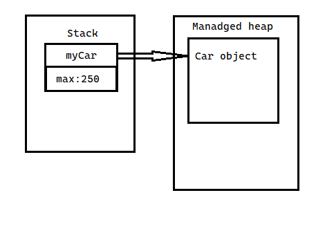
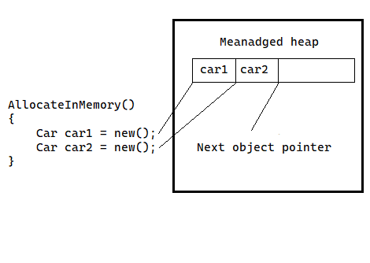
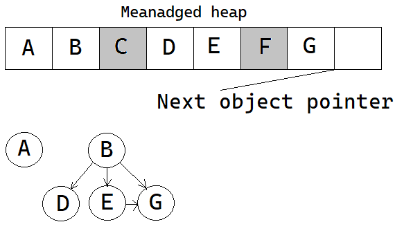
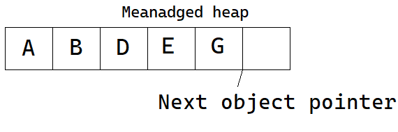
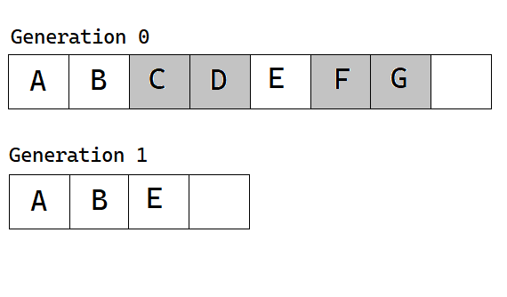

# Цикл житя об'екта.

В цьому розділі розглдаеться як середа виконання керує виделиним для об'єкта ресурасми, виконує збирання мусору і як ми можево програмно на це впливати. Для цого існує System.GC. Бішість роботи середа виконання та ці знання можуть допомогти коли мова іде про некеровані ресурси.

## Класи, об'єкти, посилання та процеси в пам'яті .

Розлянемо клас.
ObjectLifetime\Types_v1.cs
```cs
    class Car
    {
        public string Name { get; set; } = "";
        public int MaxSpeed { get; }
        public int CurrentSpeed { get; set; }

        public override string? ToString() => $"{Name} is going {CurrentSpeed}";
        
    }
```
Клас це ні шо інще як план того як його єкземпляри будуть створюватися та поводитись. Від складовіх залежить як він використовує пам'ять. 
```cs
ExplorationClassObjectReference();
void ExplorationClassObjectReference()
{
    CreateOldCar();

    void CreateOldCar()
    {

        int max = 250;

        Car myCar = new Car("Volkswagen Käfer", 115, 30);

        Console.WriteLine(myCar.ToString());
        Console.WriteLine(max/ myCar.MaxSpeed);

    }
}
```


Ключове слово new повертае посилання на об'єкт в керованій купі. Посилання використовуеться для доступу до членів об'єкту за допомогою опрератора (.)dot.
Зміна в якій знаходиться посилання так само як і структури медоту зберігаються в стеку. Розмішеня в купі відбуваеться коли створюються єкземпляри класу.

При розробці слід притримуватися досить простого правила створіть єкземляр класу за допомогою new (тим самим розмістите в managed heap) і забудьте про нього. Збирать сміття сам знищить його коли він не потрібен. Як збирач визначає що об'єкт не потрібен? Коротка відповідь збирач сміття видаляе об'єкт із купи тоді коли об'єкт недоступний з будь якої частини коду.
В прикладі посилання myCar було створено беспосередьно в методі і не предавалось зовні через значеня шо повертає метод чи іншими способами(параметрами ref/out). Таким чином після виконання методу посилання вилучаеться з стеку і об'єкт в купі претендент на знишеня збиральником смітя. Але ви не можете гарантувати шо це відбудиться одразу як виконаеться метод. Все шо можна передбачити шо при наступній роботі збиральника сміття об'єкт може бути безпечно видалений з купи. 
Середовише виконання виконує управління пам'яті в керовапій купі і це набагато лолегшує розробку (порівнюючи з C++).

Керована купа це більше ніж шматки вільної пам'яті які бера середовище виконання. Збирач сміття досить економно відноситься до пам'яті роблячи оптімізацію і ущімлення.Щоб робити це керована купа підтримує вказівник, якій вказує нанаступний об'єкт. При створенні об'єкту сердовишу вказуеться зробити наступне наступне:
- Обчислити загальний обсяг пам'яті, необхідної для об'єкта(включаючи членів класу та базових класів)
- Перевірити керовану купу чи справді достатьно пам'яті для розміщення. Якшо так викликаеться конструктор і повертаеться вказівник на новий об'єкт чия позиція просто змігаеться з останньою позицією наступного об'єкта.
- Перед відсиланням посилання перемістити вказівник купи нового об'єкту на кінець створенного.

```cs
void AllocateInMemory()
{
    Car car1 = new();
    Car car2 = new();
}
```



Простір в керованій купі з часом може заповнитись. Якшо середовище виконання виявило шо обсягу для нового об'єкта недостатньо, вона виконує збір сміття намагаючись звільнити пам'ять. Таким чином збирач сміття починає видаляти непотрібні об'єкти коли недостатьно пам'яті в купі.

Коли змінній призначаеться null (myCar = null) це не змушує збирача сміття запуститися і видалити з пам'яті. Це лише розриває зв'язок посилання з об'єктом керованої купи. Тобто така операція не має великої користі.

## Визначення необхідності об'єкта в купі.

Аби визначити чи ше потрібен об'єкт для вимкористання збирач сміття використовує данні про змінні стека та дескріптори збирача смітя які вказують на керовані об'єкти на які можна посилатись з коду або середовища виконання.
Під час збирання сміття середовище виконнання досліджує об'єкти в керованій купі шоб визначити доступні вони програмі. Для цього вона будує граф об'єктів який представляє кожен доступний об'єкт в купі. Граф документує всі доступні об'екти. В графі об'єкти не повторюються.
Припустимо керована купа містить об'єкти A,B,C,D,E,F,G.



Під час збирання сміття всі об'єкти а також внутрішні посилання між ними перевіряються. Післа побудови графа недосяжні об'єкти помічаються як сміття. В цьому випадку C, F. Після помітки об'єктів на видалення вони видаляються з пам'яті. У цей момент простір в купі ущільнюеться. Покажчики на об'єкти змінюються і змінюеться покажчик на останній об'єкт.



Строго кажучи, збирач сміття використовує дві різні купи, одна з яких спеціально використовується для зберігання великих об’єктів.До цієї купи звертаються рідше під час циклу збору, враховуючи можливі втрати продуктивності, пов’язані з переміщенням великих об’єктів.

## Покоління об'єктів.

Коли середовище виконання намагається знайти недоступні об'єкти воа не перевіряє кожен об'єкт в купі. Ця опреація може займати багато часу. Для оптимізації процесу об'єкт призначаеться до спеціального "покоління". Ідея поколінь досить проста : чим довше об'єкт існував в купі тим більша ймовірність шо він там залишиться. Наприклад клас який відповидае за основні єлемент управління програмою будє в пам'яті пока програма не закінчить роботу. В тойже час об'єкт методу який не виходив за його межи буде недоступний досить швидко. Кожний об'єкт в купі може належити до коллекції в одному з наступних поколінь:
 - Покоління 0 : Це щойно розташований невеликий об'єкт якій ніколи не позначався в коллекціях. Більшисть об'єктів які обробляються збирачем сміття з поклоіння 0 і деякі виживають до покоління 1.

 - Покоління 1 : Це об'єкти які пережили збирання сміття. Це поколіня є буфером між короткоживучими і довго живучими. 

 - Покоління 2 : Це об'єкти які витримав більше одного циклу сбирання сміття, або значно великий об'єкт якій почав свое існування з покоління 2.

Покоління 0 і 1 називаються ефемерними поколіннями. 



Збирач сміття спочатку досліджуе всі об'єкти покоління 0. Якщо позначення і очищеня приведе до появи необхідної пам'яті будь-які вцілілі об'єкти перходять до покоління 1. Якшо при прегляді покління 0 і збиранні сміття виявится що потрібна додадкова пам'ять досліджуються об'єкти покоління 1 і відбуваеться збирання сміття серед них. Уцілілі після цього об'єкти поколіня 1 підвищуються до покоління 2. Якщо збиральник ще потребує місця розглядаються об'єкти покоління 2. На цьому єтапі якшо об'єкт виживає він залишаеться в поколінні 2.
Суть полягає в тому, що, призначаючи об'єктам покоління, нові об'єкти(схожі на змінні в стеку) будуть швидко видялятись а біль старі об'єкти не будуть "чіпатись" так часто.  
Збирач сміття запускаеться коли не вистачає фізичної пам'яті, коли зайнята пам'ять в керованій купі первищує порог. Також збирач смітя може запусrfnbcm програмно GC.Collect().
Процесс збирання сміття не без певних витрат. Під час збирання використовуєтьс цикли процессора і це може повпливати на продуктивність додадку.

## Ефемерні покоління і сегменти.

Поколіня 0 та 1 короткострокові. Ці покоління розміщуються в сегменті пам'яті який називають ефемерний сегмент. Коли відбуваеться збір сміття, нові сегменти які здобуті стають новими ефемерними сегментами. А сегменти які переживають покоління 1 стають сегментами покоління 2. Розмір ефемерних сегментів залежить від ряду факторів. До них відносяться розрядність системи та тип збирача сміття.


| Garbage Collection Type | 32-bit | 64-bit |
| ----------------------- |------- | ------ |
| Workstation             | 16 MB  | 256 MB |
| Server                  | 64 MB  | 4 GB   |
| Server with > 4 log.CPUs| 32 MB  | 2 GB   |
| Server with > 8 log.CPUs| 16 MB  | 1 GB   |

## Типи збирачів сміття.

Середа виконання забезпечує два типи збирачив сміття. 

Workstation garbage collection : призначеня для клієнтських програм і є типовим для автономних програм. GC на робочій станції може бути фоновим або несонкурентним.
Server garbage collection: розроблений для сервених програм які потребують високої пропускної здатності та маштабованості. Такій GC також може працювати в фоновому режимі або неконкурентним. 
Назви вказують на параметри за замовчуванням для програм робочої станції і сервера, але метод збирання можна налаштувати в runtimeconfig.json або в змінних системного середовища. 
Workstation GC відбувається в тому самому потоці,і залишаєеться в тому самому пріорітеті, що і під час його запуску. Це може спричинити конкуренцію з іншими потоками. 
Server GC виникає в кількох виділених потоках, для яких всановлено рівень пріорітету в THREAD_PRIORITY_HIGHEST. Кожен ЦП отримує виділену купу і виделиний поток для GC. Це може привести до того, що збір сміття буде потребувати ресурсів.

### Фонове збирання сміття.

GC збирач сміття може моти справу з призупиненням потоку, коли він очищує об'єкти в керованій купі, використовуючи фонове очищення. Це не означає що збирання стіття відбуваеться на додадкових фонових потоках виконання. Навпаки, якщо фонове збирання сміття відбуваеться для об'єктів, що живуть в нефемерному поколінні, середовище виконання може збирати в ефемерних поколіннях за допомогою виділенного фонового потоку. Такми чино ще більше скорочується час протягом якого певний поток, пов'язаний з деталями збирання, має бути призупинено. Процес очишення некерованих об'єктів що живуть в поколіннях 0 і 1 збробено аби досгти кращої продуктивності(що важливо для систем реального часу,які потребують невеликий, і передбачуваний час, зупинки GC). Це не впливає на те як ви створюєте свою програму. 
Для всіх практичних цілей ви можете дозволити GC робити свою роботу без вашого втручання. 

## System.GC

Збірка mscorlib.dll надає тип классу System.GC який дозволяє програмно взаємодіяти з GC за допомогою статичних методів. Безпосередбно в вашому коді дуже рідко виникає необхідність користуватись цім класом. Як правило використовуються члени класу тільки коли створюються класи які внутрішньо використовують некеровані ресурси. Це може статися при створені класу якій здійснює виклики API на основі С використовуючи протокол виклику платформи .Net Core або через низкорівневу та складну логіку COM.
Деякі члени цього класу.

- AddMemoryPressure(), RemoveMemoryPressure() : Дозволяє вказати числове значення, яке представляє "рівень терміновості" виклику GS. Майте на увазі, що ці методи повинні одночасно змінювати тиск і, таким чином, ніколи не знімати тиск, який перевищує загальну кількість, яку ви додали.

- Collect() : Змушує GC виконати збір сміття. Є перезавантаженя методу з урахуванням поколінь а також режим збору.

- CollectionCount() : Повертає числове значення, яке вказує, скількі разів певне покоління було "підметено".

- GetGeneration() : Повертає покоління до якого зараз належить об'єкт.

- GetTotalMemory() : Повертає плановий обсяг пам'яті який виділено в керованій купі. Логічний параметр визначає, чи повинен виклик очікувати збирання сміття перед поверненням.

- MaxGeneration : Повертає максимальну кількість поколінь системи.

- SuppressFinalize() : Встановлює прапорець що об'ект не повинен викликати Finalize().

- WaitForPendingFinalizers() : Призупиняє поточний потік, докі всі об'єкти, які можна завершити не будуть завершені. Цей метод зазвичай викликається безпосередньо після виклику GC.Collect(). 

ClassSystemGC\Program.cs
```cs
void UsingSystemGC()
{
    Car car = new();

    Console.WriteLine($"Estimated bytes on heap {GC.GetTotalMemory(false)}");
    Console.WriteLine($"This OS has {GC.MaxGeneration+1} object generations."  );
    Console.WriteLine($"Generation of car is:{GC.GetGeneration(car)}");
}
```
```
Estimated bytes on heap 111528
This OS has 3 object generations.
Generation of car is:0
```

## Примусове збирання сміття.

Хоча середовище само виконує необхідне управління пам'ятью, в рідких випадках корисно примусити виконати збирання за допомогою GC.Collect(). Ось дві такі поширені ситуації:

- Ваша програма збираеться виконати блок коду, який ви не хочете переривати можливим GC.

- Програма закінчила розташування надзвичайно великої кількості об'єктів, і ви бажаете видалити стілки пам'яті скілкі можливо. 

Якшо ви визначите шо буде корисним аби GC виявив недоступні об'єкти то ви можете явно запустити процес збирання сміття.

```cs
ForcingGC();
void ForcingGC()
{

    Console.WriteLine($"Estimated bytes on heap {GC.GetTotalMemory(false)}");
    Car car = new("VW Beetle",140,20);
    Console.WriteLine($"Generation of car is:{GC.GetGeneration(car)}");

    for (int i = 0; i < 10; i++)
    {
        GC.Collect();

        Console.WriteLine($"Estimated bytes on heap {GC.GetTotalMemory(false)}");
        Console.WriteLine($"Generation of car is:{GC.GetGeneration(car)}");
    }

}
```
```
Estimated bytes on heap 111528
Generation of car is:0
Estimated bytes on heap 97808
Generation of car is:1
Estimated bytes on heap 98792
Generation of car is:2
Estimated bytes on heap 107448
Generation of car is:2
Estimated bytes on heap 100040
Generation of car is:2
Estimated bytes on heap 100040
Generation of car is:2
Estimated bytes on heap 100064
Generation of car is:2
Estimated bytes on heap 100040
Generation of car is:2
Estimated bytes on heap 100128
Generation of car is:2
Estimated bytes on heap 100464
Generation of car is:2
Estimated bytes on heap 116872
Generation of car is:2
```

```cs
ForcingGC();
void ForcingGC()
{

    Console.WriteLine($"Estimated bytes on heap {GC.GetTotalMemory(false)}");
    Car car = new("VW Beetle",140,20);
    Console.WriteLine($"Generation of car is:{GC.GetGeneration(car)}");

    for (int i = 0; i < 10; i++)
    {
        GC.Collect();
        GC.WaitForPendingFinalizers(); // added

        Console.WriteLine($"Estimated bytes on heap {GC.GetTotalMemory(false)}");
        Console.WriteLine($"Generation of car is:{GC.GetGeneration(car)}");
    }

}
```
```
Estimated bytes on heap 111528
Generation of car is:0
Estimated bytes on heap 122384
Generation of car is:1
Estimated bytes on heap 116376
Generation of car is:2
Estimated bytes on heap 116448
Generation of car is:2
Estimated bytes on heap 116424
Generation of car is:2
Estimated bytes on heap 124616
Generation of car is:2
Estimated bytes on heap 116848
Generation of car is:2
Estimated bytes on heap 112696
Generation of car is:2
Estimated bytes on heap 125040
Generation of car is:2
Estimated bytes on heap 125864
Generation of car is:2
Estimated bytes on heap 122360
Generation of car is:2
```

Коли ви примусово збираете сміття ви повині завжди виконати метод WaitForPendingFinalizers. Тоді ви будете впевнені шо всі об'єкти які є завершувальними мали можливість очиститись для продовженя програми. Цей метод призупинить виклик потоку під час процесу збору. Це добре атже код не викличє методи об'єкту який зараз знищуеться.

```cs
ForcingGCWithGenetation();
void ForcingGCWithGenetation()
{
    Console.WriteLine($"Estimated bytes on heap {GC.GetTotalMemory(false)}");

    Car[] cars = new Car[1000000];
    for (int i = 0; i < 1000000; i++)
    {
        cars[i] = new("VW",i,i);
    }


    Console.WriteLine($"Estimated bytes on heap {GC.GetTotalMemory(false)}");
    Console.WriteLine($"Generation of cars is:{GC.GetGeneration(cars)}");

    GC.Collect(0);
    GC.WaitForPendingFinalizers();

    Console.WriteLine($"Estimated bytes on heap {GC.GetTotalMemory(false)}");
    Console.WriteLine($"Generation of cars is:{GC.GetGeneration(cars)}");

}
```
```
Estimated bytes on heap 111528
Estimated bytes on heap 40145328
Generation of cars is:2
Estimated bytes on heap 40124000
Generation of cars is:2
```
В прикладі в метод Collact передаеться параметр який вказуе найстаріще покоління збору. Також методу можна передати другий параметр який вказує як саме повинно збиратись сміття.

```cs
    //
    // Summary:
    //     Specifies the behavior for a forced garbage collection.
    public enum GCCollectionMode
    {
        //
        // Summary:
        //     The default setting for this enumeration, which is currently System.GCCollectionMode.Forced.
        Default = 0,
        //
        // Summary:
        //     Forces the garbage collection to occur immediately.
        Forced = 1,
        //
        // Summary:
        //     Allows the garbage collector to determine whether the current time is optimal
        //     to reclaim objects.
        Optimized = 2,
        //
        // Summary:
        //     Requests that the garbage collector decommit as much memory as possible.
        Aggressive = 3
    }
```
Це дозволяє більш точно вказати як збирати сміття.

```cs
ForcingGCWithGenetationAndMode();
void ForcingGCWithGenetationAndMode() 
{
    Car car = new Car();
    Console.WriteLine($"Generation of car is:{GC.GetGeneration(car)}");

    object[] tonsOfObjects = new object[50000];

    for (int i = 0; i < tonsOfObjects.Length; i++)
    {
        tonsOfObjects[i] = new();
    }

    long before = GC.GetTotalMemory(false);

    Console.WriteLine($"Estimated bytes on heap before: {before}");

    GC.Collect(0, GCCollectionMode.Default);
    //GC.Collect(0, GCCollectionMode.Forced);
    //GC.Collect(0, GCCollectionMode.Optimized);
    //GC.Collect(2, GCCollectionMode.Aggressive, true, true);
    GC.WaitForPendingFinalizers();

    long after = GC.GetTotalMemory(false);

    Console.WriteLine($"Estimated bytes on heap after: {after}");

    Console.WriteLine($"before - after : {before - after}");

    

    Console.WriteLine($"Generation of car is:{GC.GetGeneration(car)}");

    Console.WriteLine($"Generation of tonsOfObjects[9000] is:{GC.GetGeneration(tonsOfObjects[9000])}");

    Console.WriteLine($"Generation 0 has ben swapt: {GC.CollectionCount(0)}");
    Console.WriteLine($"Generation 1 has ben swapt: {GC.CollectionCount(1)}"); 
    Console.WriteLine($"Generation 2 has ben swapt: {GC.CollectionCount(2)}");

}
```
GCCollectionMode.Default
```
Generation of car is:0
Estimated bytes on heap before: 1726016
Estimated bytes on heap after: 1718072
before - after : 7944
Generation of car is:1
Generation of tonsOfObjects[9000] is:1
Generation 0 has ben swapt: 1
Generation 1 has ben swapt: 0
Generation 2 has ben swapt: 0
```
GCCollectionMode.Forced
```
Generation of car is:0
Estimated bytes on heap before: 1726016
Estimated bytes on heap after: 1718072
before - after : 7944
Generation of car is:1
Generation of tonsOfObjects[9000] is:1
Generation 0 has ben swapt: 1
Generation 1 has ben swapt: 0
Generation 2 has ben swapt: 0
```
GCCollectionMode.Optimized
```
Generation of car is:0
Estimated bytes on heap before: 1726016
Estimated bytes on heap after: 1726016
before - after : 0
Generation of car is:0
Generation of tonsOfObjects[9000] is:0
Generation 0 has ben swapt: 0
Generation 1 has ben swapt: 0
Generation 2 has ben swapt: 0
```
 GC.Collect(2, GCCollectionMode.Aggressive, true, true)
```
Generation of car is:0
Estimated bytes on heap before: 1726016
Estimated bytes on heap after: 1714864
before - after : 11152
Generation of car is:1
Generation of tonsOfObjects[9000] is:1
Generation 0 has ben swapt: 1
Generation 1 has ben swapt: 1
Generation 2 has ben swapt: 1
```
В прикладі створюєеться велика кількість об'єктів. Видно як режим впливає на розміщеня в купі. Як видно з режиму Optimized збирання взагалі не слід проводить в цьому випадку. 
Крім збирання сміття ми можено створювати finalizable(можуть завершуваться) об'єкти та одноразові.

# Створення Finalizable об'єктів.

```cs
// System.Object
public class Object
{
  ...
  protected virtual void Finalize() {}
}
```
В класі System.Object є віртуальний метод Finalize. Реалізація за замовчуванням нічого не робить. Коли ви змінюєете метод в власних классах, ви вказуєте логіку очишеня для типу. Оскільки тип protected не можливо викликати напряму з екземпляра  цей метод. Збирач сміття визове цей метод перед виділенням об'єкта. 
Тип структур не розміщуеться в керованій купі тому цей метод там не працює. Якшо структура має некеровані рексурси, які реба очистити, ви можете реалізувати інтерфейс IDisposable.
Більшість типів, які зрештою мають предка object, не потребує власної реалізації методу Finalize, бо більшись з них взаємодіє з керованими типами які обслуговуються середою виконання. Додадкове очищеня потрібно якшо використовуються некеровані дфскріптори файлів OC, необроблені некеровані підключнення до БД, фрагменти некерованої пам'яті та ін. На платформі .NET Core некеровані ресурси отримують шляхом прямого виклику API операційної системи за допомогою  Platform Invocation Services (PInvoke) або в результаті деяких складних сценаріїв взаємодії COM.
Єдина вагома причина перевизначити Finalize() полягає в тому, що ваш клас C# використовує некеровані ресурси через PInvoke або складні завдання сумісності COM (зазвичай через різні члени, визначені типом System.Runtime.InteropServices.Marshal).Причина треба управляти пам'ятью якою не керує середовище виконання.

## Перевизначення System.Object.Finalize()

У випадку використання некерованих ресурсів ви хочете бути впевнені шо основан пам'ять звільнюється у передбачуваний керований спосіб.

FinalizableОbjects\Types.cs
```cs
class MyResourceWrapper
{
    // Work with unmanaged resources 
    // 
    ~MyResourceWrapper() => Console.Beep();
}
```
Припустимо клас використовує некеровані ресурси. Метод Finalize перевизначається незвичним методом. Ключеве слово override не підходить. Для того аби замінити метод Finalize використовується контекст деструктора. Причини альтернативного перевизначення віртуального методу полягають в тому, що компілятор додає велику чатину інфраструктури в неявне перевизначення методу.
Фіналізатор починаеться з ~ . Вони неявно protected і не приймають модіфікаторів доступу не приймає параметрів і не перезавантажується. Один фіналізатор на клас.
Реальний фіналізатор звільнить некеровані ресурси.

```cs
void HowInvokeFinalize()
{

    CreateObjects(10);
    //Artificially inflate the memory pressure
    GC.AddMemoryPressure(2147483647);
    GC.Collect(0, GCCollectionMode.Forced);
    GC.WaitForPendingFinalizers();


    void CreateObjects(int count)
    {
        MyResourceWrapper[]? tonsOfObjects = new MyResourceWrapper[count];

        for (int i = 0; i < count; i++)
        {
            tonsOfObjects[i] = new();
        }

        tonsOfObjects = null;
    }
}
```

Варто пам'ятати, що роль метода Finalize гарантувати що об'ект .Net може очищати некеровані ресурси під час збирання сміття. Таким чино якшо ви не використовуєте такі ресурси користі цей метод не приносить. Оскільки фіналізація вимагає часу бажано взагалі будувати класи без цього методу. 
Коли об'єкт розміщуеться в керовану купу середовище виконання визначає, чи підтримує ваш об'єкт спеціальний метод Finalize. Якщо так, об'єкт помічаеться як finalazable, а вказівник на об'єкт поміщаеться в чергу фіналізації. Збирач сміття використовує цю таблицю аби перед видаленням об'єкта виконати фіналізацію. Коли збирач сміття визначив, що час звільнити об'єкт з пам'яті, він переміряє кожен запис у черзі фіналфзації та копіює об'єкт до іншої керованої структури, яка називається таблицею доступності для фіналізації. На цьому етапі створюється окремий потік для виклику методу Finalize() для кожного об'єкта в таблиці, яка може бути використана під час наступного збору. Враховуючи це, знадобиться що найменьше дві збірки сміття аби завершити об'єкт.
Таким чином фіналізація хоча і виконує повне очищеня вона повільна.

# Створення Disposable об'єктів.

Як ви бачили фіналізатори виконуються коли спрацьовує збирач сміття. Однак оскільки багато некерованих ресурсів є досить важливими (данні БД , дескриптори файлів), було б корисно звільняти ці ресурси якомога швидше, а не покладатись, що колись виникне нагода і збирач сміття звільнить їх.
Як альтернатива перевизначенню Finalize(), ваш клас може реалізувати іниерфейс IDisposible. Він визначаеться так.

```cs
public interface IDisposable
{
  void Dispose();
}
```     
У цьому інтерфейсі припускається шо користувач сам визиває Dispose після використання об'єкта і до того як зникає посиляння на нього. Таким чином об'єкт може сам виконати очищеня некерованих ресурсів, не ставлячи його в чергу фіналізації та не чекаючи покі збирачь смітя запустить логіку фіналізації класу.

DisposableObjects\Types.cs
```cs
    class MyResourceWrapper : IDisposable
    {

        public string? Resource { get; set; }

        // When you are finished using the object, you must call this method.
        public void Dispose()
        {
            //Clean up unmanaged resource ...
            //Dispose other contained objects...
            Console.WriteLine("In dispose."  );
        }
    }
```
```cs
UsingDisposableObjects();
void UsingDisposableObjects()
{
    MyResourceWrapper myResourceWrapper = new MyResourceWrapper();

    // Use object.
    myResourceWrapper.Resource = "Here we are using unmanaged resource...";
    Console.WriteLine(myResourceWrapper.Resource);

    // Clean up.
    if (myResourceWrapper is IDisposable)
    {
        myResourceWrapper.Dispose();
    }

}
```
Метод Dispose можна використовувати не тілки для закінчення поточного об'єкта а також виконання закінченя інщих пов'язаних або виконаня інших операцій. На відміну від Finalize() цілком безпечно взаємодіяти з іншими керованими об'єктами. Привиклику методу не завадить перевірити об'єкт на наявність до інтерфейсного типу IDisposable.
Важливе правило: Для того аби меньше часу уходило на очищеня пам'яті і тобто більш передбачуване виконаня і продуктивнісь вcього рішеня краше самі реалізуйте IDisposable і викликайте Dispose. Якшо ви використовуєте чужий клас в якому реалізован цей інтерфейс то скоріш за все треба виконувати очищення викликаючи метод.Якшо ви це не зробите пам'ять буде очишена але на це піде більше часу.
До цього правила є застереження. В деяких бібліотеках базових класів, які реалізовують IDisposable, надається методи яки виконують туж саму мету але мають іншу назву.

```cs

DisposeInLibraries();
void DisposeInLibraries()
{
    FileStream fileStream = new("MyFile.txt", FileMode.OpenOrCreate);

    fileStream.Close();
    fileStream.Dispose();

}
```
У любому випадку тип що має реалізацію інтерфейсу має відповідний метод.

## using

При роботі з керованим об'єктом, який реалізовує IDispose, поширеною практикою є
використання структурованої обробки винятків щоб забезпечити виклик методу Dispose.

```cs
DisposeAndTry();
void DisposeAndTry()
{
    MyResourceWrapper myResource = new MyResourceWrapper();

    try
    {
        myResource.Resource = "My big resource";
        Console.WriteLine(myResource.Resource);
    }
    finally
    {
        myResource.Dispose();
    } 
}
```
Оскільки постійно загортати кожен disosable тип аби потім визвати метод Dispose не дуже зручно, тому існує інший синтаксис аби досягти той самий результат.

```cs
DisposeAndUsing();
void DisposeAndUsing()
{
    using(MyResourceWrapper myResource = new MyResourceWrapper()) 
    {
        myResource.Resource = "My big resource";
        Console.WriteLine(myResource.Resource);
    }
}
```
```
My big resource
In dispose.
```
При компіляції порміжний CIL код буде такоїж структури як і у випадку з try з використанням методу Dispose. Компілятор покаже помилу якшо ви в using спробуєте використати не IDisposable тип.

```cs
DisposeAndUsingAndTwoVariable();
void DisposeAndUsingAndTwoVariable()
{
    using (MyResourceWrapper myResource1 = new(), myResource2 = new())
    {
        myResource1.Resource = "My big resource 1";
        Console.WriteLine(myResource1.Resource);

        myResource2.Resource = "My big resource 2 ";
        Console.WriteLine(myResource2.Resource);
    }
}
```
```
My big resource 1
My big resource 2
In dispose.
In dispose.
```
Можна створювати декілька об'єктив в межах using. Відповідно кожен об'єкт буде утілізовано.

Можливо використаня тогож самого механізму в іншому синтаксисі.

```cs
UsingAsDeclatation();
void UsingAsDeclatation()
{
    using MyResourceWrapper myResource = new();
    myResource.Resource = "Hi resource.";
    Console.WriteLine(myResource.Resource);
}
```
```
Hi resource.
In dispose.
```
Замість явного блоку коду з дужками, використовуеться просто змінна в методі. 

## Finalizable з Disposable об'єкти.

При використані фіналізатора ви маєте душений спокій, розуміючи шо він самоочищується при необхідності збирання сміття і не потребує інших зусиль. Зіншого боку ви можете реалізувати інтерфейс IDsiposable, щоб забезпечити очистити пам'ять тоді коли об'єкт вже не потрібен. Але коли забути викликати Dispose об'єкт може "жити" в пам'яті необмежений час.
Ці підходи можна поєднати і отримати найкрашу з обох. 
```cs
    class MyResourceWrapper : IDisposable
    {
        ~MyResourceWrapper()
        {
            //Clean up any internal unmanaged resources
            // Don't call Dispose on any managed objects
        }

        public void Dispose()
        {
            //Clean up unmanaged resources here
            //Call Dispose on other contained disposable objects
            GC.SuppressFinalize(this);
        }
    }
```
Якшо користувач об'єкту пам'ятає про виклик Dispose, можна повідомити GC не робити процес фіналізації викликавши GC.SuppressFinalize(this). Такм чином інформується середовище виконання про не потрібність робити фіналізацію і меше вирачаеться ресурсів. Таким чином некеровані ресурси не будуть залишені без уваги при будь якому випадку.     

## Шаблон Disposal

В останньому прикладі очишеня відбувається в двух місцях шо означає дублювання коду обслуговування якого може стати кошмаром. Тому можна вивести цей код в окрему приватну допоміжну функцію. Треба врахувати, що метод Finalize() не позбуваеться керованих об'єктів, тоді як метод Dispose має робити це. Крім того користувач об'єкта може безпечно викликати Dispose не один раз. Отже враховуючи проблему був корпорація Microsoft рекомендує шаблон.

```cs
    class goodResourseWrapper : IDisposable 
    {
        // Used to determine if Dispose() has already been called.
        private bool disposed = false;

        public void Dispose()
        {
            // Call our helper method
            // Object user triggered cleanup
            CleanUp(true);

            GC.SuppressFinalize(this);
        }

        private void CleanUp(bool disposing)
        {
            if (!disposed) 
            { 
                if (disposing)
                {
                    // Dispose managed resources.
                }
                // Clean up unmanaged resources here.
                disposed = true;
            }
        }

        ~goodResourseWrapper()
        {            
            // Call our helper method
            // GC triggered cleanup
            CleanUp(false);
        }
    }
```
```cs
using FinalizableAndDisposableObjects;
UsingDisposalPattern();
void UsingDisposalPattern()
{
    goodResourseWrapper wrapper1 = new goodResourseWrapper();
    wrapper1.Resource = "Im work";
    Console.WriteLine(wrapper1.Resource);
    wrapper1.Dispose();
    wrapper1.Dispose();

    goodResourseWrapper wrapper2 = new goodResourseWrapper();
    wrapper2.Resource = "Im work again";
    Console.WriteLine(wrapper2.Resource);
}
```
В шаблоні визначено приватний допоміжний метод CleanUp. Коли користувач об'єкту ініціює очищеня метод визвиаеться з аргументом true і очищуються всі керовані і некеровані ресурси і . Але коли очищеня викикає за інііцітиви GC метод викликаеться з аргументом false і не чипає внутріні керовані об'єкти. І ше одна важлива річ шо метод після очишеня встанвлює  disposed = true. Це забезпечуж шо метод Dispose можна визивати неоднократно без помилок. 
Як видно з використання класу можна і ініціювати збір або покластися на GC.

## Відкладені об'єкти.


