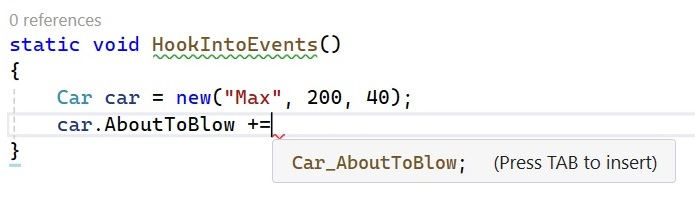

# Події

# Ключове слово event C#

Для роботи з делегатами треба зробити декілька визначень і кроків. Для скорочення і для того щоб вам не було потрібно створювати власні методи для додавання або видалення методів до списку викликів делегата, C# надає ключове слово event. Коли компілятор обробляє ключове слово event, вам автоматично надаються методи реєстрації та скасування реєстрації, а також будь-які необхідні змінні-члени для ваших типів делегатів. Ці змінні-члени делегатів завжди оголошуються приватними, і, отже, вони не піддаються безпосередньому впливу об’єкта, що викликає подію. Ключове слово event можна використовувати для спрощення того, як спеціальний клас надсилає сповіщення зовнішнім об’єктам.
Визначення події — це двоетапний процес. По-перше, вам потрібно визначити тип делегату або використати існуючий, який буде містити список методів, які будуть викликані під час запуску події. Далі ви оголошуєте подію (за допомогою ключового слова C# event) у термінах відповідного типу делегату.
Щоб проілюструвати ключове слово event, створіть нову консольну програму під назвою CarEvents. У цій ітерації класу Car ви визначите дві події під назвами AboutToBlow (Ось-ось вибухне) і Exploded(Вибухнув). Ці події пов’язані з одним типом делегату під назвою CarEngineHandler. Ось початкові оновлення класу автомобіля:

```cs
namespace CarEvents;

public class Car
{
    // Internal state data.
    public int CurrentSpeed { get; set; }
    public int MaxSpeed { get; set; }
    public string PetName { get; set; } = string.Empty;

    // Is the car alive or dead?
    private bool _carIsDead;

    // Class constructors.
    public Car() { MaxSpeed = 100; }
    public Car(string name, int maxSp, int currSp)
    {
        CurrentSpeed = currSp;
        MaxSpeed = maxSp;
        PetName = name;
    }

    // This delegate works in conjunction with the
    // Car's events.
    public delegate void CarEngineHandler(string msgForCaller);

    // This car can send these events.
    public event CarEngineHandler Exploded;
    public event CarEngineHandler AboutToBlow; 
}
```
Надіслати подію викликаючому коду так само просто, як вказати назву події разом із будь-якими необхідними параметрами, визначеними пов’язаним делегатом. Щоб переконатися, що викликаючий код дійсно зареєструвався в події, ви захочете перевірити подію на null перед тим, як викликати набір методів делегата. З огляду на ці моменти, ось нова ітерація методу Car’s Accelerate():

```cs
    public void Accelerate(int delta)
    {
        // If the car is dead, fire Exploded event.
        if (_carIsDead)
        {
            Exploded?.Invoke("Sorry, this car is dead...");
        }
        else
        {
            CurrentSpeed += delta;

            // Check speed
            if (CurrentSpeed >= MaxSpeed)
            {
                _carIsDead = true;
            }
            else
            {
                Console.WriteLine($"CurrentSpeed = {CurrentSpeed}");
            }

            //Almost dead
            if ((MaxSpeed-CurrentSpeed) <= 10)
            {
                AboutToBlow?.Invoke("Careful buddy! Gonna blow!");
            }
        }
    }
```

Завдяки цьому ви налаштували Car на надсилання двох користувацьких подій без необхідності визначати користувальницькі функції реєстрації чи оголошувати змінні члена делегату. За мить ви побачите використання цього нового автомобіля, але спочатку давайте перевіримо архітектуру подій трохи детальніше.

## Події під капотом

Коли компілятор обробляє ключове слово event C#, він генерує два прихованих методи, один із яких має префікс add_, а інший — префікс remove_. Після кожного префікса йде назва події C#. Наприклад, подія Exploded призводить до двох прихованих методів під назвою add_Exploded() і remove_Exploded(). Якщо ви перевірите інструкції CIL за add_AboutToBlow(), ви побачите виклик методу Delegate.Combine().

```
.method public hidebysig specialname instance void  add_AboutToBlow(
  class [System.Runtime]System.EventHandler`1<class CarEvents.CarEventArgs> 'value') cil managed
  {
...
    IL_000b: call class [System.Runtime]System.Delegate [System.Runtime]System.Delegate::Combine(class [System.Runtime]System.Delegate, class [System.Runtime]System.Delegate)
...
  } // end of method Car::add_AboutToBlow
```

Як і слід було очікувати, remove_AboutToBlow() викличе Delegate.Remove() від вашого імені.

```
.method public hidebysig specialname instance void  remove_AboutToBlow (
  class [System.Runtime]System.EventHandler`1<class CarEvents.CarEventArgs> 'value') cil managed
  {
...
    IL_000b:  call class [System.Runtime]System.Delegate [System.Runtime]System.Delegate::Remove(class [System.Runtime]System.Delegate, class [System.Runtime]System.Delegate)
...
}
```
Нарешті, код CIL, що представляє саму подію, використовує директиви .addon і .removeon для відображення імен правильних методів add_XXX() і remove_XXX(), які потрібно викликати.

```
.event class [System.Runtime]System.EventHandler`1<class CarEvents.CarEventArgs> AboutToBlow
{
  .addon instance void CarEvents.Car::add_AboutToBlow(
    class [System.Runtime]System.EventHandler`1<class CarEvents.CarEventArgs>)
  .removeon instance void CarEvents.Car::remove_AboutToBlow(
    class [System.Runtime]System.EventHandler`1<class CarEvents.CarEventArgs>)
} // end of event Car::AboutToBlow
```
Тепер, коли ви розумієте, як побудувати клас, який може надсилати події C# (і усвідомлюєте, що події — це не більше, ніж заощадження часу), наступне велике питання полягає в тому, як прослуховувати вхідні події на стороні викликаючого коду.

## Прослуховування вхідних подій

Події C# також спрощують процес реєстрації обробників подій викликаючого коду. Замість того, щоб вказувати власні допоміжні методи, викликаючий код просто використовує безпосередньо оператори += і -= (що запускає правильний метод add_XXX() або remove_XXX() у фоновому режимі). Якщо ви хочете зареєструватися на подію, дотримуйтесь шаблону, показаного тут:

```cs
// NameOfObject.NameOfEvent += new RelatedDelegate(functionToCall);
//
Car.CarEngineHandler d = new(CarExplodedEventHandler);
myCar.Exploded += d;
```
Якщо ви хочете від'єднатися від джерела подій, використовуйте оператор -=, використовуючи такий шаблон:

```cs
myCar.Exploded -= d;
```

Зауважте, що ви також можете використовувати синтаксис перетворення групи методів із подіями:

```cs
Car.CarEngineHandler d = CarExplodedEventHandler;
myCar.Exploded += d;
```
Враховуючи ці дуже передбачувані шаблони, ось перероблений код виклику, який тепер використовує синтаксис реєстрації подій C#:

```cs

using CarEvents;

//Methods
static void CarAboutToBlow(string message)
{
    Console.WriteLine(message);
}
static void CarIsAlmostDoomed(string message)
{
    Console.WriteLine($"=> Critical Message from Car: {message}");
}
static void CarExploded(string message)
{
    Console.WriteLine(message.ToUpper());
}

static void UsingEvents()
{
    Car car1 = new("SlugBug",100,10);

    car1.AboutToBlow += CarIsAlmostDoomed;
    car1.AboutToBlow += CarAboutToBlow;

    Car.CarEngineHandler d = CarExploded;
    car1.Exploded += d;

    Console.WriteLine("***** Speeding up *****");
    for (int i = 0; i < 6; i++)
    {
        car1.Accelerate(20);
    }

    // Remove CarExploded method
    // from invocation list.
    // car1.Exploded -= d;

    Console.WriteLine("***** Speeding up *****");
    for (int i = 0; i < 6; i++)
    {
        car1.Accelerate(20);
    }
}
UsingEvents();
```
```
***** Speeding up *****
CurrentSpeed = 30
CurrentSpeed = 50
CurrentSpeed = 70
CurrentSpeed = 90
=> Critical Message from Car: Careful buddy! Gonna blow!
Careful buddy! Gonna blow!
=> Critical Message from Car: Careful buddy! Gonna blow!
Careful buddy! Gonna blow!
Sorry, this car is dead...
***** Speeding up *****
Sorry, this car is dead...
Sorry, this car is dead...
Sorry, this car is dead...
Sorry, this car is dead...
Sorry, this car is dead...
Sorry, this car is dead...

```
Зніміть коментар з рядка :

```cs
    // Remove CarExploded method
    // from invocation list.
    car1.Exploded -= d;
```
```
***** Speeding up *****
CurrentSpeed = 30
CurrentSpeed = 50
CurrentSpeed = 70
CurrentSpeed = 90
=> Critical Message from Car: Careful buddy! Gonna blow!
Careful buddy! Gonna blow!
=> Critical Message from Car: Careful buddy! Gonna blow!
Careful buddy! Gonna blow!
Sorry, this car is dead...
***** Speeding up *****
```

## Спрощення роботу з подіями за допомогою Visual Studio

Visual Studio допомагає з процесом реєстрації обробників подій. Коли ви застосовуєте синтаксис += під час реєстрації події, ви побачите вікно IntelliSense, яке запрошує вас натиснути клавішу Tab для автоматичного завершення пов’язаного екземпляра делегату (див. Малюнок), який фіксується за допомогою синтаксису перетворення групи методів.



Після натискання клавіші Tab IDE автоматично створить новий метод.

```cs
static void HookIntoEvents()
{
    Car car = new("Max", 200, 40);
    car.AboutToBlow += Car_AboutToBlow;
}

static void Car_AboutToBlow(string msgForCaller)
{
    throw new NotImplementedException();
}
```
Зауважте, що код-заглушка має правильний формат цільового елемента (зверніть увагу, що цей метод оголошено статичним, оскільки подію було зареєстровано в статичному методі). 
IntelliSense доступний для всіх подій .NET, ваших спеціальних подій і всіх подій у бібліотеках базових класів. Ця функція IDE значно економить час, оскільки вона позбавляє вас необхідності шукати в довідковій системі, щоб визначити як правильний делегат для використання з подією, так і формат цільового методу делегату.

## Створення власних аргументів події

Є ще одне вдосконалення, яке ви можете внести в поточну ітерацію класу Car, яке відображає рекомендований шаблон подій Microsoft. Коли ви починаєте досліджувати події, надіслані заданим типом у бібліотеках базових класів, ви виявите, що перший параметр базового делегату є System.Object, тоді як другий параметр є нащадком System.EventArgs.
Аргумент System.Object представляє посилання на об’єкт, який надіслав подію (наприклад, car), тоді як другий параметр представляє інформацію про поточну подію. Базовий клас System.EventArgs представляє подію, яка не надсилає жодної спеціальної інформації.

```cs
public class EventArgs
{
  public static readonly EventArgs Empty;
  public EventArgs();
}
```
Для простих подій ви можете безпосередньо передати екземпляр EventArgs. Однак, якщо ви хочете передати спеціальні дані, вам слід створити відповідний клас, похідний від EventArgs. Для цього прикладу припустимо, що у вас є клас під назвою CarEventArgs, який підтримує рядок, що представляє повідомлення, надіслане одержувачу.

```cs
namespace CarEvents;

public class CarEventArgs : EventArgs
{
    public readonly string message;

    public CarEventArgs(string message)
    {
        this.message = message;
    }
}
```
Завдяки цьому ви оновили б визначення типу делегату CarEngineHandler таким чином (події залишаться незмінними):

```cs
public class Car1
{
    //...
    public delegate void CarEngineHandler(object sender, CarEventArgs eventArgs );
    //...
}
```
Тут під час запуску подій із методу Accelerate() вам тепер потрібно надати посилання на поточний Car (через ключове слово this) і екземпляр типу CarEventArgs. Наприклад, розглянемо таке часткове оновлення:

```cs

public class Car1
{

    //...

    public void Accelerate(int delta)
    {
        // If the car is dead, fire Exploded event.
        if (_carIsDead)
        {
            Exploded?.Invoke(this,new CarEventArgs("Sorry, this car is dead..."));
        }
        else
        {

            //...

            //Almost dead
            if ((MaxSpeed-CurrentSpeed) <= 10)
            {
                AboutToBlow?.Invoke(this,new CarEventArgs("Careful buddy! Gonna blow!"));
            }
        }
    }
}
```
З боку викликаючого коду все, що вам потрібно зробити, це оновити обробники подій, щоб отримати вхідні параметри та отримати повідомлення через поле лише для читання. Ось приклад:

```cs
static void UsingCarEventArgs()
{
    Car1 car = new("SlugBug", 100, 10);

    car.AboutToBlow += Car1_AboutToBlow;
    car.Exploded += Car1_Exploded;

    Console.WriteLine("***** Speeding up *****");
    for (int i = 0; i < 6; i++)
    {
        car.Accelerate(20);
    }
}
UsingCarEventArgs();

static void Car1_AboutToBlow(object sender, CarEventArgs eventArgs)
{
    // Just to be safe, perform a
    // runtime check before casting.
    if (sender is Car1 car)
    {
        Console.WriteLine($"Critical Message from {car.PetName} : {eventArgs.message}");
    }
}

static void Car1_Exploded(object sender, CarEventArgs eventArgs)
{
    if (sender is Car1 car)
    {
        Console.WriteLine(eventArgs.message.ToUpper());
    }
}
```
```
***** Speeding up *****
CurrentSpeed = 30
CurrentSpeed = 50
CurrentSpeed = 70
CurrentSpeed = 90
Critical Message from SlugBug :Careful buddy! Gonna blow!
Critical Message from SlugBug :Careful buddy! Gonna blow!
SORRY, THIS CAR IS DEAD...
```

## Універсальний делегат EventHandler<T> 

Зважаючи на те, що так багато настроюваних делегатів приймають object як перший параметр, а нащадок EventArgs — як другий, ви можете додатково оптимізувати попередній приклад, використовуючи загальний тип EventHandler\<T\>, де T — ваш спеціальний тип EventArgs. 

```cs
namespace CarEvents;

public class Car2
{
    // ...

    public event EventHandler<CarEventArgs>? Exploded;
    public event EventHandler<CarEventArgs>? AboutToBlow;

    // ...

}
```

Тоді код виклику може використовувати EventHandler\<CarEventArgs\> будь-де, де ви раніше вказали CarEventHandler (або, знову ж таки, використовувати перетворення групи методів).

```cs
static void UsingEventHandler()
{
    Car2 car = new("SlugBug", 100, 10);

    car.AboutToBlow += Car2_AboutToBlow;
    car.Exploded += Car2_Exploded;

    Console.WriteLine("***** Speeding up *****");
    for (int i = 0; i < 6; i++)
    {
        car.Accelerate(20);
    }
}
UsingEventHandler();

static void Car2_AboutToBlow(object? sender, CarEventArgs e)
{
    if (sender is Car2 car)
    {
        Console.WriteLine($"Critical Message from {car.PetName} :{e.message}");
    }
}
static void Car2_Exploded(object? sender, CarEventArgs e)
{
    if (sender is Car2 car)
    {
        Console.WriteLine(e.message.ToUpper());
    }
}
```
```
***** Speeding up *****
CurrentSpeed = 30
CurrentSpeed = 50
CurrentSpeed = 70
CurrentSpeed = 90
Critical Message from SlugBug :Careful buddy! Gonna blow!
Critical Message from SlugBug :Careful buddy! Gonna blow!
SORRY, THIS CAR IS DEAD...
```
Чудово! На цьому етапі ви побачили основні аспекти роботи з делегатами та подіями на мові C#. Хоча ви можете використовувати цю інформацію майже для всіх своїх потреб у зворотному виклику, ви закінчите цю главу оглядом деяких останніх спрощень, зокрема анонімних методів і лямбда-виразів.