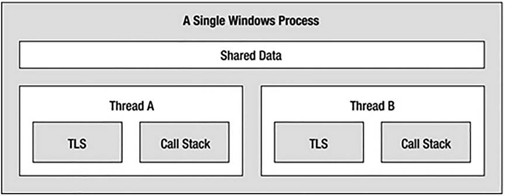

# Процеси, домени програм і контексти завантаження

У цьому розділі ви детально розглянете, як середовище виконання розміщує збірку, та зрозумієте взаємозв'язок між процесами, доменами програм та контекстами об'єктів. 
Домени застосунків (або просто AppDomains) – це логічні підрозділи в межах певного процесу, які містять набір пов'язаних збірок .NET Core.Як ви побачите, AppDomain далі поділяється на контекстні межі, які використовуються для групування одноманітних об'єктів .NET Core. Використовуючи поняття контексту, середовище виконання може забезпечити належну обробку об'єктів зі спеціальними вимогами.
Хоча це правда, що багато ваших щоденних завдань програмування можуть не включати безпосередньої роботи з процесами, AppDomains або контекстами об'єктів, розуміння цих тем є важливим під час роботи з численними API .NET Core, включаючи багатопоточність, паралельну обробку та серіалізацію об'єктів.

## Роль процесу

Процес – це програма, що виконується. Однак, формально кажучи, процес – це концепція рівня операційної системи, яка використовується для опису набору ресурсів (таких як зовнішні бібліотеки коду та основний потік) та необхідних розподілів пам'яті, що використовуються запущеною програмою. Для кожної програми .NET Core, завантаженої в пам'ять, ОС створює окремий та ізольований процес для використання протягом її життєвого циклу.
Використання такого підходу до ізоляції програм забезпечує набагато надійніше та стабільніше середовище виконання, враховуючи, що збій одного процесу не впливає на функціонування іншого. Крім того, дані в одному процесі не можуть бути безпосередньо доступні іншому процесу, якщо ви не використовуєте спеціальні інструменти, такі як System.IO.Pipes або клас MemoryMappedFile. З огляду на ці моменти, ви можете розглядати процес як фіксовану, безпечну межу для запущеної програми.
Кожному процесу Windows призначається унікальний ідентифікатор процесу (PID), і він може незалежно завантажуватися та вивантажуватися ОС за потреби (а також програмно). Як ви, можливо, знаєте, вкладка «Processes» утиліти «Windows Task Manager» (активується за допомогою комбінації клавіш Ctrl+Shift+Esc у Windows) дозволяє переглядати різноманітну статистику щодо процесів, що працюють на певному комп’ютері.
На вкладці «Details» можна переглянути призначений PID та назву зображення.

## Роль потоків

Кожен процес Windows містить початковий «потік» (thread), який функціонує як точка входу для програми. 
Потік – це шлях виконання всередині процесу. Формально кажучи, перший потік, створений точкою входу процесу, називається первинним потоком. Будь-яка програма .NET Core (консольний застосунок, служба Windows, застосунок WPF тощо) позначає свою точку входу методом Main() або файлом, що містить оператори верхнього рівня (який перетворюється на клас Program та метод Main(), як було показано раніше). Коли викликається цей код, первинний потік створюється автоматично. 
Процеси, що містять один основний потік виконання, є внутрішньо потокобезпечними, враховуючи, що в певний момент часу лише один потік може отримувати доступ до даних у програмі. Однак, однопотоковий процес (особливо той, що базується на графічному інтерфейсі) часто виглядатиме дещо нечутливим для користувача, якщо цей єдиний потік виконує складну операцію (наприклад, друк довгого текстового файлу, виконання математично складних обчислень або спроба підключення до віддаленого сервера). З огляду на цей потенційний недолік однопотокових програм, операційні системи, що підтримуються .NET Core (а також платформа .NET Core), дозволяють основному потоку породжувати додаткові вторинні потоки (також звані робочими потоками) за допомогою кількох функцій API, таких як CreateThread(). Кожен потік (первинний або вторинний) стає унікальним шляхом виконання в процесі та має одночасний доступ до всіх спільних точок даних у процесі.
Як ви могли здогадатися, розробники зазвичай створюють додаткові потоки, щоб покращити загальну швидкість реагування програми. Багатопотокові процеси створюють ілюзію одночасного виконання численних дій. Наприклад, програма може створити робочий потік для виконання трудомісткої одиниці роботи (знову ж таки, такої як друк великого текстового файлу). Поки цей вторинний потік працює, головний потік все ще реагує на введення користувача, що дає всьому процесу потенціал для забезпечення більшої продуктивності. Однак насправді це може бути не так: використання занадто великої кількості потоків в одному процесі може фактично знизити продуктивність, оскільки процесор повинен перемикатися між активними потоками в процесі (що займає час).
Машини, на яких встановлено один (негіперпотоковий) процесор, не мають можливості буквально обробляти кілька потоків одночасно. Швидше за все, один процесор виконуватиме один потік протягом одиниці часу (так званого інтервалу часу), частково залежно від рівня пріоритету потоку. Коли часовий інтервал потоку закінчується, існуючий потік призупиняється, щоб дозволити іншому потоку виконувати свої справи. Щоб потік пам'ятав, що відбувалося до його виключення, кожному потоку надається можливість запису в локальне сховище потоків Thread Local Storage (TLS) та окремий стек викликів, як показано на рисунку.



Якщо тема потоків для вас нова, не хвилюйтеся про деталі. На цьому етапі просто пам’ятайте, що потік – це унікальний шлях виконання в процесі Windows. Кожен процес має основний потік (створений через точку входу виконуваного файлу) і може містити додаткові потоки, створені програмно.

## Взаємодія з процесами за допомогою .NET Core

Щоб прокласти шлях до розуміння світу створення багатопотокових збірок, почнемо з розгляду того, як взаємодіяти з процесами за допомогою бібліотек базових класів .NET Core. Простір імен System.Diagnostics визначає кілька типів, які дозволяють програмно взаємодіяти з процесами, та різними типами, пов'язаними з діагностикою, такими як журнал системних подій та лічильники продуктивності.

У цьому розділі розглядаються лише типи, орієнтовані на процеси, визначені в таблиці.

Деякі члени простору імен System.Diagnostics

|Process-Centric Types |Значення|
|----------------------|--------|
|Process|Клас Process надає доступ до локальних та віддалених процесів і дозволяє програмно запускати та зупиняти процеси.|
|ProcessModule|Цей тип представляє модуль (*.dll або *.exe), який завантажується в процес. Тип ProcessModule може представляти будь-який модуль — COM-, .NET або традиційні бінарні файли на основі C.|
|ProcessModuleCollection|Це забезпечує строго типізовану колекцію об'єктів ProcessModule.|
|ProcessStartInfo|Це визначає набір значень, що використовуються під час запуску процесу через метод Process.Start().|
|ProcessThread|Цей тип представляє потік у заданому процесі. Майте на увазі, що ProcessThread – це тип, який використовується для діагностики набору потоків процесу, а не для створення нових потоків виконання в процесі.|
|ProcessThreadCollection|Це забезпечує строго типізовану колекцію об'єктів ProcessThread.|

Клас System.Diagnostics.Process дозволяє аналізувати процеси, що працюють на заданій машині (локальній або віддаленій). Клас Process також надає члени, які дозволяють програмно запускати та завершувати процеси, переглядати (або змінювати) рівень пріоритету процесу та отримувати список активних потоків та/або завантажених модулів у заданому процесі.

Ключові властивості типу Process

|Властивість|Значення|
|-----------|--------|
|ExitTime|Ця властивість отримує позначку часу, пов'язану з процесом, який завершився (представлене типом DateTime).|
|Handle|Ця властивість повертає дескриптор (представлений як IntPtr), пов'язаний з процесом ОС. Це може бути корисним під час створення .NET-застосунків, яким потрібно взаємодіяти з некерованим кодом.|
|Id|Ця властивість отримує PID для пов'язаного процесу.|
|MachineName|Ця властивість отримує ім'я комп'ютера, на якому запущено пов'язаний процес.|
|MainWindowTitle|MainWindowTitle отримує заголовок головного вікна процесу (якщо процес не має головного вікна, ви отримуєте порожній рядок).|
|Modules|Ця властивість надає доступ до строго типізованого типу ProcessModuleCollection, який представляє набір модулів (*.dll або *.exe), завантажених у поточному процесі.|
|ProcessName|Ця властивість отримує назву процесу (яка, як ви могли б припустити, є назвою самої програми).|
|Responding|Ця властивість отримує значення, яке вказує, чи відповідає інтерфейс користувача процесу на введення користувача (чи наразі «завис»).|
|StartTime|Ця властивість отримує час запуску пов'язаного процесу (через тип DateTime).|
|Threads|Ця властивість отримує набір потоків, що виконуються у пов'язаному процесі (представленому через колекцію об'єктів ProcessThread).|

Окрім щойно розглянутих властивостей, System.Diagnostics.Process також визначає кілька корисних методів.

Ключові методи типу Process

|Метод|Значення|
|-----|--------|
|CloseMainWindow()|Цей метод закриває процес, який має користувацький інтерфейс, надсилаючи повідомлення про закриття до його головного вікна.|
|GetCurrentProcess()|Цей статичний метод повертає новий об'єкт Process, який представляє поточний активний процес.|
|GetProcesses()|Цей статичний метод повертає масив нових об'єктів Process, що працюють на заданій машині.|
|Kill()|Цей метод негайно зупиняє пов'язаний процес.|
|Start()|Цей метод запускає процес.|

## Перерахування запущених процесів

Щоб проілюструвати процес маніпулювання об'єктами Process, створіть проект консольного застосунку C# з назвою ProcessManipulator. Далі визначте наступний статичний допоміжний метод у файлі Program.cs:

```cs
static void ListAllRunningProcesses()
{
    // Get all the processes on the local machine, ordered by
    // PID.
    var runningProcs = from proc in Process.GetProcesses(".") 
                       orderby proc.Id 
                       select proc;

    // Print out PID and name of each process.
    foreach (var p in runningProcs) //.Skip(10).Take(10))
    {
        string info = $"PID: {p.Id}\tName: {p.ProcessName}";
        Console.WriteLine(info);
    }
    Console.WriteLine("************************************\n");
}
ListAllRunningProcesses();
```
Статичний метод Process.GetProcesses() повертає масив об'єктів Process, які представляють процеси, що виконуються на цільовому комп'ютері (крапкова нотація, показана тут, позначає локальний комп'ютер). Після отримання масиву об'єктів Process ви можете викликати будь-якого з його членів. Тут ви просто відображаєте PID та назву кожного процесу, відсортовані за PID. Коли ви запустите програму, ви побачите назви та PID-ідентифікатори всіх процесів на вашому локальному комп'ютері.

## Дослідження певного процесу

Окрім отримання повного списку всіх запущених процесів на заданій машині, статичний метод Process.GetProcessById() дозволяє отримати окремий об'єкт Process через пов'язаний з ним PID. Наприклад, наприклад отримаємо остній процес в списку :

```cs
static void GetSpecificProcess()
{
    // Get all the processes on the local machine, ordered by
    // PID.
    var runningProcs = from proc in Process.GetProcesses(".")
                       orderby proc.Id
                       select proc.Id;

    int id = runningProcs.Max();
    Process process = Process.GetProcessById(id);

    Console.WriteLine(process.Id+"\t"+process.ProcessName);
}
GetSpecificProcess();
```
```
17188   taskhostw
```
Хоча пошук PID та імен процесів дещо корисний, клас Process також дозволяє знайти набір поточних потоків та бібліотек, що використовуються в заданому процесі. Давайте подивимося, як це зробити.

## Дослідження набору потоків процесу

Набір потоків представлено строго типізованою колекцією ProcessThreadCollection, яка містить певну кількість окремих об'єктів ProcessThread. Для ілюстрації додайте наступну додаткову статичну допоміжну функцію до вашої поточної програми:

```cs
static void EnumThreadsForProcess(Process theProc)
{

    // List out stats for each thread in the specified process.
    Console.WriteLine($"Here are the threads used by:{theProc.Id} {theProc.ProcessName}");
    ProcessThreadCollection theThreads = theProc.Threads;

    foreach (ProcessThread pt in theThreads)
    {
        string info =
            $"-> Thread ID: {pt.Id}\tStart Time: {pt.StartTime.ToShortTimeString()}\tPriority: {pt.PriorityLevel}";
        Console.WriteLine(info);
    }
    Console.WriteLine("************************************\n");
}
```
Як бачите, властивість Threads типу System.Diagnostics.Process надає доступ до класу ProcessThreadCollection. Тут ви виводите призначений ідентифікатор потоку, час початку та рівень пріоритету кожного потоку в процесі, визначеному клієнтом.
Тепер використаємо цей метод для конкретного процессу:

```cs
static void EnumThreads()
{
    var runningProcs = from proc in Process.GetProcesses(".")
                       where proc.ProcessName == "chrome"
                       select proc;

    // Print out PID and name of each process.
    foreach (var p in runningProcs)
    {
        EnumThreadsForProcess(p);
    }
}
EnumThreads();
```
Під час запуску програми ви можете ввести PID будь-якого процесу на вашому комп'ютері та побачити потоки, що використовуються в процесі.

Тип ProcessThread має додаткові цікаві члени, окрім Id, StartTime та PriorityLevel.

Деякі члени типу ProcessThread

|Член|Значення|
|----|--------|
|CurrentPriority|Отримує поточний пріоритет потоку|
|Id|Отримує унікальний ідентифікатор потоку|
|IdealProcessor|Встановлює бажаний процесор для виконання цього потоку|
|PriorityLevel|Отримує або встановлює рівень пріоритету потоку|
|ProcessorAffinity|Встановлює процесори, на яких може виконуватися пов'язаний потік|
|StartAddress|Отримує адресу пам'яті функції, викликаної операційною системою, яка запустила цей потік.|
|StartTime|Отримує час, коли операційна система запустила потік|
|ThreadState|Отримує поточний стан цього потоку|
|TotalProcessorTime|Отримує загальний час, який цей потік витратив на використання процесора.|
|WaitReason|Отримує причину, чому потік очікує|

Перш ніж читати далі, пам’ятайте, що тип ProcessThread не є сутністю, яка використовується для створення, призупинення або завершення потоків на платформі .NET Core. Швидше, ProcessThread – це засіб, який використовується для отримання діагностичної інформації для активних потоків Windows у запущеному процесі. Знову ж таки, у наступній главі ви дослідите, як створювати багатопотокові програми за допомогою простору імен System.Threading.

## Дослідження набору модулів процесу

Далі давайте розглянемо, як перебрати кількість завантажених модулів, розміщених у заданому процесі. Коли йдеться про процеси, модуль – це загальний термін, що використовується для опису певного *.dll (або самого *.exe), розміщеного певним процесом. Коли ви отримуєте доступ до ProcessModuleCollection через властивість Process.Modules, ви можете перерахувати всі модулі, розміщені в процесі: бібліотеки на основі .NET Core, COM або традиційні бібліотеки на основі C. Розгляньте наступну додаткову допоміжну функцію, яка перераховуватиме модулі в певному процесі :

```cs
static void EnumModulesForProcess(Process theProc)
{

    Console.WriteLine($"Here are the loaded modules for:{theProc.Id} {theProc.ProcessName}");
    ProcessModuleCollection theMods = theProc.Modules;
    foreach (ProcessModule pm in theMods)
    {
        string info = $"-> Mod Name: {pm.ModuleName}";
        Console.WriteLine(info);
    }
    Console.WriteLine("************************************\n");
}
```
Щоб побачити можливий результат, давайте перевіримо завантажені модулі для процесу, на якому розміщено поточну прикладну програму (ProcessManipulator).

```cs
static void EnumModules()
{
    Process process = Process.GetCurrentProcess();
    EnumModulesForProcess(process);
}
EnumModules();
```
Після цього ви можете здивуватися, побачивши список *.dll-файлів, що використовуються для простого проекту консольної програми (GDI32.dll, USER32.dll, ole32.dll тощо).

## Програмний запуск та зупинка процесів

Останні аспекти класу System.Diagnostics.Process, які тут розглядаються, – це методи Start() та Kill(). Як ви можете зрозуміти з їхніх імен, ці члени надають спосіб програмного запуску та завершення процесу відповідно. Наприклад, розглянемо наступний статичний допоміжний метод StartAndKillProcess().

    Залежно від налаштувань безпеки вашої операційної системи, для запуску нових процесів вам може знадобитися мати права адміністратора.

```cs
static void StartAndKillProcess()
{
    Process proc = null;
    // Launch Microsoft Edge
    try
    {
        proc = Process.Start(@"C:\Program Files (x86)\Microsoft\Edge\Application\msedge.exe", "www.weather.
    }
    catch (InvalidOperationException ex)
    {
        Console.WriteLine(ex.Message);
    }
    Console.Write($"--> Hit enter to kill {proc.ProcessName}...");
    Console.ReadLine();

    try
    {
        foreach (var p in Process.GetProcessesByName("MsEdge"))
        {
            p.Kill(true);
        }
    }
    catch (InvalidOperationException ex)
    {
        Console.WriteLine(ex.Message);
    }
}
StartAndKillProcess();
```
Статичний метод Process.Start() кілька разів перевантажувався. Як мінімум, вам потрібно буде вказати шлях та ім'я файлу процесу, який ви хочете запустити. У цьому прикладі використовується варіація методу Start(), яка дозволяє вказати будь-які додаткові аргументи для передачі в точку входу програми, в цьому випадку, веб-сторінку для завантаження. Коли ви хочете завершити процес, просто викличте метод Kill() на рівні екземпляра. У цьому прикладі, оскільки Microsoft Edge запускає багато процесів, ви виконуєте цикл, щоб завершити всі запущені процеси. Ви також обгортаєте виклики Start() та Kill() у блок try/catch для обробки будь-яких помилок InvalidOperationException. Це особливо важливо під час виклику методу Kill(), оскільки ця помилка виникне, якщо процес вже було завершено до виклику Kill().

    Для .NET Core та кросплатформної підтримки необхідно вказати повний шлях та ім'я файлу. Асоціації з операційною системою можна використовувати за допомогою ProcessStartInfo, що розглядається в наступних двох розділах.


## Керування запуском процесу за допомогою класу ProcessStartInfo

Метод Process.Start() також дозволяє вам передати тип System.Diagnostics.ProcessStartInfo, щоб указати додаткові фрагменти інформації щодо того, як певний процес має оживати. Ось часткове визначення ProcessStartInfo (докладніше див. у документації):

```cs
public sealed class ProcessStartInfo : object
{
  public ProcessStartInfo();
  public ProcessStartInfo(string fileName);
  public ProcessStartInfo(string fileName, string arguments);
  public string Arguments { get; set; }
  public bool CreateNoWindow { get; set; }
  public StringDictionary EnvironmentVariables { get; }
  public bool ErrorDialog { get; set; }
  public IntPtr ErrorDialogParentHandle { get; set; }
  public string FileName { get; set; }
  public bool LoadUserProfile { get; set; }
  public SecureString Password { get; set; }
  public bool RedirectStandardError { get; set; }
  public bool RedirectStandardInput { get; set; }
  public bool RedirectStandardOutput { get; set; }
  public Encoding StandardErrorEncoding { get; set; }
  public Encoding StandardOutputEncoding { get; set; }
  public bool UseShellExecute { get; set; }
  public string Verb { get; set; }
  public string[] Verbs { get; }
  public ProcessWindowStyle WindowStyle { get; set; }
  public string WorkingDirectory { get; set; }
}
```
Щоб проілюструвати, як точно налаштувати запуск процесу, ось модифікована версія StartAndKillProcess(), яка завантажить Microsoft Edge та переведе на сайт, використовуючи асоціацію Windows MsEdge:

```cs
static void StartAndKillProcess()
{
    Process proc = null;
    // Launch Microsoft Edge
    try
    {
        //...
        ProcessStartInfo startInfo = new ProcessStartInfo("MsEdge", "www.weather.com");
        startInfo.UseShellExecute = true;
        proc = Process.Start(startInfo);
    }
    catch (InvalidOperationException ex)
    {
        Console.WriteLine(ex.Message);
    }
    //...    
}
StartAndKillProcess();
```
У .NET Core властивість UseShellExecute за замовчуванням має значення false, тоді як у попередніх версіях .NET властивість UseShellExecute за замовчуванням має значення true. Саме тому попередня версія Process.Start(), показана тут, більше не працює без використання ProcessStartInfo та встановлення властивості UseShellExecute значення true:

```cs
Process.Start("msedge");
```

## Використання дієслів ОС за допомогою ProcessStartInfo

Окрім використання ярликів ОС для запуску програм, ви також можете скористатися перевагами асоціацій файлів за допомогою ProcessStartInfo. У Windows, якщо клацнути правою кнопкою миші на документі Word, з’являться опції редагування або друку документа. Давайте використаємо ProcessStartInfo, щоб визначити доступні дієслова, а потім використовувати їх для маніпулювання процесом.
Створіть новий метод з наступним кодом:

```cs
void UseApplicationVerbs()
{
    ProcessStartInfo processStartInfo = new(@"D:\TheLetter.txt");

    foreach (string? verb in processStartInfo.Verbs)
    {
        Console.WriteLine(verb);
    }

    processStartInfo.WindowStyle = ProcessWindowStyle.Maximized;
    processStartInfo.Verb = "open";
    processStartInfo.UseShellExecute = true;
    Process.Start(processStartInfo);
}
UseApplicationVerbs();
```
Свторіть файл D:\TheLetter.txt і запустіть программу. Коли ви запускаєте цей код, перша частина виводить усі доступні дієслова для текстового документа, як показано нижче:

```
  0. open
  1. print
  2. printto
```
Після встановлення для WindowStyle значення Maximized для дієслова встановлюється значення open, що відкриває документ. Якщо ви встановите для дієслова значення print, документ буде надіслано безпосередньо на принтер.
Тепер, коли ви розумієте роль процесів Windows та як взаємодіяти з ними з коду C#, ви готові дослідити концепцію домену застосунку .NET.

# Розуміння доменів застосунків .NET

На платформах .NET та .NET Core виконувані файли не розміщуються безпосередньо в процесі Windows, як це відбувається в традиційних некерованих програмах. Натомість, виконувані файли .NET та .NET Core розміщуються на логічному розділі в процесі, який називається доменом програми. Цей розділ традиційного процесу Windows пропонує кілька переваг, деякі з яких такі:

1. Домени додатків (AppDomains) є ключовим аспектом нейтральної до ОС природи платформи .NET Core, враховуючи, що цей логічний поділ абстрагує відмінності в тому, як базова ОС представляє завантажений виконуваний файл.
2. Домени додатків набагато дешевші з точки зору обчислювальної потужності та пам'яті, ніж повноцінний процес. Таким чином, CoreCLR може завантажувати та вивантажувати домени додатків набагато швидше, ніж формальний процес, і може суттєво покращити масштабованість серверних додатків.

Домени додатків повністю ізольовані від інших доменів додатків у межах процесу.  З огляду на цей факт, майте на увазі, що програма, що працює в одному домені додатка, не може отримувати дані будь-якого типу (глобальні змінні чи статичні поля) в іншому домені додатка, якщо вони не використовують протокол розподіленого програмування.

    У .NET Core існує лише один AppDomain. Створення нових AppDomain більше не підтримується, оскільки вони потребують підтримки середовища виконання та, як правило, є дорогими для створення. ApplicationLoadContext (розглянуто далі в цьому розділі) забезпечує ізоляцію збірки в .NET Core.

# Клас System.AppDomain

Клас AppDomain значною мірою застарів у .NET Core. Хоча більша частина решти підтримки розроблена для спрощення міграції з .NET 4.x на .NET Core, решта функцій все ще можуть бути корисними, як описано в наступних двох розділах.

## Взаємодія з доменом програми за замовчуванням

Ваша програма має доступ до домену програми за замовчуванням за допомогою статичної властивості AppDomain.CurrentDomain. Після отримання цієї точки доступу ви можете використовувати методи та властивості AppDomain для виконання діагностики під час виконання.
Щоб дізнатися, як взаємодіяти з доменом програми за замовчуванням, почніть зі створення нового проекту консольної програми з назвою DefaultAppDomainApp. Тепер оновіть файл Program.cs за допомогою наступної логіки, яка просто відобразить деякі деталі про домен програми за замовчуванням, використовуючи певну кількість членів класу AppDomain:

```cs
static void DisplayDefaulAppDomainStats()
{
    // Get access to the AppDomain for the current thread.
    AppDomain defaultAD = AppDomain.CurrentDomain;

    // Print out various stats about this domain.
    Console.WriteLine($"Name of this domain: {defaultAD.FriendlyName}");
    Console.WriteLine($"ID of domain in this process: {defaultAD.Id}");
    Console.WriteLine($"Is this the default domain?: {defaultAD.IsDefaultAppDomain()}");
    Console.WriteLine($"Base directory of this domain: {defaultAD.BaseDirectory}");
    Console.WriteLine($"Setup Information for this domain:");
    Console.WriteLine($"\tApplication Base: {defaultAD.SetupInformation.ApplicationBase}");
    Console.WriteLine($"\tTarget Framework: {defaultAD.SetupInformation.TargetFrameworkName}");
}
DisplayDefaulAppDomainStats();
```
```
Name of this domain: DefaultAppDomainApp
ID of domain in this process: 1
Is this the default domain?: True
Base directory of this domain: D:\...\bin\Debug\net9.0\
Setup Information for this domain:
        Application Base: D:\...\bin\Debug\net9.0\
        Target Framework: .NETCoreApp,Version=v9.0
```
Зверніть увагу, що ім'я домену програми за замовчуванням буде ідентичним імені виконуваного файлу, який міститься в ньому (DefaultAppDomainApp.exe, у цьому прикладі). Також зверніть увагу, що значення базового каталогу, яке буде використовуватися для перевірки наявності зовнішніх приватних збірок, відповідає поточному розташуванню розгорнутого виконуваного файлу.

## Перерахування завантажених збірок

Також можна знайти всі завантажені збірки .NET Core у заданому домені програми за допомогою методу GetAssemblies() на рівні екземпляра. Цей метод поверне вам масив об'єктів Assembly. Для цього потрібно додати простір імен System.Reflection. 
Для ілюстрації визначимо новий метод з назвою ListAllAssembliesInAppDomain() у файлі Program.cs. Цей допоміжний метод отримає всі завантажені збірки та виведе зрозумілу назву та версію кожної з них.

```cs

static void ListAllAssembliesInAppDomain()
{
    // Get access to the AppDomain for the current thread.
    AppDomain defaultAD = AppDomain.CurrentDomain;

    // Now get all loaded assemblies in the default AppDomain.
    //var loadedAssemblies = defaultAD.GetAssemblies();
    var loadedAssemblies = defaultAD.GetAssemblies()
        .OrderBy(x => x.GetName().Name);
   
    Console.WriteLine($"***** Here are the assemblies loaded in {defaultAD.FriendlyName} *****\n");
    foreach (Assembly a in loadedAssemblies)
    {
        Console.WriteLine($"\t{a.GetName().Name}:{a.GetName().Version}");
    }
}
ListAllAssembliesInAppDomain();
```
Ви побачите, що домен застосунку, на якому розміщено ваш виконуваний файл, використовує бібліотеки .NET Core:
```
***** Here are the assemblies loaded in DefaultAppDomainApp *****

        DefaultAppDomainApp:1.0.0.0
        Microsoft.Extensions.DotNetDeltaApplier:17.0.0.0
        System.Collections:9.0.0.0
        System.Console:9.0.0.0
        System.IO.Pipes:9.0.0.0
        System.Linq:9.0.0.0
        System.Private.CoreLib:9.0.0.0
        System.Runtime:9.0.0.0
```
Тепер зрозумійте, що список завантажених збірок може змінюватися будь-коли під час створення нового коду C#.

## Ізоляція збірок з контекстами завантаження програм

Як ви щойно бачили, AppDomains – це логічні розділи, що використовуються для розміщення збірок .NET Core. Крім того, домен застосунку може бути додатково поділений на численні межі контексту завантаження. Концептуально, контекст завантаження створює область для завантаження, вирішення та потенційного вивантаження набору збірок. Контекст завантаження .NET Core надає можливість окремому AppDomain встановити «конкретний дім» для певного об’єкта.

    Хоча розуміння процесів та доменів застосунків є досить важливим, більшість застосунків .NET Core ніколи не вимагатимуть роботи з контекстами об'єктів. Я включив цей оглядовий матеріал лише для того, щоб намалювати повнішу картину.

Клас AssemblyLoadContext надає можливість завантажувати додаткові збірки у власні контексти. Для демонстрації спочатку додайте проект бібліотеки класів з назвою ClassLibary1 та додайте його до вашого поточного рішення. Використовуючи інтерфейс командного рядка .NET Core, виконайте такі команди в каталозі, що містить ваше поточне рішення(Tools > Command line > DeveloperPowerShell):

```
dotnet new classlib -n ClassLibrary1
dotnet sln add .\ClassLibrary1
dotnet add DefaultAppDomainApp reference ClassLibrary1
```
У цій новій бібліотеці класів додайте клас Car наступним чином:

```cs
namespace ClassLibrary1;

public class Car
{
    public string PetName { get; set; }
    public string Make { get; set; }
    public int Speed { get; set; }
}
```
Після встановлення цієї нової збірки переконайтеся, що наступні оператори using знаходяться у верхній частині файлу Program.cs у проекті DefaultAppDomainApp:

Наступний метод у верхньому рівні операторів DefaultAppDomainApp – це метод LoadAdditionalAssembliesDifferentContexts(), показаний тут:

```cs
static void LoadAdditionalAssembliesDifferentContexts()
{
    string? path = Path.Combine(AppDomain.CurrentDomain.BaseDirectory, "ClassLibrary1.dll");
    AssemblyLoadContext lc1 = new AssemblyLoadContext("NewContext1", false);
    Assembly assembly1 = lc1.LoadFromAssemblyPath(path);
    object? car1 = assembly1.CreateInstance("ClassLibrary1.Car");
    AssemblyLoadContext lc2 = new AssemblyLoadContext("NewContext2", false);
    Assembly assembly2 = lc2.LoadFromAssemblyPath(path);
    object? car2 = assembly2.CreateInstance("ClassLibrary1.Car");
    Console.WriteLine("*** Loading Additional Assemblies in Different Contexts ***");
    Console.WriteLine($"Assembly1 Equals(Assembly2) {assembly1.Equals(assembly2)}");
    Console.WriteLine($"Assembly1 == Assembly2 {assembly1 == assembly2}");
    Console.WriteLine($"Class1.Equals(Class2) {car1.Equals(car2)}");
    Console.WriteLine($"Class1 == Class2 {car1 == car2}");
}
```
    Вам може бути цікаво, чому ви створили посилання на збірку, яка буде завантажуватися динамічно. Це зроблено для того, щоб під час збірки проекту збірка ClassLibrary1 також збиралася та знаходилася в тому ж каталозі, що й DefaultAppDomainApp. Це просто зручно для цього прикладу. Немає потреби посилатися на збірку, яка буде завантажуватися динамічно.

У першому рядку використовується статичний метод Path.Combine для створення каталогу для збірки ClassLibrary1. Далі код створює новий AssemblyLoadContext з іменем NewContext1 (перший параметр методу) та не підтримує вивантаження (другий параметр). Цей LoadContext використовується для завантаження збірки ClassLibrary1, а потім для створення екземпляра класу Car. Процес повторюється з новим AssemblyLoadContext, а потім збірки та класи порівнюються на рівність.

```
*** Loading Additional Assemblies in Different Contexts ***
Assembly1.Equals(Assembly2) False
Assembly1 == Assembly2 False
Class1.Equals(Class2) False
Class1 == Class2 False
```
Це демонструє, що та сама збірка була завантажена двічі в домен програми. Класи також відрізняються, як і слід було очікувати. Далі додайте новий метод, який завантажуватиме збірку з того ж AssemblyLoadContext.

```cs
static void LoadAdditionalAssembliesSameContext()
{
    var path = Path.Combine(AppDomain.CurrentDomain.BaseDirectory, "ClassLibrary1.dll");
    AssemblyLoadContext lc1 = new AssemblyLoadContext(null, false);
    var cl1 = lc1.LoadFromAssemblyPath(path);
    var c1 = cl1.CreateInstance("ClassLibrary1.Car");
    var cl2 = lc1.LoadFromAssemblyPath(path);
    var c2 = cl2.CreateInstance("ClassLibrary1.Car");
    Console.WriteLine("*** Loading Additional Assemblies in Same Context ***");
    Console.WriteLine($"Assembly1.Equals(Assembly2) {cl1.Equals(cl2)}");
    Console.WriteLine($"Assembly1 == Assembly2 {cl1 == cl2}");
    Console.WriteLine($"Class1.Equals(Class2) {c1.Equals(c2)}");
    Console.WriteLine($"Class1 == Class2 {c1 == c2}");
}
LoadAdditionalAssembliesSameContext();
```
Основна відмінність цього коду полягає в тому, що створюється лише один AssemblyLoadContext. Тепер, коли збірка ClassLibrary1 завантажується двічі, друга збірка є просто вказівником на перший екземпляр збірки. Виконання коду видає наступний вивід:

```
*** Loading Additional Assemblies in Same Context ***
Assembly1.Equals(Assembly2) True
Assembly1 == Assembly2 True
Class1.Equals(Class2) False
Class1 == Class2 False
```
## Підсумок процесів, доменів програм та контекстів завантаження

На цьому етапі ви маєте набагато краще уявлення про те, як середовище виконання розміщує збірку .NET Core. Якщо попередні сторінки здалися вам дещо занадто низькорівневими, не хвилюйтеся. Здебільшого, .NET Core автоматично обробляє деталі процесів, доменів застосунків та контекстів завантаження за вас. Гарна новина, однак, полягає в тому, що ця інформація забезпечує міцну основу для розуміння багатопотокового програмування на платформі .NET Core.

# Підсумки

Метою цього розділу було дослідити, як саме програма .NET Core розміщується на платформі .NET Core. Як ви бачили, давнє поняття процесу Windows було змінено під капотом, щоб задовольнити потреби CoreCLR. Окремий процес (яким можна програмно маніпулювати через тип System.Diagnostics.Process) тепер складається з домену програми, який представляє ізольовані та незалежні межі всередині процесу.
Домен застосунку може розміщувати та виконувати будь-яку кількість пов'язаних збірок. Крім того, один домен застосунку може містити будь-яку кількість контекстів завантаження для подальшої ізоляції збірок. Використовуючи цей додатковий рівень ізоляції типів, CoreCLR може забезпечити правильну обробку об'єктів зі спеціальними потребами.
