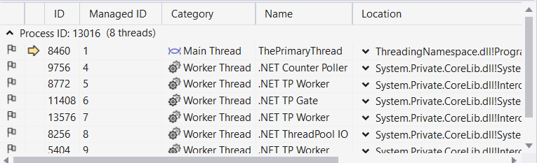

# Простір імен System.Threading

## Взаємовідносини між Process,AppDomain,Context,Thread

Потік це шлях виконання у виконуваній програмі. Багато прогам можуть виконуватися продуктивно в одному потоці. Основний потік збірки (створений середовищем виконання, коли виконується точка входу програми) може створювати вторинні потоки виконання в будь-який час для виконання додаткових одиниць роботи. Так можна ствоювати біль чутливі програми для користувача. 
Простір імен System.Threading  пропонує один підхід для створення багатопоточних програм. 
Важливим класом є Thread, оскільки представляє даний потік. Якщо ви хочете програмно отримати посилання на потік, який зараз виконує певний член, просто викличте статичну властивість Thread.CurrentThread, наприклад:

ThreadingNamespace\Program.cs
```cs
static void ExtractExecutingThread()
{
    Thread thread = Thread.CurrentThread;
    Console.WriteLine(thread.ManagedThreadId);
    
}
ExtractExecutingThread();
```
В .Net Core існує лише один AppDomain, який може мати численні потоки, що виконуються в ньому в будь який момент часу. Можна отримати посилання на AppDomain на якому розміщена програма поток якої виконується.
```cs
static void ExtractAppDomainHostingThread()
{
    // Obtain the AppDomain hosting the current thread.
    AppDomain appDomain = Thread.GetDomain();
    Console.WriteLine(appDomain.FriendlyName);
}
ExtractAppDomainHostingThread();
```
```
ClassThreading
```
Один потік також може бути переміщений у контекст виконання в будь-який момент часу і він може бути переміщений у новому контексті виконання за примхою .Net Core Runtime. Можна отримати поточний контекст виконання, у якому виконуєтьься потік.

```cs
static void ExtractCurrentThreadExecutionContext()
{
    ExecutionContext executionContext = Thread.CurrentThread.ExecutionContext;
    Console.WriteLine(executionContext);
}
ExtractCurrentThreadExecutionContext();
```
```
System.Threading.ExecutionContext
```
Знову ж таки, .NET Core Runtime контролює переміщення потоків у (і з) контексти виконання. Як розробник .NET Core, ви зазвичай можете не знати, куди закінчується певний потік. Тим не менш, ви повинні знати про різні способи отримання базових складаючих основу типів.

## Проблема паралельності.

Один із неприємних аспектів в багатопотоковому програмувані полягає в тому що ви мало контролюєте, як базова ОС або runtime використовує свої потоки. Наприклад коли ви створюєте блок коду, який створює новий потік виконання, ви не можете гарантувати, що потік буде виконано негайно. Швидше такий код лише наказує ОС/Runtime виконати потік якнайшвидше(що зазвичай відбувається коли планувальник потоків доходить до цього). Крім того, враховуючи те, що потоки можна переміщувати між програмою та контекстними межами відповідно до вимог середовища виконання, ви повинні пам’ятати, які аспекти вашої програми є потоково-незалежними (наприклад, підлягають багатопоточному доступу), а які операції є атомарними (потоково-незалежними операції небезпечні!).
Щоб проілюструвати проблему, припустимо, що потік викликає метод певного об'єкта. Тепер припустимо, припустимо що цей потік отримав інструкцію від планувальника потоків призупинити свою діяльність, щоб дозволити іншому потоку отримати доступ до того мамого методу того самого об'єкту. Якшо перший потік не закінчив виконання методу повністю, другій приходячий потік може отримати і працювати з об'єктом у частково зміненому стані. Зчитучи фальшиві дані другий потік приведе до дуже дивних поммилок які важко відтворити і налагодити.
З іншого боку атомарні операції завжди безпечні в багатопотоковому середовищі. На жаль, у бібіліотеках базових класів .Net Core є кілька операцій, які гарантовано є атомарними. Навіть акт присвоєння значення змінній-члену не є атомарним! Якщо в документації .Net конкретно не вказано, що операція є атомарною, ви повині вважати, що вона нестійка до потоку, і вжити заходів обережності.   

## Роль синхронізації потоків.
Багатопотокові програми досить мінливі(мають місце постіцно змінюватись), оскільки числені потоки можуть працювати на спільних ресурсах (більш менш) одночасно. Щоб захістити ресурси програми від можливого пошкодження, розродники .Net повинні використовувати будь-яку кількість потокових примітивів (таких як блокуання, монітори та атрібут [Synchronization] або підтримка ключових слів мови), щоб контролювати доступ між потоками що виконуються.
Хоча платформа .NET Core не може повністю усунути труднощі зі створення надійних багатопоточних програм, процес значно спрощено.Використовуючи типи, визначені в просторі імен System.Threading, паралельній бібліотеці завдань і ключових словах мови C# async і await, ви можете працювати з кількома потоками з мінімальною суєтою та турботою.


## Складові простору імен System.Threading.

На платформі .Net простір імен System.Threading надає типи, які дозволяють безпосередне створення багатопоточних програм. Ці типи дозаоляють взаємодіяти з потоком .Net Core Runtime. Також цей простір імен визначає типи які дають доступ до пулу потоків, що підтримується .Net Core Runtime, простого класу Timer та багатьох типів, що використовуються для забезпечення синхронізованого доступу до спільних ресурсів. Нижче наведені деякі з важливих типів цього простору імен.

    Interlocked : Цей тип забеспечує атомарні операції для змінних, які спільно використовуються кількома потоками.

    Monitor : Цей тип забезпечує сінхронізацію потокових об'єктів за допомогою блокувані і очінування/сигналів. Ключеве слово lock використовує тип під капотом.

    Mutex : Цей примітив синхронізаціх можна використовувати жля сінхронізації між межами домену програми.

    ParameterizedThreadStart : Цей делегат дозволяє потоку викликати методи, які приймають будь-яку кількість аргументів.

    Semaphore : Цей тип дозволяє обмежити кількість потоків, які можуть одночасно отримувати доступ до ресурсу.

    Thread : Цей тип представляє потік, який виконується в середовищі виконання .Net.
    Використовуючи цей тип, ви можете створювати додадкові потоки в поточному AppDomain.

    ThreadPool : Цей тип дозволяє взаємодіяти з пулом потоків, шо підтримуються .Net Core Runtime, у певному процесі.

    ThreadPriority : Це enum представляє рівні пріорітетів потоку (Highest, Normal, etc.).

    ThreadStart : Цей делегат використовується для визначення методу виклику для данного потоку.На відміну від делегату ParameterizedThreadStart, цільовий метод ThreadStart завжди повинні мати однаковий прототип.

    ThreadState : Це enum представляє дійсні стани, які може приймати поток (Running, Aborted, etc.).

    Timer : Цей тип забеспечує механізм для виконання методу через заданий проміжок часу.

    TimerCallback : Цей тип делегату авикористовується в поєднанні з типами Timer.

## Складові класу System.Threading.Thread

Найбільш основним з усіх типів System.Threading є Thread. Він представляє об'єктно- орієнтовану оболонку навколо заданого шляху в середині AppDomain. Цей тип визначає кілька методів (статичних і рівня екземпляра), які дозволяють створювати нові потоки в межах поточного AppDomain, я також призупиняти ,зупиняти та знищувати потокі. 

Ключові статичні члени Thread.

    ExecutionContext : Це read-only властивість повертає інформацію, що стосується логічного потоку виконання, включаючи безпеку, виклик, сінхронізацію, локалізацію та контексти транзауцій.

    CurrentThread : Це read-only властивість повертає посилання на поточний потік.

    Sleep() : Метод призупиняє поточний потік на визначений час.


Ключові члени рівня екземпляра класу.

    IsAlive : Повертає логічне значення, яке вказує, чи виконується потік.

    IsBackground : Властивість, яку можна змінєвати і яка вказує чи є поток "фоновим".

    Name : Дозволяє встановити зрозумілу назву потоку. 

    Priority : Властивісь яка зберігає значення enum ThreadPriority.

    ThreadState : Властивісь яка зберігає значення enum ThreadState.

    Abort() : Наказує середовищу виконання .Net pfdthibnb якомога швидше.

    Interrupt() : Перериває (наприклад, пробуджує) поточний потік із відповідного періоду очікування.

    Join() : Блокує потік, що викликає, доки вказаний потік(той, у якому викликається Join) не завершиться.

    Resume() : Відновлює потік, який раніше було призупинено.

    Start() : Наказує середовищу виконання .NET Core якомога швидше виконати потік.

    Suspend() : Призупиняє потік. Якщо потік уже призупинено, виклик Suspend() не має ефекту.

Переривання або призупинення активного потоку зазвичай вважається поганою ідеєю. Коли ви це зробите, існує ймовірність (хоть і невелика), що потік може «пропустити» своє робоче навантаження, коли його порушують або припинять.


### Отриманя даних про поточний потік.

Top-level оператори або метод main є точкою входу виклнувальної збірки і працюють в основному потоці виконання. Отримаємо посилання на об'єкт цього потоку і розглянемо його особливості.
```cs
void ExplorationTheThread()
{
    Thread primaryThread = Thread.CurrentThread;
    primaryThread.Name = "ThePrimaryThread";

    Console.WriteLine($"Name :{primaryThread.Name}");
    Console.WriteLine($"ManagedThreadId :{primaryThread.ManagedThreadId}");
    Console.WriteLine($"IsAlive :{primaryThread.IsAlive}");
    Console.WriteLine($"Priority :{primaryThread.Priority}");
    Console.WriteLine($"ThreadState :{primaryThread.ThreadState}"); 
    Console.WriteLine($"IsThreadPoolThread :{primaryThread.IsThreadPoolThread}");
    Console.WriteLine($"CurrentCulture :{primaryThread.CurrentCulture}");
}

ExplorationTheThread();
```
```
Name :ThePrimaryThread
ManagedThreadId :1
IsAlive :True
Priority :Normal
ThreadState :Running
IsThreadPoolThread :False
CurrentCulture :uk-UA
```
Статична властивість Thread.CurrentThread повертає потік що виконується. Властивість Name потоку за замовчуванням пустий рядок. Заданя назви потоку може значно спростити налагодження. Тоді в Visual Studio можна в окремому вікні можна побачити цей потік.  (підчас debugging session  Debug ➤ Windows ➤ Threads). 



Властивість Priority за замовчуванням має значення рівня пріорітету Normal. Цей рівень можна змінити виходячи з визначення enum ThreadPriority.

```cs
    public enum ThreadPriority
    {
        Lowest = 0,
        BelowNormal = 1,
        Normal = 2,
        AboveNormal = 3,
        Highest = 4
    }
```
Якщо ви повинні були призначити рівень пріоритету потоку до значення, відмінного від стандартного (ThreadPriority.Normal), зрозумійте, що ви не матимете прямого контролю над тим, коли планувальник потоків перемикається між потоками. Рівень пріоритету потоку пропонує середовищу виконання .NET Core підказку щодо важливості активності потоку. Таким чином, потік зі значенням ThreadPriority.Highest не обов’язково має найвищий пріоритет.
Знову ж таки, якщо планувальник потоків зайнятий певним завданням (наприклад, синхронізація об’єкта, перемикання потоків або переміщення потоків), рівень пріоритету, швидше за все, буде відповідно змінено. Однак за всіх рівних умов .NET Core Runtime зчитує ці значення та вказує планувальнику потоків, як найкраще розподілити часові проміжки. Потоки з ідентичним пріоритетом мають отримати однакову кількість часу для виконання своєї роботи.
У більшості випадків вам рідко (якщо взагалі взагалі) потрібно буде безпосередньо змінити рівень пріоритету потоку.

## Мануальне створення вторинного потоку.

Для відкритя додадкового потоку, який буде виконувати одиницю навантаження, притримуйтесь наступних пунктів при використані типів System.Threading

    1. Створіть метод, який стане точкою входу для нового потоку.
    2. Створіть новий ParameterizedThreadStart(або ThreadStart) делегат передавши конструктору адресу методу, визначенного в 1 пункті.
    3. Створіть об'єкт Thread передавши конструктору делегат ParameterizedThreadStart(або ThreadStart)
    4. Встановіть початкові характеристики потоку (Name, Pryority, ... )
    5. Визовідь метод Thread.Start().Це якнайшвидше запускає потік у методі, на який посилається делегат, створений на кроці 2.

Можна використовувати два типи делегатів ParameterizedThreadStart або ThreadStart, щоб "вказати" метод, який буде виконувати вторинний потік. ThreadStart делегат може вказувати на будь який метод який не приймає аргументів і нічого не повертає. Цей делегат може бути корисним, якщо метод призначений для простого виконання у фоновому режимі без подальшої взаємодії.
Обмеження ThreadStart полягає в тому, що ви не можете передати параметри для обробки. Однак тип делегату ParameterizedThreadStart допускає один параметр типу System.Object. Враховуючи те, що будь-що може бути представлено як System.Object, ви можете передати будь-яку кількість параметрів через спеціальний клас або структуру.
Однак зауважте, що делегати ThreadStart і ParameterizedThreadStart можуть вказувати лише на методи, які повертають void.

## Робота з делегатом ThreadStart.

Давайте продемонструємо корисність багатопоточності. Створемо проект типу Console Application з назвою SimpleMultiThreadApp, який дозволяє кінцевому користувачеві вибирати, чи виконуватиме програма свої обов'язки за допомогою єдиного основного потоку, чи розділить своє робоче навантаження за допомогою двох окремих потоків виконання.

Додамо клас
```cs
namespace SimpleMultiThreadApp
{
    public class Printer
    {
        public void PrintNumbers()
        {
            Console.WriteLine($"{Thread.CurrentThread.Name} id executing PrintNumbers()");

            Console.WriteLine("Your numbers: ");
            for (int i = 0; i < 10; i++)
            {
                Console.Write($"{i} ");
                Thread.Sleep(2000);
            }
            Console.WriteLine();
        }
    }
}

```
Клас має метод який досить повільно працює і таким чином є для нас аналогом складної одиниці роботи в реальній програмі. Цей метод для додадкового потоку. 
Спробуємо використання цього методу з одним і двума потоками.
```cs
void OneAndTwoThread()
{
    Console.Write("Do you want 1 or 2 threads? [1/2]:");

    string? threadCount = Console.ReadLine();

    //Assigning the name of current thread.
    Thread primaryThread = Thread.CurrentThread;
    primaryThread.Name = "Primary";

    Console.WriteLine($"{Thread.CurrentThread.Name} is execution method in Top-level");

    Printer printer = new();

    switch (threadCount)
    {
        case "2":
            Thread backgroungThread = new Thread(new ThreadStart(printer.PrintNumbers));
            backgroungThread.Name = "Secondary";
            backgroungThread.Start();
            break;
        case "1":
        default:
            printer.PrintNumbers();
            break;
    }
    //Do some addition work.
    Console.WriteLine("This is on the main thread, and we are finished.");
}
OneAndTwoThread();
```
1
```
Do you want 1 or 2 threads? [1/2]:1
Primary is execution method in Top-level
Primary is executing PrintNumbers()
Your numbers:
0 1 2 3 4 5 6 7 8 9
This is on the main thread, and we are finished.
```
2
```
Do you want 1 or 2 threads? [1/2]:2
Primary is execution method in Top-level
This is on the main thread, and we are finished.
Secondary is executing PrintNumbers()
Your numbers:
0 1 2 3 4 5 6 7 8 9
```
В прикладі користоувачеві надається можливість виконати "повільний" метод або в одному потоці з основиним потоком або застосувати окремий потік. Для додадкового потоку створюється делегат ThreadStart який вказує на метод PrintNumbers. Потім цей об'єкт передається конструктору Thread. Після додавання назви потоку визивається метод Start, щоб повідомити .Net Runtime, шо цей потік готовий до обробки.
Таким чином можна вивільними основний поток від "повільного" методу і дозволити робити додадкову роботу або реагувати на дії користувача. За виконаня "тяжкого" методу в окремому потоці відповідає об'єкт Thread.


