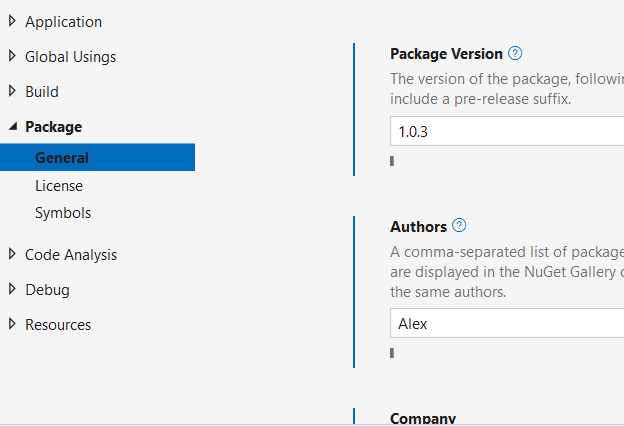

# Створення та використання .NET Class Library.

Для стовреня бібліотеки класів існує відповідний шаблон. 
.NET CLI має хорошу довідкову систему. Щоб отримати довідку для будь-якої команди, додайте -h до команди. Наприклад, dotnet new -h. Щоб отримати більше інформації про створення бібліотеки класів, введіть dotnet new classlib -h. Всі шаблони можно побачити виконавши команду 

```console
dotnet new list
```
В окремій папці з назвою ExplorationOfClassLibraries створимо рішеня і бібліотеку, а потім додамо бібліотеку до рішення.

```console
dotnet new sln
dotnet new classlib -n CarLibrary
dotnet sln add .\CarLibrary
```
Це можна зробити і в VS, але приклад нагадує як це зробити в консолі. Тепер рішеня можна відкрити в VS. Відкриемо рішеня в VS.

При створені бібліотеки із шаблону автогенеруеться клас Class1.cs якій не дуже потрібний його можна видалити.

Дизайн  бібліотеки починємо з додавання enum файлів.

EngineStateEnum.cs
```cs
namespace CarLibrary;
// Represents the state of the engine.
public enum EngineStateEnum
{
    EngineAlive,
    EngineDead
}
```

MusicMediaEnum.cs
```cs
namespace CarLibrary;
// Which type of music player does this car have?
public enum MusicMediaEnum
{
    MusicCd,
    MusicTape,
    MusicRadio,
    MusicMp3
}
```

Додамо абстракний клас автомобіля.

Car.cs
```cs
namespace CarLibrary;

public abstract class Car
{
    public string Name { get; set; } = string.Empty;
    public int CurrentSpeed { get; set; }
    public int MaxSpeed { get; set; }


    protected EngineStateEnum State = EngineStateEnum.EngineAlive;
    protected EngineStateEnum EngineState => State;

    protected Car() { }
    protected Car(string name, int currentSpeed, int maxSpeed)
    {
        Name = name;
        CurrentSpeed = currentSpeed;
        MaxSpeed = maxSpeed;
    }

    public abstract void TurboBoost();
}
```
Цей клас визначає різні дані стану за допомогою автоматичного синтаксису властивостей. Цей клас також має абстрактний метод під назвою TurboBoost(), який є імітацією дуже високого підняття швидкості і використовує  EngineStateEnum для представлення поточного стану двигуна.

Додамо два нащадки цього класу.

SportCar.cs
```cs
namespace CarLibrary;

public class SportCar : Car
{
    public SportCar()
    {
    }
    public SportCar(string name, int currentSpeed, int maxSpeed) : base(name, currentSpeed, maxSpeed)
    {
    }
    public override void TurboBoost()
    {
        Console.WriteLine("Ramming speed! Faster is better...");
    }
}
```

MiniVan.cs
```cs
namespace CarLibrary;

public class MiniVan : Car
{
    public MiniVan()
    {
    }
    public MiniVan(string name, int currentSpeed, int maxSpeed) : base(name, currentSpeed, maxSpeed)
    {
    }
    public override void TurboBoost()
    {
        State = EngineStateEnum.EngineDead;
        Console.WriteLine("Eek! Your engine block exploded!");
    }
}
```

Кожен замінює абстрактний метод TurboBoost(), відображаючи відповідне повідомлення через повідомлення консолі.

Перш ніж використовувати CarLibrary.dll із клієнтської програми, давайте перевіримо, як складено бібліотеку коду під капотом.

Для початку скомпілюєио проект. Build > Build CarLibrary. Далі  в VS Tools> Command Line > Developer Command Prompt. виконайте команду

```console
ildasm /METADATA /out=CarLibrary.il .\CarLibrary\bin\Debug\net8.0\CarLibrary.dll
```

### Mаніфест.

Розділ Manifest розібраних результатів починається з наступного.

```
// Metadata version: v4.0.30319
.assembly extern System.Runtime
{
  .publickeytoken = (B0 3F 5F 7F 11 D5 0A 3A )                         // .?_....:
  .ver 8:0:0:0
}
.assembly extern System.Console
{
  .publickeytoken = (B0 3F 5F 7F 11 D5 0A 3A )                         // .?_....:
  .ver 8:0:0:0
}
```
Одразу далі наведено список усіх зовнішніх збірок, необхідних для бібліотеки класів. Кожен .assembly extern блок кваліфікується директивами .publickeytoken і .ver.Інструкція .publickeytoken присутня, лише якщо для збірки було налаштовано жорстке ім’я.Маркер .ver визначає числовий ідентифікатор версії збірки, на яку посилається.

Після зовнішніх посилань ви знайдете кілька .custom токенів, які ідентифікують атрибути рівня збірки (деякі згенеровані системою, а також інформацію про авторські права, назву компанії, версію збірки тощо). Ці параметри можна встановити або за допомогою сторінок властивостей Visual Studio, або редагуючи файл проекту та додаючи правильні елементи. Щоб змінити властивості пакета у Visual Studio 2022, клацніть правою кнопкою миші проект у Solution Explorer, виберіть Properties і перейдіть до меню Package на лівій панелі вікна.


Ще один спосіб додати метадані до збірки безпосередньо у файлі проекту *.csproj.Наступне оновлення основної групи PropertyGroup у файлі проекту виконує те саме, що й заповнення форми в VS.

```
  <PropertyGroup>
    <TargetFramework>net8.0</TargetFramework>
    <ImplicitUsings>enable</ImplicitUsings>
    <Nullable>enable</Nullable>
    <Copyright>Copyright 2024</Copyright>
    <Authors>Alex</Authors>
    <Company>BigSoft</Company>
    <Product>CarsShop</Product>
    <PackageId>CarLibrary</PackageId>
    <Description>Library for cars.</Description>
    <AssemblyVersion>1.0.0.1</AssemblyVersion>
    <FileVersion>1.0.0.2</FileVersion>
    <Version>1.0.1</Version>
  </PropertyGroup>
```


### CIL

Збірка не містить інструкцій для конкретної платформи; скоріше, віна містить інструкції спільної проміжної мови Common Intermediate Language (CIL), що не залежать від платформи. Коли .NET Runtime завантажує збірку в пам’ять, базовий CIL компілюється (за допомогою компілятора JIT) у інструкції, зрозумілі цільовій платформі. Наприклад, метод TurboBoost() класу SportsCar представлений таким CIL:
```
.method public hidebysig virtual instance void 
          TurboBoost() cil managed
  {
    // Code size       13 (0xd)
    .maxstack  8
    IL_0000:  nop
    IL_0001:  ldstr      "Ramming speed! Faster is better..."
    IL_0006:  call       void [System.Console]System.Console::WriteLine(string)
    IL_000b:  nop
    IL_000c:  ret
  } // end of method SportCar::TurboBoost
```
Тобто CIL це в більшості визначеня конструкцій методів.
Більшості розробників .NET не потрібно глибоко турбуватися про деталі.

### Метадані.

Ось як виглядають метадані TypeDef для EngineStateEnum:

```
// TypeDef #2 (02000003)
// -------------------------------------------------------
// 	TypDefName: CarLibrary.EngineStateEnum  (02000003)
// 	Flags     : [Public] [AutoLayout] [Class] [Sealed] [AnsiClass]  (00000101)
// 	Extends   : 01000013 [TypeRef] System.Enum
// 	Field #1 (04000005)
// 	-------------------------------------------------------
// 		Field Name: value__ (04000005)
// 		Flags     : [Public] [SpecialName] [RTSpecialName]  (00000606)
// 		CallCnvntn: [FIELD]
// 		Field type:  I4
// 
// 	Field #2 (04000006)
// 	-------------------------------------------------------
// 		Field Name: EngineAlive (04000006)
// 		Flags     : [Public] [Static] [Literal] [HasDefault]  (00008056)
// 	DefltValue: (I4) 0
// 		CallCnvntn: [FIELD]
// 		Field type:  ValueClass CarLibrary.EngineStateEnum
// 
// 	Field #3 (04000007)
// 	-------------------------------------------------------
// 		Field Name: EngineDead (04000007)
// 		Flags     : [Public] [Static] [Literal] [HasDefault]  (00008056)
// 	DefltValue: (I4) 1
// 		CallCnvntn: [FIELD]
// 		Field type:  ValueClass CarLibrary.EngineStateEnum
```
Тобто в метаданих зберігаються ваші визеачення типів.

## Створення клієнтського додатку який використовує бібліотеку.

Оскільки кожен тип проекту CarLibrary було оголошено за допомогою ключового слова public, інші програми .NET також можуть використовувати їх. Також можна визначати типи за допомогою internal ключового слова C# (фактично, це стандартний режим доступу C# для класів). Такі типи можуть використовуватися лише збіркою, у якій вони визначені. Зовнішні клієнти не можуть ні бачити, ні створювати типи, позначені ключовим словом internal.

Відкрижмо командний рядок. Меню VS Tools> Command Line > Developer Command Prompt.

Створити кліенський проект можна виконавши команди
```console
dotnet new console -n CarClient
```
Додамо проект до рішення
```console
dotnet sln add .\CarClient
```

Додати посилання проекту на бібліотеку можна командою
```console
dotnet add CarClient reference Carlibrary
```
Команда add reference створює посилання на проект.Це зручно для розробки, оскільки CarClient завжди використовуватиме останню версію CarLibrary.


Якщо у вас все ще відкрито рішення у Visual Studio, ви помітите, що новий проект відображається в Solution Explorer без будь-якого втручання з вашого боку.Остання зміна — клацнути правою кнопкою миші CarClient у провіднику рішень і вибрати «Set as Startup Project».

Ви також можете встановити посилання на проект у Visual Studio, клацнувши правою кнопкою миші проект CarClient у Solution Explorer, вибравши Add ➤ Project reference та вибравши проект CarLibrary у вузлі проекту.

Тепер можна створювати свою клієнтську програму для використання зовнішніх типів. 

```cs

using CarLibrary;

void TestDrive()
{
    SportCar sportCar = new SportCar("MyBird", 100, 200);
    sportCar.TurboBoost();

    MiniVan miniVan = new();
    miniVan.TurboBoost();
}
TestDrive();
```
```
Ramming speed! Faster is better...
Eek! Your engine block exploded!
```
Клієнтська програма тепер використовує типи, визначені в окремій користувацькій бібліотеці. Коли створюється посилання на проект, порядок збірки рішення коригується так, що залежні проекти (у цьому прикладі CarLibrary) будуються спочатку, а потім вихідні дані з цієї збірки копіюються в вихідний каталог батьківського проекту (CarClient). Скомпільована клієнтська бібліотека посилається на скомпільовану бібліотеку класів. Під час перебудови клієнтського проекту змінюється і залежна бібліотека, а нова версія знову копіюється до цільової папки.
Якщо ви використовуєте Visual Studio, ви можете натиснути кнопку «Show All Files» в Solution Explorer, і ви зможете побачити всі вихідні файли та переконатися, що скомпільована CarLibrary є там. Якщо ви використовуєте Visual Studio Code, перейдіть до каталогу bin/debug/netX.0 на вкладці Explorer.

Коли робиться пряме посилання замість посилання на проект, скомпільована бібліотека також копіюється до вихідного каталогу клієнтської бібліотеки, але під час створення посилання.Без посилання на проект проекти можна створювати незалежно один від одного, і файли можуть не синхронізуватися. Коротше кажучи, якщо ви розробляєте залежні бібліотеки (як це зазвичай буває у реальних проектах програмного забезпечення), найкраще посилатися на проект, а не на вихід проекту.

## Відкриття внутрішніх типів іншим збіркам

Внутрішні класи видимі лише для інших об’єктів у збірці, де вони визначені. Винятком є випадки, коли видимість явно надається іншому проекту.
Навіщо взагалі викривати внутрішні типи? Зазвичай це робиться для модульного та інтеграційного тестування. Розробники хочуть мати можливість перевірити свій код, але не обов’язково виносити його за межі збірки.
Це можна виконати використавши аттрібути.
InternalCar.cs
```cs

namespace CarLibrary;

internal class InternalCar : Car
{
    public override void TurboBoost()
    {
        Console.WriteLine("The car is driving");
    }
}


```
Car.cs
```cs
using System.Runtime.CompilerServices;
[assembly: InternalsVisibleTo("CarClient")]
namespace CarLibrary;

//...

```
Тепер можна спробувати використати внутрішній клас для клієнського додадту.

```cs
void TestDrive()
{
    SportCar sportCar = new SportCar("MyBird", 100, 200);
    sportCar.TurboBoost();

    MiniVan miniVan = new();
    miniVan.TurboBoost();

    InternalCar internalCar = new();
    internalCar.TurboBoost();
}
TestDrive();
```
```
Ramming speed! Faster is better...
Eek! Your engine block exploded!
The car is driving!
```
Інший спосіб досягти того ж — використовувати оновлені можливості у файлі проекту.NET.
```
<ItemGroup>
  <AssemblyAttribute Include='System.Runtime.CompilerServices.InternalsVisibleToAttribute'>
    <_Parameter1>CarClient</_Parameter1>
  </AssemblyAttribute>
</ItemGroup>
```
Це досягає того ж самого, що й використання атрибута в класі і це краще рішення, оскільки інші розробники бачитимуть його прямо у файлі проекту замість того, щоб знати, де шукати в проекті.

# NuGet

NuGet — це менеджер пакетів для .NET. Це механізм спільного використання програмного забезпечення у форматі, який розуміють програми .NET, і є механізмом за замовчуванням для завантаження .NET і пов’язаних її частинами (ASP.NET Core, EF Core тощо). Багато організацій упаковують свої стандартні збірки для наскрізних проблем (наприклад, logging та звітування про помилки) у пакети NuGet для використання у своїх бізнес-додатках.

## Пакувальні збірки за допомогою NuGet

Щоб побачити це в дії, ми перетворимо CarLibrary на пакет NuGet, а потім посилатимемося на нього з клієнтської програми.
Доступ до властивостей пакету можна отримати із сторінки властивості пакету. Кляцьніть правою кнопкою миші на проект CarLibrary та виберіть Properties(Alt+Enter). В розділі Package перегляньте значення які були введені раніше щоб налаштувати збірку. Існують додадкові властивості, які можна встановити для пакета NuGet, наприклад, прийняття ліцензійної угоди та інформація про проект, як-от URL-адреса та розташування сховища. Усі значення в інтерфейсі користувача сторінки пакета Visual Studio можна ввести у файл проекту вручну, але вам потрібно знати ключові слова. Це допоможе використати Visual Studio принаймні один раз, щоб заповнити все, а потім ви можете редагувати файл проекту вручну. 
У цьому прикладі ми не будемо заповнювати додадкові властивості збірки.
Встановемо прапорець "Generate NuGet package on build", що те саме що додавання в файл проекту рядка.
```
  <PropertyGroup>
    ...
    <GeneratePackageOnBuild>True</GeneratePackageOnBuild>
  </PropertyGroup>
``` 
Це вказує, що пакет буде перезбиратися щоразу, коли буде будуватися(build) збірка. За замовчуванням пакет буде створено в папці bin/Debug або bin/Release, залежно від вибраної конфігурації. Цю конфігурацію можна змінити Build > Configuration Manager. 
Пакети можна cтворювати з командного рядка, а CLI надає більше можливостей, ніж VS. Наприклад, щоб створити пакет і розмістити його в каталозі під назвою Publish, введіть наступні команди (у каталозі проекту CarLibrary).
```console
dotnet build -c Release
dotnet pack -o .\Publish -c Release
```
Перша команда створює збірку друга створює пакет NuGet. Тепер в каталозі .\CarLibrary\Publish можна побачити файл CarLibrary.1.0.3.nupkg. Щоб переглянути його вміст, відкрийте файл за допомогою будь-якої утиліти для zip (наприклад, 7-Zip), і ви побачите весь вміст, який включає збірку, а також додаткові метадані.

## Посилання на пакети NuGet.

Вам може бути цікаво, звідки взялися пакунки, додані в попередніх прикладах. Розташування пакетів NuGet контролюється файлом на основі XML під назвою NuGet.Config. У Windows цей файл знаходиться в каталозі %appdata%\NuGet. Це основний файл. Відкрийте його, і ви побачите кілька джерел пакетів.

```xml
<?xml version="1.0" encoding="utf-8"?>
<configuration>
  <packageSources>
    <add key="nuget.org" value="https://api.nuget.org/v3/index.json" protocolVersion="3" />
  </packageSources>
</configuration>
```
Тут показано джерело шо вказує на nuget.org, який є найбільшим репозиторієм пакетів NuGet у світі. Важливо зауважити, що файли NuGet.Config є адитивними за замовчуванням. Щоб додати додаткові джерела без зміни списку для всієї системи, ви можете додати додаткові файли NuGet.Config. Кожен файл дійсний для каталогу, у якому його розміщено, а також для будь-якого підкаталогу.

В каталозі рішеня додамо файл NuGet.Config.
```xml
<?xml version="1.0" encoding="utf-8"?>
<configuration>
  <packageSources>
    <add key="local-packages" value=".\CarLibrary\Publish" />
  </packageSources>
</configuration>
```
Також можете скинути список пакунків, додавши <clear/> у вузол <packageSources>
```xml
<?xml version="1.0" encoding="utf-8"?>
<configuration>
  <packageSources>
    <clear/>
    <add key="nuget.org" value="https://api.nuget.org/v3/index.json" protocolVersion="3" />
  </packageSources>
</configuration>
```
Якщо ви використовуєте Visual Studio, вам доведеться перезапустити IDE, перш ніж оновлені налаштування nuget.config набудуть чинності.

Протестуємо створені пакунки. 

Для початку видалемо посилання на бібліотеку з додадку CarClient. В папці проекту
```console
dotnet remove reference ..\Carlibrary\CarLibrary.csproj
```
В папці проекту додамо пакет до проекту

```console
dotnet add package CarLibrary
```
Після встановлення посилань створіть рішення та перегляньте вихідні дані в цільових каталогах (bin\Debug\newX.0), і ви побачите в каталозі CarLibrary.dll, а не файл CarLibrary.nupkg. Це пояснюється тим, що .NET розпаковує вміст і додає збірки, які містяться як прямі посилання. Запустіть програму, і вона працюватиме так само, як і раніше.

Після цього змінемо бібліотеку якимось чином і її версію.
```xml
  <PropertyGroup>

    ...
    <AssemblyVersion>1.0.0.1</AssemblyVersion>
    <FileVersion>1.0.0.3</FileVersion>
    <Version>1.0.4</Version>
    <GeneratePackageOnBuild>True</GeneratePackageOnBuild>
  </PropertyGroup>
```

Після цього перепакуємо пакет.
```console
dotnet build -c Release
dotnet pack -o .\Publish -c Release
```
У каталозі Publish тепер є два пакети CarLibrary NuGet.

Для того аби в клієнській програмі оновилиь данні терба виклнати команду додавання пакету.
```console
dotnet add CarClient package CarLibrary
```
Якщо надано перевагу старішій версії, команда add package дозволяє додавати номери версій для певного пакета.
