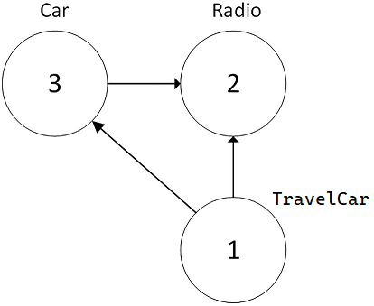

# Серіалізація об'єктів

Термін серіалізація описує процес збереження (і, можливо, передачі) стану об’єкта в потік (наприклад, потік файлів або потік пам’яті). Збережена послідовність даних містить усю необхідну інформацію, необхідну для реконструкції або десеріалізації публічного стану об’єкта для подальшого використання. У багатьох випадках збереження даних програми за допомогою служб серіалізації призводить до зменшення коду, ніж використання readers/writers, які ви знайдете в просторі імен System.IO.
Наприклад, припустімо, що ви хочете створити програму на основі графічного інтерфейсу користувача, яка надає можливість кінцевим користувачам зберігати свої налаштування (наприклад, колір вікна та розмір шрифту). Для цього ви можете визначити клас під назвою UserPrefs, який інкапсулює близько 20 фрагментів даних поля. Тепер, якщо ви використовуєте тип System.IO.BinaryWriter, вам потрібно буде зберегти кожне поле об’єкта UserPrefs вручну. Так само, якби ви мали завантажити дані з файлу назад у пам’ять, вам потрібно було б використати System.IO.BinaryReader і вручну прочитати кожне значення, щоб повторно налаштувати новий об’єкт UserPrefs.
Це все можливо, але ви можете заощадити час, використовуючи або eXtensible Markup Language (XML), або JavaScript Object Notation (JSON) серіалізацію. Кожен із цих форматів дає змогу представляти публічний стан об’єкта в одному блоці тексту, який можна використовувати на різних платформах і мовах програмування. Це означає, що ви можете зберегти весь відкритий стан об’єкта лише за допомогою кількох рядків коду.
Серіалізація об’єктів .NET полегшує збереження об’єктів; однак процеси, які використовуються за лаштунками, досить складні. Наприклад, коли об’єкт зберігається в потоці, усі пов’язані загальнодоступні дані (наприклад, дані базового класу та об’єкти, що містяться) також автоматично серіалізуються. Таким чином, якщо ви намагаєтеся зберегти похідний клас, усі загальнодоступні дані вгору в ланцюжку успадкування також будуть в роботі. Використовується граф об’єктів для представлення набору взаємопов’язаних об’єктів. 
Можна зберегти граф об’єктів у будь-якому типі, похідному від System.IO.Stream. Важливо лише те, що послідовність даних правильно відображає стан об’єктів на графі.

## Граф об'єктів.

Як згадувалося раніше, середовище виконання .NET враховуватиме всі пов’язані об’єкти, щоб гарантувати правильне збереження публічних даних під час серіалізації об’єкта. Цей набір пов’язаних об’єктів називається графом об’єктів. Граф об’єктів надають простий спосіб задокументувати, як набір елементів відноситься один до одного. Графи об’єктів не позначають зв’язки OOP is-a або has-a. Навпаки, ви можете читати стрілки на діаграмі об’єктів як «вимагає» або «залежить від».

Кожному об’єкту в графі об’єктів присвоюється унікальне числове значення. Майте на увазі, що номери, призначені членам у графі об’єктів, є довільними та не мають реального значення для зовнішнього світу. Після призначення всім об’єктам числового значення граф об’єктів може записати набір залежностей кожного об’єкта.

Наприклад, припустімо, що ви створили набір класів, які моделюють деякі автомобілі. У вас є базовий клас під назвою Car, який має радіо. Інший клас під назвою TravelCar розширює базовий тип Car. На малюнку показано можливий граф об’єктів, який моделює ці зв’язки.




Дивлячись на граф об’єктів, ви можете використовувати фразу залежить від або посилається на, з’єднуючи стрілки. Таким чином, на малюнку ви можете побачити, що автомобіль відноситься до класу радіо (враховуючи зв’язок has-a). TravelCar посилається на Car (враховуючи зв’язок is-a), а також на Radio (воно успадковує цю захищену змінну-член).

Звичайно, CLR не малює картинки в пам'яті для представлення графа пов'язаних об'єктів. Натомість зв’язок, задокументований на малюнку, представлений математичною формулою, яка виглядає приблизно так:

[Car 3, ref 2], [Radio 2], [TravelCar 1, ref 3, ref 2]

Якщо проаналізувати цю формулу, то можна побачити, що об’єкт 3 (Car) має залежність від об’єкта 2 (Radio). Об'єкт 2, Radio, є вовком-одинаком і йому нікого не потрібно. Об’єкт 1 (TravelCar) має залежність від об’єкта 3, а також від об’єкта 2. У будь-якому випадку, коли ви серіалізуєте або десеріалізуєте екземпляр TravelCar, граф об’єктів гарантує, що типи Radio та Car також беруть участь у процесі.

Прекрасна річ у процесі серіалізації полягає в тому, що графік, який представляє зв’язки між вашими об’єктами, автоматично встановлюється за лаштунками. Однак, ви можете взяти більшу участь у побудові даного графа об’єктів, налаштувавши процес серіалізації за допомогою атрибутів.

Ствоимо додаток та типи для подальшого розгляду.

SimpleSerialization\Radio.cs
```cs
    internal class Radio
    {
        public string RadioId = "Sony-236";
        public bool HasTweeters;
        public bool HasSubWoofers;
        public List<double>? StationsPresets { get; set; }

        public override string? ToString()
        {
            string? presets = StationsPresets == null ? "" : string.Join(", ", 
                StationsPresets.Select(i => i.ToString()).ToList());

            return $"RadioId: {RadioId}\t" +
                $"HasTweeters: {HasTweeters}\t" +
                $"HasSubWoofers:{HasSubWoofers}\t" +
                $"Station Presets:{presets}";
        }
    }
```

SimpleSerialization\Car.cs
```cs
    internal class Car
    {
        public bool IsHatchBack;
        public Radio Radio = new();

        public override string? ToString()
        {
            return $"HatchBack:{IsHatchBack}\t {Radio}";
        }
    }
```

SimpleSerialization\TravelCar.cs
```cs
    internal class TravelCar : Car
    {
        public bool CanFly;
        public bool CanSubmerge;

        public override string? ToString()
        {
            return $"CanFly:{CanFly}\tCanSubmerge:{CanSubmerge}\t{base.ToString()}";
        }
    }
```
SimpleSerialization\Person.cs
```cs
    internal class Person
    {
        // public
        public bool IsAlive = true;
        // private
        private int Age = 21;

        // full property
        private string firstName = string.Empty;
        public string FirstName { get => firstName; set => firstName = value; }

        public override string? ToString()
        {
            return $"IsAlive:{IsAlive}\tFirstName:{FirstName}\tAge:{Age}";
        }
    }
```

Створемо об'єкти класів.

SimpleSerialization\Program.cs
```cs
// Create objects for serialize.

Radio? radio = new Radio 
{
    StationPresets = [89.3, 105.1, 97.1],
    HasTweeters  =true
};

TravelCar trevelCar = new()
{
    CanFly = true,
    CanSubmerge = false,
    Radio = new()
    {
        HasTweeters = true,
        StationPresets = new() { 89.3, 105.1, 97.1 }
    }
};

List<TravelCar> myCars = new()
{
    new TravelCar() { CanFly = true, CanSubmerge = true, Radio = radio },
    new TravelCar() { CanFly = true, CanSubmerge = false, Radio = radio },
    new TravelCar() { CanFly = false, CanSubmerge = false, Radio = radio },
};

Person person = new()
{
    FirstName = "James",
    IsAlive = true
    
};
```
Перевіремо.
```cs
void TestCreatedObject()
{
    Console.WriteLine(radio);
    Console.WriteLine();
    Console.WriteLine(trevelCar);
    Console.WriteLine();

    foreach (var item in myCars)
    {
        Console.WriteLine(item);
    }
}
TestCreatedObject();
```
```
RadioId: Sony-236       HasTweeters: True       HasSubWoofers:False     Station Presets:89,3, 105,1, 97,1

CanFly:True     CanSubmerge:False       HatchBack:False  RadioId: Sony-236      HasTweeters: True       HasSubWoofers:False     Station Presets:89,3, 105,1, 97,1

CanFly:True     CanSubmerge:True        HatchBack:False  RadioId: Sony-236      HasTweeters: True       HasSubWoofers:False     Station Presets:89,3, 105,1, 97,1
CanFly:True     CanSubmerge:False       HatchBack:False  RadioId: Sony-236      HasTweeters: True       HasSubWoofers:False     Station Presets:89,3, 105,1, 97,1
CanFly:False    CanSubmerge:False       HatchBack:False  RadioId: Sony-236      HasTweeters: True       HasSubWoofers:False     Station Presets:89,3, 105,1, 97,1
```

Таким чином у нас є матеріал для серіалізації.


# Серіалізація з використанням XML

## Extensible Markup Language (XML) (розширювана мова розмітки)

Однією з початкових цілей XML було представлення об’єкта або набору об’єктів у форматі, який читається людиною та машиною. Документ XML – це один файл, який містить елементи які серіалізовани за стандартом.
Наприклад, клас Person можна представити в XML, як показано в наступному прикладі.
```xml
<?xml version='1.0'?>
<Person xmlns:xsi='http://www.w3.org/2001/XMLSchema-instance'
     xmlns:xsd='http://www.w3.org/2001/XMLSchema'>
  <IsAlive>true</IsAlive>
  <FirstName>James</FirstName>
</Person>
```
Щоб відповідати стандарту (та бути придатним для використання програмними системами, які підтримують XML), документ відкривається XML-декларацією, що визначає версію та, за бажанням, кодування. Наступний рядок є кореневим елементом і містить простори імен XML. Усі дані містяться між відкриваючим і закриваючим тегами для кореневого елемента. В прикладі ви можете побачити XML-декларацію та кореневий елемент (Person), а також додаткову розмітку для властивостей. За бажанням властивості можуть бути представлені за допомогою атрибутів. 

Якщо у вас є список об’єктів, наприклад список об’єктів TravelCar, структура така сама. У наступному прикладі кореневим елементом є не TravelCar, а масив. Тоді кожен TravelCar у масиві міститься в кореневому елементі. У наступному прикладі показано синтаксис атрибутів для властивостей CanFly і CanSubmerge:

```xml
<ArrayOfTravelCar xmlns:xsi="http://www.w3.org/2001/XMLSchema-instance" xmlns:xsd="http://www.w3.org/2001/XMLSchema">
<TravelCar CanFly="true" CanSubmerge="true">
<IsHatchBack xmlns="http://www.MyCompany.com">false</IsHatchBack>
<Radio xmlns="http://www.MyCompany.com">
<RadioId>Sony-236</RadioId>
<HasTweeters>true</HasTweeters>
<HasSubWoofers>false</HasSubWoofers>
<StationPresets>
<double>89.3</double>
<double>105.1</double>
<double>97.1</double>
</StationPresets>
</Radio>
</TravelCar>
<TravelCar CanFly="true" CanSubmerge="false">
<IsHatchBack xmlns="http://www.MyCompany.com">false</IsHatchBack>
<Radio xmlns="http://www.MyCompany.com">
<RadioId>Sony-236</RadioId>
<HasTweeters>true</HasTweeters>
<HasSubWoofers>false</HasSubWoofers>
<StationPresets>
<double>89.3</double>
<double>105.1</double>
<double>97.1</double>
</StationPresets>
</Radio>
</TravelCar>
<TravelCar CanFly="false" CanSubmerge="false">
<IsHatchBack xmlns="http://www.MyCompany.com">false</IsHatchBack>
<Radio xmlns="http://www.MyCompany.com">
<RadioId>Sony-236</RadioId>
<HasTweeters>true</HasTweeters>
<HasSubWoofers>false</HasSubWoofers>
<StationPresets>
<double>89.3</double>
<double>105.1</double>
<double>97.1</double>
</StationPresets>
</Radio>
</TravelCar>
</ArrayOfTravelCar>
```
# Серіалізація та десеріалізація за допомогою XmlSerializer. 

Простір імен System.Xml надає System.Xml.Serialization.XmlSerializer. Ви можете використовувати цей засіб форматування, щоб зберегти публічний стан певного об’єкта як чистий XML. Зауважте, що XmlSerializer вимагає від вас оголосити тип, який буде серіалізовано або десеріалізовано.

Часто дуже важливо переконатися, що дані в XML-документі відповідають набору правил, які встановлюють достовірність даних. Валідний документ XML не має нічого спільного з синтаксичним благополуччям елементів XML (наприклад, усі елементи, що відкриваються, повинні мати елемент, що закриває). Натомість дійсні документи відповідають узгодженим правилам форматування (наприклад, поле X має бути виражено як атрибут, а не піделемент), які зазвичай визначаються схемою XML або файлом визначення типу документа (DTD).

За замовчуванням XmlSerializer серіалізує всі публічні поля/властивості як елементи XML, а не як атрибути XML. Якщо ви хочете керувати тим, як XmlSerializer генерує кінцевий документ XML, ви можете прикрасити типи будь-якою кількістю додаткових атрибутів .NET із простору імен System.Xml.Serialization. Таблиця описує деякі атрибути .NET, які впливають на те, як дані XML кодуються в потік.

Виберіть атрибути простору імен System.Xml.Serialization

    [XmlAttribute] : Ви можете використовувати цей атрибут .NET у загальнодоступному полі чи властивості в класі, щоб наказати XmlSerializer серіалізувати дані як атрибут XML (а не як піделемент).

    [XmlElement] : Поле або властивість буде серіалізовано як XML-елемент із назвою, яку ви виберете.

    [XmlEnum] : Цей атрибут надає назву елемента члена переліку.

    [XmlRoot] : Цей атрибут керує тим, як буде створено кореневий елемент (простір імен і ім’я елемента).

    [XmlText] : Властивість або поле буде серіалізовано як XML-текст (тобто вміст між початковим і кінцевим тегами кореневого елемента).

    [XmlType] : Цей атрибут надає назву та простір імен типу XML. 

Звичайно, ви можете використовувати багато інших атрибутів .NET, щоб керувати тим, як XmlSerializer генерує кінцевий документ XML. Щоб отримати повну інформацію, знайдіть простір імен System.Xml.Serialization у документації .NET.

XmlSerializer вимагає, щоб усі серіалізовані типи в графі об’єктів підтримували конструктор за замовчуванням (тому обов’язково додайте його, якщо ви визначаєте власні конструктори).

## Серіалізація об’єктів за допомогою XmlSerializer.

Додамо в проект функцію що серіалізує об'єкт в XML.

```cs
void SaveAsXMLFormat<T>(T objGrhaph, string fileName)
{
    //Must declare type in the constructor of the XmlSerializer
    XmlSerializer xmlSerializer = new(typeof(T));

    using Stream fileStream = new FileStream(fileName, FileMode.Create,
        FileAccess.Write,FileShare.None);
   
    xmlSerializer.Serialize(fileStream, objGrhaph);
}


void SerializingObjectsUsingXmlSerializer()
{
    SaveAsXMLFormat(trevelCar, @"D:\Temp\TrevalCar.xml");
    Console.WriteLine("Saved trevalCar in XML document.");

    SaveAsXMLFormat(person, @"D:\Temp\Person.xml");
    Console.WriteLine("Saved person in XML document.");
}
SerializingObjectsUsingXmlSerializer();
```

```
Saved trevalCar in XML document.
Saved person in XML document.
```
```xml
<TravelCar xmlns:xsi="http://www.w3.org/2001/XMLSchema-instance" xmlns:xsd="http://www.w3.org/2001/XMLSchema">
<IsHatchBack>false</IsHatchBack>
<Radio>
<RadioId>Sony-236</RadioId>
<HasTweeters>true</HasTweeters>
<HasSubWoofers>false</HasSubWoofers>
<StationPresets>
<double>89.3</double>
<double>105.1</double>
<double>97.1</double>
</StationPresets>
</Radio>
<CanFly>true</CanFly>
<CanSubmerge>false</CanSubmerge>
</TravelCar>
```

```xml
<Person xmlns:xsi="http://www.w3.org/2001/XMLSchema-instance" xmlns:xsd="http://www.w3.org/2001/XMLSchema">
<IsAlive>true</IsAlive>
<FirstName>James</FirstName>
</Person>
```
Як бачимо приватне поле не серіалізується. Також бачимо при серіалізації типу TrevalCar поля CanFly, CanSubmerge за замовчуванням стають елементами. Це можна змінити. Якщо ви хочете вказати спеціальний простір імен XML, який кваліфікує TravelCar і кодує значення canFly і canSubmerge як атрибути XML замість елементів, ви можете зробити це, змінивши C# визначення TravelCar.

```cs
    [Serializable, XmlRoot(Namespace = "http://www.MyCompany.com")]
    public class TravelCar : Car
    {
        [XmlAnyAttribute]
        public bool CanFly;
        [XmlAnyAttribute]
        public bool CanSubmerge;

        public override string? ToString()
        {
            return $"CanFly:{CanFly}\tCanSubmerge:{CanSubmerge}\t{base.ToString()}";
        }
    }
```
Це дає такий XML файл.
```xml
<TravelCar xmlns:xsi="http://www.w3.org/2001/XMLSchema-instance" xmlns:xsd="http://www.w3.org/2001/XMLSchema" xmlns="http://www.MyCompany.com" CanFly="true" CanSubmerge="false">
<IsHatchBack>false</IsHatchBack>
<Radio>
<RadioId>Sony-236</RadioId>
<HasTweeters>true</HasTweeters>
<HasSubWoofers>false</HasSubWoofers>
<StationPresets>
<double>89.3</double>
<double>105.1</double>
<double>97.1</double>
</StationPresets>
</Radio>
</TravelCar>
```
Як бачимо після змін властивості стали аттрібутами елемента.

### Серіалізація коллекції об’єктів.

Серіалізація колекцій працює таким же чином.

```cs
void SerializingCollectionsOfObjects()
{
    SaveAsXMLFormat(myCars, @"D:\Temp\CarCollection.xml");
    Console.WriteLine("Saved list of cars in XML document.");
}
SerializingCollectionsOfObjects();
```
Згенерований XML відповідає прикладу, показаному на початку цього розділу, з ArrayOfTravelCar як кореневим елементом.

## Десеріалізація об'єктів і колекцій об'єктів.

Десеріалізація XML є прямою протилежністю серіалізації об’єктів і колекцій об’єктів.

Створемо функцію считтуванюя з файлу

```cs
static T? ReadAsXmlFormat<T>(string fileName)
{
    // Create a typed instance of the XmlSerializer
    XmlSerializer xmlSerializer = new XmlSerializer(typeof(T));

    using Stream fileStream = new FileStream(fileName, FileMode.Open);

    object? obj = xmlSerializer.Deserialize(fileStream);

    if (obj == null) return default(T);
    else return (T) obj;
}
```
Зауважте, що тип, який потрібно десеріалізувати, має бути переданий у конструктор для XmlSerializer:

Використаємо функцію для отриманя об'єктів в пам'яті.
```cs
void DeserializingObjectsAndCollectionsOfObjects()
{
    Console.WriteLine("DeserializingObject\n");
    TravelCar? travelCar = ReadAsXmlFormat<TravelCar>(@"D:\Temp\TrevalCar.xml");

    Console.WriteLine(travelCar);

    Console.WriteLine("\nDeserializingCollectionsOfObjects\n");
    List<TravelCar>? savedCars = ReadAsXmlFormat<List<TravelCar>>(@"D:\Temp\CarCollection.xml");

    if (savedCars == null) return;

    foreach (var car in savedCars)
    {
        Console.WriteLine(car);
    }
}
DeserializingObjectsAndCollectionsOfObjects();
```
```
DeserializingObject

CanFly:True     CanSubmerge:False       HatchBack:False  RadioId: Sony-236      HasTweeters: True       HasSubWoofers:False     Station Presets:89,3, 105,1, 97,1

DeserializingCollectionsOfObjects

CanFly:True     CanSubmerge:True        HatchBack:False  RadioId: Sony-236      HasTweeters: True       HasSubWoofers:False     Station Presets:89,3, 105,1, 97,1
CanFly:True     CanSubmerge:False       HatchBack:False  RadioId: Sony-236      HasTweeters: True       HasSubWoofers:False     Station Presets:89,3, 105,1, 97,1
CanFly:False    CanSubmerge:False       HatchBack:False  RadioId: Sony-236      HasTweeters: True       HasSubWoofers:False     Station Presets:89,3, 105,1, 97,1
```
Серіалізація XML використовується не лише для зберігання та отримання даних, як показано в цих прикладах, але також для надсилання даних між системами, особливо системами, розробленими з різними стеками технологій. Усі сучасні мови програмування (і багато постачальників баз даних) мають вбудовану підтримку XML.

# Серіалізація з використанням JavaScript Object Notation (JSON).

Хоча серіалізація XML все ще широко використовується, вона значною мірою відійшла на другий план у системах, які використовують JSON для спільного використання, збереження та/або завантаження даних. JSON, як і XML, є текстовим представленням об’єкта (або графіка об’єкта), сумісним із різними платформами та дотримується відкритого стандарту. Системи, побудовані з широким діапазоном мов і інструментів, мають вбудовану підтримку JSON. Об’єкти в документах JSON розроблено з використанням пар ім’я-значення. Властивості укладени у фігурні дужки ({}). Наприклад, екземпляр Person після серіалізації в JSON створює такий документ.

{
  'firstName': 'James',
  'isAlive': true
}

Зверніть увагу на деякі ключові відмінності між представленням JSON і XML того самого екземпляра з попереднього розділу. Немає оголошення чи кореневого імені, лише властивості серіалізованого об’єкта. Це призводить до значно меншого обсягу тексту, що робить його ефективнішим форматом. Відправник може назвати клас Person, тоді як одержувач може назвати клас Human. Поки властивості збігаються, JSON буде правильно застосовано до об’єкта.

Списки об’єктів зберігаються у вигляді масивів JavaScript із використанням квадратних дужок ([]). Нижче наведено список, що містить два об’єкти TravelCar.

```json
[
  {
    'CanFly': true,
    'CanSubmerge': true,
    'TheRadio': {
      'StationPresets': ['89.3', '105.1', '97.1'],
      'HasTweeters': true,
      'HasSubWoofers': false,
      'RadioId': 'XF-552RR6'
    },
    'IsHatchBack': false
  },
  {
    'CanFly': true,
    'CanSubmerge': false,
    'TheRadio': {
      'StationPresets': ['89.3', '105.1', '97.1'],
      'HasTweeters': true,
      'HasSubWoofers': false,
      'RadioId': 'XF-552RR6'
    },
    'IsHatchBack': false
  }
]
```
Зверніть увагу, що весь файл відкривається та закривається квадратною дужкою, а потім кожен об’єкт у масиві відкривається та закривається фігурною дужкою. Попередні налаштування радіо також є списком, тому вони серіалізовані як масив значень.

## Серіалізація та десеріалізація за допомогою System.Text.Json.

Простір імен System.Text.Json містить System.Text.Json.JsonSerializer. Цей засіб форматування використовується, щоб зберегти публічний стан певного об’єкта як JSON. 

За замовчуванням JsonSerializer серіалізує всі загальнодоступні властивості як пари ім’я-значення JSON, використовуючи ту саму назву і регістр назв властивостей об’єкта. Ви можете контролювати багато аспектів процесу серіалізації за допомогою атрибутів.

Важливі атрибути простору імен System.Text.Json.Serialization

    [JsonIgnore] : Властивість буде проігноровано

    [JsonInclude] : Учасник буде включений

    [JsonPropertyName] : Це вказує назву властивості, яка буде використовуватися під час серіалізації/десеріалізації члена. Це зазвичай використовується для вирішення проблем з регістром символів.

    [JsonConstructor] : Це вказує на конструктор, який слід використовувати під час десеріалізації JSON назад у граф об’єктів.


### Серіалізація об’єктів за допомогою JsonSerializer.

JsonSerializer містить статичні методи Serialize, які використовуються для перетворення об’єктів .NET (включаючи графіки об’єктів) у рядкове представлення загальнодоступних властивостей. Дані представлені як пари ім’я-значення в нотації об’єктів JavaScript. Cтворемо функцію для форматування. 

```cs
static void SaveAsJSONFormat<T>(T objGrhaph, string fileName)
{
    File.WriteAllText(
        fileName,
        System.Text.Json.JsonSerializer.Serialize(objGrhaph)
        );
}
```
Спробуємо використати до тих самих об'єктів.

```cs
void SerializingObjectsUsingJsonSerializer()
{
    SaveAsJSONFormat(trevelCar, @"D:\Temp\TrevalCar.json");
    Console.WriteLine("Saved trevalCar in JSON document.");

    SaveAsJSONFormat(person, @"D:\Temp\Person.json");
    Console.WriteLine("Saved person in JSON document.");
}
SerializingObjectsUsingJsonSerializer();
```
TrevalCar.json
```
{}
```
Person.json
```
{"FirstName":"James"}
```

Як бачите, файл TrevalCar.json порожній (за винятком пари дужок), а файл Person.json містить лише значення Firstname. Це тому, що JsonSerializer за замовчуванням записує лише загальнодоступні властивості, а не загальнодоступні поля.

Щоб включити загальнодоступні поля до створеного JSON, у вас є два варіанти.

Перший метод полягає у використанні класу JsonSerializerOptions для вказівки JsonSerializer включити всі поля.

```cs
static void SaveAsJSONFormat<T>(T objGrhaph, string fileName)
{
    var options = new JsonSerializerOptions()
    {
        IncludeFields = true,
    };

    File.WriteAllText(
        fileName,
        System.Text.Json.JsonSerializer.Serialize(objGrhaph,options)
        );
}
```
TrevalCar.json
```
{"CanFly":true,"CanSubmerge":false,"IsHatchBack":false,"Radio":{"StationPresets":[89.3,105.1,97.1],"RadioId":"Sony-236","HasTweeters":true,"HasSubWoofers":false}}
```
Person.json
```
{"FirstName":"James","IsAlive":true}
```
Зауважте, що включатимкться всі публічні поля в графі об’єктів. Щоб виключити певні загальнодоступні поля за допомогою цієї техніки, ви повинні використовувати для них атрибут JsonExclude.


Для другий варіанту, оновіть ваші класи, додавши атрибут [JsonInclude] до кожного загальнодоступного поля, яке має бути включено у вивід JSON. Можна залишити атрибути Xml у класах, і вони не заважатимуть JsonSerializer.

```cs
    public class Car
    {
        [JsonInclude]
        public bool IsHatchBack;
        [JsonInclude]
        public Radio Radio = new();
        ...
    }
```
```cs
    public class TravelCar : Car
    {
        [XmlAttribute]
        [JsonInclude]
        public bool CanFly;
        [XmlAttribute]
        [JsonInclude]
        public bool CanSubmerge;
        ...
    }
```
```cs
    public class Radio
    {
        [JsonInclude]
        public string RadioId = "Sony-236";
        [JsonInclude]
        public bool HasTweeters;
        [JsonInclude]
        public bool HasSubWoofers;
        public List<double>? StationPresets { get; set; }
        ...
    }
```

```cs
    public class Person
    {
        // public
        [JsonInclude]
        public bool IsAlive = true;
        ...
    }    
```
Тепер, коли ви запускаєте код за допомогою будь-якого методу, усі загальнодоступні властивості та поля записуються у файл. Однак, перевіривши вміст, ви побачите, що JSON написаний мінімізовано. Зменшений – це формат, у якому видалено всі незначні пробіли та розриви рядків. Це формат за замовчуванням, головним чином завдяки широкому використанню JSON служб RESTful і зменшенню розміру пакета даних під час надсилання інформації між службами через HTTP/HTTPS.

Обробка поля для серіалізації JSON така сама, як і десеріалізація JSON. Якщо ви вибрали опцію включення полів під час серіалізації JSON, ви також повинні включити цю опцію під час десеріалізації JSON.

### Більш читабільний формат JSON файлу.

На додаток до можливості включати загальнодоступні поля, JsonSerializer можна наказати записувати JSON з відступом (та для читання людиною).

```cs
static void SaveAsJSONFormat<T>(T objGrhaph, string fileName)
{
    var options = new JsonSerializerOptions()
    {
        IncludeFields = true,
        WriteIndented = true
    };

    File.WriteAllText(
        fileName,
        System.Text.Json.JsonSerializer.Serialize(objGrhaph, options)
        );
}
```
Результат стає набагато читабельнішим.

```json
{
  "CanFly": true,
  "CanSubmerge": false,
  "IsHatchBack": false,
  "Radio": {
    "StationPresets": [
      89.3,
      105.1,
      97.1
    ],
    "RadioId": "Sony-236",
    "HasTweeters": true,
    "HasSubWoofers": false
  }
}
```

### PascalCase та camelCase JSON.

PascalCase — це формат, у якому використовується перший символ із великої літери, а також кожна значуща частина назви з великої літери. СamelCase, з іншого боку, встановлює перший символ у нижньому регістрі (як слово camelCase у заголовку цього розділу), а потім кожна значна частина назви починається з великої літери. Візьміть попередній список JSON. PascalCase версія попереднього прикладу – CanSubmerge. canSubmerge є прикладом camelCase.  
Чому це має значення? Це важливо, оскільки більшість популярних мов чутливі до регістру (наприклад, C#). Це означає, що CanSubmerge та canSubmerge — це два різні елементи. Загальноприйнятим стандартом іменування публічних речей у C# (класів, загальнодоступних властивостей, функцій тощо) є використання PascalCase. Однак більшість фреймворків JavaScript віддають перевагу використанню camelCase. Це може бути проблематичним під час використання .NET і C# для передачі даних JSON до/з не-C#/.NET RESTful-служб.
JsonSerializer можна налаштувати для обробки більшості ситуацій, включаючи відмінності в регістрі. Щоб змінити процес серіалізації на використання PascalCase, потрібно встановити для PropertyNamingPolicy значення null.

```cs
static void SaveAsJSONFormat<T>(T objGrhaph, string fileName)
{
    JsonSerializerOptions options = new()
    {
        PropertyNamingPolicy = null,
        IncludeFields = true,
        WriteIndented = true
    };
    ...
}
```
Під час читання JSON C# чутливий до регістру. Налаштування регістру PropertyNamingPolicy використовується під час десеріалізації. Якщо властивість не встановлено, використовується значення за умовчанням camelCase. Якщо встановити для PropertyNamingPolicy регістр Pascal, очікується, що всі вхідні JSON будуть у регістрі Pascal. Якщо налаштування не збігається, процес десеріалізації не вдається. Існує третій варіант під час десеріалізації JSON, і це байдужість до регістру. 

```cs
static void SaveAsJSONFormat<T>(T objGrhaph, string fileName)
{
    JsonSerializerOptions options = new()
    {
        PropertyNameCaseInsensitive = true,
        IncludeFields = true,
    };
}    
```
Коли параметр PropertyNameCaseInsensitive = true, тоді C# десеріалізує canSubmerge так само, як і CanSubmerge.

### Ігнорування циклічних посилань за допомогою JsonSerializer.

System.Text.Json.JsonSerializer, представлений у .NET 6/C# 10, підтримує ігнорування циклічних посилань під час серіалізації графа об’єктів. 

```cs
    JsonSerializerOptions options = new()
    {
        ReferenceHandler = ReferenceHandler.IgnoreCycles,
    };
```
Це робиться шляхом встановлення для ReferenceHandler значення ReferenceHandler.IgnoreCycles у JsonSerializerOptions.

Значення Enum ReferenceHandler 

    IgnoreCycles : Циклічні посилання не серіалізуються, а цикл посилання замінюється на null.

    Preserve : Властивості метаданих будуть враховані під час десеріалізації об’єктів і масивів JSON у посилальні типи та записані під час серіалізації посилальних типів. Це необхідно для створення двостороннього JSON з об’єктів, які містять цикли або повторювані посилання.

### Обробка чисел за допомогою JsonSerializer.

Подивимось як були серіалізовани числа.

```cs
void SerializingRadio()
{
    SaveAsJSONFormat(radio, @"D:\Temp\Radio.json");
    Console.WriteLine("Saved Radio in JSON document.");
}
SerializingRadio();
```
```json
{
  "StationPresets": [
    89.3,
    105.1,
    97.1
  ],
  "RadioId": "Sony-236",
  "HasTweeters": true,
  "HasSubWoofers": false
}
```
Обробка чисел за замовчуванням — Strict, тобто числа будуть серіалізовані як числа (без лапок) і десеріалізовані як числа (без лапок). JsonSerializerOptions має властивість NumberHandling, яка керує читанням і записом чисел.

Значення JsonNumberHandling Enum

    Strict (0) : Числа читаються з чисел і записуються цифрами. Лапки заборонені та не створюються.

    AllowReadingFromString (1) : Числа можна зчитувати з чисел або токенів рядків.

    WriteAsString (2) : Числа записуються як рядки JSON (у лапках).

    AllowNamedFloatingPointLiterals (4) : Маркери рядків Nan, Infinity та -Infinity можна читати, а значення Single та Double будуть записані як відповідні представлення рядків JSON.

Enum має атрибут flags, який дозволяє побітову комбінацію його значень.

```cs
    JsonSerializerOptions options = new()
    {
        NumberHandling = 
        JsonNumberHandling.AllowNamedFloatingPointLiterals 
        | JsonNumberHandling.WriteAsString,
        ...
    }
```
```json
{
  "StationPresets": [
    "89.3",
    "105.1",
    "97.1"
  ],
  "RadioId": "Sony-236",
  "HasTweeters": true,
  "HasSubWoofers": false
}
```
### Впорядкування властивостей.

Атрибут JsonPropertyOrder контролює порядок властивостей під час серіалізації. Чим менше число, тим ранішою є властивість у кінцевому JSON. Властивостям без порядку призначається нульовий порядок за замовчуванням.

```cs
    public class Person
    {
        // public
        [JsonInclude]
        [JsonPropertyOrder(1)]
        public bool IsAlive = true;
        ...

        // full property
        private string firstName = string.Empty;
        [JsonPropertyOrder(-1)]
        public string FirstName { get => firstName; set => firstName = value; }
        ...

    }
```
```json
{
  "FirstName": "James",
  "IsAlive": true
}
```
З цією зміною властивості серіалізуються в порядку FirstName (-1), а потім IsAlive (1). PersonAge не серіалізується, оскільки є приватним. Якщо його оприлюднити, він отримає нульовий порядок за замовчуванням і розміститься між двома іншими властивостями.


### Потокова серіалізація та підтримка IAsyncEnumerable.

System.Text.Json.JsonSerializer підтримує серіалізацію та десеріалізацію асинхронних потоків. 

Для демонстрації потокової серіалізації додамо метод, який повертатиме IAsyncEnumerable<int> та серіалізацію.

```cs
static async IAsyncEnumerable<int> PrintNumbers(int n)
{
    for (int i = 0; i < n; i++)
    {
        yield return i;
    }
}

static async void SerializeAsync()
{
    using Stream stream = Console.OpenStandardOutput();

    var data = new { Data = PrintNumbers(10) };

    await JsonSerializer.SerializeAsync(stream, data);
}

SerializeAsync();
```
```
{"Data":[0,1,2,3,4,5,6,7,8,9]}
```

### Потокова десеріалізація

Існує новий API для підтримки потокової десеріалізації DeserializeAsyncEnumerable<T>().

```cs
async static void DeserializeAsync()
{
    var strem = new MemoryStream(System.Text.Encoding.UTF8.GetBytes("[0,1,2,3,4]"));

    await foreach (var item in JsonSerializer.DeserializeAsyncEnumerable<int>(strem))
    {
        Console.WriteLine(item);
    }
}

DeserializeAsync();
```
```
0
1
2
3
4

```
Створюється новий MemoryStream і потім десеріалізує з потоку.

### Проблеми продуктивності при використанні JsonSerializerOptions.

Використовуючи JsonSerializerOption, найкраще створити один екземпляр і повторно використовувати його у своїй програмі. Тобто створеня обєкта опцій треба зробити, наприклад, призапуску і віділити від процесу серіалізації і десеріалізації.

```cs
JsonSerializerOptions globalOptions = new()
{
    ReferenceHandler = ReferenceHandler.IgnoreCycles,
    PropertyNameCaseInsensitive = true,
    PropertyNamingPolicy = null,
    IncludeFields = true,
    WriteIndented = true
};

static void SaveAsJson<T>(JsonSerializerOptions options,T objGraph, string fileName)
{
    File.WriteAllText(
    fileName,
    System.Text.Json.JsonSerializer.Serialize(objGraph, options)
    );
}

void SerializeWithGlobalOptions()
{
    SaveAsJson(globalOptions, radio, "Radio.json");
}
SerializeWithGlobalOptions();
```

### Опції JsonSerializer для веб-додадків.

Під час створення веб-додатків ви можете використовувати спеціалізований конструктор для встановлення наступних властивостей:
```cs
    PropertyNameCaseInsensitive = true,
    PropertyNamingPolicy = JsonNamingPolicy.CamelCase,
    NumberHandling = JsonNumberHandling.AllowReadingFromString
```

```cs
void OptionsForWeb()
{
    Console.WriteLine("General");

    JsonSerializerOptions? options = new(JsonSerializerDefaults.General);
    ShowOptions(options);


    Console.WriteLine("\nWeb");

    JsonSerializerOptions webOptions = new(JsonSerializerDefaults.Web) 
    { 
        WriteIndented = true,
        ReferenceHandler = ReferenceHandler.IgnoreCycles
    };
    ShowOptions(webOptions);
}
OptionsForWeb();

void ShowOptions(JsonSerializerOptions? options)
{
    Console.WriteLine($"PropertyNameCaseInsensitive: {options?.PropertyNameCaseInsensitive}");
    Console.WriteLine($"PropertyNamingPolicy: {options?.PropertyNamingPolicy}");
    Console.WriteLine($"NumberHandling: {options?.NumberHandling}");
    Console.WriteLine($"WriteIndented: {options?.WriteIndented}");
    Console.WriteLine($"ReferenceHandler: {options?.ReferenceHandler}");
}
```
```
General
PropertyNameCaseInsensitive: False
PropertyNamingPolicy:
NumberHandling: Strict
WriteIndented: False
ReferenceHandler:

Web
PropertyNameCaseInsensitive: True
PropertyNamingPolicy: System.Text.Json.JsonCamelCaseNamingPolicy
NumberHandling: AllowReadingFromString
WriteIndented: True
ReferenceHandler: System.Text.Json.Serialization.IgnoreReferenceHandler
```

Можна встановити додаткові властивості або змінити значення за замовчуванням через ініціалізацію об’єктів.

### Серіалізація коллекції об’єктів за допомогою JsonSerializer.

Серіалізація колекції об’єктів у JSON обробляється так само, як і окремий об’єкт.

```cs

JsonSerializerOptions optionsWithWriteIndented = new(JsonSerializerDefaults.General)
{ WriteIndented = true };

void SerializingCollectionToJson()
{
    SaveAsJson(optionsWithWriteIndented, myCars, @"D:\Temp\CarCollection.json");
    Console.WriteLine("The collection is serialized.");
}
SerializingCollectionToJson();
```

## Десеріалізація об'єктів і колекцій об'єктів.

Десеріалізація JSON є протилежністю серіалізації.
```cs
static T? ReadAsJsonFormat<T>(JsonSerializerOptions options, string fileName) =>
    JsonSerializer.Deserialize<T>(File.ReadAllText(fileName), options);
```
Функція десеріалізує JSON у тип, указаний за допомогою загальної версії методу.

```cs
JsonSerializerOptions optionsWithAllowReadingFromString = new(JsonSerializerDefaults.General)
{ NumberHandling = JsonNumberHandling.AllowReadingFromString };

void DeserializeObjectAndCollectionFromJson()
{
    TravelCar? travelCar = ReadAsJsonFormat<TravelCar>(
        optionsWithAllowReadingFromString,
        @"D:\Temp\TravelCar.json");
    Console.WriteLine("Object TravelCar in memory.\n");
    Console.WriteLine(travelCar);

    List<TravelCar>? travelCars = ReadAsJsonFormat<List<TravelCar>>(
        optionsWithAllowReadingFromString,
        @"D:\Temp\CarCollection.json"     
        );

    if (travelCars == null) return;
    Console.WriteLine("\nCollections of TravelCar objects in memory.\n");

    foreach (TravelCar car in travelCars)
    {
        Console.WriteLine(car);
    }
}
DeserializeObjectAndCollectionFromJson();
```
```
Object TravelCar in memory.

CanFly:True     CanSubmerge:False       HatchBack:False  RadioId: Sony-236      HasTweeters: True       HasSubWoofers:False     Station Presets:89,3, 105,1, 97,1

Collections of TravelCar objects in memory.

CanFly:True     CanSubmerge:True        HatchBack:False  RadioId: Sony-236      HasTweeters: True       HasSubWoofers:False     Station Presets:89,3, 105,1, 97,1
CanFly:True     CanSubmerge:False       HatchBack:False  RadioId: Sony-236      HasTweeters: True       HasSubWoofers:False     Station Presets:89,3, 105,1, 97,1
CanFly:False    CanSubmerge:False       HatchBack:False  RadioId: Sony-236      HasTweeters: True       HasSubWoofers:False     Station Presets:89,3, 105,1, 97,1
```
Зауважте, що тип, який створюється під час процесу десеріалізації, може бути окремим об’єктом або загальною колекцією.

