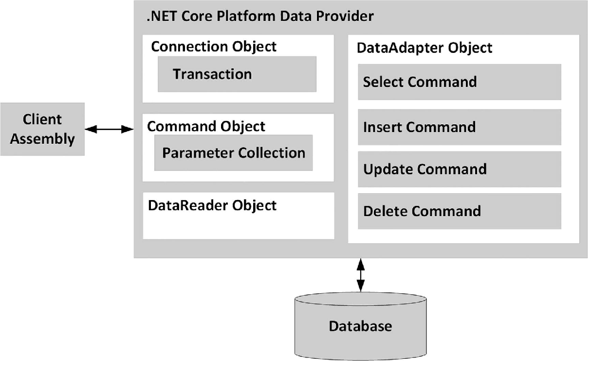

# Огляд ADO.NET та постачальники даних.

Платформа .NET визначає кілька просторів імен, які дозволяють взаємодіяти з системами реляційних баз даних. У сукупності ці простори імен відомі як ADO.NET. 

Платформа .NET підтримує численні постачальники даних (як надані як частина .NET Framework, так і доступні зі сторонніх джерел), кожен з яких оптимізований для зв’язку з певною системою керування базами даних (наприклад, Microsoft SQL Server, Oracle та MySQL). Існує шаблони постачальника даних. Використовуючи типи в просторах імен System.Data (включно з просторами імен System.Data.Common і специфічними для постачальників баз даних просторами імен, такими як Microsoft.Data.SqlClient, System.Data.Odbc і простором імен постачальників баз даних лише для Windows System.Data.Oledb), ви можете створити єдину кодову базу, яка може динамічно вибирати базового постачальника даних без необхідності перекомпілювати чи повторно розгортати кодову базу програми.

Ви можете працювати безпосередньо з постачальником бази даних SQL Server, створюючи та відкриваючи підключення для отримання даних, а потім переходити до вставки, оновлення та видалення даних. Також ви можете виконувати транзакції бази даних і виконувати функцію масового копіювання SQL Server за допомогою ADO.NET для завантаження списку записів у базу даних.

ADO.NET є базою для Entity Framework Core. Існують ситуаціє які не можна рішити в EF і потрібно використовувати ADO.NET.

## Постачальник данних ADO.NET.

ADO.NET не надає єдиного набору об’єктів, які взаємодіють із кількома системами керування базами даних (DBMSs). Навпаки, ADO.NET підтримує кілька постачальників даних, кожен з яких оптимізований для взаємодії з конкретною СУБД. Перша перевага цього підходу полягає в тому, що ви можете запрограмувати певного постачальника даних для доступу до будь-яких унікальних функцій конкретної СУБД. Друга перевага полягає в тому, що конкретний постачальник даних може підключитися безпосередньо до базового механізму розглянутої СУБД без проміжного рівня відображення, що стоїть між рівнями.

Постачальник даних — це набір типів, визначених у заданому просторі імен, які розуміють, як спілкуватися з певним типом джерела даних. Незалежно від того, який постачальник даних ви використовуєте, кожен визначає набір типів класів, які забезпечують основні функції.Таблиця нижче документує деякі базові класи ядра та ключові інтерфейси, які вони реалізують.

Основні класи та реалізуєми інтерфейси постачальника даних ADO.NET

    DbConnection (IDbConnection) : Надає можливість підключатися до сховища даних і відключатися від нього. Об’єкти підключення також надають доступ до пов’язаного об’єкта транзакції.

    DbCommand (IDbCommand) : Представляє SQL-запит або збережену процедуру. Об’єкти команди також надають доступ до об’єкта читача даних постачальника.

    DbDataReader (IDataReader,IDataRecord) : Представляє SQL-запит або збережену процедуру. Об’єкти команди також надають доступ до об’єкта читача даних постачальника.

    DbDataAdapter (IDataAdapter,IDbDataAdapter) : Передає набори даних між абонентом і сховищем даних. Адаптери даних містять з’єднання та набір із чотирьох внутрішніх командних об’єктів, які використовуються для вибору, вставки, оновлення та видалення інформації зі сховища даних.

    DbParameter(IDataParameter,IDbDataParameter) : Представляє іменований параметр у параметризованому запиті.

    DbTransaction(IDbTransaction) : Інкапсулює транзакцію бази даних.

Незважаючи на те, що конкретні назви цих основних класів відрізнятимуться в різних постачальників даних (наприклад, SqlConnection проти OdbcConnection), кожен клас походить від того самого базового класу (DbConnection, у випадку об’єктів підключення), який реалізує ідентичні інтерфейси (наприклад, IDbConnection). Враховуючи це, було б правильно припустити, що після того, як ви навчитеся працювати з одним постачальником даних, інші постачальники виявляться досить простими.

Коли ви посилаєтеся на об’єкт підключення в ADO.NET, ви фактично посилаєтеся на певний тип, похідний від DbConnection; немає класу з буквальною назвою Connection. Та сама ідея справедлива для об'єкта команди, об'єкта адаптера даних і так далі. Відповідно до домомлністю іменування, об’єкти в певному постачальнику даних мають префікс імені пов’язаної СУБД (наприклад, SqlConnection, SqlCommand і SqlDataReader).

На рисунку показано загальну картину провайдерів даних ADO.NET.

Постачальники даних ADO.NET надають доступ до даної СУБД


Збіркою клієнта може бути будь-який тип програми .NET: консольна програма, Windows Forms, Windows Presentation Foundation, ASP.NET Core, бібліотека коду .NET тощо.

Постачальник даних надасть вам інші типи, крім об’єктів, показаних на малюнку; однак ці основні об’єкти визначають загальну базову лінію для всіх постачальників даних.

### Постачальники даних.

Як все інше в .NET, постачальники даних постачаються як пакети NuGet. Існує кілька підтримуваних Microsoft, а також доступна безліч сторонніх постачальників.

Деякі з підтримуваних Microsoft постачальників даних

| Постачальник данних     | Namespace/NuGet Package |
| ----------------------- | ----------------------- |
| Microsoft SQL Server    | Microsoft.Data.SqlClient|
| ODBC                    | Microsoft.Data.Odbc     |
| OLE DB (Windows only)   | System.Data.OleDb       |

Постачальник даних Microsoft SQL Server пропонує прямий доступ до сховищ даних Microsoft SQL Server — і лише до сховищ даних SQL Server (включаючи SQL Azure). Простір імен Microsoft.Data.SqlClient містить типи, які використовуються постачальником SQL Server. Хоча System.Data.SqlClient все ще підтримується, усі зусилля щодо розробки взаємодії з SQL Server (і SQL Azure) зосереджені на новій бібліотеці провайдера Microsoft.Data.SqlClient.

Постачальник ODBC (System.Data.Odbc) надає доступ до підключень ODBC. Типи ODBC, визначені в просторі імен System.Data.Odbc, зазвичай корисні, лише якщо вам потрібно спілкуватися з даною СУБД, для якої немає спеціального постачальника даних .NET. ODBC — широко поширена модель, яка забезпечує доступ до кількох сховищ даних.

Постачальник даних OLE DB, який складається з типів, визначених у просторі імен System.Data.OleDb, дозволяє отримувати доступ до даних, розташованих у будь-якому сховищі даних, яке підтримує класичний протокол OLE DB на основі COM. Через залежність від COM цей провайдер працюватиме лише в операційній системі Windows і його слід вважати застарілим у кросплатформному світі .NET.


## Типи простору імен System.Data

З усіх просторів імен ADO.NET System.Data є найменшим спільним знаменником. Цей простір імен містить типи, спільні для всіх постачальників даних ADO.NET, незалежно від основного сховища даних. На додаток до ряду винятків, орієнтованих на базу даних (наприклад, NoNullAllowedException, RowNotInTableException і MissingPrimaryKeyException), System.Data містить типи, які представляють різні примітиви бази даних (наприклад, таблиці, рядки, стовпці та обмеження), а також загальні інтерфейси реалізований об’єктами постачальника даних. 

Основні члени простору імен System.Data

    Constraint : Представляє обмеження для заданого об’єкта DataColumn

    DataColumn : Представляє один стовпець в об’єкті DataTable

    DataRelation : Представляє відношення батько-нашадок між двома об’єктами DataTable

    DataRow : Представляє один рядок в об’єкті DataTable

    DataSet : Представляє кеш даних у пам’яті, що складається з будь-якої кількості взаємопов’язаних об’єктів DataTable

    DataTable : Представляє табличний блок даних у пам’яті

    DataTableReader : Дозволяє обробляти DataTable як пожежний курсор (доступ до даних лише для пересилання, лише для читання)

    DataView : Представляє настроюваний перегляд DataTable для сортування, фільтрації, пошуку, редагування та навігації

    IDataAdapter : Визначає основну поведінку об'єкта адаптера даних

    IDataParameter : Визначає основну поведінку об’єкта параметра

    IDataReader : Визначає основну поведінку об’єкта читача даних

    IDbCommand : Визначає основну поведінку командного об’єкта

    IDbDataAdapter : Розширює IDataAdapter, щоб забезпечити додаткові функції об’єкта адаптера даних

    IDbTransaction : Визначає основну поведінку об’єкта транзакції

Знання основних інтерфейсів System.Data на високому рівні може допомогти вам зрозуміти загальну функціональність, яку пропонує будь-який постачальник даних. Найкраще зосередитися на загальній поведінці кожного типу інтерфейсу.

### Роль інтерфейсу IDbConnection

Тип IDbConnection реалізується connection object постачальника даних. Цей інтерфейс визначає набір членів, які використовуються для налаштування підключення до певного сховища даних. Реалізація також дозволяє отримати об’єкт транзакції постачальника даних.

```cs
public interface IDbConnection : IDisposable
{
  string ConnectionString { get; set; }
  int ConnectionTimeout { get; }
  string Database { get; }
  ConnectionState State { get; }
  IDbTransaction BeginTransaction();
  IDbTransaction BeginTransaction(IsolationLevel il);
  void ChangeDatabase(string databaseName);
  void Close();
  IDbCommand CreateCommand();
  void Open();
  void Dispose();
}
```

### Роль інтерфейсу IDbTransaction

Перевантажений метод BeginTransaction(), визначений IDbConnection, надає доступ до transaction object постачальника. Ви можете використовувати членів, визначених IDbTransaction, для програмної взаємодії з транзакційним сеансом і основним сховищем даних.

```cs
public interface IDbTransaction : IDisposable
{
  IDbConnection Connection { get; }
  IsolationLevel IsolationLevel { get; }
  void Commit();
  void Rollback();
  void Dispose();
}
```
 
### Роль інтерфейсу IDbCommand

Далі йде інтерфейс IDbCommand, який буде реалізований command object постачальника даних. Як і інші об’єктні моделі доступу до даних, командні об’єкти дозволяють програмно маніпулювати операторами SQL, збереженими процедурами та параметризованими запитами. Об’єкти команд також надають доступ до типу читача даних постачальника даних через перевантажений метод ExecuteReader().

```cs
public interface IDbCommand : IDisposable
{
  string CommandText { get; set; }
  int CommandTimeout { get; set; }
  CommandType CommandType { get; set; }
  IDbConnection Connection { get; set; }
  IDbTransaction Transaction { get; set; }
  IDataParameterCollection Parameters { get; }
  UpdateRowSource UpdatedRowSource { get; set; }
  void Prepare();
  void Cancel();
  IDbDataParameter CreateParameter();
  int ExecuteNonQuery();
  IDataReader ExecuteReader();
  IDataReader ExecuteReader(CommandBehavior behavior);
  object ExecuteScalar();
  void Dispose();
}
```

### Роль інтерфейсів IDbDataParameter та IDataParameter

Зверніть увагу, що властивість Parameters IDbCommand повертає строго типізовану колекцію, яка реалізує IDataParameterCollection. Цей інтерфейс надає доступ до набору сумісних з IDbDataParameter типів класів (наприклад, об’єктів параметрів).

```cs
public interface IDbDataParameter : IDataParameter
{
//Plus members in the IDataParameter interface
  byte Precision { get; set; }
  byte Scale { get; set; }
  int Size { get; set; }
}

public interface IDataParameter
{
  DbType DbType { get; set; }
  ParameterDirection Direction { get; set; }
  bool IsNullable { get; }
  string ParameterName { get; set; }
  string SourceColumn { get; set; }
  DataRowVersion SourceVersion { get; set; }
  object Value { get; set; }
}
```
Функціональність інтерфейсів IDbDataParameter і IDataParameter дозволяє представляти параметри в команді SQL (включаючи збережені процедури) через певні об’єкти параметрів ADO.NET, а не через жорстко закодовані рядкові літерали.

### Роль інтерфейсів IDbDataAdapter та IDataAdapter

Адаптери даних використавуються, щоб надсилати та отримувати набори даних до та з даного сховища даних.
Інтерфейс IDbDataAdapter визначає набір властивостей, які можна використовувати для підтримки інструкцій SQL для відповідних операцій вибору, вставки, оновлення та видалення.

```cs
public interface IDbDataAdapter : IDataAdapter
{
  //Plus members of IDataAdapter
  IDbCommand SelectCommand { get; set; }
  IDbCommand InsertCommand { get; set; }
  IDbCommand UpdateCommand { get; set; }
  IDbCommand DeleteCommand { get; set; }
}
```
На додаток до цих чотирьох властивостей, адаптер даних ADO.NET вибирає поведінку, визначену в базовому інтерфейсі IDataAdapter. Цей інтерфейс визначає ключову функцію типу адаптера даних: можливість передавати набори даних між викликом і базовим сховищем даних за допомогою методів Fill() і Update(). Інтерфейс IDataAdapter також дозволяє зіставляти імена стовпців бази даних із більш зручними для користувача іменами за допомогою властивості TableMappings.

```cs
public interface IDataAdapter
{
  MissingMappingAction MissingMappingAction { get; set; }
  MissingSchemaAction MissingSchemaAction { get; set; }
  ITableMappingCollection TableMappings { get; }
  DataTable[] FillSchema(DataSet dataSet, SchemaType schemaType);
  int Fill(DataSet dataSet);
  IDataParameter[] GetFillParameters();
  int Update(DataSet dataSet);
}
```

### Роль інтерфейсів IDataReader та IDataRecord

Наступним ключовим інтерфейсом, про який слід знати, є IDataReader, який представляє загальну поведінку, що підтримується даним об’єктом читача даних. Коли ви отримуєте тип, сумісний із IDataReader, від постачальника даних ADO.NET, ви можете переглядати набір результатів лише для читання.

```cs
public interface IDataReader : IDisposable, IDataRecord
{
  //Plus members from IDataRecord
  int Depth { get; }
  bool IsClosed { get; }
  int RecordsAffected { get; }
  void Close();
  DataTable GetSchemaTable();
  bool NextResult();
  bool Read();
  Dispose();
}
```

IDataReader розширює IDataRecord, який визначає багато членів, які дозволяють витягувати суворо типізоване значення з потоку, а не транслювати загальний System.Object, отриманий із перевантаженого методу індексатора зчитувача даних.

```cs
public interface IDataRecord
{
  int FieldCount { get; }
  object this[ int i ] { get; }
  object this[ string name ] { get; }
  bool GetBoolean(int i);
  byte GetByte(int i);
  long GetBytes(int i, long fieldOffset, byte[] buffer,
    int bufferoffset, int length);
  char GetChar(int i);
  long GetChars(int i, long fieldoffset, char[] buffer,
    int bufferoffset, int length);
  IDataReader GetData(int i);
  string GetDataTypeName(int i);
  DateTime GetDateTime(int i);
  Decimal GetDecimal(int i);
  double GetDouble(int i);
  Type GetFieldType(int i);
  float GetFloat(int i);
  Guid GetGuid(int i);
  short GetInt16(int i);
  int GetInt32(int i);
  long GetInt64(int i);
  string GetName(int i);
  int GetOrdinal(string name);
  string GetString(int i);
  object GetValue(int i);
  int GetValues(object[] values);
  bool IsDBNull(int i);
}
```
Ви можете використовувати метод IDataReader.IsDBNull(), щоб програмно визначити, чи задане поле має значення null, перш ніж спробувати отримати значення з пристрою читання даних (щоб уникнути ініціювання виняткової ситуації під час виконання). Також пам’ятайте, що C# підтримує типи даних із значенням null, які ідеально підходять для взаємодії зі стовпцями даних, які можуть мати значення null у таблиці бази даних.

## Абстрагування постачальників даних за допомогою інтерфейсів

Постачальник даних це по суті сервіс шо дозволяє клієнській програмі працювати з СУБД. Незважаючи на те, що точні назви реалізованих типів відрізнятимуться в різних постачальників даних, ви можете запрограмувати ці типи подібним чином — у цьому полягає краса поліморфізму на основі інтерфейсу. Наприклад, якщо ви визначаєте метод, який приймає параметр IDbConnection, ви можете передати будь-який об’єкт підключення ADO.NET, наприклад:

```cs
public static void OpenConnection(IDbConnection cn)
{
  // Open the incoming connection for the caller.
  connection.Open();
}
```
Інтерфейси не обов'язкові; Ви можете досягти того самого рівня абстракції, використовуючи абстрактні базові класи (такі як DbConnection) як параметри або значення, що повертаються. Однак використання інтерфейсів замість базових класів є загальновизнаною найкращою практикою. 

Те саме стосується значень, що повертаються членами.

Створимоь нову консольну програму .NET під назвою MyConnectionFactory. Додамо такі пакети NuGet до проекту (зауважте, що пакет OleDb дійсний лише в Windows):

  Microsoft.Data.SqlClient

  System.Data.Common

  System.Data.Odbc

  System.Data.OleDb

Додамо DataProviderEnum.cs

```cs

namespace MyConnectionFactory;

enum DataProviderEnum
{
    SqlServer,
#if PC
    OleDb,
#endif
    Odbc,
    None
}
```
Якщо ви використовуєте ОС Windows на своїй машині розробки, оновіть файл проекту, щоб визначити символ умовного компілятора PC.

```xml
  <PropertyGroup>
    <DefineConstants>PC</DefineConstants>
  </PropertyGroup>
```
Якщо ви використовуєте Visual Studio, теж саме можна зробити, у властивостях проекту, на вкладці «Build», ввести значення «Conditional compiler symbols».

Для різних DBMS потрібні різні connection object.

```cs
using Microsoft.Data.SqlClient;
using System.Data.Odbc;
using MyConnectionFactory;
using System.Data;
#if PC
using System.Data.OleDb;
#endif

// Testing various connections
void ObtainingSpecificConntctionObject()
{
	Setup(DataProviderEnum.SqlServer);
    Setup(DataProviderEnum.Odbc);
#if PC
    Setup(DataProviderEnum.OleDb);
#endif
    Setup(DataProviderEnum.None);

}
ObtainingSpecificConntctionObject();


// Set up a custom connection
void Setup(DataProviderEnum providerEnum)
{
	IDbConnection? dbConnection = GetConnection(providerEnum);

	if (dbConnection != null)
	{
        Console.WriteLine($"Connection object is {dbConnection?.GetType().Name}");
		// Open, use and close connection...
	}
	else
	{
		Console.WriteLine("There is no connetcion object.");
	}
}

// Get a specific Connection object
IDbConnection? GetConnection(DataProviderEnum dataProvider) => dataProvider switch
{
	DataProviderEnum.SqlServer => new SqlConnection(),
	DataProviderEnum.Odbc => new OdbcConnection(),
	DataProviderEnum.None => null,
#if PC
	DataProviderEnum.OleDb => new OleDbConnection(),
#endif
	_ => null
};

```
```
Connection object is SqlConnection
Connection object is OdbcConnection
Connection object is OleDbConnection
There is no connetcion object.
```
Перевага роботи із загальними інтерфейсами System.Data (або, якщо на те пішло, з абстрактними базовими класами System.Data.Common) полягає в тому, що ви маєте набагато більше шансів побудувати гнучку кодову базу, яка може розвиватися з часом. Наприклад, сьогодні ви можете створювати програму, націлену на Microsoft SQL Server; однак можливо, ваша компанія перейде на іншу базу даних. Якщо ви створюєте рішення, яке жорстко кодує специфічні для Microsoft SQL Server типи System.Data.SqlClient, вам потрібно буде відредагувати, перекомпілювати та повторно розгорнути код для нового постачальника бази даних.
На даний момент ви створили деякий (досить простий) код ADO.NET, який дозволяє вам створювати різні типи об’єктів з’єднання для постачальника. Однак отримання об'єкта підключення є лише одним з аспектів роботи з ADO.NET. Щоб створити гідну фабричну бібліотеку постачальника даних, вам також доведеться враховувати  command objects, data readers, transaction objects, та інші типи, орієнтовані на дані. Створення такої бібліотеки коду не обов’язково буде складним, але потребуватиме значної кількості коду та часу.