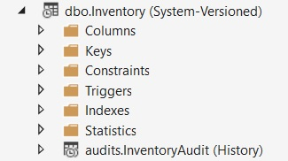

# Дослідження використання

Скопіюемо код AutoLot.Samples з попередньої глави. Видалемо папки Migrations, CompiledModels. Відкриемо рішення. Видалимо зайви комантарі в класі ApplicationDbContext в методі OnModelCreating

```cs
protected override void OnModelCreating(ModelBuilder modelBuilder)
{
    new CarConfiguration().Configure(modelBuilder.Entity<Car>());
    new RadioConfiguration().Configure(modelBuilder.Entity<Radio>());
    new DriverConfiguration().Configure(modelBuilder.Entity<Driver>());
    new CarMakeViewModelConfiguration().Configure(modelBuilder.Entity<CarMakeViewModel>());
}
```

Додамо міграцію і оновимо базу.

```console
dotnet ef migrations add Initial
dotnet ef database drop
dotnet ef database update
```
Таким чином у нас є сутності і їх відображення в БД для досліджень.

## Додавання записів

Записи додаються до бази даних шляхом їх створення в коді, додавання до їхнього DbSet<T> і виклику SaveChanges()/SaveChangesAsync() у контексті. Коли виконується SaveChanges(), ChangeTracker повідомляє про всі додані об’єкти, а EF Core (разом із постачальником бази даних) створює відповідний оператор(и) SQL для вставлення запису(ів).

SaveChanges() виконується в неявній транзакції, якщо не використовується явна транзакція. Якщо збереження відбулося успішно, згенеровані сервером значення запитуються для встановлення значень для сутностей.

Записи також можна додавати за допомогою похідного DbContext. Усі ці приклади використовуватимуть властивості колекції DbSet<T> для додавання записів. І DbSet<T>, і DbContext мають асинхронні версії Add()/AddRange(). Показані лише синхронні версії.

### Додавання одного запису і стан сутності.

Коли сутність створюється за допомогою коду, але ще не додається до DbSet<T>, EntityState є  Detached(відокремлений). Після додавання нової сутності до DbSet<T> EntityState встановлюється на Added. Після успішного виконання SaveChanges() EntityState встановлюється на Unchanged.

```cs
static void AddRecords()
{
    //The factory is not meant to be used like this, but it's demo code
    var context = new ApplicationDbContextFactory().CreateDbContext(null);
    
    Make newMake = new Make { Name ="BMW" };
    Console.WriteLine($"State of the entity is {context.Entry(newMake).State}");

    context.Makes.Add(newMake);
    Console.WriteLine($"State of the entity is {context.Entry(newMake).State}");

    
    ViewMake(newMake,"Bifore SaveChange");
    context.SaveChanges();
    Console.WriteLine($"State of the entity is {context.Entry(newMake).State}");
    ViewMake(newMake, "After SaveChange");
}
AddRecords();

static void ViewMake(Make make,string text)
{
    Console.WriteLine($"\t{text}");
    Console.WriteLine($"\tId:{make.Id}");
    Console.WriteLine($"\tName:{make.Name}");
}
```
```console
State of the entity is Detached
State of the entity is Added
        Bifore SaveChange
        Id:0
        Name:VW
Saving change for Server=(localdb)\mssqllocaldb;Database=AutoLotSamples;Trusted_Connection=True;ConnectRetryCount=0
Saved change 1 entities
State of the entity is Unchanged
        After SaveChange
        Id:6
        Name:VW
```
Щоб додати новий запис Make до бази даних, створіть новий екземпляр сутності та викличте метод Add() відповідного DbSet<T>. Щоб ініціювати збереження даних, необхідно також викликати SaveChanges() похідного класу DbContext.
Після того, як сутність було додано до засобу відстеження змін (за допомогою методу Add()), стан було змінено на Added. Повідомлення про збереження змін надходить від обробника подій SavingChanges, а повідомлення «Saved 1 entities» — від обробника подій SavedChanges. Після виклику SaveChanges() у контексті стан сутності змінюється на Unchanged.
На сервері буде виконано запит SQL.

```sql
exec sp_executesql N'SET NOCOUNT ON;
INSERT INTO [Makes] ([Name]) VALUES (@p0);
SELECT [Id], [TimeStamp]
FROM [Makes]
WHERE @@ROWCOUNT = 1 AND [Id] = scope_identity();
',N'@p0 nvarchar(50)',@p0=N'VW'
```
Формат запиту пов’язаний із процесом пакетування, який використовується EF Core для покращення продуктивності операцій з базою даних. Усі значення, передані в інструкцію SQL, параметризовані, щоб зменшити загрозу сценарних атак. Також зауважте, що нещодавно додана сутність запитується щодо властивостей, згенерованих базою даних (як можна здогадатись для заповненя властивостей сутності в пам'яті).

### Як побачити запрос на сервері.

Для того аби відслідковувати які sql-запити виконуються на сервері можна встановити Azure Data Studio. В н'му встанвити розширення SQL Server Profiler і прочитати як їм користуватися по запиту документації "SQL Server Profiler extension".


### Додавання нового запису за допомогою Attach

Коли первинний ключ сутності зіставляється зі стовпцем ідентифікації в SQL Server, EF Core розглядатиме цей екземпляр сутності як Доданий під час додавання до ChangeTracker, якщо значення властивості первинного ключа дорівнює нулю.

```cs
static void AddRecordsWithAttach()
{
    //The factory is not meant to be used like this, but it's demo code
    var context = new ApplicationDbContextFactory().CreateDbContext(null);

    Make newMake = new Make { Name = "BMW" };
    context.Makes.Add(newMake);
    context.SaveChanges();

    Car newCar = new Car
    {
        Color = "Blue",
        DateBuilt = new DateTime(2012, 12, 01),
        IsDrivable = true,
        PetName = "Bluesmobile",
        MakeId = newMake.Id
    };

    Console.WriteLine($"State of the {newCar.PetName} is {context.Entry(newCar).State}");
    context.Cars.Attach(newCar);
    Console.WriteLine($"State of the {newCar.PetName} is {context.Entry(newCar).State}");
    context.SaveChanges();
    Console.WriteLine($"State of the {newCar.PetName} is {context.Entry(newCar).State}");
}
AddRecordsWithAttach();
```
Наступний код додає новий запис Car за допомогою методу Attach() замість методу Add(). Зауважте, що SaveChanges() все одно має бути викликано для збереження даних.

```console
Saving change for Server=(localdb)\mssqllocaldb;Database=AutoLotSamples;Trusted_Connection=True;ConnectRetryCount=0
Saved change 1 entities
State of the Bluesmobile is Detached
State of the Bluesmobile is Added
Saving change for Server=(localdb)\mssqllocaldb;Database=AutoLotSamples;Trusted_Connection=True;ConnectRetryCount=0
Saved change 1 entities
State of the Bluesmobile is Unchanged
```
Ми бачимо таку саму послідовність станів, яку бачили з сутністю Make.

Буде виконаний оператор SQL для вставки такого типу

```sql
exec sp_executesql N'SET NOCOUNT ON;
INSERT INTO [dbo].[Inventory] ([Color], [DateBuilt], [IsDrivable], [MakeId], [PetName])
VALUES (@p0, @p1, @p2, @p3, @p4);

SELECT [Id], [Display], [TimeStamp]
FROM [dbo].[Inventory]

WHERE @@ROWCOUNT = 1 AND [Id] = scope_identity();
',N'@p0 nvarchar(50),@p1 datetime2(7),@p2 bit,@p3 int,@p4 nvarchar(50)',@p0=N'Blue',@p1='2016-12-01 00:00:00',@p2=1,@p3=1,@p4=N'Bluesmobile'
```
Щоб розглянути наступний приклад можна очистити БД видаливши її і створивши.

```console
dotnet ef database drop
dotnet ef database update
```

### Додавання кількох записів одночасно

Щоб вставити кілька записів в одну транзакцію, використовуйте метод AddRange() властивості DbSet<T>

```cs
static void AddMultipleRecords()
{
    //The factory is not meant to be used like this, but it's demo code
    var context = new ApplicationDbContextFactory().CreateDbContext(null);

    Make newMake = new Make { Name = "BMW" };
    context.Makes.Add(newMake);
    context.SaveChanges();

    var cars = new List<Car>
    {
        new() { Color = "Yellow", MakeId = newMake.Id, PetName = "Herbie" },
        new() { Color = "White", MakeId = newMake.Id, PetName = "Mach 5" },
        new() { Color = "Pink", MakeId = newMake.Id, PetName = "Avon" },
        new() { Color = "Blue", MakeId = newMake.Id, PetName = "Blueberry" },
    };
    context.Cars.AddRange(cars);
    context.SaveChanges();
}
AddMultipleRecords();

```
```console
Saving change for Server=(localdb)\mssqllocaldb;Database=AutoLotSamples;Trusted_Connection=True;ConnectRetryCount=0
Saved change 1 entities
Saving change for Server=(localdb)\mssqllocaldb;Database=AutoLotSamples;Trusted_Connection=True;ConnectRetryCount=0
Saved change 4 entities
```
Незважаючи на те, що було додано чотири записи, EF Core створив лише один оператор SQL для вставок.
Інструкція SQL для вставок показана тут:
```sql
exec sp_executesql N'SET NOCOUNT ON;
DECLARE @inserted0 TABLE ([Id] int, [_Position] [int]);
MERGE [dbo].[Inventory] USING (
VALUES (@p0, @p1, @p2, 0),
(@p3, @p4, @p5, 1),
(@p6, @p7, @p8, 2),
(@p9, @p10, @p11, 3)) AS i ([Color], [MakeId], [PetName], _Position) ON 1=0
WHEN NOT MATCHED THEN
INSERT ([Color], [MakeId], [PetName])
VALUES (i.[Color], i.[MakeId], i.[PetName])
OUTPUT INSERTED.[Id], i._Position
INTO @inserted0;
SELECT [t].[Id], [t].[DateBuilt], [t].[Display], [t].[IsDrivable], [t].[TimeStamp] FROM [dbo].[Inventory] t
INNER JOIN @inserted0 i ON ([t].[Id] = [i].[Id])
ORDER BY [i].[_Position];
',N'@p0 nvarchar(50),@p1 int,@p2 nvarchar(50),@p3 nvarchar(50),@p4 int,@p5 nvarchar(50),@p6 nvarchar(50),@p7 int,@p8 nvarchar(50),@p9 nvarchar(50),@p10 int,@p11 nvarchar(50)',@p0=N'Yellow',@p1=1,@p2=N'Herbie',@p3=N'White',@p4=1,@p5=N'Mach 5',@p6=N'Pink',@p7=1,@p8=N'Avon',@p9=N'Blue',@p10=1,@p11=N'Blueberry'
```

### Cтовпець ідентифікації під час додавання записів

Якщо сутність має числову властивість, визначену як первинний ключ, ця властивість (за замовчуванням) зіставляється зі стовпцем Identity у SQL Server. EF Core вважає будь-яку сутність зі значенням за замовчуванням (нуль) для властивості ключа новою, а будь-яку сутність зі значенням, відмінним від за замовчуванням, уже існує в базі даних. Якщо ви створюєте нову сутність і встановлюєте для властивості первинного ключа значення, відмінне від нуля, і намагаєтесь додати її до бази даних, EF Core не зможе додати запис, оскільки вставку ідентифікаційної інформації не ввімкнено на стороні сервера.
Для SQL Server вставлення ідентичності вмикається шляхом виконання команди SET IDENTITY_INSERT у явній транзакції. Для цієї команди потрібні схема бази даних і ім’я таблиці.

```cs
static void GetSchemaAndTableNameForType()
{
    var context = new ApplicationDbContextFactory().CreateDbContext(null);
    IEntityType metadata = context.Model.FindEntityType(typeof(Car).FullName);
    var schema = metadata.GetSchema();
    var tableName = metadata.GetTableName();
    Console.WriteLine($"{schema} {tableName}");
}
//GetSchemaAndTableNameForType();
```
```console
dbo Inventory
```
При використанні ExecutionStrategy явні транзакції повинні виконуватися в межах цієї стратегії наступним чином:

```cs
var strategy = context.Database.CreateExecutionStrategy();
strategy.Execute(() =>
{
  using var trans = context.Database.BeginTransaction();
  try
  {
    //actionToExecute();
  trans.Commit();
  Console.WriteLine($'Insert succeeded');
  }
  catch (Exception ex)
  {
    trans.Rollback();
    Console.WriteLine($'Insert failed: {ex.Message}');
  }
});
```
Створимо метод що виконує в стратегії явну транзакцію і вмикає в ній дадавання необідних значень до індіфікаційних даних.

```cs
static void AddRowWithSetIdentityInsert()
{
    var context = new ApplicationDbContextFactory().CreateDbContext(null);

    // Definition schema and tablename    
    IEntityType metadata = context.Model.FindEntityType(typeof(Car).FullName);
    string schema = metadata.GetSchema();
    string tableName = metadata.GetTableName();
    
    //Cteate strategy with explecitly transaction
    string sql;
    var strategy = context.Database.CreateExecutionStrategy();
    strategy.Execute( () => 
    {
        using var transaction = context.Database.BeginTransaction();
        try
        {   //Settings on server
            sql = $"SET IDENTITY_INSERT {schema}.{tableName} ON";
            context.Database.ExecuteSqlRaw(sql);
            
            // Insert row
            Car car = new Car
            {
                Id = 27,
                Color = "Blue",
                DateBuilt = new DateTime(2012, 12, 01),
                IsDrivable = true,
                PetName = "Bluesmobile",
                MakeId = 1
            };
            context.Cars.Add(car);
            context.SaveChanges();
            // Insert row
            transaction.Commit();
            Console.WriteLine("Insert succeeded");

        }
        catch (Exception ex)
        {
            transaction.Rollback();
            Console.WriteLine($"Insert failed:{ex.Message}");
        }
        finally
        {
            //Settings on server
            sql = $"SET IDENTITY_INSERT {schema}.{tableName} OFF";
            context.Database.ExecuteSqlRaw(sql);
        }
    });
}
AddRowWithSetIdentityInsert();
```
```console
Saving change for Server=(localdb)\mssqllocaldb;Database=AutoLotSamples;Trusted_Connection=True;ConnectRetryCount=0
Saved change 1 entities
Insert succeeded
```
Якщо все проходить успішно, транзакцію зафіксовано. Якщо будь-яка його частина виходить з ладу, транзакція відкочується. У блоці finally вставку ідентифікаційної інформації вимкнуто.
EF Core надає два методи виконання команд безпосередньо в базі даних. Метод ExecuteSqlRaw() виконує рядок точно так, як він написаний, тоді як ExecuteSqlInterpolated() використовує інтерполяцію рядка C# для створення параметризованого запиту. Якщо використовуються відомі значення, як у цьому прикладі, метод ExecuteSqlRaw() є безпечним для використання. Однак, якщо ви збираєте вхідні дані від користувачів, вам слід використовувати версію ExecuteSqlInterpolated() для додаткового захисту.

Попередній код виконував наступні команди для бази даних:
```sql
SET IDENTITY_INSERT dbo.Inventory ON
SAVE TRANSACTION [__EFSavePoint];
exec sp_executesql N'SET NOCOUNT ON;
INSERT INTO [dbo].[Inventory] ([Id], [Color], [DateBuilt], [IsDrivable], [MakeId], [PetName])
VALUES (@p0, @p1, @p2, @p3, @p4, @p5);
SELECT [Display], [TimeStamp]
FROM [dbo].[Inventory]
WHERE @@ROWCOUNT = 1 AND [Id] = @p0;
',N'@p0 int,@p1 nvarchar(50),@p2 datetime2(7),@p3 bit,@p4 int,@p5 nvarchar(50)',@p0=27,@p1=N'Blue',@p2='2016-12-01 00:00:00',@p3=1,@p4=1,@p5=N'Bluesmobile'
SET IDENTITY_INSERT dbo.Inventory OFF
```

### Додавання графа об’єктів

Під час додавання сутності до бази даних дочірні записи можна додавати в тому самому виклику без спеціального додавання їх у власний DbSet<T>. Це досягається додаванням їх до властивості навігації колекції для батьківського запису.

```cs
static void AddEntityWithChild()
{
    var context = new ApplicationDbContextFactory().CreateDbContext(null);
    
    var make = new Make { Name = "Honda" };

    Car car = new Car { Color = "Yellow", PetName = "Herbie" };
    // IEnumerable<Car> to List<Car>
    ((List<Car>)make.Cars).Add(car);

    context.Makes.Add(make);
    context.SaveChanges();
}
AddEntityWithChild();
```
```console
Saving change for Server=(localdb)\mssqllocaldb;Database=AutoLotSamples;Trusted_Connection=True;ConnectRetryCount=0
Saved change 2 entities
```
Створюється нова сутність Make, а дочірній запис Car додається до властивості Cars у Make. Коли сутність Make додається до властивості DbSet<Make>, EF Core також автоматично починає відстежувати дочірній запис Car, не додаючи його до властивості DbSet<Car> явно. Виконання SaveChanges() зберігає Make та Car разом.

```sql
exec sp_executesql N'SET NOCOUNT ON;
INSERT INTO [Makes] ([Name])
VALUES (@p0);
SELECT [Id], [TimeStamp]
FROM [Makes]
WHERE @@ROWCOUNT = 1 AND [Id] = scope_identity();
',N'@p0 nvarchar(50)',@p0=N'Honda'
exec sp_executesql N'SET NOCOUNT ON;
INSERT INTO [dbo].[Inventory] ([Color], [MakeId], [PetName])
VALUES (@p1, @p2, @p3);
SELECT [Id], [DateBuilt], [Display], [IsDrivable], [TimeStamp]
FROM [dbo].[Inventory]
WHERE @@ROWCOUNT = 1 AND [Id] = scope_identity();
',N'@p1 nvarchar(50),@p2 int,@p3 nvarchar(50)',@p1=N'Yellow',@p2=2,@p3=N'Herbie'
```
Зверніть увагу, як EF Core отримав ідентифікатор для нового запису Make і автоматично включив його в оператор вставки для запису Car.

### Додавання записів в таблиці з відношенням many-to-many

Для таблиць «many-to-many» записи можна додавати безпосередньо від однієї сутності до іншої, не переходячи через зведену таблицю. Тепер ви можете написати такий код, щоб додати записи Driver безпосередньо до записів Car:
```cs
static void AddRecordsToMantToManyTables()
{
    var context = new ApplicationDbContextFactory().CreateDbContext(null);

    List<Driver> drivers = new List<Driver>
    {
        new() { PersonInfo = new Person { FirstName = "Fred", LastName = "Flinstone" } },
        new() { PersonInfo = new Person { FirstName = "Wilma", LastName = "Flinstone" } },
        new() { PersonInfo = new Person { FirstName = "BamBam", LastName = "Flinstone" } },
        new() { PersonInfo = new Person { FirstName = "Barney", LastName = "Rubble" } },
        new() { PersonInfo = new Person { FirstName = "Betty", LastName = "Rubble" } },
        new() { PersonInfo = new Person { FirstName = "Pebbles", LastName = "Rubble" } }
    };

    var cars = context.Cars.Take(2).ToList();

    //Cast the IEnumerable to a List to access the Add method
    //Range support works with LINQ to Objects, but is not translatable to SQL calls
    ((List<Driver>)cars[0].Drivers).AddRange(drivers.Take(..3));
    ((List<Driver>)cars[1].Drivers).AddRange(drivers.Take(3..));
    context.SaveChanges();
}
AddRecordsToMantToManyTables();
```
```console
An entity of type Car was loaded from the database.
An entity of type Car was loaded from the database.
Saving change for Server=(localdb)\mssqllocaldb;Database=AutoLotSamples;Trusted_Connection=True;ConnectRetryCount=0
Saved change 12 entities
```
Коли виконується метод SaveChanges(), виконуються два оператори вставки. Перший вставляє шість записів Driver у таблицю Drivers, а другий вставляє шість записів у таблицю InventoryDriver (зведену таблицю).

```sql
exec sp_executesql N'SET NOCOUNT ON;
DECLARE @inserted0 TABLE ([InventoryId] int, [DriverId] int, [_Position] [int]);
MERGE [dbo].[InventoryToDrivers] USING (
VALUES (@p12, @p13, 0),
(@p14, @p15, 1),
(@p16, @p17, 2),
(@p18, @p19, 3),
(@p20, @p21, 4),
(@p22, @p23, 5)) AS i ([InventoryId], [DriverId], _Position) ON 1=0
WHEN NOT MATCHED THEN
INSERT ([InventoryId], [DriverId])
VALUES (i.[InventoryId], i.[DriverId])
OUTPUT INSERTED.[InventoryId], INSERTED.[DriverId], i._Position
INTO @inserted0;
SELECT [t].[Id], [t].[TimeStamp] FROM [dbo].[InventoryToDrivers] t
INNER JOIN @inserted0 i ON ([t].[InventoryId] = [i].[InventoryId]) AND ([t].[DriverId] = [i].[DriverId])
ORDER BY [i].[_Position];
',N'@p12 int,@p13 int,@p14 int,@p15 int,@p16 int,@p17 int,@p18 int,@p19 int,@p20 int,@p21 int,@p22 int,@p23 int',@p12=1,@p13=1,@p14=1,@p15=2,@p16=1,@p17=3,@p18=2,@p19=4,@p20=2,@p21=5,@p22=2,@p23=6
```
Це набагато краще, ніж попередні версії EF Core, коли використовуються зв’язки «багато до багатьох», де вам доводилося самостійно керувати зведеною таблицею.

### Приклада додавання різних сутностей для подальшого дослідження запитів.

Додайте серію записів Make та Car для прикладів запитів на читання. 

```cs
static void LoadMakeAndCarData()
{
    var context = new ApplicationDbContextFactory().CreateDbContext(null);

    List<Make> makes = new()
    {
        new() { Name = "VW" },
        new() { Name = "Ford" },
        new() { Name = "Saab" },
        new() { Name = "Yugo" },
        new() { Name = "BMW" },
        new() { Name = "Pinto" },

    };
    context.Makes.AddRange(makes);
    context.SaveChanges();

    List<Car> cars = new()
    {
        new() { MakeId = 1, Color = "Black", PetName = "Zippy" },
        new() { MakeId = 2, Color = "Rust", PetName = "Rusty" },
        new() { MakeId = 3, Color = "Black", PetName = "Mel" },
        new() { MakeId = 4, Color = "Yellow", PetName = "Clunker" },
        new() { MakeId = 5, Color = "Black", PetName = "Bimmer" },
        new() { MakeId = 5, Color = "Green", PetName = "Hank" },
        new() { MakeId = 5, Color = "Pink", PetName = "Pinky" },
        new() { MakeId = 6, Color = "Black", PetName = "Pete" },
        new() { MakeId = 4, Color = "Brown", PetName = "Brownie" },
        new() { MakeId = 1, Color = "Rust", PetName = "Lemon", IsDrivable = false },
    };

    context.Cars.AddRange(cars);
    context.SaveChanges();
}
LoadMakeAndCarData();
```
```console
Saving change for Server=(localdb)\mssqllocaldb;Database=AutoLotSamples;Trusted_Connection=True;ConnectRetryCount=0
Saved change 6 entities
Saving change for Server=(localdb)\mssqllocaldb;Database=AutoLotSamples;Trusted_Connection=True;ConnectRetryCount=0
Saved change 10 entities
```
Метод створює кілька сутностей марки та автомобіля та додає їх до бази даних. Сутності Make створюються та додаються до властивості Makes DbSet<Make> похідного ApplicationDbContext, а потім викликається метод SaveChanges(). Процес повторюеться  для записів Car, використовуючи властивість Cars DbSet<Car>.

### Приклад очистки таблиць БД.

Cтворимо метод, який очищає зразки даних, щоб, коли приклади запускаються кілька разів, попередні виконання не заважали прикладам. Створіть новий метод під назвою ClearSampleData().

```cs
static void ClearSampleData()
{
    var context = new ApplicationDbContextFactory().CreateDbContext(null);
    string?[] entities = 
    {
        typeof(Driver).FullName,
        typeof(Car).FullName,
        typeof(Make).FullName,
    };

    foreach (var entityName in entities)
    {
        var entity = context.Model.FindEntityType(entityName);
        string? tableName = entity.GetTableName();
        string? schemaName = entity.GetSchema();

        string sql = $"DELETE FROM {schemaName}.{tableName}";
        context.Database.ExecuteSqlRaw(sql);

        sql = $"DBCC CHECKIDENT (\"{schemaName}.{tableName}\", RESEED, 0);";
        context.Database.ExecuteSqlRaw(sql);
    }
}
ClearSampleData();
```
Метод використовує метод FindEntityType() у властивості Model ApplicationDbContext, щоб отримати назву таблиці та схеми, а потім видаляє записи. Після видалення записів код використовує команду DBCC CHECKIDENT, щоб скинути ідентифікатор для кожної таблиці.

Загрузимо дані знову 

```cs
LoadMakeAndCarData();
AddRecordsToMantToManyTables();
```
```console
Saving change for Server=(localdb)\mssqllocaldb;Database=AutoLotSamples;Trusted_Connection=True;ConnectRetryCount=0
Saved change 6 entities
Saving change for Server=(localdb)\mssqllocaldb;Database=AutoLotSamples;Trusted_Connection=True;ConnectRetryCount=0
Saved change 10 entities
An entity of type Car was loaded from the database.
An entity of type Car was loaded from the database.
Saving change for Server=(localdb)\mssqllocaldb;Database=AutoLotSamples;Trusted_Connection=True;ConnectRetryCount=0
Saved change 12 entities
```
В базі даних можна побачити значення для додавання Id було скинкто до 0.

## Запит даних з однієї таблиці

Запит даних за допомогою EF Core зазвичай виконується за допомогою запитів LINQ. Пам'ятайте, що під час використання LINQ для запиту до бази даних для списку сутностей запит не виконується, доки запит не буде перебирати список, перетворюватнись на List<T> (або масив) або прив’язано до елемента керування списком (як сітка даних). Тобто до тих пір як дані реально потрібні для показу або використання. Для запитів з одним записом оператор виконується негайно, коли використовується виклик з одним записом (First(), Single() тощо).

Більше прикладів LINQ можна знайти в мережі інтернет за запитом "microsoft linq samples"

Ви можете викликати метод ToQueryString() у більшості запитів LINQ, щоб перевірити запит, який виконується до бази даних. Основним винятком є ​​будь-які запити негайного виконання, такі як First()/FirstOrDefault(). Для розділених запитів метод ToQueryString() повертає лише перший запит, який буде виконано.

### Отримання всіх запитів 

Щоб отримати всі записи для таблиці, просто використовуйте властивість DbSet<T> безпосередньо без будь-яких операторів LINQ. 

Створимо допоміжний метод.
```cs
static void CollectionCarToConsole(IEnumerable<Car> cars,string text)
{
    Console.WriteLine($"\t{text}");
    foreach (var car in cars)
    {
        Console.WriteLine($"{car.Id} {car.Color} {car.PetName}");
    }
}
```
Подивимость властивість context.Cars

```cs
static void ShowCars()
{
    var context = new ApplicationDbContextFactory().CreateDbContext(null);
    var cars = context.Cars;
    CollectionCarToConsole(cars, "All cars");
    Console.WriteLine();
    Console.WriteLine(cars.ToQueryString());
    Console.WriteLine();
    Console.WriteLine(context.Cars.GetType());
}
ShowCars();
```
```console
        All cars
An entity of type Car was loaded from the database.
1 Black Zippy
An entity of type Car was loaded from the database.
2 Rust Rusty
An entity of type Car was loaded from the database.
3 Black Mel
An entity of type Car was loaded from the database.
4 Yellow Clunker
An entity of type Car was loaded from the database.
5 Black Bimmer
An entity of type Car was loaded from the database.
6 Green Hank
An entity of type Car was loaded from the database.
7 Pink Pinky
An entity of type Car was loaded from the database.
8 Black Pete
An entity of type Car was loaded from the database.
9 Brown Brownie
An entity of type Car was loaded from the database.
10 Rust Lemon

SELECT [i].[Id], [i].[Color], [i].[DateBuilt], [i].[Display], [i].[IsDrivable], [i].[MakeId], [i].[PetName], [i].[TimeStamp]
FROM [dbo].[Inventory] AS [i]

Microsoft.EntityFrameworkCore.Internal.InternalDbSet`1[AutoLot.Samples.Models.Car]
```
Для негайного виконання додайте ToList() до властивості DbSet<T>.

Виберемо всі елементи.

```cs
static void QueryData_GetAllRecords()
{
    var context = new ApplicationDbContextFactory().CreateDbContext(null);

    IQueryable<Car> cars = context.Cars;

    CollectionCarToConsole(cars, "All car from IQueryable<Car>");

    context.ChangeTracker.Clear();
    List<Car> listCars = context.Cars.ToList();

    CollectionCarToConsole(listCars, "All car from List<Car>");
}
QueryData_GetAllRecords();
```
Зверніть увагу, що повертається тип IQueryable<Car> під час використання DbSet<Car>, а тип повернення — List<Car> під час використання методу ToList(). Метод використовує метод Clear() на ChangeTracker для скидання ApplicationDbContext

```console
        All car from IQueryable<Car>
An entity of type Car was loaded from the database.
1 Black Zippy
An entity of type Car was loaded from the database.
2 Rust Rusty
An entity of type Car was loaded from the database.
3 Black Mel
An entity of type Car was loaded from the database.
4 Yellow Clunker
An entity of type Car was loaded from the database.
5 Black Bimmer
An entity of type Car was loaded from the database.
6 Green Hank
An entity of type Car was loaded from the database.
7 Pink Pinky
An entity of type Car was loaded from the database.
8 Black Pete
An entity of type Car was loaded from the database.
9 Brown Brownie
An entity of type Car was loaded from the database.
10 Rust Lemon
An entity of type Car was loaded from the database.
An entity of type Car was loaded from the database.
An entity of type Car was loaded from the database.
An entity of type Car was loaded from the database.
An entity of type Car was loaded from the database.
An entity of type Car was loaded from the database.
An entity of type Car was loaded from the database.
An entity of type Car was loaded from the database.
An entity of type Car was loaded from the database.
An entity of type Car was loaded from the database.
        All car from List<Car>
1 Black Zippy
2 Rust Rusty
3 Black Mel
4 Yellow Clunker
5 Black Bimmer
6 Green Hank
7 Pink Pinky
8 Black Pete
9 Brown Brownie
10 Rust Lemon
```

### Where. Фільтрація записів.

Метод Where() використовується для фільтрації записів із DbSet<T>. Виберемо жовті. 
```cs
static void FilterData_1()
{
    var context = new ApplicationDbContextFactory().CreateDbContext(null);

    //Yellow cars
    IQueryable<Car> cars = context.Cars.Where(c => c.Color == "Yellow");
    CollectionCarToConsole(cars, "All yellow cars");

}
FilterData_1();
```
```console
        All yellow cars
An entity of type Car was loaded from the database.
4 Yellow Clunker
```

Кілька методів Where() можна плавно зв’язати для динамічного створення запиту. З’єднані методи Where() завжди поєднуються за логічним and у створеному запиті. 
```cs
static void FilterData_2()
{
    var context = new ApplicationDbContextFactory().CreateDbContext(null);

    IQueryable<Car> cars2 = context.Cars
    .Where(c => c.Color == "Yellow" && c.PetName == "Clunker");
    CollectionCarToConsole(cars2, "All yellow cars with a petname of Clunker.");
    context.ChangeTracker.Clear(); 
    Console.WriteLine();

    IQueryable<Car> cars3 = context.Cars
        .Where(c => c.Color == "Yellow")
        .Where(c=>c.PetName == "Clunker");
    CollectionCarToConsole(cars3, "All yellow cars with a petname of Clunker.");
    context.ChangeTracker.Clear(); 
    Console.WriteLine();
    
    IQueryable<Car> cars4 = context.Cars
    .Where(c => c.Color == "Pink" || c.PetName == "Clunker");
    CollectionCarToConsole(cars4, "All black cars or a petname of Clunker.");
}
FilterData_2();
```
```console
        All yellow cars with a petname of Clunker.
An entity of type Car was loaded from the database.
4 Yellow Clunker

        All yellow cars with a petname of Clunker.
An entity of type Car was loaded from the database.
4 Yellow Clunker

        All black cars or a petname of Clunker.
An entity of type Car was loaded from the database.
4 Yellow Clunker
An entity of type Car was loaded from the database.
7 Pink Pinky
```
У прикладі згенерований запит для cars2 і cars3 ідентичний. Щоб створити оператор ||, ви повинні використовувати ту саму метод Where() з логічним виразом ||. 

Зауважте, що повернутий тип також є IQueryable<Car>, коли використовується методу Where.

Коли іде мова про рядкові поля можна викориcтати наступе.

```cs
static void FilterData_3()
{
    var context = new ApplicationDbContextFactory().CreateDbContext(null);

    IQueryable<Car> cars5 = context.Cars
    .Where(c => !string.IsNullOrWhiteSpace(c.Color));
    CollectionCarToConsole(cars5, "Cars with colors.");
}
FilterData_3();
```
```console
        Cars with colors.
An entity of type Car was loaded from the database.
1 Black Zippy
An entity of type Car was loaded from the database.
2 Rust Rusty
An entity of type Car was loaded from the database.
3 Black Mel
An entity of type Car was loaded from the database.
4 Yellow Clunker
An entity of type Car was loaded from the database.
5 Black Bimmer
An entity of type Car was loaded from the database.
6 Green Hank
An entity of type Car was loaded from the database.
7 Pink Pinky
An entity of type Car was loaded from the database.
8 Black Pete
An entity of type Car was loaded from the database.
9 Brown Brownie
An entity of type Car was loaded from the database.
10 Rust Lemon
```
EF Core обробляє перетворення string.IsNullOrWhiteSpace() у SQL. Буде наступний запитю

```sql
SELECT [i].[Id], [i].[Color], [i].[DateBuilt], [i].[Display], [i].[IsDrivable], [i].[MakeId], [i].[PetName], [i].[TimeStamp]
FROM [dbo].[Inventory] AS [i]
WHERE [i].[Color] <> N''
```

### Orderby. Сортування записів.

Методи OrderBy() і OrderByDescending() встановлюють сортування для запиту в порядку зростання або спадання відповідно. Якщо потрібне подальше сортування, використовуйте методи ThenBy() та/або ThenByDescending().

```cs
static void SortData_1()
{
    var context = new ApplicationDbContextFactory().CreateDbContext(null);


    IQueryable<Car> cars = context.Cars
        .OrderBy(c => c.Color);
    CollectionCarToConsole(cars, "Cars ordered by Color.");
    context.ChangeTracker.Clear();
    Console.WriteLine();

    IQueryable<Car> cars1 = context.Cars
    .OrderBy(c => c.Color)
    .ThenBy(c => c.PetName);
    CollectionCarToConsole(cars1, "Cars ordered by Color then PetName.");
    context.ChangeTracker.Clear();
    Console.WriteLine();

    IQueryable<Car> cars2 = context.Cars
    .OrderByDescending(c => c.Color);
    CollectionCarToConsole(cars2, "Cars ordered by Color descending.");
}
SortData_1();
```
Аби краще побачити результат закоментуємо рядок в класі ApplicationDbContext

```cs
        //ChangeTracker.Tracked += ChangeTracker_Tracked;
```
```console
        Cars ordered by Color.
1 Black Zippy
3 Black Mel
5 Black Bimmer
8 Black Pete
9 Brown Brownie
6 Green Hank
7 Pink Pinky
10 Rust Lemon
2 Rust Rusty
4 Yellow Clunker

        Cars ordered by Color then PetName.
5 Black Bimmer
3 Black Mel
8 Black Pete
1 Black Zippy
9 Brown Brownie
6 Green Hank
7 Pink Pinky
10 Rust Lemon
2 Rust Rusty
4 Yellow Clunker

        Cars ordered by Color descending.
4 Yellow Clunker
2 Rust Rusty
10 Rust Lemon
7 Pink Pinky
6 Green Hank
9 Brown Brownie
1 Black Zippy
8 Black Pete
3 Black Mel
5 Black Bimmer
```
Упорядкування за зростанням і спаданням можна змішувати

```cs
static void SortData_2()
{
    var context = new ApplicationDbContextFactory().CreateDbContext(null);


    IQueryable<Car> cars = context.Cars
        .OrderBy(c => c.Color)
        .ThenByDescending(c => c.PetName);

    CollectionCarToConsole(cars, "Cars ordered by Color then by PetName descending");
}
SortData_2();
```
```console
        Cars ordered by Color then by PetName descending
1 Black Zippy
8 Black Pete
3 Black Mel
5 Black Bimmer
9 Brown Brownie
6 Green Hank
7 Pink Pinky
2 Rust Rusty
10 Rust Lemon
4 Yellow Clunker
```

### Revers

Метод Reverse() змінює весь порядок сортування на протилежний

```cs
static void ReversData()
{
    var context = new ApplicationDbContextFactory().CreateDbContext(null);


    IQueryable<Car> cars = context.Cars
        .OrderBy(c => c.Color)
        .ThenByDescending(c => c.PetName)
        .Reverse();

    string text = "Cars ordered by Color then PetName in reverse";
    CollectionCarToConsole(cars, text);
}
ReversData();
```
```console
        Cars ordered by Color then PetName in reverse
4 Yellow Clunker
10 Rust Lemon
2 Rust Rusty
7 Pink Pinky
6 Green Hank
9 Brown Brownie
5 Black Bimmer
3 Black Mel
8 Black Pete
1 Black Zippy
```
Зауважте, що тип даних, який повертається із запиту LINQ із пропозицією Reverse(), є IQueryable<Car>, а не IOrderedQueryable<Car>.

Попередній запит LINQ перетворюється на наступний

```sql
SELECT [i].[Id], [i].[Color], [i].[DateBuilt], [i].[Display],
    [i].[IsDrivable], [i].[MakeId], [i].[PetName], [i].[TimeStamp]
FROM [dbo].[Inventory] AS [i]
ORDER BY [i].[Color] DESC, [i].[PetName] DESC
```

### Skip. Take. Створення сторінок (paging)

EF Core надає можливості розбити коллекцію на сторінки за допомогою Skip() і Take(). Skip() пропускає вказану кількість записів, тоді як Take() отримує вказану кількість записів. Використання методу Skip() із SQL Server виконує запит із командою OFFSET. Команда OFFSET — це версія SQL Server для пропуску записів, які зазвичай повертаються із запиту.
```cs
static void UsingSkip()
{
    var context = new ApplicationDbContextFactory().CreateDbContext(null);

    var cars = context.Cars.Skip(2);

    CollectionCarToConsole(cars, "Skip the first two records");
}
UsingSkip();
```

```console
        Skip the first two records
3 Black Mel
4 Yellow Clunker
5 Black Bimmer
6 Green Hank
7 Pink Pinky
8 Black Pete
9 Brown Brownie
10 Rust Lemon
```

Команда SQL Server OFFSET має меншу продуктивність, чим більше записів пропускається. Більшість програм, ймовірно, не використовуватимуть EF Core (або будь-яку ORM) із величезними обсягами даних, але переконайтеся, що ви тестуєте продуктивність усіх викликів, які використовують Skip(). Якщо є проблема з продуктивністю, можливо, краще перейти до FromSqlRaw()/FromSqlInterpolated(), щоб оптимізувати запит.
Код прикладу пропускає перші два записи та повертає решту. Трохи відредагований (для читабельності) запит показаний тут:
```sql
SELECT [i].[Id], [i].[Color], [i].[DateBuilt], [i].[Display],
    [i].[IsDrivable], [i].[MakeId], [i].[PetName], [i].[TimeStamp]
FROM [dbo].[Inventory] AS [i]
ORDER BY (SELECT 1)
OFFSET 2 ROWS
```
Зверніть увагу, що згенерований запит додає речення ORDER BY, навіть якщо оператор LINQ не мав жодного порядку. Це тому, що команду SQL Server OFFSET не можна використовувати без ORDER BY.

Метод Take() створює запит SQL Server, який використовує команду TOP.

```cs
static void UsingTake()
{
    var context = new ApplicationDbContextFactory().CreateDbContext(null);

    var cars = context.Cars.Take(2);

    CollectionCarToConsole(cars, "Take the first two records");
}
UsingTake();
```
```console
        Take the first two records
1 Black Zippy
2 Rust Rusty
```
Тут показано виконаний запит:

```sql
SELECT TOP(2) [i].[Id], [i].[Color], [i].[DateBuilt], [i].[Display],
    [i].[IsDrivable], [i].[MakeId], [i].[PetName], [i].[TimeStamp]
FROM [dbo].[Inventory] AS [i]
```
Комбінація методів Skip() і Take() дає змогу переглядати дані постранично. Наприклад, якщо розмір вашої сторінки дорівнює двом, і вам потрібно отримати другу сторінку, виконайте наступний запит LINQ

```cs
static void Paging()
{
    var context = new ApplicationDbContextFactory().CreateDbContext(null);

    int totalCar = context.Cars.Count();
    int carOnPage = 2;
    int totalPage = (int)Math.Ceiling( (double) totalCar / carOnPage );

    int numberPage = 2;

    List<Car>? cars = context.Cars
        .Skip((numberPage - 1) * carOnPage)
        .Take(carOnPage)
        .ToList();
    CollectionCarToConsole(cars, $"Page {numberPage}");
}
Paging();
```
```console
        Page 2
3 Black Mel
4 Yellow Clunker
```
При поєднанні Skip() і Take() SQL Server використовує не команду TOP, а іншу версію команди OFFSET, як показано тут:

```sql
SELECT [i].[Id], [i].[Color], [i].[DateBuilt], [i].[Display], [i].[IsDrivable],
    [i].[MakeId], [i].[PetName], [i].[TimeStamp]
FROM [dbo].[Inventory] AS [i]
ORDER BY (SELECT 1)
OFFSET 2 ROWS FETCH NEXT 2 ROWS ONLY
```

### First/FirstOrDefault, Last/LastOrGefault, Single/SingleOrDefault методи.

Існує три основні методи (з варіантами OrDefault) для повернення одного запису за допомогою запиту: First()/FirstOrDefault(), Last()/LastOrDefault() і Single()/SingleOrDefault(). Хоча всі троє повертають один запис, їхні підходи відрізняються.

|Метод|Опис|
|-----|----|
|First()|Повертає перший запис, який відповідає умові запиту та будь-яким пунктам порядку.Якщо порядок не вказано, то повернутий запис базується на порядку бази даних.Якщо запис не повертається, створюється виняток.|
|FirstOrDefault()|Поведінка FirstOrDefault() відповідає First(), за винятком того, що якщо жоден запис не відповідає запиту, метод повертає значення за замовчуванням для типу (null).|
|Single()|Повертає один запис, який відповідає умові запиту та будь-яким пунктам порядку.Якщо порядок не вказано, то повернутий запис базується на порядку бази даних.Якщо запиту не відповідає жоден запис або більше ніж один запис, створюється виняток.|
|SingleOrDefault()|Поведінка SingleOrDefault() відповідає Single(), за винятком того, що якщо жоден запис не відповідає запиту, метод повертає значення за замовчуванням для типу (null).|
|Last()|повертає останній запис, який відповідає умові запиту та будь-яким пунктам порядку. Якщо порядок не вказано, створюється виняток. Якщо запис не повертається, створюється виняток.|
|LastOrDefault()|Поведінка відповідає Last(), за винятком того, що якщо жоден запис не відповідає запиту, метод повертає значення за замовчуванням для типу (null).|

Усі методи також можуть приймати Expression<Func<T, bool>> для фільтрації набору результатів. Це означає, що ви можете розмістити вираз Where() у виклику методів First()/Single(), якщо є лише одне речення Where().Наступні твердження еквівалентні:

```cs
context.Cars.Where(c=>c.Id < 5).First();
context.Cars.First(c=>c.Id < 5);
```


### First

Створимо додадковий метод для відображеня однієї сутності.

```cs
static void CarToConsole(Car? car, string? text)
{
    Console.WriteLine($"\t{text}");
    Console.WriteLine($"{car?.Id} {car?.Color} {car?.PetName}");
}
```
У разі використання форми First() і FirstOrDefault() без параметрів буде повернено перший запис (на основі порядку бази даних або будь-яких попередніх положень порядку). У наступному прикладі отримується перший запис на основі порядку бази даних:

```cs
static void UsingFirst_WithoutParameters()
{
    var context = new ApplicationDbContextFactory().CreateDbContext(null);

    var firstCar = context.Cars.First();

    CarToConsole(firstCar, "First record with database Sort");
}
UsingFirst_WithoutParameters();
```
```console
        First record with database Sort
1 Black Zippy
```
Попередній запит LINQ перетворюється на наступний

```sql
SELECT TOP(1) [i].[Id], [i].[Color], [i].[DateBuilt], [i].[Display],
    [i].[IsDrivable], [i].[MakeId], [i].[PetName], [i].[TimeStamp]
FROM [dbo].[Inventory] AS [i]
```
Наступний код отримує перший запис на основі порядку кольорів.
```cs
static void UsingFirst_OrderByColor()
{
    var context = new ApplicationDbContextFactory().CreateDbContext(null);

    var cars = context.Cars.OrderBy(c => c.Color);
    CollectionCarToConsole(cars, "Cars order by Color");
    Console.WriteLine();

    var firstCar = context.Cars.OrderBy(c=>c.Color).First();

    CarToConsole(firstCar, "First record with OrderBy sort");
}
UsingFirst_OrderByColor();
```
```console
        Cars order by Color
1 Black Zippy
3 Black Mel
5 Black Bimmer
8 Black Pete
9 Brown Brownie
6 Green Hank
7 Pink Pinky
10 Rust Lemon
2 Rust Rusty
4 Yellow Clunker

        First record with OrderBy sort
1 Black Zippy
```
Попередній запит LINQ перетворюється на таке:
```sql
SELECT TOP(1) [i].[Id], [i].[Color], [i].[DateBuilt], [i].[Display],
    [i].[IsDrivable], [i].[MakeId], [i].[PetName], [i].[TimeStamp]
FROM [dbo].[Inventory] AS [i]
ORDER BY [i].[Color]
```

Наступний код показує, що First() використовується з реченням Where(), а потім використовується First() як речення Where().
```cs
static void UsingFirst_AsWhere()
{
    var context = new ApplicationDbContextFactory().CreateDbContext(null);

    var firstCar1 = context.Cars.Where(c=>c.Id == 3).First();
    CarToConsole(firstCar1, "First record with Where clause");
    Console.WriteLine();

    var firstCar2 = context.Cars.First(c => c.Id == 3);
    CarToConsole(firstCar1, "First record using First as Where clause");
}
UsingFirst_AsWhere();
```
```console
        First record with Where clause
3 Black Mel

        First record using First as Where clause
3 Black Mel
```
Обидва попередні оператори перекладаються на наступний SQL:
```sql
SELECT TOP(1) [i].[Id], [i].[Color], [i].[DateBuilt], [i].[Display],
    [i].[IsDrivable], [i].[MakeId], [i].[PetName], [i].[TimeStamp]
FROM [dbo].[Inventory] AS [i]
WHERE [i].[Id] = 3
```

У наведеному нижче прикладі показано, що під час використання First() виникає виняток, якщо немає збігу.

```cs
static void UsingFirst_WithException()
{
    var context = new ApplicationDbContextFactory().CreateDbContext(null);

    try
    {
        var firstCar = context.Cars.First(c => c.Id == 3);
        CarToConsole(firstCar, "First record with Id == 3");
        Console.WriteLine();

        firstCar = context.Cars.First(c => c.Id == 300);
        CarToConsole(firstCar, "First record with Id == 300");
    }
    catch (Exception ex)
    {
        Console.WriteLine(ex.Message);
        //throw;
    }
}
UsingFirst_WithException();
```
```console
        First record with Id == 3
3 Black Mel

Sequence contains no elements
```

Під час використання FirstOrDefault() замість винятку результатом є null, якщо дані не повертаються.

```cs
static void UsingFirstOrDefault_WithException()
{
    var context = new ApplicationDbContextFactory().CreateDbContext(null);

    var firstCar = context.Cars.FirstOrDefault(c => c.Id == 3);
    CarToConsole(firstCar, "First record with Id == 3");
    Console.WriteLine();

    firstCar = context.Cars.FirstOrDefault(c => c.Id == 300);
    CarToConsole(firstCar, "First record with Id == 300");

    Console.WriteLine(firstCar == null);    
}
UsingFirstOrDefault_WithException();
```
```console
        First record with Id == 3
3 Black Mel

        First record with Id == 300

True
```
Згадайте з глави про LINQ for object, що методи OrDefault() можуть вказати значення за замовчуванням, коли запит нічого не повертає. На жаль, ця можливість не підтримується в EF Core.

### Last

У разі використання форми Last() і LastOrDefault() без параметрів буде повернуто останній запис (на основі будь-яких попередніх положень порядку). Під час використання Last() запит LINQ має містити використання OrderBy()/OrderByDescending(), інакше буде викинуто виключення InvalidOperationException:

```cs
static void UsingLast()
{
    var context = new ApplicationDbContextFactory().CreateDbContext(null);

    var cars = context.Cars;
    CollectionCarToConsole(cars, "All cars");
    Console.WriteLine();

    try
    {
        var lastCar = context.Cars.Last();
        CarToConsole(lastCar, "Last car");
    }
    catch (Exception ex)
    {
        Console.WriteLine(ex.Message);
    }
}
UsingLast();
```
```console
        All cars
1 Black Zippy
2 Rust Rusty
3 Black Mel
4 Yellow Clunker
5 Black Bimmer
6 Green Hank
7 Pink Pinky
8 Black Pete
9 Brown Brownie
10 Rust Lemon

Queries performing 'Last' operation must have a deterministic sort order. Rewrite the query to apply an 'OrderBy' operation on the sequence before calling 'Last'.
```
Тому терба відсортувати послідовність.

```cs
static void UsingLast_WithOrderBy()
{
    var context = new ApplicationDbContextFactory().CreateDbContext(null);

    var cars = context.Cars.OrderBy(c=>c.Color);
    CollectionCarToConsole(cars, "All cars order by color");
    Console.WriteLine();

    try
    {
        var lastCar = context.Cars.OrderBy(c=>c.Color).Last();
        CarToConsole(lastCar, "Last car");
    }
    catch (Exception ex)
    {
        Console.WriteLine(ex.Message);
    }
}
UsingLast_WithOrderBy();
```
```console
        All cars order by color
1 Black Zippy
3 Black Mel
5 Black Bimmer
8 Black Pete
9 Brown Brownie
6 Green Hank
7 Pink Pinky
10 Rust Lemon
2 Rust Rusty
4 Yellow Clunker

        Last car
4 Yellow Clunker

```
EF Core змінює оператори ORDER BY, а потім бере top(1), щоб отримати результат.

```sql
SELECT TOP(1) [i].[Id], [i].[Color], [i].[DateBuilt], [i].[Display],
    [i].[IsDrivable], [i].[MakeId], [i].[PetName], [i].[TimeStamp]
FROM [dbo].[Inventory] AS [i]
ORDER BY [i].[Color] DESC
```

### Single

Концептуально Single()/SingleOrDefault() працює так само, як First()/FirstOrDefault(). Основна відмінність полягає в тому, що Single()/SingleOrDefault() повертає Top(2) замість Top(1) і створює виняток, якщо з бази даних повертаються два записи.
```cs
static void UsingSingle()
{
    var context = new ApplicationDbContextFactory().CreateDbContext(null);

    var singleCar = context.Cars.Single(c => c.Id == 3);
    CarToConsole(singleCar, "Single record with Id == 3");
}
UsingSingle();
```
```console
        Single record with Id == 3
3 Black Mel
```
Попередній запит LINQ перетворюється на наступний:
```sql
SELECT TOP(2) [i].[Id], [i].[Color], [i].[DateBuilt], [i].[Display],
    [i].[IsDrivable], [i].[MakeId], [i].[PetName], [i].[TimeStamp]
FROM [dbo].[Inventory] AS [i]
WHERE [i].[Id] = 3
```

Single() створює виняток, якщо не повертається жодного запису або повертається більше одного запису:
```cs
static void UsingSingle_WithExceptions()
{
    var context = new ApplicationDbContextFactory().CreateDbContext(null);

    try
    {
        var singleCar = context.Cars.Single(c => c.Id > 1);
        CarToConsole(singleCar, "Single record with Id > 1");
    }
    catch (Exception ex)
    {
        Console.WriteLine(ex.Message);
    }

    try
    {
        var singleCar = context.Cars.Single(c => c.Id > 100);
        CarToConsole(singleCar, "Single record with Id > 100");
    }
    catch (Exception ex)
    {
        Console.WriteLine(ex.Message);
    }
}
UsingSingle_WithExceptions();
```
```console
Sequence contains more than one element
Sequence contains no elements
```
У разі використання SingleOrDefault() замість винятку результат буде null, якщо дані не повертаються.

```cs
static void UsingSingleOrDefault()
{
    var context = new ApplicationDbContextFactory().CreateDbContext(null);

    try
    {
        var singleCar = context.Cars.SingleOrDefault(c => c.Id > 1);
        CarToConsole(singleCar, "Single record with Id > 1");
    }
    catch (Exception ex)
    {
        Console.WriteLine(ex.Message);
    }

    try
    {
        var singleCar = context.Cars.SingleOrDefault(c => c.Id > 100);
        CarToConsole(singleCar, "Single record with Id > 100");
    }
    catch (Exception ex)
    {
        Console.WriteLine(ex.Message);
    }
}
UsingSingleOrDefault();
```
```console
Sequence contains more than one element
        Single record with Id > 100

```


### Find

Метод Find() також повертає один запис, але поводиться трохи інакше, ніж інші методи з одним записом. Параметр(и) методу Find() представляють первинний ключ(и) сутності. Потім він шукає в ChangeTracker примірник сутності з відповідним первинним ключем і повертає його, якщо він знайдений. Якщо ні, то здійснить виклик до бази даних, щоб отримати запис. Якшо сутність не знайдено в БД повертає null.

```cs
static void UsingFind()
{
    var context = new ApplicationDbContextFactory().CreateDbContext(null);

    var car = context.Cars.Find(3);
    CarToConsole(car, "Car with Id = 3");
    Console.WriteLine();

    car = context.Cars.Find(300);
    CarToConsole(car, "Car with Id = 300");
}
UsingFind();
```

```console
        Car with Id = 3
3 Black Mel

        Car with Id = 300

```
Якщо сутність має складений первинний ключ, передайте значення, що представляють складений ключ:

```cs
var item = context.MyClassWithCompoundKey.Find(27,3);
```

### Методи агрегування

EF Core також підтримує агрегатні методи на стороні сервера (Max(), Min(), Count() і Average()). Усі агрегатні методи можна використовувати в поєднанні з методами Where() і повертати одне значення. Запити на агрегацію виконуються на стороні сервера. Глобальні фільтри запитів також впливають на агрегатні методи, і їх можна вимкнути за допомогою IgnoreQueryFilters().
Зверніть увагу, що кожен із агрегатних методів є завершальною функцією. Іншими словами, вони завершують інструкцію LINQ під час виконання, оскільки кожен метод повертає одне числове значення. Виконання запиту також відбувається негайно.

Метод ToQueryString() не працює з агрегацією.

Цей перший приклад підраховує кількість всіх записів в базі даних таблиці.

```cs
static void Aggregation()
{
    var context = new ApplicationDbContextFactory().CreateDbContext(null);

    int totalCars = context.Cars.Count();

    Console.WriteLine(totalCars);
}
Aggregation();

```
```console
10
```
```sql
SELECT COUNT(*)
FROM [dbo].[Inventory] AS [i]
```

Метод Count() може містити вираз фільтра, як First() і Single(). Наступні приклади демонструють метод Count() із умовою where. Перший додає вираз безпосередньо в метод Count(), а другий додає метод Count() у кінець оператора LINQ після методу Where().

```cs
static void AggregationWithFilter()
{
    var context = new ApplicationDbContextFactory().CreateDbContext(null);

    var cars = context.Cars;
    foreach (var item in cars)
    {
        Console.WriteLine($"{item.Id} {item.MakeId}");
    }
    Console.WriteLine();

    Console.WriteLine(cars.Count(c=>c.MakeId == 1) );
    Console.WriteLine(cars.Where(c => c.MakeId == 1).Count());

}
AggregationWithFilter();
```
```console
1 1
2 2
3 3
4 4
5 5
6 5
7 5
8 6
9 4
10 1

2
2

```
```sql
SELECT COUNT(*)
FROM [dbo].[Inventory] AS [i]
WHERE [i].[MakeId] = 1
```
У наступних прикладах показано Min(), Max() і Average(). Кожен метод приймає вираз для вказівки властивості, над якою виконується операція.

```cs
static void MinMaxAverage()
{
    var context = new ApplicationDbContextFactory().CreateDbContext(null);

    var cars = context.Cars;
   
    Console.WriteLine(cars.Min(c => c.Id));
    Console.WriteLine(cars.Max(c => c.Id));
    Console.WriteLine(cars.Average(c => c.Id));
}
MinMaxAverage();
```
```console
1
10
5,5
```
```sql
SELECT MAX([i].[Id]) FROM [dbo].[Inventory] AS [i]
SELECT MIN([i].[Id]) FROM [dbo].[Inventory] AS [i]
SELECT AVG(CAST([i].[Id] AS float)) FROM [dbo].[Inventory] AS [i]
```

### Any, All

Методи Any() і All() перевіряють набір записів, щоб перевірити, чи відповідають якісь записи критеріям (Any()), чи всі записи відповідають критеріям (All()). Як і методи агрегації, метод Any() (але не метод All()) можна додати в кінець запиту LINQ за допомогою методів Where(), або вираз фільтра може міститися в самому методі. Методи Any() і All() виконуються на стороні сервера, і запит повертає логічне значення. Обидва є завершальними функціями. Глобальні фільтри запитів також впливають на функції методів Any() і All(), і їх можна вимкнути за допомогою IgnoreQueryFilters(). Метод ToQueryString() не працює з Any()/All().

```cs
static void UsingAny()
{
    var context = new ApplicationDbContextFactory().CreateDbContext(null);

    var cars = context.Cars;

    Console.WriteLine(cars.Any(c => c.MakeId == 1));
    Console.WriteLine(cars.Where(c => c.MakeId==1).Any());
}
UsingAny();
```
```
True
True
```
```sql
SELECT CASE
  WHEN EXISTS (
      SELECT 1
      FROM [dbo].[Inventory] AS [i]
      WHERE [i].[MakeId] = 1) THEN CAST(1 AS bit)
  ELSE CAST(0 AS bit)
END
```

Цей другий приклад перевіряє, чи всі записи автомобіля мають певний MakeId.

```cs
static void UsingAll()
{
    var context = new ApplicationDbContextFactory().CreateDbContext(null);

    var cars = context.Cars;

    Console.WriteLine(cars.All(c => c.MakeId == 1));
}
UsingAll();
```
```
false
```
```sql
SELECT CASE
  WHEN NOT EXISTS (
      SELECT 1
      FROM [dbo].[Inventory] AS [i]
      WHERE [i].[MakeId] <> 1) THEN CAST(1 AS bit)
  ELSE CAST(0 AS bit)
END
```

### Отримання даних із збережених процедур

Останній шаблон пошуку даних, який потрібно дослідити, — це отримання даних із збережених процедур. Хоча в EF Core є деякі прогалини щодо збережених процедур, пам’ятайте, що EF Core створено на основі ADO.NET. Нам просто потрібно опустити рівень і згадати, як ми називали збережені процедури до ORM.

Першим кроком є ​​створення збереженої процедури в нашій базі даних:

```sql
CREATE PROCEDURE [dbo].[GetPetName]
    @carID int,
    @petName nvarchar(50) output
AS
SELECT @petName = PetName from dbo.Inventory where Id = @carID
```
Наступний метод створює необхідні параметри (вхідні та вихідні), використовує властивість ApplicationDbContext Database і викликає ExecuteSqlRaw():

```cs
static void CallStopedProcedure()
{
    var context = new ApplicationDbContextFactory().CreateDbContext(null);

    var parameterId = new SqlParameter
    {
        ParameterName = "@carId",
        SqlDbType = System.Data.SqlDbType.Int,
        Value = 3
    };

    var parameterName = new SqlParameter
    {
        ParameterName = "@petName",
        SqlDbType = System.Data.SqlDbType.NVarChar,
        Size = 50,
        Direction = System.Data.ParameterDirection.Output
    };

    string sql = "EXEC [dbo].[GetPetName] @carId, @petName OUTPUT";

    _ = context.Database.ExecuteSqlRaw(sql, parameterId, parameterName);

    Console.WriteLine(parameterName.Value);
}
CallStopedProcedure();
```
```
Mel
```
```sql
declare @p4 nvarchar(50)
set @p4=N'Mel'
exec sp_executesql N'EXEC [dbo].[GetPetName] @carId, @petName OUTPUT',
  N'@carId int,@petName nvarchar(50) output',@carId=1,@petName=@p4 output
select @p4
```

## Запит пов’язаних даних

Властивості навігації сутності використовуються для завантаження пов’язаних даних сутності. Пов’язані дані можна завантажувати активно (один оператор LINQ, один запит SQL), активно за допомогою розділених запитів (один оператор LINQ, кілька запитів SQL), явно (кілька викликів LINQ, кілька запитів SQL) або ліниво (один оператор LINQ, кілька SQL-запитів на вимогу).
На додаток до можливості завантажувати пов’язані дані за допомогою властивостей навігації, EF Core автоматично виправлятиме сутності під час їх завантаження в засіб відстеження змін. Наприклад, припустимо, що всі записи Make завантажено у властивість колекції DbSet<Make>. Далі всі записи автомобіля завантажуються в DbSet<Car>. Незважаючи на те, що записи були завантажені окремо, вони будуть доступні один одному через властивості навігації.

### Активне(Eager) завантаження пов'язяних сутностей

Активне або швидке завантаження — це термін для завантаження пов’язаних записів із кількох таблиць під час одного виклику бази даних. Це аналогічно створенню запиту в T-SQL, що зв’язує дві або більше таблиць за допомогою об’єднань. Коли сутності мають властивості навігації, і ці властивості використовуються в запитах LINQ, система перекладу використовує об’єднання, щоб отримати дані з пов’язаних таблиць і завантажує відповідні сутності. Зазвичай це набагато ефективніше, ніж виконання одного запиту для отримання даних з однієї таблиці, а потім виконання додаткових запитів для кожної з пов’язаних таблиць. Для тих випадків, коли використання одного запиту менш ефективно, EF Core представив розділення запитів, про що йдеться далі.
Методи Include() і ThenInclude() (для наступних навігаційних властивостей) використовуються для перегляду навігаційних властивостей у запитах LINQ. Якщо зв’язок потрібен, механізм перекладу LINQ створить внутрішнє об’єднання. 

В класі ApplicationDbContext знімемо коментар з назначення події.

```cs
        ChangeTracker.Tracked += ChangeTracker_Tracked;
```

Щоб завантажити всі записи про автомобіль із пов’язаною інформацією про марку, виконайте такий запит LINQ:

```cs
static void EagerLoading_1()
{
    var context = new ApplicationDbContextFactory().CreateDbContext(null);
   
    var query = context
        .Cars
        .Include(c => c.MakeNavigation);

    Console.WriteLine(query.ToQueryString()); Console.WriteLine();
    var cars = query.ToList();
    
    foreach (var car in cars)
    {
        Console.WriteLine($"{car.Id} {car.MakeNavigation.Name} {car.Color}");
    }    
}
EagerLoading_1();
```
```
SELECT [i].[Id], [i].[Color], [i].[DateBuilt], [i].[Display], [i].[IsDrivable], [i].[MakeId], [i].[PetName], [i].[TimeStamp], [m].[Id], [m].[Name], [m].[TimeStamp]
FROM [dbo].[Inventory] AS [i]
INNER JOIN [dbo].[Makes] AS [m] ON [i].[MakeId] = [m].[Id]

An entity of type Car was loaded from the database.
An entity of type Make was loaded from the database.
An entity of type Car was loaded from the database.
An entity of type Make was loaded from the database.
An entity of type Car was loaded from the database.
An entity of type Make was loaded from the database.
An entity of type Car was loaded from the database.
An entity of type Make was loaded from the database.
An entity of type Car was loaded from the database.
An entity of type Make was loaded from the database.
An entity of type Car was loaded from the database.
An entity of type Car was loaded from the database.
An entity of type Car was loaded from the database.
An entity of type Make was loaded from the database.
An entity of type Car was loaded from the database.
An entity of type Car was loaded from the database.
1 VW Black
2 Ford Rust
3 Saab Black
4 Yugo Yellow
5 BMW Black
6 BMW Green
7 BMW Pink
8 Pinto Black
9 Yugo Brown
10 VW Rust
```
Оператор SELECT повертає всі поля для таблиць Inventory та Makes. Потім EF Core правильно підключає дані, повертаючи правильний граф об’єктів.
Властивість MakeNavigation є обов’язковим зв’язком, оскільки властивість MakeId сутності Car не допускає значення NULL. Оскільки це обов’язково, таблиця Make об’єднується з таблицею Inventory за допомогою INNER JOIN. Якщо властивість навігації була необов’язковою (MakeId було визначено як nullable int), об’єднання було б OUTER JOIN.

Кілька операторів Include() можна використовувати в одному запиті, щоб приєднати більше ніж одну сутність до оригіналу. Щоб опрацювати дерево властивостей навігації, використовуйте ThenInclude() після Include(). Наприклад, щоб отримати всі записи Make з відповідними записами про автомобілі та записи водіїв для автомобілів, скористайтеся таким оператором:

```cs
static void EagerLoading_2()
{
    var context = new ApplicationDbContextFactory().CreateDbContext(null);

    var query = context
        .Makes
        .Include(m => m.Cars)
        .ThenInclude(c=>c.Drivers);

    Console.WriteLine(query.ToQueryString());
    Console.WriteLine();

    Make? make = query.First();
    List<Car>? cars = make?.Cars.ToList();
    CollectionCarToConsole(cars, $"Cars of {make?.Name}");
    Console.WriteLine();

    Car? car = cars.First();
    Driver? driver = car.Drivers.First();
    Console.WriteLine($"" +
        $"Driver {driver.PersonInfo.FirstName} {driver.PersonInfo.LastName} " +
        $"of car {car.Id} {car.MakeNavigation.Name} {car.Color} {car.PetName}");
}
EagerLoading_2();
```
```console
SELECT [m].[Id], [m].[Name], [m].[TimeStamp], [t0].[Id], [t0].[Color], [t0].[DateBuilt], [t0].[Display], [t0].[IsDrivable], [t0].[MakeId], [t0].[PetName], [t0].[TimeStamp], [t0].[InventoryId], [t0].[DriverId], [t0].[Id0], [t0].[TimeStamp0], [t0].[Id00], [t0].[TimeStamp00], [t0].[FirstName], [t0].[LastName]
FROM [dbo].[Makes] AS [m]
LEFT JOIN (
    SELECT [i].[Id], [i].[Color], [i].[DateBuilt], [i].[Display], [i].[IsDrivable], [i].[MakeId], [i].[PetName], [i].[TimeStamp], [t].[InventoryId], [t].[DriverId], [t].[Id] AS [Id0], [t].[TimeStamp] AS [TimeStamp0], [t].[Id0] AS [Id00], [t].[TimeStamp0] AS [TimeStamp00], [t].[FirstName], [t].[LastName]
    FROM [dbo].[Inventory] AS [i]
    LEFT JOIN (
        SELECT [i0].[InventoryId], [i0].[DriverId], [i0].[Id], [i0].[TimeStamp], [d].[Id] AS [Id0], [d].[TimeStamp] AS [TimeStamp0], [d].[FirstName], [d].[LastName]
        FROM [dbo].[InventoryToDrivers] AS [i0]
        INNER JOIN [Drivers] AS [d] ON [i0].[DriverId] = [d].[Id]
    ) AS [t] ON [i].[Id] = [t].[InventoryId]
) AS [t0] ON [m].[Id] = [t0].[MakeId]
ORDER BY [m].[Id], [t0].[Id], [t0].[InventoryId], [t0].[DriverId]

An entity of type Make was loaded from the database.
An entity of type Car was loaded from the database.
An entity of type CarDriver was loaded from the database.
An entity of type Driver was loaded from the database.
An entity of type Person was loaded from the database.
An entity of type CarDriver was loaded from the database.
An entity of type Driver was loaded from the database.
An entity of type Person was loaded from the database.
An entity of type CarDriver was loaded from the database.
An entity of type Driver was loaded from the database.
An entity of type Person was loaded from the database.
An entity of type Car was loaded from the database.
        Cars of VW
1 Black Zippy
10 Rust Lemon

Driver Fred Flinstone of car 1 VW Black Zippy
```

Одна річ, яка може здатися дивною, — це доданий ORDER BY, оскільки запит LINQ не містив жодного порядку. У разі використання ланцюжкових включень (з операторами Include()/ThenInclude() механізм перекладу LINQ додасть речення ORDER BY на основі порядку включених таблиць та їхніх первинних і зовнішніх ключів. Це на додаток до будь-якого порядку, який ви вказали в запиті LINQ. Розглянемо наступний оновлений приклад

```cs
static void EagerLoading_3()
{
    var context = new ApplicationDbContextFactory().CreateDbContext(null);

    var query = context
        .Makes
        .Include(m => m.Cars)
        .ThenInclude(c => c.Drivers)
        .OrderBy(m => m.Name);

    Console.WriteLine(query.ToQueryString());
}
EagerLoading_3();
```
```
SELECT [m].[Id], [m].[Name], [m].[TimeStamp], [t0].[Id], [t0].[Color], [t0].[DateBuilt], [t0].[Display], [t0].[IsDrivable], [t0].[MakeId], [t0].[PetName], [t0].[TimeStamp], [t0].[InventoryId], [t0].[DriverId], [t0].[Id0], [t0].[TimeStamp0], [t0].[Id00], [t0].[TimeStamp00], [t0].[FirstName], [t0].[LastName]
FROM [dbo].[Makes] AS [m]
LEFT JOIN (
    SELECT [i].[Id], [i].[Color], [i].[DateBuilt], [i].[Display], [i].[IsDrivable], [i].[MakeId], [i].[PetName], [i].[TimeStamp], [t].[InventoryId], [t].[DriverId], [t].[Id] AS [Id0], [t].[TimeStamp] AS [TimeStamp0], [t].[Id0] AS [Id00], [t].[TimeStamp0] AS [TimeStamp00], [t].[FirstName], [t].[LastName]
    FROM [dbo].[Inventory] AS [i]
    LEFT JOIN (
        SELECT [i0].[InventoryId], [i0].[DriverId], [i0].[Id], [i0].[TimeStamp], [d].[Id] AS [Id0], [d].[TimeStamp] AS [TimeStamp0], [d].[FirstName], [d].[LastName]
        FROM [dbo].[InventoryToDrivers] AS [i0]
        INNER JOIN [Drivers] AS [d] ON [i0].[DriverId] = [d].[Id]
    ) AS [t] ON [i].[Id] = [t].[InventoryId]
) AS [t0] ON [m].[Id] = [t0].[MakeId]
ORDER BY [m].[Name], [m].[Id], [t0].[Id], [t0].[InventoryId], [t0].[DriverId]
```
В ORDER BY першими ідуть поля в запиті LINQ а далі сгенеровані автоматично.

### Активне завантаження пов'язяних сутностей з фільтром

Пов’язані дані можна фільтрувати та сортувати. Дозволеними операціями для навігації колекцією є Where(), OrderBy(), OrderByDescending(), ThenBy(), ThenByDescending(), Skip() і Take(). Наприклад, якщо ви хочете отримати всі записи Make, але лише пов’язані записи Car, де жовтий колір, ви відфільтруєте навігаційну властивість у лямбда-виразі таким чином:

```cs
static void FilteredInclude()
{
    var context = new ApplicationDbContextFactory().CreateDbContext(null);

    var query = context
        .Makes
        .Include(m => m.Cars.Where(c => c.Color == "Yellow"));

    Console.WriteLine(query.ToQueryString());
    Console.WriteLine();

    var makes = query.ToList();
    Console.WriteLine(makes.Count());
}
FilteredInclude();
```
```
SELECT [m].[Id], [m].[Name], [m].[TimeStamp], [t].[Id], [t].[Color], [t].[DateBuilt], [t].[Display], [t].[IsDrivable], [t].[MakeId], [t].[PetName], [t].[TimeStamp]
FROM [dbo].[Makes] AS [m]
LEFT JOIN (
    SELECT [i].[Id], [i].[Color], [i].[DateBuilt], [i].[Display], [i].[IsDrivable], [i].[MakeId], [i].[PetName], [i].[TimeStamp]
    FROM [dbo].[Inventory] AS [i]
    WHERE [i].[Color] = N'Yellow'
) AS [t] ON [m].[Id] = [t].[MakeId]
ORDER BY [m].[Id]

An entity of type Make was loaded from the database.
An entity of type Make was loaded from the database.
An entity of type Make was loaded from the database.
An entity of type Make was loaded from the database.
An entity of type Car was loaded from the database.
An entity of type Make was loaded from the database.
An entity of type Make was loaded from the database.
6

```

### Активне завантаження за допомогою розділених запитів

Коли запит LINQ містить багато включень, це може мати негативний вплив на продуктивність. Щоб вирішити цю ситуацію, існують розділені запити. Замість виконання одного запиту EF Core розбиває запит LINQ на кілька запитів SQL, а потім об’єднує всі пов’язані дані.

```cs
static void EagerLoadingWithSplitQueries()
{
    var context = new ApplicationDbContextFactory().CreateDbContext(null);

    var query = context
        .Makes.AsSplitQuery()
        .Include(m => m.Cars.Where(c => c.Color == "Yellow"));

    Console.WriteLine(query.ToQueryString());
    Console.WriteLine();

    Console.WriteLine(query.Count());
}
EagerLoadingWithSplitQueries();
```

```console
SELECT [m].[Id], [m].[Name], [m].[TimeStamp]
FROM [dbo].[Makes] AS [m]
ORDER BY [m].[Id]

This LINQ query is being executed in split-query mode, and the SQL shown is for the first query to be executed. Additional queries may also be executed depending on the results of the first query.

6
```

```sql
SELECT [m].[Id], [m].[Name], [m].[TimeStamp]
FROM [dbo].[Makes] AS [m]
ORDER BY [m].[Id]
SELECT [t].[Id], [t].[Color], [t].[DateBuilt], [t].[Display], [t].[IsDrivable],
              [t].[MakeId], [t].[PetName], [t].[TimeStamp], [m].[Id]
FROM [Makes] AS [m]
INNER JOIN (
    SELECT [i].[Id], [i].[Color], [i].[DateBuilt], [i].[Display], [i].[IsDrivable], [i].[MakeId],
                  [i].[PetName], [i].[TimeStamp]
    FROM [dbo].[Inventory] AS [i]
    WHERE [i].[Color] = N'Yellow'
) AS [t] ON [m].[Id] = [t].[MakeId]
ORDER BY [m].[Id]
```
У використання розділених запитів є недолік: якщо дані змінюються між виконанням запитів, то повернуті дані будуть непослідовними.

### Many-to-many запити

Підтримка EF Core для таблиць «many-to-many» дозволяє запити даних за допомогою LINQ. Ви можете написати наступний оператор LINQ, щоб отримати записи Car та пов’язаних Driver:
```cs
static void ManyToManyQueries()
{
    var context = new ApplicationDbContextFactory().CreateDbContext(null);

    var query = context
        .Cars
        .Include(c => c.Drivers)
        .Where(c => c.Drivers.Any());

    Console.WriteLine(query.ToQueryString());
    Console.WriteLine();

    Console.WriteLine(query.Count());
}
ManyToManyQueries();
```
```console
SELECT [i].[Id], [i].[Color], [i].[DateBuilt], [i].[Display], [i].[IsDrivable], [i].[MakeId], [i].[PetName], [i].[TimeStamp], [t].[InventoryId], [t].[DriverId], [t].[Id], [t].[TimeStamp], [t].[Id0], [t].[TimeStamp0], [t].[FirstName], [t].[LastName]
FROM [dbo].[Inventory] AS [i]
LEFT JOIN (
    SELECT [i1].[InventoryId], [i1].[DriverId], [i1].[Id], [i1].[TimeStamp], [d0].[Id] AS [Id0], [d0].[TimeStamp] AS [TimeStamp0], [d0].[FirstName], [d0].[LastName]
    FROM [dbo].[InventoryToDrivers] AS [i1]
    INNER JOIN [Drivers] AS [d0] ON [i1].[DriverId] = [d0].[Id]
) AS [t] ON [i].[Id] = [t].[InventoryId]
WHERE EXISTS (
    SELECT 1
    FROM [dbo].[InventoryToDrivers] AS [i0]
    INNER JOIN [Drivers] AS [d] ON [i0].[DriverId] = [d].[Id]
    WHERE [i].[Id] = [i0].[InventoryId])
ORDER BY [i].[Id], [t].[InventoryId], [t].[DriverId]

2
```
Як ви можете бачити зі згенерованого оператора SQL select, EF Core піклується про роботу зі зведеною таблицею, щоб правильно зіставити записи.

### Явне завантаження

Явне завантаження — це завантаження даних уздовж властивості навігації після того, як основний об’єкт уже завантажено. Цей процес передбачає виконання додаткового виклику бази даних для отримання відповідних даних. Це може бути корисно, якщо вашій програмі потрібно вибірково отримати пов’язані записи замість того, щоб завжди витягувати всі повязані дани.
Процес починається з сутності, яка вже завантажена та використовує метод Entry() у похідному DbContext.

```cs
static void ExplicitLoading()
{
    var context = new ApplicationDbContextFactory().CreateDbContext(null);

    //Get the Car record
    Car? car = context.Cars.First(c => c.Id == 1);
    Console.WriteLine($"{car.Id} {car.MakeId} {car.MakeNavigation?.Name}");

    //Load Make entity and define MakeNavigation 
    context.Entry(car).Reference(c => c.MakeNavigation).Load();
    Console.WriteLine($"{car.Id} {car.MakeId} {car.MakeNavigation?.Name}");

}
ExplicitLoading();
```
Процес починається з сутності, яка вже завантажена та використовує метод Entry() у похідному DbContext. Під час запиту щодо пов'язаною властивості навігації (наприклад, отримання інформації про марку автомобіля) використовуйте метод Reference().

```
An entity of type Car was loaded from the database.
1 1
An entity of type Make was loaded from the database.
1 1 VW
```
```sql
--Get the Car record
SELECT TOP(1) [i].[Id], [i].[Color], [i].[DateBuilt], [i].[Display], [i].[IsDrivable],
    [i].[MakeId], [i].[PetName], [i].[TimeStamp]
FROM [dbo].[Inventory] AS [i]
WHERE [i].[Id] = 1

--Load Make entity and define MakeNavigation 
SELECT [m].[Id], [m].[Name], [m].[TimeStamp]
FROM [Makes] AS [m]
WHERE [m].[Id] = 5
```
Якшо властивість навігації коллекція то використовується інший підхід. Наприклад треба отримати всі Car певного Make.

```cs
static void ExplicitLoadingCollectionOneToMany()
{
    var context = new ApplicationDbContextFactory().CreateDbContext(null);

    Make? make = context.Makes.Single(m => m.Id == 1);
    Console.WriteLine($"{make.Id} {make.Name}");
    Console.WriteLine();

    var query = context.Entry(make).Collection(c => c.Cars).Query();
    string sql = query.ToQueryString();
    Console.WriteLine(sql);
    Console.WriteLine();

    query.Load();
    Console.WriteLine("Entities cars loaded into memory.\n");
    List<Car>? cars = query.ToList();

    CollectionCarToConsole(cars,$"{make.Name} cars");

}
ExplicitLoadingCollectionOneToMany();
```
Під час запиту до властивості навігації колекції використовуйте метод Collection(). Запит відкладено, доки не буде виконано Load(), ToList() або агрегатну функцію (наприклад, Count(), Max()).

```console
An entity of type Make was loaded from the database.
1 VW

DECLARE @__p_0 int = 1;

SELECT [i].[Id], [i].[Color], [i].[DateBuilt], [i].[Display], [i].[IsDrivable], [i].[MakeId], [i].[PetName], [i].[TimeStamp]
FROM [dbo].[Inventory] AS [i]
WHERE [i].[MakeId] = @__p_0

An entity of type Car was loaded from the database.
An entity of type Car was loaded from the database.
Entities cars loaded into memory.

        VW cars
1 Black Zippy
10 Rust Lemon
```
Такий самий підхід можна використовувати для відношення між сутностями Many-To-Many. Наприклад треба отримати всіх Driver для певного Car

```cs
static void ExplicitLoadingCollectionManyToMany()
{
    var context = new ApplicationDbContextFactory().CreateDbContext(null);

    //Get the Car record
    Car? car = context.Cars.First(c => c.Id == 1);
    CarToConsole(car, "Car with id = 1");
    Console.WriteLine();

    var query = context.Entry(car).Collection(c => c.Drivers).Query();

    string sql = query.ToQueryString();
    Console.WriteLine(sql);
    Console.WriteLine();
    
    //Load drivers to memory
    query.Load();
    Console.WriteLine();

    List<Driver>? drivers = query.ToList();
    foreach (var driver in drivers)
    {
        Console.WriteLine($"" +
            $"{driver.Id} " +
            $"{driver.PersonInfo.FirstName} " +
            $"{driver.PersonInfo.LastName} ");
    }
}
ExplicitLoadingCollectionManyToMany();
```
```
An entity of type Car was loaded from the database.
        Car with id = 1
1 Black Zippy

DECLARE @__p_0 int = 1;

SELECT [t].[Id], [t].[TimeStamp], [t].[FirstName], [t].[LastName], [i].[Id], [t].[InventoryId], [t].[DriverId], [t0].[InventoryId], [t0].[DriverId], [t0].[Id], [t0].[TimeStamp], [t0].[Id0], [t0].[Color], [t0].[DateBuilt], [t0].[Display], [t0].[IsDrivable], [t0].[MakeId], [t0].[PetName], [t0].[TimeStamp0]
FROM [dbo].[Inventory] AS [i]
INNER JOIN (
    SELECT [d].[Id], [d].[TimeStamp], [i0].[InventoryId], [i0].[DriverId], [d].[FirstName], [d].[LastName]
    FROM [dbo].[InventoryToDrivers] AS [i0]
    INNER JOIN [Drivers] AS [d] ON [i0].[DriverId] = [d].[Id]
) AS [t] ON [i].[Id] = [t].[InventoryId]
LEFT JOIN (
    SELECT [i1].[InventoryId], [i1].[DriverId], [i1].[Id], [i1].[TimeStamp], [i2].[Id] AS [Id0], [i2].[Color], [i2].[DateBuilt], [i2].[Display], [i2].[IsDrivable], [i2].[MakeId], [i2].[PetName], [i2].[TimeStamp] AS [TimeStamp0]
    FROM [dbo].[InventoryToDrivers] AS [i1]
    INNER JOIN [dbo].[Inventory] AS [i2] ON [i1].[InventoryId] = [i2].[Id]
    WHERE [i2].[Id] = @__p_0
) AS [t0] ON [t].[Id] = [t0].[DriverId]
WHERE [i].[Id] = @__p_0
ORDER BY [i].[Id], [t].[InventoryId], [t].[DriverId], [t].[Id], [t0].[InventoryId], [t0].[DriverId]

An entity of type Driver was loaded from the database.
An entity of type Person was loaded from the database.
An entity of type CarDriver was loaded from the database.
An entity of type Driver was loaded from the database.
An entity of type Person was loaded from the database.
An entity of type CarDriver was loaded from the database.
An entity of type Driver was loaded from the database.
An entity of type Person was loaded from the database.
An entity of type CarDriver was loaded from the database.

1 Fred Flinstone
2 Wilma Flinstone
3 BamBam Flinstone
```
У цьому випажку виконується багато роботи, щоб просто отримати записи про Driver для вибраного запису про Car.
Це показує нам два важливі факти:
1) Якщо ви можете написати все в одному запиті за допомогою швидкого завантаження, зазвичай це краще зробити, що позбавляє необхідності повертатися до бази даних для отримання відповідних записів.
2) EF Core не завжди створює найкращі запити.
У попередньому розділі я вже показав вам, як використовувати швидке завантаження. Далі в цьому розділі я покажу вам, як використовувати оператори SQL з додатковими операторами LINQ або без них для отримання даних із бази даних. Це корисно, коли EF Core створює неоптимальні запити.


### Ліниве завантаження
Ліниве  або відкладене завантаження — це завантаження запису на вимогу, коли властивість навігації використовується для доступу до пов’язаного запису, який ще не завантажено в пам’ять. Хоча це може здатися гарною ідеєю ввімкнути це, увімкнення відкладеного завантаження може спричинити проблеми з продуктивністю вашої програми через потенційно непотрібні зворотні переходи до вашої бази даних. Відкладене завантаження може бути корисним у програмах інтелектуального клієнта (WPF, WinForms), але не рекомендується використовувати у веб-додатках або програмах-службах. З цієї причини відкладене завантаження вимкнено за замовчуванням у EF Core.
Щоб використовувати відкладене завантаження, властивості навігації, які потрібно завантажувати відкладено, мають бути позначені як virtual. Це відбувається тому, що властивості навігації обернуті проксі. Тоді цей проксі змусить EF Core звернутись до бази даних, якщо властивість навігації не було завантажено, коли на неї посилається ваша програма.
Щоб використовувати відкладене завантаження з проксі, похідний DbContext має бути правильно налаштований.
Почніть із додавання пакета до проекту. 
    
    Microsoft.EntityFrameworkCore.Proxies   

Потім ви повинні вибрати використання проксі із відкладеним завантаженням у похідних параметрах DbContext. Хоча зазвичай це встановлюється в коді вашої програми під час налаштування вашого похідного DbContext, ми збираємося підключитися до проксі за допомогою класу ApplicationDbContextFactory, який ми створили раніше. Пам’ятайте, що цей клас призначений для використання під час розробки, і його не слід використовувати в коді програми. Однак для навчання та дослідження він підійде чудово.

Змінемо метод CreateDbContext() класу  ApplicationDbContextFactory. Ми скористаємося параметром args, щоб вказати, що ми хочемо, щоб метод повертав похідний DbContext, налаштований на використання проксі із відкладеним завантаженням.

```cs
   public ApplicationDbContext CreateDbContext(string[]? args)
   {
       string connectionString = @"Server=(localdb)\mssqllocaldb;Database=AutoLotSamples;Trusted_Connection=True;ConnectRetryCount=0";

       var optionsBuilder = new DbContextOptionsBuilder<ApplicationDbContext>();
       
        if (args != null && args.Length == 1 && args[0].Equals("lazy", StringComparison.OrdinalIgnoreCase))
        {
            optionsBuilder.UseLazyLoadingProxies();
        }
      
       optionsBuilder.UseSqlServer(connectionString);

       return new ApplicationDbContext(optionsBuilder.Options);
   }
```

Далі оновимо клас автомобіля до наступного

```cs
public class Car : BaseEntity
{

    //...

    public virtual Make MakeNavigation { get; set; }
    public virtual Radio RadioNavigation { get; set; }
    [InverseProperty(nameof(Driver.Cars))]
    public virtual IEnumerable<Driver> Drivers { get; set; } = new List<Driver>();
    [InverseProperty(nameof(CarDriver.CarNavigation))]
    public virtual IEnumerable<CarDriver> CarDrivers { get; set; } = new List<CarDriver>();
}

```
Тепер, коли властивості позначено як віртуальні, їх можна використовувати з відкладеним завантаженням. Наступний метод — спроба отримати Make (зверніть увагу, що ми ще не використовуємо параметр args методу CreateDbContext())

```cs
static void NoLazyLoad()
{
    var context = new ApplicationDbContextFactory().CreateDbContext(null);

    var query = context.Cars.AsQueryable();
    Car car = query.First();

    try
    {
        Console.WriteLine(car.MakeNavigation.Name);
    }
    catch (Exception ex)
    {
        Console.WriteLine(ex.Message);
        Console.WriteLine("The navigation property has not been loaded.");
        Console.WriteLine($"Is car.MakeNavigation == null " +
            $":{car.MakeNavigation == null}");
    }
}
NoLazyLoad();
```
```
An entity of type Car was loaded from the database.
Object reference not set to an instance of an object.
The navigation property has not been loaded.
Is car.MakeNavigation == null :True
```
Під час запуску  ви отримаєте виняток нульового посилання під час спроби отримати доступ до властивості Name екземпляра Make. Це тому, що запис Make не було завантажено, і ми не використовуємо версію похідного DbContext() із підтримкою проксі.

Оновіть метод, щоб передати аргумент «lazy» у CreateDbContext(), який увімкне підтримку проксі-сервера відкладеного завантаження:

```cs
static void LazyLoad()
{
    var context = new ApplicationDbContextFactory().CreateDbContext(["lazy"]);

    var query = context.Cars.AsQueryable();
    Car car = query.First();

    try
    {
        Console.WriteLine(car.MakeNavigation.Name);
    }
    catch (Exception ex)
    {
        Console.WriteLine(ex.Message);
        Console.WriteLine("The navigation property has not been loaded.");
        Console.WriteLine($"Is car.MakeNavigation == null " +
            $":{car.MakeNavigation == null}");
    }
}
LazyLoad();
```
Коли ви знову запустите код, ви можете бути здивовані, отримавши InvalidOperationException. При використанні відкладених проксі-серверів усі навігаційні властивості на моделях мають бути позначені як віртуальні, навіть ті, які безпосередньо не залучені до блоку коду, що виконується. Поки що ми оновили лише сутність Car. Оновіть решту моделей до наступного:


```cs
public class CarDriver : BaseEntity
{
    \\...

    public virtual Driver DriverNavigation { get; set; }
    public virtual Car CarNavigation { get; set; }
}

public class Driver : BaseEntity
{
    \\...
    public virtual IEnumerable<Car> Cars { get; set; } = new List<Car>();
    public virtual IEnumerable<CarDriver> CarDrivers { get; set; } = new List<CarDriver>();
}

public class Make : BaseEntity
{
    \\...
    public virtual IEnumerable<Car> Cars { get; set; } = new List<Car>();
}

public class Radio : BaseEntity
{
    \\...
    public virtual Car CarNavigation { get; set; }
}
```
Незважаючи на те, що клас Owned Person представляє зв’язок, він не є навігаційною властивістю, а властивості типу Owned не потрібно позначати віртуальними.

Тепер запит до БД буде виконано.

```console
An entity of type CarProxy was loaded from the database.
An entity of type MakeProxy was loaded from the database.
VW
```

```sql
--Get the Car
SELECT [i].[Id], [i].[Color], [i].[DateBuilt], [i].[Display], [i].[IsDrivable],
    [i].[MakeId], [i].[PetName], [i].[TimeStamp]
FROM [dbo].[Inventory] AS [i]
WHERE [i].[Id] = 1
--Get the Make 
--Parameters removed for readability
SELECT [m].[Id], [m].[Name], [m].[TimeStamp]
FROM [Makes] AS [m]
WHERE [m].[Id] = 5
```
Якщо ви хочете дізнатися більше про відкладене завантаження та як його використовувати з EF Core можете найти документацію за запитом "EF Core lazy loading".

## Оновлення записів

Записи завантажуються у DbSet<T> і стають як відстежувані сутності, змінюються за допомогою коду, а потім записуються викликом SaveChanges() в контексті. Коли виконується SaveChanges(), ChangeTracker повідомляє про всі змінені сутності, а EF Core (разом із провайдером бази даних) створює відповідні оператори SQL для оновлення записів.

### Оновлення відстежуваних сутностей

Коли відстежувана сутність редагується, EntityState встановлюється на Modified. Після успішного збереження змін стан повертається до Unchanged.
Оновлення окремого запису схоже на додавання окремого запису, за винятком того, що початковий запис отримується з бази даних, а не створюється за допомогою коду. Завантажте запис із бази даних у відстежувану сутність, внесіть деякі зміни та викличте SaveChanges(). Зауважте, що вам не потрібно викликати методи Update()/UpdateRange() для DbSet<T>, оскільки сутності вже відстежуються.

```cs
static void UpdateOneRecord()
{
    var context = new ApplicationDbContextFactory().CreateDbContext(null);

    var car = context.Cars.First();
    car.Color = "Green";
    context.SaveChanges();

    ShowFirstCar();
}
UpdateOneRecord();

static void ShowFirstCar()
{
    var context = new ApplicationDbContextFactory().CreateDbContext(null);

    var car = context.Cars.Include(c => c.MakeNavigation).First();

    Console.WriteLine($"{car.Id} {car.MakeNavigation.Name} {car.Color} {car.PetName}");
}
```
```console
An entity of type Car was loaded from the database.
Saving change for Server=(localdb)\mssqllocaldb;Database=AutoLotSamples;Trusted_Connection=True;ConnectRetryCount=0
An entity of type Car was update.
Saved change 1 entities
An entity of type Car was loaded from the database.
An entity of type Make was loaded from the database.
1 VW Green Zippy
```
```sql
exec sp_executesql N'SET NOCOUNT ON;
UPDATE [dbo].[Inventory] SET [Color] = @p0
WHERE [Id] = @p1 AND [TimeStamp] = @p2;
SELECT [Display], [TimeStamp]
FROM [dbo].[Inventory]
WHERE @@ROWCOUNT = 1 AND [Id] = @p1;
',N'@p1 int,@p0 nvarchar(50),@p2 varbinary(8)',@p1=1,@p0=N'Green',@p2=0x0000000000000867
```
Код оновлює лише один запис, але процес є таким самим, якщо оновлено та збережено кілька відстежуваних об’єктів. Попередня пропозиція where перевіряла не лише стовпець Id, а й стовпець TimeStamp. Це EF Core, який використовує перевірку паралелізму, описано далі в цьому розділі.

### Оновлення невідстежуваних сутностей

Невідстежувані сутності також можна використовувати для оновлення записів бази даних. Процес подібний до оновлення відстежуваних сутностей, за винятком того, що сутність створюється в коді (а не запитується), і EF Core має бути повідомлено, що сутність уже має існувати в базі даних і її потрібно оновити. Є два способи повідомити EF Core, що цю сутність потрібно обробити як оновлення. По-перше, це виклик методу Update() для DbSet<T>, який встановлює стан Modified:

```cs
    context.Cars.Update(updatedCar);
```
Другий — використання екземпляра контексту та методу Entry() для встановлення стану Modified :

```cs
context.Entry(updatedCar).State = EntityState.Modified;
```
У будь-якому випадку SaveChanges() все одно потрібно викликати, щоб значення зберігалися.

Вам може бути цікаво, коли ви можете оновити сутність, яка не відстежується. Подумайте про вихідний виклик ASP.NET Core, який надсилає значення для сутності через HTTP. Оновлені дані потрібно зберігати, і використання цієї техніки позбавляє потреби ще одного виклику бази даних, щоб отримати сутність у ChangeTracker.

У наведеному нижче прикладі запис зчитується як невідстежуваний (імітується зворотне відправлення в ASP.NET Core) і змінюється одна властивість Color. Потім він встановлює стан як Modified шляхом виклику методу Update() на DbSet<T>.

```cs
static void UpdateNontrackedEntities()
{
    var context = new ApplicationDbContextFactory().CreateDbContext(null);

    var car = context.Cars.AsNoTracking().First();
    car.Color = "Orange";
    context.Cars.Update(car);
    context.SaveChanges();

    ShowFirstCar();
}
UpdateNontrackedEntities();
```
```console
Saving change for Server=(localdb)\mssqllocaldb;Database=AutoLotSamples;Trusted_Connection=True;ConnectRetryCount=0
An entity of type Car was update.
Saved change 1 entities
An entity of type Car was loaded from the database.
An entity of type Make was loaded from the database.
1 VW Orange Zippy
```
Оскільки сутність не відстежується, EF Core оновлює всі значення властивостей у створеному SQL
```sql
exec sp_executesql N'SET NOCOUNT ON;
UPDATE [dbo].[Inventory] SET [Color] = @p0, [DateBuilt] = @p1, [IsDrivable] = @p2,
    [MakeId] = @p3, [PetName] = @p4
WHERE [Id] = @p5 AND [TimeStamp] = @p6;
SELECT [Display], [TimeStamp]
FROM [dbo].[Inventory]
WHERE @@ROWCOUNT = 1 AND [Id] = @p5;
',N'@p5 int,@p0 nvarchar(50),@p1 datetime2(7),@p2 bit,@p3 int,@p4 nvarchar(50),@p6 varbinary(8)',@p5=1,@p0=N'Orange',@p1='2021-06-21 01:12:46.5800000',@p2=1,@p3=5,@p4=N'Hank',@p6=0x000000000000088F
```

## Видалення записів

Одну чи кілька сутностей позначають для видалення шляхом виклику Remove() (для окремої сутності) або RemoveRange() (для списку сутностей) у відповідній властивості DbSet<T> або встановлення стану для сутності/сутностей на Deleted. Процес видалення призведе до каскадних ефектів навігаційних властивостей на основі правил, налаштованих у OnModelCreating() (або за угодами EF Core). Якщо через каскадну політику видаленню заборонено, створюється виняток.

Коли метод Remove() викликається для сутності, яка відстежується, її EntityState має значення Deleted. Після успішного виконання методу SaveChanges() сутність видаляється з ChangeTracker, а її стан змінюється на Detached. Зауважте, що сутність все ще існує у вашій програмі, якщо вона не вийшла за межі області дії та не була зібрана як сміття.

### Видалення відстежуваних записів

Процес видалення такий самий як процес оновлення. Після відстеження сутності викличте Remove() для цього екземпляра, а потім викличте SaveChanges(), щоб видалити запис із бази даних.

```cs
static void DeleteOneRecord()
{
    var context = new ApplicationDbContextFactory().CreateDbContext(null);

    // Viewing green cars
    var greenCars = context.Cars.Where(c => c.Color == "Green").ToList();
    CollectionCarToConsole(greenCars,"Green cars");

    // Removing green car
    var greenCar = context.Cars.First(c => c.Color == "Green");
    context.Cars.Remove(greenCar);
    context.SaveChanges();
    CarToConsole(greenCar,"Green car still in memory?");
    Console.WriteLine(context.Entry(greenCar).State);

    // Viewing green cars
    greenCars = context.Cars.Where(c => c.Color == "Green").ToList();
    CollectionCarToConsole(greenCars, "Green cars");
}
DeleteOneRecord();
```
```console
An entity of type Car was loaded from the database.
        Green cars
6 Green Hank
Saving change for Server=(localdb)\mssqllocaldb;Database=AutoLotSamples;Trusted_Connection=True;ConnectRetryCount=0
Saved change 1 entities
        Green car still in memory?
6 Green Hank
Detached
        Green cars
```
```sql
exec sp_executesql N'SET NOCOUNT ON;
DELETE FROM [dbo].[Inventory]
WHERE [Id] = @p0 AND [TimeStamp] = @p1;
SELECT @@ROWCOUNT;
',N'@p0 int,@p1 varbinary(8)',@p0=2,@p1=0x00000000000008EB
```
Підкреслимо, що після виклику SaveChanges() екземпляр сутності все ще існує, але його більше немає в ChangeTracker. Під час перевірки стану EntityState стан буде Detached.


### Видалення сутності, що не відстежуються


Спочатку загрузимо початкові дані в БД.

```cs
static void LoadInitialDataToDatabase()
{
    ClearSampleData();
    LoadMakeAndCarData();
    AddRecordsToMantToManyTables();
}
LoadInitialDataToDatabase();
```
```console
Saving change for Server=(localdb)\mssqllocaldb;Database=AutoLotSamples;Trusted_Connection=True;ConnectRetryCount=0
Saved change 6 entities
Saving change for Server=(localdb)\mssqllocaldb;Database=AutoLotSamples;Trusted_Connection=True;ConnectRetryCount=0
Saved change 10 entities
An entity of type Car was loaded from the database.
An entity of type Car was loaded from the database.
Saving change for Server=(localdb)\mssqllocaldb;Database=AutoLotSamples;Trusted_Connection=True;ConnectRetryCount=0
Saved change 12 entities
```
Невідстежувані об’єкти можуть видаляти записи так само, як невідстежувані об’єкти можуть оновлювати записи.Різниця полягає в тому, що сутність відстежується шляхом виклику Remove()/RemoveRange() або встановлення стану на Deleted, а потім виклику SaveChanges().

У наступному прикладі використовується той самий шаблон як при оновленні невідстежуваних об’єктів. Він читає запис як невідстежуваний, а потім використовує метод Remove() на DbSet<T> (перший приклад) або вручну змінює EntityState на Deleted (другий приклад). У кожному разі код викликає SaveChanges(), щоб зберегти видалення. Виклик Clear() на ChangeTracker гарантує, що між першим і другим прикладами немає жодного забруднення.
```cs
static void DeleteNontrackedEntities()
{
    var context = new ApplicationDbContextFactory().CreateDbContext(null);

    var car = context.Cars.AsNoTracking().First(c => c.Color == "Green");
    context.Cars.Remove(car);
    context.SaveChanges();

    context.ChangeTracker.Clear();
    car = context.Cars.AsNoTracking().First(c => c.Color == "Yellow");
    context.Entry(car).State = EntityState.Deleted;
    context.SaveChanges();

    context.ChangeTracker.Clear();
    var cars = context.Cars;
    CollectionCarToConsole(cars, "All cars");

}
DeleteNontrackedEntities();
```
```
Saving change for Server=(localdb)\mssqllocaldb;Database=AutoLotSamples;Trusted_Connection=True;ConnectRetryCount=0
Saved change 1 entities
Saving change for Server=(localdb)\mssqllocaldb;Database=AutoLotSamples;Trusted_Connection=True;ConnectRetryCount=0
Saved change 1 entities
        All cars
An entity of type Car was loaded from the database.
1 Black Zippy
An entity of type Car was loaded from the database.
2 Rust Rusty
An entity of type Car was loaded from the database.
3 Black Mel
An entity of type Car was loaded from the database.
5 Black Bimmer
An entity of type Car was loaded from the database.
7 Pink Pinky
An entity of type Car was loaded from the database.
8 Black Pete
An entity of type Car was loaded from the database.
9 Brown Brownie
An entity of type Car was loaded from the database.
10 Rust Lemon
```

### Виловлювання помилки каскадного видалення

EF Core викличе DbUpdateException, коли спроба видалити запис не вдається через правила каскаду.

```cs
static void CatchCascadeDeleteFailures()
{
    var context = new ApplicationDbContextFactory().CreateDbContext(null);

    var make = context.Makes.First();
    Console.WriteLine(make.Name);

    context.Makes.Remove(make);

    try
    {
        context.SaveChanges();
    }
    catch (Exception ex)
    {
        Console.WriteLine(ex.Message);
        Console.WriteLine(ex.InnerException.Message);
    }
}
CatchCascadeDeleteFailures();
```
```
An entity of type Make was loaded from the database.
VW
Saving change for Server=(localdb)\mssqllocaldb;Database=AutoLotSamples;Trusted_Connection=True;ConnectRetryCount=0
An exception orruced! An error occurred while saving the entity changes. See the inner exception for details. entities
An error occurred while saving the entity changes. See the inner exception for details.
The DELETE statement conflicted with the REFERENCE constraint "FK_Inventory_Makes_MakeId". The conflict occurred in database "AutoLotSamples", table "dbo.Inventory", column 'MakeId'.
```


## Важливі можливості EF Core

### Глобальні фільтри запитів

Глобальні фільтри запитів дозволяють додавати речення where до всіх запитів LINQ для певної сутності. Наприклад, загальний шаблон проектування бази даних полягає у використанні м’яких видалень замість жорстких видалень. До таблиці додається поле для вказівки видаленого статусу запису. Якщо запис «видалено», значення встановлюється на true (або 1), але не видаляється з бази даних. Це називається м’яким видаленням. Щоб відфільтрувати м’яко видалені записи зі звичайних операцій, кожне речення where має перевіряти значення цього поля. Додати включення цього фільтра в кожен запит може зайняти багато часу, якщо не проблематично.
EF Core дозволяє додавати глобальний фільтр запиту до сутності, який потім застосовується до кожного запиту, що включає цю сутність. У прикладі м’якого видалення, описаному раніше, ви встановлюєте фільтр для класу сутності, щоб виключити м’яко видалені записи. Вам більше не потрібно пам’ятати про включення пропозиції where, щоб відфільтрувати м’яко видалені записи в кожному запиті, який ви пишете.

Припустімо, що всі записи про автомобілі, у яких IsDrivable = false, слід відфільтрувати зі звичайних запитів.

Подивимось загальну кількість записів.

```cs
static void CarCountWithGlobalFilter()
{
    var context = new ApplicationDbContextFactory().CreateDbContext(null);

    var query = context.Cars;
    Console.WriteLine(query.ToQueryString());
    Console.WriteLine();

    int totalCars = query.Count();

    Console.WriteLine($"Total cars: {totalCars}");

    int drivableCars = query.Where(c => c.IsDrivable == true).Count();
    Console.WriteLine($"Drivable cars: {drivableCars}");
}
CarCountWithGlobalFilter();
```
```console
SELECT [i].[Id], [i].[Color], [i].[DateBuilt], [i].[Display], [i].[IsDrivable], [i].[MakeId], [i].[PetName], [i].[TimeStamp]
FROM [dbo].[Inventory] AS [i]

Total cars: 8
Drivable cars: 7
```
Відкрийте клас CarConfiguration і додайте наступний рядок до методу Configure().
```cs
  public void Configure(EntityTypeBuilder<Car> builder)
  {
      //...

      builder.HasQueryFilter(c => c.IsDrivable == true);
  }
```
Запусимо наш метод знову і отримаємо

```console
SELECT [i].[Id], [i].[Color], [i].[DateBuilt], [i].[Display], [i].[IsDrivable], [i].[MakeId], [i].[PetName], [i].[TimeStamp]
FROM [dbo].[Inventory] AS [i]
WHERE [i].[IsDrivable] = CAST(1 AS bit)

Total cars: 7
Drivable cars: 7

```
За наявності глобального фільтра запитів запити, пов’язані з об’єктом Car, автоматично відфільтровують некеровані автомобілі. Як бачите фільтр спрацював зміниівши логіку виконання. 
Фільтри не можна додавати один до одного. Спрацьовує останній. Якщо ви додасте ще один фільтр запиту для сутності Car, він замінить існуючий фільтр запиту.

Якщо вам потрібно отримати всі записи, включно з тими, які відфільтровано за допомогою фільтра глобального запиту, додайте метод IgnoreQueryFilters() до запиту LINQ:

```cs
static void CarCountWithoutGlobalFilter()
{
    var context = new ApplicationDbContextFactory().CreateDbContext(null);

    var query = context.Cars.IgnoreQueryFilters();
    Console.WriteLine(query.ToQueryString());
    Console.WriteLine();

    int totalCars = query.Count();

    Console.WriteLine($"Total cars: {totalCars}");

    int drivableCars = query.Where(c => c.IsDrivable == true).Count();
    Console.WriteLine($"Drivable cars: {drivableCars}");
}
CarCountWithoutGlobalFilter();
```
```console
SELECT [i].[Id], [i].[Color], [i].[DateBuilt], [i].[Display], [i].[IsDrivable], [i].[MakeId], [i].[PetName], [i].[TimeStamp]
FROM [dbo].[Inventory] AS [i]

Total cars: 8
Drivable cars: 7
```
Після додавання IgnoreQueryFilters() до запиту LINQ згенерований оператор SQL більше не містить речення where.

Важливо зауважити, що виклик IgnoreQueryFilters() видаляє фільтр запиту для кожної сутності в запиті LINQ, включно з усіма, які беруть участь у операторах Include() або ThenInclude().

Глобальні фільтри запитів є повністю конструкцією EF Core. Жодних змін до бази даних не вноситься. Пам'ятайте якшо програма не показує яких записів а в базі даних вони існують то можливо спрацьовує глобальний фільтр. 

### Глобальні фільтри запитів у властивостях навігації

Глобальні фільтри запитів також можна встановити у властивостях навігації. Припустімо, що ви хочете відфільтрувати будь-які радіоприймачі, які є в автомобілі, які на ходу. Фільтр запиту створюється у навігаційній властивості CarNavigation сутності Radio, ось так (за допомогою класу RadioConfiguration):

```cs
    public void Configure(EntityTypeBuilder<Radio> builder)
    {
        //...
        builder.HasQueryFilter(r => r.CarNavigation.IsDrivable == false);
    }
```

Запити до Radio , будуть відфільтровуватись.

```cs
static void GlobalQueryFiltersOnNavigationProperties()
{
    var context = new ApplicationDbContextFactory().CreateDbContext(null);

    var query = context.Radios;
    Console.WriteLine(query.ToQueryString());
    Console.WriteLine();

    var query1 = context.Radios.IgnoreQueryFilters();
    Console.WriteLine(query1.ToQueryString());
}
GlobalQueryFiltersOnNavigationProperties();
```
```sql
SELECT [r].[Id], [r].[InventoryId], [r].[HasSubWoofers], [r].[HasTweeters], [r].[RadioId], [r].[TimeStamp]
FROM [Radios] AS [r]
INNER JOIN (
    SELECT [i].[Id], [i].[IsDrivable]
    FROM [dbo].[Inventory] AS [i]
    WHERE [i].[IsDrivable] = CAST(1 AS bit)
) AS [t] ON [r].[InventoryId] = [t].[Id]
WHERE [t].[IsDrivable] = CAST(1 AS bit)

SELECT [r].[Id], [r].[InventoryId], [r].[HasSubWoofers], [r].[HasTweeters], [r].[RadioId], [r].[TimeStamp]
FROM [Radios] AS [r]
```
Під час виконання стандартного запиту LINQ будь-які записи, які містять некерований автомобіль, будуть виключені з результату. Щоб видалити фільтр запиту, використовуйте IgnoreQueryFilters().

Застереження: EF Core не виявляє циклічні глобальні фільтри запитів, тому будьте обережні, додаючи фільтри запитів до властивостей навігації.

### Явне завантаження з фільтрами глобальних запитів

Глобальні фільтри запитів також діють під час явного завантаження пов’язаних даних. Наприклад, якщо ви хочете завантажити записи про автомобіль для марки, фільтр IsDrivable запобіжить завантаженню в пам’ять непридатних автомобілів.

```cs
static void ReletedDataWithGlobalQueryFilters()
{
    var context = new ApplicationDbContextFactory().CreateDbContext(null);

    var queryCars = context.Cars.IgnoreQueryFilters().Where(c=>c.MakeId==1);

    Console.WriteLine($"Car with MakerId = 1 : {queryCars.Count()}");
    Console.WriteLine();
    context.ChangeTracker.Clear();
 
    var make = context.Makes.First(m => m.Id == 1);
    context.Entry(make).Collection(m => m.Cars).Load();

}
ReletedDataWithGlobalQueryFilters();
```
```console
Car with MakerId = 1 : 2

An entity of type Make was loaded from the database.
An entity of type Car was loaded from the database.
```
```sql
SELECT [i].[Id], [i].[Color], [i].[DateBuilt], [i].[Display],
    [i].[IsDrivable], [i].[MakeId], [i].[PetName], [i].[TimeStamp]
FROM [dbo].[Inventory] AS [i]
WHERE ([i].[IsDrivable] = CAST(1 AS bit)) AND ([i].[MakeId] = 1)
```
Як видно один Car не завантажується оскільки спрацьовує глобальний фільтр.

Є невелика особливість в ігноруванні фільтрів запитів під час явного завантаження даних. Метод Collection() повертає тип CollectionEntry<Make,Car> і явно не реалізує інтерфейс IQueryable<T>. Щоб викликати IgnoreQueryFilters(), ви повинні спочатку викликати Query(), який повертає IQueryable<Car>.

```cs
static void ReletedDataWithIgnoreGlobalQueryFilters()
{
    var context = new ApplicationDbContextFactory().CreateDbContext(null);
 
    var make = context.Makes.First(m => m.Id == 1);
    context.Entry(make).Collection(m => m.Cars).Query().IgnoreQueryFilters().Load();

}
ReletedDataWithIgnoreGlobalQueryFilters();
```
```console
An entity of type Make was loaded from the database.
An entity of type Car was loaded from the database.
An entity of type Car was loaded from the database.
```
```sql
SELECT [i].[Id], [i].[Color], [i].[DateBuilt], [i].[Display], [i].[IsDrivable],
    [i].[MakeId], [i].[PetName], [i].[TimeStamp]
FROM [dbo].[Inventory] AS [i]
WHERE [i].[MakeId] = 1
```
Той самий процес застосовується під час використання методу Reference() для отримання даних із посилальної властивості навігації. Спочатку викличте Query(), а потім IgnoreQueryFilters().

### Сирі запити SQL з LINQ

Іноді отримати правильний оператор LINQ для складного запиту може бути складніше, ніж просто написати SQL безпосередньо. Або згенерований SQL із вашого запиту LINQ неоптимальний. EF Core має механізм, який дозволяє виконувати необроблені оператори SQL на DbSet<T>. Методи FromSqlRaw() і FromSqlRawInterpolated() приймають рядок, який замінює запит LINQ. Цей запит виконується на стороні сервера.
Якщо необроблений оператор SQL не завершується (наприклад, не є збереженою процедурою, визначеною користувачем функцією, оператором, який використовує загальний вираз таблиці, і не закінчується крапкою з комою), тоді до запиту можна додати додаткові оператори LINQ. Додаткові оператори LINQ, такі як Include(), OrderBy() або Where(), будуть об’єднані з оригінальним необробленим викликом SQL і будь-якими глобальними фільтрами запитів, і весь запит буде виконано на стороні сервера.
У разі використання одного з варіантів FromSql запит має бути написаний із використанням схеми сховища даних та імені таблиці, а не імен сутностей. FromSqlRaw() надішле рядок так, як він написаний. FromSqlInterpolated() використовує інтерполяцію рядка C#, і кожен інтерпольований рядок транслюється в параметрі SQL. Слід використовувати інтерпольовану версію кожного разу, коли ви використовуєте змінні для додаткового захисту, властивого параметризованим запитам.

Щоб отримати схему бази даних і назву таблиці, використовуйте властивість Model у похідному DbContext. Модель надає метод під назвою FindEntityType(), який повертає IEntityType, який, у свою чергу, має методи для отримання назви схеми та таблиці. Наступний код відображає назву схеми та таблиці:

```cs
static void ShowSchemaTableName()
{
    var context = new ApplicationDbContextFactory().CreateDbContext(null);

    IEntityType? metadata = context.Model.FindEntityType(typeof(Car).FullName);

    Console.WriteLine(metadata?.GetSchema());
    Console.WriteLine(metadata?.GetTableName());

}
ShowSchemaTableName();
```
```console
dbo
Inventory
```

Якщо припустити, що глобальний фільтр запиту з попереднього розділу встановлено для об’єкта Car, наступний оператор LINQ отримає перший інвентарний запис, де ідентифікатор дорівнює одиниці, включить пов’язані дані Make та відфільтрує некеровані автомобілі:

```cs
static void UsingFromSqlRawInterpolated()
{
    var context = new ApplicationDbContextFactory().CreateDbContext(null);

    int carId = 1;
    var query = context.Cars
        .FromSqlInterpolated($"Select * from dbo.Inventory where Id = {carId}")
        .Include(c => c.MakeNavigation);

    Console.WriteLine(query.ToQueryString());
    Console.WriteLine();

    var car = query.First();
    Console.WriteLine($"{car.Id} {car.PetName}");
}
UsingFromSqlRawInterpolated();
```
```
DECLARE p0 int = 1;

SELECT [a].[Id], [a].[Color], [a].[DateBuilt], [a].[Display], [a].[IsDrivable], [a].[MakeId], [a].[PetName], [a].[TimeStamp], [m].[Id], [m].[Name], [m].[TimeStamp]
FROM (
    Select * from dbo.Inventory where Id = @p0
) AS [a]
INNER JOIN [dbo].[Makes] AS [m] ON [a].[MakeId] = [m].[Id]
WHERE [a].[IsDrivable] = CAST(1 AS bit)

An entity of type Car was loaded from the database.
An entity of type Make was loaded from the database.
1 Zippy
```
На жаль, ім’я таблиці та схеми не можна додати до запиту за допомогою інтерполяції рядка C#, оскільки SQL Server не підтримує параметризацію цих елементів. Механізм перекладу LINQ to SQL поєднує необроблений оператор SQL з рештою операторів LINQ.

Знайте, що під час використання необробленого SQL із LINQ необхідно дотримуватися кількох правил.

    SQL-запит повинен повертати дані для всіх властивостей типу сутності.

    Назви стовпців мають відповідати властивостям, на які вони зіставлені.

    SQL-запит не може містити пов’язані дані.


### Проекції

На додаток до використання необроблених SQL-запитів із LINQ, моделі перегляду можна заповнювати проекціями.
Проекція полягає в тому, що інший тип об’єкта складається в кінці запиту LINQ, проектуючи дані в інший тип даних. Проекція може бути підмножиною вихідних даних (наприклад, отримання всіх значень Id об’єктів Car, які відповідають пропозиції where) або спеціального типу, наприклад CarMakeViewModel.

Спроектуємо таблицю Inventory в список Id.
```cs
static void ProjectionsToIds()
{
    var context = new ApplicationDbContextFactory().CreateDbContext(null);

    var query = context.Cars.Select(c => c.Id);
    Console.WriteLine(query.ToQueryString());
    Console.WriteLine();

    List<int> ids = query.ToList();
    foreach (var item in ids)
    {
        Console.Write(item+"\t");
    }
}
ProjectionsToIds();
```
```console
SELECT [i].[Id]
FROM [dbo].[Inventory] AS [i]
WHERE [i].[IsDrivable] = CAST(1 AS bit)

1       2       3       5       7       8       9
```

Щоб заповнити спеціальний тип, використовуйте ключове слово new у методі Select(). Значення нового типу заповнюються за допомогою ініціалізації об’єктів, а механізм перекладу LINQ to SQL піклується про те, щоб навігаційні властивості, які використовуються для нового типу, були отримані з бази даних. Це робиться за допомогою швидкого завантаження.
```cs
static void ProjectionToCarMakeViewModel()
{
    var context = new ApplicationDbContextFactory().CreateDbContext(null);
    
    var query = context.Cars.Select(c => new CarMakeViewModel
    {
        CarId = c.Id,
        Color = c.Color,
        DateBuild = c.DateBuilt.GetValueOrDefault(),
        Display = c.Display,
        IsDrivable = c.IsDrivable.GetValueOrDefault(false),
        Make = c.MakeNavigation.Name,
        MakeId = c.MakeId,
        PetName = c.PetName
    });
    Console.WriteLine(query.ToQueryString());
    Console.WriteLine();

    foreach (CarMakeViewModel cmvm in query)
    {
        Console.WriteLine(cmvm.CarId+"\t"+cmvm.Make+"\t"+cmvm.Color);
    }
}
ProjectionToCarMakeViewModel();
```
```console
SELECT [i].[Id], [i].[Color], [i].[DateBuilt], [i].[Display], [i].[IsDrivable], [m].[Name], [i].[MakeId], [i].[PetName]
FROM [dbo].[Inventory] AS [i]
INNER JOIN [dbo].[Makes] AS [m] ON [i].[MakeId] = [m].[Id]
WHERE [i].[IsDrivable] = CAST(1 AS bit)

1       VW      Black
2       Ford    Rust
3       Saab    Black
5       BMW     Black
7       BMW     Pink
8       Pinto   Black
9       Yugo    Brown
```

###  Обробка значень, згенерованих базою даних

На додаток до відстеження змін і генерації SQL-запитів із LINQ, значною перевагою використання EF Core над ADO.NET є бездоганна обробка значень, згенерованих базою даних. Після додавання або оновлення сутності EF Core запитує будь-які дані, згенеровані базою даних, і автоматично оновлює сутність правильними значеннями. У ADO.NET вам потрібно буде зробити це самостійно.
Наприклад, таблиця Inventory має цілочисельний первинний ключ, який визначено в SQL Server як стовпець Identity. Стовпці ідентифікаційних даних заповнюються SQL Server унікальним номером (із послідовності), коли додається запис, і цей первинний ключ не можна оновлювати під час звичайних оновлень запису (за винятком особливого випадку ввімкнення вставки ідентифікаційних даних). Крім того, у таблиці Inventory є стовпець Timestamp, який використовується для перевірки паралельності. Стовпець Timestamp підтримується SQL Server і оновлюється під час будь-якої дії додавання або редагування. Ми також додали до таблиці два стовпці зі значеннями за замовчуванням, DateBuilt і IsDrivable, і один обчислений стовпець, Display.

Наступний код додає новий рядок до таблиці. 

```cs
static void AddACar()
{
    var context = new ApplicationDbContextFactory().CreateDbContext(null);

    Car car = new()
    {
        Color = "Yellow",
        MakeId = 1,
        PetName = "Herbie"
    };

    context.Cars.Add(car);
    context.SaveChanges();
}
AddACar();
```

Коли виконується SaveChanges(), виконується два запити до бази даних. Перший, вставляє новий запис у таблицю:

```sql
--Process the insert
INSERT INTO [Dbo].[Inventory] ([Color], [MakeId], [PetName])
VALUES (N'Yellow', 1, N'Herbie');
```
Другий повертає значення для первинного ключа та всіх інших даних, створених сервером. У цьому випадку запит повертає значення Id, DateBuilt, Display, IsDrivable та Timestamp. Потім EF Core оновлює сутність зі згенерованими сервером значеннями.
```sql
--Return the server maintained values to EF Core
SELECT [Id], [DateBuilt], [Display], [IsDrivable], [TimeStamp]
FROM [dbo].[Inventory]
WHERE @@ROWCOUNT = 1 AND [Id] = scope_identity();
```
EF Core фактично виконує параметризовані запити, але я спростив приклади SQL для зручності читання.

Під час додавання запису, який призначає значення властивостям із значеннями за замовчуванням, ви побачите, що EF Core не запитує ці властивості, оскільки сутність уже має правильні значення.

```cs
static void AddACarWithDefaultsSet()
{
    var context = new ApplicationDbContextFactory().CreateDbContext(null);

    Car car = new()
    {
        Color = "Yellow",
        MakeId = 1,
        PetName = "Herbie",
        IsDrivable = true,
        DateBuilt = new DateTime(2021, 01, 01)
    };

    context.Cars.Add(car);
    context.SaveChanges();
}
//AddACarWithDefaultsSet();
```
Коли виконується SaveChanges(), запускаються наступні два оператори SQL. Зверніть увагу, що витягуються лише значення Id (первинний ключ), Display і TimeStamp:
```sql
--Insert the values
INSERT INTO [dbo].[Inventory] ([Color], [DateBuilt], [IsDrivable], [MakeId], [PetName])
VALUES (N'Yellow','2021-01-01 00:00:00',1,1, N'Herbie');
--Get the database managed values
SELECT [Id], [Display], [TimeStamp]
FROM [dbo].[Inventory]
WHERE @@ROWCOUNT = 1 AND [Id] = scope_identity();
```

Під час оновлення записів значення первинного ключа вже відомі, тому повертаються лише поля неосновного ключа, які контролюються базою даних. Наступний код отримує запис автомобіля з бази даних, змінює колір, а потім зберігає оновлений автомобіль:

```cs
static void UpdateACar()
{
    var context = new ApplicationDbContextFactory().CreateDbContext(null);
    var car = context.Cars.First(c => c.Id == 1);
    car.Color = "White";
    context.SaveChanges();
}
```
Команда SaveChanges() виконує наступний SQL, який спочатку зберігає оновлення, а потім повертає нові значення Display і TimeStamp.

```sql
--Update the Car Record
UPDATE [dbo].[Inventory] SET [Color] = N'White'
WHERE [Id] = 1 AND [TimeStamp] = 0x00000000000007E1;
--Return the updated Display and TimeStamp values to EF Core
SELECT [Display], [TimeStamp]
FROM [dbo].[Inventory]
WHERE @@ROWCOUNT = 1 AND [Id] = 1;
```
Цей процес також працює під час додавання та/або оновлення кількох елементів у базі даних. EF Core знає, як підключити значення, отримані з бази даних, до правильних об’єктів у вашій колекції.

### Перевірка паралельності

Проблеми паралельності виникають, коли два окремі процеси (користувачі або системи) намагаються оновити один і той же запис приблизно в один і той же час. Наприклад, User 1 і User 2 отримують дані для Customer A. User 1 оновлює адресу та зберігає зміни. User 2 оновлює кредитний рейтинг і намагається зберегти той самий запис. Якщо збереження для User 2 працює, зміни від User 1 буде скасовано, оскільки адресу було змінено після того, як User 2 отримав запис. Іншим варіантом є невдача збереження для User 2, у цьому випадку зміни User 1 зберігаються, а зміни User 2 – ні.
Спосіб вирішення цієї ситуації залежить від вимог до програми. Рішення варіюються від бездіяльності (друге оновлення перезаписує перше) до використання оптимістичного паралелізму (друге оновлення не вдається) до більш складних рішень, таких як перевірка окремих полів. За винятком вибору нічого не робити (загалом це вважається поганою ідеєю програмування), розробники повинні знати, коли виникають проблеми з паралельністю, щоб їх можна було правильно вирішити.
На щастя, багато сучасних баз даних мають інструменти, які допомагають команді розробників вирішувати проблеми паралелізму. SQL Server має вбудований тип даних під назвою timestamp, синонім rowversion. Якщо стовпець визначено з типом даних timestamp, коли запис додається до бази даних, значення для стовпця створюється SQL Server, а коли запис оновлюється, значення для стовпця також оновлюється.Фактично гарантовано, що це значення буде унікальним і повністю контролюється SQL Server, тому вам не потрібно нічого робити, окрім як «додати поле».

EF Core може використовувати тип даних timestamp SQL Server, реалізувавши властивість Timestamp для сутності (представленої як byte[] у C#). Властивості сутності, визначені атрибутом Timestamp або позначенням Fluent API, додаються до клаузи where під час оновлення або видалення записів. Замість того, щоб просто використовувати значення первинного ключа, згенерований SQL додає значення властивості timestamp до клаузи where, як ви бачили в попередньому прикладі. Це обмежує результати тими записами, де значення первинного ключа та позначки часу збігаються. Якщо інший користувач (або система) оновив запис, значення часових позначок не збігатимуться, і оператор оновлення або видалення не оновить запис. Ось попередній приклад оновлення:
```sql
UPDATE [dbo].[Inventory] SET [Color] = N'White'
WHERE [Id] = 1 AND [TimeStamp] = 0x00000000000007E1;
```
Бази даних (такі як SQL Server) повідомляють про кількість записів, на які впливає додавання, оновлення або видалення записів. Якщо база даних повідомляє про кількість задіяних записів, що відрізняється від кількості записів, які ChangeTracker очікує змінити, EF Core створює виняток DbUpdateConcurrencyException і повертає всю транзакцію назад. Виняток DbUpdateConcurrencyException містить інформацію для всіх записів, які не збереглися, включаючи вихідні значення (коли сутність було завантажено з бази даних) і поточні значення (якщо їх оновив користувач/система). Існує також метод отримання поточних значень бази даних (це потребує ще одного звернення до сервера). Маючи таку велику кількість інформації, розробник може потім обробити помилку паралельного виконання відповідно до вимог програми. Наступний код показує це в дії.

```cs
static void ThrowConcurrencyException()
{
    var context = new ApplicationDbContextFactory().CreateDbContext(null);
    try
    {
        Car car = context.Cars.First();

        //update the database outside of the context
        FormattableString sql = $"Update dbo.Inventory set Color='Pink' where Id = {car.Id}";
        context.Database
            .ExecuteSqlInterpolated(sql);

        //update the car record in the change tracker and then try and save changes
        car.Color = "Yellow";
        context.SaveChanges();
    }
    catch (DbUpdateConcurrencyException ex)
    {
        //Get the entity that failed to update
        var entry = ex.Entries[0];
        //Get the original values (when the entity was loaded)
        PropertyValues originalProperty = entry.OriginalValues;
        //Get the current values (updated by this code path)
        PropertyValues currentProperty = entry.OriginalValues;
        // get the current values from the data store –
        //Note: This needs another database call
        PropertyValues? databaseProperty = entry.GetDatabaseValues();
    }
}
ThrowConcurrencyException();
```
```console
An entity of type Car was loaded from the database.
Saving change for Server=(localdb)\mssqllocaldb;Database=AutoLotSamples;Trusted_Connection=True;ConnectRetryCount=0
An exception orruced! The database operation was expected to affect 1 row(s), but actually affected 0 row(s); data may have been modified or deleted since entities were loaded. See https://go.microsoft.com/fwlink/?LinkId=527962 for information on understanding and handling optimistic concurrency exceptions. entities
```

### Стійкість підключення

Перехідні помилки важко налагодити та важче відтворити. На щастя, багато постачальників баз даних мають вбудований механізм повторної спроби для збоїв у системі баз даних (проблеми з базою даних tempdb, обмеження на кількість користувачів тощо), який може бути використаний EF Core. Для SQL Server SqlServerRetryingExecutionStrategy виявляє тимчасові помилки (як визначено командою SQL Server), і якщо ввімкнено для похідного DbContext через DbContextOptions, EF Core автоматично повторює операцію, доки не буде досягнуто максимального ліміту повторів. Для SQL Server існує метод швидкого доступу, який можна використовувати для ввімкнення SqlServerRetryingExecutionStrategy з усіма значеннями за замовчуванням.
Розглянемо метод в ApplicationDbContextFactory.
```cs
    public ApplicationDbContext CreateDbContext(string[]? args)
    {

        //...
       
        optionsBuilder.UseSqlServer(connectionString, options => options.EnableRetryOnFailure());

        return new ApplicationDbContext(optionsBuilder.Options);
    }

```


У SqlServerOptions використовується метод EnableRetryOnFailure(). Максимальну кількість повторних спроб і ліміт часу між повторними спробами можна налаштувати відповідно до вимог програми. Якщо ліміт повторних спроб досягнуто без завершення операції, EF Core повідомить програму про проблеми з підключенням, викинувши RetryLimitExceededException. Цей виняток, якщо його обробляє розробник, може передавати відповідну інформацію користувачеві, забезпечуючи кращий досвід.

```cs
try
{
  Context.SaveChanges();
}
catch (RetryLimitExceededException ex)
{
  //A retry limit error occurred
  //Should handle intelligently
  Console.WriteLine($'Retry limit exceeded! {ex.Message}');
}
```
При використанні стратегії виконання явні транзакції повинні бути створені в контексті стратегії виконання:

```cs
static void TransactionWithExecutionStrategies()
{
  //The factory is not meant to be used like this, but it's demo code :-)
  var context = new ApplicationDbContextFactory().CreateDbContext(null);
  var strategy = context.Database.CreateExecutionStrategy();
  strategy.Execute(() =>
  {
    using var trans = context.Database.BeginTransaction();
    try
    {
      //actionToExecute();
      trans.Commit();
    }
    catch (Exception ex)
    {
      trans.Rollback();
    }
  });
}
```
Для постачальників баз даних, які не надають вбудовану стратегію виконання, також можна створити власні стратегії виконання. Пошуковий запит "connection-resiliency".

### Відображення функцій бази даних

Функції SQL Server можна зіставляти з методами C# і включати в оператори LINQ. Метод C# є лише покажчиком місця заповнення, оскільки функція сервера вкладаеться в згенерований SQL для запиту. Підтримку відображення табличної функції додано в EF Core до вже існуючої підтримки відображення скалярної функції.
EF Core вже підтримує багато вбудованих функцій SQL Server. Оператор C# null coalescing (??) перекладається на функцію об’єднання SQL Server. String.IsNullOrEmpty() перетворюється на нульову перевірку та використовує функцію len SQL Server для перевірки порожнього рядка.
Щоб побачити відображення визначеної користувачем функції в дії, створіть визначену користувачем функцію, яка повертає кількість записів Invertory на основі MakeId:

```sql
CREATE FUNCTION udf_CountOfMakes ( @makeid int )
RETURNS int
AS
BEGIN
    DECLARE @Result int
    SELECT @Result = COUNT(makeid) FROM dbo.Inventory WHERE makeid = @makeid
    RETURN @Result
END
GO
```

Щоб використовувати це в C#, створіть нову функцію в похідному класі DbContext. Тіло C# цієї функції ніколи не виконується; це просто заповнювач, який відображається на функцію SQL Server. Зауважте, що цей метод можна розмістити де завгодно, але зазвичай його розміщують у похідному класі DbContext для видимості:

```cs
    //DB Function
    [DbFunction("udf_CountOfMakes",Schema ="dbo")]
    public static int InventoryCountFor(int makeId)
        => throw new NotSupportedException();
```

Цю функцію тепер можна використовувати в запитах LINQ і вона стає частиною згенерованого SQL.

```cs
static void UsingMappedDBFunction()
{
    var context = new ApplicationDbContextFactory().CreateDbContext(null);
    var query = context.Makes.Where(m => ApplicationDbContext.InventoryCountFor(m.Id) > 1);
    Console.WriteLine(query.ToQueryString());
    Console.WriteLine();

    List<Make> makes = query.ToList();
    foreach (var make in makes)
    {
        Console.WriteLine($"{make.Name}");
    }
}
UsingMappedDBFunction();
```
```console
SELECT [m].[Id], [m].[Name], [m].[TimeStamp]
FROM [dbo].[Makes] AS [m]
WHERE [dbo].[udf_CountOfMakes]([m].[Id]) > 1

An entity of type Make was loaded from the database.
An entity of type Make was loaded from the database.
VW
BMW
```

EF Core також підтримує відображення табличних(table-valued) функцій. Додайте таку функцію до своєї бази даних:

```sql
CREATE FUNCTION udtf_GetCarsForMake ( @makeId int )
RETURNS TABLE
AS
RETURN
(   
   SELECT Id, IsDrivable, DateBuilt, Color, PetName, MakeId, TimeStamp, Display
   FROM Inventory WHERE MakeId = @makeId
)
GO
```
Додайте наступний код до класу ApplicationDbContext:

```cs
    [DbFunction("udtf_GetCarsForMake",Schema ="dbo")]
    public IQueryable<Car> GetCarsFor(int makeId)
        => FromExpression(() => GetCarsFor(makeId));
```
Виклик FromExpression() дозволяє викликати функцію безпосередньо в похідному DbContext замість використання звичайного DbSet<T>.
```cs
static void UsingTableValuedDBFunction()
{
    var context = new ApplicationDbContextFactory().CreateDbContext(null);
    var query = context.GetCarsFor(5);
    Console.WriteLine(query.ToQueryString());
    Console.WriteLine();

    List<Car>? cars = query.ToList();
    CollectionCarToConsole(cars,"Cars MakeId = 5");
}
UsingTableValuedDBFunction();
```
```console
DECLARE @__makeId_1 int = 5;

SELECT [u].[Id], [u].[Color], [u].[DateBuilt], [u].[Display], [u].[IsDrivable], [u].[MakeId], [u].[PetName], [u].[TimeStamp]
FROM [dbo].[udtf_GetCarsForMake](@__makeId_1) AS [u]
WHERE [u].[IsDrivable] = CAST(1 AS bit)

An entity of type Car was loaded from the database.
An entity of type Car was loaded from the database.
        Cars MakeId = 5
5 Black Bimmer
7 Pink Pinky
```
Щоб отримати додаткові відомості про відображення функцій бази даних, зверніться до документації за запитом "EF Core user defined function mapping".

### EF.Functions

Статичний клас EF було створено як заповнювач для методів CLR, які транслюються у функції бази даних, використовуючи той самий механізм, що й відображення функцій бази даних, описане в попередньому розділі.Основна відмінність полягає в тому, що всі деталі впровадження обробляються постачальниками баз даних.
|Функція|Опис|
|-------|----|
|Like()|Реалізація операції SQL LIKE. Чутливість до регістру та синтаксис залежать від бази даних. Для SQL Server порівняння не враховує регістр, і потрібно вказати оператор підстановки (%).|
|Random()|Повертає псевдовипадкове число від 0 до 1 включно. Зіставляється з функцією RAND SQL Server.|
|Collate<TProperty>()|Визначає сортування, яке буде використовуватися в запиті LINQ.|
|Contains()|Відображає функцію SQL Server CONTAINS. Щоб використовувати Contains(), таблиця має мати повнотекстовий індекс.|
|FreeText()|Відображає на сервері функцію зберігання FREETEXT. Щоб використовувати FreeText(), таблиця має мати повнотекстовий індекс.|
|DataLength()|Повертає кількість байтів, використаних для представлення виразу.|
|DateDiffYear(),DateDiffDay(),...|Підраховує кількість часових інтервалів між датою початку та датою завершення. Зіставляється з функцією DATEDIFF SQL Server.|
|DateFromParts()|Ініціалізує новий екземпляр структури DateTime для вказаного року, місяця, дня. Відображає функцію DATEFROMPARTS SQL Server.|
|DateTime2FromParts()|Ініціалізує новий екземпляр структури DateTime для вказаного року, місяця, дня, години, хвилини, секунди, дробів і точності. Зіставляється з функцією SQL Server DATETIME2FROMPARTS.|
|DateTimeFromParts()|ніціалізує новий екземпляр структури DateTime для вказаного року, місяця, дня, години, хвилини, секунди, мілісекунди. Зіставляється з функцією DATETIMEFROMPARTS SQL Server.|
|DateTimeOffsetFromParts()|Ініціалізує новий екземпляр структури DateTimeOffset для вказаного року, місяця, дня, години, хвилини, секунди, часток, hourOffset, minuteOffset і точності. Зіставляється з функцією SQL Server DATETIMEOFFSETFROMPARTS.|
|SmallDateTimeFromParts()|Ініціалізує новий екземпляр структури DateTime для вказаного року, місяця, дня, години та хвилини. Відповідає функції SMALLDATETIMEFROMPARTS SQL Server.|
|TimeFromParts()|Ініціалізує новий екземпляр структури TimeSpan для вказаних годин, хвилин, секунд, часток і точності. Зіставляється з функцією TIMEFROMPARTS SQL Server.|
|IsDate()|Перевіряє, чи даний рядок є датою. Зіставляється з ISDATE() SQL Server.|

Приклад для Like.
```cs
static void UsingEFFunctions_Like()
{
    var context = new ApplicationDbContextFactory().CreateDbContext(null);
    var query = context.Cars.IgnoreQueryFilters().Where(c => EF.Functions.Like(c.PetName, "%r%"));
    Console.WriteLine(query.ToQueryString());
    Console.WriteLine();

    List<Car>? cars = query.ToList();
    CollectionCarToConsole(cars, "Cars are Like(c.PetName, \"%r%\")");
}
UsingEFFunctions_Like();
```
```console
SELECT [i].[Id], [i].[Color], [i].[DateBuilt], [i].[Display], [i].[IsDrivable], [i].[MakeId], [i].[PetName], [i].[TimeStamp]
FROM [dbo].[Inventory] AS [i]
WHERE [i].[PetName] LIKE N'%r%'

An entity of type Car was loaded from the database.
An entity of type Car was loaded from the database.
An entity of type Car was loaded from the database.
An entity of type Car was loaded from the database.
        Cars are Like(c.PetName, "%r%")
2 Rust Rusty
5 Black Bimmer
9 Brown Brownie
11 Yellow Herbie

```

Зверніть увагу, що символ підстановки SQL Server (%) використовується так само, як і в запиті T-SQL.

### Пакетування операторів

EF Core значно підвищиє продуктивність під час збереження змін у базі даних, виконавши оператори одним або кількома пакетами. Це зменшує переміщення між додатком і базою даних, підвищуючи продуктивність і потенційно знижуючи витрати (наприклад, для хмарних баз даних, де клієнти стягують плату за транзакцію). EF Core групує оператори  create, update, та delete я за допомогою параметрів із табличними значеннями(table-valued). Кількість операторів, які EF групує, залежить від постачальника бази даних. Наприклад, для SQL Server пакетування неефективне при кількості операторів менше 4 і понад 40, тому EF Core збільшить кількість операторів до 42. Незалежно від кількості пакетів, усі оператори все одно виконуються в транзакції. Розмір пакета також можна налаштувати за допомогою DbContextOptions, але рекомендується дозволити EF Core обчислювати розмір пакета для більшості (якщо не всіх) ситуацій.
```cs
static void Batching()
{
    var context = new ApplicationDbContextFactory().CreateDbContext(null);
    var cars = new List<Car>
    {
        new Car {Color = "Yellow", MakeId = 1, PetName = "Herbie"},
        new Car {Color = "White", MakeId = 2, PetName = "Mach 5"},
        new Car {Color = "Pink", MakeId = 3, PetName = "Avon"},
        new Car {Color = "Blue", MakeId = 4, PetName = "Blueberry"},
    };
    context.Cars.AddRange(cars);
    context.SaveChanges();
}
Batching();
```

Якшо ви подивитесь в SQL Server Profiler extension як виконується цей метод то ви побачиете

```sql
exec sp_executesql N'SET IMPLICIT_TRANSACTIONS OFF;
SET NOCOUNT ON;
MERGE [dbo].[Inventory] USING (
VALUES (@p0, @p1, @p2, 0),
(@p3, @p4, @p5, 1),
(@p6, @p7, @p8, 2),
(@p9, @p10, @p11, 3)) AS i ([Color], [MakeId], [PetName], _Position) ON 1=0
WHEN NOT MATCHED THEN
INSERT ([Color], [MakeId], [PetName])
VALUES (i.[Color], i.[MakeId], i.[PetName])
OUTPUT INSERTED.[Id], INSERTED.[DateBuilt], INSERTED.[Display], INSERTED.[IsDrivable], INSERTED.[TimeStamp], i._Position;
',N'@p0 nvarchar(50),@p1 int,@p2 nvarchar(50),@p3 nvarchar(50),@p4 int,@p5 nvarchar(50),@p6 nvarchar(50),@p7 int,@p8 nvarchar(50),@p9 nvarchar(50),@p10 int,@p11 nvarchar(50)',@p0=N'Yellow',@p1=1,@p2=N'Herbie',@p3=N'White',@p4=2,@p5=N'Mach 5',@p6=N'Pink',@p7=3,@p8=N'Avon',@p9=N'Blue',@p10=4,@p11=N'Blueberry'
```
EF Core об’єднує оператори в один виклик.

### Перетворювачі значень

Перетворювачі значень використовуються для автоматичного перетворення даних під час отримання та збереження в базі даних. EF Core поставляється з довгим списком вбудованих перетворювачів значень (повний список можна переглянути за азпитом "EF Core value conversion"). Окрім вбудованих конвертерів значень, ви також можете створити власні. Наприклад, ви можете зберегти ціну автомобіля в базі даних як числове значення, але відобразити ціну як рядок валюти.

Деякі з перетворювачів значень EF Core

|Перетворювач|Опис|
|------------|----|
|BoolToStringConverter|Перетворює логічні значення в і з двох рядкових значень.|
|BytesToStringConverter|Перетворює масиви байтів у рядки та з них.|
|CharToStringConverter|Перетворює Char у односимвольний рядок і з нього.|
|DateTimeOffsetToBinaryConverter|Перетворює DateTime на двійкове представлення та з нього на long. DateTime скорочується з точністю до 0,1 мілісекунди.|
|DateTimeOffsetToBytesConverter|Перетворює DateTime у та з масивів байтів.|
|DateTimeOffsetToStringConverter|Converts DateTimeOffset to and from strings.|
|DateTimeToBinaryConverter|Converts DateTime using ToBinary(). This will preserve the DateTimeKind.|
|DateTimeToStringConverter|Перетворює DateTime на рядки та з них.|
|DateTimeToTicksConverter|Перетворює DateTime у та з Ticks.|
|EnumToNumberConverter<TEnum,TNumber>|Перетворює значення переліку на базове числове представлення та з нього.|
|EnumToStringConverter<TEnum>|Converts enum values to and from their string representation.|
|GuidToStringConverter|Перетворює Guid на рядок і з нього за допомогою стандартного формату «8-4-4-4-12».|
|NumberToStringConverter<TNumber>|Перетворює числові значення на та з їхнього рядкового представлення.|
|StringToBoolConverter|Перетворює рядки в логічні значення та з них.|
|StringToBytesConverter|Перетворює рядки в масиви байтів і з них.|
|StringToCharConverter|Перетворює рядки на значення Char і з них.|
|StringToDateTimeConverter|Перетворює рядки на значення DateTimeOffset і з них.|
|StringToEnumConverter<TEnum>|Перетворює рядки в значення enum і з них.|
|StringToGuidConverter|Перетворює рядки в і з Guid за допомогою стандартного формату «8-4-4-4-12».|
|StringToNumberConverter<TNumber>|Перетворює рядки в числові значення та з них.|
|StringToTimeSpanConverter|Перетворює рядки на значення TimeSpan і з них.|
|StringToUriConverter|Перетворює рядки на значення Uri та з них.|
|TimeSpanToStringConverter|Перетворює TimeSpan у та з рядків.|
|TimeSpanToTicksConverter|Перетворює TimeSpan у та з Ticks.|
|UriToStringConverter|Перетворює Uri на рядок і з нього.|
|ValueConverter|Визначає перетворення з об’єкта одного типу в моделі на об’єкт того самого чи іншого типу в сховищі.|

Багато вбудованих конвертерів значень не потребують жодної конфігурації. У багатьох ситуаціях EF Core автоматично перетворює тип даних C# bool на бітовий тип даних SQL Server без будь-якого втручання з вашого боку.

Перетворювачі значень встановлені на моделі. Хоча вони дозволяють зіставляти різні типи даних між вашою моделлю та базою даних, конвертери використовуватимуться лише під час використання EF Core для запиту до бази даних. Прямий запит до бази даних повертає тип бази даних, а не перетворений тип.

Наприклад, щоб повернути рядкове значення з бази даних замість десяткового, почніть з оновлення класу Car, щоб мати рядкову властивість Price:

```cs
public class Car : BaseEntity
{
    //...
    public string Price { get; set; }
     //...
}
```
Додайте наступні оператори global using у файл GlobalUsings.cs
```cs
global using Microsoft.EntityFrameworkCore.Storage.ValueConversion;
global using System.Globalization;
```
Далі додайте код у метод Configure() класу CarConfiguration, щоб використовувати вбудований StringToNumberConverter:

```cs
    public void Configure(EntityTypeBuilder<Car> builder)
    {
        // ...

        builder.Property(c => c.Price).HasConversion(new StringToNumberConverter<decimal>()); 
    }
```
Оскільки ми змінили модель даних треба створити міграцію і зробити зміни а базі даних.

```console
dotnet ef migrations add ChangeCar_AddPrice
dotnet ef database update
```
Перевіремо роботу перетворювача.

```cs
static void UsingValueConverter()
{
    var context = new ApplicationDbContextFactory().CreateDbContext(null);

    var car = context.Cars.First();
    car.Price = "777.00";
    context.SaveChanges();
}
UsingValueConverter();

static void ShowPriceOfFirstCar()
{
    var context = new ApplicationDbContextFactory().CreateDbContext(null);
    var car = context.Cars.First();
    Console.WriteLine($"{car.Id} {car.PetName} {car.Price}");
}
ShowPriceOfFirstCar();
```
```
An entity of type Car was loaded from the database.
Saving change for Server=(localdb)\mssqllocaldb;Database=AutoLotSamples;Trusted_Connection=True;ConnectRetryCount=0
An entity of type Car was update.
Saved change 1 entities
An entity of type Car was loaded from the database.
1 Zippy 777.00
```

Якщо ви хочете більше контролювати значення, наприклад, щоб відформатувати ціну з вказівкою валюти, ви можете створити спеціальний перетворювач.

```cs
        CultureInfo provider = new CultureInfo("en-US");
        NumberStyles numberStyles = NumberStyles.Number | NumberStyles.AllowCurrencySymbol;
        builder.Property(c => c.Price).HasConversion(
            v => decimal.Parse(v, numberStyles, provider),
            v => v.ToString("C2")
            ); 
```
Перший параметр перетворює значення, що надходять до бази даних, а другий параметр – форматує дані, що надходять із бази даних.

Щоб отримати додаткові відомості про перетворення значень, прочитайте документацію за запитом "EF Core value conversions"


Додавання стовпця Price порушує функцію UsingTableValuedDBFunction(), яка була використана раніше в цьому розділі. Щоб виправити це, оновіть функцію, включивши новий стовпець:
```sql
CREATE FUNCTION udtf_GetCarsForMake ( @makeId int )
RETURNS TABLE
AS
RETURN
(   
   SELECT Id, IsDrivable, DateBuilt, Color, PetName, MakeId, TimeStamp, Display,Price
   FROM Inventory WHERE MakeId = @makeId
)
```

### Shadow(тінові) властивості.

Тіньові властивості — це властивості, які явно не визначені у вашій моделі, але існують завдяки EF Core.Вони корисні, коли в базі даних є дані, які не слід відображати для зіставлених типів сутностей.Значення та стан цих властивостей повністю підтримується інструментом Change Tracker. Одним із прикладів використання тіньових властивостей є представлення зовнішніх ключів для властивостей навігації, якщо зовнішній ключ не визначено як частину сутності. Іншим прикладом є тимчасові таблиці. 

Тіньові властивості, які не додає EF Core до сутності, можна визначити лише через Fluent API за допомогою методу Property(). Якщо ім’я властивості, передане в метод Property(), збігається з існуючою властивістю сутності (раніше визначеною тіньовою властивістю або явною властивістю), код API Fluent налаштовує наявну властивість. В іншому випадку для сутності створюється тіньова властивість. Щоб додати тінову властивість типу bool? з назвою IsDeleted до сутності Car зі значенням за замовчуванням true, додайте наступний код до методу Configure() класу CarConfiguration.
```cs
    public void Configure(EntityTypeBuilder<Car> builder)
    {
        //...
        builder.Property<bool?>("IsDeleted").IsRequired(false).HasDefaultValue(true);
    }
```
Післяціх змін слід додаьт нову міграцію та оновити БД.

```console
 dotnet ef migrations add ChangeCarAddShadowPropertyIsDeleted
 dotnet ef database update
```
Також слід змінити udtf_GetCarsForMake добавивиши IsDeleted

```sql
CREATE FUNCTION udtf_GetCarsForMake ( @makeId int )
-- ...
   SELECT Id, IsDrivable, DateBuilt, Color, PetName, MakeId, TimeStamp, Display, Price, IsDeleted
--- ...
```

Доступ до тіньових властивостей можна отримати лише через Change Tracker, тому їх потрібно завантажити з бази даних як відстежувані сутності. Наприклад, наступний код не компілюється:

```cs
static void ShadowProperties()
{
    var context = new ApplicationDbContextFactory().CreateDbContext(null);

    var car = new Car()
    {
        Color = "Red",
        PetName = "Snuppy",
        MakeId = 1,
        // Compile error
        IsDeleted = false
    };
}
```
Щойно запис додано до засобу Change Tracker, можна отримати доступ до властивості IsDeleted:

```cs
static void ShadowProperties()
{
    var context = new ApplicationDbContextFactory().CreateDbContext(null);

    var car = new Car()
    {
        Color = "White",
        PetName = "Snuppy",
        MakeId = 1,
        Price = "1000.00"
        //Compile error
        //IsDeleted = false
    };

    context.Cars.AddRange(car);
    context.Entry(car).Property("IsDeleted").CurrentValue = true;
    context.SaveChanges();
}
ShadowProperties();
```
```console
Saving change for Server=(localdb)\mssqllocaldb;Database=AutoLotSamples;Trusted_Connection=True;ConnectRetryCount=0
Saved change 1 entities
```

Тіньові властивості також можна отримати в запитах LINQ. Наступний код спочатку завантажує всі записи про автомобіль у Change Tracker, а потім встановлює IsDeleted = false для кожного у якого парне Id.
```cs
static void UsingShadowPropertiesWithLINQ()
{
    var context = new ApplicationDbContextFactory().CreateDbContext(null);

    var cars = context.Cars.ToList();

    foreach (var car in cars.Where(c => c.Id % 2 == 0))
    {
        context.Entry(car).Property("IsDeleted").CurrentValue = false;
    }
    context.SaveChanges();

    var noDeletedCars = context.Cars.Where(c => !EF.Property<bool>(c,"IsDeleted")).ToList();
    foreach (var car in noDeletedCars)
    {
        Console.WriteLine($"{car.Id} {car.PetName} is deleted " +
            $"{context.Entry(car).Property("IsDeleted").CurrentValue}");
    }
}
UsingShadowPropertiesWithLINQ();
```
```console
An entity of type Car was loaded from the database.
An entity of type Car was loaded from the database.
An entity of type Car was loaded from the database.
An entity of type Car was loaded from the database.
An entity of type Car was loaded from the database.
An entity of type Car was loaded from the database.
An entity of type Car was loaded from the database.
An entity of type Car was loaded from the database.
An entity of type Car was loaded from the database.
An entity of type Car was loaded from the database.
Saving change for Server=(localdb)\mssqllocaldb;Database=AutoLotSamples;Trusted_Connection=True;ConnectRetryCount=0
An entity of type Car was update.
An entity of type Car was update.
An entity of type Car was update.
An entity of type Car was update.
Saved change 4 entities
2 Rusty is deleted False
4 Clunker is deleted False
6 Hank is deleted False
8 Pete is deleted False
```

### Підтримка Часової таблиці SQL Server

Часові таблиці SQL Server автоматично відстежують усі дані, які коли-небудь зберігалися в таблиці. Це досягається за допомогою таблиці історії, у якій зберігається копія даних із міткою часу щоразу, коли вноситься зміна або видалtyyz в основній таблиці. Потім архівні дані доступні для запиту, аудиту або відновлення. EF Core підтримує створення часових таблиць, перетворення звичайних таблиць у часові таблиці, запит історичних даних і відновлення даних із певного моменту часу.

#### Налаштування часових таблиць

Щоб додати підтримку часових таблиць за замовчуванням, скористайтеся методом ToTable() Fluent API. Цей метод також можна використовувати для визначення назви та схеми таблиці, але в нашому прикладі він не потрібен через атрибут Table в сутності Car. Оновіть метод Configure() класу CarConfiguration, щоб додати виклик ToTable().

```cs
    public void Configure(EntityTypeBuilder<Car> builder)
    {
        //...
        //specify table name and schema – not needed because of the Table attribute
        //builder.ToTable('Inventory', 'dbo', b=> b.IsTemporal());
        builder.ToTable(tb => tb.IsTemporal());
    }
```
Розділені таблиці не підтримуються для використання як часові таблиці. Це включає будь-які таблиці, створені з сутностей за допомогою Qwned сутностей.

Після цього треба додадти міграцію і оновити БД.

```console
  dotnet ef migrations add AddTemporal
  dotnet ef database update
```
Після створення нової міграції EF Core та оновлення бази даних таблиця Inventory перетворюється на часову таблицю системної версії(system-versioned) з двома додатковими стовпцями datetime2, PeriodEnd і PeriodStart. Це також створює таблицю історії під назвою <ClassName>History (InventoryHistory, у цьому прикладі) у тій же схемі, що й основна таблиця (dbo, у цьому прикладі). Ця таблиця історії є клоном оновленої таблиці інвентаризації та зберігає історію будь-яких змін у таблиці інвентаризації.

Додамо в БД схему audits.

Додамо нову міграцію.
```console
 dotnet ef migrations add AddSchemaAudits
```
В файлі міграції зробимо зміни.

```cs
protected override void Up(MigrationBuilder migrationBuilder)
{
    migrationBuilder.EnsureSchema("audits");
}
protected override void Down(MigrationBuilder migrationBuilder)
{
    migrationBuilder.DropSchema("audits");
}
```
Примінимо міграцію.
```console
dotnet ef database update
```
Змінемо імя таблиці на InventoryAudit; і розміщує таблицю в схемі audits:

```cs
    public void Configure(EntityTypeBuilder<Car> builder)
    {
        //...
        builder.ToTable(b => b.IsTemporal(t =>
        {
            t.UseHistoryTable("InventoryAudit", "audits");
        }));
    }
```
Створимо і застосуємо міграцію.

```console
dotnet ef migrations add ChangeTableNameAndSchame
dotnet ef database update
```
Після того, як цю зміну буде перенесено до бази даних, під час перевірки таблиць за допомогою Azure Data Studio (або SSMS) ви побачите, що таблиця Inventory позначена як System-Versioned, а коли ви розгорнете вузол, ви побачите audits.InventoryAudit.




Важливе зауваження щодо часових таблиць: звичайні запити не повертатимуть поля позначок часу. Якщо ви виконаєте наступний запит, ви побачите повернуті лише звичайні поля. 

```sql
SELECT * FROM dbo.Inventory
```
Щоб повернути нові поля, їх потрібно вказати явно, наприклад:

```sql
SELECT *,PeriodEnd,PeriodStart  FROM dbo.Inventory
```

Під час використання LINQ для запиту до таблиці EF Core включає в запит властивості позначки часу.

```cs
static void UsingLinqForTemporalTable()
{
    var context = new ApplicationDbContextFactory().CreateDbContext(null);

    var query = context.Cars;
    Console.WriteLine(query.ToQueryString());
    Console.WriteLine();

    var cars = query.ToList();
    CollectionCarToConsole(cars, "Cars");
}
UsingLinqForTemporalTable();
```
```console
SELECT [i].[Id], [i].[Color], [i].[DateBuilt], [i].[Display], [i].[IsDeleted], [i].[IsDrivable], [i].[MakeId], [i].[PeriodEnd], [i].[PeriodStart], [i].[PetName], [i].[Price], [i].[TimeStamp]
FROM [dbo].[Inventory] AS [i]
WHERE [i].[IsDrivable] = CAST(1 AS bit)

An entity of type Car was loaded from the database.
An entity of type Car was loaded from the database.
An entity of type Car was loaded from the database.
An entity of type Car was loaded from the database.
An entity of type Car was loaded from the database.
An entity of type Car was loaded from the database.
An entity of type Car was loaded from the database.
An entity of type Car was loaded from the database.
An entity of type Car was loaded from the database.
An entity of type Car was loaded from the database.
        Cars
1 Black Zippy
2 Rust Rusty
3 Black Mel
4 Yellow Clunker
5 Black Bimmer
6 Green Hank
7 Pink Pinky
8 Black Pete
9 Brown Brownie
13 White Snuppy

```
Зверніть увагу на те, що згенерований SQL містить два стовпці з міткою часу. EF Core додає додаткові стовпці до вашої сутності як тіньові властивості. Як було показано в попередньому розділі, тіньові властивості існують як стовпці в таблиці бази даних, але не визначені явно в сутності.

Проблема виникає, коли ви створюєте FromSqlRaw()/FromSqlInterpolated(), збережених процедур або визначених користувачем функцій. Як ви зрозуміли, під час заповнення сутностей будь-якими способами, окрім LINQ, запит має повертати кожну властивість, яка очікується. Незважаючи на те, що властивості PeriodEnd і PeriodStart не визначені в сутності Car, EF Core все одно очікує їх повернення.

Це порушує деякий попередній код у цьому розділі. Щоб виправити це, спочатку поверніться до локальної функції UsingFromSqlRawInterpolated() і переконайтесь шо він не працює.

Створимо новий вариант методу.

```cs
static void UsingFromSqlRawInterpolatedWithTemporalTable()
{
    var context = new ApplicationDbContextFactory().CreateDbContext(null);

    int carId = 1;
    var query = context.Cars
        .FromSqlInterpolated($"Select *,ValidFrom,ValidTo from dbo.Inventory where Id = {carId}")
        .Include(c => c.MakeNavigation);

    Console.WriteLine(query.ToQueryString());
    Console.WriteLine();

    var car = query.First();
    Console.WriteLine($"{car.Id} {car.MakeNavigation.Name} {car.PetName}");
}
UsingFromSqlRawInterpolatedWithTemporalTable();
```
```console
DECLARE p0 int = 1;

SELECT [a].[Id], [a].[Color], [a].[DateBuilt], [a].[Display], [a].[IsDeleted], [a].[IsDrivable], [a].[MakeId], [a].[PeriodEnd], [a].[PeriodStart], [a].[PetName], [a].[Price], [a].[TimeStamp], [m].[Id], [m].[Name], [m].[TimeStamp]
FROM (
    Select *,PeriodEnd,PeriodStart from dbo.Inventory where Id = @p0
) AS [a]
INNER JOIN [dbo].[Makes] AS [m] ON [a].[MakeId] = [m].[Id]
WHERE [a].[IsDrivable] = CAST(1 AS bit)

An entity of type Car was loaded from the database.
An entity of type Make was loaded from the database.
1 VW Zippy
```
Також требе зробити зміни в table-valued функції БД udtf_GetCarsForMake()

```sql
CREATE FUNCTION udtf_GetCarsForMake ( @makeId int )
-- ...
   SELECT Id, IsDrivable, DateBuilt, Color, PetName, 
   MakeId, TimeStamp, Display, Price, IsDeleted, PeriodEnd, PeriodStart
--- ...
```

#### Взаємодії основної таблиці та таблиці історії

Оскільки значення стовпців PeriodStart і PeriodEnd підтримуються SQL Server, ви можете продовжувати використовувати сутність Car, як і до додавання підтримки тимчасової таблиці. Оновлення та видалення завжди спрямовані на основну таблицю, а запити, які не посилаються на тіньові властивості, отримують поточний стан таблиці. Хоча при використанні зі звичайними операціями CRUD на основі LINQ немає жодних відмінностей між нечасовою та часовою таблицями, за лаштунками існує постійна взаємодія з таблицею історії.
Щоб побачити це в дії, така локальна функція додає,  запис в таблиці Inventory за допомогою звичайної взаємодії EF Core:

```cs
static void MainTableAndHistoryTableInteractions1()
{
    var context = new ApplicationDbContextFactory().CreateDbContext(null);

    var car = new Car
    {
        Color = "LightBlue",
        MakeId = 1,
        PetName = "Sky",
        Price = "500.00"
    };
    context.Cars.Add(car);
    context.SaveChanges();

}
MainTableAndHistoryTableInteractions1();
```
```console
Saving change for Server=(localdb)\mssqllocaldb;Database=AutoLotSamples;Trusted_Connection=True;ConnectRetryCount=0
Saved change 1 entities
```
Кожна вставка, редагування або видалення відстежується в таблиці історії. Коли запис вставляється в таблицю, значення PeriodStart встановлюється на час початку транзакції вставки, а PeriodEnd встановлюється на максимальну дату для datetime2, яка становить 31.12.9999 23:59:59.9999999.

```cs
static void MainTableAndHistoryTableInteractions_2()
{
    var context = new ApplicationDbContextFactory().CreateDbContext(null);

    int maxId = context.Cars.Max(c => c.Id);
    var car = context.Cars.Find(maxId);

    if (car == null) return;

    car.Color = "Red";
    context.Cars.Update(car);
    context.SaveChanges();

}
MainTableAndHistoryTableInteractions_2();
```
```console
An entity of type Car was loaded from the database.
Saving change for Server=(localdb)\mssqllocaldb;Database=AutoLotSamples;Trusted_Connection=True;ConnectRetryCount=0
An entity of type Car was update.
Saved change 1 entities
```
Коли запис оновлюється, копія запису, який потрібно оновити, додається в таблицю історії (перед оператором оновлення), а значення PeriodEnd встановлюється на початок транзакції. У головній таблиці для значення PeriodStart встановлено час початку транзакції оновлення, а для PeriodEnd – максимальну дату.

```cs
static void MainTableAndHistoryTableInteractions_3()
{
    var context = new ApplicationDbContextFactory().CreateDbContext(null);

    int maxId = context.Cars.Max(c => c.Id);
    var car = context.Cars.Find(maxId);

    if (car == null) return;
     
    context.Cars.Remove(car);
    context.SaveChanges();

}
MainTableAndHistoryTableInteractions_3();
```
```console
An entity of type Car was loaded from the database.
Saving change for Server=(localdb)\mssqllocaldb;Database=AutoLotSamples;Trusted_Connection=True;ConnectRetryCount=0
Saved change 1 entities
```
Коли запис видаляється, копія запису, який потрібно видалити, додається до таблиці історії (перед оператором видалення), а значення PeriodEnd встановлюється на початок транзакції. У головній таблиці запис просто видаляється. Тепер, коли ви надсилаєте запит до двох таблиць, ви побачите, що в таблиці Inventory немає жодних даних і два записи в таблиці InventoryAudit.


#### Запити до часових таблиць

Як бачимо часовою таблицєю опікується SQL Server. Він додав реченя FOR SYSTEM_TIME, яка використовує основну таблицю та таблицю історії для реконструкції стану даних у вказаний час(и). Є п’ять підпунктів, які можна використовувати з пунктом FOR SYSTEM_TIME

Підпункти під час запиту до часових таблиць (T-SQL)

|Підпункт|Кваліфікаційні рядки|Опис|
|--------|--------------------|----|
|AS OF <date_time>|PeriodStart <= date_time and PeriodEnd > date_time|Повертає рядки, які були поточними на вказаний момент часу. Внутрішнє об’єднання між основною таблицею та таблицею історії для повернення дійсних рядків.|
|FROM <start_date_time> TO <end_date_time>|PeriodStart < end_date_time and PeriodEnd > start_date_time|Повертає всі версії рядків, які були поточними протягом указаного діапазону часу. Зверніть увагу, що межі є ексклюзивними.|
|BETWEEN <start_date_time> TO <end_date_time>|PeriodStart <= end_date_time and PeriodEnd > start_date_time|Повертає всі версії рядків, які були поточними протягом указаного діапазону часу. Зауважте, що межа PeriodStart є включною, а межа PeriodEnd є виключною.|
|CONTAINED IN (<start_date_time>, <end_date_time>)|PeriodStart >= start_date_time and PeriodEnd >= end_date_time|Повертає всі рядки, які були активними лише протягом указаного діапазону часу. Зверніть увагу, що межі є включними.|
|ALL||Повертає всі записи.|

Речення FOR SYSTEM_TIME відфільтровує записи, які мають нульовий період дійсності (PeriodStary = PeriodEnd).
Щоб зробити наш приклад більш змістовним, додайте кілька викликів Thread.Sleep() після кожного виклику SaveChanges().
```cs
static void PreparationQueryingTemporalTables()
{
    var context = new ApplicationDbContextFactory().CreateDbContext(null);

    var car = new Car
    {
        Color = "Navy",
        MakeId = 1,
        PetName = "Warrior",
    };
    context.Cars.Add(car);
    context.SaveChanges();
    Thread.Sleep(5000);

    car.Color = "DarkBlue";
    context.Cars.Update(car);
    context.SaveChanges();
    Thread.Sleep(5000);

    context.Cars.Remove(car);
    context.SaveChanges();
}
PreparationQueryingTemporalTables();
```
```
Saving change for Server=(localdb)\mssqllocaldb;Database=AutoLotSamples;Trusted_Connection=True;ConnectRetryCount=0
Saved change 1 entities
Saving change for Server=(localdb)\mssqllocaldb;Database=AutoLotSamples;Trusted_Connection=True;ConnectRetryCount=0
An entity of type Car was update.
Saved change 1 entities
Saving change for Server=(localdb)\mssqllocaldb;Database=AutoLotSamples;Trusted_Connection=True;ConnectRetryCount=0
Saved change 1 entities
```
Після цого в часовій таблиці з'являться додадкові данні.

EF Core має оператори запитів, які перекладаються постачальником SQL Server на FOR SYSTEM_TIME і підпункти

Підтримка EF Core для підпунктів System Time під час запиту до часових таблиць
|Метод|Переводиться|Опис|
|-----|------------|----|
|TemporalAsOf()|AS OF <date_time>|Повертає рядки, які були поточними на вказаний момент часу. Внутрішнє об’єднання між основною таблицею та таблицею історії для повернення дійсних рядків.|
|TemporalFromTo()|FROM <start_date_time> TO <end_date_time>|Повертає всі версії рядків, які були поточними протягом указаного діапазону часу. Зверніть увагу, що межі є ексклюзивними.|
|TemporalBetween()|BETWEEN <start_date_time> TO <end_date_time>|Повертає всі версії рядків, які були поточними протягом указаного діапазону часу. Зауважте, що межа PeriodStart є включною, а межа PeriodEnd є виключною.|
|TemporalContainedIn()|CONTAINED IN (<start_date_time>, <end_date_time>)|Повертає всі рядки, які були активними лише протягом указаного діапазону часу. Зверніть увагу, що межі є включними.|
|TemporalAll()|ALL|Повертає всі записи.|

Пам’ятайте, що PeriodStart і PeriodEnd є тіньовими властивостями, які не визначені в сутності Car. Таким чином, наступний запит не працюватиме:

```cs
//This doesn't work with shadow properties
var cars = context.Cars.TemporalAll().OrderBy(e => e.PeriodStart);
```
Замість цього вам потрібно використовувати метод EF.Property<>() для доступу до тіньових властивостей:
```cs
var cars = context.Cars.TemporalAll().OrderBy(e => EF.Property<DateTime>(e, "PeriodStart"));
```
Важливо зауважити, що якщо вам потрібні архівні данні від і до, ви повинні отримати їх явно у своєму запиті за допомогою методу EF.Property<>(). Наступний оператор LINQ повертає всі поточні та історичні дані, використовуючи проекцію для запису кожного рядка та його часових значень:

```cs
static void QueryingTemporalTables()
{
    var context = new ApplicationDbContextFactory().CreateDbContext(null);

    var query = context.Cars
        .TemporalAll()
        .OrderBy(e=> EF.Property<DateTime>(e,"PeriodStart"))
        .Select( e => new 
        {
            Car = e,
            PeriodStart = EF.Property<DateTime>(e,"PeriodStart"),
            PeriodEnd = EF.Property<DateTime>(e, "PeriodEnd")
        });

    Console.WriteLine(query.ToQueryString());
    Console.WriteLine();


    foreach ( var car in query)
    {
        Console.WriteLine($"{car.Car.PetName} {car.PeriodStart} {car.PeriodEnd}");
    }
}
QueryingTemporalTables();
```
```console
SELECT [i].[Id], [i].[Color], [i].[DateBuilt], [i].[Display], [i].[IsDeleted], [i].[IsDrivable], [i].[MakeId], [i].[PeriodEnd], [i].[PeriodStart], [i].[PetName], [i].[Price], [i].[TimeStamp]
FROM [dbo].[Inventory] FOR SYSTEM_TIME ALL AS [i]
WHERE [i].[IsDrivable] = CAST(1 AS bit)
ORDER BY [i].[PeriodStart]

Zippy 19.11.2024 7:36:37 31.12.9999 23:59:59
Rusty 19.11.2024 7:36:37 31.12.9999 23:59:59
Mel 19.11.2024 7:36:37 31.12.9999 23:59:59
Clunker 19.11.2024 7:36:37 31.12.9999 23:59:59
Bimmer 19.11.2024 7:36:37 31.12.9999 23:59:59
Hank 19.11.2024 7:36:37 31.12.9999 23:59:59
Pinky 19.11.2024 7:36:37 31.12.9999 23:59:59
Pete 19.11.2024 7:36:37 31.12.9999 23:59:59
Brownie 19.11.2024 7:36:37 31.12.9999 23:59:59
Sky 19.11.2024 7:38:31 19.11.2024 7:39:38
Sky 19.11.2024 7:39:38 19.11.2024 7:40:48
Warrior 19.11.2024 8:32:32 19.11.2024 8:32:37
Warrior 19.11.2024 8:32:37 19.11.2024 8:32:43
```
Як останнє зауваження щодо запитів до тимчасових таблиць, усі запити, які використовують один із Temporal операторів, є запитами без відстеження. Наприклад, якщо ви хочете відновити запис, який було видалено, ви повинні використати один із Temporal операторів, щоб отримати історичний запис і викликати Add() у DbSet<T>, а потім викликати SaveChanges().

#### Очищення часових таблиць

Як повністю очистити часові таблиці. Коротка відповідь полягає в тому, що ви не можете, не видаливши керування версіями, очистити історичні дані. Коли керування версіями вимкнено, таблиця історії та основна таблиця від’єднуються. Потім ви можете видалити всі записи з головної таблиці (яка більше не записує історію) і таблиці історії; тоді ви можете знову ввімкнути керування версіями, і таблиці буде повторно зв’язано. Щоб зробити це в Azure Data Studio або SSMS, введіть такі команди:

```sql
ALTER TABLE [dbo].[Inventory]
     SET (SYSTEM_VERSIONING = OFF)
DELETE FROM [dbo].[Inventory]
DELETE FROM [audits].[InventoryAudit]
ALTER TABLE [dbo].[Inventory]
     SET (SYSTEM_VERSIONING = ON (HISTORY_TABLE=audits.InventoryAudit))
```
Якщо таблиця історії має настроюване ім’я (наприклад, audits.InventoryAudit), його потрібно вказати під час повторного ввімкнення керування версіями, інакше буде створено нову таблицю історії.

Щоб очистити таблицю історії за допомогою EF Core, ті самі оператори виконуються в явній транзакції за допомогою команди ExecuteSqlRaw() на фасаді бази даних контексту:
```cs
static void ClearingTemporalTables()
{
    var context = new ApplicationDbContextFactory().CreateDbContext(null);
    
    var strategy = context.Database.CreateExecutionStrategy();
    strategy.Execute(()=>
    { 
        using var transaction = context.Database.BeginTransaction();

        string sql = "ALTER TABLE [dbo].[Inventory] SET (SYSTEM_VERSIONING = OFF)";
        context.Database.ExecuteSqlRaw(sql);
        sql = "DELETE FROM audits.InventoryAudit";
        context.Database.ExecuteSqlRaw(sql);
        sql = "ALTER TABLE dbo.Inventory SET (SYSTEM_VERSIONING = ON (HISTORY_TABLE=audits.InventoryAudit))";
        context.Database.ExecuteSqlRaw(sql);

        transaction.Commit();
    });
}
ClearingTemporalTables();
```

#### Design-time model.

В попередньому прикладі ми в коді прописали назву часової таблиці. Зробити процес очистки база даних більш загальним трохи складніше. Для сутності є метод (IsTemporal()), який перевіряє, чи є таблиця тимчасовою, і два методи для отримання імені таблиці історії (GetHistoryTableName()) і схеми (GetHistoryTableSchema()). Хоча IsTemporal() працює під час виконання, методи отримання назви таблиці та схеми не працюють із моделлю середовища виконання. Модель середовища виконання містить лише те, що потрібно для виконання EF Core (і вашого коду), тоді як модель часу розробки(design-time model) містить усе. Щоб використовувати ці методи, ви повинні отримати екземпляр моделі часу розробки під час виконання.

Щоб увімкнути доступ до моделі часу розробки під час виконання, необхідно оновити файл проекту. Пакет Microsoft.EntityFrameworkCore.Design є пакетом DevelopmentDependency. Це означає, що залежність не потраплятиме в інші проекти, і ви не можете за замовчуванням посилатися на її типи. Щоб посилатися на його типи у своєму коді, оновіть метадані пакета у файлі проекту, видаливши тег <IncludeAssets>:

```xml
      <!--<IncludeAssets>runtime; build; native; contentfiles; analyzers; buildtransitive</IncludeAssets>-->
```
Отримаємо дані в моделі для temporal таблиці.

```cs
static void SchemaAndNameForTemporal()
{
    var context = new ApplicationDbContextFactory().CreateDbContext(null);

    var serviceCollection = new ServiceCollection();

    serviceCollection.AddDbContextDesignTimeServices(context);

    var serviceProvider = serviceCollection.BuildServiceProvider();
    IModel? designTimeModel = serviceProvider.GetService<IModel>();

    var designTimeEntity = designTimeModel?.FindEntityType(typeof(Car).FullName);

    string? historySchema = designTimeEntity?.GetHistoryTableSchema();
    string? tableName = designTimeEntity?.GetHistoryTableName();

    Console.WriteLine(historySchema + "\t" + tableName);
}
//SchemaAndNameForTemporal();
```
```console
audits  InventoryAudit
```
Щоб отримати модель часу розробки, створіть новий ServiceCollection і додайте DbContextDesignTimeServices.Після створення постачальника послуг ви можете отримати екземпляр моделі часу розробки. З неї можна отримати дані про часову таблицю і схему.

Стовримо метод очистики даних в БД з очисткою часової таблиці.

```cs
static void ClearSampleDataAndTemporal()
{
    var context = new ApplicationDbContextFactory().CreateDbContext(null);
    string?[] entities =
    [
        typeof(Driver).FullName,
        typeof(Car).FullName,
        typeof(Make).FullName
    ];

    var serviceCollection = new ServiceCollection();
    serviceCollection.AddDbContextDesignTimeServices(context);
    var serviceProvider = serviceCollection.BuildServiceProvider();
    IModel? designTimeModel = serviceProvider.GetService<IModel>();

    foreach (var entityName in entities)
    {
        var entity = context.Model.FindEntityType(entityName);
        var tableName = entity.GetTableName();
        var schemaName = entity.GetSchema();
        context.Database.ExecuteSqlRaw($"DELETE FROM {schemaName}.{tableName}");
        context.Database.ExecuteSqlRaw($"DBCC CHECKIDENT (\"{schemaName}.{tableName}\", RESEED, 0);");
        if (entity.IsTemporal())
        {
            var strategy = context.Database.CreateExecutionStrategy();
            strategy.Execute(() =>
            {
                using var trans = context.Database.BeginTransaction();
                var designTimeEntity = designTimeModel.FindEntityType(entityName);
                var historySchema = designTimeEntity.GetHistoryTableSchema();
                var historyTable = designTimeEntity.GetHistoryTableName();
                context.Database.ExecuteSqlRaw($"ALTER TABLE {schemaName}.{tableName} SET (SYSTEM_VERSIONING = OFF)");
                context.Database.ExecuteSqlRaw($"DELETE FROM {historySchema}.{historyTable}");
                context.Database.ExecuteSqlRaw($"ALTER TABLE {schemaName}.{tableName} SET (SYSTEM_VERSIONING = ON (HISTORY_TABLE={historySchema}.{historyTable}))");
                trans.Commit();
            });
        }
    }
}
ClearSampleDataAndTemporal();
```


