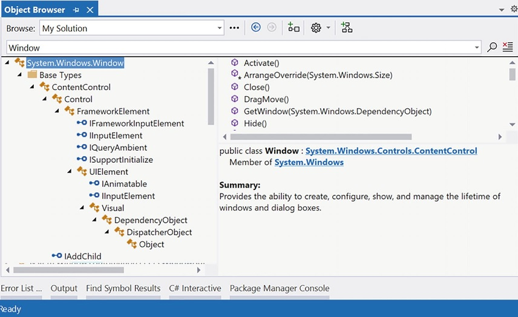
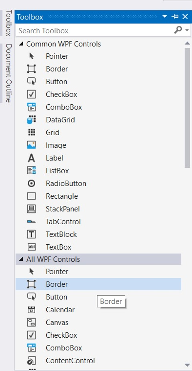
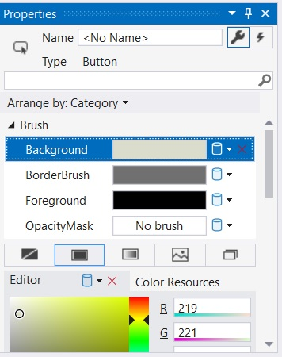
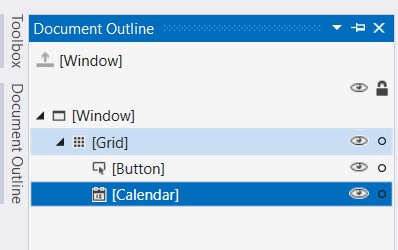
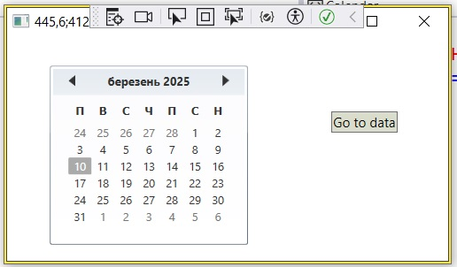

# Знайомство з Windows Presentation Foundation і XAML

# Мотивація що до WPF

Протягом багатьох років Microsoft створила численні набори інструментів для графічного інтерфейсу користувача (розробка необроблених C/C++/Windows API, VB6, MFC тощо) для створення виконуваних файлів для робочого столу. Кожен із цих API забезпечував базу коду для представлення основних аспектів програми GUI, включаючи головні вікна, діалогові вікна, елементи керування, системи меню тощо. З першим випуском платформи .NET API Windows Forms швидко став кращою моделлю для розробки інтерфейсу користувача, враховуючи його просту, але потужну об’єктну модель.
Хоча багато повнофункціональних настільних додатків було успішно створено за допомогою Windows Forms, справа в тому, що ця модель програмування досить асиметрична. Простіше кажучи, System.Windows.Forms.dll і System.Drawing.dll не забезпечують пряму підтримку багатьох додаткових технологій, необхідних для створення багатофункціональної настільної програми. Щоб проілюструвати цю тезу, розглянемо спеціальну природу розробки GUI робочого столу до випуску WPF.

Рішення до WPF для бажаних функцій
|Бажана функціональність|Технології|
|-----------------------|----------|
|Building windows with controls|Windows Forms|
|2D graphics support|GDI+ (System.Drawing.dll)|
|3D graphics support|DirectX APIs|
|Support for streaming video|Windows Media Player APIs|
|Support for flow-style documents|Programmatic manipulation of PDF files|

Як бачите, розробник Windows Forms повинен використовувати типи з кількох непов’язаних API та об’єктних моделей. Хоча це правда, що використання цих різноманітних API може виглядати схожим синтаксично (зрештою, це просто код C#), ви також можете погодитися, що кожна технологія вимагає кардинально іншого мислення. Наприклад, навички, необхідні для створення тривимірної анімації за допомогою DirectX, повністю відрізняються від тих, які використовуються для прив’язки даних до сітки. Програмісту Windows Forms важко освоїти різноманітність кожного API.

## Уніфікація різноманітних API

WPF був навмисно створений, щоб об’єднати ці раніше непов’язані завдання програмування в єдину уніфіковану об’єктну модель. Таким чином, якщо вам потрібно створити 3D-анімацію, вам не потрібно вручну програмувати DirectX API (хоча ви могли б), оскільки 3D-функціональність записана безпосередньо в WPF. Щоб побачити, наскільки добре все покращилося, розгляньте таблицю, яка ілюструє модель розробки робочого столу, започатковану з .NET 3.0.

Рішення для досягнення бажаних функцій
|Бажана функціональність|Технології|
|-----------------------|----------|
|Building windows with controls|WPF|
|2D graphics support|WPF|
|3D graphics support|WPF|
|Support for streaming video|WPF|
|Support for flow-style documents|WPF|

Очевидна перевага тут полягає в тому, що програмісти .NET тепер мають єдиний симетричний API для всіх звичайних потреб програмування графічного інтерфейсу настільного комп’ютера. Після того як ви навчитеся працювати з ключовими збірками WPF і граматикою XAML, ви будете вражені тим, як швидко ви можете створювати складні інтерфейси користувача.

## Забезпечення розділення інтересів через XAML

Можливо, однією з найбільш переконливих переваг є те, що WPF забезпечує спосіб чіткого відділення зовнішнього вигляду програми з графічним інтерфейсом користувача від логіки програмування, яка ним керує. Використовуючи XAML, можна визначити інтерфейс програми за допомогою розмітки XML. Цю розмітку (ідеально згенеровану за допомогою таких інструментів, як Microsoft Visual Studio або Blend for Visual Studio) можна потім підключити до пов’язаного файлу коду C#, щоб надати основні функції програми.

XAML не обмежується додатками WPF. Будь-яка програма може використовувати XAML для опису дерева об’єктів .NET, навіть якщо вони не мають нічого спільного з видимим інтерфейсом користувача.

Розбираючись у WPF, ви можете бути здивовані, скільки гнучкості надає ця «розмітка робочого столу». XAML дозволяє визначати не лише прості елементи інтерфейсу користувача (кнопки, сітки, поля зі списками тощо) у розмітці, але й інтерактивну 2D- і 3D-графіку, анімацію, логіку зв’язування даних і мультимедійні функції (такі як відтворення відео). 
XAML також дозволяє легко налаштувати спосіб відображення візуального вигляду елемента керування. Наприклад, визначення круглої кнопки, яка анімує логотип вашої компанії, вимагає лише кількох рядків розмітки. Елементи керування WPF можна змінювати за допомогою стилів і шаблонів, що дозволяє вам змінювати загальний вигляд програми з мінімальною суєтою та турботою. На відміну від розробки Windows Forms, єдиною вагомою причиною створення спеціального елемента керування WPF з нуля є те, що вам потрібно змінити поведінку елемента керування (наприклад, додати спеціальні методи, властивості чи події; створити підклас існуючого елемента керування, щоб замінити віртуальні члени). Якщо вам просто потрібно змінити зовнішній вигляд елемента керування (знову ж таки, як кругла анімована кнопка), ви можете зробити це повністю за допомогою розмітки.

## Надання оптимізованої моделі візуалізації

Набори інструментів графічного інтерфейсу користувача, такі як Windows Forms, MFC або VB6, виконували всі запити на графічне відтворення (включно з відтворенням елементів інтерфейсу користувача, таких як кнопки та поля зі списками), використовуючи низькорівневий API на основі C (GDI), який був частиною ОС Windows протягом багатьох років. GDI забезпечує адекватну продуктивність для типових бізнес-додатків або простих графічних програм; однак, якщо програма інтерфейсу користувача потребує підключення до високопродуктивної графіки, потрібен DirectX.
Модель програмування WPF зовсім інша, оскільки GDI не використовується під час відтворення графічних даних. Усі операції візуалізації (наприклад, 2D-графіка, 3D-графіка, анімація, керування рендерингом тощо) тепер використовують DirectX API. Перша очевидна перевага полягає в тому, що ваші програми WPF автоматично скористаються оптимізацією апаратного та програмного забезпечення. Крім того, програми WPF можуть використовувати різноманітні графічні служби (ефекти розмиття, згладжування, прозорість тощо) без складності програмування безпосередньо в DirectX API.

Хоча WPF направляє всі запити рендерингу на рівень DirectX, я не хочу припускати, що програма WPF працюватиме так само швидко, як створення програми за допомогою безпосереднього використання некерованих C++ і DirectX. Хоча з кожним випуском WPF було досягнуто значних успіхів у продуктивності, якщо ви збираєтеся створювати настільну програму, яка потребує найшвидшої швидкості виконання (наприклад, 3D-відеоігри), некеровані C++ і DirectX залишаються найкращим підходом.

## Спрощення складного програмування UI

Підсумовуючи історію до цього моменту, Windows Presentation Foundation (WPF) — це API для створення настільних програм, який об’єднує різні настільні API в єдину об’єктну модель і забезпечує чітке розділення проблем за допомогою XAML. На додаток до цих основних моментів програми WPF також мають переваги від простого способу інтеграції служб у ваші програми, які історично були досить складними для обліку. Нижче наведено короткий виклад основних функцій WPF:

1. Кілька менеджерів макета (набагато більше, ніж Windows Forms), щоб забезпечити надзвичайно гнучкий контроль над розміщенням і зміною позиції вмісту.
2. Використання розширеного механізму прив’язки даних для прив’язки вмісту до елементів інтерфейсу користувача різними способами.
3. Вбудований механізм стилів, який дозволяє визначати «теми» для програми WPF.
4. Використання векторної графіки, яка дозволяє автоматично змінювати розмір вмісту відповідно до розміру та роздільної здатності екрана, на якому розміщено програму.
5. Підтримка 2D і 3D графіки, анімації, а також відтворення відео та аудіо.
6. Насичений API типографіки, наприклад підтримка документів XML Paper Specification (XPS), фіксованих документів (WYSIWYG), потокових документів і анотацій документів (наприклад, Sticky Notes API).
7. Підтримка взаємодії із застарілими моделями GUI (наприклад, Windows Forms, ActiveX і Win32 HWND). Наприклад, ви можете включити власні елементи керування Windows Forms у програму WPF і навпаки.

Тепер, коли ви маєте деяке уявлення про те, що дає WPF, давайте розглянемо різні типи програм, які можна створити за допомогою цього API. Багато з цих функцій будуть детально розглянуті в наступних розділах.

# Дослідження збірок WPF

Зрештою, WPF — це трохи більше, ніж набір типів, об’єднаних у збірки .NET. У таблиці описано ключові збірки, які використовуються для створення програм WPF, на кожну з яких необхідно посилатися під час створення нового проекту. Як і слід було сподіватися, проекти WPF автоматично посилаються на ці необхідні збірки.

Основні збірки WPF
|Збірка|Опис |
|------|-----|
|PresentationCore|Ця збірка визначає численні простори імен, які складають основу рівня GUI WPF.Наприклад, ця збірка містить підтримку WPF Ink API, примітивів анімації та численних типів графічного відтворення.|
|PresentationFramework|Ця збірка містить більшість елементів керування WPF, класи Application і Window, підтримку інтерактивної 2D-графіки та численні типи, що використовуються для зв’язування даних.|
|System.Xaml.dll|Ця збірка надає простори імен, які дозволяють програмувати документ XAML під час виконання. Загалом, ця бібліотека корисна, лише якщо ви розробляєте інструменти підтримки WPF або вам потрібен абсолютний контроль над XAML під час виконання.|
|WindowsBase.dll|Ця збірка визначає типи, які складають інфраструктуру API WPF, включаючи ті, що представляють типи потоків WPF, типи безпеки, різні перетворювачі типів і підтримку властивостей залежностей і маршрутизованих подій|

Разом ці чотири збірки визначають нові простори імен і класи, інтерфейси, структури, перерахування та делегати .NET.

Таблиця описує роль деяких (але, звичайно, не всіх) важливих просторів імен.

Основні простори імен WPF

|Простір імен|Опис|
|------------|----|
|System.Windows|Це кореневий простір імен WPF. Тут ви знайдете основні класи (такі як Application і Window), які потрібні для будь-якого робочого проекту WPF.|
|System.Windows.Controls|Він містить усі очікувані віджети WPF, включаючи типи для створення систем меню, підказки та численні менеджери макета.|
|System.Windows.Data|Він містить типи для роботи з механізмом прив’язки даних WPF, а також підтримку шаблонів прив’язки даних.|
|System.Windows.Documents|Він містить типи для роботи з API документів, який дозволяє інтегрувати функціональні можливості у стилі PDF у ваші програми WPF за допомогою протоколу XML Paper Specification (XPS).|
|System.Windows.Ink|Це забезпечує підтримку Ink API, який дозволяє отримувати дані, введені стилусом або мишею, реагувати на жести введення тощо. Це корисно для програмування планшетного ПК; однак будь-який WPF може використовувати цей API.|
|System.Windows.Markup|Цей простір імен визначає кілька типів, які дозволяють розмітку XAML (і еквівалентний двійковий формат, BAML) аналізувати та обробляти програмним шляхом.|
|System.Windows.Media|Це кореневий простір імен для кількох орієнтованих на медіа просторів імен. У цих просторах імен ви знайдете типи для роботи з анімацією, 3D-рендерінгом, текстовим рендерингом та іншими мультимедійними елементами.|
|System.Windows.Navigation|Цей простір імен надає типи для врахування логіки навігації, яка використовується програмами браузера XAML (XBAP), а також стандартними програмами для робочого столу, які потребують моделі навігаційної сторінки.|
|System.Windows.Shapes|Це визначає класи, які дозволяють відтворювати інтерактивну двовимірну графіку, яка автоматично реагує на введення мишею.|

Щоб розпочати вашу подорож до моделі програмування WPF, ви вивчите два члени простору імен System.Windows, які є звичайними для будь-якої традиційної розробки настільних комп’ютерів: Application і Window.

## Роль класу Application 

Клас System.Windows.Application представляє глобальний екземпляр запущеної програми WPF. Цей клас надає метод Run() (для запуску програми), ряд подій, які ви можете обробляти, щоб взаємодіяти з часом життя програми (наприклад, запуск і вихід).

Ключові властивості типу Application
|Властивість| Значення в житті|
|--------|-----------------|
|Current|Ця статична властивість дозволяє отримати доступ до запущеного об’єкта Application з будь-якої точки коду.Це може бути корисно, коли вікно або діалогове вікно потребує доступу до об’єкта Application, який його створив, як правило, для доступу до змінних всієї програми та її функціональності.|
|MainWindow|Ця властивість дозволяє програмно отримати або встановити головне вікно програми.|
|Properties|Ця властивість дозволяє створювати та отримувати дані, доступні в усіх аспектах програми WPF (вікна, діалогові вікна тощо).|
|StartupUri|Ця властивість отримує або встановлює URI, який визначає вікно або сторінку, які автоматично відкриваються під час запуску програми.|
|Windows|Ця властивість повертає тип WindowCollection, який забезпечує доступ до кожного вікна, створеного потоком, який створив об’єкт Application.Це може бути корисно, коли ви хочете повторити кожне відкрите вікно програми та змінити його стан (наприклад, згорнути всі вікна).|

## Створимо простий проект.

В Visual Studio створійть проект типу WPF Application (не вибирацте WPF Application (.NET Framework)) з назвою MyApp.  


## Побудова класу Application

Будь-яка програма WPF повинна буде визначити клас, який розширює Application. В цому класі ви можете перевизначити події запуску та закінчення програми. Змініть файл App.xaml.cs

```cs
    public partial class App : Application
    {

        protected override void OnStartup(StartupEventArgs e)
        {
            base.OnStartup(e);
            Console.Beep();
        }

        protected override void OnExit(ExitEventArgs e)
        {
            base.OnExit(e);
            Console.Beep();
        }
    }
```
У обробнику запуску ви найчастіше оброблятимете будь-які вхідні аргументи командного рядка та запускатимете головне вікно програми. Обробник виходу, як і слід було очікувати, є місцем, де ви можете створити будь-яку необхідну логіку завершення роботи програми (наприклад, зберегти налаштування користувача, записати до реєстру Windows).

## Перерахування колекції Windows

Іншою цікавою властивістю, яку відкриває Application, є Windows, яка надає доступ до колекції, що представляє кожне вікно, завантажене в пам’ять для поточної програми WPF. Коли ви створюєте нові об’єкти Window, вони автоматично додаються до колекції Application.Windows. Ось приклад методу, який мінімізує кожне вікно програми (можливо, у відповідь на певний жест клавіатури або параметр меню, активований кінцевим користувачем):

```cs
static void MinimizeAllWindows()
{
  foreach (Window wnd in Application.Current.Windows)
  {
    wnd.WindowState = WindowState.Minimized;
  }
}
```
Давайте перевіримо основні функції типу Window і дізнаємося про низку важливих базових класів WPF у цьому процесі.

## Роль класу Window

Клас System.Windows.Window (розташований у збірці PresentationFramework.dll) представляє одне вікно, що належить класу, похідному від Application, включаючи будь-які діалогові вікна, які відображає головне вікно. Не дивно, що Window має серію батьківських класів, кожен з яких надає більше функціональних можливостей. Розглянемо малюнок, який показує ланцюжок успадкування (і реалізовані інтерфейси) для System.Windows.Window, як це видно через браузер об’єктів Visual Studio.

Ієрархія класу Window


Ви зрозумієте функціональні можливості багатьох із цих базових класів у міру проходження цієї глави та наступних глав. Однак, щоб розпалити ваш апетит, у наступних розділах представлено розбивку функціональних можливостей, які надає кожен базовий клас (зверніться до документації .NET, щоб дізнатися більше).

## Роль System.Windows.Controls.ContentControl

Прямим батьком Window є ContentControl, який, можливо, є найпривабливішим з усіх класів WPF. Цей базовий клас надає похідним типам можливість розміщувати окремий фрагмент вмісту, який, простіше кажучи, посилається на візуальні дані, розміщені всередині поверхні елемента керування за допомогою властивості Content. Модель вмісту WPF дозволяє досить просто налаштувати основний вигляд елемента керування вмістом. 
Наприклад, коли ви думаєте про типовий елемент керування «кнопка», ви схильні припускати, що вміст є простим рядковим літералом (OK, Cancel, Abort тощо). Якщо ви використовуєте XAML для опису елемента керування WPF і значення, яке ви хочете призначити властивості Content, можна зафіксувати як простий рядок, ви можете встановити властивість Content у початковому визначенні елемента таким чином (не турбуйтеся про точну розмітку на цьому етапі):


```xml
<!-- Setting the Content value in the opening element -->
<Button Height='80' Width='100' Content='OK'/>
```

Властивість Content також можна встановити в коді C#, що дозволяє змінювати внутрішню частину елемента керування під час виконання. 
Однак контент може бути практично будь-яким. Наприклад, скажімо, ви хочете мати «кнопку», яка має щось цікавіше, ніж простий рядок, можливо, спеціальну графіку та текстову рекламу.
Якщо ви хочете призначити властивість Content значенню, яке не можна зафіксувати як простий масив символів, ви не можете призначити його за допомогою атрибута у початковому визначенні елемента керування. Швидше, ви повинні визначити дані вмісту неявно, в межах елемента. Наприклад, наступний Button містить StackPanel як вміст, який сам по собі містить деякі унікальні дані (точніше, Ellipse і Label):

```xml
<Button Grid.Row="1" Height='80' Width='100'>
    <StackPanel>
        <Ellipse Fill='Red' Width='25' Height='25'/>
        <Label Content ='OK!'/>
    </StackPanel>
</Button>
```

Ви також можете використовувати синтаксис властивості-елемента XAML для встановлення складного вмісту. Розглянемо наступне функціонально еквівалентне визначення Button, яке встановлює властивість Content явно за допомогою синтаксису елемента властивості (знову ж таки, ви знайдете більше інформації про XAML далі в цій главі, тому поки що не переймайтесь деталями):

```xml
<!-- Setting the Content property using property-element syntax -->
<Button Height='80' Width='100'>
  <Button.Content>
    <StackPanel>
      <Ellipse Fill='Red' Width='25' Height='25'/>
      <Label Content ='OK!'/>
    </StackPanel>
  </Button.Content>
</Button>
```
Майте на увазі, що не кожен елемент WPF походить від ContentControl і, отже, не всі елементи керування підтримують цю унікальну модель вмісту (однак більшість підтримує). Крім того, деякі елементи керування WPF додають кілька уточнень до базової моделі вмісту, яку ви щойно розглянули.

## Роль System.Windows.Controls.Control

На відміну від ContentControl, усі елементи керування WPF спільно використовують базовий клас Control як загального батька. Цей базовий клас містить численні основні елементи, які відповідають за базову функціональність інтерфейсу користувача. Наприклад, Control визначає властивості для встановлення розміру елемента керування, непрозорості, логіки порядку табуляції, курсору відображення, кольору фону тощо. Крім того, цей батьківський клас забезпечує підтримку служб шаблонів. Елементи керування WPF можуть повністю змінити спосіб відтворення свого вигляду за допомогою шаблонів і стилів.

Ключові члени типу Control

|Член|Опис|
|----|----|
|Background, Foreground, BorderBrush, BorderThickness, Padding, HorizontalContentAlignment, VerticalContentAlignment|Ці властивості дозволяють установити основні параметри щодо того, як елемент керування буде відображено та розміщено.|
|FontFamily, FontSize, FontStretch, FontWeight|Ці властивості керують різними параметрами, орієнтованими на шрифти.|
|IsTabStop, TabIndex|Ці властивості використовуються для встановлення порядку вкладок між елементами керування у вікні.|
|MouseDoubleClick, PreviewMouseDoubleClick|Ці події обробляють акт подвійного клацання віджета.|
|Template|Ця властивість дозволяє отримати та налаштувати шаблон елемента керування, який можна використовувати для зміни виводу візуалізації віджета.|


## Роль System.Windows.FrameworkElement

Цей базовий клас надає низку членів, які використовуються фреймворком WPF, наприклад підтримку розкадровки (використовується в анімаціях) і підтримку зв’язування даних, а також можливість іменувати член (через властивість Name), отримувати будь-які ресурси, визначені похідним типом, і встановлювати загальні розміри похідного типу.

|Член|Опис|
|----|----|
|ActualHeight, ActualWidth, MaxHeight, MaxWidth, MinHeight, MinWidth, Height, Width|Ці властивості керують розміром похідного типу.|
|ContextMenu|Отримує або встановлює спливаюче меню, пов’язане з похідним типом.|
|Cursor|Отримує або встановлює курсор миші, пов’язаний із похідним типом.|
|HorizontalAlignment, VerticalAlignment|Отримує або встановлює, як тип розташовується всередині контейнера (наприклад, панелі чи списку).|
|Name|Дозволяє призначити назву типу, щоб отримати доступ до його функцій у файлі коду.|
|Resources|Надає доступ до будь-яких ресурсів, визначених типом (перегляньте главу для вивчення системи ресурсів WPF).|
|ToolTip|Отримує або встановлює спливаючу підказку, пов’язану з похідним типом.|


## Роль System.Windows.UIElement

З усіх типів у ланцюжку успадкування Window базовий клас UIElement забезпечує найбільшу кількість функціональних можливостей. Ключове завдання UIElement — забезпечити похідний тип численними подіями, щоб дозволити похідному типу отримувати фокус і обробляти вхідні запити. Наприклад, цей клас забезпечує численні події для обліку операцій перетягування, руху миші, введення з клавіатури, введення стилусом і дотику. У наступному розділі детально розглядається модель подій WPF; однак багато з основних подій виглядатимуть досить знайомими (MouseMove, KeyUp, MouseDown, MouseEnter, MouseLeave тощо). На додаток до визначення десятків подій, цей батьківський клас надає кілька властивостей для врахування фокусу керування, увімкненого стану, видимості та логіки перевірки попадання, як показано в таблиці.

Ключові члени типу UIElement
|Член|Опис|
|----|----|
|Focusable, IsFocused|Ці властивості дозволяють встановити фокус на даному похідному типі.|
|IsEnabled|Ця властивість дозволяє контролювати, увімкнено чи вимкнено даний похідний тип.|
|IsMouseDirectlyOver, IsMouseOver|Ці властивості забезпечують простий спосіб виконання логіки перевірки попадання.|
|IsVisible, Visibility|Ці властивості дозволяють вам працювати з налаштуванням видимості похідного типу.|
|RenderTransform|Ця властивість дозволяє встановити перетворення, яке використовуватиметься для візуалізації похідного типу.|


## Роль System.Windows.Media.Visual

Тип класу Visual забезпечує основну підтримку візуалізації в WPF, яка включає тестування графічних даних на попадання, перетворення координат і обчислення обмежувальної рамки. Насправді клас Visual взаємодіє з базовою підсистемою DirectX для відображення даних на екрані. Як ви розглянете в спеціальній главі, WPF надає три можливі способи відтворення графічних даних, кожен з яких відрізняється за функціональністю та продуктивністю. Використання типу Visual (і його дочірніх елементів, наприклад DrawingVisual) забезпечує найпростіший спосіб візуалізації графічних даних, але також передбачає найбільшу кількість ручного коду для врахування всіх необхідних служб.

## Роль System.Windows.DependencyObject

WPF підтримує певний різновид властивостей .NET, які називаються властивостями залежностей. Простіше кажучи, цей стиль властивості надає додатковий код, щоб дозволити властивості реагувати на кілька технологій WPF, таких як стилі, зв’язування даних, анімація тощо. Щоб тип підтримував цю нову схему властивостей, він повинен походити від базового класу DependencyObject. Хоча властивості залежностей є ключовим аспектом розробки WPF, більшу частину часу їхні деталі приховані від очей.

## The Role of System.Windows.Threading.DispatcherObject

Базовим класом типу Window (крім System.Object) є DispatcherObject. Цей тип надає цікаву властивість Dispatcher, яка повертає пов’язаний об’єкт System.Windows.Threading.Dispatcher. Клас Dispatcher є точкою входу до черги подій програми WPF, і він надає основні конструкції для роботи з паралельним виконанням і потоками. Клас Dispatcher досліджувався в розділі "Багатопотокове, паралельне та асинхронне програмування".

# Розуміння синтаксису WPF XAML

Згідно документації Microsoft XAML є декларативною мовою розмітки. У застосуванні до моделі програмування .NET XAML спрощує створення інтерфейсу користувача для програми .NET. Ви можете створити видимі елементи інтерфейсу користувача в декларативній розмітці XAML, а потім відокремити визначення інтерфейсу користувача від логіки часу виконання за допомогою файлів коду, які приєднуються до розмітки через часткові визначення класів. XAML безпосередньо представляє екземпляри об’єктів у певному наборі резервних типів, визначених у збірках. Це не схоже на більшість інших мов розмітки, які зазвичай є інтерпретованою мовою без такого прямого зв’язку з системою резервного типу. XAML забезпечує робочий процес, у якому окремі сторони можуть працювати над інтерфейсом користувача та логікою програми, використовуючи потенційно різні інструменти.

Додатки WPF на виробничому рівні зазвичай використовують спеціальні інструменти для створення необхідного XAML. Незважаючи на те, що ці інструменти корисні, варто зрозуміти загальну структуру розмітки XAML. Додамо проект UnderstandingTheSyntaxOfXAML

```xml
<Window x:Class="UnderstandingTheSyntaxOfXAML.MainWindow"
        //...
        Title="MainWindow" Height="450" Width="800">
    <Grid>

    </Grid>
</Window>
```
Вікно містить різноманітні менеджери компонування та елементи керування. Для початкового тестування введіть таку розмітку :

```xml
<Window x:Class="UnderstandingTheSyntaxOfXAML.MainWindow"
        //...
        Title="MainWindow" Height="450" Width="800">
    <Grid>
        <!-- A button with custom content -->
        <Button Height='100' Width='100'>
            <Ellipse Fill='Green' Height='50' Width='50'/>
        </Button>

    </Grid>
</Window>

```

## Простори імен XAML XML і «Ключові слова» XAML

Кореневий елемент документа WPF XAML (наприклад, визначення Window, UserControl або Application) майже завжди посилатиметься на такі два попередньо визначені простори імен XML:

```xml
<Window x:Class="UnderstandingTheSyntaxOfXAML.MainWindow"
        xmlns="http://schemas.microsoft.com/winfx/2006/xaml/presentation"
        xmlns:x="http://schemas.microsoft.com/winfx/2006/xaml"
        //...
        Title="MainWindow" Height="450" Width="800">
        //...
</Window>

```

Перший простір імен XML, http://schemas.microsoft.com/winfx/2006/xaml/presentation, відображає низку просторів імен WPF .NET для використання поточним файлом *.xaml (System.Windows, System.Windows.Controls, System.Windows.Data, System.Windows.Ink, System.Windows.Media, System.Windows.Navigation тощо). Це відображення один-до-багатьох жорстко закодовано в збірках WPF (WindowsBase.dll, PresentationCore.dll і PresentationFramework.dll) за допомогою атрибута [XmlnsDefinition] на рівні збірки. Наприклад, якщо ви відкриєте браузер об’єктів Visual Studio та виберете збірку PresentationCore.dll, ви побачите такі списки, які, по суті, імпортують System.Windows:

```
[assembly: XmlnsDefinition('http://schemas.microsoft.com/winfx/2006/xaml/presentation',
                           'System.Windows')]
```
Другий простір імен XML, http://schemas.microsoft.com/winfx/2006/xaml, використовується для включення специфічних для XAML «ключових слів» (через відсутність кращого терміну), а також для включення простору імен System.Windows.Markup, як показано нижче:

```
[assembly: XmlnsDefinition('http://schemas.microsoft.com/winfx/2006/xaml',
                           'System.Windows.Markup')]
```

Одне з правил будь-якого добре сформованого XML-документа (пам’ятайте, XAML — це граматика на основі XML) полягає в тому, що початковий кореневий елемент призначає один простір імен XML як основний простір імен, який є простором імен, який містить найбільш поширені елементи. 
Якщо кореневий елемент вимагає включення додаткових вторинних просторів імен (як показано тут), вони повинні бути визначені за допомогою унікального префікса тегу (щоб вирішити будь-які можливі конфлікти імен). За згодою, префікс просто x; однак це може бути будь-який необхідний унікальний маркер, наприклад XamlSpecificStuff.

```xml
<Window x:Class="UnderstandingTheSyntaxOfXAML.MainWindow"

        //...
        xmlns:XamlSpecificStuff="http://schemas.microsoft.com/winfx/2006/xaml"
        //...
        >
   
        <!-- A button with custom content -->
        <Button XamlSpecificStuff:Name="button1" Height='100' Width='100'>
            <Ellipse Fill='Green' Height='50' Width='50'/>
        </Button>
</Window>
```
Очевидним недоліком визначення багатослівних префіксів простору імен XML є те, що вам потрібно вводити XamlSpecificStuff кожного разу, коли ваш файл XAML має посилатися на один із елементів, визначених у цьому орієнтованому на XAML просторі імен XML. З огляду на те, що XamlSpecificStuff вимагає багато додаткових натискань клавіш, просто дотримуйтесь x. 
У будь-якому випадку, окрім ключових слів x:Name, x:Class і x:Code, http://schemas.microsoft.com/winfx/2006/xaml простір імен XML також надає доступ до додаткових ключових слів XAML, найпоширеніші з яких наведено в таблиці.

Ключові слова XAML

|Ключові слова|Опис|
|-------------|----|
|x:Array|Представляє тип масиву .NET у XAML.|
|x:ClassModifier|Дозволяє визначити видимість класу C# (internal чи public), позначеного ключовим словом Class.|
|x:FieldModifier|Дозволяє визначати видимість члена типу (внутрішнього, загальнодоступного, приватного або захищеного) для будь-якого іменованого піделемента кореня (наприклад, Button в елементі Window).Іменований елемент визначається за допомогою ключового слова XAML Name.|
|x:Key|Дозволяє встановити значення ключа для елемента XAML, який буде розміщено в елементі словника.|
|x:Name|Дозволяє вказати згенероване ім’я C# даного елемента XAML.|
|x:Null|Представляє нульове посилання.|
|x:Static|Дозволяє посилатися на статичний член типу.|
|x:Type|XAML-еквівалент оператора C# typeof (він дасть System.Type на основі наданого імені).|
|x:TypeArguments|Дозволяє встановити елемент як загальний тип із певним параметром типу (наприклад, List<int> проти List<bool>).|

На додаток до цих двох необхідних декларацій простору імен XML, можливо, а іноді й необхідно, визначити додаткові префікси тегів у початковому елементі документа XAML. Зазвичай ви робите це, коли вам потрібно описати в XAML клас .NET, визначений у зовнішній збірці. Наприклад, припустимо, що ви створили кілька користувацьких елементів керування WPF і запакували їх у бібліотеку під назвою MyControls.dll. Тепер, якщо ви хочете створити нове вікно, яке використовує ці елементи керування, ви можете створити власний простір імен XML, який зіставлятиметься з вашою бібліотекою за допомогою clr-namespace і маркерів assembly. Ось приклад розмітки, яка створює префікс тегу під назвою myCtrls, який можна використовувати для доступу до елементів керування у вашій бібліотеці:

```xml
<Window x:Class="WpfApplication1.MainWindow"
  xmlns:="http://schemas.microsoft.com/winfx/2006/xaml/presentation"
  xmlns:x="http://schemas.microsoft.com/winfx/2006/xaml"
  xmlns:myCtrls="clr-namespace:MyControls;assembly=MyControls"
  Title='MainWindow' Height='350' Width='525'>
  <Grid>
    <myCtrls:MyCustomControl />
  </Grid>
</Window>
```
Маркер clr-namespace  присвоюється імені простору імен .NET у збірці, тоді як маркеру assembly встановлюється зрозуміле ім’я зовнішньої збірки *.dll. Ви можете використовувати цей синтаксис для будь-якої зовнішньої бібліотеки .NET, якою ви хочете керувати в розмітці. Хоча наразі в цьому немає потреби, у наступних розділах вам знадобиться визначити власні оголошення простору імен XML для опису типів у розмітці.

Якщо вам потрібно визначити клас у розмітці, який є частиною поточної збірки, але в іншому просторі імен .NET, ваш префікс тегу xmlns визначається без атрибута assembly=, наприклад: 

```
xmlns:myCtrls='clr-namespace:SomeNamespaceInMyApp'.
```

## Керування видимістю змінної класу та члена

Ви побачите багато з цих ключових слів у дії там, де це буде потрібно, у наступних розділах; однак у якості простого прикладу розглянемо таке визначення XAML <Window>, яке використовує ключові слова ClassModifier і FieldModifier, а також x:Name і x:Class:

```xml
<!-- This class will now be declared internal in the *.g.cs file -->
<Window x:Class='MyWPFApp.MainWindow' x:ClassModifier ='internal'
  xmlns:='http://schemas.microsoft.com/winfx/2006/xaml/presentation'
  xmlns:x='http://schemas.microsoft.com/winfx/2006/xaml'>
  <!-- This button will be public in the *.g.cs file -->
  <Button x:Name ='myButton' x:FieldModifier ='public' Content = 'OK'/>
</Window>
```
За замовчуванням усі визначення типів C#/XAML є public, тоді як учасники за замовчуванням є internal. Однак, виходячи з вашого визначення XAML, отриманий автоматично згенерований файл містить внутрішній тип класу з загальнодоступною змінною Button.

```cs
internal partial class MainWindow : System.Windows.Window,
  System.Windows.Markup.IComponentConnector
{
  public System.Windows.Controls.Button myButton;
//...
}
```

## Елементи XAML, атрибути XAML і перетворювачі типів

Після того, як ви створили свій кореневий елемент і будь-які необхідні простори імен XML, вашим наступним завданням буде заповнити кореневий елемент дочірнім елементом. У реальній програмі WPF дочірній елемент буде менеджером макета (наприклад, Grid або StackPanel), який, у свою чергу, містить будь-яку кількість додаткових елементів інтерфейсу користувача, які описують інтерфейс користувача. У наступному розділі детально розглядаються ці менеджери макета, тож поки припустімо, що ваш тип <Window> міститиме один елемент Button. Як ви вже бачили в цій главі, елементи XAML відображаються на тип класу або структури в заданому просторі імен .NET, тоді як атрибути в тегу відкриваючого елемента відображаються на властивості або події типу.

```xml
<Window x:Class="UnderstandingTheSyntaxOfXAML.MainWindow"
        xmlns="http://schemas.microsoft.com/winfx/2006/xaml/presentation"
        xmlns:x="http://schemas.microsoft.com/winfx/2006/xaml"
        xmlns:d="http://schemas.microsoft.com/expression/blend/2008"
        xmlns:mc="http://schemas.openxmlformats.org/markup-compatibility/2006"
        xmlns:local="clr-namespace:UnderstandingTheSyntaxOfXAML"
        xmlns:XamlSpecificStuff="http://schemas.microsoft.com/winfx/2006/xaml"
        mc:Ignorable="d"
        Title="MainWindow" Height="450" Width="800">
    <Grid>
        <Button Height="50" Width="100" Content="OK!"
            FontSize="20" Background="Green" Foreground="Yellow"/>
    </Grid>
</Window>
```
Зверніть увагу, що значення, призначені кожній властивості, були записані як просте текстове значення. Це може здатися повною невідповідністю типів даних, тому що якби ви створили цю кнопку в коді C#, ви б не призначали рядкові об’єкти цим властивостям, а використовували б певні типи даних. Наприклад, ось та сама кнопка, створена в коді:

```cs
public void MakeAButton()
{
  Button myBtn = new Button();
  myBtn.Height = 50;
  myBtn.Width = 100;
  myBtn.FontSize = 20;
  myBtn.Content = 'OK!';
  myBtn.Background = new SolidColorBrush(Colors.Green);
  myBtn.Foreground = new SolidColorBrush(Colors.Yellow);
}
```
WPF постачається з кількома класами конвертера типів, які використовуватимуться для перетворення простих текстових значень у правильний базовий тип даних. Цей процес відбувається прозоро та автоматично.
Буде багато випадків, коли вам потрібно буде призначити набагато складніше значення атрибуту XAML, яке неможливо зафіксувати як простий рядок. Наприклад, скажімо, ви хочете створити спеціальний пензель, щоб встановити властивість Background кнопки. Якщо ви будуєте кисть у коді, це досить просто, як показано тут:

```cs
public void MakeAButton()
{
...
  // A fancy brush for the background.
  LinearGradientBrush fancyBruch =
    new LinearGradientBrush(Colors.DarkGreen, Colors.LightGreen, 45);
  myBtn.Background = fancyBruch;
  myBtn.Foreground = new SolidColorBrush(Colors.Yellow);
}
```
Як ви можете представити ваш складний пензель у вигляді струни? Ну не можна! На щастя, XAML надає спеціальний синтаксис, який можна використовувати щоразу, коли потрібно призначити значення властивості складному об’єкту, що називається синтаксисом елемента властивості.

## Розуміння синтаксису властивості-елемента XAML

Синтаксис елемента властивості дозволяє призначати властивості складні об’єкти. Ось XAML-опис кнопки, яка використовує LinearGradientBrush для встановлення властивості Background:

```xml
<Button Height='50' Width='100' Content='OK!'
        FontSize='20' Foreground='Yellow'>
  <Button.Background>
    <LinearGradientBrush>
      <GradientStop Color='DarkGreen' Offset='0'/>
      <GradientStop Color='LightGreen' Offset='1'/>
    </LinearGradientBrush>
  </Button.Background>
</Button>
```

Зверніть увагу, що в межах тегу Button ви визначили підобласть під назвою Button.Background. У межах цієї області ви визначили настроюваний LinearGradientBrush. (Не турбуйтеся про точний код для пензля; ви дізнаєтесь про графіку WPF у наступних главах). 
Будь-яку властивість можна встановити за допомогою синтаксису елемента властивості, який завжди розбивається на наступний шаблон:

```xml
<DefiningClass>
  <DefiningClass.PropertyOnDefiningClass>
    <!-- Value for Property here! -->
  </DefiningClass.PropertyOnDefiningClass>
</DefiningClass>
```
Хоча будь-яку властивість можна встановити за допомогою цього синтаксису, якщо ви можете захопити значення як простий рядок, ви заощадите час на введення. Наприклад, ось набагато більш докладний спосіб встановити ширину вашої кнопки:

```xml
<Button Height='50' Content='OK!'
        FontSize='20' Foreground='Yellow'>
...
  <Button.Width>
    100
  </Button.Width>
</Button>
```

## Розуміння приєднаних властивостей XAML

Окрім синтаксису елемента властивості, XAML визначає спеціальний синтаксис, який використовується для встановлення значення доданої властивості. По суті, прикріплена властивість дозволяє дочірньому елементу встановлювати значення для властивості, яка визначена в батьківському елементі. Загальний шаблон, якого слід дотримуватися, виглядає так:

```xml
<ParentElement>
  <ChildElement ParentElement.PropertyOnParent = 'Value'>
</ParentElement>
```
Найпоширенішим використанням синтаксису приєднаних властивостей є розміщення елементів інтерфейсу користувача в одному з класів менеджера макета WPF (Grid, DockPanel тощо).

```xml
  <Canvas Height='200' Width='200' Background='LightBlue'>
    <Ellipse Canvas.Top='40' Canvas.Left='40' Height='20' Width='20' Fill='DarkBlue'/>
  </Canvas>
```
Тут ви визначили менеджер макета Canvas, який містить еліпс. Зауважте, що Ellipse може повідомити своєму батьківському елементу (Canvas), де розташувати свою верхню ліву позицію, використовуючи доданий синтаксис властивостей. 
Є кілька пунктів, про які слід знати щодо приєднаних властивостей. Перш за все, це не універсальний синтаксис, який можна застосувати до будь-якої властивості будь-якого батька. Наприклад, такий XAML не можна проаналізувати без помилок:

```xml
<!-- Error! Set Background property on Canvas via attached property? -->
<Canvas Height='200' Width='200'>
  <Ellipse Canvas.Background='LightBlue'
           Canvas.Top='40' Canvas.Left='90'
           Height='20' Width='20' Fill='DarkBlue'/>
</Canvas>
```
Прикріплені властивості є спеціалізованою формою специфічної для WPF концепції, яка називається властивістю залежностей. Якщо властивість не було реалізовано певним чином, ви не можете встановити її значення за допомогою доданого синтаксису властивості. Ви детально дослідите властивості залежностей у іншій главі.
У Visual Studio є IntelliSense, який покаже вам дійсні прикріплені властивості, які можна встановити певним елементом.

## Розуміння розширень розмітки XAML

Як пояснювалося, значення властивостей найчастіше представляють за допомогою простого рядка або за допомогою синтаксису елемента властивості. Однак існує інший спосіб вказати значення атрибута XAML, використовуючи розширення розмітки. Розширення розмітки дозволяють аналізатору XAML отримувати значення властивості з виділеного зовнішнього класу. Це може бути корисним, враховуючи, що для визначення значення деяких властивостей потрібно виконати декілька операторів коду.
Розширення розмітки дають змогу чітко розширити граматику XAML за допомогою нових функцій. Розширення розмітки представлено внутрішньо як клас, який походить від MarkupExtension. Зауважте, що ймовірність того, що вам коли-небудь знадобиться створити спеціальне розширення розмітки, буде мінімальною. Однак підмножина ключових слів XAML (таких як x:Array, x:Null, x:Static і x:Type) є прихованими розширеннями розмітки!
Розширення розмітки затиснуто між фігурними дужками, ось так:

```xml
<Element PropertyToSet = '{MarkUpExtension}'/>
```
Щоб побачити деякі розширення розмітки в дії, створіть наступне:

```xml
<Window x:Class="UnderstandingTheSyntaxOfXAML.MainWindow"
        //...

        xmlns:CorLib="clr-namespace:System;assembly=mscorlib"
        Title="MainWindow" Height="450" Width="800">
    <Grid>
        <StackPanel>
            <!-- The Static markup extension lets us obtain a value
         from a static member of a class -->
            <Label Content ="{x:Static CorLib:Environment.OSVersion}"/>
            <Label Content ="{x:Static CorLib:Environment.ProcessorCount}"/>
            <!-- The Type markup extension is a XAML version of
         the C# typeof operator -->
            <Label Content ="{x:Type Button}" />
            <Label Content ="{x:Type CorLib:Boolean}" />
            <!-- Fill a ListBox with an array of strings! -->
            <ListBox Width='200' Height='50'>
                <ListBox.ItemsSource>
                    <x:Array Type="CorLib:String">
                        <CorLib:String>Sun Kil Moon</CorLib:String>
                        <CorLib:String>Red House Painters</CorLib:String>
                        <CorLib:String>Besnard Lakes</CorLib:String>
                    </x:Array>
                </ListBox.ItemsSource>
            </ListBox>
        </StackPanel>
    </Grid>
</Window>

```

По-перше, зауважте, що визначення Window має нову декларацію простору імен XML, яка дозволяє вам отримати доступ до системного простору імен mscorlib.dll. Коли цей простір імен XML встановлено, ви спочатку використовуєте розширення розмітки x:Static і отримуєте значення з OSVersion і ProcessorCount класу System.Environment. 
Розширення розмітки x:Type дозволяє отримати доступ до опису метаданих зазначеного елемента. Тут ви просто призначаєте повні імена типів WPF Button і System.Boolean.
Найцікавішою частиною цієї розмітки є ListBox. Тут ви встановлюєте властивість ItemsSource для масиву рядків, повністю оголошених у розмітці! Зверніть увагу на те, як розширення розмітки x:Array дозволяє вам вказати набір піделементів у його області:

```xml
                    <x:Array Type="CorLib:String">
                        <CorLib:String>Sun Kil Moon</CorLib:String>
                        <CorLib:String>Red House Painters</CorLib:String>
                        <CorLib:String>Besnard Lakes</CorLib:String>
                    </x:Array>
```
Попередній приклад XAML використовується лише для ілюстрації розширення розмітки в дії. Як ви побачите, є набагато простіші способи заповнити елементи керування ListBox!

Тепер ви бачили численні приклади, які демонструють кожен із основних аспектів синтаксису XAML. Як ви можете погодитися, XAML цікавий тим, що він дозволяє описувати дерево об’єктів .NET декларативним способом. Хоча це надзвичайно корисно під час налаштування графічних інтерфейсів користувача, пам’ятайте, що XAML може описати будь-який тип із будь-якої збірки, за умови, що це неабстрактний тип, який містить конструктор за замовчуванням.


# Створення додатків WPF за допомогою Visual Studio

Давайте розглянемо, як Visual Studio може спростити створення програм WPF. Visual Studio з розширеною підтримкою XAML є продуктивним IDE для створення програм WPF.

## Шаблони проекту WPF

Діалогове вікно «New Project» у Visual Studio визначає набір шаблонів проектів WPF, включаючи WPF Application,  WPF Class Library, WPF Custom Control Library і WPF User Control Library. Створіть новий проект програми WPF під назвою WpfTesterApp. Вибираючи проекти WPF на екрані Visual Studio «Add a new project», переконайтеся, що ви вибрали шаблони проектів WPF, у назві яких немає «(.NET Framework)». Якщо вибрати шаблон із «(.NET Framework)» у назві, ви створюватимете свою програму за допомогою .NET Framework 4.x.
Вивчивши файл проекту, ви можете побачити, що SDK встановлено на Microsoft.NET.Sdk. Значення TargetFramework має значення netX.0-windows, і проект створить виконуваний файл, який використовує WPF:

```xml
<Project Sdk="Microsoft.NET.Sdk">

  <PropertyGroup>
    <OutputType>WinExe</OutputType>
    <TargetFramework>net9.0-windows</TargetFramework>
    <Nullable>enable</Nullable>
    <ImplicitUsings>enable</ImplicitUsings>
    <UseWPF>true</UseWPF>
  </PropertyGroup>

</Project>
```
Окрім файлу проекту, шаблон також містить початковий клас, похідний від Window та Application, кожен з яких представлено за допомогою файлу коду XAML і C#.

## Панель інструментів і дизайнер/редактор XAML

Visual Studio надає панель інструментів Toolbox (яку можна відкрити через меню «View»), яка містить численні елементи керування WPF. Верхня частина панелі містить найпоширеніші елементи керування, а нижня містить усі елементи керування.

Панель інструментів містить елементи керування WPF, які можна розмістити на поверхні дізайнера.


Використовуючи стандартну операцію перетягування, ви можете розмістити будь-який із цих елементів керування на поверхні дизайнера вікна або перетягнути елемент керування в редактор розмітки XAML у нижній частині дизайнера.Коли ви це зробите, початковий XAML буде створено від вашого імені. За допомогою миші перетягніть елементи керування Button та  Calendar на поверхню дизайнера. Після того, як ви це зробите, зверніть увагу на те, як ви можете перемістити та змінити розмір своїх елементів керування (і обов’язково перевірте отриманий XAML, створений на основі ваших змін).
Окрім створення інтерфейсу користувача за допомогою миші та панелі інструментів, ви можете вручну ввести розмітку за допомогою вбудованого редактора XAML. Ви отримуєте підтримку IntelliSense, яка може допомогти спростити створення розмітки. Наприклад, спробуйте додати властивість Margin до елемента Calendar. Приділіть кілька хвилин, щоб додати значення властивостей безпосередньо в редакторі XAML. Переконайтеся, що ви знайшли час, щоб навчитися користуватися цим аспектом конструктора WPF.

## Встановлення властивостей за допомогою Window властивостей

Після того, як ви розмістили деякі елементи керування у своєму дизайнері (або вручну визначили їх у редакторі), ви можете скористатися вікном «Properties», щоб установити значення властивостей для вибраного елемента керування, а також налаштувати обробники подій для вибраного елемента керування.
Виберіть елемент керування Button у дизайнері. Тепер скористайтеся вікном «Properties», щоб змінити колір фону кнопки за допомогою інтегрованого редактора пензлів.

Вікно властивостей можна використовувати для налаштування інтерфейсу користувача елемента керування WPF


Вікно містить текстову область пошуку у верхній частині. Введіть назву властивості, яку ви хочете встановити, щоб швидко знайти потрібний елемент. Після того, як ви закінчите працювати з редактором Brushes, перегляньте згенеровану розмітку. Це може виглядати приблизно так:

```xml
        <Button Content="Go to data" HorizontalAlignment="Left" Margin="295,66,0,0" VerticalAlignment="Top" Background="#FFDBDDCC"/>
```

## Обробка подій за допомогою вікна властивостей

Якщо ви хочете обробляти події для певного елемента керування, ви також можете скористатися вікном «Properties», але цього разу вам потрібно натиснути кнопку «Events» у верхньому правому куті вікна «Properties» (шукайте піктограму блискавки). Переконайтеся, що кнопку вибрано у вашому дизайнері, і знайдіть подію Click. Коли ви це зробите, двічі клацніть безпосередньо запис події Click. Це призведе до того, що Visual Studio автоматично побудує обробник подій, який приймає таку загальну форму:

    NameOfControl_NameOfEvent

Оскільки ви не перейменували свою кнопку, вікно властивостей показує, що воно згенерувало обробник події під назвою Button_Click. 
Крім того, Visual Studio згенерувала відповідний обробник подій C# у файлі коду вашого вікна. Тут ви можете додати будь-який код, який має виконуватися, коли натискається кнопка. Для швидкого тестування просто введіть наступний оператор коду:

```cs
        private void Button_Click(object sender, RoutedEventArgs e)
        {
            MessageBox.Show("You clicked the button!");
        }
```

## Обробка подій у редакторі XAML

Ви також можете обробляти події безпосередньо в редакторі XAML. Для прикладу помістіть мишу в елемент <Window> і введіть подію MouseMove, а потім знак рівності. Коли ви це зробите, ви побачите, що Visual Studio відображає всі сумісні обробники у вашому файлі коду (якщо вони існують), а також можливість створити новий обробник подій. Дозвольте IDE створити обробник події MouseMove, введіть наступний код, а потім запустіть програму, щоб побачити результат:

```cs

        private void Window_MouseMove(object sender, MouseEventArgs e)
        {
            Title = e.GetPosition(this).ToString(); 
        }
```

Інша глава розглядає MVVM і шаблон Command, який є набагато кращим способом обробки подій клацання в корпоративних програмах. Але якщо вам потрібна лише проста програма, обробка подій клацання за допомогою прямого обробника подій цілком прийнятна.

## Вікно структури документа

Коли ви працюєте з будь-яким проектом на основі XAML, ви, безперечно, використовуватимете достатню кількість розмітки для представлення своїх інтерфейсів користувача. Коли ви починаєте працювати зі складнішим XAML, може бути корисно візуалізувати розмітку, щоб швидко вибрати елемент для редагування в конструкторі Visual Studio.
Наразі ваша розмітка досить скромна, оскільки ви визначили лише кілька елементів керування в початковому Grid. Тим не менш, знайдіть вікно «Document Outline» у вашій IDE, змонтоване за замовчуванням у лівій частині Visual Studio (якщо ви не можете його знайти, просто активуйте його за допомогою пункту меню «View» ➤ «Other Windows»). Тепер переконайтеся, що ваш дизайнер XAML є активним вікном у IDE (а не файл коду C#), і ви помітите, що у вікні «Document Outline» відображаються вкладені елементи.

Візуалізація XAML у вікні «Document Outline».



Цей інструмент також надає спосіб тимчасово приховати певний елемент (або набір елементів) у дизайнері, а також заблокувати елементи, щоб запобігти додатковим редагуванням. У наступній главі ви побачите, як вікно «Document Outline» також надає багато інших функцій для групування вибраних елементів у нові менеджери макета (серед інших функцій).

## Увімкніть або вимкніть налагоджувач XAML

Коли ви запускаєте програму, ви побачите головне вікно на екрані. Ви також побачите інтерактивний налагоджувач, як показано на малюнку.

Налагоджувач інтерфейсу користувача XAML


Якщо ви хочете вимкнути цю функцію, ви знайдете записи для налагодження XAML у меню «Tools » ➤ «Options» ➤ «Debugging» ➤ «XAML Hot Reload». Зніміть прапорець у верхньому полі, щоб запобігти накладанню вікна налагоджувача на ваші вікна. 

## Розгляд файлу App.xaml

Як проект дізнався, яке вікно запускати? Ще більш інтригуючим є те, що якщо ви дослідите файли коду у своїй програмі, ви також побачите, що ніде немає методу Main(). Раніше ви дізналися, що програми повинні мати точку входу, тож як .NET знає, як запустити вашу програму? На щастя, обидва елементи обробляються за допомогою шаблонів Visual Studio та фреймворку WPF.
Щоб вирішити загадку, яке вікно запускати, файл App.xaml визначає клас програми за допомогою розмітки. На додаток до визначень простору імен, він визначає властивості програми, такі як StartupUri, ресурси для всієї програми  і спеціальні обробники для подій програми, таких як Запуск і Вихід. StartupUri вказує, яке вікно завантажувати під час запуску. Відкрийте файл App.xaml і перевірте розмітку, показану тут:

```xml
<Application x:Class="WpfTesterApp.App"
             xmlns="http://schemas.microsoft.com/winfx/2006/xaml/presentation"
             xmlns:x="http://schemas.microsoft.com/winfx/2006/xaml"
             xmlns:local="clr-namespace:WpfTesterApp"
             StartupUri="MainWindow.xaml">
    <Application.Resources>
         
    </Application.Resources>
</Application>

```
За допомогою конструктора XAML і завершення коду Visual Studio додайте обробники для подій Startup і Exit.

```xml
<Application x:Class="WpfTesterApp.App"
  ...
             StartupUri="MainWindow.xaml" Startup="Application_Startup" Exit="Application_Exit">
  ...
</Application>
```
Якщо ви подивіться на файл App.xaml.cs, він має виглядати так:

```cs
    public partial class App : Application
    {
        private void Application_Startup(object sender, StartupEventArgs e)
        {

        }

        private void Application_Exit(object sender, ExitEventArgs e)
        {

        }
    }
```

Зверніть увагу, що клас позначено як частковий. Насправді всі вікна коду для файлів XAML позначаються як часткові. Це ключ до вирішення загадки про те, де живе метод Main(). Але спочатку вам потрібно вивчити, що відбувається, коли msbuild.exe обробляє файли XAML.

## Відображення розмітки XAML Window у код C#

Коли msbuild.exe обробив ваш файл *.csproj, він створив три файли для кожного файлу XAML у вашому проекті у формі *.g.cs (де g позначає автоматично створений), *.g.i.cs (де i позначає IntelliSense) і *.baml (для мови розмітки двійкових програм). Вони зберігаються в каталозі \obj\Debug (їх можна переглянути в Solution Explorer, натиснувши кнопку Show All Files»). Можливо, вам доведеться натиснути кнопку «Refresh» в Solution Explorer, щоб побачити їх, оскільки вони не є частиною фактичного проекту, а створюють артефакти.
Щоб максимально зрозуміти процес, корисно надати назви для елементів керування. Давайте назви для елементів керування «Button» та «Calendar» наступним чином:

```xml
        <Button Name="ClickMe" Content="Go to data" HorizontalAlignment="Left" Margin="295,66,0,0" VerticalAlignment="Top" Background="#FFDBDDCC" Click="Button_Click"/>
        <Calendar Name="MyCalendar" HorizontalAlignment="Left" Margin="41,22,0,0" VerticalAlignment="Top"/>
```
Тепер перебудуйте своє рішення (або проект) і оновіть файли в Solution Explorer. Якщо ви відкриєте файл MainWindow.g.cs у текстовому редакторі, ви знайдете клас під назвою MainWindow, який розширює базовий клас Window. Назва цього класу є прямим результатом атрибута x:Class у початковому тегу <Window>. 
Цей клас визначає приватну змінну-член типу bool (з назвою _contentLoaded), яка безпосередньо не враховується в розмітці XAML. Цей елемент даних використовується для визначення (і забезпечення) призначення вмісту вікна лише один раз. Цей клас також містить змінну-член типу System.Windows.Controls.Button з назвою ClickMe. Ім’я елемента керування базується на значенні атрибута x:Name (або скороченої форми Name) у початковій декларації Button. Ви не бачите змінної для елемента керування «Календар». Це пояснюється тим, що msbuild.exe створює змінну для кожного іменованого елемента керування у вашому XAML, який має відповідний код у коді позаду. Якщо коду немає, змінна не потрібна. Ще більше заплутує ситуацію: якби ви не назвали елемент керування Button, для нього також не було б змінної. Це частина магії WPF і пов’язана з реалізацією інтерфейсу IComponentConnector.
Клас, створений компілятором, також явно реалізує інтерфейс WPF IComponentConnector, визначений у просторі імен System.Windows.Markup. Цей інтерфейс визначає єдиний метод під назвою Connect(), який реалізовано для підготовки кожного елемента керування, визначеного в розмітці, та налаштування логіки подій, як зазначено в оригінальному файлі MainWindow.xaml. Ви можете побачити, як обробник налаштовується для події клацання ClickMe. Перед завершенням роботи методу змінна-член _contentLoaded має значення true. Ось суть методу:

```cs
        void System.Windows.Markup.IComponentConnector.Connect(int connectionId, object target) {
            switch (connectionId)
            {
            case 1:
            
            #line 9 "..\..\..\MainWindow.xaml"
            ((WpfTesterApp.MainWindow)(target)).MouseMove += new System.Windows.Input.MouseEventHandler(this.Window_MouseMove);
            
            #line default
            #line hidden
            return;
            case 2:
            this.ClickMe = ((System.Windows.Controls.Button)(target));
            
            #line 11 "..\..\..\MainWindow.xaml"
            this.ClickMe.Click += new System.Windows.RoutedEventHandler(this.Button_Click);
            
            #line default
            #line hidden
            return;
            case 3:
            this.MyCalendar = ((System.Windows.Controls.Calendar)(target));
            return;
            }
            this._contentLoaded = true;
        }
```

Щоб показати ефекти безіменних елементів керування за допомогою коду, додайте обробник події для події SelectedDatesChanged у календарі. Перебудуйте програму, оновіть файли та перезавантажте файл MainWindow.g.cs. У методі Connect() тепер ви бачите такий блок коду:

```cs
            #line 12 "..\..\..\MainWindow.xaml"
            this.MyCalendar.SelectedDatesChanged += new System.EventHandler<System.Windows.Controls.SelectionChangedEventArgs>(this.MyCalendar_SelectedDatesChanged);
            
            #line default
            #line hidden
            return;
```
Це повідомляє структурі, що елементу керування в рядку 12 файлу XAML призначено обробник події SelectedDatesChanged, як показано в попередньому коді.

Нарешті, клас MainWindow визначає та реалізує метод під назвою InitializeComponent(). Можна очікувати, що цей метод містить код, який налаштовує зовнішній вигляд кожного елемента керування шляхом встановлення різних властивостей (висота, ширина, вміст тощо). Однак це не так! Як тоді елементи керування приймають правильний інтерфейс користувача? Логіка з InitializeComponent() розпізнає розташування вбудованого ресурсу збірки, назва якого ідентична оригінальному файлу *.xaml, наприклад:

```cs
        public void InitializeComponent() {
            if (_contentLoaded) {
                return;
            }
            _contentLoaded = true;
            System.Uri resourceLocater = new System.Uri("/WpfTesterApp;component/mainwindow.xaml", System.UriKind.Relative);
            
            #line 1 "..\..\..\MainWindow.xaml"
            System.Windows.Application.LoadComponent(this, resourceLocater);
            
            #line default
            #line hidden
        }
```
На цьому етапі виникає запитання: «Що саме являє собою цей вбудований ресурс?»

## Роль BAML

Як ви могли здогадатися з назви, Binary Application Markup Language (BAML) — це компактне двійкове представлення вихідних даних XAML. Цей файл *.baml вбудовано як ресурс (через згенерований файл *.g.resources) у скомпільовану збірку. Цей ресурс BAML містить усі дані, необхідні для створення зовнішнього вигляду віджетів інтерфейсу користувача (знову ж таки, як-от властивості Height і Width). 
Важливим висновком тут є розуміння того, що програма WPF містить у собі двійкове представлення (BAML) розмітки. Під час виконання цей BAML буде витягнуто з контейнера ресурсів і використано, щоб переконатися, що всі вікна та елементи керування ініціалізовано до правильного вигляду. 
Крім того, пам’ятайте, що назви цих бінарних ресурсів ідентичні назві автономних файлів *.xaml, які ви створили. Однак це жодним чином не означає, що ви повинні розповсюджувати файли *.xaml разом із скомпільованою програмою WPF. Якщо ви не створите програму WPF, яка буде динамічно завантажувати та аналізувати файли *.xaml під час виконання, вам ніколи не потрібно буде надсилати оригінальну розмітку.

## Розгадка таємниці Main()

Тепер, коли ви знаєте, як працює процес MSBuild, відкрийте файл App.g.cs. Тут ви знайдете автоматично згенерований метод Main(), який ініціалізує та запускає ваш об’єкт програми.

```cs
        public static void Main() {
            WpfTesterApp.App app = new WpfTesterApp.App();
            app.InitializeComponent();
            app.Run();
        }
```
Метод InitializeComponent() налаштовує властивості програми, включаючи StartupUri та обробники подій Startup і Exit.

## Взаємодія з даними на рівні програми

Згадайте, що клас Application визначає властивість під назвою Properties, яка дозволяє вам визначити колекцію пар ім’я-значення за допомогою індексатора типів. Оскільки цей індексатор було визначено для роботи з типом System.Object, ви можете зберігати будь-які елементи в цій колекції (включно з вашими користувальницькими класами), щоб отримати їх пізніше за допомогою зручного псевдоніма. Використовуючи цей підхід, можна легко обмінюватися даними між усіма вікнами програми WPF.
Щоб проілюструвати це, ви оновите поточний обробник подій запуску, щоб перевірити вхідні аргументи командного рядка на значення з назвою /GODMODE (поширений чіт-код для багатьох комп’ютерних відеоігор). Якщо ви знайдете цей маркер, ви встановите значення bool як true у однойменній колекції властивостей (в іншому випадку ви встановите значення як false).
Це звучить досить просто, але як ви збираєтеся передати вхідні аргументи командного рядка (зазвичай отримані з методу Main()) до вашого обробника подій Startup? Одним із підходів є виклик статичного методу Environment.GetCommandLineArgs(). Однак ці самі аргументи автоматично додаються до вхідного параметра StartupEventArgs і доступ до них можна отримати через властивість Args. Ось перше оновлення поточної кодової бази:

App.xaml.cs

```cs
        private void Application_Startup(object sender, StartupEventArgs e)
        {
            Current.Properties["GodMode"] = false;
            // Check the incoming command-line arguments and see if they
            // specified a flag for /GODMODE.
            foreach (string arg in e.Args)
            {
                if (arg.Equals("/godmode",StringComparison.OrdinalIgnoreCase))
                {
                    Current.Properties["GodMode"] = true;
                    break
                }
            }
        }
```
Доступ до даних усієї програми можна отримати з будь-якого місця в програмі WPF. Все, що вам потрібно зробити, це отримати точку доступу до глобального об’єкта програми (через Current) і дослідити колекцію. Наприклад, ви можете оновити обробник події Click кнопки таким чином:

```cs
        private void Button_Click(object sender, RoutedEventArgs e)
        {
            bool? result = (bool)Application.Current.Properties["GodMode"];
            MessageBox.Show($"You clicked the button! And {result}");
        }
```

Таким чином, якщо ви введете аргумент командного рядка /godmode на вкладці Debug у властивостях проекту, а потім запустите програму, ви отримаєте значення для всієї программи. Ви також можете запустити програму з командного рядка, ввівши таку команду (відкрийте командний рядок і перейдіть до каталогу bin/debug):

```
WpfTesterApp.exe /godmode
```

## Обробка закриття об'єкта вікна

Кінцеві користувачі можуть закрити вікно, використовуючи численні вбудовані прийоми системного рівня (наприклад, натиснувши кнопку закриття X на рамці вікна) або непрямим викликом методу Close() у відповідь на певний елемент взаємодії користувача (наприклад, File ➤ Exit). У будь-якому випадку WPF надає дві події, які можна перехопити, щоб визначити, чи справді користувач готовий закрити вікно та видалити його з пам’яті. Першою подією, яка запускається, є Closing, яка працює в поєднанні з делегатом CancelEventHandler.
Цей делегат очікує, що цільові методи прийматимуть System.ComponentModel.CancelEventArgs як другий параметр. CancelEventArgs надає властивість Cancel, яка, якщо встановлено значення true, запобігає фактичному закриттю вікна (це зручно, коли ви запитуєте користувача, чи справді він хоче закрити вікно, чи, можливо, він хоче спочатку зберегти свою роботу). Якщо користувач справді хоче закрити вікно, CancelEventArgs.Cancel можна встановити на false (це параметр за замовчуванням). Це спричинить запуск події Closed (яка працює з делегатом System.EventHandler), зробивши її точкою, коли вікно збирається закрити назавжди.
В властивостях MainWindow створіть обробниу події Closing

```cs
        private void Window_Closing(object sender, System.ComponentModel.CancelEventArgs e)
        {
            string message = "Do you want to close without saving?";

            MessageBoxResult result = MessageBox.Show(message, "My App",
                MessageBoxButton.YesNo, MessageBoxImage.Warning);

            if (result == MessageBoxResult.No)
            {
                e.Cancel = true;
            }
        }
```
Та обробник події Closed:

```cs

        private void Window_Closed(object sender, EventArgs e)
        {
            MessageBox.Show("See ya!");
        }
```
Тепер запустіть програму та спробуйте закрити вікно, натиснувши піктограму X у верхньому правому куті вікна або натиснувши кнопку керування. Ви повинні побачити діалогове вікно підтвердження із запитанням, чи справді ви хочете вийти. Якщо ви відповісте так, ви побачите прощальне повідомлення. Натискання кнопки «No» збереже вікно в пам’яті.

## Перехоплення подій миші

API WPF надає кілька подій, які можна захопити для взаємодії за допомогою миші. Зокрема, базовий клас UIElement визначає події, орієнтовані на мишу, такі як MouseMove, MouseUp, MouseDown, MouseEnter, MouseLeave тощо.
Розглянемо, наприклад, дію обробки події MouseMove. Ця подія працює в поєднанні з делегатом System.Windows.Input.MouseEventHandler, який очікує, що його ціль прийматиме тип System.Windows.Input.MouseEventArgs як другий параметр. Використовуючи MouseEventArgs, ви можете витягти положення (x, y) миші та інші відповідні деталі. Розглянемо таке часткове визначення:

```cs
public class MouseEventArgs : InputEventArgs
{
...
  public Point GetPosition(IInputElement relativeTo);
  public MouseButtonState LeftButton { get; }
  public MouseButtonState MiddleButton { get; }
  public MouseDevice MouseDevice { get; }
  public MouseButtonState RightButton { get; }
  public StylusDevice StylusDevice { get; }
  public MouseButtonState XButton1 { get; }
  public MouseButtonState XButton2 { get; }
}
```
Властивості XButton1 і XButton2 дозволяють вам взаємодіяти з «розширеними кнопками миші» (такими як кнопки «наступний» і «попередній» на деяких елементах керування мишею). Вони часто використовуються для взаємодії зі списком історії браузера для переходу між відвіданими сторінками.
Метод GetPosition() дозволяє отримати значення (x, y) відносно елемента інтерфейсу користувача у вікні. Якщо ви зацікавлені в фіксації положення відносно активованого вікна, просто передайте це. Обробіть подію MouseMove у конструкторі вашого класу MainWindow, наприклад:

```cs
        private void Window_MouseMove(object sender, MouseEventArgs e)
        {
            Title = e.GetPosition(this).ToString(); 
        }
```

## Перехоплення подій клавіатури

Обробка введення з клавіатури для виділеного вікна також проста. UIElement визначає події, які можна захопити для перехоплення натискань клавіш з клавіатури на активному елементі (наприклад, KeyUp, KeyDown). Події KeyUp і KeyDown працюють із делегатом System.Windows.Input.KeyEventHandler, який очікує, що другий обробник події цільової цілі має бути типу KeyEventArgs, який визначає кілька загальнодоступних властивостей, що представляють інтерес, як показано тут:

```cs
public class KeyEventArgs : KeyboardEventArgs
{
...
  public bool IsDown { get; }
  public bool IsRepeat { get; }
  public bool IsToggled { get; }
  public bool IsUp { get; }
  public Key Key { get; }
  public KeyStates KeyStates { get; }
  public Key SystemKey { get; }
}
```

Щоб проілюструвати обробку події KeyDown у Window реалізуйте наступний обробник події, який змінює вміст кнопки з натиснутою клавішею:

```cs

        private void Window_KeyDown(object sender, KeyEventArgs e)
        {
            ClickMe.Content = e.Key.ToString();
        }
```

На цьому етапі глави WPF може виглядати не інакше, як ще одна структура графічного інтерфейсу користувача, яка надає (більш-менш) ті самі послуги, що й Windows Forms, MFC. Якби це було насправді, ви могли б засумніватися в необхідності ще одного набору інструментів інтерфейсу користувача. Щоб по-справжньому побачити, що робить WPF таким унікальним, вам потрібне розуміння граматики на основі XML, XAML.

# Підсумки

Windows Presentation Foundation (WPF) — це набір інструментів інтерфейсу користувача, представлений разом із випуском .NET. Основною метою WPF є інтеграція та уніфікація раніше непов’язаних технологій настільних комп’ютерів (2D-графіка, 3D-графіка, розробка вікон і елементів керування тощо) в єдину уніфіковану модель програмування. Крім цього, програми WPF зазвичай використовують XAML, який дозволяє вам декларувати зовнішній вигляд ваших елементів WPF за допомогою розмітки.
Нагадаємо, що XAML дозволяє описувати дерева об’єктів .NET за допомогою декларативного синтаксису. Під час дослідження XAML у цій главі ви познайомилися з декількома новими синтаксисами, включаючи синтаксис елемента властивості та приєднані властивості, а також роль перетворювачів типів і розширень розмітки XAML. 
XAML є ключовим аспектом для будь-якої програми WPF робочого рівня. Останній приклад цієї глави дав вам можливість створити програму WPF, яка демонструє багато концепцій, розглянутих у цій главі. Наступні розділи глибше зануряться в ці поняття, а також познайомлять з багатьма іншими.
