# Елементи керування WPF, макети, події та зв’язування даних

# Огляд основних елементів керування WPF

Якщо ви не новачок у створенні графічних інтерфейсів користувача (що добре), загальне призначення основних елементів керування WPF не повинно викликати занадто багато проблем. Незалежно від того, який інструментарій GUI ви використовували раніше (наприклад, VB6, MFC, Java AWT/Swing, Windows Forms, macOS або GTK+/GTK# [серед інших]), основні елементи керування WPF, перелічені в таблиці, ймовірно, здадуться вам знайомими.

|Категорія управління WPF|Приклад членів|Значення в житті|
|------------------------|--------------|----------------|
|Основні елементи керування введенням даних користувача|Button, RadioButton, ComboBox, CheckBox, Calendar, DatePicker, Expander, DataGrid, ListBox, ListView, ToggleButton, TreeView, ContextMenu, ScrollBar, Slider, TabControl, TextBlock, TextBox, RepeatButton, RichTextBox, Label|WPF надає цілу сімейство елементів керування, які можна використовувати для створення суті інтерфейсу користувача.|
|Віконне та контрольне оформлення|Menu, ToolBar, StatusBar, ToolTip, ProgressBar|Ви використовуєте ці елементи інтерфейсу користувача, щоб прикрасити рамку об’єкта Window пристроями введення (такими як меню) та інформаційними елементами користувача (наприклад, рядок стану та підказка).|
|Елементи керування медіа|Image, MediaElement, SoundPlayerAction|Ці елементи керування забезпечують підтримку відтворення аудіо/відео та відображення зображень.|
|Елементи керування макетом|Border, Canvas, DockPanel, Grid, GridView, GridSplitter, GroupBox, Panel, TabControl, StackPanel, Viewbox, WrapPanel|WPF надає численні елементи керування, які дозволяють групувати та організовувати інші елементи керування з метою керування макетом.|

Намір цієї глави полягає не в тому, щоб пройти через кожного елемента кожного елемента керування WPF. Навпаки, ви отримаєте огляд різних елементів керування з наголосом на основній моделі програмування та ключових службах, спільних для більшості елементів керування WPF.

## Елементи керування Ink WPF

На додаток до загальних елементів керування WPF, перелічених у таблиці, WPF визначає додаткові елементи керування для роботи з API цифрового рукопису. Цей аспект розробки WPF корисний під час розробки планшетного ПК, оскільки він дозволяє отримувати введення за допомогою стилуса. Однак це не означає, що стандартна настільна програма не може використовувати API Ink, оскільки ті самі елементи керування можуть отримувати введення за допомогою миші.
Простір імен System.Windows.Ink PresentationCore.dll містить різні типи підтримки Ink API (наприклад, Stroke і StrokeCollection); однак більшість елементів керування Ink API (наприклад, InkCanvas і InkPresenter) упаковані разом із загальними елементами керування WPF у просторі імен System.Windows.Controls у збірці PresentationFramework.dll. Пізніше в цій главі ви працюватимете з API Ink.

## Елементи керування документами WPF

WPF також надає елементи керування для розширеної обробки документів, дозволяючи вам створювати програми, які включають функціональність у стилі Adobe PDF. Використовуючи типи в просторі імен System.Windows.Documents (також у збірці PresentationFramework.dll), ви можете створювати документи, готові до друку, які підтримують масштабування, пошук, анотації користувача (замітки) та інші служби форматованого тексту. Однак під обкладинками елементи керування документом не використовують API Adobe PDF; скоріше вони використовують API специфікації паперу XML (XPS). Для кінцевого користувача різниці справді не буде, оскільки документи PDF і документи XPS мають майже ідентичний вигляд і відчуття. Фактично, ви можете знайти багато безкоштовних утиліт, які дозволяють конвертувати між двома форматами файлів на льоту. Через обмеження місця ці елементи керування не розглядатимуться.

## Загальні діалогові вікна WPF

WPF також надає кілька поширених діалогових вікон, таких як OpenFileDialog і SaveFileDialog. Ці діалогові вікна визначені в просторі імен Microsoft.Win32 збірки PresentationFramework.dll. Робота з будь-яким із цих діалогових вікон полягає у створенні об’єкта та виклику методу ShowDialog(), наприклад:

```cs
using Microsoft.Win32;
//omitted for brevity
private void btnShowDlg_Click(object sender, RoutedEventArgs e)
{
  // Show a file save dialog.
  SaveFileDialog saveDlg = new SaveFileDialog();
  saveDlg.ShowDialog();
}
```
Як ви сподіваєтеся, ці класи підтримують різні члени, які дозволяють вам встановлювати файлові фільтри та шляхи до каталогів і отримувати доступ до вибраних користувачем файлів. Ви використаєте ці діалогові вікна файлів у наступних прикладах; ви також дізнаєтеся, як створювати користувацькі діалогові вікна для збору введеня користувача.

# Короткий огляд Visual Studio WPF Designer

Більшість стандартних елементів керування WPF було упаковано в простір імен System.Windows.Controls збірки PresentationFramework.dll. Коли ви створюєте програму WPF за допомогою Visual Studio, ви знайдете більшість із цих загальних елементів керування, які містяться в панелі інструментів, за умови, що у вас відкрито конструктор WPF як активне вікно.
Подібно до інших фреймворків інтерфейсу користувача, створених за допомогою Visual Studio, ви можете перетягнути ці елементи керування в конструктор вікон WPF і налаштувати їх за допомогою вікна Властивості (про яке ви дізналися в попередній главі). Хоча Visual Studio згенерує від вашого імені велику кількість XAML, нерідко редагувати розмітку самостійно вручну. Давайте розглянемо основи.

## Робота з елементами керування WPF за допомогою Visual Studio

Можливо, ви пам’ятаєте з попередньої глави, що коли ви розміщуєте елемент керування WPF у конструкторі Visual Studio, вам потрібно встановити властивість x:Name у вікні властивостей (або безпосередньо через XAML), оскільки це дає вам доступ до об’єкта у пов’язаному файлі коду C#. Ви також можете пам’ятати, що ви можете використовувати вкладку «Events» у вікні «Properties», щоб створити обробники подій для вибраного елемента керування. Таким чином, ви можете використовувати Visual Studio для створення такої розмітки для простого елемента керування Button:

```xml
<Button x:Name='btnMyButton' Content='Click Me!' Height='23' Width='140' Click='btnMyButton_Click' />
```
Тут ви встановлюєте властивість Content кнопки на простий рядок зі значенням «Click Me!». Однак завдяки моделі вмісту керування WPF ви можете створити кнопку, яка містить такий складний вміст:

```xml
<Button x:Name='btnMyButton' Height='121' Width='156' Click='btnMyButton_Click'>
  <Button.Content>
    <StackPanel Height='95' Width='128' Orientation='Vertical'>
      <Ellipse Fill='Red' Width='52' Height='45' Margin='5'/>
      <Label Width='59' FontSize='20' Content='Click!' Height='36' />
    </StackPanel>
  </Button.Content>
</Button>
```
Ви також можете згадати, що безпосередній дочірній елемент класу, похідного від ContentControl, є неявним вмістом; отже, вам не потрібно явно визначати область Button.Content, коли вказується складний вміст. Ви можете просто створити наступне:

```xml
<Button x:Name='btnMyButton' Height='121' Width='156' Click='btnMyButton_Click'>
  <StackPanel Height='95' Width='128' Orientation='Vertical'>
    <Ellipse Fill='Red' Width='52' Height='45' Margin='5'/>
    <Label Width='59' FontSize='20' Content='Click!' Height='36' />
  </StackPanel>
</Button>
```
У будь-якому випадку ви встановлюєте властивість Content кнопки на StackPanel пов’язаних елементів. Ви також можете створити такий складний вміст за допомогою дизайнера Visual Studio. Після того, як ви визначили диспетчер макета для елемента керування вмістом, ви можете вибрати його в конструкторі, щоб він слугував цільовим призначенням для внутрішніх елементів керування. Якщо ви використовували вікно «Properties» для обробки події «Click» для елемента керування «Button» (як показано в попередніх деклараціях XAML), IDE згенерувала б порожній обробник подій, до якого ви могли б додати свій власний код, наприклад:

```cs
private void btnMyButton_Click(object sender, RoutedEventArgs e)
{
  MessageBox.Show('You clicked the button!');
}
```

## Робота з редактором Document Outline

Ви повинні пам’ятати з попередньої глави, що вікно Document Outline у ​​Visual Studio (яке можна відкрити за допомогою меню View ➤ Other Windows) є корисним під час проектування елемента керування WPF зі складним вмістом. Логічне дерево XAML відображається для вікна, яке ви створюєте, і якщо ви клацнете будь-який із цих вузлів, він автоматично вибирається у візуальному конструкторі та редакторі XAML для редагування.
У поточній версії Visual Studio вікно «Структура документа» має кілька додаткових функцій, які можуть бути корисними. Праворуч від будь-якого вузла ви знайдете значок, схожий на очне яблуко. Перемикаючи цю кнопку, ви можете приховати або показати елемент у дизайнері, що може бути корисним, якщо ви хочете зосередитися на певному сегменті для редагування (зверніть увагу, що це не приховає елемент під час виконання; це приховає лише елементи на поверхні дизайнера).
Поруч із «іконкою очного яблука» є другий перемикач, який дозволяє заблокувати елемент у дизайнері. Як ви могли здогадатися, це може бути корисним, якщо ви хочете переконатися, що ви (або ваші колеги) випадково не зміните XAML для певного елемента. По суті, блокування елемента робить його доступним лише для читання під час розробки (проте ви можете змінити стан об’єкта під час виконання).

# Керування макетом вмісту за допомогою панелей

Додаток WPF незмінно містить велику кількість елементів інтерфейсу користувача (наприклад, елементи керування введенням користувача, графічний вміст, системи меню та рядки стану), які мають бути добре організовані в різних вікнах. Після розміщення елементів інтерфейсу користувача потрібно переконатися, що вони ведуть себе належним чином, коли кінцевий користувач змінює розмір вікна або, можливо, частини вікна (як у випадку вікна-роздільника). Щоб переконатися, що ваші елементи керування WPF зберігають свою позицію у вікні розміщення, ви можете скористатися перевагами великої кількості типів панелей (також відомих як менеджери макета).
За замовчуванням нове вікно WPF, створене за допомогою Visual Studio, використовуватиме менеджер макета типу Grid. Однак наразі припустимо вікно без оголошеного менеджера макета, наприклад:

```xml
<Window x:Class="SimpleWpfApp.MainWindow"
        xmlns="http://schemas.microsoft.com/winfx/2006/xaml/presentation"
        xmlns:x="http://schemas.microsoft.com/winfx/2006/xaml"
        xmlns:d="http://schemas.microsoft.com/expression/blend/2008"
        xmlns:mc="http://schemas.openxmlformats.org/markup-compatibility/2006"
        xmlns:local="clr-namespace:SimpleWpfApp"
        mc:Ignorable="d"
        Title="MainWindow" Height="450" Width="800">

</Window>

```
Коли ви оголошуєте елемент керування безпосередньо у вікні, яке не використовує панелі, елемент керування розташовується в центрі контейнера. Розглянемо наступне просте оголошення вікна, яке містить один елемент керування Button. Незалежно від того, як ви змінюєте розмір вікна, віджет інтерфейсу користувача завжди знаходиться на однаковій відстані від усіх чотирьох сторін клієнтської області. Розмір кнопки визначається властивостями Height і Width, призначеними кнопці.

```xml
<Window x:Class="SimpleWpfApp.MainWindow"
        ...
        Title="MainWindow" Height="450" Width="800">
    <Button x:Name="btnOk"  Height="100" Width="80" Content="Ok"/>

</Window>
```
Ви також можете пам’ятати, що якщо ви спробуєте розмістити кілька елементів безпосередньо в межах вікна, ви отримаєте помилки розмітки та компіляції. Причиною цих помилок є те, що вікно (або будь-який нащадок ContentControl у цьому відношенні) може призначити лише один об’єкт своїй властивості Content. Таким чином, такий XAML дає помилки розмітки та компіляції:

```xml
<Window x:Class="SimpleWpfApp.MainWindow"
        ...>
    <!-- Error! Two direct child elements of the <Window>! -->
    <Label x:Name="lblInstruction" Height="27" Width="328" Content="Enter Information" /> 
    <!--This button is in the center of the window at all times-->
    <Button x:Name="btnOk"  Height="100" Width="80" Content="Ok"/>

</Window>
```

Очевидно, що вікно, яке може містити лише один елемент керування, малокорисне. Якщо вікно має містити декілька елементів, ці елементи мають бути розташовані в будь-якій кількості панелей. Панель міститиме всі елементи інтерфейсу користувача, які представляють вікно, після чого сама панель використовується як єдиний об’єкт, призначений властивості Content.
Простір імен System.Windows.Controls надає численні панелі, кожна з яких контролює, як підтримуються піделементи. Ви можете використовувати панелі, щоб визначити, як поводяться елементи керування, якщо кінцевий користувач змінює розмір вікна, чи елементи керування залишаються точно там, де вони були розміщені під час розробки, чи елементи керування перекомпоновуються горизонтально зліва направо або вертикально зверху вниз тощо. Ви також можете змішувати елементи керування панелями з іншими панелями (наприклад, DockPanel, яка містить StackPanel інших елементів), щоб забезпечити велику гнучкість і контроль. Таблиця документує роль деяких часто використовуваних елементів керування панелі WPF.

Основні елементи керування панелі WPF
|Панель керування|Значення в житті|
|----------------|----------------|
|Canvas|Забезпечує класичний режим розміщення контенту. Предмети залишаються саме там, де ви їх розмістили під час розробки.|
|DockPanel|Фіксує вміст на певній стороні панелі (вгорі, внизу, ліворуч або праворуч).|
|Grid|Упорядковує вміст у серії комірок, які зберігаються в табличній сітці.|
|StackPanel|Складає вміст у вертикальному або горизонтальному порядку, як це продиктовано властивістю Orientation.|
|WrapPanel|Розміщує вміст зліва направо, розбиваючи вміст на наступний рядок на краю контейнера. Подальше впорядкування відбувається послідовно зверху вниз або справа наліво, залежно від значення властивості Orientation.|

У наступних кількох розділах ви дізнаєтеся, як використовувати ці типові панелі, скопіювавши попередньо визначений XAML.

## Розміщення вмісту на панелях Canvas

Якщо ви працюєте з WinForms, ви, ймовірно, почуватиметеся як вдома з панеллю Canvas, оскільки вона дозволяє абсолютно позиціонувати вміст інтерфейсу користувача. Якщо кінцевий користувач змінює розмір вікна до області, яка є меншою, ніж макет, підтримуваний панеллю Canvas, внутрішній вміст не буде видимим, доки контейнер не розтягнеться до розміру, що дорівнює або перевищує область Canvas. 

Додамо в MainWindow панель Canvas а в її середину Button. 

```xml
    <Canvas>
        <Button x:Name="btnCanvas" Content="Canvas" Canvas.Left="23" Canvas.Top="19" Click="btnCanvas_Click"/>

    </Canvas>
```
В проект додамо Add > New Item > WPF > Window з назвою WindowCanvas.xaml.

Додамо обробник події

```cs
    private void btnCanvas_Click(object sender, RoutedEventArgs e)
    {
        WindowCanvas windowCanvas = new WindowCanvas();
        windowCanvas.Show();
    }
```
В вікні WindowCanvas поппрацюємо з панелью Canvas. Щоб додати вміст до Canvas, ви починаєте з визначення необхідних елементів керування в межах відкриваючих і закриваючих тегів Canvas. Далі вкажіть лівий верхній кут для кожного елемента керування; тут має початися візуалізація з використанням властивостей Canvas.Top і Canvas.Left. Ви можете вказати нижню праву область опосередковано в кожному елементі керування, установивши його властивості Height і Width, або безпосередньо за допомогою властивостей Canvas.Right і Canvas.Bottom.

```xml
<Window x:Class="SimpleWpfApp.WindowCanvas"
        xmlns="http://schemas.microsoft.com/winfx/2006/xaml/presentation"
        xmlns:x="http://schemas.microsoft.com/winfx/2006/xaml"
        xmlns:d="http://schemas.microsoft.com/expression/blend/2008"
        xmlns:mc="http://schemas.openxmlformats.org/markup-compatibility/2006"
        xmlns:local="clr-namespace:SimpleWpfApp"
        mc:Ignorable="d"
        Title="Canvas" Height="285" Width="300">
    <Canvas Background="LightSteelBlue">
        <Label x:Name="lblInstructions" Content="Enter Car Information" Canvas.Left="24" Canvas.Top="10" HorizontalAlignment="Left" VerticalAlignment="Center"/>
        <Label x:Name="lblMake" Content="Make" Canvas.Left="32" Canvas.Top="51"/>
        <TextBox x:Name="txtMake" Canvas.Left="87" TextWrapping="Wrap" Canvas.Top="55" Width="120"/>
        <Label x:Name="lblColor" Content="Color" Canvas.Left="32" Canvas.Top="85" HorizontalAlignment="Center" VerticalAlignment="Top"/>
        <TextBox x:Name="txtColor" Canvas.Left="87" TextWrapping="Wrap" Canvas.Top="89" Width="120" HorizontalAlignment="Center" VerticalAlignment="Top"/>
        <Label x:Name="lblPetName" Content="Make" Canvas.Left="32" Canvas.Top="122" HorizontalAlignment="Center" VerticalAlignment="Top"/>
        <TextBox x:Name="txtPetName" Canvas.Left="87" TextWrapping="Wrap" Canvas.Top="126" Width="120" HorizontalAlignment="Center" VerticalAlignment="Top"/>
        <Button x:Name="btnOK" Content="Ok" Canvas.Left="141" Canvas.Top="175" HorizontalAlignment="Left" VerticalAlignment="Center" Width="66" Height="39"/>
    </Canvas>
</Window>
```

Менеджер макета Canvas дозволяє абсолютно позиціонувати вміст

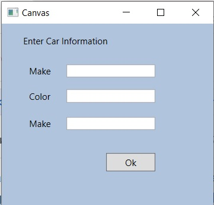

Зауважте, що порядок вмісту, який ви оголошуєте в Canvas, не використовується для розрахунку розміщення; замість цього розміщення залежить від розміру елемента керування та властивостей Canvas.Top, Canvas.Bottom, Canvas.Left і Canvas.Right.

Якщо піделементи в Canvas не визначають конкретного розташування за допомогою прикріпленого синтаксису властивості (наприклад, Canvas.Left і Canvas.Top), вони автоматично приєднуються до крайнього верхнього лівого кута Canvas.

Використання типу Canvas може здатися кращим способом упорядкування вмісту (оскільки він здається таким звичним), але цей підхід має деякі обмеження. По-перше, елементи в Canvas не змінюють динамічно самих себе під час застосування стилів або шаблонів (наприклад, їхні розміри шрифтів не впливають). По-друге, Canvas не намагатиметься зберегти елементи видимими, коли кінцевий користувач змінює розмір вікна до меншої поверхні.
Можливо, найкраще використовувати тип Canvas для розміщення графічного вмісту. Наприклад, якщо ви створювали власне зображення за допомогою XAML, ви, звичайно, хотіли б, щоб лінії, фігури та текст залишалися в тому самому місці, а не бачили, як вони динамічно змінюються, коли користувач змінює розмір вікна.

## Розміщення вмісту в панелях WrapPanel

Додаво нове вікно WindowWrapPanel. Додамо в MainWindow Button і обробник події. 

```xml
        <Button x:Name="btnWrapPanel" Content="WrapPanel" Canvas.Left="25" Canvas.Top="56" Click="btnWrapPanel_Click"/>
```
```cs
    private void btnWrapPanel_Click(object sender, RoutedEventArgs e)
    {
        WindowWrapPanel windowWrapPanel = new WindowWrapPanel();
        windowWrapPanel.Show();
    }
```
WrapPanel дозволяє визначати вміст, який буде перетікати через панель під час зміни розміру вікна. Розміщуючи елементи в WrapPanel, ви не вказуєте верхнє, нижнє, ліве та праве значення прикріплення, як це зазвичай робите з Canvas. Проте кожен піделемент може вільно визначати значення Height і Width (серед інших значень властивостей), щоб контролювати його загальний розмір у контейнері. Оскільки вміст у WrapPanel не прикріплюється до певної сторони панелі, важливий порядок, у якому ви оголошуєте елементи (вміст відображається від першого елемента до останнього).

```xml
<Window x:Class="SimpleWpfApp.WindowWrapPanel"
        ...
        Title="WrapPanel" Height="300" Width="323">
    <WrapPanel Background="LightSteelBlue">
        <Label Name="lblInstruction" 
           Width="328" Height="27" FontSize="15" Content="Enter Car Information"/>
        <Label Name="lblMake" Content="Make"/>
        <TextBox Name="txtMake" Width="193" Height="25"/>
        <Label Name="lblColor" Content="Color"/>
        <TextBox Name="txtColor" Width="193" Height="25"/>
        <Label Name="lblPetName" Content="Pet Name"/>
        <TextBox Name="txtPetName" Width="193" Height="25"/>
        <Button Name="btnOK" Width="80" Content="OK"/>
    </WrapPanel>
</Window>
```
Коли ви завантажуєте цю розмітку, вміст виглядає незвичайним, оскільки він перетікає зліва направо через вікно.

Вміст у WrapPanel поводиться так само, як традиційна сторінка HTML

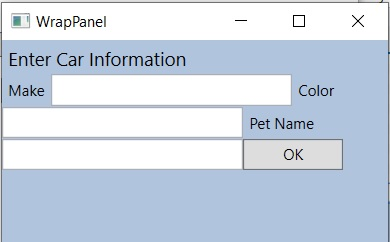

За замовчуванням вміст у WrapPanel переміщається зліва направо. Однак, якщо ви зміните значення властивості Orientation на Vertical, ви можете мати перенесення вмісту зверху вниз.

```xml
   <WrapPanel Background="LightSteelBlue" Orientation="Vertical">

```

Ви можете оголосити WrapPanel (як і деякі інші типи панелей), вказавши значення ItemWidth і ItemHeight, які керують розміром за замовчуванням кожного елемента. Якщо піделемент надає власне значення висоти та/або ширини, його буде розташовано відносно розміру, встановленого панеллю. Розгляньте таку розмітку:

```xml
    <WrapPanel Background="LightSteelBlue" Orientation="Horizontal" ItemWidth="200" ItemHeight="30">
        <Label Name="lblInstruction"    FontSize="15" Content="Enter Car Information"/>
        <Label Name="lblMake" Content="Make"/>
        <TextBox Name="txtMake"/>
        <Label Name="lblColor" Content="Color"/>
        <TextBox Name="txtColor"/>
        <Label Name="lblPetName" Content="Pet Name"/>
        <TextBox Name="txtPetName"/>
        <Button Name="btnOK" Width="80" Content="OK"/>
    </WrapPanel>

```

Відображений код виглядає так, як на малюнку (зверніть увагу на розмір і положення елемента керування Button, який має задане унікальне значення Width).

WrapPanel може встановити ширину та висоту певного елемента

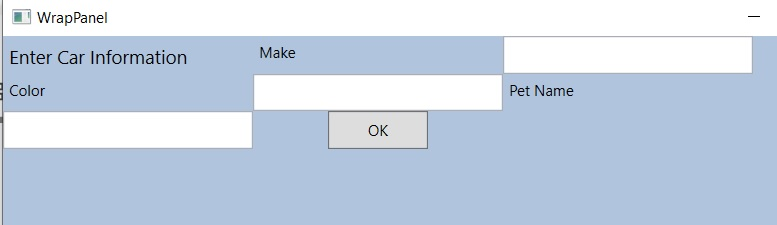

Як ви можете погодитися, подивившись малюнок, WrapPanel зазвичай не є найкращим вибором для впорядкування вмісту безпосередньо у вікні, оскільки його елементи можуть переплутатися, коли користувач змінює розмір вікна. У більшості випадків WrapPanel буде піделементом іншого типу панелі, дозволяючи невеликій області вікна обгортати його вміст при зміні розміру (наприклад, елемент керування ToolBar).

## Розміщення вмісту в панелях StackPanel

Додаво нове вікно WindowStackPanel. Додамо в MainWindow Button і обробник події.

Як і WrapPanel, елемент керування StackPanel упорядковує вміст в один рядок, який можна орієнтувати горизонтально або вертикально (за замовчуванням) на основі значення, призначеного властивості Orientation. Однак відмінність полягає в тому, що StackPanel не намагатиметься обернути вміст, коли користувач змінює розмір вікна. Навпаки, елементи в StackPanel просто розтягнуться (залежно від їхньої орієнтації), щоб відповідати розміру самої StackPanel.

```xml
<Window x:Class="SimpleWpfApp.WindowStackPanel"
        ...    
        Title="WindowStackPanel" Height="200" Width="400">
    <StackPanel Background="LightSteelBlue" Orientation ="Vertical">
        <Label Name="lblInstruction"
           FontSize="15" Content="Enter Car Information"/>
        <Label Name="lblMake" Content="Make"/>
        <TextBox Name="txtMake"/>
        <Label Name="lblColor" Content="Color"/>
        <TextBox Name="txtColor"/>
        <Label Name="lblPetName" Content="Pet Name"/>
        <TextBox Name="txtPetName"/>
        <Button Name="btnOK" Width ="80" Content="OK"/>
    </StackPanel>
</Window>

```
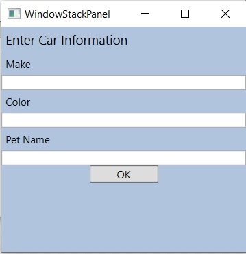

Знову ж таки, як і у випадку з WrapPanel, ви рідко захочете використовувати StackPanel для впорядкування вмісту безпосередньо у вікні. Замість цього ви повинні використовувати StackPanel як підпанель головної панелі.

## Розміщення вмісту в панелях Grid

Додаво нове вікно WindowGrid. Додамо в MainWindow Button і обробник події.

З усіх панелей, які надаються з WPF API, Grid безсумнівно є найбільш гнучким. Подібно до таблиці HTML, сітку можна розділити на набір комірок, кожна з яких містить вміст. Визначаючи сітку, ви виконуєте такі три кроки:

1. Визначте та налаштуйте кожен стовпець.
2. Визначте та налаштуйте кожен рядок.
3. Призначте вміст кожній комірці сітки за допомогою синтаксису доданих властивостей.

Якщо ви не визначаєте жодних рядків чи стовпців, сітка за замовчуванням буде окрема клітинка, яка заповнює всю поверхню вікна. Крім того, якщо ви не призначите значення комірки (стовпець і рядок) для піделемента в сітці, воно автоматично приєднується до стовпця 0, рядка 0.

Перші два кроки (визначення стовпців і рядків) виконуються за допомогою елементів Grid.ColumnDefinitions і Grid.RowDefinitions, які містять колекцію елементів ColumnDefinition і RowDefinition відповідно. Кожна клітинка в сітці справді є справжнім об’єктом .NET, тому ви можете налаштувати зовнішній вигляд і поведінку кожної клітинки на свій розсуд.
Ось визначення Grid, яке впорядковує ваш вміст інтерфейсу користувача, як показано на малюнку:

```xml
<Window x:Class="SimpleWpfApp.WindowGrid"
        ...
        Title="WindowGrid" Height="300" Width="600">
    <Grid ShowGridLines ="True" Background ="AliceBlue">
        <!-- Define the rows / columns -->
        <Grid.ColumnDefinitions>
            <ColumnDefinition/>
            <ColumnDefinition/>
        </Grid.ColumnDefinitions>
        <Grid.RowDefinitions>
            <RowDefinition/>
            <RowDefinition/>
        </Grid.RowDefinitions>

        <!-- Now add the elements to the grid's cells-->
        <Label Name="lblInstruction" Grid.Column ="0" Grid.Row ="0" 
         FontSize="15">Enter Car Information</Label>
        <Button Name="btnOK"  Height ="30" Grid.Column ="0" Grid.Row ="0" >OK</Button>
        <Label Name="lblMake" Grid.Column ="1" Grid.Row ="0">Make</Label>
        <TextBox Name="txtMake" Grid.Column ="1" Grid.Row ="0" Width="193" Height="25"/>
        <Label Name="lblColor" Grid.Column ="0" Grid.Row ="1" >Color</Label>
        <TextBox Name="txtColor" Width="193" Height="25" Grid.Column ="0" Grid.Row ="1" />

        <!-- Just to keep things interesting, add some color to the pet name cell -->
        <Rectangle Fill ="LightGreen" Grid.Column ="1" Grid.Row ="1" />
        <Label Name="lblPetName" Grid.Column ="1" Grid.Row ="1" >Pet Name</Label>
        <TextBox Name="txtPetName" Grid.Column ="1" Grid.Row ="1" Width="193" Height="25"/>

    </Grid>
</Window>

```

Панель Grid в дії

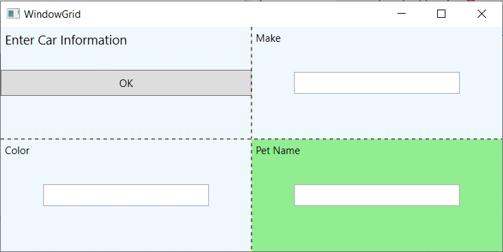

Зверніть увагу, що кожен елемент (включаючи світло-зелений прямокутник, доданий для гарної міри) з’єднується з коміркою сітки за допомогою властивостей Grid.Row і Grid.Column. За замовчуванням порядок комірок у сітці починається у верхньому лівому куті, який ви вказуєте за допомогою Grid.Column='0' Grid.Row='0'. Враховуючи, що ваша сітка містить чотири клітинки, ви можете визначити нижню праву клітинку за допомогою Grid.Colum='1' Grid.Row='1'.

### Розміри стовпців і рядків сітки

Розмір стовпців і рядків у сітці можна змінити одним із трьох способів.

1. Абсолютний розмір (наприклад, 100)
2. Авторозмір
3. Відносний розмір (наприклад, 3x)

Абсолютний розмір – це саме те, що ви очікуєте; стовпець (або рядок) має розмір певної кількості апаратно-незалежних одиниць. Автоматичне змінення розміру кожного стовпця чи рядка залежить від елементів керування, які містяться в стовпці чи рядку. Відносний розмір майже еквівалентний відсотковому розміру в CSS. Загальна кількість чисел у стовпцях або рядках відносного розміру ділиться на загальну кількість доступного простору.
У наступному прикладі перший рядок отримує 25 відсотків простору, а другий рядок отримує 75 відсотків простору:

```xml
        <Grid.ColumnDefinitions>
            <ColumnDefinition Width="1*"/>
            <ColumnDefinition Width="3*"/>
        </Grid.ColumnDefinitions>
```

### Сітки з типами GridSplitter

Додаво нове вікно WindowGridSpliter. Додамо в MainWindow Button і обробник події.

Об’єкти сітки також можуть підтримувати розділювачі. Як ви, напевно, знаєте, роздільники дозволяють кінцевому користувачеві змінювати розмір рядків або стовпців типу сітки. Коли це буде зроблено, вміст у кожній комірці зі змінним розміром змінюватиметься відповідно до того, як елементи містилися. Додати розгалужувачі до сітки легко; ви просто визначаєте елемент керування GridSplitter, використовуючи доданий синтаксис властивостей, щоб визначити, на який рядок чи стовпець він впливає.
Майте на увазі, що ви повинні призначити значення ширини або висоти (залежно від вертикального чи горизонтального розділення), щоб розділювач було видно на екрані. Розглянемо наступний простий тип сітки з роздільником у першому стовпці (Grid.Column = '0').

```xml
<Window x:Class="SimpleWpfApp.WindowGridSplitter"
        ...
        Title="WindowGridSplitter" Height="250" Width="400">
    <Grid Background ="AliceBlue">
        <!-- Define columns -->
        <Grid.ColumnDefinitions>
            <ColumnDefinition Width ="Auto"/>
            <ColumnDefinition/>
        </Grid.ColumnDefinitions>

        <!-- Add this label to cell 0 -->
        <Label Name="lblLeft" Background ="GreenYellow" 
                 Grid.Column="0" Content ="Left!"/>

        <!-- Define the splitter -->
        <GridSplitter Grid.Column ="0" Width ="5"/>

        <!-- Add this label to cell 1 -->
        <Label Name="lblRight" Grid.Column ="1" Content ="Right!"/>
    </Grid>
</Window>

```

По-перше, зауважте, що стовпець, який підтримуватиме роздільник, має властивість Width Auto. Далі зауважте, що GridSplitter використовує синтаксис прикріплених властивостей, щоб визначити, з яким стовпцем він працює. Якби ви переглянули цей вивід, ви б побачили п’ятипіксельний роздільник, який дозволяє змінювати розмір кожної мітки. Зауважте, що вміст заповнює всю клітинку, оскільки ви не вказали властивості Height або Width для обох Label.

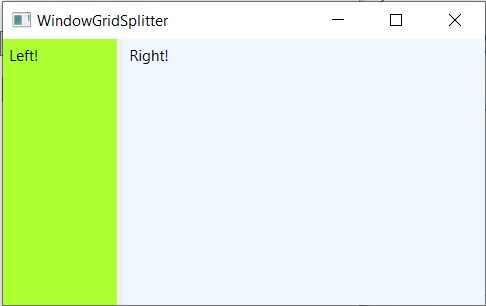

## Розміщення вмісту в панелях DockPanel

DockPanel зазвичай використовується як контейнер, який містить будь-яку кількість додаткових панелей для групування пов’язаного вмісту. DockPanels використовує синтаксис вкладених властивостей (як показано з типами Canvas або Grid), щоб контролювати, де кожен елемент прикріплюється до DockPanel.

```xml
<Window x:Class="SimpleWpfApp.WindowDockPanel"
        ...
        Title="WindowDockPanel" Height="250" Width="400">
    <DockPanel LastChildFill ="True" Background="AliceBlue">
        <!-- Dock items to the panel -->
        <Label DockPanel.Dock ="Top" Name="lblInstruction"
           FontSize="15" Content="Enter Car Information"/>
        <Label DockPanel.Dock ="Left" Name="lblMake" Content="Make"/>
        <Label DockPanel.Dock ="Right" Name="lblColor" Content="Color"/>
        <Label DockPanel.Dock ="Bottom" Name="lblPetName" Content="Pet Name"/>
        <Button Name="btnOK" Content="OK"/>
    </DockPanel>
</Window>

```

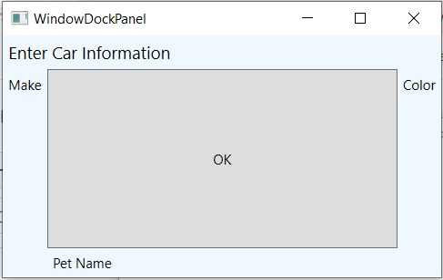

Якщо ви додаєте кілька елементів до однієї сторони DockPanel, вони складатимуться вздовж указаного краю в тому порядку, у якому вони оголошені. 

Перевага використання типів DockPanel полягає в тому, що коли користувач змінює розмір вікна, кожен елемент залишається підключеним до зазначеної сторони панелі (через DockPanel.Dock). Також зауважте, що відкриваючий тег DockPanel у цьому прикладі встановлює для атрибута LastChildFill значення true. Враховуючи, що елемент керування Button справді є «останнім дочірнім елементом» у контейнері, він буде розтягнутий у вільний простір.

## Увімкнення прокручування для типів панелей

Варто зазначити, що WPF надає клас ScrollViewer, який забезпечує автоматичне прокручування даних в об’єктах панелі.

```xml
<Window x:Class="SimpleWpfApp.WindowScrollViewer"
        ...
        Title="WindowScrollViewer" Height="200" Width="400">
    <ScrollViewer>
        <StackPanel>
            <Button Content ="First" Background = "Green" Height ="50"/>
            <Button Content ="Second" Background = "Red" Height ="50"/>
            <Button Content ="Third" Background = "Pink" Height ="50"/>
            <Button Content ="Fourth" Background = "Yellow" Height ="50"/>
            <Button Content ="Fifth" Background = "Blue" Height ="50"/>
        </StackPanel>
    </ScrollViewer>
</Window>

```

Робота з типом ScrollViewer

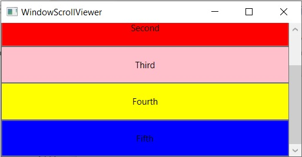

Як і слід було очікувати, кожна панель містить багато учасників, які дозволяють точніше налаштовувати розміщення вмісту. У зв’язку з цим багато елементів керування WPF підтримують дві цікаві властивості (Padding і Margin), які дозволяють самому елементу керування інформувати панель про те, як він хоче оброблятися. Зокрема, властивість Padding визначає, скільки додаткового простору має оточувати внутрішній елемент керування, тоді як Margin контролює додатковий простір навколо зовнішнього елемента керування. На цьому завершується розгляд головних типів панелей WPF, а також різних способів розміщення вмісту. Далі ви дізнаєтеся, як використовувати дизайнери Visual Studio для створення макетів.

# Налаштування панелей за допомогою Visual Studio Designers

Тепер, коли ви ознайомилися з XAML, який використовується для визначення деяких поширених менеджерів макетів, ви будете раді знати, що Visual Studio має дуже хорошу підтримку під час розробки для створення ваших макетів. Ключ до цього полягає у вікні «Document Outline», описаному раніше в цьому розділі. Щоб проілюструвати деякі основи, створіть новий проект програми WPF під назвою VisualLayoutTester.

Зверніть увагу, як ваше початкове вікно за замовчуванням використовує макет сітки, як показано тут:

```xml
<Window x:Class="VisualLayoutTester.MainWindow"
        xmlns="http://schemas.microsoft.com/winfx/2006/xaml/presentation"
        xmlns:x="http://schemas.microsoft.com/winfx/2006/xaml"
        xmlns:d="http://schemas.microsoft.com/expression/blend/2008"
        xmlns:mc="http://schemas.openxmlformats.org/markup-compatibility/2006"
        xmlns:local="clr-namespace:VisualLayoutTester"
        mc:Ignorable="d"
        Title="MainWindow" Height="450" Width="800">
    <Grid>

    </Grid>
</Window>

```
Якщо вам пвдходить використанням системи компонування Grid, зверніть увагу на малюнок , що ви можете легко вирізати клітинки сітки та змінити їх розмір за допомогою візуального макета. Для цього спочатку виберіть компонент «Grid» у вікні «Document Outline», а потім клацніть межу сітки, щоб створити нові рядки та стовпці.

Елемент керування Grid можна візуально розрізати на комірки за допомогою дизайнера IDE

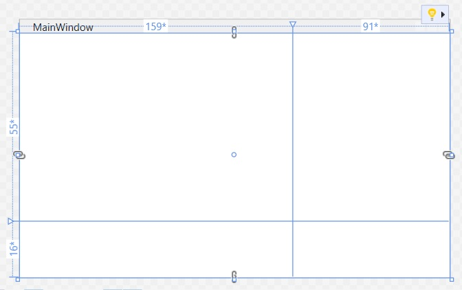

Тепер, припустімо, ви визначили сітку з деякою кількістю комірок. Потім ви можете перетягнути елементи керування в задану комірку системи макета, і IDE автоматично встановить властивості Grid.Row і Grid.Column відповідного елемента керування.

```xml
        <Button Grid.Column="1" Content="Button" HorizontalAlignment="Left" Margin="51,50,0,0" VerticalAlignment="Top"/>

```
Тепер, припустімо, ви взагалі не хочете використовувати Grid. Якщо ви клацнете правою кнопкою миші будь-який вузол макета у вікні «Структура документа», ви знайдете пункт меню, який дозволить вам змінити поточний контейнер на інший (див. Малюнок ). Майте на увазі, що коли ви це зробите, ви (швидше за все) радикально зміните розташування елементів керування, оскільки елементи керування відповідатимуть правилам нового типу панелі.

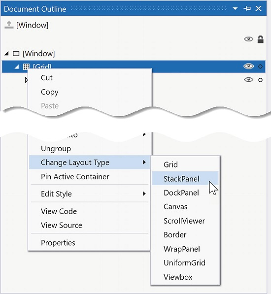

Ще один зручний трюк — це можливість вибрати набір елементів керування у візуальному дизайнері та згрупувати їх у новий вкладений менеджер макета. Припустімо, що у вас є сітка, яка містить набір випадкових об’єктів. Тепер виберіть набір елементів у конструкторі, утримуючи клавішу Ctrl і клацаючи кожен елемент лівою кнопкою миші. Якщо потім клацнути виділення правою кнопкою миші, ви зможете згрупувати вибрані елементи в нову підпанель (див. Малюнок ).

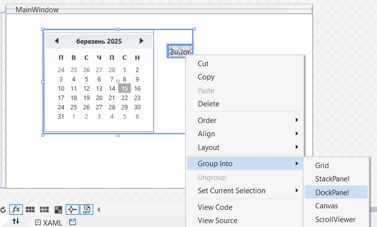

Після цього ще раз перегляньте вікно «Document Outline», щоб перевірити систему вкладеного макета. Коли ви створюєте повнофункціональні вікна WPF, вам, швидше за все, завжди потрібно буде використовувати вкладену систему макета, а не просто вибирати одну панель для всього відображення інтерфейсу користувача (насправді, решта прикладів WPF у тексті зазвичай це буде робити). Нарешті, всі вузли у вікні «Document Outline» можна перетягувати. Наприклад, якщо ви хочете перемістити елемент керування, який зараз знаходиться на панелі DockPanel, на батьківську панель, ви можете зробити це, як показано на малюнку.

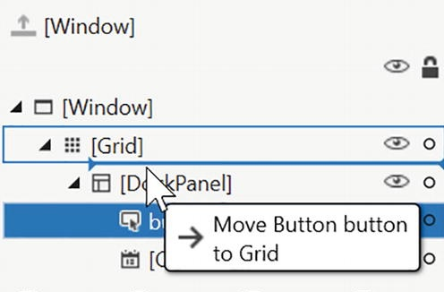

У міру того, як ви будете працювати над іншими розділами WPF, я вкажу на додаткові комбінації клавіш, де це можливо. Однак, безумовно, варто поекспериментувати та перевірити різні функції самостійно. Щоб ви рухалися в правильному напрямку, наступний приклад у цьому розділі проілюструє, як побудувати вкладений менеджер макета для спеціальної програми обробки тексту (з перевіркою орфографії!).

# Створення рами вікна за допомогою вкладених панелей

Як згадувалося, типове вікно WPF не використовуватиме один елемент керування панелі, а натомість вкладатиме панелі в інші панелі, щоб отримати бажану систему макета. Почніть зі створення нової програми WPF під назвою MyWordPad.
Ваша мета — побудувати макет, де головне вікно має верхню систему меню, панель інструментів під системою меню та рядок стану, встановлений у нижній частині вікна. Рядок стану міститиме панель для текстових підказок, які відображаються, коли користувач вибирає пункт меню (або кнопку панелі інструментів), тоді як система меню та панель інструментів пропонуватимуть тригери інтерфейсу користувача для закриття програми та відображення пропозицій орфографії у віджеті Expander. Малюнок показує початковий макет, для якого ви знімаєте; він також показує можливості перевірки орфографії в WPF.

Використання вкладених панелей для створення інтерфейсу вікна

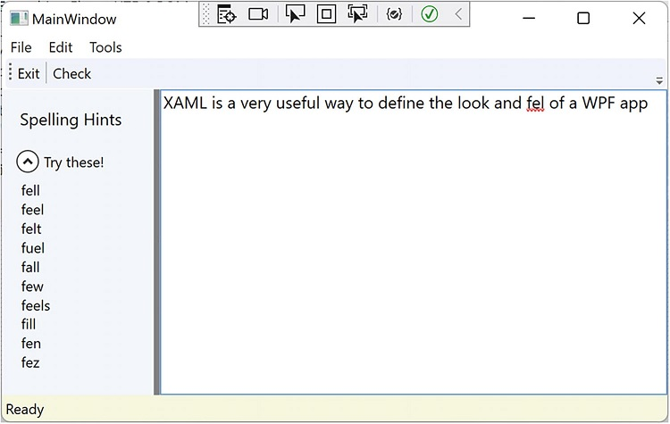

Щоб розпочати створення цього інтерфейсу користувача, оновіть початкове визначення XAML для вашого типу Window, щоб воно використовувало дочірній елемент DockPanel, а не сітку за замовчуванням, як описано нижче:

```xml
<Window x:Class="MyWordPad.MainWindow"
        ...
        Title="MainWindow" Height="450" Width="800">
    <DockPanel>
        
    </DockPanel>
</Window>

```
## Побудова системи меню

Системи меню в WPF представлені класом Menu, який підтримує колекцію об’єктів MenuItem. Під час створення системи меню в XAML кожен MenuItem може обробляти різні події. Найбільш помітною з цих подій є клацання, яке відбувається, коли кінцевий користувач вибирає піделемент. У цьому прикладі ви починаєте зі створення двох найвищих пунктів меню (File та Tools; меню Edit  буде створено пізніше в цьому прикладі), які відображають підпункти Exit і Spelling Hints, відповідно. 

```xml
    <DockPanel>
        <Menu DockPanel.Dock="Top"
              HorizontalAlignment="Left" Background="White" BorderBrush="Black">
            <MenuItem Header="_File">
                <Separator />
                <MenuItem Header="_Exit" MouseEnter="MouseEnterExitArea"
                          MouseLeave="MouseLeaveArea" Click="FileExit_Click" />
            </MenuItem>
            <MenuItem Header="_Tools">
                <MenuItem Header="_Spelling Hints"
                          MouseEnter="MouseEnterToolsHintsArea"
                          MouseLeave="MouseLeaveArea" Click="ToolsSpellingHints_Click" />
            </MenuItem>
        </Menu>
    </DockPanel>
```
Зверніть увагу, що ви прикріплюєте систему меню до верхньої частини DockPanel. Крім того, ви використовуєте елемент Separator, щоб вставити тонку горизонтальну лінію в систему меню безпосередньо перед опцією Exit. Також зауважте, що значення заголовка для кожного пункту меню містять вбудований маркер підкреслення (наприклад, _Exit). Ви використовуєте цей маркер, щоб визначити, яка літера буде підкреслена, коли кінцевий користувач натисне клавішу Alt (для комбінацій клавіш). Це зміна символу &, який використовується у Windows Forms, оскільки XAML базується на XML, а символ & має значення в XML.
Наразі ви реалізували повне визначення системи меню; далі вам потрібно реалізувати різні обробники подій. По-перше, у вас є обробник File Exit, FileExit_Click(), який просто закриває вікно, яке, у свою чергу, завершує роботу програми, оскільки це ваше верхнє вікно. Обробники подій MouseEnter і MouseExit для кожного піделемента з часом оновлять ваш рядок стану; однак наразі ви просто надасте мушлі. Нарешті, обробник ToolsSpellingHints_Click() для пункту меню Tools Spelling Hints також залишатиметься оболонкою на даний момент. Ось поточні оновлення вашого файлу коду:

```cs
public partial class MainWindow : Window
{
    public MainWindow()
    {
        InitializeComponent();
    }

    private void FileExit_Click(object sender, RoutedEventArgs e)
    {
        Close();
    }
    private void MouseEnterExitArea(object sender, MouseEventArgs e)
    {

    }

    private void MouseLeaveArea(object sender, MouseEventArgs e)
    {

    }

    private void MouseEnterToolsHintsArea(object sender, MouseEventArgs e)
    {

    }
    private void ToolsSpellingHints_Click(object sender, RoutedEventArgs e)
    {

    }
}
```

## Візуальне створення меню

Хоча завжди корисно знати, як вручну визначати елементи в XAML, це може бути трохи виснажливим. Visual Studio підтримує підтримку візуального дизайну систем меню, панелей інструментів, рядків стану та багатьох інших елементів керування інтерфейсу користувача. Якщо ви клацнете правою кнопкою миші елемент керування Menu, ви помітите опцію Add MenuItem. Як випливає з назви, це додає новий пункт меню до елемента керування Menu. Після того, як ви додали набір найвищих елементів, ви можете додавати елементи підменю та роздільники, розгортати або згортати саме меню та виконувати інші операції, орієнтовані на меню, за допомогою другого клацання правою кнопкою миші.
Як ви бачите в решті поточного прикладу MyWordPad, я зазвичай покажу вам остаточно згенерований XAML; однак знайдіть час, щоб поекспериментувати з візуальними дизайнерами, щоб спростити завдання.

## Створення панелі інструментів

Панелі інструментів (представлені класом ToolBar у WPF) зазвичай забезпечують альтернативний спосіб активації опції меню. Додайте наступну розмітку безпосередньо після закриваючої області визначення вашого меню:
```xml
        <ToolBar DockPanel.Dock="Top">
            <Button Content="Exit" MouseEnter="MouseEnterExitArea"
                    MouseLeave="MouseLeaveArea" Click="FileExit_Click" />
            <Separator />
            <Button Content="Check" MouseEnter="MouseEnterToolsHintsArea"
                    MouseLeave="MouseLeaveArea" Click="ToolsSpellingHints_Click"
                    Cursor="Help" />
        </ToolBar>
```
Ваш елемент керування ToolBar складається з двох елементів керування Button, які просто так обробляють однакові події та обробляються тими самими методами у вашому файлі коду. Використовуючи цю техніку, ви можете подвоїти свої обробники, щоб обслуговувати як пункти меню, так і кнопки панелі інструментів. Хоча ця панель інструментів використовує типові кнопки, ви повинні розуміти, що тип панелі інструментів «is-a» ContentControl;тому ви можете вставляти будь-які типи на його поверхню (наприклад, розкривні списки, зображення та графіку). Єдиним іншим цікавим моментом є те, що кнопка Перевірити підтримує нестандартний курсор миші через властивість Cursor. 

За бажанням можна обернути елемент ToolBar в елемент ToolBarTray, який керує макетом, закріпленням і операціями перетягування для набору об’єктів ToolBar.

## Побудова рядка стану

Елемент керування StatusBar буде прикріплено до нижньої частини панелі DockPanel і міститиме один елемент керування TextBlock, який ви не використовували до цього пункту в розділі. Ви можете використовувати TextBlock для зберігання тексту, який підтримує численні текстові анотації, такі як жирний текст, підкреслений текст, розриви рядків тощо. Додайте таку розмітку безпосередньо після попереднього визначення ToolBar:

```xml
        <!-- Put a StatusBar at the bottom -->
        <StatusBar DockPanel.Dock="Bottom" Background="Beige">
            <StatusBarItem>
                <TextBlock Name="statBarText" Text="Ready" />
            </StatusBarItem>
        </StatusBar>
```

## Завершення дизайну інтерфейсу користувача

Останнім аспектом дизайну вашого інтерфейсу користувача є визначення роздільної сітки, яка визначає два стовпці. Ліворуч розмістіть елемент керування Expander, який відображатиме список пропозицій орфографії, загорнутих у StackPanel. Праворуч розмістіть елемент керування TextBox, який підтримує кілька рядків і смуг прокручування та включає перевірку орфографії. Ви монтуєте всю сітку ліворуч від батьківської DockPanel. Додайте таку розмітку XAML безпосередньо під розмітку StatusBar, щоб завершити визначення інтерфейсу користувача вікна:


```xml
        <Grid DockPanel.Dock="Left" Background="AliceBlue">
            <!-- Define the rows and columns -->
            <Grid.ColumnDefinitions>
                <ColumnDefinition />
                <ColumnDefinition />
            </Grid.ColumnDefinitions>

            <GridSplitter Grid.Column="0" Width="5" Background="Gray" />
            <StackPanel Grid.Column="0" VerticalAlignment="Stretch">
                <Label Name="lblSpellingInstructions" FontSize="14" Margin="10,10,0,0">
                    Spelling Hints
                </Label>

                <Expander Name="expanderSpelling" Header="Try these!"
                          Margin="10,10,10,10">
                    <!-- This will be filled programmatically -->
                    <Label Name="lblSpellingHints" FontSize="12" />
                </Expander>
            </StackPanel>

            <!-- This will be the area to type within -->
            <TextBox Grid.Column="1"
                     SpellCheck.IsEnabled="True"
                     AcceptsReturn="True"
                     Name="txtData" FontSize="14"
                     BorderBrush="Blue"
                     VerticalScrollBarVisibility="Auto"
                     HorizontalScrollBarVisibility="Auto" />
        </Grid>

```

## Реалізація обробників подій MouseEnter/MouseLeave

На цьому інтерфейс вашого вікна готовий. Єдині завдання, що залишилися, це забезпечити реалізацію для інших обробників подій. Почніть з оновлення файлу коду C#, щоб кожен із обробників MouseEnter, MouseLeave та MouseExit встановлював текстову панель рядка стану з відповідним повідомленням, щоб допомогти кінцевому користувачеві, наприклад:

```cs
 private void MouseEnterExitArea(object sender, MouseEventArgs e)
 {
     statBarText.Text = "Exit the Application";
 }

 private void MouseLeaveArea(object sender, MouseEventArgs e)
 {
     statBarText.Text = "Ready";
 }

 private void MouseEnterToolsHintsArea(object sender, MouseEventArgs e)
 {
     statBarText.Text = "Show Spelling Suggestions";
 }
```
На цьому етапі ви можете запустити свою програму. Ви повинні побачити, як рядок стану змінює свій текст залежно від того, на який пункт меню/кнопку панелі інструментів ви наводите курсор миші.

## Реалізація логіки перевірки правопису

WPF API поставляється з вбудованою підтримкою перевірки орфографії, яка не залежить від продуктів Microsoft Office. Це означає, що вам не потрібно використовувати рівень взаємодії COM, щоб використовувати перевірку орфографії Microsoft Word; натомість ви можете легко додати той самий тип підтримки лише кількома рядками коду.
Можливо, ви пам’ятаєте, що коли ви визначали елемент керування TextBox, ви встановили для властивості SpellCheck.IsEnabled значення true. Коли ви робите це, слова з орфографічними помилками підкреслюються червоною завивкою, як і в Microsoft Office. Ще краще, базова модель програмування надає вам доступ до механізму перевірки орфографії, який дозволяє отримати список пропозицій для слів із помилками. Додайте такий код до методу ToolsSpellingHints_Click():

```cs
    private void ToolsSpellingHints_Click(object sender, RoutedEventArgs e)
    {
        string spellingHints = string.Empty;

        // Try to get a spelling error at the current caret location.
        SpellingError error = txtData.GetSpellingError(txtData.CaretIndex);
        if (error != null)
        {
            // Build a string of spelling suggestions.
            foreach (string s in error.Suggestions)
            {
                spellingHints += $"{s}\n";
            }

            // Show suggestions and expand the expander.
            lblSpellingHints.Content = spellingHints;
            expanderSpelling.IsExpanded = true;
        }
    }
```

Попередній код досить простий. Ви просто визначаєте поточне розташування каретки в текстовому полі за допомогою властивості CaretIndex для вилучення об’єкта SpellingError. Якщо у вказаному місці є помилка (це означає, що значення не дорівнює нулю), ви перебираєте список пропозицій за допомогою влучно названої властивості Suggestions. Після того, як ви отримаєте всі пропозиції щодо слова з помилкою, ви підключаєте дані до мітки в Expander. 
Отже, ось воно! Маючи лише кілька рядків процедурного коду (і здорову дозу XAML), у вас є зачатки функціонального текстового процесора. Введить "This pizzza is goood." і  перевірте.

# Розуміння команд WPF

WPF забезпечує підтримку подій, які можна вважати контрольно-незалежними, через командну архітектуру. Типова подія .NET Core визначається в конкретному базовому класі та може використовуватися лише цим класом або похідним. Тому звичайні події .NET Core тісно пов’язані з класом, у якому вони визначені. 
Навпаки, команди WPF є подієподібними сутностями, які не залежать від конкретного елемента керування та, у багатьох випадках, можуть бути успішно застосовані до багатьох (і, здавалося б, непов’язаних) типів елементів керування. Як кілька прикладів, WPF підтримує команди копіювання, вставки та вирізання, які можна застосувати до різноманітних елементів інтерфейсу користувача (наприклад, пунктів меню, кнопок панелі інструментів і спеціальних кнопок), а також комбінацій клавіш (наприклад, Ctrl+C і Ctrl+V).
У той час як інші набори інструментів інтерфейсу користувача (такі як Windows Forms) надавали стандартні події для таких цілей, їх використання зазвичай залишало зайвий код, який важко підтримувати. У моделі WPF ви можете використовувати команди як альтернативу. Кінцевий результат зазвичай дає меншу та більш гнучку кодову базу. 

## Внутрішні командні об’єкти

WPF постачається з численними вбудованими командами керування, усі з яких можна налаштувати за допомогою відповідних комбінацій клавіш (або інших жестів введення). Програмно кажучи, команда WPF — це будь-який об’єкт, який підтримує властивість (часто називається Command), яка повертає об’єкт, що реалізує інтерфейс ICommand, як показано тут:

```cs
public interface ICommand
{
  // Occurs when changes occur that affect whether
  // or not the command should execute.
  event EventHandler CanExecuteChanged;
  // Defines the method that determines whether the command
  // can execute in its current state.
  bool CanExecute(object parameter);
  // Defines the method to be called when the command is invoked.
  void Execute(object parameter);
}
```
WPF надає різні класи команд, які надають доступ до близько 100 командних об’єктів. Ці класи визначають численні властивості, що надають конкретні командні об’єкти, кожен з яких реалізує ICommand. Таблиця описує деякі доступні стандартні командні об’єкти. 

Внутрішні командні об’єкти управління WPF

|WPF Class|Command Objects|Значення в житті|
|---------|---------------|----------------|
|ApplicationCommands|Close, Copy, Cut, Delete, Find, Open, Paste, Save, SaveAs, Redo, Undo|Різні команди на рівні програми|
|ComponentCommands|MoveDown, MoveFocusBack, MoveLeft, MoveRight, ScrollToEnd, ScrollToHome|Різні команди, загальні для компонентів інтерфейсу користувача|
|MediaCommands|BoostBase, ChannelUp, ChannelDown, FastForward, NextTrack, Play, Rewind, Select, Stop|Різноманітні медіацентричні команди|
|NavigationCommands|BrowseBack, BrowseForward, Favorites, LastPage, NextPage, Zoom|Різні команди, що стосуються моделі навігації WPF|
|EditingCommands|AlignCenter, CorrectSpellingError, DecreaseFontSize, EnterLineBreak, EnterParagraphBreak, MoveDownByLine, MoveRightByWord|Різні команди, пов’язані з API документів WPF|

## Підключення команд до властивості команди

Якщо ви хочете підключити будь-яку властивість команди WPF до елемента інтерфейсу користувача, який підтримує властивість Command (наприклад, Button або MenuItem), у вас дуже мало роботи. Ви можете побачити, як це зробити, оновивши поточну систему меню, щоб вона підтримувала новий верхній пункт меню під назвою Edit та три підпункти для копіювання, вставлення та вирізання текстових даних, наприклад:

```xml
        <Menu DockPanel.Dock="Top"
              HorizontalAlignment="Left" Background="White" BorderBrush="Black">
            <MenuItem Header="_File">
                    ...
            </MenuItem>

            <!-- New menu item with commands! -->
            <MenuItem Header="_Edit">
                <MenuItem Command="ApplicationCommands.Copy" />
                <MenuItem Command="ApplicationCommands.Cut" />
                <MenuItem Command="ApplicationCommands.Paste" />
            </MenuItem>

            <MenuItem Header="_Tools">
                    ...    
            </MenuItem>
        </Menu>
```
Зверніть увагу, що кожному з підпунктів у меню Edit властивість Command має значення. Це означає, що пункти меню автоматично отримають правильну назву та комбінацію клавіш (наприклад, Ctrl+C для операції вирізання) в інтерфейсі користувача пункту меню; це також означає, що програма тепер підтримує копіювання, вирізання та вставлення без процедурного коду!
Якщо ви запустите програму та виберете частину тексту, ви зможете використовувати нові пункти меню з коробки. Як бонус, ваша програма також може реагувати на стандартну операцію натискання правою кнопкою миші, щоб надати користувачеві ті самі параметри.

## Підключення команд до довільних дій

Якщо ви хочете підключити об’єкт команди до довільної (специфічної для програми) події, вам потрібно буде перейти до процедурного коду. Зробити це не складно, але вимагає трохи більше логіки, ніж ви бачите в XAML. Наприклад, припустимо, що ви хочете, щоб усе вікно відповідало на клавішу F1, щоб, коли кінцевий користувач натискає цю клавішу, він активував відповідну довідкову систему. Також припустімо, що ваш файл коду для головного вікна визначає новий метод під назвою SetF1CommandBinding(), який ви викликаєте в конструкторі після виклику InitializeComponent().

```cs
    public MainWindow()
    {
        InitializeComponent();
        SetF1CommandBinding();
    }
```
Цей новий метод програмним шляхом створить новий об’єкт CommandBinding, який можна використовувати щоразу, коли потрібно прив’язати об’єкт команди до певного обробника подій у вашій програмі. Тут ви налаштовуєте об’єкт CommandBinding для роботи з командою ApplicationCommands.Help, яка автоматично підтримує F1:

```cs
    private void SetF1CommandBinding()
    {
        CommandBinding helpBinding = new CommandBinding(ApplicationCommands.Help);

        helpBinding.CanExecute += CanHelpExecute;
        helpBinding.Executed += HelpExecute;

        CommandBindings.Add(helpBinding);
    }
```
Більшість об’єктів CommandBinding захочуть обробляти подію CanExecute (яка дозволяє вказати, чи виконується команда на основі операції вашої програми) і подію Executed (це місце, де ви можете створити вміст, який має відбутися після виконання команди). Додайте такі обробники подій до типу, похідного від Window (зверніть увагу на формат кожного методу відповідно до вимог пов’язаних делегатів):

```cs

    private void CanHelpExecute(object sender, CanExecuteRoutedEventArgs e)
    {
        e.CanExecute = true;
    }

    private void HelpExecute(object sender, ExecutedRoutedEventArgs e)
    {
        MessageBox.Show("Look, it is not that difficult. Just type something!", "Help");
    }

```
У попередньому фрагменті ви реалізували CanHelpExecute(), тому він завжди дозволяє запускати довідку F1; ви робите це, просто повертаючи true. Однак, якщо у вас є певні ситуації, коли довідкова система не повинна відображатися, ви можете врахувати це та повернути false, коли необхідно. Ваша «довідкова система», яка відображається в HelpExecuted(), — це не більше ніж вікно повідомлень. На цьому етапі ви можете запустити свою програму. Коли ви натиснете клавішу F1 на клавіатурі, ви побачите вікно повідомлення.

## Робота з командами Open і Save

Щоб завершити поточний приклад, ви додасте функцію збереження ваших текстових даних у зовнішньому файлі та відкриття файлів *.txt для редагування. Якщо ви хочете піти довгим шляхом, ви можете вручну додати логіку програмування, яка вмикає або вимикає нові пункти меню залежно від того, чи містить у вашому TextBox дані. Проте ви знову можете використовувати команди, щоб зменшити свій тягар.
Почніть з оновлення елемента MenuItem, який представляє ваше верхнє меню File, додавши наступні два нові підменю, які використовують об’єкти Save та Open:

```xml
            <MenuItem Header="_File">
                <MenuItem Command="ApplicationCommands.Open" />
                <MenuItem Command="ApplicationCommands.Save" />
                <Separator />
                <MenuItem Header="_Exit" MouseEnter="MouseEnterExitArea"
                          MouseLeave="MouseLeaveArea" Click="FileExit_Click" />
            </MenuItem>
```
Знову пам’ятайте, що всі командні об’єкти реалізують інтерфейс ICommand, який визначає дві події (CanExecute та Executed). Тепер вам потрібно ввімкнути все вікно, щоб воно могло перевірити, чи можна наразі запускати ці команди; якщо так, ви можете визначити обробник подій для виконання спеціального коду.
Це можна зробити шляхом заповнення колекції CommandBindings, яку підтримує вікно. Для цього в XAML потрібно використовувати синтаксис елемента властивості для визначення області Window.CommandBindings, у якій ви розміщуєте два визначення CommandBinding. Оновіть своє Window таким чином:

```xml
    <Window.CommandBindings>
        <CommandBinding Command="ApplicationCommands.Open"
                        Executed="OpenCmdExecuted"
                        CanExecute="OpenCmdCanExecute"/>
        <CommandBinding Command="ApplicationCommands.Save"
                        Executed="SaveCmdExecuted"
                        CanExecute="SaveCmdCanExecute"/>
    </Window.CommandBindings>
```
Тепер в віконці Properties створіть обробники. Це автоматично створить заглушку для самої події. На цьому етапі ви повинні мати чотири порожні обробники у файлі коду C# для вікна. Реалізація обробників подій CanExecute повідомить вікну, що можна запускати відповідні події Executed у будь-який час, установивши властивість CanExecute вхідного об’єкта CanExecuteRoutedEventArgs.

```cs
    private void OpenCmdCanExecute(object sender, CanExecuteRoutedEventArgs e)
    {
        e.CanExecute = true;
    }

    private void SaveCmdCanExecute(object sender, CanExecuteRoutedEventArgs e)
    {
        e.CanExecute = true;
    }
```
Відповідні обробники Executed виконують фактичну роботу з відображення діалогових вікон відкриття та збереження; вони також надсилають дані у вашому TextBox у файл. Почніть із того, що імпортуєте простори імен System.IO та Microsoft.Win32 у свій кодовий файл. Наступний готовий код простий:

```cs
using System.IO;
using Microsoft.Win32;
```
```cs
    private void OpenCmdExecuted(object sender, ExecutedRoutedEventArgs e)
    {
        // Create an open file dialog box and only show XAML files.
        var openDlg = new OpenFileDialog { Filter = "Text Files |*.txt" };

        // Did they click on the OK button?
        if (openDlg.ShowDialog() == true)
        {
            // Load all text of selected file.
            string dataFromFile = File.ReadAllText(openDlg.FileName);

            // Show string in TextBox.
            txtData.Text = dataFromFile;
        }
    }

    private void SaveCmdExecuted(object sender, ExecutedRoutedEventArgs e)
    {
        var saveDlg = new SaveFileDialog { Filter = "Text Files |*.txt" };

        // Did they click on the OK button?
        if (true == saveDlg.ShowDialog())
        {
            // Save data in the TextBox to the named file.
            File.WriteAllText(saveDlg.FileName, txtData.Text);
        }
    }
```
В одній з наступних главі буде набагато глибше розглянута система команд WPF. У ньому ви будете створювати власні команди на основі інтерфейсу ICommand, а також створювати команди реле.

На цьому завершується цей приклад і ваш перший погляд на роботу з елементами керування WPF. Тут ви дізналися, як працювати з основними командами, системами меню, рядками стану, панелями інструментів, вкладеними панелями та кількома основними елементами керування інтерфейсу користувача, такими як TextBox і Expander. Наступний приклад працюватиме з деякими більш екзотичними елементами керування, одночасно досліджуючи кілька важливих служб WPF.

# Розуміння маршрутизованих подій

Можливо, ви помітили параметр RoutedEventArgs замість EventArgs у попередньому прикладі коду. Модель маршрутизованих подій є удосконаленням стандартної моделі подій CLR, призначеної для забезпечення того, що події можуть оброблятися у спосіб, який підходить для опису XAML дерева об’єктів.
Припустімо, що у вас є новий проект програми WPF під назвою WpfRoutedEvents. Тепер оновіть визначення XAML файлу MainWindow.xaml, додавши такий елемент керування Button із складним вмістом у <Grid> (елементи Window і Grid пропущені для стислості):

```xml
       <Button Name="btnClickMe" Height="75" Width = "250" Click ="BtnClickMe_Clicked">
            <StackPanel Orientation ="Horizontal">
                <Label Height="50" FontSize ="20">Fancy Button!</Label>
                <Canvas Height ="50" Width ="100" >
                    <Ellipse Name = "outerEllipse" Fill ="Green" Height ="25"
                             PreviewMouseDown ="outerEllipse_PreviewMouseDown"
                             MouseDown ="outerEllipse_MouseDown"
                             Width ="50" Cursor="Hand" Canvas.Left="25" Canvas.Top="12"/>
                    <Ellipse Name = "innerEllipse" Fill ="Yellow" Height = "15" Width ="36"
                             Canvas.Top="17" Canvas.Left="32"/>
                </Canvas>
            </StackPanel>
        </Button>
```
Зауважте у початковому визначенні кнопки, що ви обробили подію Click, вказавши ім’я методу, який буде викликано під час виклику події. Зауважте у початковому визначенні кнопки, що ви обробили подію Click, вказавши ім’я методу, який буде викликано під час виклику події. Подія Click працює з делегатом RoutedEventHandler, який очікує обробник події, який приймає об’єкт як перший параметр і System.Windows.RoutedEventArgs як другий.Подія Click працює з делегатом RoutedEventHandler, який очікує обробник події, який приймає об’єкт як перший параметр і System.Windows.RoutedEventArgs як другий. Реалізуйте цей обробник так:

```cs
    private void BtnClickMe_Clicked(object sender, RoutedEventArgs e)
    {
        MessageBox.Show("Clicked the button");
    }
```
Якщо ви запустите свою програму, ви побачите це вікно повідомлення незалежно від того, яку частину вмісту кнопки ви натиснули (зелений еліпс, жовтий еліпс, мітка або поверхня кнопки). Це добре. Уявіть, наскільки стомлюючою була б обробка подій WPF, якби ви були змушені обробляти подію Click для кожного з цих піделементів. Мало того, що створення окремих обробників подій для кожного аспекту кнопки було б трудомістким, ви б закінчили якийсь могутній неприємний код, який потрібно підтримувати надалі.
На щастя, маршрутизовані події WPF гарантують, що ваш обробник події єдиного натискання буде викликаний незалежно від того, яку частину кнопки натиснуто автоматично. Простіше кажучи, модель маршрутизованих подій автоматично поширює подію вгору (або вниз) по дереву об’єктів, шукаючи відповідний обробник.
Зокрема, маршрутизована подія може використовувати три стратегії маршрутизації. Якщо подія рухається від початкової точки до інших визначальних областей у дереві об’єктів, ця подія називається вибуховою. І навпаки, якщо подія рухається від крайнього елемента (наприклад, вікна) вниз до точки походження, подія називається подією тунелювання. Нарешті, якщо подія викликається й обробляється лише початковим елементом (що можна описати як звичайну подію CLR), це називається прямою подією.


