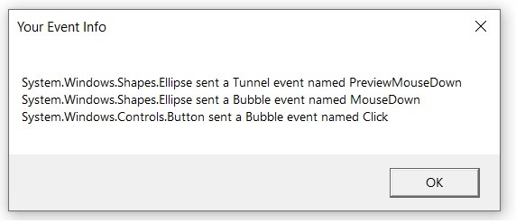
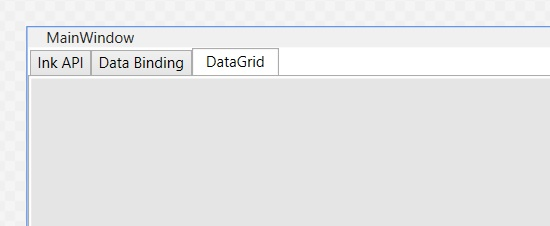
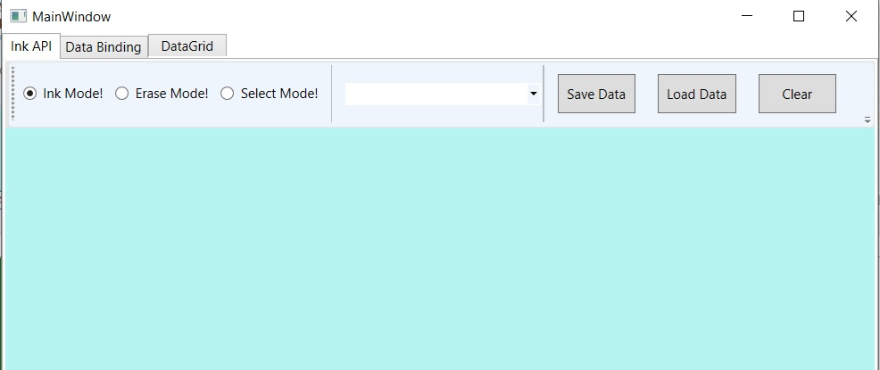
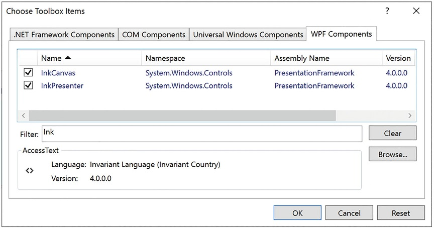
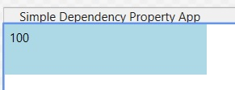

# Елементи керування WPF, макети, події та зв’язування даних

# Огляд основних елементів керування WPF

Якщо ви не новачок у створенні графічних інтерфейсів користувача (що добре), загальне призначення основних елементів керування WPF не повинно викликати занадто багато проблем. Незалежно від того, який інструментарій GUI ви використовували раніше (наприклад, VB6, MFC, Java AWT/Swing, Windows Forms, macOS або GTK+/GTK# [серед інших]), основні елементи керування WPF, перелічені в таблиці, ймовірно, здадуться вам знайомими.

|Категорія управління WPF|Приклад членів|Значення в житті|
|------------------------|--------------|----------------|
|Основні елементи керування введенням даних користувача|Button, RadioButton, ComboBox, CheckBox, Calendar, DatePicker, Expander, DataGrid, ListBox, ListView, ToggleButton, TreeView, ContextMenu, ScrollBar, Slider, TabControl, TextBlock, TextBox, RepeatButton, RichTextBox, Label|WPF надає цілу сімейство елементів керування, які можна використовувати для створення суті інтерфейсу користувача.|
|Віконне та контрольне оформлення|Menu, ToolBar, StatusBar, ToolTip, ProgressBar|Ви використовуєте ці елементи інтерфейсу користувача, щоб прикрасити рамку об’єкта Window пристроями введення (такими як меню) та інформаційними елементами користувача (наприклад, рядок стану та підказка).|
|Елементи керування медіа|Image, MediaElement, SoundPlayerAction|Ці елементи керування забезпечують підтримку відтворення аудіо/відео та відображення зображень.|
|Елементи керування макетом|Border, Canvas, DockPanel, Grid, GridView, GridSplitter, GroupBox, Panel, TabControl, StackPanel, Viewbox, WrapPanel|WPF надає численні елементи керування, які дозволяють групувати та організовувати інші елементи керування з метою керування макетом.|

Намір цієї глави полягає не в тому, щоб пройти через кожного елемента кожного елемента керування WPF. Навпаки, ви отримаєте огляд різних елементів керування з наголосом на основній моделі програмування та ключових службах, спільних для більшості елементів керування WPF.

## Елементи керування Ink WPF

На додаток до загальних елементів керування WPF, перелічених у таблиці, WPF визначає додаткові елементи керування для роботи з API цифрового рукопису. Цей аспект розробки WPF корисний під час розробки планшетного ПК, оскільки він дозволяє отримувати введення за допомогою стилуса. Однак це не означає, що стандартна настільна програма не може використовувати API Ink, оскільки ті самі елементи керування можуть отримувати введення за допомогою миші.
Простір імен System.Windows.Ink PresentationCore.dll містить різні типи підтримки Ink API (наприклад, Stroke і StrokeCollection); однак більшість елементів керування Ink API (наприклад, InkCanvas і InkPresenter) упаковані разом із загальними елементами керування WPF у просторі імен System.Windows.Controls у збірці PresentationFramework.dll. Пізніше в цій главі ви працюватимете з API Ink.

## Елементи керування документами WPF

WPF також надає елементи керування для розширеної обробки документів, дозволяючи вам створювати програми, які включають функціональність у стилі Adobe PDF. Використовуючи типи в просторі імен System.Windows.Documents (також у збірці PresentationFramework.dll), ви можете створювати документи, готові до друку, які підтримують масштабування, пошук, анотації користувача (замітки) та інші служби форматованого тексту. Однак під обкладинками елементи керування документом не використовують API Adobe PDF; скоріше вони використовують API специфікації паперу XML (XPS). Для кінцевого користувача різниці справді не буде, оскільки документи PDF і документи XPS мають майже ідентичний вигляд і відчуття. Фактично, ви можете знайти багато безкоштовних утиліт, які дозволяють конвертувати між двома форматами файлів на льоту. Через обмеження місця ці елементи керування не розглядатимуться.

## Загальні діалогові вікна WPF

WPF також надає кілька поширених діалогових вікон, таких як OpenFileDialog і SaveFileDialog. Ці діалогові вікна визначені в просторі імен Microsoft.Win32 збірки PresentationFramework.dll. Робота з будь-яким із цих діалогових вікон полягає у створенні об’єкта та виклику методу ShowDialog(), наприклад:

```cs
using Microsoft.Win32;
//omitted for brevity
private void btnShowDlg_Click(object sender, RoutedEventArgs e)
{
  // Show a file save dialog.
  SaveFileDialog saveDlg = new SaveFileDialog();
  saveDlg.ShowDialog();
}
```
Як ви сподіваєтеся, ці класи підтримують різні члени, які дозволяють вам встановлювати файлові фільтри та шляхи до каталогів і отримувати доступ до вибраних користувачем файлів. Ви використаєте ці діалогові вікна файлів у наступних прикладах; ви також дізнаєтеся, як створювати користувацькі діалогові вікна для збору введеня користувача.

# Короткий огляд Visual Studio WPF Designer

Більшість стандартних елементів керування WPF було упаковано в простір імен System.Windows.Controls збірки PresentationFramework.dll. Коли ви створюєте програму WPF за допомогою Visual Studio, ви знайдете більшість із цих загальних елементів керування, які містяться в панелі інструментів, за умови, що у вас відкрито конструктор WPF як активне вікно.
Подібно до інших фреймворків інтерфейсу користувача, створених за допомогою Visual Studio, ви можете перетягнути ці елементи керування в конструктор вікон WPF і налаштувати їх за допомогою вікна Властивості (про яке ви дізналися в попередній главі). Хоча Visual Studio згенерує від вашого імені велику кількість XAML, нерідко редагувати розмітку самостійно вручну. Давайте розглянемо основи.

## Робота з елементами керування WPF за допомогою Visual Studio

Можливо, ви пам’ятаєте з попередньої глави, що коли ви розміщуєте елемент керування WPF у конструкторі Visual Studio, вам потрібно встановити властивість x:Name у вікні властивостей (або безпосередньо через XAML), оскільки це дає вам доступ до об’єкта у пов’язаному файлі коду C#. Ви також можете пам’ятати, що ви можете використовувати вкладку «Events» у вікні «Properties», щоб створити обробники подій для вибраного елемента керування. Таким чином, ви можете використовувати Visual Studio для створення такої розмітки для простого елемента керування Button:

```xml
<Button x:Name='btnMyButton' Content='Click Me!' Height='23' Width='140' Click='btnMyButton_Click' />
```
Тут ви встановлюєте властивість Content кнопки на простий рядок зі значенням «Click Me!». Однак завдяки моделі вмісту керування WPF ви можете створити кнопку, яка містить такий складний вміст:

```xml
<Button x:Name='btnMyButton' Height='121' Width='156' Click='btnMyButton_Click'>
  <Button.Content>
    <StackPanel Height='95' Width='128' Orientation='Vertical'>
      <Ellipse Fill='Red' Width='52' Height='45' Margin='5'/>
      <Label Width='59' FontSize='20' Content='Click!' Height='36' />
    </StackPanel>
  </Button.Content>
</Button>
```
Ви також можете згадати, що безпосередній дочірній елемент класу, похідного від ContentControl, є неявним вмістом; отже, вам не потрібно явно визначати область Button.Content, коли вказується складний вміст. Ви можете просто створити наступне:

```xml
<Button x:Name='btnMyButton' Height='121' Width='156' Click='btnMyButton_Click'>
  <StackPanel Height='95' Width='128' Orientation='Vertical'>
    <Ellipse Fill='Red' Width='52' Height='45' Margin='5'/>
    <Label Width='59' FontSize='20' Content='Click!' Height='36' />
  </StackPanel>
</Button>
```
У будь-якому випадку ви встановлюєте властивість Content кнопки на StackPanel пов’язаних елементів. Ви також можете створити такий складний вміст за допомогою дизайнера Visual Studio. Після того, як ви визначили диспетчер макета для елемента керування вмістом, ви можете вибрати його в конструкторі, щоб він слугував цільовим призначенням для внутрішніх елементів керування. Якщо ви використовували вікно «Properties» для обробки події «Click» для елемента керування «Button» (як показано в попередніх деклараціях XAML), IDE згенерувала б порожній обробник подій, до якого ви могли б додати свій власний код, наприклад:

```cs
private void btnMyButton_Click(object sender, RoutedEventArgs e)
{
  MessageBox.Show('You clicked the button!');
}
```

## Робота з редактором Document Outline

Ви повинні пам’ятати з попередньої глави, що вікно Document Outline у ​​Visual Studio (яке можна відкрити за допомогою меню View ➤ Other Windows) є корисним під час проектування елемента керування WPF зі складним вмістом. Логічне дерево XAML відображається для вікна, яке ви створюєте, і якщо ви клацнете будь-який із цих вузлів, він автоматично вибирається у візуальному конструкторі та редакторі XAML для редагування.
У поточній версії Visual Studio вікно «Document Outline» має кілька додаткових функцій, які можуть бути корисними. Праворуч від будь-якого вузла ви знайдете значок, схожий на очне яблуко. Перемикаючи цю кнопку, ви можете приховати або показати елемент у дизайнері, що може бути корисним, якщо ви хочете зосередитися на певному сегменті для редагування (зверніть увагу, що це не приховає елемент під час виконання; це приховає лише елементи на поверхні дизайнера).
Поруч із «іконкою очного яблука» є другий перемикач, який дозволяє заблокувати елемент у дизайнері. Як ви могли здогадатися, це може бути корисним, якщо ви хочете переконатися, що ви (або ваші колеги) випадково не зміните XAML для певного елемента. По суті, блокування елемента робить його доступним лише для читання під час розробки (проте ви можете змінити стан об’єкта під час виконання).

# Керування макетом вмісту за допомогою панелей

Додаток WPF незмінно містить велику кількість елементів інтерфейсу користувача (наприклад, елементи керування введенням користувача, графічний вміст, системи меню та рядки стану), які мають бути добре організовані в різних вікнах. Після розміщення елементів інтерфейсу користувача потрібно переконатися, що вони ведуть себе належним чином, коли кінцевий користувач змінює розмір вікна або, можливо, частини вікна (як у випадку вікна-роздільника). Щоб переконатися, що ваші елементи керування WPF зберігають свою позицію у вікні розміщення, ви можете скористатися перевагами великої кількості типів панелей (також відомих як менеджери макета).
Створемо проект SimpleWpfApp в рішені ControlsLayoutsEventsDataBinding. За замовчуванням нове вікно WPF, створене за допомогою Visual Studio, використовуватиме менеджер макета типу Grid. Однак наразі припустимо вікно без оголошеного менеджера макета, наприклад:

```xml
<Window x:Class="SimpleWpfApp.MainWindow"
        xmlns="http://schemas.microsoft.com/winfx/2006/xaml/presentation"
        xmlns:x="http://schemas.microsoft.com/winfx/2006/xaml"
        xmlns:d="http://schemas.microsoft.com/expression/blend/2008"
        xmlns:mc="http://schemas.openxmlformats.org/markup-compatibility/2006"
        xmlns:local="clr-namespace:SimpleWpfApp"
        mc:Ignorable="d"
        Title="MainWindow" Height="450" Width="800">

</Window>

```
Коли ви оголошуєте елемент керування безпосередньо у вікні, яке не використовує панелі, елемент керування розташовується в центрі контейнера. Розглянемо наступне просте оголошення вікна, яке містить один елемент керування Button. Незалежно від того, як ви змінюєте розмір вікна, віджет інтерфейсу користувача завжди знаходиться на однаковій відстані від усіх чотирьох сторін клієнтської області. Розмір кнопки визначається властивостями Height і Width, призначеними кнопці.

```xml
<Window x:Class="SimpleWpfApp.MainWindow"
        ...
        Title="MainWindow" Height="450" Width="800">
    <Button x:Name="btnOk"  Height="100" Width="80" Content="Ok"/>

</Window>
```
Ви також можете пам’ятати, що якщо ви спробуєте розмістити кілька елементів безпосередньо в межах вікна, ви отримаєте помилки розмітки та компіляції. Причиною цих помилок є те, що вікно (або будь-який нащадок ContentControl у цьому відношенні) може призначити лише один об’єкт своїй властивості Content. Таким чином, такий XAML дає помилки розмітки та компіляції:

```xml
<Window x:Class="SimpleWpfApp.MainWindow"
        ...>
    <!-- Error! Two direct child elements of the <Window>! -->
    <Label x:Name="lblInstruction" Height="27" Width="328" Content="Enter Information" /> 
    <!--This button is in the center of the window at all times-->
    <Button x:Name="btnOk"  Height="100" Width="80" Content="Ok"/>

</Window>
```

Очевидно, що вікно, яке може містити лише один елемент керування, малокорисне. Якщо вікно має містити декілька елементів, ці елементи мають бути розташовані в будь-якій кількості панелей. Панель міститиме всі елементи інтерфейсу користувача, які представляють вікно, після чого сама панель використовується як єдиний об’єкт, призначений властивості Content.
Простір імен System.Windows.Controls надає численні панелі, кожна з яких контролює, як підтримуються піделементи. Ви можете використовувати панелі, щоб визначити, як поводяться елементи керування, якщо кінцевий користувач змінює розмір вікна, чи елементи керування залишаються точно там, де вони були розміщені під час розробки, чи елементи керування перекомпоновуються горизонтально зліва направо або вертикально зверху вниз тощо. Ви також можете змішувати елементи керування панелями з іншими панелями (наприклад, DockPanel, яка містить StackPanel інших елементів), щоб забезпечити велику гнучкість і контроль. Таблиця документує роль деяких часто використовуваних елементів керування панелі WPF.

Основні елементи керування панелі WPF
|Панель керування|Значення в житті|
|----------------|----------------|
|Canvas|Забезпечує класичний режим розміщення контенту. Предмети залишаються саме там, де ви їх розмістили під час розробки.|
|DockPanel|Фіксує вміст на певній стороні панелі (вгорі, внизу, ліворуч або праворуч).|
|Grid|Упорядковує вміст у серії комірок, які зберігаються в табличній сітці.|
|StackPanel|Складає вміст у вертикальному або горизонтальному порядку, як це продиктовано властивістю Orientation.|
|WrapPanel|Розміщує вміст зліва направо, розбиваючи вміст на наступний рядок на краю контейнера. Подальше впорядкування відбувається послідовно зверху вниз або справа наліво, залежно від значення властивості Orientation.|

У наступних кількох розділах ви дізнаєтеся, як використовувати ці типові панелі, скопіювавши попередньо визначений XAML.

## Розміщення вмісту на панелях Canvas

Якщо ви працюєте з WinForms, ви, ймовірно, почуватиметеся як вдома з панеллю Canvas, оскільки вона дозволяє абсолютно позиціонувати вміст інтерфейсу користувача. Якщо кінцевий користувач змінює розмір вікна до області, яка є меншою, ніж макет, підтримуваний панеллю Canvas, внутрішній вміст не буде видимим, доки контейнер не розтягнеться до розміру, що дорівнює або перевищує область Canvas. 

Додамо в MainWindow панель Canvas а в її середину Button.  

```xml
    <Canvas>
        <Button x:Name="btnCanvas" Content="Canvas" Canvas.Left="23" Canvas.Top="19" Click="btnCanvas_Click"/>

    </Canvas>
```
В проект додамо Add > New Item > WPF > Window з назвою WindowCanvas.xaml.

Додамо обробник події

```cs
    private void btnCanvas_Click(object sender, RoutedEventArgs e)
    {
        WindowCanvas windowCanvas = new WindowCanvas();
        windowCanvas.Show();
    }
```
В вікні WindowCanvas попрацюємо з панелью Canvas. Щоб додати вміст до Canvas, ви починаєте з визначення необхідних елементів керування в межах відкриваючих і закриваючих тегів Canvas. Далі вкажіть лівий верхній кут для кожного елемента керування; тут має початися візуалізація з використанням властивостей Canvas.Top і Canvas.Left. Ви можете вказати нижню праву область опосередковано в кожному елементі керування, установивши його властивості Height і Width, або безпосередньо за допомогою властивостей Canvas.Right і Canvas.Bottom.

```xml
<Window x:Class="SimpleWpfApp.WindowCanvas"
        xmlns="http://schemas.microsoft.com/winfx/2006/xaml/presentation"
        xmlns:x="http://schemas.microsoft.com/winfx/2006/xaml"
        xmlns:d="http://schemas.microsoft.com/expression/blend/2008"
        xmlns:mc="http://schemas.openxmlformats.org/markup-compatibility/2006"
        xmlns:local="clr-namespace:SimpleWpfApp"
        mc:Ignorable="d"
        Title="Canvas" Height="285" Width="300">
    <Canvas Background="LightSteelBlue">
        <Label x:Name="lblInstructions" Content="Enter Car Information" Canvas.Left="24" Canvas.Top="10" HorizontalAlignment="Left" VerticalAlignment="Center"/>
        <Label x:Name="lblMake" Content="Make" Canvas.Left="32" Canvas.Top="51"/>
        <TextBox x:Name="txtMake" Canvas.Left="87" TextWrapping="Wrap" Canvas.Top="55" Width="120"/>
        <Label x:Name="lblColor" Content="Color" Canvas.Left="32" Canvas.Top="85" HorizontalAlignment="Center" VerticalAlignment="Top"/>
        <TextBox x:Name="txtColor" Canvas.Left="87" TextWrapping="Wrap" Canvas.Top="89" Width="120" HorizontalAlignment="Center" VerticalAlignment="Top"/>
        <Label x:Name="lblPetName" Content="Make" Canvas.Left="32" Canvas.Top="122" HorizontalAlignment="Center" VerticalAlignment="Top"/>
        <TextBox x:Name="txtPetName" Canvas.Left="87" TextWrapping="Wrap" Canvas.Top="126" Width="120" HorizontalAlignment="Center" VerticalAlignment="Top"/>
        <Button x:Name="btnOK" Content="Ok" Canvas.Left="141" Canvas.Top="175" HorizontalAlignment="Left" VerticalAlignment="Center" Width="66" Height="39"/>
    </Canvas>
</Window>
```

Менеджер макета Canvas дозволяє абсолютно позиціонувати вміст


Зауважте, що порядок вмісту, який ви оголошуєте в Canvas, не використовується для розрахунку розміщення; замість цього розміщення залежить від розміру елемента керування та властивостей Canvas.Top, Canvas.Bottom, Canvas.Left і Canvas.Right.

Якщо піделементи в Canvas не визначають конкретного розташування за допомогою прикріпленого синтаксису властивості (наприклад, Canvas.Left і Canvas.Top), вони автоматично приєднуються до крайнього верхнього лівого кута Canvas.

Використання типу Canvas може здатися кращим способом упорядкування вмісту (оскільки він здається таким звичним), але цей підхід має деякі обмеження. По-перше, елементи в Canvas не змінюють динамічно самих себе під час застосування стилів або шаблонів (наприклад, їхні розміри шрифтів не впливають). По-друге, Canvas не намагатиметься зберегти елементи видимими, коли кінцевий користувач змінює розмір вікна до меншої поверхні.
Можливо, найкраще використовувати тип Canvas для розміщення графічного вмісту. Наприклад, якщо ви створювали власне зображення за допомогою XAML, ви, звичайно, хотіли б, щоб лінії, фігури та текст залишалися в тому самому місці, а не бачили, як вони динамічно змінюються, коли користувач змінює розмір вікна.

## Розміщення вмісту в панелях WrapPanel

Додаво нове вікно WindowWrapPanel. Додамо в MainWindow Button і обробник події. 

```xml
        <Button x:Name="btnWrapPanel" Content="WrapPanel" Canvas.Left="25" Canvas.Top="56" Click="btnWrapPanel_Click"/>
```
```cs
    private void btnWrapPanel_Click(object sender, RoutedEventArgs e)
    {
        WindowWrapPanel windowWrapPanel = new WindowWrapPanel();
        windowWrapPanel.Show();
    }
```
WrapPanel дозволяє визначати вміст, який буде перетікати через панель під час зміни розміру вікна. Розміщуючи елементи в WrapPanel, ви не вказуєте верхнє, нижнє, ліве та праве значення прикріплення, як це зазвичай робите з Canvas. Проте кожен піделемент може вільно визначати значення Height і Width (серед інших значень властивостей), щоб контролювати його загальний розмір у контейнері. Оскільки вміст у WrapPanel не прикріплюється до певної сторони панелі, важливий порядок, у якому ви оголошуєте елементи (вміст відображається від першого елемента до останнього).

```xml
<Window x:Class="SimpleWpfApp.WindowWrapPanel"
        ...
        Title="WrapPanel" Height="300" Width="323">
    <WrapPanel Background="LightSteelBlue">
        <Label Name="lblInstruction" 
           Width="328" Height="27" FontSize="15" Content="Enter Car Information"/>
        <Label Name="lblMake" Content="Make"/>
        <TextBox Name="txtMake" Width="193" Height="25"/>
        <Label Name="lblColor" Content="Color"/>
        <TextBox Name="txtColor" Width="193" Height="25"/>
        <Label Name="lblPetName" Content="Pet Name"/>
        <TextBox Name="txtPetName" Width="193" Height="25"/>
        <Button Name="btnOK" Width="80" Content="OK"/>
    </WrapPanel>
</Window>
```
Коли ви завантажуєте цю розмітку, вміст виглядає незвичайним, оскільки він перетікає зліва направо через вікно.

Вміст у WrapPanel поводиться так само, як традиційна сторінка HTML


За замовчуванням вміст у WrapPanel переміщається зліва направо. Однак, якщо ви зміните значення властивості Orientation на Vertical, ви можете мати перенесення вмісту зверху вниз.

```xml
   <WrapPanel Background="LightSteelBlue" Orientation="Vertical">

```

Ви можете оголосити WrapPanel (як і деякі інші типи панелей), вказавши значення ItemWidth і ItemHeight, які керують розміром за замовчуванням кожного елемента. Якщо піделемент надає власне значення висоти та/або ширини, його буде розташовано відносно розміру, встановленого панеллю. Розгляньте таку розмітку:

```xml
    <WrapPanel Background="LightSteelBlue" Orientation="Horizontal" ItemWidth="200" ItemHeight="30">
        <Label Name="lblInstruction"    FontSize="15" Content="Enter Car Information"/>
        <Label Name="lblMake" Content="Make"/>
        <TextBox Name="txtMake"/>
        <Label Name="lblColor" Content="Color"/>
        <TextBox Name="txtColor"/>
        <Label Name="lblPetName" Content="Pet Name"/>
        <TextBox Name="txtPetName"/>
        <Button Name="btnOK" Width="80" Content="OK"/>
    </WrapPanel>

```

Відображений код виглядає так, як на малюнку (зверніть увагу на розмір і положення елемента керування Button, який має задане унікальне значення Width).

WrapPanel може встановити ширину та висоту певного елемента


Як ви можете погодитися, подивившись малюнок, WrapPanel зазвичай не є найкращим вибором для впорядкування вмісту безпосередньо у вікні, оскільки його елементи можуть переплутатися, коли користувач змінює розмір вікна. У більшості випадків WrapPanel буде піделементом іншого типу панелі, дозволяючи невеликій області вікна обгортати його вміст при зміні розміру (наприклад, елемент керування ToolBar).

## Розміщення вмісту в панелях StackPanel

Додамо нове вікно WindowStackPanel. Додамо в MainWindow Button і обробник події.

Як і WrapPanel, елемент керування StackPanel упорядковує вміст в один рядок, який можна орієнтувати горизонтально або вертикально (за замовчуванням) на основі значення, призначеного властивості Orientation. Однак відмінність полягає в тому, що StackPanel не намагатиметься обернути вміст, коли користувач змінює розмір вікна. Навпаки, елементи в StackPanel просто розтягнуться (залежно від їхньої орієнтації), щоб відповідати розміру самої StackPanel.

```xml
<Window x:Class="SimpleWpfApp.WindowStackPanel"
        ...    
        Title="WindowStackPanel" Height="200" Width="400">
    <StackPanel Background="LightSteelBlue" Orientation ="Vertical">
        <Label Name="lblInstruction"
           FontSize="15" Content="Enter Car Information"/>
        <Label Name="lblMake" Content="Make"/>
        <TextBox Name="txtMake"/>
        <Label Name="lblColor" Content="Color"/>
        <TextBox Name="txtColor"/>
        <Label Name="lblPetName" Content="Pet Name"/>
        <TextBox Name="txtPetName"/>
        <Button Name="btnOK" Width ="80" Content="OK"/>
    </StackPanel>
</Window>

```


Знову ж таки, як і у випадку з WrapPanel, ви рідко захочете використовувати StackPanel для впорядкування вмісту безпосередньо у вікні. Замість цього ви повинні використовувати StackPanel як підпанель головної панелі.

## Розміщення вмісту в панелях Grid

Додамо нове вікно WindowGrid. Додамо в MainWindow Button і обробник події.

З усіх панелей, які надаються з WPF API, Grid безсумнівно є найбільш гнучким. Подібно до таблиці HTML, сітку можна розділити на набір комірок, кожна з яких містить вміст. Визначаючи сітку, ви виконуєте такі три кроки:

1. Визначте та налаштуйте кожен стовпець.
2. Визначте та налаштуйте кожен рядок.
3. Призначте вміст кожній комірці сітки за допомогою синтаксису доданих властивостей.

Якщо ви не визначаєте жодних рядків чи стовпців, сітка за замовчуванням буде окрема клітинка, яка заповнює всю поверхню вікна. Крім того, якщо ви не призначите значення комірки (стовпець і рядок) для піделемента в сітці, воно автоматично приєднується до стовпця 0, рядка 0.

Перші два кроки (визначення стовпців і рядків) виконуються за допомогою елементів Grid.ColumnDefinitions і Grid.RowDefinitions, які містять колекцію елементів ColumnDefinition і RowDefinition відповідно. Кожна клітинка в сітці справді є справжнім об’єктом .NET, тому ви можете налаштувати зовнішній вигляд і поведінку кожної клітинки на свій розсуд.
Ось визначення Grid, яке впорядковує ваш вміст інтерфейсу користувача, як показано на малюнку:

```xml
<Window x:Class="SimpleWpfApp.WindowGrid"
        ...
        Title="WindowGrid" Height="300" Width="600">
    <Grid ShowGridLines ="True" Background ="AliceBlue">
        <!-- Define the rows / columns -->
        <Grid.ColumnDefinitions>
            <ColumnDefinition/>
            <ColumnDefinition/>
        </Grid.ColumnDefinitions>
        <Grid.RowDefinitions>
            <RowDefinition/>
            <RowDefinition/>
        </Grid.RowDefinitions>

        <!-- Now add the elements to the grid's cells-->
        <Label Name="lblInstruction" Grid.Column ="0" Grid.Row ="0" 
         FontSize="15">Enter Car Information</Label>
        <Button Name="btnOK"  Height ="30" Grid.Column ="0" Grid.Row ="0" >OK</Button>
        <Label Name="lblMake" Grid.Column ="1" Grid.Row ="0">Make</Label>
        <TextBox Name="txtMake" Grid.Column ="1" Grid.Row ="0" Width="193" Height="25"/>
        <Label Name="lblColor" Grid.Column ="0" Grid.Row ="1" >Color</Label>
        <TextBox Name="txtColor" Width="193" Height="25" Grid.Column ="0" Grid.Row ="1" />

        <!-- Just to keep things interesting, add some color to the pet name cell -->
        <Rectangle Fill ="LightGreen" Grid.Column ="1" Grid.Row ="1" />
        <Label Name="lblPetName" Grid.Column ="1" Grid.Row ="1" >Pet Name</Label>
        <TextBox Name="txtPetName" Grid.Column ="1" Grid.Row ="1" Width="193" Height="25"/>

    </Grid>
</Window>

```

Панель Grid в дії


Зверніть увагу, що кожен елемент (включаючи світло-зелений прямокутник, доданий для гарної міри) з’єднується з коміркою сітки за допомогою властивостей Grid.Row і Grid.Column. За замовчуванням порядок комірок у сітці починається у верхньому лівому куті, який ви вказуєте за допомогою Grid.Column='0' Grid.Row='0'. Враховуючи, що ваша сітка містить чотири клітинки, ви можете визначити нижню праву клітинку за допомогою Grid.Colum='1' Grid.Row='1'.

### Розміри стовпців і рядків сітки

Розмір стовпців і рядків у сітці можна змінити одним із трьох способів.

1. Абсолютний розмір (наприклад, 100)
2. Авторозмір
3. Відносний розмір (наприклад, 3x)

Абсолютний розмір – це саме те, що ви очікуєте; стовпець (або рядок) має розмір певної кількості апаратно-незалежних одиниць. Автоматичне змінення розміру кожного стовпця чи рядка залежить від елементів керування, які містяться в стовпці чи рядку. Відносний розмір майже еквівалентний відсотковому розміру в CSS. Загальна кількість чисел у стовпцях або рядках відносного розміру ділиться на загальну кількість доступного простору.
У наступному прикладі перший рядок отримує 25 відсотків простору, а другий рядок отримує 75 відсотків простору:

```xml
        <Grid.ColumnDefinitions>
            <ColumnDefinition Width="1*"/>
            <ColumnDefinition Width="3*"/>
        </Grid.ColumnDefinitions>
```

### Сітки з типами GridSplitter

Додамо нове вікно WindowGridSpliter. Додамо в MainWindow Button і обробник події.

Об’єкти сітки також можуть підтримувати розділювачі. Як ви, напевно, знаєте, роздільники дозволяють кінцевому користувачеві змінювати розмір рядків або стовпців типу сітки. Коли це буде зроблено, вміст у кожній комірці зі змінним розміром змінюватиметься відповідно до того, як елементи містилися. Додати розгалужувачі до сітки легко; ви просто визначаєте елемент керування GridSplitter, використовуючи доданий синтаксис властивостей, щоб визначити, на який рядок чи стовпець він впливає.
Майте на увазі, що ви повинні призначити значення ширини або висоти (залежно від вертикального чи горизонтального розділення), щоб розділювач було видно на екрані. Розглянемо наступний простий тип сітки з роздільником у першому стовпці (Grid.Column = '0').

```xml
<Window x:Class="SimpleWpfApp.WindowGridSplitter"
        ...
        Title="WindowGridSplitter" Height="250" Width="400">
    <Grid Background ="AliceBlue">
        <!-- Define columns -->
        <Grid.ColumnDefinitions>
            <ColumnDefinition Width ="Auto"/>
            <ColumnDefinition/>
        </Grid.ColumnDefinitions>

        <!-- Add this label to cell 0 -->
        <Label Name="lblLeft" Background ="GreenYellow" 
                 Grid.Column="0" Content ="Left!"/>

        <!-- Define the splitter -->
        <GridSplitter Grid.Column ="0" Width ="5"/>

        <!-- Add this label to cell 1 -->
        <Label Name="lblRight" Grid.Column ="1" Content ="Right!"/>
    </Grid>
</Window>

```

По-перше, зауважте, що стовпець, який підтримуватиме роздільник, має властивість Width Auto. Далі зауважте, що GridSplitter використовує синтаксис прикріплених властивостей, щоб визначити, з яким стовпцем він працює. Якби ви переглянули цей вивід, ви б побачили п’ятипіксельний роздільник, який дозволяє змінювати розмір кожної мітки. Зауважте, що вміст заповнює всю клітинку, оскільки ви не вказали властивості Height або Width для обох Label.


## Розміщення вмісту в панелях DockPanel

DockPanel зазвичай використовується як контейнер, який містить будь-яку кількість додаткових панелей для групування пов’язаного вмісту. DockPanels використовує синтаксис вкладених властивостей (як показано з типами Canvas або Grid), щоб контролювати, де кожен елемент прикріплюється до DockPanel.

```xml
<Window x:Class="SimpleWpfApp.WindowDockPanel"
        ...
        Title="WindowDockPanel" Height="250" Width="400">
    <DockPanel LastChildFill ="True" Background="AliceBlue">
        <!-- Dock items to the panel -->
        <Label DockPanel.Dock ="Top" Name="lblInstruction"
           FontSize="15" Content="Enter Car Information"/>
        <Label DockPanel.Dock ="Left" Name="lblMake" Content="Make"/>
        <Label DockPanel.Dock ="Right" Name="lblColor" Content="Color"/>
        <Label DockPanel.Dock ="Bottom" Name="lblPetName" Content="Pet Name"/>
        <Button Name="btnOK" Content="OK"/>
    </DockPanel>
</Window>

```


Якщо ви додаєте кілька елементів до однієї сторони DockPanel, вони складатимуться вздовж указаного краю в тому порядку, у якому вони оголошені. 

Перевага використання типів DockPanel полягає в тому, що коли користувач змінює розмір вікна, кожен елемент залишається підключеним до зазначеної сторони панелі (через DockPanel.Dock). Також зауважте, що відкриваючий тег DockPanel у цьому прикладі встановлює для атрибута LastChildFill значення true. Враховуючи, що елемент керування Button справді є «останнім дочірнім елементом» у контейнері, він буде розтягнутий у вільний простір.

## Увімкнення прокручування для типів панелей

Варто зазначити, що WPF надає клас ScrollViewer, який забезпечує автоматичне прокручування даних в об’єктах панелі.

```xml
<Window x:Class="SimpleWpfApp.WindowScrollViewer"
        ...
        Title="WindowScrollViewer" Height="200" Width="400">
    <ScrollViewer>
        <StackPanel>
            <Button Content ="First" Background = "Green" Height ="50"/>
            <Button Content ="Second" Background = "Red" Height ="50"/>
            <Button Content ="Third" Background = "Pink" Height ="50"/>
            <Button Content ="Fourth" Background = "Yellow" Height ="50"/>
            <Button Content ="Fifth" Background = "Blue" Height ="50"/>
        </StackPanel>
    </ScrollViewer>
</Window>

```

Робота з типом ScrollViewer


Як і слід було очікувати, кожна панель містить багато учасників, які дозволяють точніше налаштовувати розміщення вмісту. У зв’язку з цим багато елементів керування WPF підтримують дві цікаві властивості (Padding і Margin), які дозволяють самому елементу керування інформувати панель про те, як він хоче оброблятися. Зокрема, властивість Padding визначає, скільки додаткового простору має оточувати внутрішній елемент керування, тоді як Margin контролює додатковий простір навколо зовнішнього елемента керування. На цьому завершується розгляд головних типів панелей WPF, а також різних способів розміщення вмісту. Далі ви дізнаєтеся, як використовувати дизайнери Visual Studio для створення макетів.

# Налаштування панелей за допомогою Visual Studio Designers

Тепер, коли ви ознайомилися з XAML, який використовується для визначення деяких поширених менеджерів макетів, ви будете раді знати, що Visual Studio має дуже хорошу підтримку під час розробки для створення ваших макетів. Ключ до цього полягає у вікні «Document Outline», описаному раніше в цьому розділі. Щоб проілюструвати деякі основи, створіть новий проект програми WPF під назвою VisualLayoutTester.

Зверніть увагу, як ваше початкове вікно за замовчуванням використовує макет сітки, як показано тут:

```xml
<Window x:Class="VisualLayoutTester.MainWindow"
        xmlns="http://schemas.microsoft.com/winfx/2006/xaml/presentation"
        xmlns:x="http://schemas.microsoft.com/winfx/2006/xaml"
        xmlns:d="http://schemas.microsoft.com/expression/blend/2008"
        xmlns:mc="http://schemas.openxmlformats.org/markup-compatibility/2006"
        xmlns:local="clr-namespace:VisualLayoutTester"
        mc:Ignorable="d"
        Title="MainWindow" Height="450" Width="800">
    <Grid>

    </Grid>
</Window>

```
Якщо вам підходить використанням системи компонування Grid, зверніть увагу на малюнок, що ви можете легко вирізати клітинки сітки та змінити їх розмір за допомогою візуального макета. Для цього спочатку виберіть компонент «Grid» у вікні «Document Outline», а потім клацніть межу сітки, щоб створити нові рядки та стовпці.

Елемент керування Grid можна візуально розрізати на комірки за допомогою дизайнера IDE


Тепер, припустімо, ви визначили сітку з деякою кількістю комірок. Потім ви можете перетягнути елементи керування в задану комірку системи макета, і IDE автоматично встановить властивості Grid.Row і Grid.Column відповідного елемента керування.

```xml
        <Button Grid.Column="1" Content="Button" HorizontalAlignment="Left" Margin="51,50,0,0" VerticalAlignment="Top"/>

```
Тепер, припустімо, ви взагалі не хочете використовувати Grid. Якщо ви клацнете правою кнопкою миші будь-який вузол макета у вікні «Document Outline», ви знайдете пункт меню, який дозволить вам змінити поточний контейнер на інший (див. малюнок). Майте на увазі, що коли ви це зробите, ви (швидше за все) радикально зміните розташування елементів керування, оскільки елементи керування відповідатимуть правилам нового типу панелі.


Ще один зручний трюк — це можливість вибрати набір елементів керування у візуальному дизайнері та згрупувати їх у новий вкладений менеджер макета. Припустімо, що у вас є сітка, яка містить набір випадкових об’єктів. Тепер виберіть набір елементів у дизайнері, утримуючи клавішу Ctrl і клацаючи кожен елемент лівою кнопкою миші. Якщо потім клацнути виділення правою кнопкою миші, ви зможете згрупувати вибрані елементи в нову підпанель (див. Малюнок ).


Після цього ще раз перегляньте вікно «Document Outline», щоб перевірити систему вкладеного макета. Коли ви створюєте повнофункціональні вікна WPF, вам, швидше за все, завжди потрібно буде використовувати вкладену систему макета, а не просто вибирати одну панель для всього відображення інтерфейсу користувача (насправді, решта прикладів WPF у тексті зазвичай це буде робити). Нарешті, всі вузли у вікні «Document Outline» можна перетягувати. Наприклад, якщо ви хочете перемістити елемент керування, який зараз знаходиться на панелі DockPanel, на батьківську панель, ви можете зробити це, як показано на малюнку.


У міру того, як ви будете працювати над іншими розділами WPF, я вкажу на додаткові комбінації клавіш, де це можливо. Однак, безумовно, варто поекспериментувати та перевірити різні функції самостійно. Щоб ви рухалися в правильному напрямку, наступний приклад у цьому розділі проілюструє, як побудувати вкладений менеджер макета для спеціальної програми обробки тексту (з перевіркою орфографії!).

# Створення рами вікна за допомогою вкладених панелей

Як згадувалося, типове вікно WPF не використовуватиме один елемент керування панелі, а натомість вкладатиме панелі в інші панелі, щоб отримати бажану систему макета. Почніть зі створення нової програми WPF під назвою MyWordPad.
Ваша мета — побудувати макет, де головне вікно має верхню систему меню, панель інструментів під системою меню та рядок стану, встановлений у нижній частині вікна. Рядок стану міститиме панель для текстових підказок, які відображаються, коли користувач вибирає пункт меню (або кнопку панелі інструментів), тоді як система меню та панель інструментів пропонуватимуть тригери інтерфейсу користувача для закриття програми та відображення пропозицій орфографії у віджеті Expander. Малюнок показує початковий макет, для якого ви знімаєте; він також показує можливості перевірки орфографії в WPF.

Використання вкладених панелей для створення інтерфейсу вікна


Щоб розпочати створення цього інтерфейсу користувача, оновіть початкове визначення XAML для вашого типу Window, щоб воно використовувало дочірній елемент DockPanel, а не сітку за замовчуванням, як описано нижче:

```xml
<Window x:Class="MyWordPad.MainWindow"
        ...
        Title="MainWindow" Height="450" Width="800">
    <DockPanel>
        
    </DockPanel>
</Window>

```
## Побудова системи меню

Системи меню в WPF представлені класом Menu, який підтримує колекцію об’єктів MenuItem. Під час створення системи меню в XAML кожен MenuItem може обробляти різні події. Найбільш помітною з цих подій є клацання, яке відбувається, коли кінцевий користувач вибирає піделемент. У цьому прикладі ви починаєте зі створення двох найвищих пунктів меню (File та Tools; меню Edit  буде створено пізніше в цьому прикладі), які відображають підпункти Exit і Spelling Hints, відповідно. 

```xml
    <DockPanel>
        <Menu DockPanel.Dock="Top"
              HorizontalAlignment="Left" Background="White" BorderBrush="Black">
            <MenuItem Header="_File">
                <Separator />
                <MenuItem Header="_Exit" MouseEnter="MouseEnterExitArea"
                          MouseLeave="MouseLeaveArea" Click="FileExit_Click" />
            </MenuItem>
            <MenuItem Header="_Tools">
                <MenuItem Header="_Spelling Hints"
                          MouseEnter="MouseEnterToolsHintsArea"
                          MouseLeave="MouseLeaveArea" Click="ToolsSpellingHints_Click" />
            </MenuItem>
        </Menu>
    </DockPanel>
```
Зверніть увагу, що ви прикріплюєте систему меню до верхньої частини DockPanel. Крім того, ви використовуєте елемент Separator, щоб вставити тонку горизонтальну лінію в систему меню безпосередньо перед опцією Exit. Також зауважте, що значення заголовка для кожного пункту меню містять вбудований маркер підкреслення (наприклад, _Exit). Ви використовуєте цей маркер, щоб визначити, яка літера буде підкреслена, коли кінцевий користувач натисне клавішу Alt (для комбінацій клавіш). Це зміна символу &, який використовується у Windows Forms, оскільки XAML базується на XML, а символ & має значення в XML.
Наразі ви реалізували повне визначення системи меню; далі вам потрібно реалізувати різні обробники подій. По-перше, у вас є обробник FileExit_Click(), який просто закриває вікно, яке, у свою чергу, завершує роботу програми, оскільки це ваше верхнє вікно. Обробники подій MouseEnter і MouseExit для кожного піделемента з часом оновлять ваш рядок стану; однак наразі ви просто надасте мушлі. Нарешті, обробник ToolsSpellingHints_Click() для пункту меню Tools Spelling Hints також залишатиметься оболонкою на даний момент. Ось поточні оновлення вашого файлу коду:

```cs
public partial class MainWindow : Window
{
    public MainWindow()
    {
        InitializeComponent();
    }

    private void FileExit_Click(object sender, RoutedEventArgs e)
    {
        Close();
    }
    private void MouseEnterExitArea(object sender, MouseEventArgs e)
    {

    }

    private void MouseLeaveArea(object sender, MouseEventArgs e)
    {

    }

    private void MouseEnterToolsHintsArea(object sender, MouseEventArgs e)
    {

    }
    private void ToolsSpellingHints_Click(object sender, RoutedEventArgs e)
    {

    }
}
```

## Візуальне створення меню

Хоча завжди корисно знати, як вручну визначати елементи в XAML, це може бути трохи виснажливим. Visual Studio підтримує підтримку візуального дизайну систем меню, панелей інструментів, рядків стану та багатьох інших елементів керування інтерфейсу користувача. Якщо ви клацнете правою кнопкою миші елемент керування Menu, ви помітите опцію Add MenuItem. Як випливає з назви, це додає новий пункт меню до елемента керування Menu. Після того, як ви додали набір найвищих елементів, ви можете додавати елементи підменю та роздільники, розгортати або згортати саме меню та виконувати інші операції, орієнтовані на меню, за допомогою другого клацання правою кнопкою миші.
Як ви бачите в решті поточного прикладу MyWordPad, я зазвичай покажу вам остаточно згенерований XAML; однак знайдіть час, щоб поекспериментувати з візуальними дизайнерами, щоб спростити завдання.

## Створення панелі інструментів

Панелі інструментів (представлені класом ToolBar у WPF) зазвичай забезпечують альтернативний спосіб активації опції меню. Додайте наступну розмітку безпосередньо після закриваючої області визначення вашого меню:
```xml
        <ToolBar DockPanel.Dock="Top">
            <Button Content="Exit" MouseEnter="MouseEnterExitArea"
                    MouseLeave="MouseLeaveArea" Click="FileExit_Click" />
            <Separator />
            <Button Content="Check" MouseEnter="MouseEnterToolsHintsArea"
                    MouseLeave="MouseLeaveArea" Click="ToolsSpellingHints_Click"
                    Cursor="Help" />
        </ToolBar>
```
Ваш елемент керування ToolBar складається з двох елементів керування Button, які просто так обробляють однакові події та обробляються тими самими методами у вашому файлі коду. Використовуючи цю техніку, ви можете подвоїти свої обробники, щоб обслуговувати як пункти меню, так і кнопки панелі інструментів. Хоча ця панель інструментів використовує типові кнопки, ви повинні розуміти, що тип ToolBar «is-a» ContentControl;тому ви можете вставляти будь-які типи на його поверхню (наприклад, розкривні списки, зображення та графіку). Єдиним іншим цікавим моментом є те, що кнопка Check підтримує нестандартний курсор миші через властивість Cursor. 

За бажанням можна обернути елемент ToolBar в елемент ToolBarTray, який керує макетом, закріпленням і операціями перетягування для набору об’єктів ToolBar.

## Побудова рядка стану

Елемент керування StatusBar буде прикріплено до нижньої частини панелі DockPanel і міститиме один елемент керування TextBlock, який ви не використовували до цього пункту в розділі. Ви можете використовувати TextBlock для зберігання тексту, який підтримує численні текстові анотації, такі як жирний текст, підкреслений текст, розриви рядків тощо. Додайте таку розмітку безпосередньо після попереднього визначення ToolBar:

```xml
        <!-- Put a StatusBar at the bottom -->
        <StatusBar DockPanel.Dock="Bottom" Background="Beige">
            <StatusBarItem>
                <TextBlock Name="statBarText" Text="Ready" />
            </StatusBarItem>
        </StatusBar>
```

## Завершення дизайну інтерфейсу користувача

Останнім аспектом дизайну вашого інтерфейсу користувача є визначення роздільної сітки, яка визначає два стовпці. Ліворуч розмістіть елемент керування Expander, який відображатиме список пропозицій орфографії, загорнутих у StackPanel. Праворуч розмістіть елемент керування TextBox, який підтримує кілька рядків і смуг прокручування та включає перевірку орфографії. Ви монтуєте всю сітку ліворуч від батьківської DockPanel. Додайте таку розмітку XAML безпосередньо під розмітку StatusBar, щоб завершити визначення інтерфейсу користувача вікна:


```xml
        <Grid DockPanel.Dock="Left" Background="AliceBlue">
            <!-- Define the rows and columns -->
            <Grid.ColumnDefinitions>
                <ColumnDefinition />
                <ColumnDefinition />
            </Grid.ColumnDefinitions>

            <GridSplitter Grid.Column="0" Width="5" Background="Gray" />
            <StackPanel Grid.Column="0" VerticalAlignment="Stretch">
                <Label Name="lblSpellingInstructions" FontSize="14" Margin="10,10,0,0">
                    Spelling Hints
                </Label>

                <Expander Name="expanderSpelling" Header="Try these!"
                          Margin="10,10,10,10">
                    <!-- This will be filled programmatically -->
                    <Label Name="lblSpellingHints" FontSize="12" />
                </Expander>
            </StackPanel>

            <!-- This will be the area to type within -->
            <TextBox Grid.Column="1"
                     SpellCheck.IsEnabled="True"
                     AcceptsReturn="True"
                     Name="txtData" FontSize="14"
                     BorderBrush="Blue"
                     VerticalScrollBarVisibility="Auto"
                     HorizontalScrollBarVisibility="Auto" />
        </Grid>

```

## Реалізація обробників подій MouseEnter/MouseLeave

На цьому інтерфейс вашого вікна готовий. Єдині завдання, що залишилися, це забезпечити реалізацію для інших обробників подій. Почніть з оновлення файлу коду C#, щоб кожен із обробників MouseEnter, MouseLeave та MouseExit встановлював текстову панель рядка стану з відповідним повідомленням, щоб допомогти кінцевому користувачеві, наприклад:

```cs
 private void MouseEnterExitArea(object sender, MouseEventArgs e)
 {
     statBarText.Text = "Exit the Application";
 }

 private void MouseLeaveArea(object sender, MouseEventArgs e)
 {
     statBarText.Text = "Ready";
 }

 private void MouseEnterToolsHintsArea(object sender, MouseEventArgs e)
 {
     statBarText.Text = "Show Spelling Suggestions";
 }
```
На цьому етапі ви можете запустити свою програму. Ви повинні побачити, як рядок стану змінює свій текст залежно від того, на який пункт меню/кнопку панелі інструментів ви наводите курсор миші.

## Реалізація логіки перевірки правопису

WPF API поставляється з вбудованою підтримкою перевірки орфографії, яка не залежить від продуктів Microsoft Office. Це означає, що вам не потрібно використовувати рівень взаємодії COM, щоб використовувати перевірку орфографії Microsoft Word; натомість ви можете легко додати той самий тип підтримки лише кількома рядками коду.
Можливо, ви пам’ятаєте, що коли ви визначали елемент керування TextBox, ви встановили для властивості SpellCheck.IsEnabled значення true. Коли ви робите це, слова з орфографічними помилками підкреслюються червоною завивкою, як і в Microsoft Office. Ще краще, базова модель програмування надає вам доступ до механізму перевірки орфографії, який дозволяє отримати список пропозицій для слів із помилками. Додайте такий код до методу ToolsSpellingHints_Click():

```cs
    private void ToolsSpellingHints_Click(object sender, RoutedEventArgs e)
    {
        string spellingHints = string.Empty;

        // Try to get a spelling error at the current caret location.
        SpellingError error = txtData.GetSpellingError(txtData.CaretIndex);
        if (error != null)
        {
            // Build a string of spelling suggestions.
            foreach (string s in error.Suggestions)
            {
                spellingHints += $"{s}\n";
            }
            // Show suggestions and expand the expander.
            lblSpellingHints.Content = spellingHints;
            expanderSpelling.IsExpanded = true;
        }
    }
```

Попередній код досить простий. Ви просто визначаєте поточне розташування каретки в текстовому полі за допомогою властивості CaretIndex для вилучення об’єкта SpellingError. Якщо у вказаному місці є помилка (це означає, що значення не дорівнює нулю), ви перебираєте список пропозицій за допомогою влучно названої властивості Suggestions. Після того, як ви отримаєте всі пропозиції щодо слова з помилкою, ви підключаєте дані до мітки в Expander. 
Отже, ось воно! Маючи лише кілька рядків процедурного коду (і здорову дозу XAML), у вас є зачатки функціонального текстового процесора. Введить "This pizzza is goood." і  перевірте.

# Розуміння команд WPF

WPF забезпечує підтримку подій, які можна вважати контрольно-незалежними, через командну архітектуру. Типова подія .NET Core визначається в конкретному базовому класі та може використовуватися лише цим класом або похідним. Тому звичайні події .NET Core тісно пов’язані з класом, у якому вони визначені. 
Навпаки, команди WPF є подієподібними сутностями, які не залежать від конкретного елемента керування та, у багатьох випадках, можуть бути успішно застосовані до багатьох (і, здавалося б, непов’язаних) типів елементів керування. Як кілька прикладів, WPF підтримує команди копіювання, вставки та вирізання, які можна застосувати до різноманітних елементів інтерфейсу користувача (наприклад, пунктів меню, кнопок панелі інструментів і спеціальних кнопок), а також комбінацій клавіш (наприклад, Ctrl+C і Ctrl+V).
У той час як інші набори інструментів інтерфейсу користувача (такі як Windows Forms) надавали стандартні події для таких цілей, їх використання зазвичай залишало зайвий код, який важко підтримувати. У моделі WPF ви можете використовувати команди як альтернативу. Кінцевий результат зазвичай дає меншу та більш гнучку кодову базу. 

## Внутрішні командні об’єкти

WPF постачається з численними вбудованими командами керування, усі з яких можна налаштувати за допомогою відповідних комбінацій клавіш (або інших жестів введення). Програмно кажучи, команда WPF — це будь-який об’єкт, який підтримує властивість (часто називається Command), яка повертає об’єкт, що реалізує інтерфейс ICommand, як показано тут:

```cs
public interface ICommand
{
  // Occurs when changes occur that affect whether
  // or not the command should execute.
  event EventHandler CanExecuteChanged;
  // Defines the method that determines whether the command
  // can execute in its current state.
  bool CanExecute(object parameter);
  // Defines the method to be called when the command is invoked.
  void Execute(object parameter);
}
```
WPF надає різні класи команд, які надають доступ до близько 100 командних об’єктів. Ці класи визначають численні властивості, що надають конкретні командні об’єкти, кожен з яких реалізує ICommand. Таблиця описує деякі доступні стандартні командні об’єкти. 

Внутрішні командні об’єкти управління WPF

|WPF Class|Command Objects|Значення в житті|
|---------|---------------|----------------|
|ApplicationCommands|Close, Copy, Cut, Delete, Find, Open, Paste, Save, SaveAs, Redo, Undo|Різні команди на рівні програми|
|ComponentCommands|MoveDown, MoveFocusBack, MoveLeft, MoveRight, ScrollToEnd, ScrollToHome|Різні команди, загальні для компонентів інтерфейсу користувача|
|MediaCommands|BoostBase, ChannelUp, ChannelDown, FastForward, NextTrack, Play, Rewind, Select, Stop|Різноманітні медіацентричні команди|
|NavigationCommands|BrowseBack, BrowseForward, Favorites, LastPage, NextPage, Zoom|Різні команди, що стосуються моделі навігації WPF|
|EditingCommands|AlignCenter, CorrectSpellingError, DecreaseFontSize, EnterLineBreak, EnterParagraphBreak, MoveDownByLine, MoveRightByWord|Різні команди, пов’язані з API документів WPF|

## Підключення команд до властивості команди

Якщо ви хочете підключити будь-яку властивість команди WPF до елемента інтерфейсу користувача, який підтримує властивість Command (наприклад, Button або MenuItem), у вас дуже мало роботи. Ви можете побачити, як це зробити, оновивши поточну систему меню, щоб вона підтримувала новий верхній пункт меню під назвою Edit та три підпункти для копіювання, вставлення та вирізання текстових даних, наприклад:

```xml
        <Menu DockPanel.Dock="Top"
              HorizontalAlignment="Left" Background="White" BorderBrush="Black">
            <MenuItem Header="_File">
                    ...
            </MenuItem>

            <!-- New menu item with commands! -->
            <MenuItem Header="_Edit">
                <MenuItem Command="ApplicationCommands.Copy" />
                <MenuItem Command="ApplicationCommands.Cut" />
                <MenuItem Command="ApplicationCommands.Paste" />
            </MenuItem>

            <MenuItem Header="_Tools">
                    ...    
            </MenuItem>
        </Menu>
```
Зверніть увагу, що кожному з підпунктів у меню Edit властивість Command має значення. Це означає, що пункти меню автоматично отримають правильну назву та комбінацію клавіш (наприклад, Ctrl+C для операції вирізання) в інтерфейсі користувача пункту меню; це також означає, що програма тепер підтримує копіювання, вирізання та вставлення без процедурного коду!
Якщо ви запустите програму та виберете частину тексту, ви зможете використовувати нові пункти меню з коробки. Як бонус, ваша програма також може реагувати на стандартну операцію натискання правою кнопкою миші, щоб надати користувачеві ті самі параметри.

## Підключення команд до довільних дій

Якщо ви хочете підключити об’єкт команди до довільної (специфічної для програми) події, вам потрібно буде перейти до процедурного коду. Зробити це не складно, але вимагає трохи більше логіки, ніж ви бачите в XAML. Наприклад, припустимо, що ви хочете, щоб усе вікно відповідало на клавішу F1, щоб, коли кінцевий користувач натискає цю клавішу, він активував відповідну довідкову систему. Також припустімо, що ваш файл коду для головного вікна визначає новий метод під назвою SetF1CommandBinding(), який ви викликаєте в конструкторі після виклику InitializeComponent().

```cs
    public MainWindow()
    {
        InitializeComponent();
        SetF1CommandBinding();
    }
```
Цей новий метод програмним шляхом створить новий об’єкт CommandBinding, який можна використовувати щоразу, коли потрібно прив’язати об’єкт команди до певного обробника подій у вашій програмі. Тут ви налаштовуєте об’єкт CommandBinding для роботи з командою ApplicationCommands.Help, яка автоматично підтримує F1:

```cs
    private void SetF1CommandBinding()
    {
        CommandBinding helpBinding = new CommandBinding(ApplicationCommands.Help);

        helpBinding.CanExecute += CanHelpExecute;
        helpBinding.Executed += HelpExecute;

        CommandBindings.Add(helpBinding);
    }
```
Більшість об’єктів CommandBinding захочуть обробляти подію CanExecute (яка дозволяє вказати, чи виконується команда на основі операції вашої програми) і подію Executed (це місце, де ви можете створити вміст, який має відбутися після виконання команди). Додайте такі обробники подій до типу, похідного від Window (зверніть увагу на формат кожного методу відповідно до вимог пов’язаних делегатів):

```cs

    private void CanHelpExecute(object sender, CanExecuteRoutedEventArgs e)
    {
        e.CanExecute = true;
    }

    private void HelpExecute(object sender, ExecutedRoutedEventArgs e)
    {
        MessageBox.Show("Look, it is not that difficult. Just type something!", "Help");
    }

```
У попередньому фрагменті ви реалізували CanHelpExecute(), тому він завжди дозволяє запускати довідку F1; ви робите це, просто повертаючи true. Однак, якщо у вас є певні ситуації, коли довідкова система не повинна відображатися, ви можете врахувати це та повернути false, коли необхідно. Ваша «довідкова система», яка відображається в HelpExecuted(), — це не більше ніж вікно повідомлень. На цьому етапі ви можете запустити свою програму. Коли ви натиснете клавішу F1 на клавіатурі, ви побачите вікно повідомлення.

## Робота з командами Open і Save

Щоб завершити поточний приклад, ви додасте функцію збереження ваших текстових даних у зовнішньому файлі та відкриття файлів *.txt для редагування. Якщо ви хочете піти довгим шляхом, ви можете вручну додати логіку програмування, яка вмикає або вимикає нові пункти меню залежно від того, чи містить у вашому TextBox дані. Проте ви знову можете використовувати команди, щоб зменшити свій тягар.
Почніть з оновлення елемента MenuItem, який представляє ваше верхнє меню File, додавши наступні два нові підменю, які використовують об’єкти Save та Open:

```xml
            <MenuItem Header="_File">
                <MenuItem Command="ApplicationCommands.Open" />
                <MenuItem Command="ApplicationCommands.Save" />
                <Separator />
                <MenuItem Header="_Exit" MouseEnter="MouseEnterExitArea"
                          MouseLeave="MouseLeaveArea" Click="FileExit_Click" />
            </MenuItem>
```
Знову пам’ятайте, що всі командні об’єкти реалізують інтерфейс ICommand, який визначає дві події (CanExecute та Executed). Тепер вам потрібно ввімкнути все вікно, щоб воно могло перевірити, чи можна наразі запускати ці команди; якщо так, ви можете визначити обробник подій для виконання спеціального коду.
Це можна зробити шляхом заповнення колекції CommandBindings, яку підтримує вікно. Для цього в XAML потрібно використовувати синтаксис елемента властивості для визначення області Window.CommandBindings, у якій ви розміщуєте два визначення CommandBinding. Оновіть своє Window таким чином:

```xml
    <Window.CommandBindings>
        <CommandBinding Command="ApplicationCommands.Open"
                        Executed="OpenCmdExecuted"
                        CanExecute="OpenCmdCanExecute"/>
        <CommandBinding Command="ApplicationCommands.Save"
                        Executed="SaveCmdExecuted"
                        CanExecute="SaveCmdCanExecute"/>
    </Window.CommandBindings>
```
Тепер в віконці Properties створіть обробники. Це автоматично створить заглушку для самої події. На цьому етапі ви повинні мати чотири порожні обробники у файлі коду C# для вікна. Реалізація обробників подій CanExecute повідомить вікну, що можна запускати відповідні події Executed у будь-який час, установивши властивість CanExecute вхідного об’єкта CanExecuteRoutedEventArgs.

```cs
    private void OpenCmdCanExecute(object sender, CanExecuteRoutedEventArgs e)
    {
        e.CanExecute = true;
    }

    private void SaveCmdCanExecute(object sender, CanExecuteRoutedEventArgs e)
    {
        e.CanExecute = true;
    }
```
Відповідні обробники Executed виконують фактичну роботу з відображення діалогових вікон відкриття та збереження; вони також надсилають дані у вашому TextBox у файл. Почніть із того, що імпортуєте простори імен System.IO та Microsoft.Win32 у свій кодовий файл. Наступний готовий код простий:

```cs
using System.IO;
using Microsoft.Win32;
```
```cs
    private void OpenCmdExecuted(object sender, ExecutedRoutedEventArgs e)
    {
        // Create an open file dialog box and only show XAML files.
        var openDlg = new OpenFileDialog { Filter = "Text Files |*.txt" };

        // Did they click on the OK button?
        if (openDlg.ShowDialog() == true)
        {
            // Load all text of selected file.
            string dataFromFile = File.ReadAllText(openDlg.FileName);

            // Show string in TextBox.
            txtData.Text = dataFromFile;
        }
    }

    private void SaveCmdExecuted(object sender, ExecutedRoutedEventArgs e)
    {
        var saveDlg = new SaveFileDialog { Filter = "Text Files |*.txt" };

        // Did they click on the OK button?
        if (true == saveDlg.ShowDialog())
        {
            // Save data in the TextBox to the named file.
            File.WriteAllText(saveDlg.FileName, txtData.Text);
        }
    }
```
В одній з наступних главі буде набагато глибше розглянута система команд WPF. У ньому ви будете створювати власні команди на основі інтерфейсу ICommand, а також створювати команди реле.

На цьому завершується цей приклад і ваш перший погляд на роботу з елементами керування WPF. Тут ви дізналися, як працювати з основними командами, системами меню, рядками стану, панелями інструментів, вкладеними панелями та кількома основними елементами керування інтерфейсу користувача, такими як TextBox і Expander. Наступний приклад працюватиме з деякими більш екзотичними елементами керування, одночасно досліджуючи кілька важливих служб WPF.

# Розуміння маршрутизованих подій

Можливо, ви помітили параметр RoutedEventArgs замість EventArgs у попередньому прикладі коду. Модель маршрутизованих подій є удосконаленням стандартної моделі подій CLR, призначеної для забезпечення того, що події можуть оброблятися у спосіб, який підходить для опису XAML дерева об’єктів.
Припустімо, що у вас є новий проект програми WPF під назвою WpfRoutedEvents. Тепер оновіть визначення XAML файлу MainWindow.xaml, додавши такий елемент керування Button із складним вмістом у <Grid> (елементи Window і Grid пропущені для стислості):

```xml
       <Button Name="btnClickMe" Height="75" Width = "250" Click ="BtnClickMe_Clicked">
            <StackPanel Orientation ="Horizontal">
                <Label Height="50" FontSize ="20">Fancy Button!</Label>
                <Canvas Height ="50" Width ="100" >
                    <Ellipse Name = "outerEllipse" Fill ="Green" Height ="25"
                             PreviewMouseDown ="outerEllipse_PreviewMouseDown"
                             MouseDown ="outerEllipse_MouseDown"
                             Width ="50" Cursor="Hand" Canvas.Left="25" Canvas.Top="12"/>
                    <Ellipse Name = "innerEllipse" Fill ="Yellow" Height = "15" Width ="36"
                             Canvas.Top="17" Canvas.Left="32"/>
                </Canvas>
            </StackPanel>
        </Button>
```
Зауважте у початковому визначенні кнопки, що ви обробили подію Click, вказавши ім’я методу, який буде викликано під час виклику події. Подія Click працює з делегатом RoutedEventHandler, який очікує обробник події, який приймає об’єкт як перший параметр і System.Windows.RoutedEventArgs як другий. Реалізуйте цей обробник так:

```cs
    private void BtnClickMe_Clicked(object sender, RoutedEventArgs e)
    {
        MessageBox.Show("Clicked the button");
    }
```

Якщо ви запустите свою програму, ви побачите це вікно повідомлення незалежно від того, яку частину вмісту кнопки ви натиснули (зелений еліпс, жовтий еліпс, мітка або поверхня кнопки). Це добре. Уявіть, наскільки стомлюючою була б обробка подій WPF, якби ви були змушені обробляти подію Click для кожного з цих піделементів. Мало того, що створення окремих обробників подій для кожного аспекту кнопки було б трудомістким, ви б закінчили якийсь могутній неприємний код, який потрібно підтримувати надалі.
На щастя, маршрутизовані події WPF гарантують, що ваш обробник події єдиного натискання буде викликаний незалежно від того, яку частину кнопки натиснуто автоматично. Простіше кажучи, модель маршрутизованих подій автоматично поширює подію вгору (або вниз) по дереву об’єктів, шукаючи відповідний обробник.
Зокрема, маршрутизована подія може використовувати три стратегії маршрутизації. Якщо подія рухається від початкової точки до інших визначальних областей у дереві об’єктів, ця подія називається вибуховою. І навпаки, якщо подія рухається від крайнього елемента (наприклад, вікна) вниз до точки походження, подія називається подією тунелювання. Нарешті, якщо подія викликається й обробляється лише початковим елементом (що можна описати як звичайну подію CLR), це називається прямою подією.

## Роль маршрутизованих подій вибухів

У поточному прикладі, якщо користувач клацає внутрішній жовтий овал, подія Click виходить на наступний рівень області (the Canvas), потім на StackPanel і, нарешті, на кнопку, де обробляється обробник події Click. Подібним чином, якщо користувач клацає мітку, подія передається на StackPanel, а потім, нарешті, на елемент Button. 
Враховуючи цей шаблон маршрутизації подій, що випливає як бульбашка, вам не потрібно турбуватися про реєстрацію конкретних обробників подій Click для всіх членів складеного елемента керування. Однак, якщо ви хочете виконати спеціальну логіку клацання для кількох елементів у межах одного дерева об’єктів, ви можете це зробити. 
Як приклад, припустімо, що вам потрібно обробити клацання елемента керування outerEllipse унікальним способом. По-перше, обробіть подію MouseDown для цього піделемента (графічно відтворені типи, такі як Ellipse, не підтримують подію Click; однак вони можуть відстежувати дії кнопки миші через MouseDown, MouseUp тощо).

```xml
                    <Ellipse Name = "outerEllipse" Fill ="Green" Height ="25"
                             PreviewMouseDown ="outerEllipse_PreviewMouseDown"
                             MouseDown ="outerEllipse_MouseDown"
                             Width ="50" Cursor="Hand" Canvas.Left="25" Canvas.Top="12"/>
```
Потім реалізуйте відповідний обробник подій, який для ілюстрації просто змінить властивість Title головного вікна, ось так:

```cs
    private void outerEllipse_MouseDown(object sender, MouseButtonEventArgs e)
    {
        // Change title of window.
        Title = "You clicked the outer ellipse!";
    }
```
Завдяки цьому тепер ви можете виконувати різні дії залежно від того, де натиснув кінцевий користувач (що зводиться до зовнішнього еліпса та будь-де в межах кнопки).

Маршрутизовані бульбашкові події завжди переміщуються від точки походження до наступної визначальної області. Таким чином, у цьому прикладі, якщо ви клацнете об’єкт innerEllipse, подію буде переміщено на Canvas, а не на outerEllipse, оскільки вони обидва є типами Ellipse у межах Canvas.

## Продовження або припинення пузиріння

Наразі, якщо користувач клацне об’єкт outerEllipse, це запустить зареєстрований обробник події MouseDown для цього об’єкта Ellipse, після чого подія переходить у подію Click кнопки. Якщо ви хочете повідомити WPF припинити "піднимати бульбашку" в гору дерева об’єктів, ви можете встановити для властивості Handled параметра EventArgs значення true наступним чином:

```cs
    private void outerEllipse_MouseDown(object sender, MouseButtonEventArgs e)
    {
        // Change title of window.
        Title = "You clicked the outer ellipse!";
        e.Handled = true;
    }
```
У цьому випадку ви побачите, що заголовок вікна змінено, але ви не побачите MessageBox, який відображається обробником події Click для кнопки. Коротше кажучи, маршрутизація подій, що випливають, дає змогу складній групі вмісту діяти як один логічний елемент (наприклад, кнопка) або як окремі елементи (наприклад, еліпс у кнопці).

## Роль маршрутизованих подій тунелювання

Строго кажучи, маршрутизовані події можуть мати "бульбашковий" (як щойно описано) або тунельну природу. Події тунелювання (усі вони починаються з суфікса Preview; наприклад, PreviewMouseDown) переходять від самого верхнього елемента до внутрішніх областей дерева об’єктів. Загалом, кожна подія витікання в бібліотеках базових класів WPF поєднується з пов’язаною подією тунелювання, яка запускається перед подією витікання. Наприклад, перед тим, як спрацьовує подія MouseDown, що "виcпливає", спочатку запускається подія тунелювання PreviewMouseDown.
Обробка події тунелювання виглядає так само, як обробка обробки будь-яких інших подій; просто призначте ім’я обробника подій у XAML (або, якщо необхідно, скористайтеся відповідним синтаксисом обробки подій C# у файлі коду) і запровадьте обробник у файл коду. Просто щоб проілюструвати взаємодію подій тунелювання та "бульбашок", почніть з обробки події PreviewMouseDown для об’єкта outerEllipse, наприклад:

```xml
                    <Ellipse Name = "outerEllipse" Fill ="Green" Height ="25"
                             PreviewMouseDown ="outerEllipse_PreviewMouseDown"
                             MouseDown ="outerEllipse_MouseDown"
                             Width ="50" Cursor="Hand" Canvas.Left="25" Canvas.Top="12"/>
```
Потім модифікуйте поточне визначення класу C#, оновивши кожен обробник подій (для всіх об’єктів), щоб додати дані про поточну подію до рядкової змінної-члена з назвою mouseActivity, використовуючи об’єкт args вхідної події. Це дозволить вам спостерігати за подіями, що відбуваються у фоновому режимі.

```cs
public partial class MainWindow : Window
{
    string _mouseActivity = string.Empty;
    public MainWindow()
    {
        InitializeComponent();
    }
    private void BtnClickMe_Clicked(object sender, RoutedEventArgs e)
    {
        AddEventInfo(sender, e);
        MessageBox.Show(_mouseActivity, "Your Event Info");
        // Clear string for next round.
        _mouseActivity = string.Empty;
    }
    private void outerEllipse_MouseDown(object sender, MouseButtonEventArgs e)
    {
        AddEventInfo(sender, e);
    }
    private void outerEllipse_PreviewMouseDown(object sender, MouseButtonEventArgs e)
    {
        AddEventInfo(sender, e);
    }
    private void AddEventInfo(object sender, RoutedEventArgs e)
    {
        _mouseActivity += string.Format(
            $"{sender} sent a {e.RoutedEvent.RoutingStrategy} event named {e.RoutedEvent.Name}\n");
    }
}
```
Зверніть увагу, що ви не зупиняєте витікання події для жодного обробника подій. Якщо ви запустите цю програму, ви побачите унікальне вікно повідомлення залежно від місця натискання кнопки. На малюнку показано результат клацання зовнішнього об’єкта Ellipse.



Отже, чому події WPF зазвичай відбуваються парами (одне тунелювання й одне витікання)? Відповідь полягає в тому, що за допомогою попереднього перегляду подій у вас є можливість виконати будь-яку спеціальну логіку (перевірка даних, вимкнути дію витікання тощо) до того, як спрацює аналог витікання. Для прикладу припустімо, що у вас є TextBox, який має містити лише числові дані. Ви можете обробити подію PreviewKeyDown, і якщо ви бачите, що користувач ввів нечислові дані, ви можете скасувати подію підсвічування, встановивши для властивості Handled значення true.
Як ви здогадалися, коли ви створюєте настроюваний елемент керування, який містить настроювані події, ви можете створити подію таким чином, щоб вона могла переходити (або тунелювати) через дерево XAML. Для цілей цієї глави я не буду досліджувати, як побудувати настроювані маршрутизовані події (проте процес не дуже відрізняється від побудови настроюваної властивості залежності). Якщо ви зацікавлені, перегляньте тему «Огляд маршрутизованих подій» у документації .NET Framework 4.7 SDK. У ньому ви знайдете кілька посібників, які допоможуть вам на вашому шляху.

# Глибший погляд на WPF API та елементи керування

Решта цієї глави дасть вам можливість створити нову програму WPF за допомогою Visual Studio. Мета полягає в тому, щоб створити інтерфейс користувача, який складається з віджета TabControl, що містить набір вкладок. Кожна вкладка ілюструє деякі нові елементи керування WPF і цікаві API, які ви можете використовувати у своїх проектах програмного забезпечення. Попутно ви також дізнаєтесь про додаткові функції дизайнерів Visual Studio WPF. Щоб почати, створіть нову програму WPF під назвою WpfControlsAndAPIs.

## Робота з TabControl

Як згадувалося, ваше початкове вікно міститиме TabControl з трьома різними вкладками, кожна з яких демонструє набір пов’язаних елементів керування та/або WPF API. Оновіть ширину вікна до 800 і висоту до 350. Знайдіть елемент керування TabControl у панелі інструментів Visual Studio, перемістіть один у свій дизайнер і оновіть розмітку до такого:

```xml
        <TabControl Name='MyTabControl' HorizontalAlignment='Stretch' VerticalAlignment='Stretch'>
            <TabItem Header='TabItem'>
                <Grid Background='#FFE5E5E5'/>
            </TabItem>
            <TabItem Header='TabItem'>
                <Grid Background='#FFE5E5E5'/>
            </TabItem>
        </TabControl>
```
Ви помітите, що вам автоматично надаються дві вкладки. Щоб додати додаткові вкладки, вам потрібно просто клацнути правою кнопкою миші вузол TabControl у вікні «Document Outline» та вибрати опцію меню «Add TabItem» (ви також можете клацнути правою кнопкою миші TabControl у дизайнері, щоб активувати той самий параметр меню) або просто почати вводити текст у редакторі XAML. Додайте одну додаткову вкладку за допомогою будь-якого підходу.
Тепер оновіть кожен елемент керування TabItem за допомогою редактора XAML і змініть властивість Header для кожної вкладки, назвавши їх Ink API, Data Binding і DataGrid. На цьому етапі ваш дизайнер вікон має виглядати так, як ви бачите на малюнку.



Майте на увазі, що коли ви вибираєте вкладку для редагування, ця вкладка стає активною, і ви можете створити цю вкладку, перетягнувши елементи керування з вікна панелі інструментів. Тепер, коли ви визначили основний TabControl, ви можете опрацьовувати деталі вкладка за вкладкою та вивчати додаткові функції WPF API.

## Створення вкладки Ink API

Перша вкладка використовуватиметься, щоб показати загальну роль Ink API WPF, який дозволяє вам легко включати в програму функції малювання. Звичайно, аплікація не обов’язково повинна бути буквально аплікацією для малювання; ви можете використовувати цей API для різноманітних цілей, включаючи захоплення рукописного введення.

Більшу частину решти цього розділу (і наступних розділів WPF також) я редагую безпосередньо XAML замість використання різних вікон дизайнера. Хоча перетягування елементів керування працює, найчастіше макет не такий, як ви хочете (Visual Studio додає поля та відступи залежно від того, куди ви опускаєте елемент керування), і ви все одно витрачаєте значну кількість часу на очищення XAML.

Почніть зі зміни тегу Grid під Ink API TabItem на StackPanel і додайте закриваючий тег (переконайтеся, що видалено '/' з початкового тегу). Ваша розмітка має виглядати так:

```xml
            <TabItem Header="Ink API">
                <StackPanel Background='#FFE5E5E5'>
                </StackPanel>
            </TabItem>
```

### Проектування панелі інструментів

Додайте новий елемент керування ToolBar у StackPanel (за допомогою редактора XAML) під назвою InkToolbar із висотою 60.

```xml
                <StackPanel Background='#FFE5E5E5'>
                    <ToolBar Name='InkToolBar' Height='60'>
                    </ToolBar>
                </StackPanel>
```
Додайте три елементи керування RadioButton всередині WrapPanel, всередині елемента керування Border, на панель інструментів таким чином:

```xml
                            <WrapPanel>
                                <RadioButton x:Name='inkRadio' Margin='5,10' Content='Ink Mode!' IsChecked='True' />
                                <RadioButton x:Name='eraseRadio' Margin='5,10' Content='Erase Mode!' />
                                <RadioButton x:Name='selectRadio' Margin='5,10' Content='Select Mode!' />
                            </WrapPanel>
```
Якщо елемент керування RadioButton не розміщено всередині елемента керування батьківської панелі, він матиме інтерфейс користувача, ідентичний елементу керування Button! Ось чому я загорнув елементи керування RadioButton у WrapPanel.
Далі додайте роздільник, а потім поле зі списком із шириною 175 і полем 10,0,0,0. Додайте три теги ComboBoxItem із вмістом червоного, зеленого та синього кольорів і додайте до всього ComboBox інший елемент керування Separator, як показано нижче:

```xml
                        <Separator/>
                        <ComboBox x:Name='comboColors' Width='175' Margin='10,0,0,0'>
                            <ComboBoxItem Content='Red'/>
                            <ComboBoxItem Content='Green'/>
                            <ComboBoxItem Content='Blue'/>
                        </ComboBox>
                        <Separator/>
```

### Елемент керування RadioButton

У цьому прикладі ви хочете, щоб ці три елементи керування RadioButton були взаємовиключними. В інших фреймворках графічного інтерфейсу для забезпечення того, щоб група пов’язаних елементів керування (наприклад, перемикачів) була взаємовиключною, вимагала їх розміщення в одному вікні групи. Вам не потрібно робити це в WPF. Замість цього ви можете просто призначити їх усіх одній групі. Це корисно, оскільки пов’язані елементи не потрібно фізично збирати в тій самій області, вони можуть бути будь-де у вікні. 
Клас RadioButton містить властивість IsChecked, яка перемикається між значеннями true і false, коли кінцевий користувач натискає елемент інтерфейсу користувача.Крім того, RadioButton надає дві події (Checked і Unchecked), які можна використовувати для перехоплення цієї зміни стану.


### Додайте кнопки «Зберегти», «Завантажити» та «Видалити».

Останніми елементами керування в панелі інструментів буде сітка з трьома елементами керування Button. Додайте таку розмітку після останнього елемента керування Separator:

```xml
                        <Grid>
                            <Grid.ColumnDefinitions>
                                <ColumnDefinition Width='Auto'/>
                                <ColumnDefinition Width='Auto'/>
                                <ColumnDefinition Width='Auto'/>
                            </Grid.ColumnDefinitions>
                            <Button Grid.Column='0' x:Name='btnSave' Margin='10,10' Width='70' Content='Save Data'/>
                            <Button Grid.Column='1' x:Name='btnLoad' Margin='10,10' Width='70' Content='Load Data'/>
                            <Button Grid.Column='2' x:Name='btnClear' Margin='10,10' Width='70' Content='Clear'/>
                        </Grid>
```
### Додайте елемент керування InkCanvas

Останнім елементом керування для TabControl є елемент керування InkCanvas. Додайте наведену нижче розмітку після закриваючого тегу ToolBar і перед закриваючим тегом StackPanel таким чином:

```xml
                    <InkCanvas x:Name='MyInkCanvas' Background='#FFB6F4F1' />
```
### Попередній перегляд вікна

На цьому етапі ви готові протестувати програму, що можна зробити, натиснувши клавішу F5. Тепер ви повинні побачити три взаємовиключні перемикачі, поле зі списком із трьома пунктами вибору та три кнопки.



### Обробка подій для вкладки Ink API

Наступним кроком для вкладки Ink API є обробка події Click для кожного елемента керування RadioButton. Як ви робили в інших проектах WPF у цій книзі, просто клацніть піктограму блискавки в редакторі властивостей Visual Studio, щоб ввести імена обробників подій. Використовуючи цей підхід, направляйте подію Click для кожної кнопки до того самого обробника з назвою RadioButtonClicked. Після того як ви обробите всі три події Click, обробіть подію SelectionChanged ComboBox за допомогою обробника під назвою comboColors_SelectionChanged. Коли ви закінчите, ви повинні мати наступний код C#:

```cs
        public MainWindow()
        {
            InitializeComponent();
        }

        private void RadioButtonClicked(object sender, RoutedEventArgs e)
        {

        }

        private void comboColors_SelectionChanged(object sender, SelectionChangedEventArgs e)
        {

        }
```

### Додайте елементи керування до панелі інструментів

Ви додали елемент керування InkCanvas шляхом безпосереднього редагування XAML. Якщо ви хочете використовувати інтерфейс користувача, щоб додати його, панель інструментів Visual Studio не показує вам усі можливі компоненти WPF за замовчуванням. Але ви можете оновити елементи, які відображаються на панелі інструментів. Для цього клацніть правою кнопкою миші будь-де в області Toolbox і виберіть пункт меню «Choose Items». Через кілька хвилин ви побачите список компонентів, які можна додати до панелі інструментів. Для ваших цілей ви хочете додати елемент керування InkCanvas.



### Елемент керування InkCanvas

Просто додавши InkCanvas, ви зможете малювати у вашому вікні. Ви можете використовувати мишу або, якщо у вас є сенсорний пристрій, палець або цифрову ручку. Запустіть програму та малюйте в полі. 
InkCanvas робить більше, ніж малює штрихи миші (або стилуса); він також підтримує низку унікальних режимів редагування, керованих властивістю EditingMode. Цій властивості можна призначити будь-яке значення з відповідного переліку InkCanvasEditingMode. У цьому прикладі вас цікавить Ink режим (рукописного введення), який є параметром за замовчуванням, який ви щойно бачили;  Select , який дозволяє користувачеві вибирати область за допомогою миші для переміщення або зміни розміру; і EraseByStoke, який видалить попередній хід миші.

Обведення(stroke)  — це рендеринг, який відбувається під час однієї операції наведення миші вниз/вгору. InkCanvas зберігає всі штрихи в об’єкті StrokeCollection, доступ до якого можна отримати за допомогою властивості Strokes.

Оновіть свій обробник RadioButtonClicked() за такою логікою, яка переводить InkCanvas у правильний режим на основі вибраного RadioButton:

```cs
        private void RadioButtonClicked(object sender, RoutedEventArgs e)
        {
            // Based on which button sent the event, place the InkCanvas in a unique
            // mode of operation.
            MyInkCanvas.EditingMode = (sender as RadioButton)?.Content.ToString() switch
            {
                // These strings must be the same as the Content values for each
                // RadioButton.
                "Ink Mode!" => InkCanvasEditingMode.Ink,
                "Erase Mode!" => InkCanvasEditingMode.EraseByStroke,
                "Select Mode!" => InkCanvasEditingMode.Select,
                _ => MyInkCanvas.EditingMode
            };
        }
```

Крім того, у конструкторі вікна встановіть режим рукописного введення за замовчуванням. І поки ви це робите, установіть вибір за замовчуванням для ComboBox (докладніше про цей елемент керування в наступному розділі), як показано нижче:

```cs
        public MainWindow()
        {
            InitializeComponent();
            // Be in Ink mode by default.
            MyInkCanvas.EditingMode = InkCanvasEditingMode.Ink;
            inkRadio.IsChecked = true;
            comboColors.SelectedIndex = 0;
        }
```
Тепер знову запустіть програму, натиснувши F5. Увійдіть у режим Ink рукописного введення та намалюйте деякі дані. Далі увійдіть у режим Erase стирання та видаліть попередній штрих миші, який ви ввели (ви помітите, що значок миші автоматично виглядає як ластик). Нарешті, увійдіть у режим Select вибору та виберіть кілька штрихів, використовуючи мишу як ласо. Після того як ви обведете предмет, ви можете переміщати його по полотну та змінювати розміри.

### Елемент керування ComboBox

Після заповнення елемента керування ComboBox (або ListBox) у вас є три способи визначити вибраний елемент. По-перше, якщо ви хочете знайти числовий індекс вибраного елемента, ви можете скористатися властивістю SelectedIndex (яка заснована на нулі; значення -1 означає відсутність вибору). По-друге, якщо ви хочете отримати об’єкт у списку, який був вибраний, властивість SelectedItem відповідає вимогам. По-третє, SelectedValue дозволяє отримати значення вибраного об’єкта (зазвичай отримане за допомогою виклику ToString()).
Вам потрібно додати останній фрагмент коду для цієї вкладки, щоб змінити колір штрихів, введених на InkCanvas. Властивість DefaultDrawingAttributes InkCanvas повертає об’єкт DrawingAttributes, який дозволяє налаштовувати численні аспекти пера пера, включаючи його розмір і колір (серед інших параметрів). Оновіть свій код C# за допомогою цієї реалізації методу ColorChanged():

```cs
        private void comboColors_SelectionChanged(object sender, SelectionChangedEventArgs e)
        {
            // Get the selected value in the combo box.
            string colorToUse = 
              (comboColors.SelectedItem as ComboBoxItem)?.Content.ToString();
            // Change the color used to render the strokes.
            MyInkCanvas.DefaultDrawingAttributes.Color =
              (Color)ColorConverter.ConvertFromString(colorToUse);
        }
```

Тепер пригадайте, що ComboBox має колекцію ComboBoxItems. Якщо ви переглянете згенерований XAML, ви побачите таке визначення:

```xml
                        <ComboBox x:Name='comboColors' Width='175' Margin='10,0,0,0' SelectionChanged="comboColors_SelectionChanged">
                            <ComboBoxItem Content='Red'/>
                            <ComboBoxItem Content='Green'/>
                            <ComboBoxItem Content='Blue'/>
                        </ComboBox>
```

Коли ви викликаєте SelectedItem, ви захоплюєте вибраний ComboBoxItem, який зберігається як загальний об’єкт. Після того, як ви перетворили об’єкт як ComboBoxItem, ви витягуєте значення вмісту, яке буде рядком Red, Green або Blue. Потім цей рядок перетворюється на об’єкт Color за допомогою зручного службового класу ColorConverter. Тепер знову запустіть програму. Ви повинні мати можливість перемикатися між кольорами під час відтворення зображення.
Зауважте, що елементи керування ComboBox і ListBox також можуть містити складний вміст, а не список текстових даних. Ви можете отримати уявлення про деякі з речей, які можливі, відкривши редактор XAML для вашого вікна та змінивши визначення вашого ComboBox, щоб він містив набір елементів StackPanel, кожен з яких містить еліпс і мітку (зверніть увагу, що ширина ComboBox становить 175). Ви повинні мати можливість перемикатися між кольорами під час відтворення зображення.

```xml
                       <ComboBox x:Name='comboColors' Width='175' Margin='10,0,0,0' SelectionChanged="comboColors_SelectionChanged">
                           <StackPanel Orientation ='Horizontal' Tag='Red'>
                               <Ellipse Fill ='Red' Height ='30' Width ='30'/>
                               <Label FontSize ='20' HorizontalAlignment='Center'
          VerticalAlignment='Center' Content='Red'/>
                           </StackPanel>
                           <StackPanel Orientation ='Horizontal' Tag='Green'>
                               <Ellipse Fill ='Green' Height ='30' Width ='30'/>
                               <Label FontSize ='20' HorizontalAlignment='Center'
          VerticalAlignment='Center' Content='Green'/>
                           </StackPanel>
                           <StackPanel Orientation ='Horizontal' Tag='Blue'>
                               <Ellipse Fill ='Blue' Height ='30' Width ='30'/>
                               <Label FontSize ='20' HorizontalAlignment='Center'
          VerticalAlignment='Center' Content='Blue'/>
                           </StackPanel>
                       </ComboBox>
 
```

Зауважте, що кожна StackPanel присвоює значення своїй властивості Tag, що є простим, швидким і зручним способом виявити, який стек елементів вибрав користувач (є кращі способи зробити це, але зараз підійде цей).За допомогою цього коригування вам потрібно змінити реалізацію методу ColorChanged() ось так:

```cs
        private void comboColors_SelectionChanged(object sender, SelectionChangedEventArgs e)
        {
            // Get the selected value in the combo box.
            // Get the Tag of the selected StackPanel.
            string colorToUse = (comboColors.SelectedItem
                as StackPanel).Tag.ToString();
            // Change the color used to render the strokes.
            MyInkCanvas.DefaultDrawingAttributes.Color =
              (Color)ColorConverter.ConvertFromString(colorToUse);
        }
```
Тепер знову запустіть програму та запам’ятайте свій унікальний ComboBox

### Збереження, завантаження та очищення даних InkCanvas

Остання частина цієї вкладки дозволить вам зберігати та завантажувати дані полотна, а також очистити його від усього вмісту, додавши обробники подій для кнопок на панелі інструментів. Оновіть XAML для кнопок, додавши розмітку для подій клацання таким чином:

```xml
                            <Button Grid.Column='0' x:Name='btnSave' Margin='10,10' Width='70' Content='Save Data' Click="SaveData"/>
                            <Button Grid.Column='1' x:Name='btnLoad' Margin='10,10' Width='70' Content='Load Data' Click="LoadData"/>
                            <Button Grid.Column='2' x:Name='btnClear' Margin='10,10' Width='70' Content='Clear' Click="Clear"/>
```
Далі імпортуйте простори імен System.IO та System.Windows.Ink до файлу коду. Реалізуйте обробники, як це:

```cs
        private void SaveData(object sender, RoutedEventArgs e)
        {
            // Save all data on the InkCanvas to a local file.
            using FileStream fs = new FileStream("StrokeData.bin", FileMode.Create);
            MyInkCanvas.Strokes.Save(fs);
            MessageBox.Show("Image Saved","Saved");
        }

        private void LoadData(object sender, RoutedEventArgs e)
        {
            // Fill StrokeCollection from file.
            using FileStream fs = new FileStream("StrokeData.bin", FileMode.Open, FileAccess.Read);
            StrokeCollection strokes = new StrokeCollection(fs);
            MyInkCanvas.Strokes = strokes;
        }

        private void Clear(object sender, RoutedEventArgs e)
        {
            MyInkCanvas.Strokes.Clear();
        }
```
Тепер ви зможете зберегти свої дані у файлі, завантажити їх із файлу та очистити InkCanvas від усіх даних. На цьому завершується перша вкладка TabControl, а також ваше дослідження API цифрового чорнила WPF. Звичайно, про цю технологію можна сказати більше; однак ви маєте бути в змозі розібратися в темі далі, якщо це вас цікавить. Далі ви дізнаєтесь, як використовувати прив’язку даних WPF.

## Введення в модель зв’язування даних WPF

Елементи керування часто є метою різноманітних операцій зв’язування даних. Простіше кажучи, зв’язування даних — це акт зв’язування властивостей керування зі значеннями даних, які можуть змінюватися протягом життя вашої програми. Це дозволить елементу інтерфейсу користувача відображати стан змінної у вашому коді. Наприклад, ви можете використовувати прив’язку даних, щоб досягти наступного:

1. Перевіряти елемент керування CheckBox на основі логічної властивості даного об’єкта. 
2. Відображати дані в об’єктах DataGrid із таблиці реляційної бази даних.
3. З’єднати мітку з цілим числом, яке представляє кількість файлів у папці.

Коли ви використовуєте внутрішній механізм зв’язування даних WPF, ви повинні знати про різницю між джерелом і призначенням операції зв’язування. Як і можна було очікувати, джерелом операції зв’язування даних є самі дані (наприклад, властивість Boolean або реляційні дані), а призначенням (ціль) є властивість елемента керування інтерфейсу користувача, який використовує вміст даних (наприклад, властивість елемента керування CheckBox або TextBox).
На додаток до прив’язки до традиційних даних, WPF дає змогу прив’язувати елементи, як зазначено в попередніх прикладах. Це означає, що ви можете зв’язати (наприклад) видимість властивості на основі позначеної властивості прапорця. Ви, звичайно, можете зробити це в WinForms, але це потрібно було зробити за допомогою коду. Фреймворк WPF надає багату екосистему зв’язування даних, яку можна майже повністю обробляти в розмітці. Це також дає змогу переконатися, що джерело та призначення залишаються синхронізованими, якщо будь-яке з їхніх значень змінюється.

## Створення вкладки зв’язування даних

За допомогою Document Outline документа змініть сітку вашої другої вкладки на StackPanel. Тепер скористайтеся панеллю інструментів і редактором властивостей Visual Studio, щоб створити такий початковий макет:

```xml
                <StackPanel Width="250">
                    <Label Content="Move the scroll bar to see the current value"/>
                    <!-- The scrollbar's value is the source of this data bind. -->
                    <ScrollBar x:Name="mySB" Orientation="Horizontal" Height="30"
                               Minimum = "0" Maximum = "100" LargeChange="1" SmallChange="1"/>
                    <!-- The label's content will be bound to the scroll bar! -->
                    <Label x:Name="labelSBThumb" Height="30" BorderBrush="Blue" BorderThickness="2" Content = "0"/>
                </StackPanel>
```
Зверніть увагу, що об’єкт ScrollBar (тут названий mySB) налаштовано з діапазоном від 0 до 100. Мета полягає в тому, щоб переконатися, що коли ви змінюєте положення регулюючого елемента смуги прокрутки (або клацаєте стрілку вліво чи вправо), мітка автоматично оновлюватиметься поточним значенням. Наразі для властивості Content елемента керування Label встановлено значення «0»; однак ви зміните це за допомогою операції прив’язки даних.

### Встановлення прив’язки даних

З’єднувальним елементом, який дає змогу визначити прив’язку в XAML, є розширення розмітки {Binding}. Хоча ви можете визначити прив’язки через Visual Studio, це так само легко зробити це безпосередньо в розмітці. Відредагуйте властивість Content для Label під назвою labelSBThumb до такого:

```xml
                    <Label x:Name="labelSBThumb" Height="30" BorderBrush="Blue" BorderThickness="2" 
                           Content = "{Binding Path=Value, ElementName=mySB}"/>
```
Зверніть увагу на значення, призначене властивості вмісту мітки. Інструкція {Binding} позначає операцію зв’язування даних. Значення ElementName представляє джерело операції прив’язки даних (об’єкт ScrollBar), тоді як Path вказує властивість, до якої прив’язано, у цьому випадку значення смуги прокрутки.
Якщо ви знову запустите свою програму, ви побачите, що вміст мітки оновлюється відповідно до значення смуги прокрутки, коли ви рухаєте смугу.

### Властивість DataContext

Ви можете визначити операцію зв’язування даних у XAML за допомогою альтернативного формату, у якому можна розбити значення, визначені розширенням розмітки {Binding}, явно встановивши властивість DataContext для джерела операції зв’язування, як показано нижче:

```xml
                    <Label x:Name="labelSBThumb" Height="30" BorderBrush="Blue" BorderThickness="2"
                           DataContext = "{Binding ElementName=mySB}" Content = "{Binding Path=Value}" />
```
У поточному прикладі результат буде ідентичним, якщо ви зміните розмітку таким чином. Враховуючи це, ви можете запитати, коли ви захочете встановити властивість DataContext явно. Це може бути корисним, оскільки піделементи можуть успадковувати його значення в дереві розмітки. 
Таким чином ви можете легко встановити те саме джерело даних для сімейства елементів керування, а не повторювати купу надлишкових значень XAML {Binding ElementName=X, Path=Y} для кількох елементів керування.Наприклад, припустімо, що ви додали таку нову кнопку до StackPanel цієї вкладки (за мить ви побачите, чому вона така велика):

```xml
                    <Button Content='Click' Height='200'/>
```
Ви можете використовувати Visual Studio для створення прив’язок даних для кількох елементів керування, але натомість спробуйте ввести змінену розмітку вручну за допомогою редактора XAML, наприклад:

```xml
                <!-- Note the StackPanel sets the DataContext property. -->
                <StackPanel Background="#FFE5E5E5" DataContext = "{Binding ElementName=mySB}">
                        ...
                    <!-- Now both UI elements use the scrollbar's value in unique ways. -->
                    <Label x:Name="labelSBThumb" Height="30" BorderBrush="Blue" BorderThickness="2"
                            Content = "{Binding Path=Value}" />
                    <Button Content="Click" Height="200" FontSize="{Binding Path=Value}"/>

                </StackPanel>
```
Тут ви встановлюєте властивість DataContext безпосередньо на StackPanel. Таким чином, коли ви пересуваєте смугу, ви бачите не лише поточне значення на мітці, але й розмір шрифту кнопки відповідно зростає та зменшується на основі того самого значення. 

### Форматування пов’язаних даних

Тип ScrollBar використовує подвійне значення для представлення стану, а не очікуване ціле число (наприклад, ціле). Таким чином, коли ви перетягуєте бігунець, ви побачите різні числа з плаваючою комою, які відображаються в мітці (наприклад, 61.0576923076923). Кінцевий користувач вважатиме це досить неінтуїтивним, тому що він, швидше за все, очікує побачити цілі числа (наприклад, 61, 62 і 63). Якщо ви хочете відформатувати дані, ви можете додати властивість ContentStringFormat, передавши настроюваний рядок і специфікатор формату .NET Core таким чином:

```xml
                    <Label x:Name="labelSBThumb" Height="30" BorderBrush="Blue" BorderThickness="2"
                            Content = "{Binding Path=Value}" ContentStringFormat="The value is: {0:F0}" />

```
Якщо у вас немає жодного тексту в специфікації формату, вам потрібно почати з порожнім набором фігурних дужок, що є керуючою послідовністю для XAML. Це дозволяє процесору знати, що наступні символи є літералами, а не обов’язковим оператором, наприклад. Ось оновлений XAML:

```xml
                    <Label x:Name="labelSBThumb" Height="30" BorderBrush="Blue" BorderThickness="2"
                            Content = "{Binding Path=Value}" ContentStringFormat="{} {0:F0}" />
```
Якщо ви прив’язуєте властивість Text елемента керування, ви можете додати пару ім’я-значення StringFormat безпосередньо в інструкції прив’язки. Він має бути окремим лише для властивостей вмісту.

### Перетворення даних за допомогою IValueConverter

Якщо вам потрібно зробити більше, ніж просто відформатувати дані, ви можете створити спеціальний клас, який реалізує інтерфейс IValueConverter простору імен System.Windows.Data. Цей інтерфейс визначає два члени, які дозволяють вам виконувати перетворення в та з цілі і призначення (у разі двостороннього зв’язування даних).
Визначивши цей клас, ви можете використовувати його для подальшої кваліфікації обробки вашої операції зв’язування даних.
Замість використання властивості format ви можете використовувати конвертер значень для відображення цілих чисел в елементі керування Label. Для цього додайте новий клас (під назвою MyDoubleConverter) до класу проекту. Далі додайте наступне:

```cs
using System.Windows.Data;

namespace WpfControlsAndAPIs;

public class MyDoubleConverter : IValueConverter
{
    public object Convert(object value, Type targetType, object parameter, CultureInfo culture)
    {
        // Convert the double to an int.
        double v = (double)value;
        return (int)v;
    }

    public object ConvertBack(object value, Type targetType, object parameter, CultureInfo culture)
    {
        // You won't worry about "two-way" bindings
        // here, so just return the value.
        return value;
    }
}
```
Метод Convert() викликається, коли значення передається з джерела (ScrollBar) до пункту призначення (властивість Text TextBox). Ви отримаєте багато вхідних аргументів, але вам потрібно лише маніпулювати вхідним об’єктом для цього перетворення, який є значенням поточного подвійного значення. Ви можете використовувати цей тип, щоб привести тип до цілого числа та повернути нове число.
Метод ConvertBack() буде викликаний, коли значення буде передано з пункту призначення до джерела (якщо ви ввімкнули режим двостороннього зв’язування). Тут ви просто відразу повертаєте значення. Це дає змогу вводити значення з плаваючою комою в TextBox (наприклад, 99,9) і автоматично перетворювати його на ціле число (наприклад, 99), коли користувач закриває елемент керування табуляцією.
Це «безкоштовне» перетворення відбувається тому, що метод Convert() викликається знову після виклику ConvertBack(). Якби ви просто повернули значення null із ConvertBack(), ваше прив’язування виглядало б несинхронізованим, оскільки текстове поле все ще відображало б число з плаваючою комою.
Щоб використовувати цей конвертер у розмітці, вам спочатку потрібно створити локальний ресурс, який представлятиме власний клас, який ви щойно створили. Не турбуйтеся про механізми додавання ресурсів; наступні кілька розділів глибше зануряться в цю тему. Додайте наступне відразу після початкового тегу Window:

```xml
    <Window.Resources>
        <local:MyDoubleConverter x:Key="DoubleConverter"/>
    </Window.Resources>
```
Далі оновіть інструкцію прив’язки для елемента керування Label до такого:

```xml
                    <Label x:Name="labelSBThumb" Height="30" BorderBrush="Blue" BorderThickness="2"
                           Content = "{Binding Path=Value, Converter={StaticResource DoubleConverter}}"/>
```
Тепер, коли ви запускаєте програму, ви бачите лише цілі числа.


### Встановлення прив’язок даних у коді

Ви також можете зареєструвати свій клас перетворення даних у коді. Почніть із очищення поточного визначення елемента керування Label на вкладці зв’язування даних, щоб воно більше не використовувало розширення розмітки {Binding}.

```xml
                    <Label x:Name="labelSBThumb" Height="30" BorderBrush="Blue" BorderThickness="2" />
```

Переконайтеся, що є using System.Windows.Data; потім у конструкторі window викличте нову приватну допоміжну функцію під назвою SetBindings(). У цей метод додайте наступний код (і переконайтеся, що викликаєте його з конструктора):

```cs
    public MainWindow()
    {
        InitializeComponent();
        // Be in Ink mode by default.
        MyInkCanvas.EditingMode = InkCanvasEditingMode.Ink;
        inkRadio.IsChecked = true;
        comboColors.SelectedIndex = 0;
        SetBindings();
    }

    private void SetBindings()
    {
        // Create a Binding object.
        Binding b = new Binding
        {
            // Register the converter, source, and path.
            Converter = new MyDoubleConverter(),
            Source = this.mySB,
            Path = new PropertyPath("Value")
        };

        // Call the SetBinding method on the Label.
        labelSBThumb.SetBinding(Label.ContentProperty, b);
    }
```
Єдина частина цієї функції, яка, мабуть, виглядає дещо незрозумілою, це виклик SetBinding(). Зауважте, що перший параметр викликає статичне, доступне лише для читання поле класу Label під назвою ContentProperty. Як ви дізнаєтеся далі в цій главі, ви вказуєте те, що називається властивістю залежностей. На даний момент просто знайте, що коли ви встановлюєте прив’язки в коді, перший аргумент майже завжди вимагатиме від вас вказати ім’я класу, який хоче прив’язування (у цьому випадку Label), після чого слідуватиме виклик базової властивості з суфіксом Property. У будь-якому випадку, запуск програми показує, що Label друкує лише цілі числа.

## Створення вкладки DataGrid

У попередньому прикладі зв’язування даних показано, як налаштувати два (чи більше) елементи керування для участі в операції зв’язування даних. Хоча це корисно, можна також прив’язувати дані з файлів XML, даних бази даних і об’єктів у пам’яті. Щоб завершити цей приклад, ви розробите останню вкладку свого елемента керування вкладками, щоб вона відображала дані, отримані з таблиці Inventory бази даних AutoLot.
Як і з іншими вкладками, ви починаєте зі зміни поточної сітки на StackPanel. Зробіть це шляхом безпосереднього оновлення XAML за допомогою Visual Studio. Тепер визначте елемент керування DataGrid у вашій новій StackPanel під назвою gridInventory:

```xml
                <StackPanel>
                    <DataGrid x:Name="gridInventory" Height="288"/>
                </StackPanel>
```
Використовуйте менеджер пакетів NuGet, щоб додати такі пакети до свого проекту:

    Microsoft.EntityFrameworkCore
    Microsoft.EntityFrameworkCore.SqlServer
    Microsoft.Extensions.Configuration
    Microsoft.Extensions.Configuration.Json

Якщо ви віддаєте перевагу використанню інтерфейсу командного рядка (CLI) .NET Core для додавання пакетів, введіть такі команди (з каталогу рішень):

```
dotnet add WpfControlsAndAPIs package Microsoft.EntityFrameworkCore
dotnet add WpfControlsAndAPIs package Microsoft.EntityFrameworkCore.SqlServer
dotnet add WpfControlsAndAPIs package Microsoft.Extensions.Configuration
dotnet add WpfControlsAndAPIs package Microsoft.Extensions.Configuration.Json
```
Потім клацніть на рішення правою кнопкою миші, виберіть Add ➤ Existing Project і додайте проекти AutoLot.Dal і AutoLot.Dal.Models із розділу "Створення Data Access Layer з EF Core" і посилання на проекти до цих проектів. Ви також можете використовувати CLI для додавання посилань за допомогою наступної команди (вам потрібно налаштувати шлях для розташування проектів і операційної системи комп’ютера):
```
dotnet sln .\WpfControlsAndAPIs.sln add ..\Chapter_XX\AutoLot.Models
dotnet sln .\WpfControlsAndAPIs.sln add ..\Chapter_XX\AutoLot.Dal
dotnet add WpfControlsAndAPIs reference ..\Chapter_XX\AutoLot.Models
dotnet add WpfControlsAndAPIs reference ..\Chapter_XX\AutoLot.Dal
```
Переконайтеся, що є посилання на проект з AutoLot.Dal на AutoLot.Dal.Models. Додайте такі простори імен до MainWindow.xaml.cs:

```cs
using System.Linq;
using AutoLot.Dal.EfStructures;
using AutoLot.Dal.Repos;
using Microsoft.EntityFrameworkCore;
using Microsoft.Extensions.Configuration;
```

Додайте дві властивості на рівні модуля в MainWindow.cs, щоб зберігати екземпляри IConfiguration і ApplicationDbContext.

```cs
public partial class MainWindow : Window
{
    private IConfiguration? _configuration;
    private ApplicationDbContext? _context;
    
    //...
}
```

Додайте новий метод під назвою GetConfigurationAndContext(), щоб створити ці екземпляри та викликати його з конструктора. Весь метод наведено тут:

```cs
    private void GetConfigurationAndDbContext()
    {
        _configuration = new ConfigurationBuilder()
            .SetBasePath(Directory.GetCurrentDirectory())
            .AddJsonFile("appsettings.json", true, true)
            .Build();
        var optionsBuilder = new DbContextOptionsBuilder<ApplicationDbContext>();
        var connectionString = _configuration.GetConnectionString("AutoLot");
        optionsBuilder.UseSqlServer(connectionString, sqlOptions => sqlOptions.EnableRetryOnFailure());
        _context = new ApplicationDbContext(optionsBuilder.Options);
    }
```

Додайте новий файл JSON під назвою appsettings.json до проекту та встановіть для нього статус збірки на завжди копіювати. Це можна зробити, клацнувши файл правою кнопкою миші в Solution Explorer, вибравши Properties, а потім ввівши Copy always для параметра Copy To Output Directory. Ви також можете додати це до файлу проекту, щоб виконати те саме: 

```xml
  <ItemGroup>
    <None Update="appsettings.json">
      <CopyToOutputDirectory>Always</CopyToOutputDirectory>
    </None>
  </ItemGroup>
```
Оновіть файл JSON до такого (оновивши рядок підключення відповідно до середовища):

```json
{
  "ConnectionStrings": {
    "AutoLot": "Server=(localdb)\\mssqllocaldb;Database=AutoLot;Trusted_Connection=True;ConnectRetryCount=0"
  }
}
```
Відкрийте MainWindow.xaml.cs, додайте остаточну допоміжну функцію під назвою ConfigureGrid() і викличте її з вашого конструктора після того, як ви налаштували ApplicationDbContext. Все, що вам потрібно зробити, це додати кілька рядків коду, наприклад:

```cs
    public MainWindow()
    {
        InitializeComponent();
        // Be in Ink mode by default.
        MyInkCanvas.EditingMode = InkCanvasEditingMode.Ink;
        inkRadio.IsChecked = true;
        comboColors.SelectedIndex = 0;
        SetBindings();
        GetConfigurationAndDbContext();
        ConfigureGrid();
    }
```

```cs
    private void ConfigureGrid()
    {
        using var repo = new CarRepo(_context);
        gridInventory.ItemsSource = repo.GetAllIgnoreQueryFilters().ToList()
            .Select(x => new { x.Id, x.Color, x.PetName, x.MakeId });
    }
```

Тепер, коли ви запускаєте проект, ви бачите, як дані заповнюють сітку. Якщо ви хочете зробити сітку трохи привабливішою, ви можете скористатися вікном властивостей Visual Studio, щоб відредагувати сітку, щоб зробити її більш привабливою.
На цьому поточний приклад завершується. У наступних розділах ви побачите деякі інші елементи керування в дії; однак на цьому етапі ви повинні відчувати себе комфортно з процесом створення інтерфейсів користувача у Visual Studio та вручну за допомогою коду XAML і C#.

# Розуміння ролі залежних властивостей (Dependency Properties)

Як і будь-який API .NET Core, WPF використовує кожен член системи типів .NET Core (класи, структури, інтерфейси, делегати, перерахування) і кожен член типу (властивості, методи, події, постійні дані, поля лише для читання тощо) у своїй реалізації. Однак WPF також підтримує унікальну концепцію програмування, яка називається властивістю залежностей.
Подібно до «звичайної» властивості .NET Core (у літературі WPF її часто називають властивістю CLR), властивості залежностей можна встановити декларативно за допомогою XAML або програмно у файлі коду. Крім того, властивості залежностей (наприклад, властивості CLR) зрештою існують для інкапсуляції полів даних класу та можуть бути налаштовані як лише для читання, лише для запису або для читання-запису. Щоб зробити справу ще цікавішою, майже в кожному випадку ви будете блаженно не знати, що насправді встановили (або отримали доступ) властивість залежностей на відміну від властивості CLR! Наприклад, властивості Height і Width, які елементи управління WPF успадковують від FrameworkElement, а також член Content, успадкований від ControlContent, насправді є властивостями залежностей.

```xml
<!-- Set three dependency properties! -->
<Button x:Name = 'btnMyButton' Height = '50' Width = '100' Content = 'OK'/>
```
Враховуючи всі ці подібності, чому WPF визначає новий термін для такого знайомого поняття? Відповідь полягає в тому, як властивість залежності реалізована в класі. Незабаром ви побачите приклад кодування; однак на високому рівні всі властивості залежностей створюються таким чином:

1. По-перше, клас, який визначив властивість залежності, повинен мати DependencyObject у своєму ланцюжку успадкування.
2. Одна властивість залежності представлена ​​як загальнодоступне, статичне поле лише для читання в класі типу DependencyProperty. Відповідно до домовленості, це поле називається суфіксом слова Property до назви обгортки CLR (див. останній маркер).
3. Змінна DependencyProperty реєструється за допомогою статичного виклику DependencyProperty.Register(), який зазвичай відбувається в статичному конструкторі або вбудовано під час оголошення змінної.
4. Нарешті, клас визначить XAML-дружню властивість CLR, яка виконує виклики методів, наданих DependencyObject, щоб отримати та встановити значення.

Після впровадження властивості залежностей надають низку потужних функцій, які використовуються різними технологіями WPF, включаючи зв’язування даних, служби анімації, стилі, шаблони тощо. У двох словах, мотивація властивостей залежностей полягає в тому, щоб забезпечити спосіб обчислення значення властивості на основі значення інших вхідних даних. Ось перелік деяких із цих ключових переваг, які значно виходять за рамки простої інкапсуляції даних, яку можна знайти за допомогою властивості CLR:

1. Властивості залежностей можуть успадковувати свої значення з визначення XAML батьківського елемента. Наприклад, якщо ви визначили значення для атрибута FontSize у початковому тегу вікна, усі елементи керування у цьому вікні матимуть однаковий розмір шрифту за замовчуванням.
2. Властивості залежностей підтримують можливість мати значення, установлені елементами, що містяться в їхній області XAML, наприклад Button, що встановлює властивість Dock батьківського елемента DockPanel. (Пам’ятайте, що приєднані властивості роблять саме це, оскільки прикріплені властивості є формою властивостей залежностей.)
3. Властивості залежностей дозволяють WPF обчислювати значення на основі кількох зовнішніх значень, що може бути важливим для служб анімації та зв’язування даних.
4. Властивості залежностей забезпечують підтримку інфраструктури тригерів WPF (також досить часто використовуються під час роботи з анімацією та зв’язуванням даних).

Тепер пам’ятайте, що у багатьох випадках ви взаємодіятимете з наявною властивістю залежностей так само, як і звичайна властивість CLR (завдяки обгортці XAML). У попередньому розділі, який охоплював зв’язування даних, ви побачили, що якщо вам потрібно встановити зв’язування даних у коді, ви повинні викликати метод SetBinding() для об’єкта, який є призначенням операції, і вказати властивість залежності, з якою він працюватиме, наприклад:

```cs
private void SetBindings()
{
  Binding b = new Binding
  {
    // Register the converter, source, and path.
    Converter = new MyDoubleConverter(),
    Source = this.mySB,
    Path = new PropertyPath("Value")
  };
  // Specify the dependency property!
  this.labelSBThumb.SetBinding(Label.ContentProperty, b);
}
```
Ви побачите подібний код, коли перевірите, як запустити анімацію в коді в наступних главах.

```cs
// Specify the dependency property!
rt.BeginAnimation(RotateTransform.AngleProperty, dblAnim);
```
Єдиние коли вам потрібно створити власну властивість залежностей, це коли ви створюєте настроюваний елемент керування WPF. Наприклад, якщо ви створюєте UserControl, який визначає чотири користувальницькі властивості, і ви хочете, щоб ці властивості добре інтегрувалися в API WPF, вам слід створити їх за допомогою логіки властивостей залежностей.
Зокрема, якщо ваші властивості повинні бути метою операції зв’язування даних або анімації, якщо властивість має транслюватись, коли вона змінилася, якщо вона повинна мати можливість працювати як сеттер у стилі WPF або якщо вона повинна мати можливість отримувати свої значення від батьківського елемента, звичайної властивості CLR буде недостатньо. Якби ви використовували звичайну властивість CLR, інші програмісти справді могли б отримати та встановити значення; однак, якщо вони спробують використати ваші властивості в контексті служби WPF, все працюватиме не так, як очікувалося. Оскільки ви ніколи не можете знати, як інші можуть захотіти взаємодіяти з властивостями ваших користувацьких класів UserControl, вам слід виробити звичку завжди визначати властивості залежностей під час створення користувацьких елементів керування.

## Перевірка існуючої властивості залежності

Перш ніж ви дізнаєтеся, як створювати спеціальну властивість залежностей, давайте подивимося, як властивість Height класу FrameworkElement реалізовано внутрішньо. Відповідний код показано тут:

```cs
// FrameworkElement is-a DependencyObject.
public class FrameworkElement : UIElement, IFrameworkInputElement,
  IInputElement, ISupportInitialize, IHaveResources, IQueryAmbient
{
...
  // A static read-only field of type DependencyProperty.
  public static readonly DependencyProperty HeightProperty;
  // The DependencyProperty field is often registered
  // in the static constructor of the class.
  static FrameworkElement()
  {
    ...
    HeightProperty = DependencyProperty.Register(
      'Height',
      typeof(double),
      typeof(FrameworkElement),
      new FrameworkPropertyMetadata((double) 1.0 / (double) 0.0,
        FrameworkPropertyMetadataOptions.AffectsMeasure,
        new PropertyChangedCallback(FrameworkElement.OnTransformDirty)),
      new ValidateValueCallback(FrameworkElement.IsWidthHeightValid));
    }
    // The CLR wrapper, which is implemented using
    // the inherited GetValue()/SetValue() methods.
    public double Height
    {
      get { return (double) base.GetValue(HeightProperty); }
      set { base.SetValue(HeightProperty, value); }
    }
}
```
Як бачите, властивості залежностей вимагають досить багато додаткового коду в порівняні зі звичайної властивості CLR! І насправді залежність може бути навіть складнішою, ніж те, що ви бачите тут (на щастя, багато реалізацій простіші, ніж Height).
По-перше, пам’ятайте, що якщо клас хоче визначити властивість залежності, він повинен мати DependencyObject у ланцюжку успадкування, оскільки це клас, який визначає методи GetValue() і SetValue(), що використовуються в обгортці CLR. Оскільки FrameworkElement "is-a" DependencyObject, ця вимога задовольняється. Далі згадайте, що сутність, яка буде зберігати фактичне значення властивості (подвійне значення у випадку Height), представлена ​​як загальнодоступне, статичне поле лише для читання типу DependencyProperty. Ім’я цього поля має, згідно з угодою, завжди мати суфікс слова Property до назви пов’язаної оболонки CLR, наприклад:

```cs
public static readonly DependencyProperty HeightProperty;
```
Оскільки властивості залежностей оголошуються як статичні поля, вони зазвичай створюються (і реєструються) у статичному конструкторі класу. Об’єкт DependencyProperty створюється за допомогою виклику статичного методу DependencyProperty.Register(). Цей метод багато разів перевантажувався; однак у випадку Height DependencyProperty.Register() викликається наступним чином:

```cs
HeightProperty = DependencyProperty.Register(
  'Height',
  typeof(double),
  typeof(FrameworkElement),
  new FrameworkPropertyMetadata((double)0.0,
    FrameworkPropertyMetadataOptions.AffectsMeasure,
    new PropertyChangedCallback(FrameworkElement.OnTransformDirty)),
  new ValidateValueCallback(FrameworkElement.IsWidthHeightValid));
```
Перший аргумент DependencyProperty.Register() — це ім’я звичайної властивості CLR класу (у цьому випадку Height), тоді як другий аргумент — інформація про тип базового типу даних, який він інкапсулює (a double).
Третій аргумент визначає інформацію про тип класу, до якого належить ця властивість (у цьому випадку FrameworkElement). While this might seem redundant (after all, the HeightProperty field is already defined within the FrameworkElement class), this is a clever aspect of WPF, in that it allows one class to register properties on another (even if the class definition has been sealed!).
Четвертий аргумент, переданий у DependencyProperty.Register() у цьому прикладі, насправді надає властивостям залежностей власний унікальний смак. Тут передається об’єкт FrameworkPropertyMetadata, який описує різні деталі щодо того, як WPF має обробляти цю властивість щодо сповіщень зворотного виклику (якщо властивість потребує сповіщення інших про зміну значення) і різних параметрів (представлених переліком FrameworkPropertyMetadataOptions), які контролюють, на що впливає відповідна властивість. (Чи працює це зі зв’язуванням даних? Чи можна успадковувати?) У цьому випадку аргументи конструктора FrameworkPropertyMetadata розбиваються так:

```cs
new FrameworkPropertyMetadata(
  // Default value of property.
  (double)0.0,
  // Metadata options.
  FrameworkPropertyMetadataOptions.AffectsMeasure,
  // Delegate pointing to method called when property changes.
  new PropertyChangedCallback(FrameworkElement.OnTransformDirty)
)
```
Оскільки останній аргумент конструктора FrameworkPropertyMetadata є делегатом, зауважте, що його параметр конструктора вказує на статичний метод у класі FrameworkElement під назвою OnTransformDirty(). Я не стану показувати код цього методу, але майте на увазі, що кожного разу, коли ви створюєте спеціальну властивість залежності, ви можете вказати делегат PropertyChangedCallback, щоб вказати на метод, який буде викликано, коли значення вашої властивості буде змінено. 
Це підводить мене до останнього параметра, який передається в метод DependencyProperty.Register(), другий делегат типу ValidateValueCallback, який вказує на метод у класі FrameworkElement, який викликається, щоб переконатися, що значення, призначене властивості, дійсне.

```cs
new ValidateValueCallback(FrameworkElement.IsWidthHeightValid)
```
Цей метод містить логіку, яку ви зазвичай очікуєте знайти у встановленому блоці властивості (більше інформації про це в наступному розділі).

```cs
private static bool IsWidthHeightValid(object value)
{
  double num = (double) value;
  return ((!DoubleUtil.IsNaN(num) && (num >= 0.0))
    && !double.IsPositiveInfinity(num));
}
```

Після реєстрації об’єкта DependencyProperty останнім завданням є обернути поле в звичайну властивість CLR (у цьому випадку – Height). Однак зауважте, що області get і set не просто повертають або встановлюють змінну подвійного члена на рівні класу, а роблять це опосередковано за допомогою методів GetValue() і SetValue() з базового класу System.Windows.DependencyObject, як показано нижче:

```cs
public double Height
{
  get { return (double) base.GetValue(HeightProperty); }
  set { base.SetValue(HeightProperty, value); }
}
```

## Важливі зауваження щодо обгорток властивостей CLR

Отже, щоб підсумувати історію досі, властивості залежностей виглядають як звичайні повсякденні властивості, коли ви отримуєте або встановлюєте їхні значення в XAML або коді, але за лаштунками вони реалізуються за допомогою набагато складніших методів кодування. Пам’ятайте, що вся причина проходження цього процесу полягає в тому, щоб створити настроюваний елемент керування, який має настроювані властивості, які необхідно інтегрувати зі службами WPF, які вимагають зв’язку з властивістю залежностей (наприклад, анімація, прив’язка даних і стилі).
Незважаючи на те, що частина реалізації властивості залежностей включає визначення оболонки CLR, ви ніколи не повинні розміщувати логіку перевірки в блоці set. Щодо цього, обгортка CLR властивості залежностей ніколи не повинна робити нічого, крім виклику GetValue() або SetValue(). Причина полягає в тому, що середовище виконання WPF було побудовано таким чином, що коли ви пишете XAML, він, здається, встановлює властивість, наприклад 

```cs
<Button x:Name='myButton' Height='100' .../>
```
середовище виконання повністю обійде встановлений блок властивості Height і безпосередньо викличе SetValue()! Причина такої дивної поведінки пов’язана з простою технікою оптимізації. Якби середовище виконання WPF викликало блок set властивості Height, йому довелося б виконати відображення під час виконання, щоб визначити, де розташоване поле DependencyProperty (зазначене першим аргументом SetValue()), посилатися на нього в пам’яті тощо. Те ж саме стосується, якщо ви напишете XAML, який отримує значення властивості Height — GetValue() буде викликано безпосередньо. Оскільки це так, навіщо взагалі потрібно створювати цю обгортку CLR? Що ж, WPF XAML не дозволяє викликати функції в розмітці, тому така розмітка буде помилкою:

```cs
<!-- Nope! Can't call methods in WPF XAML! -->
<Button x:Name='myButton' this.SetValue('100') .../>
```
По суті, коли ви встановлюєте або отримуєте значення в розмітці за допомогою обгортки CLR, сприймайте це як спосіб сказати середовищу виконання WPF "Привіт! Викличте для мене GetValue()/SetValue(), оскільки я не можу зробити це безпосередньо в розмітці!". А що, якщо викликати обгортку CLR у такому коді:

```cs
Button b = new Button();
b.Height = 10;
```
У цьому випадку, якби блок set властивості Height містив код, відмінний від виклику SetValue(), він виконувався б, оскільки оптимізація парсера WPF XAML не задіяна.
Основне правило, яке слід пам’ятати, полягає в тому, що під час реєстрації властивості залежності використовуйте делегат ValidateValueCallback, щоб вказати на метод, який виконує перевірку даних. Це гарантує правильну поведінку, незалежно від того, використовуєте ви XAML або код для отримання/встановлення властивості залежності.

## Створення настроюваної властивості залежності

Якщо на цьому етапі розділу у вас з’явився легкий головний біль, це цілком нормальна реакція. Щоб звикнути до побудови властивостей залежностей, може знадобитися деякий час. Однак, на краще це чи на гірше, це частина процесу створення багатьох настроюваних елементів керування WPF, тому давайте подивимося, як створити властивість залежностей. Почніть зі створення нової програми WPF під назвою CustomDependencyProperty. Тепер за допомогою меню Project  активуйте параметр меню Add > User Control (WPF)  і створіть елемент керування під назвою ShowNumberControl.xaml. 
Ви дізнаєтесь більше про WPF UserControl в іншій главі, тому просто дотримуйтесь, як показано.

Як і вікно, типи WPF UserControl мають файл XAML і відповідний файл коду. Оновіть XAML свого елемента керування користувача, щоб визначити єдиний елемент керування Label у сітці, наприклад:

```xml
<UserControl x:Class="CustomDependencyProperty.ShowNumberControl"
             xmlns="http://schemas.microsoft.com/winfx/2006/xaml/presentation"
             xmlns:x="http://schemas.microsoft.com/winfx/2006/xaml"
             xmlns:mc="http://schemas.openxmlformats.org/markup-compatibility/2006" 
             xmlns:d="http://schemas.microsoft.com/expression/blend/2008" 
             xmlns:local="clr-namespace:CustomDependencyProperty"
             mc:Ignorable="d" 
             d:DesignHeight="450" d:DesignWidth="800">
    <Grid>
        <Label x:Name='numberDisplay' Height='50' Width='200' Background='LightBlue'/>
    </Grid>
</UserControl>
```
У файлі коду цього спеціального елемента керування створіть звичайну повсякденну властивість .NET Core, яка обгортає int і встановлює властивість Content мітки з новим значенням, як показано нижче:

```cs
    public partial class ShowNumberControl : UserControl
    {
        public ShowNumberControl()
        {
            InitializeComponent();
        }

        // A normal, everyday .NET property.
        private int _currNumber = 0;
        public int CurrentNumber
        {
            get => _currNumber;
            set
            {
                _currNumber = value;
                numberDisplay.Content = CurrentNumber.ToString();
            }
        }
    }
```

Тепер оновіть визначення XAML у MainWindow.xml, щоб оголосити екземпляр вашого спеціального елемента керування в менеджері макета StackPanel. Оскільки ваш настроюваний елемент керування не є частиною основного стека складання WPF, вам потрібно буде визначити настроюваний простір імен XML, який відображається на вашому елементі керування. Ось необхідна розмітка:

```xml
<Window x:Class="CustomDependencyProperty.MainWindow"
        ...
        xmlns:myCtrls="clr-namespace:CustomDependencyProperty"
        xmlns:local="clr-namespace:CustomDependencyProperty"
        mc:Ignorable="d"
        Title="Simple Dependency Property App" Height="450" Width="800">
    <StackPanel>
        <myCtrls:ShowNumberControl x:Name="myShowNumberCtrl"  CurrentNumber="100"/>
    </StackPanel>
</Window>
```
Як бачите, конструктор Visual Studio правильно відображає значення, яке ви встановили у властивості CurrentNumber.



Але що, якщо ви хочете застосувати об’єкт анімації до властивості CurrentNumber, щоб значення змінилося зі 100 на 200 протягом 10 секунд? Якщо ви хочете зробити це в розмітці, ви можете оновити область myCtrls:ShowNumberControl так:

```xml
        <myCtrls:ShowNumberControl x:Name='myShowNumberCtrl' CurrentNumber='100'>
            <myCtrls:ShowNumberControl.Triggers>
                <EventTrigger RoutedEvent = 'myCtrls:ShowNumberControl.Loaded'>
                    <EventTrigger.Actions>
                        <BeginStoryboard>
                            <Storyboard TargetProperty = 'CurrentNumber'>
                                <Int32Animation From = '100' To = '200' Duration = '0:0:10'/>
                            </Storyboard>
                        </BeginStoryboard>
                    </EventTrigger.Actions>
                </EventTrigger>
            </myCtrls:ShowNumberControl.Triggers>
        </myCtrls:ShowNumberControl>

```

Якщо ви запускаєте свою програму, об’єкт анімації не може знайти правильну ціль, і виникає виняток. Причина в тому, що властивість CurrentNumber не була зареєстрована як властивість залежності! Щоб вирішити проблему, поверніться до файлу коду вашого спеціального елемента керування та повністю закоментуйте поточну логіку властивостей (включаючи приватне резервне поле).  Тепер додайте такий код, щоб створити CurrentNumber як властивість залежності:

```cs

        public static readonly DependencyProperty CurrentNumberProperty =
            DependencyProperty.Register("CurrentNumber",
            typeof(int),
            typeof(ShowNumberControl),
            new UIPropertyMetadata(0));
        public int CurrentNumber
        {
            get => (int)GetValue(CurrentNumberProperty);
            set => SetValue(CurrentNumberProperty, value);
        }
```
Це схоже на те, що ви бачили в реалізації властивості Height; однак фрагмент коду реєструє властивість усередині, а не в статичному конструкторі (що добре). Також зауважте, що об’єкт UIPropertyMetadata використовується для визначення значення за замовчуванням цілого числа (0), а не більш складний об’єкт FrameworkPropertyMetadata. Це найпростіша версія CurrentNumber як властивості залежності.

### Додавання процедури перевірки даних

Хоча тепер у вас є властивість залежності під назвою CurrentNumber (і виняток більше не створюється), ви все одно не побачите, як ваша анімація закріпиться. Наступне налаштування, яке ви можете зробити, це вказати функцію для виклику для виконання певної логіки перевірки даних. У цьому прикладі припустимо, що вам потрібно переконатися, що значення CurrentNumber знаходиться в діапазоні від 0 до 500. Для цього додайте останній аргумент до методу DependencyProperty.Register() типу ValidateValueCallback, який вказує на метод під назвою ValidateCurrentNumber.
ValidateValueCallback — це делегат, який може вказувати лише на методи, що повертають bool, і приймати об’єкт як єдиний аргумент. Цей об’єкт представляє нове значення, яке призначається. Реалізуйте ValidateCurrentNumber, щоб повернути true або false, якщо вхідне значення знаходиться в очікуваному діапазоні.

```cs
        public static readonly DependencyProperty CurrentNumberProperty =
          DependencyProperty.Register("CurrentNumber",
            typeof(int),
            typeof(ShowNumberControl),
            new UIPropertyMetadata(100),
            new ValidateValueCallback(ValidateCurrentNumber));

        // Just a simple rule. Value must be between 0 and 500.
        public static bool ValidateCurrentNumber(object value) =>
          Convert.ToInt32(value) >= 0 && Convert.ToInt32(value) <= 500;
```

### Відповідь на зміну власності

Отже, тепер у вас є дійсний номер, але все ще немає анімації. Остання зміна, яку вам потрібно зробити, це вказати другий аргумент для конструктора UIPropertyMetadata, який є об’єктом PropertyChangedCallback. Цей делегат може вказувати на будь-який метод, який приймає DependencyObject як перший параметр і DependencyPropertyChangedEventArgs як другий. Спочатку оновіть свій код так:

```cs

        // Note the second param of UIPropertyMetadata constructor.
        public static readonly DependencyProperty CurrentNumberProperty =
          DependencyProperty.Register("CurrentNumber", typeof(int), typeof(ShowNumberControl),
          new UIPropertyMetadata(100, new PropertyChangedCallback(CurrentNumberChanged)),
          new ValidateValueCallback(ValidateCurrentNumber));
```
У межах методу CurrentNumberChanged() вашою кінцевою метою є змінити вміст мітки на нове значення, призначене властивістю CurrentNumber. Однак у вас є одна велика проблема: метод CurrentNumberChanged() є статичним, як і має бути для роботи зі статичним об’єктом DependencyProperty. Отже, як ви маєте отримати доступ до мітки для поточного екземпляра ShowNumberControl? Це посилання міститься в першому параметрі DependencyObject. Ви можете знайти нове значення за допомогою аргументів вхідної події. Ось необхідний код, який змінить властивість Content мітки:

```cs
        private static void CurrentNumberChanged(DependencyObject depObj, DependencyPropertyChangedEventArgs args)
        {
            // Cast the DependencyObject into ShowNumberControl.
            ShowNumberControl c = (ShowNumberControl)depObj;
            // Get the Label control in the ShowNumberControl.
            Label theLabel = c.numberDisplay;
            // Set the Label with the new value.
            theLabel.Content = args.NewValue.ToString();
        }
```
Це був довгий шлях, щоб просто змінити вивід мітки. Перевага полягає в тому, що ваша властивість залежності CurrentNumber тепер може бути метою стилю WPF, об’єктом анімації, метою операції прив’язки даних тощо. Якщо ви запустите свою програму ще раз, ви побачите зміну значення під час виконання.
На цьому ваш погляд на властивості залежностей WPF завершується. Хоча я сподіваюся, що ви маєте набагато краще уявлення про те, що ці конструкції дозволяють вам робити, і маєте краще уявлення про те, як створити свій власний, майте на увазі, що є багато деталей, які я тут не розглянув.
Якщо ви опинитеся в ситуації, коли створюєте кілька користувацьких елементів керування, які підтримують спеціальні властивості, знайдіть тему «Properties» у вузлі «WPF Fundamentals» документації .NET Framework 4.7 SDK. У ньому ви знайдете багато інших прикладів побудови властивостей залежностей, приєднаних властивостей, різноманітних способів налаштування метаданих властивостей та безліч інших деталей.

# Підсумки

У цій главі розглянуто кілька аспектів елементів керування WPF, починаючи з огляду набору інструментів керування та ролі менеджерів компонування (панелей). Перший приклад дав вам шанс побудувати просту програму текстового процесора, яка ілюструвала інтегровану функцію перевірки орфографії WPF, а також як побудувати головне вікно з системами меню, рядками стану та панелями інструментів.
Що ще важливіше, ви дослідили, як використовувати команди WPF. Пам’ятайте, що ви можете приєднати ці контрольно-агностичні події до елемента інтерфейсу користувача або жесту введення, щоб автоматично успадкувати готові служби (наприклад, операції з буфером обміну).
Ви також дізналися чимало про створення складних інтерфейсів користувача в XAML і водночас ви дізналися про WPF Ink API.Ви також ознайомилися з операціями зв’язування даних WPF, зокрема про те, як використовувати клас WPF DataGrid для відображення даних із вашої спеціальної бази даних AutoLot.
Нарешті, ви дослідили, як WPF надає унікальну перевагу традиційним примітивам програмування .NET Core, зокрема властивостям і подіям. Як ви бачили, властивість залежностей дозволяє створювати властивість, яку можна інтегрувати в набір служб WPF (анімації, прив’язки даних, стилі тощо). У зв’язку з цим маршрутизовані події забезпечують шлях для проходження події вверх або вниз по дереву розмітки.