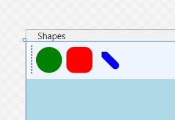
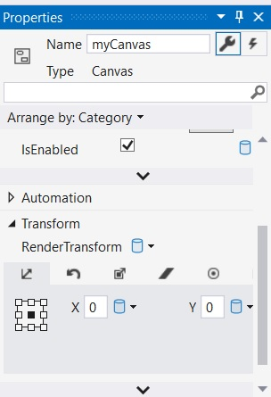

# Служби відтворення графіки WPF

У цьому розділі ви розглянете можливості WPF для графічного відтворення. Як ви побачите, WPF надає три окремі способи відтворення графічних даних: фігури, малюнки та візуальні елементи. Після того, як ви зрозумієте плюси та мінуси кожного підходу, ви почнете вивчати світ інтерактивної 2D-графіки за допомогою класів System.Windows.Shapes. Після цього ви побачите, як креслення та геометрія дозволяють відтворювати 2D-дані більш легким способом. Нарешті, ви дізнаєтеся, як візуальний рівень забезпечує вам найбільший рівень потужності та продуктивності. По дорозі ви дослідите кілька пов’язаних тем, наприклад, як створювати власні пензлі та пера, як застосовувати графічні трансформації до візуалізації та як виконувати операції перевірки попадання. Ви побачите, як інтегровані інструменти Visual Studio та додатковий інструмент під назвою Inkscape можуть спростити ваші спроби графічного кодування.

Графіка є ключовим аспектом розробки WPF. Навіть якщо ви не створюєте прикладну програму з великою кількістю графіки (наприклад, відеогру чи мультимедійну програму), теми в цьому розділі є критичними, коли ви працюєте з такими службами, як шаблони керування, анімація та налаштування прив’язки даних.

## Розуміння служб графічного рендерингу WPF

WPF використовує особливий вид графічного рендерингу, який називається графікою в режимі збереження. Простіше кажучи, це означає, що оскільки ви використовуєте XAML або процедурний код для генерації графічних візуалізацій, WPF несе відповідальність за збереження цих візуальних елементів і забезпечення їх правильного перемальовування та оновлення оптимальним чином. Таким чином, коли ви візуалізуєте графічні дані, вони завжди присутні, навіть якщо кінцевий користувач приховує зображення, змінюючи розмір або мінімізуючи вікно, закриваючи вікно іншим і так далі.
На відміну від попередніх API графічного відтворення Microsoft (включаючи GDI+ Windows Forms) були графічними системами негайного режиму. У цій моделі програміст повинен був переконатися, що відтворені візуальні елементи правильно «запам’ятовуються» та оновлюються протягом життя програми. Наприклад, у програмі Windows Forms візуалізація такої форми, як прямокутник, передбачала обробку події Paint (або перевизначення віртуального методу OnPaint()), отримання об’єкта Graphics для малювання прямокутника та, що найважливіше, додавання інфраструктури для забезпечення збереження зображення, коли користувач змінював розмір вікна (наприклад, створення змінних-членів для представлення положення прямокутника та виклик Invalidate() у вашій програмі).
Перехід від графіки негайного режиму до режиму збереження — це справді добре, оскільки програмістам доводиться створювати та підтримувати набагато менш грубий графічний код. Однак я не стверджую, що графічний API WPF повністю відрізняється від попередніх наборів інструментів візуалізації. Наприклад, як і GDI+, WPF підтримує різні типи пензлів і об’єктів пера, методи перевірки попадання, області відсікання, графічні трансформації тощо. Отже, якщо ви зараз маєте досвід роботи з GDI+ (або GDI на основі C/C++), ви вже багато знаєте про те, як виконувати базові візуалізації в WPF.

## Параметри графічного відтворення WPF

Як і в інших аспектах WPF розробки, у вас є ряд варіантів щодо виконання свого графічного візуалізації, поза рішенням цього за допомогою XAML або процедурного коду C# (або, можливо, комбінації обох). Зокрема, WPF надає наступні три чіткі способи надання графічних даних:

    Фігури: WPF надає простір імен System.Windows.Shapes, який визначає невелику кількість класів для візуалізації 2D геометричних об’єктів (прямокутників, еліпсів, багатокутників тощо). Незважаючи на те, що ці типи прості у використанні та потужні, вони мають значну кількість накладних витрат пам’яті, якщо використовувати їх бездумно.

    Малюнки та геометрія: WPF API надає другий спосіб візуалізації графічних даних, використовуючи нащадків абстрактного класу System.Windows.Media.Drawing. Використовуючи такі класи, як GeometryDrawing або ImageDrawing (на додаток до різних геометричних об’єктів), ви можете відтворювати графічні дані більш легким (але менш багатим на функції) способом.

    Візуальні елементи: найшвидший і найпростіший спосіб візуалізації графічних даних у WPF — використання візуального рівня, який доступний лише через код C#. Використовуючи нащадки System.Windows.Media.Visual, ви можете спілкуватися безпосередньо з графічною підсистемою WPF. 


Причина пропонування різних способів робити те саме (тобто відтворення графічних даних) пов’язана з використанням пам’яті та, зрештою, продуктивністю програми. Оскільки WPF є системою, що насичена графікою, цілком розумно, що програма візуалізує сотні чи навіть тисячі різних зображень на поверхні вікна, і вибір реалізації (форми, малюнки або візуальні елементи) може мати величезний вплив.
Зрозумійте, що коли ви створюєте програму WPF, велика ймовірність, що ви використаєте всі три варіанти. Як правило, якщо вам потрібен невеликий обсяг інтерактивних графічних даних, якими може керувати користувач (отримувати введення мишею, відображати спливаючі підказки тощо), ви захочете використовувати члени в просторі імен System.Windows.Shapes. 
На відміну від цього, креслення та геометрії більш підходять, коли вам потрібно моделювати складні, загалом неінтерактивні, векторні графічні дані за допомогою XAML або C#. Хоча креслення та геометрії все ще можуть реагувати на події миші, перевірку попадання та операції перетягування, зазвичай для цього потрібно створити більше коду.
І останнє, але не менш важливе: якщо вам потрібен найшвидший із можливих спосіб відтворення величезних обсягів графічних даних, візуальний рівень — це ваш шлях. Наприклад, скажімо, ви використовуєте WPF для створення наукового додатку, який може відобразити тисячі точок даних. Використовуючи візуальний шар, ви можете візуалізувати точки графіка найоптимальнішим способом. Як ви побачите далі в цій главі, візуальний рівень доступний лише через код C# і не підтримує XAML. 
Незалежно від того, який підхід ви оберете (форми, малюнки та геометрія чи візуальні елементи), ви будете використовувати звичайні графічні примітиви, такі як пензлі (які заповнюють інтер’єри), ручки (які малюють екстер’єри) та об’єкти трансформації (які, ну, перетворюють дані).

WPF також постачається з повномасштабним API, який можна використовувати для візуалізації та обробки 3D-графіки, яка не розглядається в цьому тексті.

# Візуалізація графічних даних за допомогою фігур

Члени простору імен System.Windows.Shapes забезпечують найпростіший, найбільш інтерактивний, але найбільш інтенсивний в використані пам'яті спосіб відтворення двовимірного зображення.Цей простір імен (визначений у збірці PresentationFramework.dll) досить малий і складається лише з шести закритих класів, які розширюють абстрактний базовий клас Shape: Ellipse, Rectangle, Line, Polygon, Polyline та Path.
Абстрактний клас Shape успадковується від FrameworkElement, який успадковується від UIElement. Ці класи визначають членів для роботи з розміром, підказками, курсорами миші тощо. Враховуючи цей ланцюжок успадкування, коли ви візуалізуєте графічні дані за допомогою класів, похідних від Shape, об’єкти майже такі ж функціональні (що стосується взаємодії користувача), як і елемент керування WPF!
Наприклад, визначення того, чи клацнув користувач ваше відтворене зображення, не складніше, ніж обробка події MouseDown. Як простий приклад, якщо ви є автором цього XAML об’єкта Rectangle у сітці вашого початкового вікна:

```xml
<Rectangle x:Name="myRectangle" Stroke="Black" Height="100" Width="100" Fill="White" MouseDown="myRectangle_MouseDown"/>
```
ви можете реалізувати обробник події C# для події MouseDown, яка змінює колір тла прямокутника під час натискання, ось так:

```cs
        private void myRectangle_MouseDown(object sender, MouseButtonEventArgs e)
        {
            myRectangle.Fill = Brushes.Pink;
        }
```
На відміну від інших наборів графічних інструментів, якими ви, можливо, користувалися, вам не потрібно створювати купу інфраструктурного коду, який вручну відображатиме координати миші в геометрії, вручну обчислює перевірку влучень, візуалізує у закадровий буфер тощо. Члени System.Windows.Shapes просто відповідають на події, які ви реєструєте, так само, як типовий елемент керування WPF (наприклад, Button тощо).
Крім функцій, успадкованих від батьківських класів UIElement і FrameworkElement, Shape визначає кількість членів для кожного з дочірніх класів; Таблиця показує деякі з найбільш корисних.

Ключові властивості базового класу Shape

|Властивість|Значення в використані|
|-----------|----------------------|
|DefiningGeometry|Повертає об’єкт Geometry, який представляє загальні розміри поточної форми. Цей об’єкт містить лише точки графіка, які використовуються для візуалізації даних, і не має слідів функціональності UIElement або FrameworkElement.|
|Fill|Дозволяє вказати brush об’єкт для заповнення внутрішньої частини фігури.|
|GeometryTransform|Дозволяє застосовувати трансформації до фігури перед її відображенням на екрані.Успадкована властивість RenderTransform (від UIElement) застосовує трансформацію після її відтворення на екрані.|
|Stretch|Описує, як заповнити фігуру в межах виділеного для неї простору, наприклад її положення в менеджері макета. Це контролюється за допомогою відповідного перерахування System.Windows.Media.Stretch.|
|Stroke|Визначає об’єкт пензля або, в деяких випадках, об’єкт пера (який насправді є замаскованим пензлем), який використовується для малювання меж фігури.|
|StrokeDashArray, StrokeEndLineCap, StrokeStartLineCap, StrokeThickness|Ці (та інші) властивості, пов’язані з обведенням, керують конфігурацією ліній під час малювання меж фігури. У більшості випадків ці властивості налаштовують пензель, який використовується для малювання рамки або лінії.|

Якщо ви забудете встановити властивості Fill і Stroke, WPF дасть вам «невидимі» пензлі, і, отже, форму не буде видно на екрані!

## Додавання прямокутників, еліпсів і ліній до полотна (Canvas)

Ви створите програму WPF, яка може відтворювати фігури за допомогою XAML і C#, і, роблячи це, дізнаєтесь трохи про процес перевірки попадання. Створіть нову програму WPF під назвою RenderingWithShapes і змініть Title MainWindow.xaml на «Shapes»

```xml
    <DockPanel LastChildFill="True">
        <ToolBar DockPanel.Dock="Top" Name="mainToolBar" Height="50">
            
        </ToolBar>
        <Canvas  Background="LightBlue" Name="canvasDrawingArea" />
    </DockPanel>
```
Тепер заповніть ToolBar набором об'єктів RadioButton, кожен з яких містить певний похідний від Shape клас як вміст. Зауважте, що кожній <RadioButton> призначено одне й те саме GroupName (для забезпечення взаємної ексклюзивності), а також дається відповідне ім’я.

```xml
        <ToolBar DockPanel.Dock="Top" Name="mainToolBar" Height="50">
            <RadioButton Name="circleOption" GroupName="shapeSelection" Click="circleOption_Click" >
                <Ellipse Fill="Green" Height="35" Width="35" />
            </RadioButton>
            <RadioButton Name="rectOption" GroupName="shapeSelection" Click="rectOption_Click" >
                <Rectangle Fill="Red" Height="35" Width="35" RadiusY="10" RadiusX="10" />
            </RadioButton>
            <RadioButton Name="lineOption" GroupName="shapeSelection" Click="lineOption_Click" >
                <Line Height="35" Width="35" StrokeThickness="10" Stroke="Blue"
          X1="10" Y1="10" Y2="25" X2="25"
          StrokeStartLineCap="Triangle" StrokeEndLineCap="Round" />
            </RadioButton>
        </ToolBar>
```
Як бачите, оголошення об’єктів Rectangle, Ellipse і Line у ​​XAML є доволі простим і не потребує коментарів. Пам’ятайте, що властивість Fill використовується для визначення пензля для малювання внутрішньої частини фігури. Якщо вам потрібен однотонний пензель, просто вкажіть жорстко закодований рядок із відомими значеннями, і базовий конвертер типів згенерує правильний об’єкт. Одна цікава особливість типу Rectangle полягає в тому, що він визначає властивості RadiusX і RadiusY, щоб дозволити вам відтворювати вигнуті кути.
Лінія представляє свою початкову та кінцеву точки за допомогою властивостей X1, X2, Y1 та Y2 (враховуючи, що висота та ширина мають мало сенсу при описі лінії). Тут ви встановлюєте кілька додаткових властивостей, які керують відтворенням початкової та кінцевої точок лінії, а також тим, як налаштувати параметри обведення. На малюнку показано відтворену панель інструментів, яку можна побачити через дизайнер Visual Studio WPF.



Тепер за допомогою вікна «Properties» Visual Studio обробіть подію MouseLeftButtonDown для Canvas і обробіть подію Click для кожної RadioButton. У вашому файлі C# ваша мета — відобразити вибрану фігуру (коло, квадрат або лінію), коли користувач клацає в Canvas. Спочатку визначте такий вкладений перелік (і відповідну змінну-член) у своєму класі, похідному від Window:

```cs
    public partial class MainWindow : Window
    {
        private enum SelectedShape
        { Circle, Rectangle, Line }
        private SelectedShape _currentShape;
      
       //...
    }
```
У кожному обробнику події Click установіть для змінної-члена currentShape правильне значення SelectedShape таким чином:

```cs
        private void circleOption_Click(object sender, RoutedEventArgs e)
        {
            _currentShape = SelectedShape.Circle;   
        }
        private void rectOption_Click(object sender, RoutedEventArgs e)
        {
            _currentShape = SelectedShape.Rectangle;
        }
        private void lineOption_Click(object sender, RoutedEventArgs e)
        {
            _currentShape = SelectedShape.Line;
        }
```

За допомогою обробника події MouseLeftButtonDown Canvas ви візуалізуєте правильну форму (заздалегідь визначеного розміру), використовуючи позицію X, Y курсора миші як початкову точку. Ось повна реалізація з наступним аналізом:

```cs
        private void canvasDrawingArea_MouseLeftButtonDown(object sender, MouseButtonEventArgs e)
        {
            Shape? shapeToRender = null;
            // Configure the correct shape to draw.
            switch (_currentShape)
            {
                case SelectedShape.Circle:
                    shapeToRender = new Ellipse() { Fill = Brushes.Green, Height = 35, Width = 35 };
                    break;
                case SelectedShape.Rectangle:
                    shapeToRender = new Rectangle()
                    { Fill = Brushes.Red, Height = 35, Width = 35, RadiusX = 10, RadiusY = 10 };
                    break;
                case SelectedShape.Line:
                    shapeToRender = new Line()
                    {
                        Stroke = Brushes.Blue,
                        StrokeThickness = 10,
                        X1 = 0,
                        X2 = 50,
                        Y1 = 0,
                        Y2 = 50,
                        StrokeStartLineCap = PenLineCap.Triangle,
                        StrokeEndLineCap = PenLineCap.Round
                    };
                    break;
                default:
                    return;
            }
            // Set top/left position to draw in the canvas.
            Canvas.SetLeft(shapeToRender, e.GetPosition(canvasDrawingArea).X);
            Canvas.SetTop(shapeToRender, e.GetPosition(canvasDrawingArea).Y);
            // Draw shape!
            canvasDrawingArea.Children.Add(shapeToRender);
        }
```

Як бачите, ви тестуєте змінну-член currentShape, щоб створити правильний об’єкт, похідний від Shape. Після цього ви встановлюєте верхнє ліве значення в Canvas за допомогою вхідних MouseButtonEventArgs. І останнє, але не менш важливе: ви додаєте новий тип, отриманий від Shape, до колекції об’єктів UIElement, яку підтримує Canvas. Якщо ви запустите свою програму зараз, ви зможете клацнути будь-де на полотні та побачити вибрану форму, відтворену в місці клацання лівою кнопкою миші.

Ви можете помітити, що об’єкти Еліпс, Прямокутник і Лінія, які створюються в цьому методі, мають ті самі параметри властивостей, що й відповідні визначення XAML! Як ви можете сподіватися, ви можете оптимізувати цей код, але це вимагає розуміння ресурсів об’єкта WPF, які ви дослідите в іншому розділі.

## Видалення прямокутників, еліпсів і ліній із полотна

Коли Canvas підтримує колекцію об’єктів, ви можете задатися питанням, як можна динамічно видалити елемент, можливо, у відповідь на клацання користувачем фігури правою кнопкою миші. Ви, звичайно, можете зробити це за допомогою класу в просторі імен System.Windows.Media, що називається VisualTreeHelper. Інший розділ пояснює роль «візуальних дерев» і «логічних дерев» досить детально. До того часу ви можете обробляти подію MouseRightButtonDown на вашому об’єкті Canvas і реалізувати відповідний обробник подій таким чином:

```cs
        private void canvasDrawingArea_MouseRightButtonDown(object sender, MouseButtonEventArgs e)
        {
            // First, get the X,Y location of where the user clicked.
            Point pt = e.GetPosition((Canvas)sender);
            // Use the HitTest() method of VisualTreeHelper to see if the user clicked
            // on an item in the canvas.
            HitTestResult result = VisualTreeHelper.HitTest(canvasDrawingArea, pt);
            // If the result is not null, they DID click on a shape!
            if (result != null)
            {
                // Get the underlying shape clicked on, and remove it from
                // the canvas.
                canvasDrawingArea.Children.Remove(result.VisualHit as Shape);
            }
        }
```
Цей метод починається з отримання точного розташування X, Y, яке користувач клацнув на Canvas, і виконує операцію перевірки попадання за допомогою статичного методу VisualTreeHelper.HitTest(). Повернене значення, об’єкт HitTestResult, матиме значення null, якщо користувач не клацне UIElement у Canvas. Якщо HitTestResult не є нульовим, ви можете отримати основний UIElement, який було клацнуто через властивість VisualHit, яку ви транслюєте в об’єкт, похідний від Shape (пам’ятайте, що Canvas може містити будь-який UIElement, а не лише фігури!). Знову ж таки, ви отримаєте більше деталей про те, що таке «візуальне дерево» в наступному розділі.

    За замовчуванням VisualTreeHelper.HitTest() повертає самий верхній UIElement, на який було натиснуто, і не надає інформацію про інші об’єкти під цим елементом (наприклад, об’єкти, що перекриваються за Z-порядком).

Завдяки цій модифікації ви зможете додавати форму до полотна лівою кнопкою миші та видаляти елемент із полотна правою кнопкою миші!
Поки що добре. На цьому етапі ви використали об’єкти, отримані від Shape, для відтворення вмісту RadioButtons за допомогою XAML і заповнили Canvas за допомогою C#. Ви додасте трохи більше функціональності цьому прикладу, коли дослідите роль пензлів і графічних трансформацій. У зв’язку з цим інший приклад у цій главі проілюструє техніку перетягування об’єктів UIElement. А поки давайте розглянемо решту членів System.Windows.Shapes.

## Робота з ламаними лініями та багатокутниками

У поточному прикладі використано лише три класи, похідні від Shape. Решта дочірніх класів (Polyline, Polygon і Path) надзвичайно стомлююча для правильного візуалізації без підтримки інструментів (таких як Microsoft Blend, допоміжний інструмент для Visual Studio, розроблений для розробників WPF, або інші інструменти, які можуть створювати векторну графіку), просто тому, що вони потребують великої кількості точок графіка для представлення результату. Ось огляд решти типів фігур.
Тип Polyline дозволяє визначити набір координат (x, y) (через властивість Points), щоб намалювати серію відрізків ліній, які не потребують з’єднання кінців. Тип Polygon схожий; однак він запрограмований таким чином, що завжди закриватиме початкову та кінцеву точки та заповнюватиме внутрішню частину вказаним пензлем.
Припустімо, ви створили такий StackPanel :

```xml
      <Canvas  Background="LightBlue" Name="canvasDrawingArea" MouseLeftButtonDown="canvasDrawingArea_MouseLeftButtonDown" MouseRightButtonDown="canvasDrawingArea_MouseRightButtonDown">
          <StackPanel>
              <!-- Polylines do not automatically connect the ends. -->
              <Polyline Stroke ="Red" StrokeThickness ="20" StrokeLineJoin ="Round" Points ="10,10 40,40 10,90 300,50"/>
              <!-- A Polygon always closes the end points. -->
              <Polygon Fill ="AliceBlue" StrokeThickness ="5" Stroke ="Green" Points ="40,10 70,80 10,50" />
          </StackPanel>
      </Canvas>
```

## Робота з Path

Використання лише типів Rectangle, Ellipse, Polygon, Polyline та Line для малювання детального 2D-векторного зображення було б надзвичайно складним, оскільки ці примітиви не дозволяють легко отримувати графічні дані, такі як криві, об’єднання даних, що перекриваються, тощо. Останній клас, отриманий від Shape, Path, надає можливість визначати складні 2D графічні дані, представлені як набір незалежних геометрій. Після того як ви визначили набір таких геометрій, ви можете призначити їх властивості Data класу Path, де ця інформація буде використана для відтворення вашого складного 2D-зображення.
Властивість Data приймає клас, похідний від System.Windows.Media.Geometry, який містить ключові члени, описані в таблиці.

Вибрані члени типу System.Windows.Media.Geometry

|Член|Значення|
|----|--------|
|Bounds|Встановлює поточний обмежувальний прямокутник, що містить геометрію.|
|FillContains()|Визначає, чи дана точка (або інший об’єкт Geometry) знаходиться в межах певного класу, похідного від Geometry. Це корисно для розрахунків перевірки попадань.|
|GetArea()|Повертає всю область, яку займає тип, похідний від Geometry.|
|GetRenderBounds()|Повертає Rect, який містить найменший можливий прямокутник, який можна використати для візуалізації похідного від Geometry класу.|
|Transform|Призначає об’єкт Transform для геометрії, щоб змінити візуалізацію.|

Класи, які розширюють Geometry, дуже схожі на їхні аналоги, похідні від Shape. Наприклад, EllipseGeometry має члени, подібні до Ellipse. Велика відмінність полягає в тому, що класи, похідні від Geometry, не знають, як безпосередньо візуалізувати себе, оскільки вони не є елементами UIElements. Натомість класи, похідні від Geometry, являють собою трохи більше, ніж набір точкових даних, які, по суті, говорять: «Якщо Path використовує мої дані, це те, як я буду відображати себе».

Класи, похідні від Geometry

|Класс|Значення|
|-----|--------|
|LineGeometry|Являє собою пряму лінію|
|RectangleGeometry|Являє собою прямокутник|
|EllipseGeometry|Являє собою еліпс|
|GeometryGroup|Дозволяє групувати декілька об’єктів Geometry|
|CombinedGeometry|Дозволяє об’єднати два різні об’єкти Geometry в одну фігуру|
|PathGeometry|Являє собою фігуру, що складається з ліній і кривих|

    Path — не єдиний клас у WPF, який може використовувати колекцію геометрій. Наприклад, DoubleAnimationUsingPath, DrawingGroup, GeometryDrawing і навіть UIElement можуть використовувати геометрії для візуалізації за допомогою властивостей PathGeometry, ClipGeometry, Geometry та Clip відповідно.

Нижче наведено Path, який використовує кілька типів, отриманих від Geometry. Зверніть увагу, що ви встановлюєте властивість Data для Path на об’єкт GeometryGroup, який містить інші об’єкти, похідні від Geometry, такі як EllipseGeometry, RectangleGeometry та LineGeometry.

```xml
            <Path Fill = 'Orange' Stroke = 'Blue' StrokeThickness = '3'>
                <Path.Data>
                    <GeometryGroup>
                        <EllipseGeometry Center = '75,70' RadiusX = '30' RadiusY = '30' />
                        <RectangleGeometry Rect = '25,55 100 30' />
                        <LineGeometry StartPoint='0,0' EndPoint='70,30' />
                        <LineGeometry StartPoint='70,30' EndPoint='0,30' />
                    </GeometryGroup>
                </Path.Data>
            </Path>

```
Зображення могло бути відтворено за допомогою класів Line, Ellipse і Rectangle, показаних раніше. Однак це призвело б до розміщення різних об’єктів UIElement у пам’яті. Коли ви використовуєте геометрію для моделювання точок графіка того, що потрібно намалювати, а потім поміщаєте колекцію геометрії в контейнер, який може відтворювати дані (у цьому випадку Path), ви зменшуєте витрати пам’яті.
Тепер згадайте, що Path має такий самий ланцюжок успадкування, як і будь-який інший член System.Windows.Shapes, і тому може надсилати ті самі сповіщення про події, що й інші об’єкти UIElement. Таким чином, якби ви визначили той самий елемент <Path> у проекті Visual Studio, ви могли б визначити, чи клацнув користувач будь-де в рядку розгортки, просто обробивши подію миші.

## Моделювання з Path «Міні-мова»

З усіх класів, перелічених у останій таблиці, PathGeometry є найскладнішим для налаштування з точки зору XAML або коду. Це пов’язано з тим, що кожен сегмент PathGeometry складається з об’єктів, які містять різні сегменти та фігури (наприклад, ArcSegment, BezierSegment, LineSegment, PolyBezierSegment, PolyLineSegment, PolyQuadraticBezierSegment тощо). Ось приклад об’єкта Path, властивість Data якого встановлено на <PathGeometry>, що складається з різних фігур і сегментів:

```xml
<Path Stroke='Black' StrokeThickness='1' >
  <Path.Data>
    <PathGeometry>
      <PathGeometry.Figures>
        <PathFigure StartPoint='10,50'>
          <PathFigure.Segments>
           <BezierSegment
             Point1='100,0'
             Point2='200,200'
             Point3='300,100'/>
           <LineSegment Point='400,100' />
           <ArcSegment
             Size='50,50' RotationAngle='45'
             IsLargeArc='True' SweepDirection='Clockwise'
             Point='200,100'/>
           </PathFigure.Segments>
        </PathFigure>
      </PathGeometry.Figures>
    </PathGeometry>
  </Path.Data>
</Path>
```

Тепер, чесно кажучи, небагатьом програмістам коли-небудь знадобиться вручну створювати складні 2D-зображення, безпосередньо описуючи класи, отримані від Geometry або PathSegment. Далі в цій главі ви дізнаєтеся, як перетворити векторну графіку в оператори шляху, які можна використовувати в XAML. Навіть за допомогою цих інструментів обсяг XAML, необхідний для визначення складного об’єкта Path, був би жахливим, оскільки дані складаються з повних описів різних класів, похідних від Geometry або PathSegment. Щоб створити більш стислу та компактну розмітку, клас Path був розроблений для розуміння спеціальної «міні-мови». Наприклад, замість того, щоб установлювати властивість Data для Path на колекцію типів, похідних від Geometry та PathSegment, ви можете встановити властивість Data на один рядковий літерал, що містить ряд відомих символів і різних значень, які визначають форму, яку потрібно візуалізувати.

```xml
<Path Stroke='Black' StrokeThickness='3' Data='M 10,75 C 70,15 250,270 300,175 H 240' />
```

Команда M (скорочення від переміщення) займає позицію X, Y, яка представляє початкову точку малюнка. Команда C використовує серію точок графіка для візуалізації кривої (точніше, кубічної кривої Безьє), тоді як H малює горизонтальну лінію.

Тепер, чесно кажучи, ймовірність того, що вам коли-небудь знадобиться вручну побудувати або проаналізувати рядковий літерал, що містить інструкції міні-мови Path, дуже мала. Однак, принаймні, ви більше не будете здивовані, переглядаючи спеціальні інструменти, згенеровані XAML.

## Пензлі та пера WPF

Кожна з опцій графічного рендерингу WPF (форма, малюнок і геометрія, а також візуальні елементи) широко використовує пензлі, які дозволяють контролювати, як заливається внутрішня частина 2D-поверхні. WPF надає шість різних типів пензлів, усі з яких розширюють System.Windows.Media.Brush. У той час як пензель є абстрактним, нащадки, описані в таблиці, можуть бути використані для заповнення області майже будь-яким можливим варіантом.

Типи, похідні від Brush WPF

|Тип|Значення|
|---|--------|
|DrawingBrush|Зафарбовує область за допомогою об’єкта, отриманого з малюнка (GeometryDrawing, ImageDrawing або VideoDrawing)|
|ImageBrush|Зафарбовує область зображенням (представленим об’єктом ImageSource)|
|LinearGradientBrush|Зафарбовує область лінійним градієнтом|
|RadialGradientBrush|Зафарбовує область радіальним градієнтом|
|SolidColorBrush|Зафарбовує один колір, заданий за допомогою властивості Color|
|VisualBrush|Зафарбовує область за допомогою об’єкта Visual (DrawingVisual, Viewport3DVisual і ContainerVisual)|

Класи DrawingBrush і VisualBrush дозволяють створити пензель на основі існуючого класу Drawing або Visual. Ці класи пензля використовуються, коли ви працюєте з двома іншими графічними параметрами WPF (малюнками або візуальними елементами), і вони будуть розглянуті пізніше в цьому розділі.
ImageBrush, як випливає з назви, дозволяє створити пензель, який відображає дані зображення із зовнішнього файлу або ресурсу вбудованої програми, встановивши властивість ImageSource. Решта типів пензлів (LinearGradientBrush і RadialGradientBrush) досить прості у використанні, хоча введення необхідного XAML може бути трохи багатослівним. На щастя, Visual Studio підтримує вбудовані редактори пензлів, які спрощують створення стилізованих пензлів.

### Налаштування пензлів за допомогою Visual Studio

Давайте оновимо вашу програму малювання WPF RenderingWithShapes, щоб використовувати ще цікавіші пензлі. Три фігури, які ви використовували для візуалізації даних на панелі інструментів, використовують прості суцільні кольори, тож ви можете зафіксувати їхні значення за допомогою простих рядкових літералів. Щоб трохи оживити ситуацію, тепер ви скористаєтеся вбудованим редактором пензлів. Переконайтеся, що редактор XAML вашого початкового вікна є відкритим вікном у IDE, і виберіть елемент Ellipse. Тепер у вікні «Properties» знайдіть категорію «Brush» і клацніть властивість «Fill» вгорі.

У верхній частині редактора пензлів ви побачите набір властивостей, які «сумісні з пензлем» для вибраного елемента (тобто Fill, Stroke, та OpacityMask). Під нею ви побачите серію вкладок, які дозволяють налаштувати різні типи пензлів, у тому числі поточну суцільну кольорову кисть. Ви можете використовувати інструмент вибору кольору, а також редактори ARGB (альфа, червоний, зелений і синій, де «альфа» контролює прозорість) для керування кольором поточного пензля. Використовуючи ці повзунки та відповідну область вибору кольору, ви можете створити будь-який суцільний колір. Використовуйте ці інструменти, щоб змінити колір заливки вашого еліпса та переглянути отриманий XAML. Ви помітите, що колір зберігається як шістнадцяткове значення, як показано нижче:

```xml
<Ellipse Fill="#FF408C40" Height="35" Width="35" />
```
Що ще цікавіше, цей же редактор дозволяє вам налаштовувати пензлі градієнта, які використовуються для визначення серії кольорів і точок переходу. Пам’ятайте, що цей редактор пензлів надає вам набір вкладок, перша з яких дозволяє встановити нульовий пензель, щоб не відображати результат. Інші чотири дозволяють налаштувати суцільний кольоровий пензель (те, що ви щойно розглянули), градієнтний пензель, плитковий пензель або пензель зображення.
Натисніть кнопку пензля градієнта, і редактор відобразить кілька нових параметрів. Три кнопки в нижньому лівому куті дозволяють вибрати лінійний градієнт, вибрати радіальний градієнт або змінити межі градієнта. Найнижня смужка покаже вам поточний колір кожної зупинки градієнта, кожна з яких позначена «великим пальцем» на смузі. Перетягуючи ці великі пальці по смузі градієнта, ви можете контролювати зміщення градієнта. Крім того, коли ви клацаєте певний великий палець, ви можете змінити колір для цього конкретного градієнта за допомогою селектора кольорів. Нарешті, якщо ви клацнете безпосередньо на смузі градієнта, ви можете додати межі градієнта.
Приділіть кілька хвилин, щоб пограти з цим редактором, щоб створити пензель радіального градієнта, що містить три градієнтні зупинки, встановлені на ваш вибір кольорів.
Коли ви закінчите, IDE оновить ваш XAML за допомогою спеціального пензля, налаштованого на властивість, сумісну з пензлем (властивість Fill еліпса в цьому прикладі), використовуючи синтаксис елемента властивості, як показано нижче:
```xml
                <Ellipse Height="35" Width="35">
                    <Ellipse.Fill>
                        <RadialGradientBrush>
                            <GradientStop Color="#FF17F800"/>
                            <GradientStop Color="#FF24F610" Offset="1"/>
                            <GradientStop Color="#FF1A6A12" Offset="0.546"/>
                        </RadialGradientBrush>
                    </Ellipse.Fill>
                </Ellipse>

```

### Налаштування пензлів у коді

Тепер, коли ви створили настроюваний пензель для визначення XAML вашого Ellipse, відповідний код C# застарів, оскільки він усе ще відображатиме суцільний зелений круг.Щоб синхронізувати резервну копію, оновіть правильний оператор case, щоб використовувати той самий пензель, який ви щойно створили. Нижче наведено необхідне оновлення, яке виглядає складнішим, ніж ви могли б очікувати, лише тому, що ви перетворюєте шістнадцяткове значення на належний об’єкт Color за допомогою класу System.Windows.Media.ColorConverter (див. Малюнок 27-7 для зміненого виводу):

```cs
                case SelectedShape.Circle:
                    shapeToRender = new Ellipse() { Height = 35, Width = 35 };
                    // Make a RadialGradientBrush in code!
                    RadialGradientBrush brush = new RadialGradientBrush();
                    brush.GradientStops.Add(new GradientStop(
                        (Color)ColorConverter.ConvertFromString("#FF17F800"), 0));
                    brush.GradientStops.Add(new GradientStop(
                        (Color)ColorConverter.ConvertFromString("#FF24F610"), 1));
                    brush.GradientStops.Add(new GradientStop(
                        (Color)ColorConverter.ConvertFromString("#FF1A6A12"), 0.546));
                    shapeToRender.Fill = brush;
                    break;
```

До речі, ви можете створити об’єкти GradientStop, вказавши простий колір як перший параметр конструктора за допомогою переліку Colors, який повертає налаштований об’єкт Color.

```cs
GradientStop g = new GradientStop(Colors.Aquamarine, 1);
```
Або, якщо вам потрібен ще точніший контроль, ви можете передати налаштований об’єкт Color, наприклад:

```cs
Color myColor = new Color() { R = 200, G = 100, B = 20, A = 40 };
GradientStop g = new GradientStop(myColor, 34);
```
Звичайно, перелік Colors і клас Color не обмежуються градієнтними пензлями. Ви можете використовувати їх будь-коли, коли вам потрібно представити значення кольору в коді.

### Налаштування Pens

На відміну від пензлів, перо — це об’єкт для малювання меж геометрії або, у випадку класу Line або PolyLine, сама геометрія лінії. Зокрема, клас Pen дозволяє малювати задану товщину, представлену подвійним значенням. Крім того, ручка може бути налаштована за допомогою тих самих властивостей, що й у класі Shape, як-от запуск і зупинка ковпачків ручок, крапково-штрихові шаблони тощо. Наприклад, ви можете додати таку розмітку до форми, щоб визначити атрибути пера:

```xml
<Pen Thickness='10' LineJoin='Round' EndLineCap='Triangle' StartLineCap='Round' />
```
У багатьох випадках вам не потрібно буде безпосередньо створювати об’єкт Pen, оскільки це буде зроблено опосередковано, коли ви призначатимете значення властивостям, таким як StrokeThickness, похідному типу Shape (а також іншим UIElements). Однак створення спеціального об’єкта Pen є зручним під час роботи з типами, похідними від Drawing (описано далі в цьому розділі). У Visual Studio немає редактора пера як такого, але він дозволяє вам налаштувати всі властивості вибраного елемента, орієнтовані на обведення, за допомогою вікна «Properties».

## Застосування графічних перетворень

Щоб завершити обговорення використання фігур, давайте звернемося до теми трансформацій. WPF поставляється з численними класами, які розширюють абстрактний базовий клас System.Windows.Media.Transform.

Ключові нащадки типу System.Windows.Media.Transform

|Тип|Значення |
|---|---------|
|MatrixTransform|Створює довільне матричне перетворення, яке використовується для керування об’єктами або системами координат у 2D-площині|
|RotateTransform|Обертає об’єкт за годинниковою стрілкою навколо вказаної точки у 2D (x, y) системі координат|
|ScaleTransform|Масштабує об’єкт у 2D (x, y) системі координат|
|SkewTransform|Перекошує об’єкт у 2D (x, y) системі координат|
|TranslateTransform|Переміщує (переміщує) об’єкт у 2D (x, y) системі координат|
|TransformGroup|Представляє складене перетворення, що складається з інших об’єктів перетворення|

Перетворення можна застосовувати до будь-якого UIElement (наприклад, нащадків Shape, а також елементів керування, таких як елементи керування Button, елементи керування TextBox тощо). Використовуючи ці класи трансформації, ви можете візуалізувати графічні дані під заданим кутом, перекошувати зображення по поверхні та розширювати, зменшувати або перевертати цільовий елемент різними способами.

    Хоча об’єкти трансформації можна використовувати де завгодно, ви знайдете їх найбільш корисними під час роботи з анімацією WPF і спеціальними шаблонами керування. Як ви побачите далі в цьому розділі, ви можете використовувати анімацію WPF, щоб додати візуальні підказки кінцевому користувачеві для настроюваного елемента керування.

Перетворення (або їх цілий набір) можна призначити цільовому об’єкту (наприклад, кнопці, шляху тощо) за допомогою двох загальних властивостей LayoutTransform і RenderTransform.
Властивість LayoutTransform корисна тим, що перетворення відбувається до того, як елементи візуалізуються в диспетчер макета, і тому перетворення не впливатиме на операції Z-впорядкування (іншими словами, перетворені дані зображення не перекриватимуться).
Властивість RenderTransform, з іншого боку, виникає після того, як елементи знаходяться у своєму контейнері, і тому цілком можливо, що елементи можна трансформувати таким чином, щоб вони могли перекривати один одного, залежно від того, як вони були розташовані в контейнері.

### Перший погляд на трансформації

Ви додасте деяку трансформаційну логіку до свого проекту RenderingWithShapes трохи пізніше. Додайте в ToolBar

```xml
           <Button x:Name="rectangle" Content="Rectangle" Click="rectangle_Click"/>
```

```cs
        private void rectangle_Click(object sender, RoutedEventArgs e)
        {
            WindowRectangle windowRectangle = new();
            windowRectangle.Show();
        }
```
Визначте просту властивість StackPanel Orientation на Horizontal.Тепер додайте наступний прямокутник, який буде намальовано під кутом 45 градусів за допомогою об’єкта RotateTransform:

```xml
<Window x:Class="RenderingWithShapes.WindowRectangle"
        ...
        xmlns:local="clr-namespace:RenderingWithShapes"
        mc:Ignorable="d"
        Title="Transformaions" Height="450" Width="800">
    <StackPanel Orientation="Horizontal">
        <!-- A Rectangle with a rotate transformation. -->
        <Rectangle Height ='100' Width ='40' Fill ='Red'>
            <Rectangle.LayoutTransform>
                <RotateTransform Angle ='45'/>
            </Rectangle.LayoutTransform>
        </Rectangle>
    </StackPanel>

</Window>
```
Ось кнопка Button, яка перекошена по поверхні на 20 градусів за допомогою <SkewTransform>:

```xml
<!-- A Button with a skew transformation. -->
<Button Content ='Click Me!' Width='95' Height='40'>
  <Button.LayoutTransform>
   <SkewTransform AngleX ='20' AngleY ='20'/>
  </Button.LayoutTransform>
</Button>
```
І для хорошої міри, ось еліпс, який масштабується на 20 градусів за допомогою ScaleTransform (зверніть увагу на значення, встановлені для початкових Height і Width), а також TextBox, до якого застосована група об’єктів трансформації:

```xml
<!-- An Ellipse that has been scaled by 20%. -->
<Ellipse Fill ='Blue' Width='5' Height='5'>
  <Ellipse.LayoutTransform>
    <ScaleTransform ScaleX ='20' ScaleY ='20'/>
  </Ellipse.LayoutTransform>
</Ellipse>
<!-- A TextBox that has been rotated and skewed. -->
<TextBox Text ='Me Too!' Width='50' Height='40'>
  <TextBox.LayoutTransform>
    <TransformGroup>
      <RotateTransform Angle ='45'/>
      <SkewTransform AngleX ='5' AngleY ='20'/>
    </TransformGroup>
  </TextBox.LayoutTransform>
</TextBox>
```
Зауважте, що коли застосовано перетворення, вам не потрібно виконувати будь-які обчислення вручну, щоб правильно реагувати на перевірку влучень, фокус введення тощо. Графічний механізм WPF виконує такі завдання від вашого імені. Наприклад ви можете побачити, що TextBox все ще реагує на введення з клавіатури.

### Перетворення ваших даних Canvas

Тепер давайте включимо трохи трансформаційної логіки у ваш приклад RenderingWithShapes. Окрім застосування об’єкта трансформації до окремого елемента (наприклад, Rectangle, TextBox тощо), ви також можете застосувати об’єкти трансформації до менеджера макета, щоб трансформувати всі внутрішні дані. Ви можете, наприклад, відобразити всю DockPanel головного вікна під кутом.

```xml
<DockPanel LastChildFill='True'>
  <DockPanel.LayoutTransform>
    <RotateTransform Angle='45'/>
  </DockPanel.LayoutTransform>
...
</DockPanel>
```
Для цього прикладу це трохи екстремально, тому давайте додамо останню (менш агресивну) функцію, яка дозволяє користувачеві перевертати весь Canvas і всю графіку, що міститься. Почніть із додавання останньої кнопки ToggleButton до панелі інструментів, визначеної таким чином:

```xml
      <ToggleButton Name="flipCanvas" Content="Flip Canvas!" Click="flipCanvas_Click"/>
```

У обробнику події Click створіть об’єкт RotateTransform і під’єднайте його до об’єкта Canvas за допомогою властивості LayoutTransform, якщо натиснути цей новий ToggleButton. Якщо кнопку ToggleButton не натиснуто, видаліть перетворення, встановивши для тієї самої властивості значення null.

```cs
        private void flipCanvas_Click(object sender, RoutedEventArgs e)
        {
            if (flipCanvas.IsChecked == true)
            {
                RotateTransform rotate = new RotateTransform(-180);
                canvasDrawingArea.LayoutTransform = rotate;
            }
            else
            {
                canvasDrawingArea.LayoutTransform = null;
            }
        }
```
Запустіть свою програму та додайте купу графіки по всій області полотна, переконавшись, що вони йдуть від краю до краю. Якщо ви натиснете свою нову кнопку, ви побачите, що дані форми виходять за межі полотна! Це тому, що ви не визначили область відсікання. Замість того, щоб вручну створювати складний код логіки відсікання, просто встановіть для властивості ClipToBounds Canvas значення true, що запобігає візуалізації дочірніх елементів за межами батьківського.

```xml
<Canvas ClipToBounds = "True" ... >
```

Якщо ви знову запустите свою програму, ви побачите, що дані не випливають за межі полотна.
Остання маленька модифікація пов’язана з тим фактом, що коли ви повертаєте полотно, натиснувши кнопку перемикача, а потім клацаєте полотно, щоб намалювати нову форму, точка, у якій ви клацаєте, не є точкою, до якої застосовуються графічні дані. Навпаки, дані відображаються над курсором миші.
Щоб вирішити цю проблему, застосуйте той самий об’єкт трансформації до фігури, що малюється, до того, як відбудеться візуалізація (через RenderTransform). Ось суть коду:

```cs
        private void canvasDrawingArea_MouseLeftButtonDown(object sender, MouseButtonEventArgs e)
        {
            // ...

            if (flipCanvas.IsChecked == true)
            {
                RotateTransform rotate = new RotateTransform(-180);
                shapeToRender.RenderTransform = rotate;
            }
            // Set top/left position to draw in the canvas.
            Canvas.SetLeft(shapeToRender, e.GetPosition(canvasDrawingArea).X);
            Canvas.SetTop(shapeToRender, e.GetPosition(canvasDrawingArea).Y);
            // Draw shape!
            canvasDrawingArea.Children.Add(shapeToRender);
        }
```
На цьому ваш огляд System.Windows.Shapes, пензлів і трансформацій завершується. 
Перш ніж розглядати роль візуалізації графіки за допомогою креслень і геометрії, давайте подивимося, як можна використовувати Visual Studio для спрощення роботи з примітивною графікою.

## Робота з редактором трансформацій Visual Studio

У попередньому прикладі ви застосували різні перетворення, вручну ввівши розмітку та створивши код C#. Хоча це, безумовно, корисно, ви будете раді дізнатися, що остання версія Visual Studio постачається з вбудованим редактором трансформації. Нагадаємо, що будь-який елемент інтерфейсу користувача може бути одержувачем трансформаційних послуг, включаючи систему макета, що містить різні елементи інтерфейсу користувача. Щоб проілюструвати використання редактора трансформацій Visual Studio, створіть нову програму WPF під назвою WorkWithTransforms.

### Побудова початкового макета

Спочатку розділіть початкову сітку на два стовпці за допомогою вбудованого редактора сітки (точний розмір не має значення). Тепер знайдіть елемент керування StackPanel у вашій панелі інструментів і додайте його, щоб він займав увесь простір першого стовпця сітки;

```xml
    <Grid>
        <Grid.ColumnDefinitions>
            <ColumnDefinition/>
            <ColumnDefinition/>
        </Grid.ColumnDefinitions>
        <StackPanel Grid.Column="0">
            <Button x:Name="btnSkew" Content="Skew" Click="btnSkew_Click"/>
            <Button x:Name="btnRotate" Content="Rotate" Click="btnRotate_Click"/>
            <Button x:Name="btnFlip" Content="Flip" Click="btnFlip_Click"/>
        </StackPanel>

    </Grid>

```
Щоб завершити інтерфейс користувача, створіть графіку за вашим вибором (використовуючи будь-який із методів, розглянутих у цьому розділі), визначену у другому стовпці сітки. Розмітку, використану у зразку, наведено тут:

```xml
        <Canvas x:Name="myCanvas" Grid.Column="1">
            <Ellipse HorizontalAlignment="Left" VerticalAlignment="Top"
                     Height="186"  Width="92" Stroke="Black"
                     Canvas.Left="20" Canvas.Top="31">
                <Ellipse.Fill>
                    <RadialGradientBrush>
                        <GradientStop Color="#FF951ED8" Offset="0.215"/>
                        <GradientStop Color="#FF2FECB0" Offset="1"/>
                    </RadialGradientBrush>
                </Ellipse.Fill>
            </Ellipse>
            <Ellipse HorizontalAlignment="Left" VerticalAlignment="Top"
                     Height="101" Width="110" Stroke="Black"
                     Canvas.Left="122" Canvas.Top="126">
                <Ellipse.Fill>
                    <LinearGradientBrush EndPoint="0.5,1" StartPoint="0.5,0">
                        <GradientStop Color="#FFB91DDC" Offset="0.355"/>
                        <GradientStop Color="#FFB0381D" Offset="1"/>
                    </LinearGradientBrush>
                </Ellipse.Fill>
            </Ellipse>
        </Canvas>

```

### Застосування трансформацій під час проектування

Як згадувалося, Visual Studio надає вбудований редактор Transform, який можна знайти на панелі «Properties». Виберіть елемент myCanvas. Знайдіть цю область і переконайтеся, що ви розгорнули розділ Transform, щоб переглянути розділи RenderTransform і LayoutTransform редактора.



Подібно до розділу «Brushes», у розділі «Transform» є кілька вкладок для налаштування різних типів графічної трансформації для поточного вибраного елемента.

Опції перетворення

|Опція|Значення|
|-----|--------|
|Translate|Дозволяє зміщувати розташування елемента по X, Y.|
|Rotate|Дозволяє повертати предмет на 360 градусів.|
|Scale|Дозволяє збільшувати або зменшувати елемент у напрямку X та Y.|
|Skew|Дозволяє зміщувати обмежувальну рамку, що містить вибраний елемент, у напрямку X та Y.|
|Center Point|Коли ви повертаєте або перевертайте об’єкт, він переміщується відносно фіксованої точки, яка називається центральною точкою об’єкта. За замовчуванням центральна точка об’єкта розташована в центрі об’єкта; однак це перетворення дозволяє змінити центральну точку об’єкта, щоб повернути або перевернути об’єкт навколо іншої точки.|
|Flip|Перевертає вибраний елемент на основі центральної точки X або Y.|

Я пропоную вам протестувати кожне з цих перетворень, використовуючи свою спеціальну форму як ціль (просто натисніть Ctrl+Z, щоб скасувати попередню операцію). Як і багато інших аспектів панелі, кожен розділ трансформації має унікальний набір параметрів конфігурації, які повинні стати досить зрозумілими, коли ви попрацюєте. Наприклад, редактор косих перетворень дозволяє встановлювати значення косих X і Y, редактор трансформацій віддзеркалення дозволяє перевертати по осі x або y тощо.

### Перетворення полотна в код

Реалізація кожного обробника події Click буде більш-менш однаковою. Ви налаштуєте об’єкт трансформації та призначите його об’єкту myCanvas. Потім, коли ви запускаєте програму, ви можете натиснути кнопку, щоб побачити результат застосованого перетворення. Ось повний код для кожного обробника подій (зверніть увагу, що ви встановлюєте властивість LayoutTransform, тому дані фігури залишаються розташованими відносно батьківського контейнера):

```cs
        private void btnSkew_Click(object sender, RoutedEventArgs e)
        {
            myCanvas.LayoutTransform = new SkewTransform(40, -20);
        }

        private void btnRotate_Click(object sender, RoutedEventArgs e)
        {
            myCanvas.LayoutTransform = new RotateTransform(180);
        }

        private void btnFlip_Click(object sender, RoutedEventArgs e)
        {
            myCanvas.LayoutTransform = new ScaleTransform(-1, 1);
        }
```

# Візуалізація графічних даних за допомогою креслень і геометрій

Хоча типи фігур дозволяють генерувати інтерактивну двовимірну поверхню будь-якого типу, вони вимагають значного використання пам’яті через багатий ланцюжок успадкування. І хоча клас Path може допомогти усунути частину цих накладних витрат за допомогою вбудованих геометрій (а не великої колекції інших форм), WPF надає складний інтерфейс програмування малювання та геометрії, який візуалізує ще більш легкі 2D векторні зображення.
Точкою входу в цей API є абстрактний клас System.Windows.Media.Drawing (у PresentationCore.dll), який сам по собі лише визначає обмежувальний прямокутник для відтворення. Клас Drawing є значно легшим, ніж Shape, враховуючи, що ані UIElement, ані FrameworkElement не входять до ланцюжка успадкування. WPF надає різні класи, які розширюють Drawing, кожен з яких представляє окремий спосіб малювання вмісту.

Типи, похідні від Drawing

|Тип|Значення|
|---|--------|
|DrawingGroup|Використовується для об’єднання колекції окремих об’єктів, похідних від Drawing, у єдине складене відтворення.|
|GeometryDrawing|Використовується для відтворення двовимірних форм у дуже спрощений спосіб.|
|GlyphRunDrawing|Використовується для відтворення текстових даних за допомогою служб графічного відтворення WPF.|
|ImageDrawing|Використовується для візуалізації файлу зображення або набору геометрії в обмежувальний прямокутник.|
|VideoDrawing|Використовується для відтворення аудіофайлу або відеофайлу. Цей тип можна повністю використовувати лише за допомогою процедурного коду. Якщо ви хочете відтворювати відео через XAML, тип MediaPlayer є кращим вибором.|

Оскільки вони більш легкі, типи, похідні від Drawing, не мають внутрішньої підтримки для обробки вхідних подій, оскільки вони не є UIElements або FrameworkElements (хоча можна програмно виконати логіку перевірки попадання).
Ще одна ключова відмінність між типами, похідними від Drawing, і типами, похідними від Shape, полягає в тому, що типи, похідні від Drawing, не мають можливості відображати себе, оскільки вони не походять від UIElement!Натомість похідні типи мають бути розміщені в об’єкті розміщення (зокрема, DrawingImage, DrawingBrush або DrawingVisual), щоб відобразити їхній вміст.
DrawingImage дозволяє розміщувати креслення та геометрії всередині елемента керування WPF Image, який зазвичай використовується для відображення даних із зовнішнього файлу. DrawingBrush дозволяє створити пензель на основі малюнка та його геометрії, щоб установити властивість, для якої потрібен пензель. Нарешті, DrawingVisual використовується лише у «візуальному» рівні графічного рендерингу, який повністю керується кодом C#.
Хоча використання креслень є дещо складнішим, ніж використання простих форм, це відокремлення графічної композиції від графічного рендерингу робить типи, похідні від малюнків, набагато легшими, ніж типи, похідні від фігур, зберігаючи при цьому ключові служби.

## Створення пензля(DrawingBrush) для малювання за допомогою геометрії

Створемо проект DrawingsAndGeometries. 

Раніше в цій главі ви заповнили Path групою геометрій, наприклад:

```xml
        <Path Fill = 'Orange' Stroke = 'Blue' StrokeThickness = '3'>
            <Path.Data>
                <GeometryGroup>
                    <EllipseGeometry Center = '75,70' RadiusX = '30' RadiusY = '30' />
                    <RectangleGeometry Rect = '25,55 100 30' />
                    <LineGeometry StartPoint='0,0' EndPoint='70,30' />
                    <LineGeometry StartPoint='70,30' EndPoint='0,30' />
                </GeometryGroup>
            </Path.Data>
        </Path>
```
Роблячи це, ви отримуєте інтерактивність від Path, але все ще досить легкі, враховуючи вашу геометрію. Однак, якщо ви хочете відобразити той самий вихід і не потребуєте будь-якої інтерактивності (нестандартної), ви можете розмістити той самий <GeometryGroup> усередині DrawingBrush, ось так:

```xml
        <Canvas.Background>
            <DrawingBrush>
                <DrawingBrush.Drawing>
                    <GeometryDrawing>
                        <GeometryDrawing.Geometry>
                            <GeometryGroup>
                                <EllipseGeometry Center = '75,70' RadiusX = '30' RadiusY = '30' />
                                <RectangleGeometry Rect = '25,55 100 30' />
                                <LineGeometry StartPoint='0,0' EndPoint='70,30' />
                                <LineGeometry StartPoint='70,30' EndPoint='0,30' />
                            </GeometryGroup>
                        </GeometryDrawing.Geometry>
                        <!-- A custom pen to draw the borders. -->
                        <GeometryDrawing.Pen>
                            <Pen Brush='Blue' Thickness='3'/>
                        </GeometryDrawing.Pen>
                        <!-- A custom brush to fill the interior. -->
                        <GeometryDrawing.Brush>
                            <SolidColorBrush Color='Orange'/>
                        </GeometryDrawing.Brush>
                    </GeometryDrawing>
                </DrawingBrush.Drawing>
            </DrawingBrush>
        </Canvas.Background>


```
Коли ви розміщуєте групу геометрій у DrawingBrush, вам також потрібно встановити об’єкт Pen, який використовується для малювання меж, оскільки ви більше не успадковуєте властивість Stroke від базового класу Shape. Тут ви створили <Pen> із тими самими параметрами, що використовувалися в значеннях Stroke і StrokeThickness у попередньому прикладі Path.
Крім того, оскільки ви більше не успадковуєте властивість Fill від Shape, вам також потрібно використовувати синтаксис елемента властивості, щоб визначити об’єкт пензля для використання для DrawingGeometry, який тут є помаранчевим пензлем суцільного кольору, як і попередні параметри Path.
Тепер, коли у вас є DrawingBrush, ви можете використовувати його для встановлення значення будь-якої властивості, для якої потрібен об’єкт пензля(brush). Наприклад, якщо ви створюєте цю розмітку на Kaxaml, ви можете використати синтаксис елемента властивості, щоб намалювати малюнок по всій поверхні сторінки.

Незалежно від того, яку властивість, сумісну з пензлем, ви встановлюєте за допомогою спеціального DrawingBrush, суть полягає в тому, що ви відтворюєте 2D-векторне зображення з набагато меншими витратами, ніж те саме 2D-зображення, відтворене з фігурами.

## Вміщення типів малюнків у DrawingImage

Тип DrawingImage дозволяє вам підключити свою геометрію малюнка до елемента керування WPF Image. Зверніть увагу на наступне:

```xml
<Image>
  <Image.Source>
    <DrawingImage>
      <DrawingImage.Drawing>
        <!--Same GeometryDrawing from above -->
      </DrawingImage.Drawing>
    </DrawingImage>
  </Image.Source>
</Image>
```
У цьому випадку ваш <GeometryDrawing> було розміщено в DrawingImage, а не в DrawingBrush. Використовуючи цей DrawingImage, ви можете встановити властивість Source елемента керування Image.

## Робота з векторними зображеннями

Як ви можете погодитися, художнику-графіку було б досить складно створити складне векторне зображення за допомогою інструментів і методів, наданих Visual Studio. Художники-графіки мають власний набір інструментів, які можуть створити дивовижну векторну графіку. Ні Visual Studio, ні її компаньйон Expression Blend для Visual Studio не мають такого типу дизайну. Перш ніж ви зможете імпортувати векторні зображення в програму WPF, їх потрібно перетворити на вирази Path. На цьому етапі ви можете програмувати зі згенерованою об’єктною моделлю за допомогою Visual Studio. Ви можете знайти зображення, яке використовується (LaserSign.svg), а також дані експортованого шляху (LaserSign.xaml) у папці репоціторія. 

## Перетворення зразка векторного графічного файлу в XAML

Перш ніж ви зможете імпортувати складні графічні дані (наприклад, векторну графіку) у програму WPF, вам потрібно перетворити графіку на дані Path. Як приклад того, як це зробити, почніть із зразка файлу зображення .svg, такого як лазерний знак, згаданий у попередній примітці. Потім завантажте та встановіть інструмент із відкритим кодом під назвою Inkscape (розташований на www.inkscape.org). За допомогою Inkscape відкрийте файл LaserSign.svg із завантаженого розділу. Вам може бути запропоновано оновити формат. Виберіть checkBox Create a backup file... 
Наступні кроки спочатку здадуться трохи дивними, але як тільки ви подолаєте дивацтво, це простий спосіб перетворити векторні зображення на правильний XAML. Отримавши зображення у потрібному вигляді, виберіть пункт меню File ➤ Print. Далі виберіть Microsoft XPS Document Writer як цільовий принтер і натисніть «Print». На наступному екрані введіть ім’я файлу та виберіть місце збереження файлу; потім натисніть Зберегти. Тепер у вас є повний файл *.xps (або *.oxps). Формати *.xps і *.oxps насправді є файлами .zip. Перейменуйте розширення файлу на .zip, і ви зможете відкрити файл у Провіднику файлів (або 7-Zip або вашому улюбленому інструменті архівування).
Потрібний вам файл знаходиться в каталозі глави і має назву 1.fpage.

## Імпортування графічних даних у проект WPF

Створіть нову програму WPF під назвою InteractiveLaserSign. Змініть розмір вікна на висоту 600 і ширину 650 і замініть Grid на Canvas. Скопіюйте весь XAML із файлу 1.fpage (за винятком зовнішнього тегу FixedPage) і вставте його в елемент керування Canvas.

Перегляньте вікно в режимі розробки, і ви побачите знак, відтворений у вашій програмі. Якщо ви переглянете Document Outline,, ви побачите, що кожна частина зображення представлена ​​як елемент Path XAML. Якщо ви зміните розмір вікна, якість зображення залишиться незмінною, незалежно від розміру вікна. Це пояснюється тим, що зображення, представлені елементами Path, візуалізуються за допомогою механізму малювання та математики замість перевертання пікселів.

## Взаємодія зі знаком
Згадайте цей маршрутизований тунель подій і бульбашку, тому будь-який Path, клацнутий усередині Canvas, може бути оброблений обробником подій клацання на Canvas. Оновіть розмітку Canvas до такого:

```xml
<Canvas MouseLeftButtonDown="Canvas_MouseLeftButtonDown">
```
Додайте обробник події з таким кодом:

```cs
        private void Canvas_MouseLeftButtonDown(object sender, MouseButtonEventArgs e)
        {
            if (e.OriginalSource is Path p)
            {
                p.Fill = new SolidColorBrush(Colors.Red);
            }
        }
```

Тепер запустіть свою програму. Натисніть на лінії, щоб побачити ефект.

Тепер ви розумієте процес створення даних Path для складної графіки та як взаємодіяти з графічними даними в коді. Як ви можете погодитися, здатність професійних художників-графіків створювати складні графічні дані та експортувати дані як XAML є надзвичайно потужною. Після створення графічних даних розробники можуть імпортувати розмітку та програмувати для об’єктної моделі.

# Відтворення графічних даних за допомогою візуального рівня

Останній варіант відтворення графічних даних за допомогою WPF називається візуальним рівнем(visual layer). Як згадувалося, ви можете отримати доступ до цього рівня лише через код (він не підтримує XAML). Хоча переважна більшість ваших програм WPF працюватимуть чудово, використовуючи фігури, малюнки та геометрії, візуальний рівень забезпечує найшвидший із можливих спосіб візуалізації величезних обсягів графічних даних. Цей низькорівневий графічний шар також може бути корисним, коли вам потрібно відобразити одне зображення на великій площі. Наприклад, якщо вам потрібно заповнити фон вікна звичайним статичним зображенням, візуальний шар є найшвидшим способом зробити це. Це також може бути корисним, якщо вам потрібно швидко перемикатися між фонами вікон на основі введених користувачем чи чогось іншого.
Давайте створимо невеликий приклад програми, щоб проілюструвати основи.

## Базовий клас Visual і похідні дочірні класи

Абстрактний тип класу System.Windows.Media.Visual надає мінімальний набір служб (відтворення, тестування попадань, трансформації) для відтворення графіки, але він не забезпечує підтримку додаткових невізуальних служб, які можуть призвести до розвантаження коду (події введення, служби макета, стилі та зв’язування даних).
Клас Visual є абстрактним базовим класом. Вам потрібно використовувати один із похідних типів, щоб виконувати фактичні операції візуалізації. WPF надає кілька підкласів, включаючи DrawingVisual, Viewport3DVisual і ContainerVisual.
У цьому прикладі ви зосередитеся лише на DrawingVisual, легкому класі малювання, який використовується для відтворення фігур, зображень або тексту.

## Перший погляд на використання класу DrawingVisual

Щоб відобразити дані на поверхні за допомогою DrawingVisual, потрібно виконати такі основні кроки:

1. Отримайте об’єкт DrawingContext із класу DrawingVisual.
2. Використовуйте DrawingContext для відтворення графічних даних.

Ці два кроки являють собою мінімум, необхідний для відтворення деяких даних на поверхні. Однак, якщо ви хочете, щоб графічні дані, які ви візуалізували, реагували на обчислення тестування попадань (що було б важливо для додавання взаємодії з користувачем), вам також потрібно буде виконати ці додаткові кроки:

1. Оновіть логічні та візуальні дерева, підтримувані контейнером, на якому ви виконуєте рендеринг.
2. Перевизначіть двох віртуальних методів із класу FrameworkElement, дозволяючи контейнеру отримувати візуальні дані, які ви створили.

По-перше, щоб проілюструвати, як ви можете використовувати клас DrawingVisual для візуалізації 2D-даних, створіть нову програму WPF під назвою RenderingWithVisuals. Ваша перша мета — використовувати DrawingVisual для динамічного призначення даних елементу керування WPF Image. Почніть з оновлення XAML вашого вікна для обробки події Loaded, наприклад:

```xml
<Window x:Class="RenderingWithVisuals.MainWindow"
        ...
        Title="Visual Layer" Height="450" Width="800" Loaded="Window_Loaded">
```
Далі замініть Grid на StackPanel і додайте зображення в StackPanel, як це:

```xml
    <StackPanel>
        <Image x:Name="myImage" Height="80" />
    </StackPanel>  
```
Ваш елемент керування <Image> ще не має значення Source, оскільки це станеться під час виконання. Подія Loaded виконає роботу зі створення графічних даних у пам’яті за допомогою об’єкта DrawingBrush. Ось реалізація обробника події Loaded:

```cs
        private void Window_Loaded(object sender, RoutedEventArgs e)
        {
            const int TextFontSize = 30;
            // Make a System.Windows.Media.FormattedText object.
            FormattedText text = new FormattedText("Hello Visual Layer!",
                new System.Globalization.CultureInfo("en-us"),
                FlowDirection.LeftToRight,
                new Typeface(this.FontFamily, FontStyles.Italic, FontWeights.DemiBold, FontStretches.UltraExpanded),
                TextFontSize,
                Brushes.Green,
                null,
                VisualTreeHelper.GetDpi(this).PixelsPerDip);
            // Create a DrawingVisual, and obtain the DrawingContext.
            DrawingVisual drawingVisual = new DrawingVisual();
            using (DrawingContext drawingContext = drawingVisual.RenderOpen())
            {
                // Now, call any of the methods of DrawingContext to render data.
                drawingContext.DrawRoundedRectangle(Brushes.Yellow, new Pen(Brushes.Black, 5),
                    new Rect(5, 5, 450, 100), 20, 20);
                drawingContext.DrawText(text, new Point(20, 20));
            }
            // Dynamically make a bitmap, using the data in the DrawingVisual.
            RenderTargetBitmap bmp = new RenderTargetBitmap(500, 100, 100, 90, PixelFormats.Pbgra32);
            bmp.Render(drawingVisual);
            // Set the source of the Image control!
            myImage.Source = bmp;
        }
```
Метод починається зі створення нового об’єкта FormattedText, який представляє текстову частину зображення в пам’яті, яке ви створюєте. Як бачите, конструктор дозволяє вказати численні атрибути, такі як розмір шрифту, сімейство шрифтів, колір переднього плану та сам текст. 
Далі ви отримуєте необхідний об’єкт DrawingContext за допомогою виклику RenderOpen() екземпляра DrawingVisual. Тут ви візуалізуєте кольоровий прямокутник із заокругленими кутами у DrawingVisual, а потім відформатований текст. В обох випадках ви розміщуєте графічні дані в DrawingVisual, використовуючи жорстко закодовані значення, що не обов’язково є чудовою ідеєю для виробництва, але підходить для цього простого тесту.
Кілька останніх операторів відображають DrawingVisual в об’єкт RenderTargetBitmap, який є членом простору імен System.Windows.Media.Imaging. Цей клас візьме візуальний об’єкт і перетворить його на растрове зображення в пам’яті. Після цього ви встановлюєте властивість Source елемента керування Image, і, звичайно, ви побачите вихідні дані.

Простір імен System.Windows.Media.Imaging містить низку додаткових класів кодування, які дозволяють зберігати об’єкт RenderTargetBitmap у пам’яті у фізичний файл у різних форматах. Перегляньте клас JpegBitmapEncoder для отримання додаткової інформації.

## Відтворення візуальних даних у диспетчері настроюваних макетів

Хоча цікаво використовувати DrawingVisual для малювання на фоні елемента керування WPF, можливо, більш поширеним є створення спеціального менеджера макета (Grid, StackPanel, Canvas тощо), який використовує внутрішній візуальний рівень для відтворення свого вмісту. Після того, як ви створили такий настроюваний менеджер макета, ви можете підключити його до звичайного вікна (або сторінки або UserControl) і мати частину інтерфейсу користувача за допомогою високооптимізованого агента візуалізації, тоді як некритичні аспекти хостингового вікна використовують форми та малюнки для решти графічних даних.
Якщо вам не потрібні додаткові функції, які надає спеціальний менеджер макета, ви можете просто розширити FrameworkElement, який має необхідну інфраструктуру, щоб також містити візуальні елементи. Щоб проілюструвати, як це можна зробити, вставте новий клас у свій проект під назвою CustomVisualFrameworkElement. Розширте цей клас із FrameworkElement та імпортуйте простори імен System, System.Windows, System.Windows.Input, System.Windows.Media та System.Windows.Media.Imaging.
Цей клас підтримуватиме змінну-член типу VisualCollection, яка містить два фіксовані об’єкти DrawingVisual (звичайно, ви можете додати нових членів до цієї колекції за допомогою операції миші, але в цьому прикладі все буде просто).
Оновіть свій клас такою новою функціональністю:

```cs
using System.Windows;
using System.Windows.Input;
using System.Windows.Media;

namespace RenderingWithVisuals;
public class CustomVisualFrameworkElement : FrameworkElement
{
    // A collection of all the visuals we are building.
    VisualCollection theVisuals;

    public CustomVisualFrameworkElement()
    {
        // Fill the VisualCollection with a few DrawingVisual objects.
        // The ctor arg represents the owner of the visuals.
        theVisuals = new VisualCollection(this) { AddRect(), AddCircle() };
    }

    private Visual AddCircle()
    {
        DrawingVisual drawingVisual = new DrawingVisual();
        // Retrieve the DrawingContext in order to create new drawing content.
        using DrawingContext drawingContext = drawingVisual.RenderOpen();
        // Create a circle and draw it in the DrawingContext.
        drawingContext.DrawEllipse(Brushes.DarkBlue, null, new Point(70, 90), 40, 50);

        return drawingVisual;
    }

    private Visual AddRect()
    {
        DrawingVisual drawingVisual = new DrawingVisual();
        using DrawingContext drawingContext = drawingVisual.RenderOpen();
        Rect rect = new Rect(new Point(160, 100), new Size(320, 80));
        drawingContext.DrawRectangle(Brushes.Tomato, null, rect);

        return drawingVisual;
    }
}
```

Тепер, перш ніж ви зможете використовувати цей настроюваний FrameworkElement у вашому вікні, ви повинні змінити два ключові віртуальні методи, згадані раніше, обидва з яких викликаються внутрішньо WPF під час процесу візуалізації. Метод GetVisualChild() повертає дочірній елемент за вказаним індексом із колекції дочірніх елементів. Властивість VisualChildrenCount лише для читання повертає кількість візуальних дочірніх елементів у цій візуальній колекції. Обидва методи легко реалізувати, оскільки ви можете делегувати реальну роботу змінній-члену VisualCollection.

```cs
    protected override int VisualChildrenCount  => theVisuals.Count;


    protected override Visual GetVisualChild(int index)
    {
        // Value must be greater than zero, so do a sanity check.
        if (index < 0 || index >= theVisuals.Count)
        {
            throw new ArgumentOutOfRangeException();
        }

        return theVisuals[index];
    }
```

Тепер у вас достатньо функціональних можливостей, щоб перевірити свій власний клас. Оновіть XAML-опис Window, щоб додати один із ваших об’єктів CustomVisualFrameworkElement до наявної StackPanel. Для цього вам знадобиться додати спеціальний простір імен XML, який відповідає вашому простору імен .NET.

```xml
<Window x:Class="RenderingWithVisuals.MainWindow"
        ...
        xmlns:local="clr-namespace:RenderingWithVisuals"
        mc:Ignorable="d"
        Title="Visual Layer" Height="450" Width="800" Loaded="Window_Loaded">
    <StackPanel>
        <Image x:Name="myImage" Height="80" />
        <local:CustomVisualFrameworkElement/>
    </StackPanel>   
    
</Window>

```

## Відповідь на операції перевірки попадання

Оскільки DrawingVisual не має жодної з інфраструктур UIElement або FrameworkElement, вам потрібно буде програмно додати можливість обчислювати операції перевірки попадання. На щастя, це досить легко зробити на візуальному рівні завдяки концепції логічних і візуальних дерев. Як виявилося, коли ви створюєте блок XAML, ви, по суті, створюєте логічне дерево елементів. Однак за кожним логічним деревом стоїть набагато багатший опис, відомий як візуальне дерево, яке містить інструкції відтворення нижчого рівня. Доки ви не зареєструєте свої користувацькі візуальні елементи з цими структурами даних, ви не зможете виконувати операції перевірки влучень. На щастя, контейнер VisualCollection робить це від вашого імені (що пояснює, чому вам потрібно було передати посилання на настроюваний FrameworkElement як аргумент конструктора).
Спочатку оновіть клас CustomVisualFrameworkElement для обробки події MouseDown у конструкторі класу за допомогою стандартного синтаксису C#, наприклад:

```cs
        this.MouseDown += CustomVisualFrameworkElement_MouseDown;
```
Реалізація цього обробника викличе метод VisualTreeHelper.HitTest(), щоб перевірити, чи знаходиться миша в межах одного з відтворених візуальних елементів. Для цього ви вказуєте як параметр HitTest() делегат HitTestResultCallback, який виконуватиме обчислення. Якщо ви клацнете візуал, ви перемикатиметеся між спотвореним рендерингом візуала та оригінальним рендерингом. Додайте такі методи до свого класу CustomVisualFrameworkElement:

```cs
    private void CustomVisualFrameworkElement_MouseDown(object sender, MouseButtonEventArgs e)
    {
        // Figure out where the user clicked.
        Point pt = e.GetPosition((UIElement)sender);
        // Call helper function via delegate to see if we clicked on a visual.
        VisualTreeHelper.HitTest(this, null,
            new HitTestResultCallback(myCallback), new PointHitTestParameters(pt));
    }

    public HitTestResultBehavior myCallback(HitTestResult result)
    {
        // Toggle between a skewed rendering and normal rendering,
        // if a visual was clicked.
        if (result.VisualHit.GetType() == typeof(DrawingVisual))
        {
            if (((DrawingVisual)result.VisualHit).Transform == null)
            {
                ((DrawingVisual)result.VisualHit).Transform = new SkewTransform(7, 7);
            }
            else
            {
                ((DrawingVisual)result.VisualHit).Transform = null;
            }
        }

        // Tell HitTest() to stop drilling into the visual tree.
        return HitTestResultBehavior.Stop;
    }
```
Тепер запустіть програму ще раз. Тепер ви зможете клацнути будь-який візуал і побачити трансформацію в дії! Хоча це лише простий приклад роботи з візуальним рівнем WPF, пам’ятайте, що ви використовуєте ті самі пензлі, перетворення, пера та менеджери макетів, що й під час роботи з XAML. Як результат, ви вже досить багато знаєте про роботу з цими візуальними класами.
На цьому ваше дослідження служб графічного відтворення Windows Presentation Foundation завершується. Незважаючи на те, що ви вивчили багато цікавих тем, реальність така, що ви лише подряпали поверхню графічних можливостей WPF. Я залишу це у ваших руках, щоб глибше заглибитися в теми форм, малюнків, пензлів, трансформацій і візуальних елементів (і, звичайно, ви побачите деякі додаткові деталі цих тем в інших розділах WPF).

# Підсумки

Оскільки Windows Presentation Foundation — це такий графічний API графічного інтерфейсу користувача, не дивно, що нам надано кілька способів відтворення графічного виводу. Цей розділ розпочався з вивчення кожного з трьох способів застосування WPF (форми, малюнки та візуальні елементи) і обговорювався різні примітиви візуалізації, такі як пензлі, пера та трансформації. 
Пам’ятайте, що коли вам потрібно створити інтерактивні 2D візуалізації, форми дуже спрощують процес. Однак статичні, неінтерактивні візуалізації можна відобразити більш оптимальним чином за допомогою креслень і геометрії, тоді як візуальний рівень (доступний лише в коді) дає вам максимальний контроль і продуктивність.