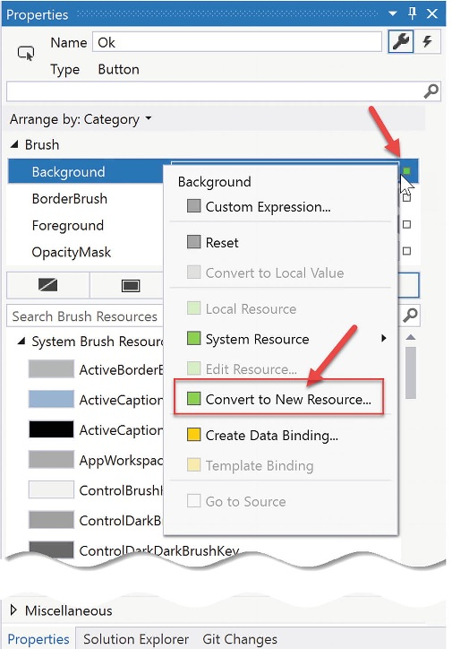
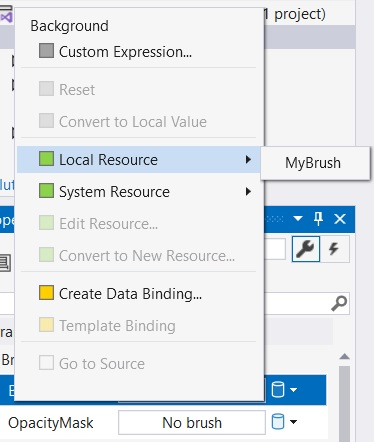

# Ресурси WPF, анімація, стилі та шаблони

Цей розділ знайомить вас із трьома важливими (і взаємопов’язаними) темами, які поглиблять ваше розуміння API Windows Presentation Foundation (WPF). Перше, що потрібно зробити – це дізнатися про роль логічних ресурсів. Як ви побачите, система логічного ресурсу (також відомого як ресурс об’єкта) — це спосіб іменування та посилання на часто використовувані об’єкти в програмі WPF. Хоча логічні ресурси часто створюються в XAML, вони також можуть бути визначені в процедурному коді.
Далі ви дізнаєтеся, як визначати, виконувати та контролювати послідовність анімації. Незважаючи на те, що ви думаєте, анімація WPF не обмежується відеоіграми чи мультимедійними програмами. У API WPF анімація може бути такою ж тонкою, як створення такої, що кнопка світиться, коли вона отримує фокус, або збільшення розміру вибраного рядка в DataGrid. Розуміння анімації є ключовим аспектом створення користувацьких шаблонів елементів керування (як ви побачите далі в цьому розділі).
Потім ви дослідите роль стилів і шаблонів WPF. Подібно до веб-сторінки, яка використовує CSS або механізм тем ASP.NET, програма WPF може визначити загальний вигляд для набору елементів керування. Ви можете визначити ці стилі в розмітці та зберегти їх як об’єктні ресурси для подальшого використання, а також ви можете застосовувати їх динамічно під час виконання. Останній приклад навчить вас створювати власні шаблони керування.

# Розуміння системи ресурсів WPF

Ваше перше завдання — вивчити тему вбудовування та доступу до ресурсів програми. WPF підтримує два різновиди ресурсів. Перший — це двійковий ресурс, і ця категорія зазвичай включає елементи, які більшість програмістів вважають ресурсами в традиційному розумінні (вбудовані файли зображень або звукові кліпи, значки, які використовуються програмою тощо).
Друга різновид, яка називається ресурсами об’єкта або логічними ресурсами, представляє іменований об’єкт .NET, який можна запакувати та повторно використовувати у всій програмі. Хоча будь-який об’єкт .NET можна запакувати як об’єктний ресурс, логічні ресурси особливо корисні під час роботи з графічними даними будь-якого типу, враховуючи, що ви можете визначити типові графічні примітиви (пензлі, ручки, анімацію тощо) і посилатися на них, коли потрібно.

## Робота з бінарними ресурсами

Перш ніж перейти до теми об’єктних ресурсів, давайте швидко розглянемо, як запакувати бінарні ресурси, такі як іконки або файли зображень (наприклад, логотипи компанії або зображення для анімації) у ваші програми. Створіть нову програму WPF під назвою BinaryResourcesApp. Оновіть розмітку для вашого початкового вікна, щоб обробляти подію Window Loaded і використовувати DockPanel як корінь макета, наприклад:

```xml
  <Window x:Class="BinaryResourcesApp.MainWindow"
        ...
        Title="Binary Resources" Height="450" Width="800" Loaded="Window_Loaded">
    <DockPanel LastChildFill="True">

    </DockPanel>
</Window>

```
Тепер, припустімо, вашій програмі потрібно відобразити один із трьох файлів зображень усередині частини вікна на основі введення користувача. Елемент керування зображенням WPF можна використовувати для відображення не лише типового файлу зображення (*.bmp, *.gif, *.ico, *.jpg, *.png, *.wdp або *.tiff), але й даних у DrawingImage. Ви можете створити інтерфейс користувача для свого вікна, який підтримує DockPanel, що містить просту панель інструментів із кнопками Next та Previous. Під цією панеллю інструментів ви можете розмістити елемент керування Image, який наразі не має значення властивості Source, наприклад:

```xml
    <DockPanel LastChildFill="True">
        <ToolBar Height="60" Name="picturePickerToolbar" DockPanel.Dock="Top">
            <Button x:Name="btnPreviousImage" Height="40" Width="100" BorderBrush="Black"
                    Margin="5" Content="Previous" Click="btnPreviousImage_Click"/>
            <Button x:Name="btnNextImage" Height="40" Width="100" BorderBrush="Black"
                    Margin="5" Content="Next" Click="btnNextImage_Click"/>
        </ToolBar>

        <!-- We will fill this Image in code. -->
        <Border BorderThickness="2" BorderBrush="Green">
            <Image x:Name="imageHolder" Stretch="Fill" />
        </Border>

    </DockPanel>
```
Далі додайте такі пусті обробники подій:

```cs
        private void Window_Loaded(object sender, RoutedEventArgs e)
        {

        }

        private void btnPreviousImage_Click(object sender, RoutedEventArgs e)
        {

        }

        private void btnNextImage_Click(object sender, RoutedEventArgs e)
        {

        }
```
Коли вікно завантажується, зображення буде додано до колекції, яку циклічно переміщатимуть кнопки. Тепер, коли структура програми створена, давайте розглянемо різні варіанти її реалізації.

### Включення незакріплених файлів ресурсів у проект

Одним із варіантів є надсилання файлів зображень у вигляді набору незакріплених файлів у підкаталозі шляху встановлення програми. Почніть із додавання нової папки (з назвою Images) до вашого проекту. У цю папку додайте кілька зображень, клацнувши правою кнопкою миші та вибравши Add ➤ Existing Item. Ви можете додати власні файли зображень або використати три файли зображень Deer.jpg, Dogs.jpg і Welcome.jpg із завантажуваного коду.

### Налаштування вільних ресурсів

Щоб скопіювати вміст папки \Images до папки \bin\Debug під час створення проекту, почніть із вибору всіх зображень у Solution Explorer. Тепер, коли ці зображення все ще вибрано, клацніть правою кнопкою миші та виберіть Properties. Установіть властивість Build Action на Content, а для властивості Copy to Output Directory встановіть значення Установіть властивість Build Action на Content, а для властивості Copy to Output Directory встановіть значення Copy always.
Ви також можете вибрати Copy if Newer, що заощадить ваш час, якщо ви створюєте великі проекти з великою кількістю вмісту. Для цього прикладу працює Copy always.
Якщо ви build свій проект, тепер ви можете натиснути кнопку Show All Files в Solution Explorer і переглянути скопійовану папку Images в каталозі \bin\Debug (може знадобитися натиснути кнопку Refresh).

### Програмне завантаження зображення

WPF надає клас під назвою BitmapImage, який є частиною простору імен System.Windows.Media.Imaging. Цей клас дозволяє завантажувати дані з файлу зображення, розташування якого представлено об’єктом System.Uri. Додайте List<BitmapImage> для зберігання зображень, а також int для збереження індексу зображення, яке зараз відображається.

```cs
    public partial class MainWindow : Window
    {
        // A List of BitmapImage files.
        List<BitmapImage> _images = new List<BitmapImage>();

        // Current position in the list.
        private int _currImage = 0;
        
        //...
    }
```
У події Loaded вашого вікна заповніть список зображень, а потім установіть для джерела керування зображенням перше зображення у списку.

```cs
        private void Window_Loaded(object sender, RoutedEventArgs e)
        {
            try
            {
                string path = Environment.CurrentDirectory;
                //Load these images from disk when the window loads.
                _images.Add(new BitmapImage(new Uri($@"{path}\Images\Deer.jpg")));
                _images.Add(new BitmapImage(new Uri($@"{path}\Images\Dogs.jpg")));
                _images.Add(new BitmapImage(new Uri($@"{path}\Images\Welcome.jpg")));

                // Show first image in the List.
                imageHolder.Source = _images[_currImage];
            }
            catch (Exception ex)
            {
                MessageBox.Show(ex.Message);
            }
        }
```
Далі реалізуйте обробники для циклічного перегляду зображень. Якщо користувач дійде до кінця списку, почніть його на початок і навпаки.

```cs
        private void btnPreviousImage_Click(object sender, RoutedEventArgs e)
        {
            if (--_currImage < 0)
            {
                _currImage = _images.Count - 1;
            }
            imageHolder.Source = _images[_currImage];
        }

        private void btnNextImage_Click(object sender, RoutedEventArgs e)
        {
            if (++_currImage >= _images.Count)
            {
                _currImage = 0;
            }
            imageHolder.Source = _images[_currImage];
        }
```
На цьому етапі ви можете запустити програму та прогортати кожне зображення.

### Вбудовування ресурсів програми

Якщо ви бажаєте налаштувати файли зображень для компіляції безпосередньо у збірку .NET як двійкові ресурси, виберіть файли зображень у Solution Explorer (у папці \Images, а не в папці \bin\Debug\Images). Змініть властивість Build Action на Resource і встановіть властивість Copy to Output Directory на «Do not copy».
Тепер, використовуючи меню Build Visual Studio, виберіть параметр Clean Solution, щоб видалити поточний вміст \bin\Debug\Images, а потім перебудуйте свій проект. Оновіть Solution Explorer і спостерігайте за відсутністю даних у вашому каталозі \bin\Debug\Images. З поточними параметрами збірки ваші графічні дані більше не копіюються до вихідної папки, а тепер вбудовані в саму збірку. Це гарантує наявність ресурсів, але також збільшує розмір вашої скомпільованої збірки.
Вам потрібно змінити код, щоб завантажити ці зображення у свій список, витягнувши їх зі скомпільованої збірки.

```cs
                // Extract from the assembly and then load images
                _images.Add(new BitmapImage(new Uri(@"/Images/Deer.jpg", UriKind.Relative)));
                _images.Add(new BitmapImage(new Uri(@"/Images/Dogs.jpg", UriKind.Relative)));
                _images.Add(new BitmapImage(new Uri(@"/Images/Welcome.jpg", UriKind.Relative)));
```

У цьому випадку вам більше не потрібно визначати шлях інсталяції, і ви можете просто перерахувати ресурси за іменами, що враховує назву вихідного підкаталогу. Також зауважте, коли ви створюєте свої об’єкти Uri, ви вказуєте значення UriKind як Relative. На даний момент ваш виконуваний файл є автономною сутністю, яку можна запускати з будь-якого місця на машині, оскільки всі скомпільовані дані знаходяться в двійковому файлі.

## Робота з об'єктними (логічними) ресурсами

Коли ви створюєте програму WPF, типово визначати аннотацію XAML для використання в кількох місцях у вікні або, можливо, у кількох вікнах чи проектах. Наприклад, припустимо, що ви створили ідеальний лінійний градієнтний пензель, який складається з десяти рядків розмітки. Тепер ви хочете використовувати цей пензель як колір фону для кожного елемента керування Button у проекті (який складається з восьми вікон), щоб загалом було 16 елементів керування Button.
Найгірше, що ви можете зробити, це скопіювати та вставити XAML у кожен елемент керування. Зрозуміло, що підтримувати це було б кошмаром, оскільки вам потрібно було б вносити численні зміни кожного разу, коли ви хотіли б налаштувати вигляд і відчуття пензля.
На щастя, об’єктні ресурси дозволяють визначити blob XAML, дати йому ім’я та зберегти його у відповідному словнику для подальшого використання. Подібно до бінарного ресурсу, об’єктні ресурси часто компілюються в збірку, яка їх вимагає. Однак для цього не потрібно возитися з властивістю Build Action. Якщо ви розмістите свій XAML у правильному місці, компілятор подбає про все інше.
Робота з об'єктними ресурсами є великою частиною розробки WPF. Як ви побачите, ресурси об’єктів можуть бути набагато складнішими, ніж спеціальний пензель. Ви можете визначити анімацію на основі XAML, 3D-візуалізацію, настроюваний стиль керування, шаблон даних, шаблон керування тощо та запакувати кожен із них як ресурс для повторного використання.

### Роль властивості ресурсів

Як згадувалося, об’єктні ресурси повинні бути розміщені в відповідному об’єкті словника, який буде використовуватися в програмі. У поточному стані кожен нащадок FrameworkElement підтримує властивість Resources. Ця властивість інкапсулює об’єкт ResourceDictionary, який містить визначені ресурси об’єкта. ResourceDictionary може містити будь-який тип елемента, оскільки він працює з типами System.Object і ним можна керувати через XAML або процедурний код. 
У WPF усі елементи керування, Windows, сторінки (використовуються для створення навігаційних програм) і UserControls розширюють FrameworkElement, тому майже всі віджети надають доступ до ResourceDictionary. Крім того, клас Application, не розширюючи FrameworkElement, підтримує властивість Resources з ідентичною назвою для тієї ж мети.

### Визначення загальновіконних ресурсів

Щоб розпочати вивчення ролі об’єктних ресурсів, створіть нову програму WPF під назвою ObjectResourcesApp і змініть початкову сітку на горизонтально вирівняний менеджер макета StackPanel. У цій панелі StackPanel визначте два елементи керування Button ось так (вам справді не потрібно багато, щоб проілюструвати роль ресурсів об’єкта, тому це підійде):

```xml
    <StackPanel Orientation="Horizontal">
        <Button Margin="25" Height="200" Width="200" Content="OK" FontSize="20"/>
        <Button Margin="25" Height="200" Width="200" Content="Cancel" FontSize="20"/>
    </StackPanel>
```
Тепер клацніть кнопку OK і встановіть властивість Background  на спеціальний тип brush за допомогою інтегрованого редактора пензлів. Після того, як ви це зробите, зверніть увагу на те, як пензель вбудовано в область тегів Button, як показано тут:

```xml
            <Button.Background>
                <RadialGradientBrush>
                    <GradientStop Color="#FFC5F4BC" Offset="0" />
                    <GradientStop Color="#FF44C342" Offset="1" />
                    <GradientStop Color="#FF50800C" Offset="0.669" />
                </RadialGradientBrush>
            </Button.Background>
```
Щоб дозволити кнопці Cancel також використовувати цей пензель, вам слід підвищити область дії вашого RadialGradientBrush до словника ресурсів батьківського елемента. Наприклад, якщо ви перемістите його в StackPanel, обидві кнопки зможуть використовувати один пензель, оскільки вони є дочірніми елементами менеджера макета. Ще краще, ви можете запакувати пензель у словник ресурсів самого вікна, щоб вміст вікна міг використовувати його.
Коли вам потрібно визначити ресурс, ви використовуєте синтаксис елемента властивості, щоб встановити властивість Resources власника. Ви також надаєте елементу ресурсу значення x:Key, яке використовуватиметься іншими частинами вікна, коли вони хочуть посилатися на ресурс об’єкта. Майте на увазі, що x:Key і x:Name – це не одне й те саме! Атрибут x:Name дозволяє вам отримати доступ до об’єкта як змінної-члена у вашому файлі коду, тоді як атрибут x:Key дозволяє посилатися на елемент у словнику ресурсу.
Visual Studio дозволяє підняти ресурс до вищого обсягу за допомогою відповідного вікна властивостей. Для цього спочатку визначте властивість, яка містить складний об’єкт, який ви хочете запакувати як ресурс (у цьому прикладі властивість Background). Праворуч від властивості є невеликий квадрат, натиснувши на який, відкривається спливаюче меню. У ньому виберіть параметр «Convert to New Resource».




Вас попросять назвати свій ресурс (MyBrush) і вказати, де його розмістити. Для цього прикладу залиште стандартний вибір поточного документа.
Коли ви закінчите, ви побачите, що пензель було переміщено всередину тегу Window.Resources.

```xml
    <Window.Resources>
        <RadialGradientBrush x:Key="MyBrush">
            <GradientStop Color="#FFBCEEF4" Offset="0"/>
            <GradientStop Color="#FF42C3C3" Offset="1"/>
            <GradientStop Color="#FF0C7380" Offset="0.669"/>
        </RadialGradientBrush>
    </Window.Resources>
```
А фон елемента керування Button оновлено для використання нового ресурсу.
```xml
        <Button Background="{DynamicResource MyBrush}" Margin="25" Height="200" Width="200" Content="OK" FontSize="20">
        </Button>
```
Майстер створення ресурсу створює новий ресурс як DynamicResource. Ви дізнаєтеся про DynamicResources пізніше в цьому тексті, а поки що змініть його на StaticResource, наприклад:

```xml
        <Button Background="{StaticResource MyBrush}" Margin="25" Height="200" Width="200" Content="OK" FontSize="20" />
```
Щоб побачити переваги, оновіть властивість Background кнопки Cancel  до того самого StaticResource, і ви зможете побачити повторне використання в дії.

```xml
        <Button Background="{StaticResource MyBrush}" Margin="25" Height="200" Width="200" Content="Cancel" FontSize="20"/>
```

### Розширення розмітки {StaticResource}

Розширення розмітки {StaticResource} застосовує ресурс лише один раз (під час ініціалізації) і залишається «підключеним» до оргігінального об’єкта протягом життя програми. Деякі властивості (наприклад, межі градієнта) буде оновлено, але якщо ви, наприклад, створите новий пензель, елемент керування не буде оновлено. Щоб побачити це в дії, додайте Name та обробник події  Click до кожного елемента керування Button, як показано нижче:

```cs
        private void btnOk_Click(object sender, RoutedEventArgs e)
        {
            // Get the brush and make a change.
            var b = (RadialGradientBrush)Resources["MyBrush"];
            b.GradientStops[1] = new GradientStop(Colors.WhiteSmoke, 0.0);
        }
```

    Ви використовуєте індексатор ресурсів, щоб знайти тут ресурс за назвою. Ви також можете використати метод TryFindResource(), який не викличе помилку виконання;він просто поверне значення null, якщо вказаний ресурс неможливо знайти.

Коли ви запускаєте програму та натискаєте кнопку OK, ви бачите, що градієнти змінюються належним чином. Тепер додайте такий код до обробника події:

```cs
        private void btnCancel_Click(object sender, RoutedEventArgs e)
        {
            // Put a totally new brush into the myBrush slot.
            Resources["MyBrush"] = new SolidColorBrush(Colors.Red);
        }

```
Запустіть програму ще раз, натисніть кнопку Cancel, і нічого не відбувається. Тобто статичний ресурс не замінюється

### Розширення розмітки {DynamicResource}

Також властивість може використовувати розширення розмітки DynamicResource. Щоб побачити різницю, змініть розмітку для кнопки Cancel на таку:

```xml
        <Button x:Name="btnCancel" Background="{DynamicResource MyBrush}" Margin="25" Height="200" Width="200" Content="Cancel" FontSize="20" Click="btnCancel_Click"/>
```
Цього разу, коли ви натискаєте кнопку Cancel, фон для кнопки Cancel змінюється, але фон для кнопки ОК залишається тим самим. Це пов’язано з тим, що розширення розмітки {DynamicResource} може визначити, чи базовий ключовий об’єкт було замінено новим об’єктом. Як ви могли здогадатися, для цього потрібна додаткова інфраструктура середовища виконання, тому вам зазвичай слід використовувати {StaticResource}, якщо ви не знаєте, що у вас є ресурс об’єкта, який буде замінено іншим об’єктом під час виконання, і ви хочете, щоб усі елементи, які використовують цей ресурс, отримували інформацію.

### Ресурси на рівні програми

Якщо у словнику ресурсів вікна є ресурси об’єктів, усі елементи у вікні можуть вільно використовувати його, але інші вікна програми не можуть. Рішення для спільного використання ресурсів у вашій програмі полягає у визначенні об’єктного ресурсу на рівні програми, а не на рівні вікна. У Visual Studio це неможливо автоматизувати, тому просто виріжте поточний об’єкт пензля з області Windows.Resources і розмістіть його в області Application.Resources у файлі App.xaml.

```xml
<Application x:Class="ObjectResourcesApp.App"
             xmlns="http://schemas.microsoft.com/winfx/2006/xaml/presentation"
             xmlns:x="http://schemas.microsoft.com/winfx/2006/xaml"
             xmlns:local="clr-namespace:ObjectResourcesApp"
             StartupUri="MainWindow.xaml">
    <Application.Resources>
        <RadialGradientBrush x:Key="MyBrush">
            <GradientStop Color="#FFC5F4BC" Offset="0"/>
            <GradientStop Color="#FF44C342" Offset="1"/>
            <GradientStop Color="#FF50800C" Offset="0.669"/>
        </RadialGradientBrush>
    </Application.Resources>
</Application>
```
Тепер будь-яке додаткове вікно або елемент керування у вашій програмі може вільно використовувати цей самий пензель. Якщо ви хочете встановити властивість Background для елемента керування, ресурси рівня програми доступні для вибору, як показано на малюнку.

Застосування ресурсів на рівні програми



Розміщення ресурсів на рівні програми та призначення їх властивості елемента керування заморозить ресурс, запобігаючи зміні значень під час виконання. Ресурс можна клонувати, а клон можна оновлювати.

### Визначення словників об’єднаних ресурсів

Ресурси на рівні додатків досить часто є достатньо хорошими, але вони не допомагають повторно використовувати в проектах. У цьому випадку ви хочете визначити так званий словник об’єднаного ресурсу. Подумайте про це як про бібліотеку класів для ресурсів WPF; це не що інше, як файл XAML, який містить колекцію ресурсів. Один проект може мати скільки завгодно таких файлів (один для пензлів, один для анімації тощо). Додайте за допомогою діалогового вікна Add New Item, яке активується через меню Project файл MyBrushes.xalm. У новому файлі виріжте поточні ресурси в області Application.Resources і перемістіть їх у свій словник, ось так:

```xml
<ResourceDictionary xmlns="http://schemas.microsoft.com/winfx/2006/xaml/presentation"
                    xmlns:x="http://schemas.microsoft.com/winfx/2006/xaml">
    <RadialGradientBrush x:Key="MyBrush">
        <GradientStop Color="#FFBCEEF4" Offset="0"/>
        <GradientStop Color="#FF42C3C3" Offset="1"/>
        <GradientStop Color="#FF0C7380" Offset="0.669"/>
    </RadialGradientBrush>

</ResourceDictionary>
```
Незважаючи на те, що цей словник ресурсів є частиною вашого проекту, для використання всі словники ресурсів мають бути об’єднані (зазвичай на рівні програми) в існуючий словник ресурсів. Для цього використовуйте такий формат у файлі App.xaml (зауважте, що кілька словників ресурсів можна об’єднати, додавши кілька елементів ResourceDictionary в область ResourceDictionary.MergedDictionaries):

```xml
    <Application.Resources>
        <ResourceDictionary>
            <ResourceDictionary.MergedDictionaries>
                <ResourceDictionary Source="MyBrushes.xaml"/>
            </ResourceDictionary.MergedDictionaries>
        </ResourceDictionary>
    </Application.Resources>
```
Проблема цього підходу полягає в тому, що кожен файл ресурсу потрібно додати до кожного проекту, який потребує ресурсів. Кращим підходом для спільного використання ресурсів є визначення бібліотеки класів .NET для спільного використання між проектами, що ви зробите далі.

### Визначення збірки лише для ресурсів

Найпростіший спосіб побудувати збірку, в якій лише ресурси, — почати з проекту WPF User Control Library. Додайте такий проект (під назвою MyBrushesLibrary) до поточного рішення за допомогою пункту меню Add ➤ New Project і додайте до нього посилання на проект із проекту ObjectResourcesApp.
Тепер видаліть файл UserControl1.xaml із проекту. Потім перетягніть файл MyBrushes.xaml у свій проект MyBrushesLibrary і видаліть його з проекту ObjectResourcesApp. 

Скомпілюйте проект бібліотеки керування користувачами. Тепер об’єднайте ці бінарні ресурси в словник ресурсів рівня програми проекту ObjectResourcesApp. Однак для цього потрібен досить дивний синтаксис, показаний тут:

```xml
    <Application.Resources>
        <ResourceDictionary>
            <ResourceDictionary.MergedDictionaries>
                <ResourceDictionary Source="/MyBrushesLibrary;Component/MyBrushes.xaml"/>
            </ResourceDictionary.MergedDictionaries>
        </ResourceDictionary>
    </Application.Resources>
```
По-перше, майте на увазі, що цей рядок чутливий до пробілу. Якщо у вас є зайві пробіли навколо крапки з комою або скісної риски, ви створите помилки. Перша частина рядка — це зрозуміла назва зовнішньої бібліотеки (без розширення файлу). Після крапки з комою введіть слово Компонент, а потім назву скомпільованого двійкового ресурсу, який буде ідентичним вихідному словнику ресурсів XAML.
На цьому розгляд системи управління ресурсами WPF завершується. Ви добре використаєте ці методи для більшості (якщо не для всіх) ваших програм. Далі розглянемо інтегрований API анімації Windows Presentation Foundation.

# Розуміння служб анімації WPF

На додаток до графічних служб рендерингу, які ви розглянули в попередьному розділі, WPF надає програмний інтерфейс для підтримки служб анімації. Термін «анімація» може нагадувати логотипи компаній, що обертаються, послідовність ресурсів зображень, що обертаються (щоб створити ілюзію руху), текст, що підстрибує по екрану, або певні типи програм, наприклад відеоігри чи мультимедійні програми. 
Хоча API анімації WPF, безумовно, можна використовувати для таких цілей, анімацію можна використовувати будь-коли, коли ви хочете надати додатку додаткової родзинки. Наприклад, ви можете створити анімацію для кнопки на екрані, яка злегка збільшується, коли курсор миші наводиться в межах її меж (і зменшується, коли курсор переміщується за межі). Або ви можете анімувати вікно так, щоб воно закривалося за допомогою певного візуального вигляду, наприклад, повільного переходу в прозорість. Більш орієнтоване на бізнес-додатки використання — це згасання повідомлень про помилки на екрані програми для покращення взаємодії з користувачем. Насправді підтримку анімації WPF можна використовувати в будь-якому додатку (бізнес-додатку, мультимедійних програмах, відеоіграх тощо), коли ви хочете забезпечити більшу взаємодію з користувачем.
Як і в багатьох інших аспектах WPF, поняття створення анімації не є чимось новим. Новим є те, що, на відміну від інших API, які ви могли використовувати в минулому (включаючи Windows Forms), розробникам не потрібно створювати необхідну інфраструктуру вручну. У WPF немає потреби створювати фонові потоки чи таймери, які використовуються для просування послідовності анімації, визначати власні типи для представлення анімації, стирати та перемальовувати зображення або турбуватися про нудні математичні розрахунки. Як і інші аспекти WPF, ви можете створити анімацію повністю за допомогою XAML, повністю за допомогою коду C# або за допомогою комбінації обох.

    Visual Studio не підтримує створення анімацій за допомогою інструментів анімації GUI. Якщо ви створюєте анімацію за допомогою Visual Studio, ви зробите це, ввівши безпосередньо XAML. Однак Blend для Visual Studio (супутній продукт, який постачається з Visual Studio 2019) справді має вбудований редактор анімації, який може значно спростити ваше життя.


## Роль типів класу Animation

Щоб зрозуміти підтримку анімації WPF, ви повинні почати з вивчення класів анімації в просторі імен System.Windows.Media.Animation з PresentationCore.dll. Тут ви знайдете понад 100 різних типів класів, які називаються за допомогою маркера Animation.
Ці класи можна помістити в одну з трьох широких категорій. По-перше, будь-який клас, який відповідає угоді про назву DataTypeAnimation (ByteAnimation, ColorAnimation, DoubleAnimation, Int32Animation тощо), дозволяє працювати з лінійною інтерполяційною анімацією. Це дає змогу плавно змінювати значення з часом від початкового до кінцевого.
Далі класи, які дотримуються домовленості про найменування DataTypeAnimationUsingKeyFrames (StringAnimationUsingKeyFrames, DoubleAnimationUsingKeyFrames, PointAnimationUsingKeyFrames тощо), представляють «анімацію ключових кадрів», яка дозволяє циклічно переходити через набір визначених значень протягом певного періоду часу. Наприклад, ви можете використовувати ключові кадри, щоб змінити заголовок кнопки, циклічно перебираючи ряд окремих символів.
Нарешті, класи, які дотримуються угоди про найменування DataTypeAnimationUsingPath (DoubleAnimationUsingPath, PointAnimationUsingPath, серед інших), є анімаціями на основі шляху, які дозволяють вам анімувати об’єкти для переміщення по шляху, який ви визначаєте. Як приклад, якщо ви створюєте програму GPS, ви можете використовувати анімацію на основі шляху, щоб перемістити об’єкт уздовж найшвидшого маршруту до місця призначення користувача.
Тепер, очевидно, ці класи не використовуються для того, щоб якимось чином забезпечити послідовність анімації безпосередньо до змінної певного типу даних (зрештою, як саме ви можете анімувати значення «9» за допомогою Int32Animation?).
Наприклад, розглянемо властивості Height і Width типу Label, обидва з яких є залежними властивостями, що обгортають подвійний елемент. Якщо ви хочете визначити анімацію, яка збільшить висоту мітки протягом певного періоду часу, ви можете підключити об’єкт DoubleAnimation до властивості Height і дозволити WPF подбати про деталі виконання фактичної анімації. Як інший приклад, якщо ви хочете змінити колір пензля із зеленого на жовтий протягом п’яти секунд, ви можете зробити це за допомогою типу ColorAnimation.
Щоб було зрозуміло, ці класи анімації можуть бути пов’язані з будь-якою властивістю залежності даного об’єкта, яка відповідає основним типам. Як пояснюється в попередньому розділі, властивості залежностей є спеціалізованою формою властивостей, необхідних багатьом службам WPF, включаючи анімацію, прив’язку даних і стилі.
За домовленістю властивість залежності визначається як статичне поле класу, призначене лише для читання, і називається суфіксом слова Property до звичайного імені властивості. Наприклад, доступ до властивості залежності для властивості Height Button можна отримати в коді за допомогою Button.HeightProperty.

## Властивості To, From, та By.

Усі класи анімації визначають такі ключові властивості, які керують початковими та кінцевими значеннями, що використовуються для виконання анімації:

    To: ця властивість представляє кінцеве значення анімації.
    From: ця властивість представляє початкове значення анімації.
    By: ця властивість представляє загальну суму, на яку анімація змінює своє початкове значення.

Незважаючи на те, що всі класи анімації підтримують властивості To, From і By, вони не отримують їх через віртуальних членів базового класу. Причиною цього є те, що базові типи, обернуті цими властивостями, дуже відрізняються (цілі числа, кольори, об’єкти Thickness тощо), і представлення всіх можливостей за допомогою одного базового класу призведе до складних конструкцій кодування.
У зв’язку з цим ви також можете задатися питанням, чому загальні коди .NET не використовувалися для визначення єдиного загального класу анімації з одним параметром типу (наприклад, Animate<T>). Знову ж таки, враховуючи, що існує так багато основних типів даних (кольори, вектори, int, рядки тощо), які використовуються для анімованих властивостей залежностей, це не буде таким чистим рішенням, як ви могли б очікувати (не кажучи вже про те, що XAML має лише обмежену підтримку загальних типів).

## Роль базового класу Timeline

Хоча єдиний базовий клас не використовувався для визначення віртуальних властивостей To, From і By, класи Animation мають спільний базовий клас: System.Windows.Media.Animation.Timeline. Цей тип надає кілька додаткових властивостей, які керують темпом анімації.

Ключові члени базового класу Timeline

|Властивість|Значення|
|-----------|--------|
|AccelerationRatio, DecelerationRatio, SpeedRatio|Ці властивості можна використовувати для керування загальним темпом послідовності анімації.|
|AutoReverse|Ця властивість отримує або встановлює значення, яке вказує, чи відтворюється часова шкала у зворотному напрямку після завершення прямої ітерації (значення за замовчуванням — false).|
|BeginTime|Ця властивість отримує або встановлює час, коли ця часова шкала повинна починатися. Значення за замовчуванням — 0, анімація починається негайно.|
|Duration|Ця властивість дозволяє встановити тривалість відтворення на шкалі часу.|
|FillBehavior, RepeatBehavior|Ці властивості використовуються для керування тим, що має статися після завершення шкали часу (повторити анімацію, нічого не робити тощо).|

## Створення анімації в коді C#

Ви побудуєте вікно, яке містить кнопку, яка має дивну поведінку обертання по колу (на основі верхнього лівого кута) кожного разу, коли миша входить до її поверхні. Почніть зі створення нової програми WPF під назвою SpinningButtonAnimationApp. Оновіть початкову розмітку до такої (зверніть увагу, що ви обробляєте подію MouseEnter кнопки):

```xml
    <Grid>
        <Button x:Name="btnSpinner" Height="50" Width="100" Content="I Spin!" Click="btnSpinner_Click" MouseEnter="btnSpinner_MouseEnter"/>
    </Grid>
```

У файл коду імпортуйте простір імен System.Windows.Media.Animation і додайте такий код у файл коду вікна C#:

```cs
        private bool _isSpinning = false;

        private void btnSpinner_MouseEnter(object sender, MouseEventArgs e)
        {
            if (!_isSpinning)
            {
                _isSpinning = true;
                // Make a double animation object, and register
                // with the Completed event.
                var dblAnim = new DoubleAnimation();
                dblAnim.Completed += (o, s) => { _isSpinning = false; };
   
                // Set the start value and end value.
                dblAnim.From = 0;
                dblAnim.To = 360;

                // Now, create a RotateTransform object, and set
                // it to the RenderTransform property of our
                // button.
                var rt = new RotateTransform();
                btnSpinner.RenderTransform = rt;
                  // Now, animation the RotateTransform object.
                rt.BeginAnimation(RotateTransform.AngleProperty, dblAnim);
            }
        }
```
Першим основним завданням цього методу є налаштування об’єкта DoubleAnimation, який починатиметься зі значення 0 і закінчуватиметься значенням 360. Зверніть увагу, що ви також обробляєте подію Completed для цього об’єкта, щоб перемикати змінну bool на рівні класу, яка використовується для того, щоб у разі виконання анімації ви не «скинули» її для початку знову.
Далі ви створюєте об’єкт RotateTransform, який підключається до властивості RenderTransform вашого елемента керування Button (btnSpinner). Нарешті, ви повідомляєте об’єкту RenderTransform розпочати анімацію його властивості Angle за допомогою вашого об’єкта DoubleAnimation. Коли ви створюєте анімацію в коді, ви зазвичай робите це, викликаючи BeginAnimation(), а потім передаєте базову властивість залежності, яку ви хотіли б анімувати (пам’ятайте, за домовленістю це статичне поле в класі), а потім пов’язаний об’єкт анімації. 
Давайте додамо до програми ще одну анімацію, яка призведе до того, що кнопка стане невидимою після натискання. Спочатку додайте такий код в обробник події Click:
```cs
        private void btnSpinner_Click(object sender, RoutedEventArgs e)
        {
            var dblAnim = new DoubleAnimation
            {
                From = 1.0,
                To = 0.0
            };
            btnSpinner.BeginAnimation(Button.OpacityProperty, dblAnim);
        }
```
Тут ви змінюєте значення властивості Opacity, щоб прибрати кнопку з поля зору. Однак зараз це важко зробити, оскільки кнопка обертається дуже швидко! Як тоді можна керувати темпом анімації?

### Контроль темпу анімації

За замовчуванням анімація займає приблизно одну секунду для переходу між значеннями, призначеними властивостям From і To. Таким чином, у вашої кнопки є одна секунда, щоб обертатися на повний кут 360 градусів, тоді як кнопка зникає до стану невидимості (під час натискання) протягом однієї секунди.
Якщо ви хочете визначити спеціальну кількість часу для переходу анімації, це можна зробити за допомогою властивості Duration об’єкта анімації, яка може бути встановлена ​​на екземпляр об’єкта Duration. Як правило, проміжок часу встановлюється шляхом передачі об’єкта TimeSpan конструктору Duration. Розглянемо наступне оновлення, яке дасть кнопці повні чотири секунди для обертання:

```cs
        private void btnSpinner_MouseEnter(object sender, MouseEventArgs e)
        {
            if (!_isSpinning)
            {
                _isSpinning = true;
                // Make a double animation object, and register
                // with the Completed event.
                var dblAnim = new DoubleAnimation();
                dblAnim.Completed += (o, s) => { _isSpinning = false; };
                // Button has four seconds to finish the spin!
                dblAnim.Duration = new Duration(TimeSpan.FromSeconds(4));
                //...
            }
        }    
```
З цим налаштуванням у вас має бути шанс натиснути кнопку, коли вона обертається, після чого вона зникне. Властивість BeginTime класу Animation також приймає об’єкт TimeSpan. Згадайте, що цю властивість можна налаштувати для встановлення часу очікування перед запуском послідовності анімації.

## Реверсування та повторення анімації

Ви також можете наказати об’єктам Animation відтворювати анімацію у зворотному порядку після завершення послідовності анімації, встановивши для властивості AutoReverse значення true. Наприклад, якщо ви хочете, щоб кнопка знову відображалася після того, як вона зникла, ви можете створити наступне:

```cs
        private void btnSpinner_Click(object sender, RoutedEventArgs e)
        {
            var dblAnim = new DoubleAnimation
            {
                From = 1.0,
                To = 0.0
            };
            // Reverse when done.
            dblAnim.AutoReverse = true;
            btnSpinner.BeginAnimation(Button.OpacityProperty, dblAnim);
        }
```
Якщо ви хочете, щоб анімація повторювалася певну кількість разів (або ніколи не зупинялася після активації), ви можете зробити це за допомогою властивості RepeatBehavior, яка є спільною для всіх класів анімації. Якщо ви передаєте просте числове значення в конструктор, ви можете вказати жорстко закодовану кількість разів для повторення. З іншого боку, якщо ви передаєте об’єкт TimeSpan у конструктор, ви можете встановити проміжок часу, протягом якого анімація повинна повторюватися. Нарешті, якщо ви хочете, щоб анімація зациклювалася до нескінченності, ви можете просто вказати RepeatBehavior.Forever. Розгляньте наступні способи зміни поведінки повторів будь-якого з об’єктів DoubleAnimation, використаних у цьому прикладі:

```cs
// Loop forever.
dblAnim.RepeatBehavior=RepeatBehavior.Forever;
// Loop three times.
dblAnim.RepeatBehavior=new RepeatBehavior(3);
// Loop for 30 seconds.
dblAnim.RepeatBehavior=new RepeatBehavior(TimeSpan.FromSeconds(30));
```
На цьому завершується ваше дослідження про те, як анімувати аспекти об’єкта за допомогою коду C# та API анімації WPF. Далі ви дізнаєтесь, як зробити те саме за допомогою XAML.

## Створення анімацій у XAML

Створення анімацій у розмітці схоже на створення їх у коді, принаймні для простих, зрозумілих послідовностей анімації. Коли вам потрібно захопити більш складну анімацію, яка може включати зміну значень багатьох властивостей одночасно, кількість розмітки може значно зрости. Навіть якщо ви використовуєте інструмент для створення анімації на основі XAML, важливо знати основи того, як анімація представлена ​​в XAML, оскільки це полегшить вам зміну та налаштування вмісту, створеного інструментом.
Здебільшого створення анімації схоже на те, що ви вже бачили. Ви все ще налаштовуєте об’єкт Animation і пов’язуєте його з властивістю об’єкта. Однак одна велика відмінність полягає в тому, що WPF не підтримує виклики функцій. У результаті замість виклику BeginAnimation() ви використовуєте розкадровку як рівень непрямості.
Розмістито анімації в проекту AnimationExample.

```xml
<Window x:Class="AnimationExample.MainWindow"

        xmlns:local="clr-namespace:AnimationExample"
        mc:Ignorable="d"
        Title="MainWindow" Height="450" Width="800">
    <Canvas>
        <Button x:Name="btnLabel" Content="LabelAnimation" Canvas.Left="31" Canvas.Top="36" Click="btnLabel_Click" />
    </Canvas>
</Window>
```
```cs
        private void btnLabel_Click(object sender, RoutedEventArgs e)
        {
            WindowLabelAnimation windowLabelAnimation = new();
            windowLabelAnimation.Show();
        }
```

Давайте розглянемо повний приклад анімації, визначеної в термінах XAML, а потім детальний розбір. 

```xml
<Window x:Class="AnimationExample.WindowLabelAnimation"
        ...
        Title="WindowLabelAnimation" Height="450" Width="800">
    <StackPanel>
        <Label Content = "Interesting...">
            <Label.Triggers>
                <EventTrigger RoutedEvent = "Label.Loaded">
                    <EventTrigger.Actions>
                        <BeginStoryboard>
                            <Storyboard TargetProperty = "FontSize">
                                <DoubleAnimation From = "12" To = "100" Duration = "0:0:4" 
                  RepeatBehavior = "Forever"/>
                            </Storyboard>
                        </BeginStoryboard>
                    </EventTrigger.Actions>
                </EventTrigger>
            </Label.Triggers>
        </Label>
    </StackPanel>
</Window>
```
Наступне визначення XAML відобразить вікно, яке містить одну мітку. Як тільки об’єкт Label завантажується в пам’ять, він починає послідовність анімації, у якій розмір шрифту збільшується з 12 пунктів до 100 протягом чотирьох секунд. Анімація повторюватиметься доти, поки об’єкт Window завантажується в пам’ять. Тепер давайте розберемо цей приклад по частинах.

### Роль розкадровки

Працюючи від найглибшого елемента назовні, ви спочатку стикаєтеся з елементом <DoubleAnimation>, який використовує ті самі властивості, які ви встановили в процедурному коді (From, To, Duration і RepeatBehavior).

```xml
                                <DoubleAnimation From = "12" To = "100" Duration = "0:0:4" 
                  RepeatBehavior = "Forever"/>
```
Як згадувалося, елементи Animation розміщуються в елементі <Storyboard>, який використовується для зіставлення об’єкта анімації з заданою властивістю батьківського типу за допомогою властивості TargetProperty, якою в даному випадку є FontSize. <Storyboard> завжди загортається в батьківський елемент під назвою <BeginStoryboard>.

```xml
                        <BeginStoryboard>
                            <Storyboard TargetProperty = "FontSize">
                                <DoubleAnimation From = "12" To = "100" Duration = "0:0:4" 
                  RepeatBehavior = "Forever"/>
                            </Storyboard>
                        </BeginStoryboard>
```

### Роль тригерів подій

Після визначення елемента <BeginStoryboard> вам потрібно вказати якусь дію, яка призведе до початку виконання анімації. WPF має кілька різних способів реагування на умови виконання в розмітці, один із яких називається тригером. З високого рівня ви можете розглядати тригер як спосіб реагування на умову події в XAML без необхідності процедурного коду. 
Як правило, коли ви реагуєте на подію в C#, ви створюєте спеціальний код, який виконуватиметься, коли відбудеться подія. Проте тригер — це лише спосіб отримати сповіщення про те, що сталася певна подія («Мене завантажено в пам’ять!», «Мишка наді мною!» або «Я маю фокус!»). 
Отримавши сповіщення про те, що сталася подія, ви можете запустити розкадровку. У цьому прикладі ви відповідаєте на завантаження мітки в пам’ять. Оскільки вас цікавить подія Loaded мітки, <EventTrigger> розміщується в колекції тригерів мітки.

```xml
<Label Content = "Interesting...">
    <Label.Triggers>
        <EventTrigger RoutedEvent = "Label.Loaded">
            <EventTrigger.Actions>
                <BeginStoryboard>
                    ...
                </BeginStoryboard>
            </EventTrigger.Actions>
        </EventTrigger>
    </Label.Triggers>
```
Давайте подивимося ще один приклад визначення анімації в XAML, цього разу з використанням анімації ключового кадру.

### Анімація з використанням дискретних ключових кадрів

На відміну від анімаційних об’єктів лінійної інтерполяції, які можуть переміщатися лише між початковою та кінцевою точками, аналоги ключових кадрів дозволяють створювати набір конкретних значень для анімації, яка має відбуватися в певний час.
Щоб проілюструвати використання дискретного типу ключового кадру, припустімо, що ви хочете створити елемент керування Button, який анімує його вміст так, щоб протягом трьох секунд значення «OK!» з’являється по одному символу за раз.

```xml
    <StackPanel>
        <Button Name="myButton" Height="40"
             FontSize="16pt" FontFamily="Verdana" Width = "100">
            <Button.Triggers>
                <EventTrigger RoutedEvent="Button.Loaded">
                    <BeginStoryboard>
                        <Storyboard>
                            <StringAnimationUsingKeyFrames RepeatBehavior = "Forever"
                Storyboard.TargetName="myButton" Storyboard.TargetProperty="Content"
                Duration="0:0:3">
                                <DiscreteStringKeyFrame Value="" KeyTime="0:0:0" />
                                <DiscreteStringKeyFrame Value="O" KeyTime="0:0:1" />
                                <DiscreteStringKeyFrame Value="OK" KeyTime="0:0:1.5" />
                                <DiscreteStringKeyFrame Value="OK!" KeyTime="0:0:2" />
                            </StringAnimationUsingKeyFrames>
                        </Storyboard>
                    </BeginStoryboard>
                </EventTrigger>
            </Button.Triggers>
        </Button>
    </StackPanel>
```
По-перше, зверніть увагу, що ви визначили тригер події для вашої кнопки, щоб переконатися, що ваша розкадровка виконується, коли кнопка завантажується в пам’ять. Клас StringAnimationUsingKeyFrames контролює зміну вмісту кнопки за допомогою значення Storyboard.TargetProperty. У межах елемента <StringAnimationUsingKeyFrames> ви визначаєте чотири елементи DiscreteStringKeyFrame, які змінюють властивість Content кнопки протягом двох секунд (зауважте, що тривалість, встановлена ​​StringAnimationUsingKeyFrames, становить загалом три секунди, тому ви побачите невелику паузу між останнім ! і циклом O).
Тепер, коли ви краще розумієте, як створювати анімацію в коді C# і XAML, давайте подивимося на роль стилів WPF, які активно використовують графіку, ресурси об’єктів і анімацію.

# Розуміння ролі стилів WPF

Коли ви створюєте користувальницький інтерфейс програми WPF, нерідко сімейство елементів керування потребує спільного вигляду. Наприклад, ви можете захотіти, щоб усі типи кнопок мали однакову висоту, ширину, колір фону та розмір шрифту для вмісту рядків. Хоча ви можете впоратися з цим, встановивши однакові значення для окремих властивостей кожної кнопки, такий підхід ускладнює впровадження змін у подальшому, оскільки вам потрібно буде скинути той самий набір властивостей для кількох об’єктів для кожної зміни. 
На щастя, WPF пропонує простий спосіб обмежити зовнішній вигляд відповідних елементів керування за допомогою стилів. Простіше кажучи, стиль WPF — це об’єкт, який підтримує колекцію пар властивість-значення. Програмно кажучи, індивідуальний стиль представлений за допомогою класу System.Windows.Style. Цей клас має властивість під назвою Setters, яка надає строго типізовану колекцію об’єктів Setter. Саме об’єкт Setter дозволяє визначати пари властивість-значення.
Окрім колекції Setters, клас Style також визначає кілька інших важливих членів, які дозволяють вам включати тригери, обмежувати, де можна застосувати стиль, і навіть створювати новий стиль на основі існуючого стилю (вважайте це «успадкуванням стилю»). Зверніть увагу на такі члени класу стилю:

    Triggers: відкриває колекцію тригерних об’єктів, які дозволяють фіксувати різні умови подій у стилі
    BasedOn: дозволяє створювати новий стиль на основі існуючого
    TargetType: дозволяє обмежити, де можна застосувати стиль


## Визначення та застосування стилю

Майже в кожному випадку об’єкт Style буде запакований як ресурс об’єкта. Як і будь-який ресурс об’єкта, ви можете запакувати його на рівні вікна чи програми, а також у виділеному словнику ресурсів (це чудово, оскільки робить об’єкт Style легко доступним у вашій програмі). Тепер згадайте, що метою є визначення об’єкта Style, який заповнює (як мінімум) колекцію Setters набором пар властивість-значення.
Давайте створимо стиль, який фіксує основні характеристики шрифту елемента керування у вашій програмі. Почніть зі створення нової програми WPF під назвою StylesExamples. Відкрийте файл App.xaml і визначте такий іменований стиль:

```xml
    <Application.Resources>
        <Style x:Key ="BasicControlStyle">
            <Setter Property = "Control.FontSize" Value ="14"/>
            <Setter Property = "Control.Height" Value = "40"/>
            <Setter Property = "Control.Cursor" Value = "Hand"/>
        </Style>

    </Application.Resources>
```
Зверніть увагу, що ваш BasicControlStyle додає три об’єкти Setter до внутрішньої колекції. Тепер давайте застосуємо цей стиль до кількох елементів керування у вашому головному вікні. Оскільки цей стиль є об’єктним ресурсом, елементи керування, які хочуть його використовувати, все одно мають використовувати розширення розмітки {StaticResource} або {DynamicResource}, щоб знайти стиль. Коли вони знайдуть стиль, вони встановлять для елемента ресурсу властивість Style з однаковою назвою. Замініть стандартний елемент керування сіткою такою розміткою:

```xml
    <StackPanel>
        <Label x:Name="lblInfo" Content="This style is boring..."
               Style="{StaticResource BasicControlStyle}" Width="150"/>
        <Button x:Name="btnTestButton" Content="Yes, but we are reusing settings!"
                Style="{StaticResource BasicControlStyle}" Width="250"/>
        
    </StackPanel>
```
Якщо ви переглянете вікно в конструкторі Visual Studio (або запустите програму), ви побачите, що обидва елементи керування підтримують однаковий курсор, висоту та розмір шрифту.

### Перевизначення налаштувань стилю

Хоча обидва ваші елементи керування вибрали стиль, якщо елемент керування хоче застосувати стиль, а потім змінити деякі з визначених параметрів, це нормально. Наприклад, кнопка тепер використовуватиме курсор довідки (а не курсор руки, визначений у стилі).

```xml
        <Button x:Name="btnTestButton" Content="Yes, but we are reusing settings!"
                Style="{StaticResource BasicControlStyle}" Width="250" Cursor="Help"/>
```
Стилі обробляються перед налаштуваннями окремих властивостей елемента керування за допомогою стилю; тому елементи керування можуть «замінювати» налаштування в кожному конкретному випадку.

## Вплив TargetType на стилі

Наразі ваш стиль визначено таким чином, що будь-який елемент керування може прийняти його (і повинен зробити це явно, встановивши властивість Style елемента керування), враховуючи, що кожна властивість кваліфікується класом Control. Для програми, яка визначає десятки налаштувань, це призведе до значної кількості повторюваного коду. Один із способів трохи очистити цей стиль - це використовувати атрибут TargetType. Коли ви додаєте цей атрибут до початкового елемента Style, ви можете точно один раз позначити, де його можна застосувати (у цьому прикладі в App.XAML).

```xml
        <Style x:Key ="BasicControlStyle" TargetType="Control">
            <Setter Property = "Control.FontSize" Value ="15"/>
            <Setter Property = "Control.Height" Value = "40"/>
            <Setter Property = "Control.Cursor" Value = "Hand"/>
        </Style>
```

    Коли ви створюєте стиль, який використовує тип базового класу, вам не потрібно хвилюватися, якщо ви призначите значення властивості залежності, яке не підтримується похідними типами. Якщо похідний тип не підтримує дану властивість залежності, він ігнорується.

Це дещо корисно, але у вас все ще є стиль, який можна застосовувати до будь-якого елемента керування. Атрибут TargetType більш корисний, коли ви хочете визначити стиль, який можна застосувати лише до певного типу елемента керування. Додайте такий новий стиль до словника ресурсів програми:

```xml
        <Style x:Key ="BigGreenButton" TargetType="Button">
            <Setter Property = "FontSize" Value ="20"/>
            <Setter Property = "Height" Value = "100"/>
            <Setter Property = "Width" Value = "100"/>
            <Setter Property = "Background" Value = "DarkGreen"/>
            <Setter Property = "Foreground" Value = "Yellow"/>
        </Style>
```


Цей стиль працюватиме лише з елементами керування Button (або підкласом Button). Якщо застосувати його до несумісного елемента, ви отримаєте помилки розмітки та компілятора. Додайте нову кнопку, яка використовує цей новий стиль, як показано нижче:

```xml
        <Button x:Name="btnAnotherButton" Content="OK!" Margin="0,10,0,0"
                Style="{StaticResource BigGreenButton}" Width="250" Cursor="Help"/>
```

Іншим ефектом TargetType є те, що стиль буде застосовано до всіх елементів цього типу в межах визначення стилю, якщо властивість x:Key не існує. Ось ще один стиль на рівні програми, який автоматично застосовуватиметься до всіх елементів керування TextBox у поточній програмі:

```xml
        <Style TargetType="TextBox">
            <Setter Property = "FontSize" Value ="14"/>
            <Setter Property = "Width" Value = "100"/>
            <Setter Property = "Height" Value = "30"/>
            <Setter Property = "BorderThickness" Value = "5"/>
            <Setter Property = "BorderBrush" Value = "Red"/>
            <Setter Property = "FontStyle" Value = "Italic"/>
        </Style>
```
Тепер ви можете визначити будь-яку кількість елементів керування TextBox, і вони автоматично отримають визначений вигляд.Якщо певне текстове поле не хоче виглядати за замовчуванням, воно може відмовитися, установивши для властивості Style значення {x:Null}. Наприклад, txtTest отримає безіменний стиль за замовчуванням, тоді як txtTest2 робить усе по-своєму.

```xml
        <TextBox x:Name="txtTest"/>
        <TextBox x:Name="txtTest2" Style="{x:Null}" BorderBrush="Black"
                 BorderThickness="5" Height="60" Width="100" Text="Ha!"/>
```

## Підкласи існуючих стилів

Ви також можете створити нові стилі, використовуючи наявний стиль, за допомогою властивості BasedOn. Стиль, який ви розширюєте, повинен мати правильний x:Key у словнику, оскільки похідний стиль посилатиметься на нього за назвою за допомогою розширення розмітки {StaticResource} або {DynamicResource}. Ось новий стиль на основі BigGreenButton, який повертає елемент кнопки на 20 градусів:

```xml
        <!-- This style is based on BigGreenButton. -->
        <Style x:Key ="TiltButton" TargetType="Button" BasedOn = "{StaticResource BigGreenButton}">
            <Setter Property = "Foreground" Value = "White"/>
            <Setter Property = "RenderTransform">
                <Setter.Value>
                    <RotateTransform Angle = "20"/>
                </Setter.Value>
            </Setter>
        </Style>
```
Щоб використовувати цей новий стиль, оновіть розмітку для кнопки до такої:

```xml
        <Button x:Name="btnTiltButton" Content="OK!" Margin="0,10,0,0"
                Style="{StaticResource TiltButton}" Cursor="Help"/>
```

## Визначення стилів за допомогою тригерів

Стилі WPF також можуть містити тригери, упаковуючи об’єкти Trigger у колекцію Triggers об’єкта Style. Використання тригерів у стилі дозволяє визначити певні елементи <Setter> таким чином, що вони будуть застосовані, лише якщо дана умова тригера є істинною. Наприклад, можливо, ви хочете збільшити розмір шрифту, коли миша знаходиться над кнопкою. Або, можливо, ви хочете переконатися, що текстове поле з поточним фокусом виділено певним кольором. Тригери корисні для таких ситуацій, оскільки вони дозволяють виконувати певні дії, коли змінюється властивість, без необхідності створювати явний код C# у файлі коду. Ось оновлення стилю TextBox, яке гарантує, що коли текстове поле має фокус введення, воно отримуватиме жовтий фон:

```xml
        <Style TargetType="TextBox">
            <Setter Property = "FontSize" Value ="14"/>
            <Setter Property = "Width" Value = "100"/>
            <Setter Property = "Height" Value = "30"/>
            <Setter Property = "BorderThickness" Value = "5"/>
            <Setter Property = "BorderBrush" Value = "Red"/>
            <Setter Property = "FontStyle" Value = "Italic"/>
            <Style.Triggers>
                <Trigger Property='IsFocused' Value='True'>
                    <Setter Property='Background' Value='Yellow'/>
                </Trigger>
            </Style.Triggers>
        </Style>
```
Якщо ви протестуєте цей стиль, ви побачите, що коли ви переходите між різними об’єктами TextBox (да допомогою Tab), поточне вибране TextBox має яскраво-жовтий фон (за умови, що його не вимкнуто шляхом призначення {x:Null} властивості Style). Тригери властивостей також дуже розумні, оскільки, коли умова тригера не відповідає дійсності, властивість автоматично отримує стандартне значення. Тому, як тільки текстове поле втрачає фокус, воно також автоматично стає кольором за замовчуванням без жодних зусиль з вашого боку. Навпаки, тригери подій (перевірені під час перегляду анімації WPF) не повертаються автоматично до попереднього стану.

## Визначення стилів за допомогою кількох тригерів

Тригери також можуть бути розроблені таким чином, що визначені елементи <Setter> будуть застосовані, коли виконується кілька умов. Скажімо, ви хочете встановити жовтий фон текстового поля, лише якщо воно має активний фокус і миша зависає в його межах. Для цього ви можете використати елемент <MultiTrigger> для визначення кожної умови, наприклад:

```xml
            <!-- The following setter will be applied only when the text box is
            in focus AND the mouse is over the text box. -->
            <Style.Triggers>
                <MultiTrigger>
                    <MultiTrigger.Conditions>
                        <Condition Property = "IsFocused" Value = "True"/>
                        <Condition Property = "IsMouseOver" Value = "True"/>
                    </MultiTrigger.Conditions>
                    <Setter Property = "Background" Value = "Yellow"/>
                </MultiTrigger>
            </Style.Triggers>
```

## Анімовані стилі

Стилі також можуть містити тригери, які запускають послідовність анімації. Ось один останній стиль, який, якщо застосувати до елементів керування Button, спричинить збільшення та зменшення розміру елементів керування, коли миша знаходиться всередині площі поверхні кнопки:

```xml
        <!-- The growing button style! -->
        <Style x:Key = "GrowingButtonStyle" TargetType="Button">
            <Setter Property = "Height" Value = "40"/>
            <Setter Property = "Width" Value = "100"/>
            <Style.Triggers>
                <Trigger Property = "IsMouseOver" Value = "True">
                    <Trigger.EnterActions>
                        <BeginStoryboard>
                            <Storyboard TargetProperty = "Height">
                                <DoubleAnimation From = "40" To = "100"
                                                 Duration = "0:0:2" AutoReverse="True"/>
                            </Storyboard>
                        </BeginStoryboard>
                    </Trigger.EnterActions>
                </Trigger>
            </Style.Triggers>
        </Style>
```
Тут колекція Triggers шукає, щоб властивість IsMouseOver повернула true. Коли це відбувається, ви визначаєте елемент Trigger.EnterActions для виконання простої розкадровки, яка змушує кнопку збільшитися до значення висоти 200 (а потім повернутися до висоти 40) протягом двох секунд. Якщо ви хочете виконати інші зміни властивостей, ви також можете визначити область Trigger.ExitActions, щоб визначити будь-які спеціальні дії, які потрібно виконати, коли IsMouseOver змінюється на false.

```xml
        <Button x:Name="btnTiltButton1" Content="OK!" Margin="0,30,0,0"  
                Style="{StaticResource GrowingButtonStyle}" />
```


## Програмне призначення стилів

Пам’ятайте, що стиль також можна застосовувати під час виконання. Це може бути корисним, якщо ви хочете дозволити кінцевим користувачам вибирати, як виглядатиме інтерфейс інтерфейсу користувача, або якщо вам потрібно забезпечити зовнішній вигляд і відчуття на основі налаштувань безпеки (наприклад, стилю DisableAllButton) або іншого.
Під час цього проекту ви визначили кілька стилів, багато з яких можна застосовувати до елементів керування Button. Створимо нове вікно для настиску на першу кнопку. 

```cs
        private void btnTestButton_Click(object sender, RoutedEventArgs e)
        {
            WindowUsingStyle windowUsingStyle = new();
            windowUsingStyle.Show();
        }
```


Отже, давайте оновимо користувальницький інтерфейс цього вікна, щоб дозволити користувачеві вибирати з деяких із цих стилів, вибираючи імена у ListBox. На основі вибору користувача ви застосуєте відповідний стиль. Ось нова (і остаточна) розмітка:

```xml
<Window x:Class="StylesExamples.WindowUsingStyle"
        ...
        Title="WindowUsingStyle" Height="450" Width="800">
    <DockPanel>
        <StackPanel Orientation="Horizontal" DockPanel.Dock="Top" Margin="0,0,0,50">
            <Label Content="Please Pick a Style for this Button" Height="50"/>
            <ListBox x:Name ="lstStyles" Height ="80" Width ="150" Background="LightBlue"
                     SelectionChanged ="comboStyles_Changed" />
        </StackPanel>
        <Button x:Name="btnStyle" Height="40" Width="100" Content="OK!"/>
    </DockPanel>
    
</Window>
```
Елемент керування ListBox (під назвою lstStyles) буде динамічно заповнюватися в конструкторі вікна, ось так:

```cs
        public WindowUsingStyle()
        {
            InitializeComponent();
            lstStyles.Items.Add("GrowingButtonStyle");
            lstStyles.Items.Add("TiltButton");
            lstStyles.Items.Add("BigGreenButton");
            lstStyles.Items.Add("BasicControlStyle");
        }
```
Останнім завданням є обробка події SelectionChanged у пов’язаному файлі коду. Зверніть увагу на наведений нижче код, як ви можете витягнути поточний ресурс за назвою за допомогою успадкованого методу TryFindResource():
```cs
        private void comboStyles_Changed(object sender, SelectionChangedEventArgs e)
        {
            // Get the selected style name from the list box.
            var currStyle = (Style)TryFindResource(lstStyles.SelectedValue);
            if (currStyle == null) return;
            // Set the style of the button type.
            this.btnStyle.Style = currStyle;
        }
```

## Логічні дерева, візуальні дерева та шаблони за замовчуванням

Тепер, коли ви розумієте стилі та ресурси, є ще кілька підготовчих тем для вивчення, перш ніж почати вчитися створювати спеціальні елементи керування. Зокрема, вам потрібно навчитися відрізняти логічне дерево, візуальне дерево та шаблон за замовчуванням. Коли ви вводите XAML ваша розмітка є логічним виглядом документа XAML. Крім того, якщо ви створюєте код C#, який додає нові елементи до елемента керування макетом, ви вставляєте нові елементи в логічне дерево. По суті, логічне подання представляє, як ваш вміст буде розміщено в різних менеджерах макета для головного вікна (або іншого кореневого елемента, такого як Page або NavigationWindow).
Однак за кожним логічним деревом стоїть набагато більш докладне представлення, яке називається візуальним деревом, яке використовується внутрішньо WPF для правильного відображення елементів на екрані.У будь-якому візуальному дереві буде повна інформація про шаблони та стилі, які використовуються для відтворення кожного об’єкта, включаючи будь-які необхідні малюнки, фігури, візуальні елементи та анімацію.
Корисно розуміти різницю між логічним і візуальним деревами, тому що, коли ви створюєте власний шаблон елемента керування, ви по суті замінюєте все або частину типового візуального дерева елемента керування та вставляєте власне. Таким чином, якщо ви бажаєте, щоб елемент керування Button відображався у вигляді зірки, ви можете визначити новий шаблон зірки та підключити його до візуального дерева кнопки. Логічно Button все ще має тип Button і підтримує властивості, методи та події, як очікувалося. Але візуально він набув зовсім іншого вигляду.Цей факт сам по собі робить WPF надзвичайно корисним API, враховуючи, що інші набори інструментів вимагатимуть створення нового класу для створення кнопки у формі зірки. З WPF вам просто потрібно визначити нову розмітку.

    Елементи керування WPF часто описують як безвиглядні. Це стосується того факту, що зовнішній вигляд елемента керування WPF повністю не залежить (та настроюється) від його поведінки. 

## Програмна перевірка логічного дерева

Хоча аналіз логічного дерева вікна під час виконання не є надзвичайно поширеною діяльністю програмування WPF, варто згадати, що простір імен System.Windows визначає клас під назвою LogicalTreeHelper, який дозволяє вам перевіряти структуру логічного дерева під час виконання.
Щоб проілюструвати зв’язок між логічними деревами, візуальними деревами та шаблонами керування, створіть нову програму WPF під назвою TreesAndTemplatesApp.
Замініть Grid такою розміткою, яка містить два елементи керування Button і велике текстове поле лише для читання з увімкненими смугами прокрутки. 
Переконайтеся, що ви використовуєте IDE для обробки події Click кожної кнопки. Наступний XAML добре підійде:

```xml
    <DockPanel LastChildFill="True">
        <Border Height="50" DockPanel.Dock="Top" BorderBrush="Blue">
            <StackPanel Orientation="Horizontal">
                <Button x:Name="btnShowLogicalTree" Content="Logical Tree of Window"
            Margin="4" BorderBrush="Blue" Height="40" Click="btnShowLogicalTree_Click"/>
                <Button x:Name="btnShowVisualTree" Content="Visual Tree of Window"
            BorderBrush="Blue" Height="40" Click="btnShowVisualTree_Click"/>
            </StackPanel>
        </Border>
        <TextBox x:Name="txtDisplayArea" Margin="10" Background="AliceBlue" IsReadOnly="True"
         BorderBrush="Red" VerticalScrollBarVisibility="Auto" HorizontalScrollBarVisibility="Auto" />
    </DockPanel>
```

У файлі коду C# визначте рядкову змінну-член під назвою _dataToShow. Тепер у обробнику Click для об’єкта btnShowLogicalTree викличте допоміжну функцію, яка викликає сама себе рекурсивно, щоб заповнити рядкову змінну логічним деревом вікна. Для цього викличете статичний метод GetChildren() LogicalTreeHelper. Ось код:

```cs
        private string _dataToShow;

        private void btnShowLogicalTree_Click(object sender, RoutedEventArgs e)
        {
            _dataToShow = "";
            BuildLogicalTree(0, this);
            txtDisplayArea.Text = _dataToShow;
        }

        void BuildLogicalTree(int depth, object obj)
        {
            // Add the type name to the dataToShow member variable.
            _dataToShow += new string(' ', depth) + obj.GetType().Name + "\n";
            // If an item is not a DependencyObject, skip it.
            if (!(obj is DependencyObject))
                return;
            // Make a recursive call for each logical child.
            foreach (var child in LogicalTreeHelper.GetChildren((DependencyObject)obj))
            {
                BuildLogicalTree(depth + 5, child);
            }
        }
```

Якщо ви запустите свою програму та натиснете цю першу кнопку, ви побачите надрукований дерево в текстовій області, який є майже точною копією оригінального XAML

## Програмна перевірка візуального дерева

Візуальне дерево Window також можна перевірити під час виконання за допомогою класу VisualTreeHelper System.Windows.Media. Ось реалізація Click другого елемента керування Button (btnShowVisualTree), який виконує аналогічну рекурсивну логіку для створення текстового представлення візуального дерева:

```cs
        private void btnShowVisualTree_Click(object sender, RoutedEventArgs e)
        {
            _dataToShow = "";
            BuildVisualTree(0, this);
            txtDisplayArea.Text = _dataToShow;
        }

        void BuildVisualTree(int depth, DependencyObject obj)
        {
            // Add the type name to the dataToShow member variable.
            _dataToShow += new string(' ', depth) + obj.GetType().Name + "\n";
            // Make a recursive call for each visual child.
            for (int i = 0; i < VisualTreeHelper.GetChildrenCount(obj); i++)
            {
                BuildVisualTree(depth + 1, VisualTreeHelper.GetChild(obj, i));
            }
        }

```
Як ви можете бачити, візуальне дерево надає кілька агентів візуалізації нижчого рівня, таких як ContentPresenter, AdornerDecorator, TextBoxLineDrawingVisual і так далі.

## Програмна перевірка шаблону за замовчуванням елемента керування

Нагадаємо, що WPF використовує візуальне дерево для розуміння того, як відображати вікно та всі його елементи. Кожен елемент керування WPF зберігає власний набір команд рендерингу в шаблоні за замовчуванням. Програмно кажучи, будь-який шаблон можна представити як екземпляр класу ControlTemplate. Також ви можете отримати шаблон елемента керування за замовчуванням, використовуючи властивість Template з влучною назвою, ось так:

```cs
// Get the default template of the Button.
Button myBtn=new Button();
ControlTemplate template=myBtn.Template;
```
Аналогічно, ви можете створити новий об'єкт ControlTemplate у коді та підставити його до властивості Template елемента керування наступним чином:

```cs
// Plug in a new template for the button to use.
Button myBtn=new Button();
ControlTemplate customTemplate=new ControlTemplate();
// Assume this method adds all the code for a star template.
MakeStarTemplate(customTemplate);
myBtn.Template=customTemplate;
```

Хоча ви можете створити новий шаблон у коді, набагато частіше це роблять у XAML. Однак, перш ніж ви почнете створювати власні шаблони, давайте завершимо поточний приклад і додамо можливість перегляду шаблону за замовчуванням елемента керування WPF під час виконання. Це може бути корисним способом переглянути загальний склад шаблону.
Оновіть розмітку вашого вікна новим елементом керування StackPanel, закріпленим ліворуч від головного елемента DockPanel, визначеного ось так (розміщеного безпосередньо перед елементом TextBox):

```xml
        <Border DockPanel.Dock="Left" Margin="10" BorderBrush="DarkGreen"
                BorderThickness="4" Width="358">
            <StackPanel>
                <Label Content="Enter Full Name of WPF Control" Width="340" FontWeight="DemiBold" />
                <TextBox x:Name="txtFullName" Width="340" BorderBrush="Green"
                         Background="BlanchedAlmond" Height="22"
                         Text="System.Windows.Controls.TextBox" />
                <Button x:Name="btnTemplate" Content="See Template" BorderBrush="Green"
                        Height="40" Width="100" Margin="5"
                        Click="btnTemplate_Click" HorizontalAlignment="Left" />
                <Border BorderBrush="DarkGreen" BorderThickness="2" Height="260"
                        Width="301" Margin="10" Background="LightGreen" >
                    <StackPanel x:Name="stackTemplatePanel" />
                </Border>
            </StackPanel>
        </Border>
```
У верхньому лівому текстовому полі можна ввести повне ім'я елемента керування WPF, розташованого у збірці PresentationFramework.dll. Після завантаження бібліотеки ви динамічно створите екземпляр об'єкта та відобразите його у великому квадраті внизу ліворуч. Зрештою, шаблон елемента керування за замовчуванням буде відображено в правому текстовому полі. Спочатку додайте нову змінну-член до вашого класу C# типу Control, ось так:

```cs
        private Control? _ctrlToExamine = null;
```
Ось решта коду, для якого вам потрібно буде імпортувати простори імен System.Reflection, System.Xml та System.Windows.Markup:

```cs
        private void btnTemplate_Click(object sender, RoutedEventArgs e)
        {
            _dataToShow = "";
            ShowTemplate();
            txtDisplayArea.Text = _dataToShow;
        }

        private void ShowTemplate()
        {
            // Remove the control that is currently in the preview area.
            if (_ctrlToExamine != null)
                stackTemplatePanel.Children.Remove(_ctrlToExamine);
            try
            {
                // Load PresentationFramework, and create an instance of the
                // specified control. Give it a size for display purposes, then add to the
                // empty StackPanel.
                Assembly asm = Assembly.Load("PresentationFramework, Version=4.0.0.0," +
                  "Culture=neutral, PublicKeyToken=31bf3856ad364e35");
                _ctrlToExamine = (Control)asm.CreateInstance(txtFullName.Text);
                _ctrlToExamine.Height = 200;
                _ctrlToExamine.Width = 200;
                _ctrlToExamine.Margin = new Thickness(5);
                stackTemplatePanel.Children.Add(_ctrlToExamine);
                // Define some XML settings to preserve indentation.
                var xmlSettings = new XmlWriterSettings { Indent = true };
                // Create a StringBuilder to hold the XAML.
                var strBuilder = new StringBuilder();
                // Create an XmlWriter based on our settings.
                var xWriter = XmlWriter.Create(strBuilder, xmlSettings);
                // Now save the XAML into the XmlWriter object based on the ControlTemplate.
                XamlWriter.Save(_ctrlToExamine.Template, xWriter);
                // Display XAML in the text box.
                _dataToShow = strBuilder.ToString();
            }
            catch (Exception ex)
            {
                _dataToShow = ex.Message;
            }
        }
```
Основна частина роботи полягає лише в налаштуванні скомпільованого ресурсу BAML для його відображення в рядок XAML. В вікні вводу можна ввести System.Windows.Controls.DatePicker і подивитись шаблон за замовчуванням.
Ви маєте краще розуміти, як працюють разом логічні дерева, візуальні дерева та шаблони елементів керування за замовчуванням. Тепер ви можете присвятити решту цього розділу вивченню того, як створювати власні шаблони та елементи керування користувача.

## Створення шаблону елемента керування за допомогою фреймворку тригерів

Коли ви створюєте власний шаблон для елемента керування, ви можете зробити це лише за допомогою коду C#. Використовуючи цей підхід, ви додасте дані до об'єкта ControlTemplate, а потім призначите їх властивості Template елемента керування. Однак, здебільшого ви визначатимете зовнішній вигляд та функціональність ControlTemplate за допомогою XAML та додаватимете фрагменти коду (або, можливо, досить багато коду) для керування поведінкою під час виконання.
У решті цього розділу ви розглянете, як створювати власні шаблони за допомогою Visual Studio. По дорозі ви дізнаєтеся про фреймворк тригерів WPF та Visual State Manager (VSM), а також побачите, як використовувати анімацію для додавання візуальних підказок для кінцевого користувача. Використання лише Visual Studio для створення складних шаблонів може передбачати значний обсяг набору тексту та певну важку роботу. Звичайно, шаблони виробничого рівня виграють від використання Blend для Visual Studio, (тепер) безкоштовного супутнього застосунку, що встановлюється разом із Visual Studio.
Для початку створіть нову WPF-застосунок з назвою ButtonTemplate. Для цього проєкту вас більше цікавить механіка створення та використання шаблонів, тому замініть Grid наступною розміткою:

```cs
        <StackPanel Orientation="Horizontal">
            <Button x:Name="myButton" Width="100" Height="100" Click="myButton_Click"/>
        </StackPanel>
```

В обробнику події Click просто відобразіть вікно повідомлення (через MessageBox.Show()), щоб показати повідомлення, яке підтверджує клацання елемента керування.Пам’ятайте, що під час створення власних шаблонів поведінка елемента керування залишається незмінною, але зовнішній вигляд може відрізнятися. Наразі ця кнопка (Button) відтворюється з використанням шаблону за замовчуванням, який, як показано в попередньому прикладі, є ресурсом BAML у заданій збірці WPF. Коли ви хочете визначити власний шаблон, ви фактично замінюєте це візуальне дерево за замовчуванням власним творінням.
Для початку оновіть визначення елемента \<Button\>, щоб указати новий шаблон за допомогою синтаксису property-element. Цей шаблон надасть елементу керування круглого вигляду.

```xml
            <Button x:Name="myButton" Width="100" Height="100" Click="myButton_Click">
                <Button.Template>
                    <ControlTemplate>
                        <Grid x:Name="controlLayout">
                            <Ellipse x:Name="buttonSurface" Fill="LightBlue"/>
                            <Label x:Name="buttonCaption"
        VerticalAlignment="Center"
        HorizontalAlignment="Center"
        FontWeight="Bold" FontSize="20" Content="OK!"/>
                        </Grid>
                    </ControlTemplate>
                </Button.Template>
            </Button>

```
Тут ви визначили шаблон, який складається з іменованого елемента керування Grid, що містить іменований Ellipse та Label. Оскільки ваша сітка не має визначених рядків або стовпців, кожен дочірній елемент розміщується поверх попереднього елемента керування, що центрує вміст. Якщо ви зараз запустите свою програму, то помітите, що подія Click спрацює лише тоді, коли курсор миші знаходиться в межах еліпсу! Це чудова особливість архітектури шаблонів WPF: вам не потрібно перераховувати перевірку на потрапляння, перевірку меж або будь-які інші низькорівневі деталі. Отже, якщо ваш шаблон використовував об'єкт Polygon для відображення якоїсь незвичайної геометрії, ви можете бути впевнені, що деталі тестування натискання миші залежать від форми елемента керування, а не від більшого прямокутника, що його обмежує.

## Шаблони як ресурси

Наразі ваш шаблон вбудовано в певний елемент керування Button, що обмежує повторне використання. В ідеалі, вам слід розмістити свій шаблон у словнику ресурсів, щоб ви могли повторно використовувати шаблон круглої кнопки між проектами, або, принаймні, перемістити його в контейнер ресурсів програми для повторного використання в цьому проекті. Давайте перенесемо локальний ресурс Button на рівень програми, вирізавши визначення шаблону з Button та вставивши його в тег Application.Resources у файлі App.xaml. Додайте Key та TargetType наступним чином:

```xml
    <Application.Resources>
        <ControlTemplate x:Key="RoundButtonTemplate" TargetType="{x:Type Button}">
            <Grid x:Name="controlLayout">
                <Ellipse x:Name="buttonSurface" Fill="LightBlue"/>
                <Label x:Name="buttonCaption" VerticalAlignment="Center" HorizontalAlignment="Center"
             FontWeight="Bold" FontSize="20" Content="OK!"/>
            </Grid>
        </ControlTemplate>
    </Application.Resources>
```
Оновіть розмітку кнопки наступним чином:

```xml
            <Button x:Name="myButton" Width="100" Height="100" Click="myButton_Click" 
                    Template="{StaticResource RoundButtonTemplate}">
            </Button>
```
Тепер, оскільки цей ресурс доступний для всієї програми, ви можете визначити будь-яку кількість круглих кнопок, просто застосувавши шаблон. Створіть два додаткові елементи керування Button, які використовуватимуть цей шаблон для тестування (для цих нових елементів не потрібно обробляти подію Click).

## Використання візуальних підказок за допомогою тригерів
 
Коли ви визначаєте власний шаблон, візуальні підказки шаблону за замовчуванням також видаляються. Наприклад, шаблон кнопки за замовчуванням містить розмітку, яка повідомляє елементу керування, як виглядати під час певних подій інтерфейсу користувача, таких як отримання фокусу, клацання мишею, увімкнення (або вимкнення) тощо. Користувачі досить звикли до таких візуальних підказок, оскільки вони надають елементу керування певну тактильну реакцію.
Однак ваш шаблон RoundButtonTemplate не визначає жодної такої розмітки, тому вигляд елемента керування однаковий незалежно від активності миші. В ідеалі, ваш елемент керування повинен виглядати дещо інакше після натискання (можливо, через зміну кольору або тінь), щоб користувач знав, що візуальний стан змінився.
Це можна зробити за допомогою тригерів, як ви вже дізналися. Для простих операцій тригери чудово працюють. Існують додаткові способи зробити це, які  але більше інформації доступно за адресоюпошуковим запитом "docs microsoft wpf themes how-to-create-apply-template".
Наприклад, оновіть свій шаблон RoundButtonTemplate наступною розміткою, яка додасть два тригери. Перший змінює колір елемента керування на синій, а колір переднього плану на жовтий, коли миша знаходиться над поверхнею. Другий зменшує розмір сітки (і, отже, всіх дочірніх елементів), коли елемент керування натискається мишею.

```xml
        <ControlTemplate x:Key="RoundButtonTemplate" TargetType="Button" >
            <Grid x:Name="controlLayout">
                <Ellipse x:Name="buttonSurface" Fill="LightBlue" />
                <Label x:Name="buttonCaption" Content="OK!"
      FontSize="20" FontWeight="Bold"
      HorizontalAlignment="Center"
      VerticalAlignment="Center" />
            </Grid>
            <ControlTemplate.Triggers>
                <Trigger Property="IsMouseOver" Value="True">
                    <Setter TargetName="buttonSurface" Property="Fill"
          Value="Blue"/>
                    <Setter TargetName="buttonCaption"
          Property="Foreground" Value="Yellow"/>
                </Trigger>
                <Trigger Property="IsPressed" Value="True">
                    <Setter TargetName="controlLayout"
           Property="RenderTransformOrigin" Value="0.5,0.5"/>
                    <Setter TargetName="controlLayout"
          Property="RenderTransform">
                        <Setter.Value>
                            <ScaleTransform ScaleX="0.8" ScaleY="0.8"/>
                        </Setter.Value>
                    </Setter>
                </Trigger>
            </ControlTemplate.Triggers>
        </ControlTemplate>
```

## Роль розширення розмітки {TemplateBinding}

Проблема з шаблоном елемента керування полягає в тому, що кожна кнопка виглядає та має однаковий вигляд. Оновлення розмітки до наступного не має жодного ефекту:

```xml
            <Button x:Name="myButton" Width="100" Height="100"
  Background="Red" Content="Howdy!" Click="myButton_Click"
  Template="{StaticResource RoundButtonTemplate}" />
            <Button x:Name="myButton2" Width="100" Height="100"
  Background="LightGreen" Content="Cancel!" Template="{StaticResource RoundButtonTemplate}" />
            <Button x:Name="myButton3" Width="100" Height="100"
  Background="Yellow" Content="Format" Template="{StaticResource RoundButtonTemplate}" />

```
Це пояснюється тим, що властивості елемента керування за замовчуванням (такі як BackGround та Content) перевизначені в шаблоні. Щоб увімкнути їх, їх потрібно зіставити з відповідними властивостями в шаблоні. Ви можете вирішити ці проблеми, використовуючи розширення розмітки {TemplateBinding} під час створення шаблону. Це дозволяє вам фіксувати налаштування властивостей, визначені елементом керування за допомогою вашого шаблону, та використовувати їх для встановлення значень у самому шаблоні. Ось перероблена версія RoundButtonTemplate, яка тепер використовує це розширення розмітки для зіставлення властивості Background об'єкта Button з властивістю Fill об'єкта Ellipse; вона також гарантує, що вміст об'єкта Button дійсно передається до властивості Content об'єкта Label:

```xml
                <Ellipse x:Name="buttonSurface" Fill="{TemplateBinding Background}"/>
                <Label x:Name="buttonCaption" Content="{TemplateBinding Content}"
  FontSize="20" FontWeight="Bold" HorizontalAlignment="Center"
  VerticalAlignment="Center" />
```
Завдяки цьому оновленню ви тепер можете створювати кнопки різних кольорів та текстових значень.

## Роль ContentPresenter

Під час розробки шаблону ви використовували Label для відображення текстового значення елемента керування. Як і Button, Label підтримує властивість Content. Тому, враховуючи використання {TemplateBinding}, ви можете визначити Button, який містить складний вміст, окрім простого рядка. Однак, що робити, якщо вам потрібно передати складний контент до елемента шаблону, який не має властивості Content? Якщо потрібно визначити узагальнену область відображення вмісту в шаблоні, можна використовувати клас ContentPresenter замість певного типу елемента керування (Label або TextBlock). У цьому прикладі цього робити не потрібно; проте ось проста розмітка, яка ілюструє, як можна створити власний шаблон, який використовує ContentPresenter для відображення значення властивості Content елемента керування за допомогою шаблону:

```xml
<!-- This button template will display whatever is set to the Content of the hosting button. -->
<ControlTemplate x:Key='NewRoundButtonTemplate' TargetType='Button'>
  <Grid>
    <Ellipse Fill='{TemplateBinding Background}'/>
    <ContentPresenter HorizontalAlignment='Center' VerticalAlignment='Center'/>
  </Grid>
</ControlTemplate>
```

## Включення шаблонів до стилів

Наразі ваш шаблон просто визначає базовий вигляд та функціональність елемента керування Button. Однак процес встановлення основних властивостей елемента керування (вміст, розмір шрифту, товщина шрифту тощо) є відповідальністю самої кнопки.

```xml
<!-- Currently the Button must set basic property values, not the template. -->
<Button x:Name='myButton' Foreground='Black' FontSize='20'
  FontWeight='Bold'
  Template='{StaticResource RoundButtonTemplate}'
  Click='myButton_Click'/>
```
Якщо хочете, ви можете встановити ці значення в шаблоні. Таким чином, ви можете ефективно створити зовнішній вигляд та функціональність за замовчуванням. Як ви вже, можливо, зрозуміли, це завдання для стилів WPF. Під час створення стилю (щоб врахувати основні налаштування властивостей), ви можете визначити шаблон у стилі! Ось оновлений ресурс вашої програми в ресурсах програми в App.xaml, якому було змінено ключ RoundButtonStyle:

```xml
        <Style x:Key ="RoundButtonStyle" TargetType ="Button">
            <Setter Property ="Foreground" Value ="Black"/>
            <Setter Property ="FontSize" Value ="14"/>
            <Setter Property ="FontWeight" Value ="Bold"/>
            <Setter Property="Width" Value="100"/>
            <Setter Property="Height" Value="100"/>
            <!-- Here is the template! -->
            <Setter Property ="Template">
                <Setter.Value>
                    <ControlTemplate TargetType ="Button">
                        <Grid x:Name="controlLayout">
                            <Ellipse x:Name="buttonSurface" Fill="{TemplateBinding Background}"/>
                            <Label x:Name="buttonCaption" Content ="{TemplateBinding Content}"
                                   HorizontalAlignment="Center" VerticalAlignment="Center" />
                        </Grid>
                        <ControlTemplate.Triggers>
                            <Trigger Property = "IsMouseOver" Value = "True">
                                <Setter TargetName = "buttonSurface" Property = "Fill" Value = "Blue"/>
                                <Setter TargetName = "buttonCaption" Property = "Foreground" Value = "Yellow"/>
                            </Trigger>
                            <Trigger Property = "IsPressed" Value="True">
                                <Setter TargetName="controlLayout"
                                        Property="RenderTransformOrigin" Value="0.5,0.5"/>
                                <Setter TargetName="controlLayout" Property="RenderTransform">
                                    <Setter.Value>
                                        <ScaleTransform ScaleX="0.8" ScaleY="0.8"/>
                                    </Setter.Value>
                                </Setter>
                            </Trigger>
                        </ControlTemplate.Triggers>
                    </ControlTemplate>
                </Setter.Value>
            </Setter>
        </Style>
```
Завдяки цьому оновленню ви тепер можете створювати елементи керування кнопками, встановивши властивість Style наступним чином:

```xml
        <StackPanel Orientation="Horizontal">
            <Button x:Name="myButton" Background="Red" Content="Howdy!"
        Click="myButton_Click" Style="{StaticResource RoundButtonStyle}"/>
```
Хоча візуалізація та поведінка кнопки ідентичні, перевага вкладення шаблонів у стилях полягає в тому, що ви можете надати готовий набір значень для спільних властивостей.
На цьому ви завершуєте огляд використання Visual Studio та платформи тригерів для створення власних шаблонів для елемента керування. Хоча про API Windows Presentation Foundation ще є набагато більше, ніж було розглянуто тут, ви маєте бути в міцній позиції для подальшого вивчення.

# Підсумки

У першій частині цієї глави було розглянуто систему керування ресурсами WPF. Ви почали з розгляду роботи з бінарними ресурсами, а потім розглянули роль об'єктних ресурсів. Як ви дізналися, об'єктні ресурси – це іменовані блоби XAML, які можна зберігати в різних місцях для повторного використання контенту. 
Далі ви дізналися про анімації фреймворка WPF. Тут ви мали можливість створити деякі анімації за допомогою коду C#, а також за допомогою XAML. Ви дізналися, що якщо ви визначаєте анімацію в розмітці, то використовуєте елементи <Storyboard> та тригери для керування виконанням.
Потім ви розглянули механізм у стилі WPF, який активно використовує графіку, об'єктні ресурси та анімацію.
Ви розглянули зв'язок між логічним деревом та візуальним деревом.
Логічне дерево — це, по суті, однозначна відповідність розмітки, яку ви створюєте для опису кореневого елемента WPF. За цим логічним деревом стоїть набагато глибше візуальне дерево, яке містить детальні інструкції з рендерингу.Потім було розглянуто роль шаблону за замовчуванням. Пам’ятайте, що під час створення власних шаблонів ви фактично видаляєте все (або частину) візуального дерева елемента керування та замінюєте його власною власною реалізацією.