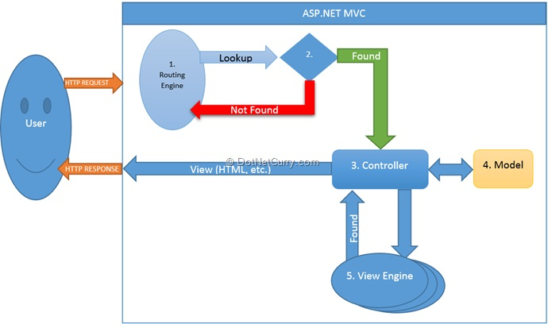

# Знайомство з ASP.NET Core

У цій главі розглядаються ASP.NET Core, C# та платформа веб-розробки .NET. Розділ починається зі вступу до ASP.NET MVC та основ шаблону MVC, реалізованого в ASP.NET Core. Далі ви створите рішення та три проекти ASP.NET Core, які будуть розроблені протягом решти секції. Перша програма, AutoLot.Api, — це RESTful-сервіс ASP.NET Core, друга — це веб-програма ASP.NET Core, що використовує шаблон Model-View-Controller, а остання програма — це веб-програма ASP.NET Core, що використовує сторінки Razor. Сервіси RESTful слугують додатковим сервером для програм MVC та Razor Page, а проекти AutoLot.Dal та AutoLot.Models, які ви створили раніше в цій книзі, слугуватимуть рівнем доступу до даних для всіх програм.
Після створення проектів та рішення, у наступному розділі демонструються численні способи запуску та налагодження проектів ASP.NET Core за допомогою Visual Studio або Visual Studio Code. У решті цього розділу розглядаються численні функції ASP.NET, які були перенесені в ASP.NET Core. Це включає контролери та дії, маршрутизацію, прив'язку та перевірку моделей, і фільтри.

## Короткий огляд ASP.NET MVC

Фреймворк ASP.NET MVC базується на шаблоні Model-View-Controller і запропонував відповідь розробникам, яких розчарували WebForms, що по суті було ненадійною абстракцією поверх HTTP. WebForms було створено, щоб допомогти розробникам клієнт-серверних систем перейти до Інтернету, і в цьому відношенні воно було досить успішним. Однак, оскільки розробники звикали до веб-розробки, багато хто хотів мати більше контролю над відображенням результату, позбутися стану перегляду та дотримуватися перевіреного шаблону проектування веб-застосунків. З огляду на ці цілі, було створено ASP.NET MVC.

## Знайомство з шаблоном MVC

Шаблон Model-View-Controller (MVC) існує з 1970-х років, спочатку створений як шаблон для використання в Smalltalk. Цей шаблон нещодавно знову набув популярності, його реалізації були здійснені багатьма різними мовами програмування, включаючи Java (Spring Framework), Ruby (Ruby on Rails) та .NET (ASP.NET MVC).




### Модель (The Model)

Модель – це дані вашої програми. Дані зазвичай представлені звичайними об'єктами CLR (POCO). Моделі переглядів складаються з однієї або кількох моделей та спеціально сформовані для споживача даних. Один зі способів мислення про моделі та моделі переглядів – це пов'язати їх з таблицями бази даних та переглядами бази даних.
З академічної точки зору, моделі повинні бути надзвичайно чистими та не містити валідації чи будь-яких інших бізнес-правил. Прагматично, те, чи містять моделі логіку валідації чи інші бізнес-правила, повністю залежить від мови та фреймворків, що використовуються, а також від конкретних потреб програми. Наприклад, EF Core містить багато анотацій даних, які одночасно слугують механізмом формування таблиць бази даних та засобом валідації у вебзастосунках ASP.NET Core. У цій секції приклади зосереджені на зменшенні дублювання коду, що розміщує анотації та перевірки даних там, де вони мають найбільший сенс.

### Представлення (The View)

Представлення (View) – це інтерфейс користувача програми. Представлення приймають команди та відображають результати цих команд користувачеві. Представлення має бути якомога легшим і фактично не обробляти жодної роботи, а передавати всю роботу контролеру. Представлення зазвичай строго типізовані з моделлю, хоча це не є обов'язковим.

### Контролер (The Controller)

Контролер – це мозок програми. Контролери приймають команди/запити від користувача (через представлення) або клієнта (через виклики API) за допомогою методів дій та обробляють їх належним чином. Результати операції потім повертаються користувачеві або клієнту. Контролери повинні бути легкими та використовувати інші компоненти або сервіси для обробки деталей запитів. Це сприяє розділенню завдань та підвищує тестованість і зручність обслуговування.

## ASP.NET Core та шаблон MVC

ASP.NET Core здатний створювати багато типів веб-застосунків та сервісів. Два варіанти – це веб-застосунки, що використовують шаблон MVC, та RESTful-сервіси. Типи веб-застосунків MVC та API-застосунків мають спільні частини шаблону «модель» та «контролер». Веб-застосунки MVC також реалізують «вигляд» для завершення шаблону MVC.

## ASP.NET Core та .NET Core

Так само, як Entity Framework Core є повним переписом Entity Framework 6, ASP.NET Core є переписом популярного ASP.NET Framework. Переписування ASP.NET було нелегким завданням, але воно було необхідним для усунення залежності від System.Web. Видалення цієї залежності дозволило ASP.NET-додаткам запускатися на операційних системах, відмінних від Windows, та на інших веб-серверах, окрім служб інформаційних служб Інтернету (IIS), включаючи локально розміщені. Це відкрило двері для застосунків ASP.NET Core для використання кросплатформного, легкого, швидкого веб-сервера з відкритим кодом під назвою Kestrel. Kestrel пропонує єдиний досвід розробки на всіх платформах.
Як і EF Core, ASP.NET Core розробляється на GitHub як повністю відкритий проект (https://github.com/aspnet). Він також розроблений як модульна система пакетів NuGet. Розробники встановлюють лише ті функції, які потрібні для конкретної програми, мінімізуючи обсяг застосунку, зменшуючи накладні витрати та зменшуючи ризики безпеки. Додаткові покращення включають спрощений запуск, вбудоване впровадження залежностей, чистішу систему конфігурації та підключаємє проміжне програмне забезпечення.

## Один фреймворк, багато застосувань

За допомогою ASP.NET Core ви можете створювати застосунки, що використовують Razor Pages, шаблон Model-View-Controller, RESTful сервіси та SPA-застосунки за допомогою Blazor WebAssembly або фреймворків JavaScript, таких як Angular та React. Хоча візуалізація інтерфейсу користувача залежить від вибору між MVC, Razor Pages та фреймворками JavaScript, базовий фреймворк розробки на стороні сервера однаковий для всіх варіантів. Blazor WebAssembly — це клієнтський фреймворк для розробки, який не має серверного компонента, як інші типи додатків ASP.NET Core. 

# Створення та налаштування рішення й проектів

Перш ніж заглибитися в деякі основні концепції ASP.NET Core, давайте створимо рішення та проекти, які будуть використовуватися в решті розділів. Проєкти ASP.NET Core можна створювати за допомогою Visual Studio або командного рядка.

## Використання Visual Studio 2022

Visual Studio має перевагу графічного інтерфейсу, який покроково покроково керує процесом створення рішення та проектів, додавання пакетів NuGet та створення посилань між проектами. 

Почніть зі створення нового проекту у Visual Studio. Виберіть шаблон C# ASP.NET Core Web API у діалоговому вікні «Create a new project». У діалоговому вікні «Configure your new project» введіть <b>AutoLot.Api</b> як назву проекту та <b>AutoLot</b> як назву рішення. На екрані Додаткова інформація залиште прапорці «Configure for HTTPS» та «Enable OpenAPI». Потім натисніть кнопку Create.

Тепер додайте до рішення ще один веб-застосунок ASP.NET Core. Виберіть шаблон «ASP.NET Core Web App (Model-View-Controller)». Назвіть проект <b>AutoLot.Mvc</b> і опція «Configure for HTTPS» позначена.

Далі додайте до рішення останню веб-програму ASP.NET Core. Виберіть шаблон «ASP.NET Core Web App(Razor Pages)». Назвіть проект <b>AutoLot.Web</b> та позначте опцію «Configure for HTTPS». 

Нарешті, додайте до проєкту C# Class Library та назвіть її <b>AutoLot.Services</b>.

## Додавання AutoLot.Models та AutoLot.Dal

Для цього рішення потрібен завершений рівень доступу до даних, який було завершено в розділі "Створення Data Access Layer з EF Core". Ви можете скопіювати файли в поточний каталог рішення або залишити їх там, де ви їх зібрали. У будь-якому випадку, вам потрібно клацнути правою кнопкою миші на назві вашого рішення в Solution Explorer, вибрати Add ➤ Existing Project, перейти до файлу AutoLot.Models.csproj і вибрати його. Повторіть для проєкту AutoLot.Dal, вибравши файл AutoLot.Dal.csproj.

## Додайте посилання на проекти

Додайте наступні посилання на проекти, клацнувши правою кнопкою миші назву проекту в Solution Explorer і вибравши Add ➤ Project Reference на проект для кожного проекту.

AutoLot.Api, AutoLot.Web та AutoLot.Mvc посилаються на наступне:

    AutoLot.Models

    AutoLot.Dal

    AutoLot.Services    

AutoLot.Services посилається на наступне:

    AutoLot.Models

    AutoLot.Dal
 
## Додайте пакети NuGet

Додаткові пакети NuGet необхідні для завершення програм.

До проєкту AutoLot.Api додайте такі пакети:

    AutoMapper

    Microsoft.AspNetCore.Mvc.Versioning

    Microsoft.AspNetCore.Mvc.Versioning.ApiExplorer

    Microsoft.EntityFrameworkCore.Design

    Microsoft.EntityFrameworkCore.SqlServer

    Microsoft.VisualStudio.Web.CodeGeneration.Design

    Microsoft.VisualStudio.Threading.Analyzers

    System.Text.Json

    Swashbuckle.AspNetCore

    Swashbuckle.AspNetCore.Annotations

    Swashbuckle.AspNetCore.Swagger

    Swashbuckle.AspNetCore.SwaggerGen

    Swashbuckle.AspNetCore.SwaggerUI

До проєкту AutoLot.Mvc додайте такі пакети:

    AutoMapper

    System.Text.Json

    LigerShark.WebOptimizer.Core

    Microsoft.Web.LibraryManager.Build

    Microsoft.VisualStudio.Web.CodeGeneration.Design

    Microsoft.EntityFrameworkCore.Design

    Microsoft.EntityFrameworkCore.SqlServer

    Microsoft.VisualStudio.Threading.Analyzers

До проєкту AutoLot.Web додайте такі пакети:

    AutoMapper

    System.Text.Json

    LigerShark.WebOptimizer.Core

    Microsoft.Web.LibraryManager.Build

    Microsoft.VisualStudio.Web.CodeGeneration.Design

    Microsoft.EntityFrameworkCore.Design

    Microsoft.EntityFrameworkCore.SqlServer

    Microsoft.VisualStudio.Threading.Analyzers

До проекту AutoLot.Services додайте такі пакети:

    Microsoft.Extensions.Hosting.Abstractions

    Microsoft.Extensions.Options

    Serilog.AspNetCore

    Serilog.Enrichers.Environment

    Serilog.Settings.Configuration

    Serilog.Sinks.Console

    Serilog.Sinks.File

    Serilog.Sinks.MSSqlServer

    System.Text.Json

    Microsoft.VisualStudio.Threading.Analyzers

## Використання за допомогою командного рядка

Як було показано раніше, проекти та рішення .NET Core можна створювати за допомогою командного рядка. Відкрийте командний рядок і перейдіть до каталогу, де потрібно розмістити рішення.

    У перелічених командах використовується роздільник каталогів Windows. Якщо ви використовуєте операційну систему, відмінну від Windows, налаштуйте символи роздільника за потреби. Вони також використовують певний шлях до каталогу під час додавання проектів AutoLot.Dal та AutoLot.Models до рішення, який потрібно буде оновити залежно від розташування ваших проектів.

```console
rem create the solution
dotnet new sln -n AutoLot
rem add autolot dal to solution update the path references as needed
dotnet sln AutoLot.sln add AutoLot.Models
dotnet sln AutoLot.sln add AutoLot.Dal
```

Створіть проект AutoLot.Service, додайте його до рішення, додайте пакети NuGet та посилання на проект.

```console
rem create the class library for the application services and add it to the solution
dotnet new classlib -n AutoLot.Services -o .\AutoLot.Services
dotnet sln AutoLot.sln add AutoLot.Services
dotnet add AutoLot.Services package Microsoft.Extensions.Hosting.Abstractions
dotnet add AutoLot.Services package Microsoft.Extensions.Options
dotnet add AutoLot.Services package Serilog.AspNetCore
dotnet add AutoLot.Services package Serilog.Enrichers.Environment
dotnet add AutoLot.Services package Serilog.Settings.Configuration
dotnet add AutoLot.Services package Serilog.Sinks.Console
dotnet add AutoLot.Services package Serilog.Sinks.File
dotnet add AutoLot.Services package Serilog.Sinks.MSSqlServer
dotnet add AutoLot.Services package System.Text.Json
dotnet add AutoLot.Services  package Microsoft.VisualStudio.Threading.Analyzers
rem update the path references as needed
dotnet add AutoLot.Services reference AutoLot.Models
dotnet add AutoLot.Services reference AutoLot.Dal

```

Створіть проект AutoLot.Api, додайте його до рішення, додайте пакети NuGet та посилання на проект.

```console
dotnet new webapi -n AutoLot.Api -au none -o .\AutoLot.Api
dotnet sln AutoLot.sln add AutoLot.Api
dotnet add AutoLot.Api package AutoMapper
dotnet add AutoLot.Api package Swashbuckle.AspNetCore
dotnet add AutoLot.Api package Swashbuckle.AspNetCore.Annotations
dotnet add AutoLot.Api package Swashbuckle.AspNetCore.Swagger
dotnet add AutoLot.Api package Swashbuckle.AspNetCore.SwaggerGen
dotnet add AutoLot.Api package Swashbuckle.AspNetCore.SwaggerUI
dotnet add AutoLot.Api package Microsoft.VisualStudio.Web.CodeGeneration.Design
dotnet add AutoLot.Api package Microsoft.EntityFrameworkCore.Design
dotnet add AutoLot.Api package Microsoft.EntityFrameworkCore.SqlServer
dotnet add AutoLot.Api package Microsoft.VisualStudio.Threading.Analyzers
dotnet add AutoLot.Api package System.Text.Json
dotnet add AutoLot.Api package Microsoft.AspNetCore.Mvc.Versioning
dotnet add AutoLot.Api package Microsoft.AspNetCore.Mvc.Versioning.ApiExplorer
rem add project references
rem update the path references as needed
dotnet add AutoLot.Api reference AutoLot.Dal
dotnet add AutoLot.Api reference AutoLot.Models
dotnet add AutoLot.Api reference AutoLot.Services
```

Створіть проект AutoLot.Mvc, додайте його до рішення, додайте пакети NuGet та посилання на проект.

```console
dotnet new mvc -n AutoLot.Mvc -au none -o .\AutoLot.Mvc
dotnet sln AutoLot.sln add AutoLot.Mvc
rem add packages
dotnet add AutoLot.Mvc package AutoMapper
dotnet add AutoLot.Mvc package System.Text.Json
dotnet add AutoLot.Mvc package LigerShark.WebOptimizer.Core
dotnet add AutoLot.Mvc package Microsoft.Web.LibraryManager.Build
dotnet add AutoLot.Mvc package Microsoft.EntityFrameworkCore.Design
dotnet add AutoLot.Mvc package Microsoft.EntityFrameworkCore.SqlServer
dotnet add AutoLot.Mvc package Microsoft.VisualStudio.Threading.Analyzers
dotnet add AutoLot.Mvc package Microsoft.VisualStudio.Web.CodeGeneration.Design
rem add project references
rem update the path references as needed
dotnet add AutoLot.Mvc reference AutoLot.Models
dotnet add AutoLot.Mvc reference AutoLot.Dal
dotnet add AutoLot.Mvc reference AutoLot.Services
```
Нарешті, створіть проект AutoLot.Web, додайте його до рішення, додайте пакети NuGet та посилання на проект.

```console
dotnet new webapp -n AutoLot.Web -au none -o .\AutoLot.Web
dotnet sln AutoLot.sln add AutoLot.Web
rem add packages
dotnet add AutoLot.Web package AutoMapper
dotnet add AutoLot.Web package System.Text.Json
dotnet add AutoLot.Web package LigerShark.WebOptimizer.Core
dotnet add AutoLot.Web package Microsoft.Web.LibraryManager.Build
dotnet add AutoLot.Web package Microsoft.EntityFrameworkCore.SqlServer
dotnet add AutoLot.Web package Microsoft.EntityFrameworkCore.SqlServer.Design
dotnet add AutoLot.Web package Microsoft.VisualStudio.Web.CodeGeneration.Design
dotnet add AutoLot.Web package Microsoft.VisualStudio.Threading.Analyzers
rem add project references
rem update the path references as needed
dotnet add AutoLot.Web reference AutoLot.Models
dotnet add AutoLot.Web reference AutoLot.Dal
dotnet add AutoLot.Web reference AutoLot.Services
```

Це завершує налаштування за допомогою командного рядка. Як ви, мабуть, бачите, це набагато ефективніше, якщо вам не потрібна допомога графічного інтерфейсу Visual Studio. Можливо використання Visual Studio і посилання на проекти а командний рядок для додавання пакетів.

## Оновлення посилання на пакет Entity Framework Core

Згадайте з розділів EF Core, що для очищення часових таблиць необхідно змінити посилання на пакет Microsoft.EntityFrameworkCore.Design. Оновіть посилання у файлах проекту для проектів AutoLot.Api, AutoLot.Mvc та AutoLot.Web до наступного:

```xml
    <PackageReference Include="Microsoft.EntityFrameworkCore.Design" Version="X.X.X">
      <PrivateAssets>all</PrivateAssets>
      <!--<IncludeAssets>runtime; build; native; contentfiles; analyzers; buildtransitive</IncludeAssets>-->
    </PackageReference>
```

## Створення класу GlobalUsing.cs у кожному проекті

Останній крок налаштування полягає у додаванні файлу з назвою GlobalUsings.cs до кореневої папки кожного проекту. Він буде використаний для зберігання операторів using для кожного проекту.

## Запуск застосунків ASP.NET Core

ASP.NET Core застосунки зазвичай запускаються за допомогою веб-сервера Kestrel з можливістю використання IIS, Apache, Nginx тощо через зворотний проксі-сервер між Kestrel та іншим веб-сервером. Під час розробки ви можете запускати свої програми такими способами:

    З Visual Studio, за допомогою Kestrel або IIS Express

    З командного рядка за допомогою інтерфейсу командного рядка .NET, використовуючи Kestrel

    З Visual Studio Code, за допомогою Kestrel, з меню «Виконати»

    З вікна терміналу Visual Studio Code за допомогою .NET CLI та Kestrel

Під час використання будь-якого з цих варіантів порти та середовище програми налаштовуються за допомогою файлу з назвою launchsettings.json, розташованого в папці Properties. Файл launchsettings.json для проєкту AutoLot.Mvc наведено тут для довідки (ваші порти для профілів IIS Express та AutoLot.Mvc будуть різними):

```json
{
  "$schema": "https://json.schemastore.org/launchsettings.json",
  "profiles": {
    "http": {
      "commandName": "Project",
      "dotnetRunMessages": true,
      "launchBrowser": true,
      "applicationUrl": "http://localhost:5214",
      "environmentVariables": {
        "ASPNETCORE_ENVIRONMENT": "Development"
      }
    },
    "https": {
      "commandName": "Project",
      "dotnetRunMessages": true,
      "launchBrowser": true,
      "applicationUrl": "https://localhost:7170;http://localhost:5214",
      "environmentVariables": {
        "ASPNETCORE_ENVIRONMENT": "Development"
      }
    }
  }
}
```

## Використання Visual Studio

Профілі визначають налаштування під час використання Kestrel як веб-сервера. Для запуску використовується  "https" профіль. Найважливіші налаштування, на які слід звернути увагу, це applicationUrl, який також визначає порт, та блок environmentVariables, який визначає змінні середовища для використання під час налагодження. Будь-які змінні середовища, визначені в цій секції, замінюють будь-які налаштування середовища користувача або машини з такою ж назвою. 
Команда «Run» у Visual Studio дозволяє вибрати профіль Kestrel або IIS Express. Після вибору профілю ви можете запустити проєкт, натиснувши F5 (режим налагодження), натиснувши Ctrl+F5 (те саме, що й «Start Without Debugging» в меню «Debug») або натиснувши зелену стрілку запуску (те саме, що й «Start Debugging» в меню «Debug»).
Також є можливість створювати додаткові профілі, наприклад, запуск за допомогою WSL (підсистеми Windows для Linux). 

## Використання Visual Studio Code

Щоб запустити проекти з Visual Studio Code, відкрийте папку, де знаходиться рішення. Коли ви натискаєте F5 (або клацаєте «Run»), VS Code запропонує вам вибрати середовище виконання (виберіть .NET X+ та .NET Core) та проект для запуску (AutoLot.Api, AutoLot.Web або AutoLot.Mvc). Потім буде створено конфігурацію запуску та поміщено її у файл з назвою launch.json. Параметри запуску потрібно налаштувати лише вперше. Щойно файли існуватимуть, ви можете вільно запускати/налагоджувати свою програму без необхідності повторного вибору. Visual Studio Code використовує профіль Kestrel під час запуску вашої програми.

## Використання командного рядка або вікна терміналу

Запуск програм ASP.NET Core з командного рядка такий самий, як і для будь-якої іншої програми .NET .Просто перейдіть до каталогу, де знаходиться файл csproj для вашої програми, і введіть таку команду:

```console
dotnet run
```
Це запустить вашу програму з використанням профілю Kestrel. Щоб завершити процес, натисніть Ctrl+C.

## Зміна коду під час налагодження

Під час запуску з командного рядка за допомогою dotnet run код у проектах вашої програми можна змінити, але ці зміни не відобразяться в запущеній програмі. Щоб зміни відобразилися в запущеній програмі, введіть таку команду:

```console
dotnet watch
```
Ця команда виконується з увімкненим параметром «Гаряче перезавантаження». Гаряче перезавантаження – це функція, яка намагається перезавантажити вашу програму в режимі реального часу після внесення змін. Не всі зміни можна перезавантажити в режимі реального часу, оскільки деякі з них вимагають перезавантаження програми. Якщо це потрібно, вам буде запропоновано перезавантажити програму. Якщо запит не з'явиться, ви можете примусово перезавантажити програму, використовуючи Ctrl+R у вікні терміналу. Щоб скасувати програму, натисніть Ctrl+C.
Гаряче перезавантаження також доступне під час налагодження за допомогою Visual Studio 2022 або Visual Studio Code.

## Налагодження застосунків ASP.NET Core

Під час запуску програми з Visual Studio або Visual Studio Code налагодження працює належним чином. Під час запуску з командного рядка вам потрібно підключитися до запущеного процесу, перш ніж ви зможете налагоджувати свою програму.

### Підключення за допомогою Visual Studio

Після запуску програми (за допомогою dotnet run або dotnet watch run) виберіть Debug ➤ Attach to Process у Visual Studio. Після підключення до запущеного процесу ви можете встановлювати точки зупинки у Visual Studio, і налагодження працює належним чином. Гаряче перезавантаження вмикається під час підключення до запущеного процесу, тому можливості редагування та продовження покращуються, хоча ще не досягли рівня, що був у попередніх версіях .NET Framework.

### Підключення за допомогою Visual Studio Code

Після запуску програми (за допомогою dotnet run або dotnet watch run) виберіть .NET Core Attach замість .NET Core Launch (web), клацнувши зелену стрілку запуску у VS Code. Після натискання кнопки вам буде запропоновано вибрати, який процес приєднати. Виберіть свою програму. Тепер ви можете встановити точки зупинки належним чином.

## Оновлення портів AutoLot.Api та AutoLot.Web Kestrel

Ви могли помітити, що AutoLot.Api, AutoLot.Web та AutoLot.Mvc мають різні порти, вказані для профілів Kestrel.

Замість того, щоб запам'ятовувати кожен із випадково призначених портів, оновіть усі налаштування проєктів наступним чином:

AutoLot.Mvc

```json
{
  "$schema": "https://json.schemastore.org/launchsettings.json",
  "profiles": {
    "http": {
      "commandName": "Project",
      "dotnetRunMessages": true,
      "launchBrowser": true,
      "applicationUrl": "http://localhost:5000",
      "environmentVariables": {
        "ASPNETCORE_ENVIRONMENT": "Development"
      }
    },
    "https": {
      "commandName": "Project",
      "dotnetRunMessages": true,
      "launchBrowser": true,
      "applicationUrl": "https://localhost:5001;http://localhost:5000",
      "environmentVariables": {
        "ASPNETCORE_ENVIRONMENT": "Development"
      }
    }
  }
}
```
AutoLot.Api

```json

      "applicationUrl": "http://localhost:5010",
      "applicationUrl": "https://localhost:5011;http://localhost:5010",
```

AutoLot.Web
```json
      "applicationUrl": "http://localhost:5020",
      "applicationUrl": "https://localhost:5021;http://localhost:5020",
```


# Концепції ASP.NET Core з MVC/Web API

Багато цілей та функцій дизайну підтримуються (і покращуються) в ASP.NET Core. Деякі з них (але не всі) перелічені тут:

    Угода про конфігурацію

    Контролери та дії

    Більш чиста структура каталогів

    Прив'язка моделі

    Валідація моделі

    Маршрутизація

    Фільтри

    Макети та подання Razor

Усі ці елементи розглядаються в наступних розділах, за винятком макетів та подань Razor, які розглядаються в наступній главі.

## Угода про конфігурацію

ASP.NET MVC та ASP.NET Web API зменшили обсяг необхідного налаштування завдяки впровадженню певних домовленостей. Дотримання цих правил зменшує обсяг ручного (або шаблонного) налаштування, але також вимагає від розробників знання цих правил, щоб скористатися ними. Дві основні домовленості включають домовленості про іменування та структуру каталогів.

## Правила іменування

В ASP.NET Core існує кілька правил іменування в застосунках у стилі MVC та RESTful, а також для застосунків на основі сторінок Razor. Наприклад, контролери зазвичай іменуються із суфіксом Controller (наприклад, HomeController), а також походять від Controller (або ControllerBase). Під час доступу через маршрутизацію суфікс Controller відкидається. Під час маршрутизації до методів асинхронних дій, названих із суфіксом Async, суфікс Async відкидається. Код сторінок Razor, що стоїть за файлами, називається із суфіксом Model (ErrorModel), який видаляється так само, як і суфікси Controller та Async. Ця домовленість про видалення суфікса повторюється в ASP.NET Core.
Інша угода про іменування використовується для пошуку представлень методів дій контролера. Під час пошуку представлень контролера, ім'я контролера мінус суфікс є початковим місцем пошуку. За замовчуванням метод дії відображатиме вигляд з тим самим ім'ям, що й метод.
У наступних розділах буде розглянуто багато прикладів конвенцій ASP.NET Core.

# Контролери та дії (веб-додатки на основі MVC та RESTful сервіси).

Контролери та методи дій – це робочі конячки веб-застосунку в стилі ASP.NET Core MVC або RESTful сервісного застосунку.

Сторінки Razor походять від класу PageModel, який буде розглянуто в наступній главі.

## Клас Controller

Клас Controller має власний базовий клас під назвою ControllerBase. Контролери веб-застосунків ASP.NET Core успадковуються від класу Controller, тоді як контролери служб ASP.NET Core успадковуються від класу ControllerBase. Клас Controller надає безліч допоміжних методів для вебзастосунків у стилі MVC. У таблиці  перелічені найпоширеніші методи.

Деякі допоміжні методи, що надаються класом Controller
|Метод|Сенс у використанні|
|-----|-------------------|
|ViewDataTempDataViewBag|Надайє дані для представлення через ViewDataDictionary, TempDataDictionary та динамічний транспорт ViewBag.|
|View|Повертає ViewResult (похідне від ActionResult) як HTTP-відповідь. За замовчуванням використовується вигляд з такою ж назвою, як і метод дії, з можливістю вказати конкретний вигляд. Усі параметри дозволяють вказати модель вигляду, яка має сувору типізацію та надсилається до View.|
|PartialView|Повертає PartialViewResult до конвеєра відповідей.|
|ViewComponent|Повертає ViewComponentResult до конвеєра відповідей.|
|Json|Повертає JsonResult, що містить об'єкт, серіалізований як JSON, як відповідь.|
|OnActionExecuting|Виконується перед виконанням методу дії.|
|OnActionExecutionAsync|Асинхронна версія OnActionExecuting.|
|OnActionExecuted|Виконується після виконання методу дії.|

## Клас ControllerBase

Клас ControllerBase забезпечує основні функції як для вебзастосунків у стилі ASP.NET Core MVC, так і для RESTful-сервісів, а також допоміжні методи для повернення кодів стану HTTP.

Деякі допоміжні методи, що надаються класом ControllerBase

|Метод|Сенс у використанні|
|-----|-------------------|
|HttpContext|Повертає HttpContext для поточної виконуваної дії.|
|Request|Повертає HttpRequest для дії, що виконується на даний момент.|
|Response|Повертає HttpResponse для дії, що виконується на даний момент.|
|RouteData|Повертає RouteData для поточної виконуваної дії.|
|ModelState|Повертає стан моделі щодо зв'язування та перевірки моделі.|
|Url|Повертає екземпляр IUrlHelper, що надає доступ до створення URL-адрес для застосунків та сервісів ASP.NET Core MVC.|
|User|Повертає користувача ClaimsPrincipal.|
|Content|Повертає ContentResult відповіді. Перевантаження дозволяють додавати тип контенту та визначення кодування.|
|File|Повертає FileContentResult відповіді.|
|Redirect|Серія методів, які перенаправляють користувача на іншу URL-адресу, повертаючи RedirectResult.|
|LocalRedirect|Серія методів, які перенаправляють користувача на іншу URL-адресу, лише якщо URL-адреса є локальною. Безпечніший за загальні методи перенаправлення.|
|RedirectToActionRedirectToPageRedirectToRoute|Серія методів, які перенаправляють на інший метод дії, Razor Page або іменований маршрут.|
|TryUpdateModelAsync|Використовується для явного зв'язування моделі.|
|TryValidateModel|Використовується для явної перевірки моделі.|

Деякі допоміжні методи коду стану HTTP, що надаються класом ControllerBase
|Метод|Код стану HTTP, дія, результат|Код статуса|
|-----|-------------------|----|
|NoContent|NoContentResult|204|
|Ok|OkResult|200|
|NotFound|NotFoundResult|404|
|BadRequest|BadRequestResult|400|
|CreatedCreatedAtActionCreatedAtRoute|CreatedResultCreatedAtActionResultCreateAtRouteResult|201|
|AcceptedAcceptedAtActionAcceptedAtRoute|AcceptedResultAcceptedAtActionResultAcceptedAtRouteResult|202|

## Дії (Actions)

Дії – це методи на контролері, які повертають IActionResult (або Task\<IActionResult\> для асинхронних операцій), або клас, що реалізує IActionResult, такий як ActionResult або ViewResult.

```cs
public async Task<IActionResult> Index()
        => View(await _serviceWrapper.GetCarsAsync());
```
Цей приклад повертає код стану HTTP 200 зі списком записів Car у форматі JSON::

```cs
[Produces('application/json')]
public ActionResult<IEnumerable<Car>> GetCarsByMake(int? id)
{
  return Ok(MainRepo.GetAll());
}
```
Дії та їхні повернуті значення будуть детальніше розглянуті в наступних главах.

## Токени захисту від підробок

ASP.NET Core використовує проміжне програмне забезпечення(middleware) для захисту від підробок, щоб допомогти в боротьбі з атаками підробки міжсайтових запитів. ASP.NET Core використовує шаблон токена синхронізації Synchronizer Token Pattern(STP), який створює унікальний та непередбачуваний токен на стороні сервера. Цей токен надсилається до браузера разом із відповіддю. Будь-який запит, який повертається на сервер, повинен містити правильний токен, інакше запит буде відхилено.

### Увімкнення (веб-програми в стилі MVC)

Отримання токена та його перевірка обробляється в методах дій для веб-застосунків у стилі MVC (MVC). Щоб перевірити токен, просто додайте атрибут ValidateAntiForgeryToken до кожного методу HTTP Post у вашій програмі, ось так:

```cs
[HttpPost]
[ValidateAntiForgeryToken]
public async Task<IActionResult> Create (Car entity)
{
  //do important stuff
}
```
Щоб відмовитися від перевірки, просто не додавайте атрибут ValidateAntiForgeryToken до методу.

### Відмова (веб-додатки Razor Page).

Базові додатки Razor Page автоматично беруть участь у шаблоні захисту від підробок. Щоб відмовитися від участі, додайте IgnoreAntiforgeryToken до класу PageModel:

```cs
[IgnoreAntiforgeryToken]
public class ErrorModel : PageModel
{
  //Omitted for brevity
}
```

## Домовленості про стуктуру каталогів

Існує кілька правил користування папками, які необхідно розуміти для успішного створення вебзастосунків та сервісів ASP.NET Core.

### Папка  Controllers

За домовленістю, папка Controllers – це місце, де реалізації ASP.NET Core MVC та API (і механізм маршрутизації) очікують розміщення контролерів для вашої програми.

### Папка Views

Папка Views – це місце, де зберігаються представлення (views) для застосунку в стилі MVC. Кожен контролер отримує власну папку в головній папці Views, назва якої належать до назви контролера (без суфікса Controller). Методи дій за замовчуванням відображатимуть представлення у папці своїх контролерів. Наприклад, папка Views/Home містить усі представлення для класу контролера HomeController.

### Папка Shared

Спеціальна папка в розділі Views називається Shared. Ця папка доступна для всіх контролерів та їхніх методів дій. Після пошуку папки з назвою контролера, якщо представлення не знайдено, пошук представлення здійснюється у папці Shared.

### Папка Pages

Папка Pages – це місце, де зберігаються сторінки для програми під час створення веб-програм за допомогою сторінок Razor. Структура каталогів у папці Pages встановлює базовий маршрут для кожної сторінки (докладніше про маршрутизацію пізніше).

#### Папка Pages\Shared


Спеціальна папка в Pages називається Shared. Ця папка доступна для всіх сторінок у вебзастосунку Razor на основі сторінок.

### Папка Areas
Areas – це функція, яка використовується для впорядкування пов’язаної функціональності в групу як окремий простір імен для маршрутизації та структури папок для представлень і сторінок Razor. Кожна область отримує власний набір контролерів (API-додатки), контролерів та представлень (додатки в стилі MVC) і сторінок (додатки на основі сторінок Razor). Додаток може мати від нуля до багатьох областей, і кожна область знаходиться в батьківській папці Areas.

### Папка wwwroot

Покращенням у веб-застосунках ASP.NET Core порівняно з попередніми версіями фреймворку є створення спеціальної папки з назвою wwwroot. В ASP.NET Core файли клієнтської сторони містяться в папці wwwroot. Таке розділення скомпільованих файлів від файлів на стороні клієнта значно очищує структуру проекту під час роботи з ASP.NET Core. Існує виняток з цієї домовленості, який стосується файлів CSS, специфічних для представлень та сторінок. Вони зберігаються разом із представленнями/сторінками, на які вони орієнтовані. Вони будуть розглянуті в наступних главах.

# Маршрутизація (Routing)

Маршрутизація – це те, як ASP.NET Core зіставляє HTTP-запити з відповідним кодом (виконуваними кінцевими точками) для обробки цих запитів, а також створює URL-адреси з виконуваних кінцевих точок. Це досягається за допомогою проміжного програмного забезпечення маршрутизації, зареєстрованого в класі Startup (до C# 10) або операторів верхнього рівня у файлі Program.cs (C# 10 і пізніших версій).
Маршрут у веб-застосунку на основі MVC складається з (необов'язкової) області, контролера, методу дії, HTTP-методу(POST або GET) та (необов'язкових) додаткових значень (так званих значень маршруту). Маршрути в RESTful сервісах ASP.NET Core складаються з (необов'язкової) області, контролера, (необов'язкового) методу дії, HTTP-методу (POST, PUT, GET, DELETE тощо) та (необов'язково) додаткових значень маршруту. Під час визначення маршрутів для RESTful-сервісів ASP.NET метод дії зазвичай не вказується. Натомість, як тільки контролер знайдено, метод дії для виконання базується на методі HTTP запиту. У веб-застосунках у стилі MVC та RESTful-сервісах маршрути можна налаштувати в проміжному програмному забезпеченні або через атрибути маршруту на контролерах та методах дій.
Маршрут у програмі на основі сторінки Razor — це структура каталогів програми, метод HTTP, сама сторінка та (необов’язково) додаткові значення маршруту. Окрім конструкцій за замовчуванням, усі програми в стилі ASP.NET можуть створювати маршрут, який ігнорує стандартні шаблони. У програмах на основі сторінок Razor маршрути базуються на структурі каталогів програми, а додаткові токени доступні як частина директиви @page. Все це буде розглянуто детальніше пізніше.

## Шаблони URL-адрес та токени маршрутів

Визначення маршрутів складаються з шаблонів URL-адрес, які містять змінні заповнювачі (які називаються токенами) та (необов'язкові) літерали, розміщені в упорядкованій колекції, відомій як таблиця маршрутів. Кожен запис у таблиці маршрутів має визначати окремий шаблон URL-адреси для відповідності. У таблиці наведено зарезервовані імена токенів та їхні визначення.

Зарезервовані токени маршрутів для сервісних застосунків у стилі MVC та RESTful
|Token|Сенс у використанні|
|-----|-------------------|
|Area|Визначає область для маршруту|
|Controller|Визначає контролер (без суфікса контролера)|
|Action|Визначає назву методу дії|
|* or **|Загальний параметр. Коли використовується як префікс до параметра маршруту, він пов'язує решту URI. Наприклад, car/{**slug} відповідає будь-якому URI, який починається з /car та має будь-яке значення після нього. Наступне значення присвоюється значенню маршруту slug. Використання подвійної * у шляху зберігає символи роздільника шляху, тоді як одинарна * - ні.|

## Обробка дублікатів підписів методів C#

Токен дії за замовчуванням відповідає назві методу C# на контролері. Атрибут ActionName можна використовувати для зміни маршрутизації. Наприклад, наступний код визначає методи дії HTTP Get та HTTP Post з однаковим ім'ям та сигнатурою. C# не дозволяє два методи з однаковою сигнатурою та однаковим ім'ям, тому виникає помилка компілятора:

```cs
[HttpGet]
public async Task<IActionResult> Create()
{
  //do something
}
[HttpPost]
[ValidateAntiForgeryToken]
//Compiler error
public async Task<IActionResult> Create()
{
  //Do something else
}
```
Рішення полягає в тому, щоб перейменувати один із методів та додати атрибут ActionName, щоб змінити назву, що використовується механізмом маршрутизації:

```cs
[HttpPost]
[ActionName("Create")]
[ValidateAntiForgeryToken]
public async Task<IActionResult> CreateCar()
{
  //Do something else
}
```

## Токени користувацьких маршрутів

Окрім зарезервованих токенів, маршрути можуть містити користувацькі токени, які зіставлені (прив'язані до моделі) з параметрами методу дії контролера або методу обробника сторінок Razor. Під час визначення маршрутів за допомогою токенів має бути літеральне значення, що розділяє токени. Хоча {controller}/{action}/{id?} є дійсним, {controller}{action}{id?} не є.

### Обмеження токенів маршруту 

Токени маршруту також можуть бути обмежені для усунення неоднозначності подібних маршрутів. У таблиці наведено доступні обмеження токенів маршруту. Зверніть увагу, що обмеження не призначені для використання для перевірки. Якщо значення маршруту є недійсним через обмеження (наприклад, занадто великим для обмеження int), механізм маршрутизації не знайде збігу та поверне 404 (Не знайдено). Однак бізнес-логіка, ймовірно, вимагатиме повернення 400 (Неправильний запит).

Обмеження токенів маршрутизації для сервісних застосунків у стилі MVC та RESTful

|Обмеження|Приклад|Сенс у використанні|
|---------|-------|-------------------|
|Int|{id:int}|Збігається з будь-яким цілим числом.|
|Bool|{active:bool}|Збігається з "true" або "false". Регістр не враховується.|
|datetime|{dob:datetime}|Збігається з дійсним значенням DateTime в інваріантній культурі.|
|decimal|{price:decimal}|Збігається з дійсним десятковим значенням в інваріантній культурі.|
|double|{weight:double}|Збігається з дійсним значенням типу double в інваріантній культурі.|
|Float|{weight:float}|Збігається з дійсним значенням типу "float" в інваріантній культурі.|
|Guid|{id:guid}|Збігається з дійсним значенням GUID.|
|Long|{ticks:long}|Збігається з дійсним довгим значенням в інваріантній культурі.|
|minlength(value)|{name:minlength(4)}|Рядок має містити щонайменше значення символів.|
|maxlength(value)|{name:maxlength(12)}|Рядок має містити не більше значення символів.|
|length(value)|{name:length(12)}|Рядок має складатися рівно з символів значення.|
|min(value)|{age:min(18)}|Ціле число має бути щонайменше значенням|
|max(value)|{age:max(65)}|Ціле число має бути не більше ніж значенням|
|range(min,max)|{age:range(12,65)}|Ціле число має бути між мінімумом і максимумом|
|alpha|{name:alpha}|Рядок повинен містити лише літери a-z, регістр не враховується.
|regex(expression)|{ssn:regex(^\\d{{3}}-\\d{{2}}-\\d{{4}}$)}|Рядок має відповідати регулярному виразу.|
|required|{name:required}|Обов'язкове значення.|

## Загальноприйнята маршрутизація (веб-додатки в стилі MVC)

Звичайна маршрутизація будує таблицю маршрутів у класі Startup (до .NET6) або в операторах верхнього рівня файлу Program.cs (.NET6+). Метод MapControllerRoute() додає кінцеву точку до таблиці маршрутів. Метод визначає ім'я, шаблон URL-адреси та будь-які значення за замовчуванням для змінних у шаблоні URL-адреси. У наступному прикладі коду попередньо визначені заповнювачі {controller} та {action} посилаються на контролер (без суфікса Controller) та метод дії, що міститься в цьому контролері. Заповнювач {id} є налаштовуваним і перетворюється на параметр (з назвою id) для методу дії. Додавання знака питання до токена маршруту вказує на те, що це необов'язкове значення маршруту та представлене в методі дії як параметр, що може мати значення null.

```cs
app.MapControllerRoute(
    name: "default",
    pattern: "{controller=Home}/{action=Index}/{id?}")
    .WithStaticAssets();
```
Коли запитується URL-адреса, вона перевіряється за таблицею маршрутизації. Якщо є збіг, також перевіряється HTTP-метод (Post, Get тощо) запиту, щоб переконатися, що код, розташований у цій кінцевій точці програми, приймає метод запиту. Наприклад, запит з POST HTTP-методом з URL-адресою (без схеми та домену) Car/Delete/5 надходить до застосунку. З наступних двох дій буде цільовим другий метод (оскільки він позначений атрибутом [HttpPost]), передаючи 5 як значення параметра id:

```cs
public class CarController : ControllerBase
{
  [HttpGet]
  public async Task<IActionResult> Delete(int? id)
  {
    //return a view
  }
  [HttpPost]
  [ValidateAntiForgeryToken]
  public async Task<IActionResult> Delete(int id, Car car)
  {
    //delete the record
  }
}
```
Значення за замовчуванням визначають, як заповнювати пробіли для URL-адрес, які не містять усіх визначених компонентів. У попередньому коді, якщо в URL-адресі не було вказано додаткових значень маршруту (наприклад, http://localhost:5001), то механізм маршрутизації викличе метод дії Index() класу HomeController без параметра id. Значення за замовчуванням є прогресивними, тобто їх можна виключати справа наліво. Однак частини маршруту не можна пропускати. Введення URL-адреси типу http://localhost:5001/Delete/5 призведе до помилки шаблону {controller}/{action}/{id}.
Звичайна маршрутизація залежить від порядку. Механізм маршрутизації запускається у верхній частині таблиці маршрутів і намагатиметься знайти перший відповідний маршрут на основі (необов’язкової) області, контролера, дії, користувацьких маркерів і метода HTTP. Якщо механізм маршрутизації знаходить більше однієї кінцевої точки, яка відповідає маршруту плюс HTTP-метод, він викине виняток AmbiguousMatchException. Якщо система маршрутизації не може знайти відповідний маршрут, вона поверне код 404.
Зверніть увагу, що шаблон маршруту не містить протоколу чи імені хоста. Механізм маршрутизації автоматично додає правильну інформацію під час створення маршрутів і використовує HTTP-метод, шлях і параметри для визначення правильної кінцевої точки програми. Наприклад, якщо ваш сайт працює на https://www.skimedic.com, протокол (HTTPS) та ім'я хоста (www.skimedic.com) автоматично додаються до маршруту під час його створення (наприклад, https://www.skimedic.com/Car/Delete/5). Для вхідного запиту механізм маршрутизації використовує частину URL-адреси Car/Delete/5.

## Маршрути області (Area)

Якщо ваша програма містить область, потрібно відобразити додатковий шаблон маршруту. Замість використання MapControllerRoute(), викличте MapAreaControllerRoute() ось так:

```cs
app.UseRouting();
app.MapAreaControllerRoute(
    name:'areaRoute',
    areaName:'Admin',
    pattern:'Admin/{controller}/{action}/{id?}');
```
Оскільки маршрути за областями є більш специфічними, ніж маршрути без областей, вони зазвичай додаються до таблиці маршрутів спочатку, ось так:

```cs
app.MapAreaControllerRoute(
    name:'areaRoute',
    areaName:'Admin',
    pattern:'Admin/{controller}/{action}/{id?}');
app.MapControllerRoute(
    name: 'default',
    pattern: '{controller=Home}/{action=Index}/{id?}');
```
## Іменовані маршрути

Назви маршрутів можна використовувати як скорочення для створення URL-адрес усередині програми. У попередньому звичайному маршруті кінцевій точці присвоюється ім'я "default".

## Атрибутна маршрутизація (веб-додатки в стилі MVC та RESTful-сервіси)

Маршрутизація за атрибутами працює так само, як і звичайна маршрутизація, коли маршрути зіставляються з кінцевими точками програми та методом HTTP. Різниця полягає в тому, як налаштовуються маршрути. У атрибутній маршрутизації маршрути визначаються за допомогою атрибутів C# на контролерах та їхніх методах дій. Це може призвести до точнішої маршрутизації, але також може збільшити обсяг конфігурації, оскільки для кожного контролера та дії необхідно вказати інформацію про маршрутизацію. Перш ніж ми розглянемо приклади маршрутизації атрибутів, її потрібно ввімкнути в класі Startup (до .NET 6) або в операторах верхнього рівня файлу Program.cs (.NET6+), викликавши MapControllers():

```cs
  app.MapControllers();
```
Як приклад маршрутизації атрибутів, візьмемо наступний фрагмент коду. Чотири атрибути Route у методі дії Index() еквівалентні тому ж маршруту за замовчуванням, визначеному раніше. Метод дії Index() є кінцевою точкою програми для

  mysite.com ([Route('/')]),
  mysite.com/Home ([Route('/Home')]),
  mysite.com/Home/Index ([Route('/Home/Index')]), or
  mysite.com/Home/Index/5 ([Route('/Home/Index/{id?}')]).

```cs
public class HomeController : Controller
{
  [Route('/')]
  [Route('/Home')]
  [Route('/Home/Index')]
  [Route('/Home/Index/{id?}')]
  public IActionResult Index(int? id)
  {
    ...
  }
}
```
У попередньому прикладі єдиний токен маршруту використовувався для необов'язкового параметра id. Той самий набір маршрутів можна створити за допомогою токенів маршруту контролера та дії, ось так:

```cs
public class HomeController : Controller
{
  [Route('/')]
  [Route('/[controller]')]
  [Route('/[controller]/[action]')]
  [Route('/[controller]/[action]/{id?}')]
  public IActionResult Index(int? id)
  {
    ...
  }
}
```
Основна відмінність між звичайною маршрутизацією та атрибутивною маршрутизацією полягає в тому, що звичайна маршрутизація охоплює застосунок, тоді як атрибутивна маршрутизація охоплює лише контролер та його методи дій з атрибутом Route. Якщо не використовується звичайна маршрутизація, кожному контролеру потрібно буде визначити маршрут з атрибутом маршрутизації, інакше до них не буде доступу. Наприклад, якщо в таблиці маршрутів не було визначено маршрут за замовчуванням (за використання звичайної маршрутизації), наступний код неможливо буде знайти, оскільки контролер не має налаштованої маршрутизації:

```cs
public class CarController : Controller
{
  public IActionResult Delete(int id)
  {
    ...
  }
}
```

  Звичайну та атрибутну маршрутизацію можна використовувати разом. Якщо маршрут контролера за замовчуванням було встановлено, як у прикладі звичайної маршрутизації, попередній контролер буде розташований у таблиці маршрутизації.

Коли маршрути додаються на рівні контролера, методи дій походять від цього базового маршруту. Наприклад, наступний маршрут контролера охоплює метод дії Delete() (та будь-який інший):

```cs
[Route('[controller]/[action]/{id?}')]
public class CarController : Controller
{
  public IActionResult Delete(int id)
  {
    ...
  }
}
```
  Вбудовані токени розрізняються квадратними дужками ([]) в атрибутній маршрутизації замість фігурних дужок ({}), що використовуються в звичайній маршрутизації. Користувацькі токени все ще використовують фігурні дужки.

Якщо метод дії потребує перезапуску шаблону маршруту, додайте перед маршрутом скісну риску (/). Наприклад, якщо метод видалення має відповідати шаблону URL-адреси mysite.com/Delete/Car/5, налаштуйте дію наступним чином:

```cs
[Route("[controller]/[action]/{id?}")]
public class CarController : Controller
{
  [Route("/[action]/[controller]/{id}")]
  public IActionResult Delete(int id)
  {
    ...
  }
}
```
Як показано в прикладі маршруту з атрибутом за замовчуванням, визначення маршрутів можуть використовувати літеральні значення маршруту замість заміни токенів. Наведений нижче код видасть той самий результат для методу дії Delete(), що й попередній приклад коду:

```cs
[Route('[controller]/[action]/{id?}')]
public class CarController : Controller
{
  [Route('/Delete/Car/{id}')]
  public IActionResult Delete(int id)
  {
    ...
  }
}
```

## Маршрутизація сторінок Razor

Як уже згадувалося, маршрутизація сторінок Razor базується на структурі папок програми. Щоб увімкнути маршрутизацію, викличте MapRazorPages() у класі Startup (до .NET 6) або в операторах верхнього рівня файлу Program.cs (.NET6+):

```cs
app.MapRazorPages();
```
Для вебзастосунків на основі сторінок Razor сторінка Index є сторінкою за замовчуванням для каталогу. Це означає, що якщо сторінка Index.cshtml розташована за адресою Pages/Cars/Index.cshtml, то обидва маршрути, що включають /Cars та /Cars/Index, ведуть до цієї точки виконання.

Додаткові токени маршруту можна додавати після директиви @page для уточнення маршруту. Припустимо, у вас є папка Car в папці Pages, а в папці Car є сторінка з назвою Delete.cshtml. Маршрут за замовчуванням для цієї сторінки — /Cars/Delete. Щоб додати необов'язковий токен ідентифікатора для прийняття URI, наприклад /Cars/Delete/5, оновіть директиву @page наступним чином:

```cs
@page "{id?}"
```
Як і у випадку з маршрутизацією для застосунків у стилі MVC, маршрут можна скинути за допомогою склесної риски (/). Після скидання налаштувань можна додавати літерали та токени, щоб повністю змінити маршрут. Наприклад, маршрут для сторінки Delete.cshtml можна оновити до /Delete/Vehicle/5 за допомогою наступного коду:

```cs
@page "/Delete/Vehicle/{id?}"
```

## Маршрутизація та HTTP-методи

Як ми вже обговорювали, жоден із шаблонів маршрутів не визначає HTTP-метод. У застосунках на основі MVC та RESTful-сервісах методи дій декоруються атрибутами, які вказують, який HTTP-метод слід обробляти. Для застосунків на основі сторінок Razor різні HTTP-методи обробляються за допомогою спеціальних методів обробника сторінок.

### HTTP-метод в атрибутній маршрутизації веб-застосунків у стилі MVC

Як обговорювалося раніше, поширеним шаблоном у веб-застосунках, що використовують шаблон MVC, є наявність двох кінцевих точок застосунку, які відповідають певному шаблону маршруту. Дискримінатором у цих випадках є метод HTTP, як ми бачили на прикладі двох методів дії Delete() класу CarController.
Маршрути також можна змінювати за допомогою атрибутів HTTP-методів. Наприклад, нижче показано необов'язковий токен маршруту id, доданий до шаблону маршруту для обох методів Delete():

```cs
[Route('[controller]/[action]')]
public class CarController : Controller
{
  [HttpGet('{id?}')]
  public IActionResult Delete(int? id)
  {
    ...
  }
  [HttpPost('{id}')]
  [ValidateAntiForgeryToken]
  public IActionResult Delete(int id, Car recordToDelete)
  {
    ...
  }
}
```

  Браузери підтримують лише запити get та post, тому, хоча ви можете прикрасити методи вашого MVC веб-застосунку додатковими атрибутами HTTP-методами (наприклад, HttpPut та HttpDelete), браузери не зможуть робити відповідні запити для використання цих кінцевих точок.

Маршрути також можна перезапустити за допомогою HTTP-методів; просто поставте перед шаблоном маршруту скісну риску (/), як показано в наступному прикладі:

```cs
[HttpGet("/[controller]/[action]/{makeId}/{makeName}")]
public IActionResult ByMake(int makeId, string makeName)
{
  ViewBag.MakeName = makeName;
  return View(_repo.GetAllBy(makeId));
}
```

Якщо метод дії не має атрибута HTTP-методу, він за замовчуванням приймає HTTP-метод GET. Однак у вебзастосунках у стилі MVC немарковані методи дій також можуть відповідати на HTTP-метод POST, що може призвести до неочікуваних результатів. З цієї причини вважається найкращою практикою явно позначати всі методи дій правильним атрибутом методу.

### HTTP-методи в маршрутизації RESTful сервісів

Визначення маршрутів, що використовуються для RESTful-сервісів, зазвичай не вказують методи дій. Коли методи дій не є частиною шаблону маршруту, методи дій вибираються на основі HTTP-методу запиту (і, за бажанням, типу вмісту). Наведений нижче код показує API-контролер із чотирма методами, які відповідають одному шаблону маршруту. Зверніть увагу, що атрибути HTTP-методу різні для кожного з методів дії:

```cs
[Route("api/[controller]")]
[ApiController]
public class CarController : ControllerBase
{
  [HttpGet("{id}")]
  public IActionResult GetCarsById(int id)
  {
    ...
  }
  [HttpPost("{id}")]
  public IActionResult CreateANewCar(int id, Car entity)
  {
    ...
  }
  [HttpPut("{id}")]
  public IActionResult UpdateAnExistingCar(int id, Car entity)
  {
    ...
  }
  [HttpDelete("{id}")]
  public IActionResult DeleteACar(int id, Car entity)
  {
    ...
  }
}
```
Якщо метод дії не має атрибута HTTP-методу, він розглядається як кінцева точка застосунку для HTTP-методів GET. Як і у випадку з додатками в стилі MVC, якщо запитуваний маршрут збігається, але методу дії з правильним атрибутом методу немає, сервер поверне 404 (не знайдено).

Останнім селектором кінцевої точки для контролерів API є необов'язковий атрибут Consumes, який вказує тип контенту, що приймається кінцевою точкою. Запит має використовувати відповідний заголовок content-type, інакше буде повернуто помилку 415 Unsupported Media Type. Наведені нижче два приклади кінцевих точок, обидва в одному контролері, показують різницю між JSON та XML:

```cs
[HttpPost]
[Consumes('application/json')]
public IActionResult PostJson(IEnumerable<int> values)
  =>  Ok(new { Consumes = 'application/json', Values = values });
[HttpPost]
[Consumes('application/x-www-form-urlencoded')]
public IActionResult PostForm([FromForm] IEnumerable<int> values)
  => Ok(new { Consumes = 'application/x-www-form-urlencoded', Values = values });
```
  Існує ще один (і необов'язковий) селектор маршруту для API-контролерів, який пов'язаний з керуванням версіями.

### HTTP-методи у маршрутизації сторінок Razor

Щойно сторінку Razor виявлено як кінцеву точку для маршруту, HTTP-метод використовується для визначення правильного методу обробника сторінки для виконання. Наведений нижче приклад коду для сторінки Delete.cshtml виконає метод OnGet() для запитів GET та метод OnPost() для запитів POST.


```cs
public class DeleteModel : PageModel
{
  public IActionResult OnGet(int? id)
  {
    //handle the get request here
  }
  public IActionResult OnPost(int? id)
  {
    //handle the post request here
  }
}
```
Це буде детальніше розглянуто в наступній главі.

## Перенаправлення за допомогою маршрутизації

Ще однією перевагою маршрутизації є те, що вам більше не потрібно жорстко прописувати URL-адреси для інших сторінок вашого сайту. Записи маршрутизації використовуються для зіставлення вхідних запитів, а також для побудови URL-адрес. Під час створення URL-адрес схема, хост і порт додаються на основі значень поточного запиту. Під час перенаправлення в коді на стороні сервера (наприклад, у методі дії контролера або на сторінці Razor) існує кілька методів перенаправлення, які можна використовувати для перенаправлення шляху виконання до іншої кінцевої точки. У таблиці наведено три методи перенаправлення та їхні найпоширеніші перевантаження.

Методи перенаправлення запитів на стороні сервера

|Метод|Сенс у використанні|
|-----|-------------------|
|RedirectToAction()|Перенаправляє на дію. Перевантажені параметри включають: actionName, controllerName, routeValues. Якщо будь-який із параметрів не надано, значення будуть надані поточним HTTP-запитом.|
|RedirectToRoute()|Перенаправляє на іменований маршрут. Можна вказати додаткові значення маршруту.|
|RedirectToPage()|Перенаправляє на сторінку Razor. Можна вказати додаткові значення маршруту.|

Наприклад, наступний код перенаправляє запит з методу Delete до методу Index у тому ж контролері (оскільки ім'я контролера не було вказано):

```cs
[HttpPost('{id}')]
public async Task<IActionResult> Delete(int id, Car car)
{
  //interesting code here
  return RedirectToAction(nameof(Index));
}
```

# Прив’язка моделі (Model Binding)

Прив'язка моделі – це процес, у якому ASP.NET Core використовує пари ім'я-значення, надіслані у виклику HTTP Post, для призначення значень моделям. Значення надсилаються за допомогою полів форми, тіла запиту (для контролерів у стилі API), даних маршруту, параметрів рядка запиту або завантажених файлів. Для прив'язки до типу посилання пари ім'я-значення походять зі значень форми або тіла запиту, типи посилань повинні мати публічний конструктор за замовчуванням, а властивості, що прив'язуються, повинні бути публічними та доступними для запису.
Під час присвоєння значень, де це можливо, використовуються неявні перетворення типів (наприклад, встановлення значення властивості рядка за допомогою цілого числа). Якщо перетворення типу не вдається, ця властивість позначається як помилка. Перш ніж детальніше обговорювати зв'язування, важливо зрозуміти словник ModelState та його роль у процесі зв'язування (та валідації).

## Словник ModelState

Словник ModelState містить запис для кожної властивості, що зв'язується, та запис для самої моделі. Якщо під час зв'язування моделі виникає помилка, механізм зв'язування додає помилки до запису словника для властивості та встановлює ModelState.IsValid = false. Якщо всі відповідні властивості успішно призначені, механізм зв'язування встановлює ModelState.IsValid = true.

  Валідація моделі, яка також встановлює записи словника ModelState, відбувається після зв'язування моделі. Як неявне, так і явне зв'язування моделі автоматично викликає перевірку моделі.

Спосіб обробки помилок зв'язування та/або перевірки залежить від потреб вашої програми. У наступному прикладі коду з кінцевої точки API показано, як отримати всі помилки з ModelState, створити анонімний об'єкт, а потім повернути BadRequestObject (код стану HTTP 400) з результуючим об'єктом, надісланим назад у тілі відповіді як JSON:

```cs
[HttpPost]
[ValidateAntiForgeryToken]
public async Task<IActionResult> Update(Car entity)
{
  if (!ModelState.IsValid)
  {
    IEnumerable<string> errorList = ModelState.Values.SelectMany(v => v.Errors).Select(e=>e.ErrorMessage);
    var responseContent =
      new { Message = "One or more field validation errors occurred", Errors = errorList };
    apiLogEntry.ResponseContentBody = JsonSerializer.Serialize(responseContent);
    return new BadRequestObjectResult(responseContent);
  }
  //binding and validation was successful, execute the rest of the method
}
```

## Додавання користувацьких помилок до словника ModelState

Окрім властивостей та помилок, доданих механізмами зв'язування та перевірки, до словника ModelState можна додавати користувацькі помилки. Помилки можна додавати на рівні властивості або для всієї моделі. Щоб додати певну помилку для властивості (наприклад, властивості PetName сутності Car), використовуйте наступне:

```cs
ModelState.AddModelError("PetName","Name is required");
```
Щоб додати помилку для всієї моделі, використовуйте string.Empty як назву властивості, ось так:

```cs
ModelState.AddModelError(string.Empty, $"Unable to create record: {ex.Message}");
```

## Очищення словника ModelState

Бувають випадки, коли вам може знадобитися очистити ModelState від усіх значень та помилок. Щоб скинути ModelState, просто викличте метод Clear() ось так:

```cs
ModelState.Clear();
```
Це зазвичай використовується з явною перевіркою або коли необхідні властивості навмисно опускаються через проблеми із надмірним відпавлення даних.

## Неявне зв'язування моделі

Неявне зв'язування моделі відбувається, коли модель, яку потрібно зв'язати, є параметром для методу дії (MVC/API-додатки) або методу обробника (Razor-сторінкові додатки). Воно використовує рефлексію (і рекурсію для складних типів) для зіставлення імен властивостей моделі, що записуються, з іменами, що містяться в парах ім'я-значення, переданих до методу дії. Якщо є збіг імені, зв'язувач використовує значення з пари ім'я-значення, щоб спробувати встановити значення властивості. Якщо кілька імен із пар «ім'я-значення» збігаються, використовується значення першого відповідника. Якщо властивість не знайдено в парах «ім'я-значення», для властивості встановлюється значення за замовчуванням. Порядок пошуку пар ім'я-значення такий:

  Значення форми з методу HTTP Post (включно з JavaScript AJAX відправленнями)

  Тіло запиту (для контролерів API)

  Значення маршрутів, що надаються через маршрутизацію ASP.NET Core (для простих типів)

  Значення рядка запиту (для простих типів)

  Завантажені файли (для типів IFormFile)

Наприклад, наступний метод спробує неявно встановити всі властивості типу Car. Якщо процес зв'язування завершується без помилок, властивість ModelState.IsValid повертає значення true.

```cs
[HttpPost]
[ValidateAntiForgeryToken]
public ActionResult Create(Car entity)
{
  if (ModelState.IsValid)
  {
    //Save the data;
  }
}
```
Ось приклад методу OnPostAsync() у класі PageModel сторінки Razor, який приймає необов'язкове ціле число (з маршруту або рядка запиту) та неявно пов'язану сутність Car:

```cs
public async Task<ActionResult> OnPostAsync(int? id, Car entity)
{
  if (ModelState.IsValid)
  {
    //Save the data;
  }
}
```
## Явне зв'язування моделі

Явне зв'язування моделі виконується за допомогою виклику TryUpdateModelAsync(), передаючи екземпляр типу, що зв'язується, та список властивостей для зв'язування. Потім метод використовує відображення для пошуку збігів між іменами властивостей та іменами в парах «ім'я-значення» в запиті. Якщо зв'язування моделі не вдається, метод повертає значення false та встановлює помилки ModelState так само, як і неявне зв'язування моделі.
Під час використання явного зв'язування моделі тип, що зв'язується, не є параметром методу дії (MVC/API) або методу обробника (сторінки Razor). Наприклад, ви можете написати попередній метод Create() таким чином та використовувати явне зв'язування моделі:

```cs
[HttpPost]
[ValidateAntiForgeryToken]
public async Task<IActionResult> Create()
{
  var newCar = new Car();
  if (await TryUpdateModelAsync(newCar ,"", c=>c.Color,c=>c.PetName,c=>c.MakeId))
  {
    //do something important
  }
}
```
Явне зв'язування моделі також працює в методах обробника сторінок Razor:

```cs
public async Task<IActionResult> OnPostAsync()
{
  var newCar = new Car();
  if (await TryUpdateModelAsync(newCar ,'', c=>c.Color,c=>c.PetName,c=>c.MakeId))
  {
    //do something important
  }
}
```
  Другий параметр (у цих прикладах встановлений як порожній рядок) буде розглянуто найближчим часом у розділі «Обробка префіксів імен властивостей».

За допомогою неявного зв'язування моделі екземпляр створюється автоматично. Однак, при явному зв'язуванні моделі спочатку потрібно створити екземпляр, а потім викликати TryUpdateModelAsync(), який намагається оновити значення цього екземпляра з пар ім'я-значення, надісланих у запиті. Однак, при явному зв'язуванні моделі спочатку потрібно створити екземпляр, а потім викликати TryUpdateModelAsync(), який намагається оновити значення цього екземпляра з пар ім'я-значення, надісланих у запиті. Як і у випадку явного зв'язування моделі, механізм зв'язування ігнорує будь-які властивості без відповідного імені в парах ім'я-значення в запиті.
Оскільки спочатку потрібно створити екземпляр із явним зв'язуванням моделі, ви можете встановити властивості екземпляра перед викликом TryUpdateModelAsync() ось так:

```cs
var newCar = new Car
{
  Color = 'Purple',
  MakeId = 1,
  PetName = 'Prince'
};
if (await TryUpdateModelAsync(newCar,'', c=>c.Color,c=>c.PetName,c=>c.MakeId))
{
    //do something important
}
```
У попередньому прикладі будь-яке зі значень, встановлених під час початкової ініціалізації об'єкта, збереже свої значення, якщо властивість не має відповідного імені в парах ім'я-значення в запиті.

## Властивість в прив'язці моделі.

Властивість на контролері стилю MVC або на сторінці PageModel Razor можна позначити як ціль зв'язування для запитів HTTP Post. Це досягається шляхом додавання публічної властивості до класу та позначення її атрибутом BindProperty. Під час використання прив'язки властивості, методи дій контролера або методи обробника PageModel не приймають властивість як параметр. Ось два приклади, які використовують прив'язку властивості Car для застосунку в стилі MVC та сторінки Razor PageModel:

```cs
//CarsController - MVC
public class CarsController : Controller
{
  [BindProperty] public Car Entity { get; set; }
  [HttpPost('{id}')]
  [ValidateAntiForgeryToken]
  [ActionName('Edit')]
  public async Task<IActionResult> Edit(int id)
  {
    //Handle the post request
  }  //omitted for brevity
}
//EditPage -- Razor
public class EditModel : PageModel
{
  [BindProperty] public Car Entity { get; set; }
  public async Task<IActionResult> OnGet(int? id)
  {
    //Handle the HTTP Get request
  }
  public async Task<IActionResult> OnPost(int id)
  {
    //Handle the HTTP Get request
  }
}
```
За замовчуванням прив’язка властивості працює лише із запитами HTTP POST. Якщо вам потрібно, щоб запити HTTP GET також прив’язувалися до властивості, оновіть атрибут BindProperty наступним чином:

```cs
[BindProperty(Name='car',SupportsGet = true)] public Car Entity { get; set; }
```

## Обробка префіксів імен властивостей

Іноді дані надходитимуть до вашого методу дії з таблиці, конструкції "батьківський-дитина" або складного об'єкта, який додає префікс до імен у парах "ім'я-значення". Нагадаємо, що як неявне, так і явне зв'язування моделі використовує рефлексію для зіставлення імен властивостей з іменами в парах ім'я-значення запиту, а префікси до імен запобігатимуть зіставленню.
При неявному зв'язуванні моделі атрибут Bind використовується для визначення префікса для імен властивостей. У наступному прикладі встановлюється префікс для імен:

```cs
[HttpPost]
[ValidateAntiForgeryToken]
public ActionResult Create([Bind(Prefix="CarList")]Car car)
{
  if (ModelState.IsValid)
  {
    //Save the data;
  }
  //handle the binding errors
}
```
При явному зв'язуванні моделі префікс встановлюється в методі TryUpdateModelAsync() за допомогою другого параметра (який у попередніх прикладах був просто порожнім рядком):

```cs
[HttpPost]
[ValidateAntiForgeryToken]
public async Task<IActionResult> Create()
{
  var newCar = new Car();
  if (await TryUpdateModelAsync(newCar,'CarList', c=>c.Color,c=>c.PetName,c=>c.MakeId))
  {
    //Save the data
  }
  //handle the binding errors
}
```

## Запобігання надмірному надсиланню даних

Надмірне надсилання даних відбувається, коли запит надсилає більше значень, ніж ви очікуєте (або хочете). Це може бути випадковим (розробник залишив забагато полів у формі) або зловмисним (хтось використав інструменти розробника браузера, щоб змінити форму перед її надсиланням). Наприклад, припустимо, що ви хочете, щоб програма дозволяла змінювати кольори, назви або марки, але не ціни в записах про автомобілі.
Атрибут Bind у методах HTTP Post дозволяє обмежити властивості, які беруть участь у неявному зв'язуванні моделі. Якщо атрибут Bind розміщується на параметрі посилання, поля, перелічені у списку Include, є єдиними полями, які будуть призначені через зв'язування моделі. Якщо атрибут Bind не використовується, усі поля можна зв'язати. 
У наступному прикладі атрибут Bind використовується лише для того, щоб дозволити оновлення полів PetName та Color у методі Update():

```cs
[HttpPost]
[ValidateAntiForgeryToken]
public ActionResult Update([Bind(nameof(Car.PetName),nameof(Car.Color))]Car car)
{
  //body omitted for brevity
}
```
Ось той самий приклад на сторінці Razor:

```cs
public async Task<ActionResult> OnPostAsync(int? id, [Bind(nameof(Car.PetName),nameof(Car.Color))]Car car)
{
  //body omitted for brevity
}
```
Щоб запобігти надмірному надходженню данних під час використання явного зв'язування моделі, ви видаляєте властивості в тілі методу TryUpdateModel(), які не повинні прийматися. У наступному прикладі дозволено оновлювати лише поля PetName та Color у методі Update():

```cs
[HttpPost]
[ValidateAntiForgeryToken]
public async Task<IActionResult> Update()
{
  var newCar = new Car();
  if (await TryUpdateModelAsync(newCar,'', c=>c.Color,c=>c.PetName))
  {
    //save the data
  }
  //Handle the binding errors
}
```
Під час використання цього методу неявного зв'язування моделі, атрибут Bind можна використовувати для запобігання надмірному надходженню даних:

```cs
public async Task<ActionResult> OnPostAsync(int? id, [Bind(nameof(Car.PetName),nameof(Car.Color))]Car car)
{
  //body omitted for brevity
}

```
Ви також можете вказати джерело зв'язування на сторінках Razor. Наведений нижче код вказує механізму зв'язування отримувати дані з даних форми запиту:

```cs
public async Task<ActionResult> OnPostAsync(int? id, [FromForm]Car car)
{
  //body omitted for brevity
}
```

## Керування джерелами зв'язування моделей в ASP.NET Core

Джерелами зв'язування можна керувати за допомогою набору атрибутів параметрів дії. Також можна створювати власні зв'язки моделей; однак це виходить за рамки цієї книги. У таблиці перелічено атрибути, які можна використовувати для керування зв'язуванням моделі.

Керування джерелами зв'язування моделей
|Атрибут|Сенс у використанні|
|-------|-------------------|
|BindingRequired|Якщо зв'язування не може відбутися, буде додано помилку стану моделі, замість того, щоб просто встановити властивість у значення за замовчуванням.|
|BindNever|Вказує зв'язувачу моделі ніколи не прив'язуватися до цього параметра.|
|FromHeaderFromQueryFromRouteFromForm|Використовується для визначення точного джерела зв'язування, яке потрібно застосувати (заголовок, рядок запиту, параметри маршруту або значення форми).|
|FromServices|Прив'язує тип за допомогою впровадження залежностей (розглянуто далі в цьому розділі).|
|FromBody|Зв'язує дані з тіла запиту. Форматувальник вибирається на основі вмісту запиту (наприклад, JSON, XML тощо). Атрибутом FromBody може бути щонайбільше один параметр.|
|ModelBinder|Використовується для перевизначення зв'язувача моделі за замовчуванням (для спеціального зв'язувача моделі).|

Ось два приклади використання атрибута FromForm. Перший — у контролері служби RESTful, а другий — у методі обробника сторінок Razor:

```cs
//API ActionMethod
[HttpPost]
public ActionResult<T> Create([FromForm] Car entity)
{
  //body omitted for brevity
}
//Razor page
public async Task<ActionResult> OnPostAsync(int? id, [FromForm]Car car)
{
  //body omitted for brevity
}
```

## Перевірка(Validation) моделі

Перевірка моделі відбувається одразу після зв'язування моделі (як явного, так і неявного). Хоча зв'язування моделі додає помилки до словника даних ModelState через проблеми з конвертацією, невдачі перевірки додають помилки до словника даних ModelState через порушення правил перевірки. Прикладами правил перевірки є обов'язкові поля, рядки з максимально допустимою довжиною, правильно відформатовані номери телефонів або дати в межах певного дозволеного діапазону.
Правила перевірки встановлюються за допомогою атрибутів перевірки, вбудованих або налаштованих. У таблиці наведено деякі вбудовані атрибути перевірки. Зверніть увагу, що деякі з них також використовуються як анотації даних для формування сутностей EF Core.

Деякі вбудовані атрибути перевірки
|Атрибут|Сенс у використанні|
|-------|-------------------|
|CreditCard|Виконує перевірку номера кредитної картки за методом Luhn-10|
|Compare|Перевіряє дві властивості у відповідності моделі|
|EmailAddress|Перевіряє, чи має властивість дійсний формат електронної пошти|
|Phone|Перевіряє, чи має властивість дійсний формат номера телефону|
|Range|Перевіряє, чи властивість потрапляє в заданий діапазон|
|RegularExpression|Перевіряє відповідність властивості заданому регулярному виразу|
|Required|Перевіряє, чи має властивість значення|
|StringLength|Перевіряє, чи властивість не перевищує максимальну довжину|
|Url|Перевіряє, чи має властивість дійсний формат URL-адреси|
|Remote|Перевіряє введені дані на клієнті, викликаючи метод дії на сервері|

Також можна розробити власні атрибути перевірки, які будуть розглянуті пізніше.

## Явна перевірка моделі

Явна перевірка моделі виконується за допомогою виклику TryValidateModel(), передаючи екземпляр типу, що перевіряється. Результатом цього виклику є заповнений екземпляр ModelState з усіма недійсними властивостями. Дійсні властивості не записуються до об'єкта ModelState, як це відбувається у випадку комбінації зв'язування/валідації.
Розглянемо наступний код як приклад. Цей метод використовує явне зв'язування, пропускаючи властивість Color. Оскільки властивість color є обов'язковою, ModelState повідомляє про недійсність. Колір оновлюється, викликається явна перевірка, але ModelState все ще недійсний:

```cs
[HttpPost]
[ValidateAntiForgeryToken]
public async Task<IActionResult> CreateCar()
{
  var newCar = new Car();
  if (await TryUpdateModelAsync(newCar, '',c => c.PetName, c => c.MakeId))
  {
    //car is bound and valid - save it
  }
  var isValid = ModelState.IsValid; //false
  newCar.Color = 'Purple';
  TryValidateModel(newCar);
  isValid = ModelState.IsValid; //still false
  //rest of the method
 
}
```
Щоб об'єкт, який пройшов етап перевірки, був повторно перевірений, ModelState має бути очищений, як у наступному оновленні методу:

```cs
[HttpPost]
[ValidateAntiForgeryToken]
public async Task<IActionResult> CreateCar()
{
  var newCar = new Car();
  if (await TryUpdateModelAsync(newCar, '',c => c.PetName, c => c.MakeId))
  {
    //car is bound and valid - save it
  }
  var isValid = ModelState.IsValid; //false
  newCar.Color = 'Purple';
  TryValidateModel(newCar);
  isValid = ModelState.IsValid; //still false
  ModelState.Clear();
  TryValidateModel(newCar);
  isValid = ModelState.IsValid; //true
  //rest of the method
  
}
```
Знайте, що виклик Clear() очищає всі дані ModelState, включаючи інформацію про прив'язку.

# Фільтри

Фільтри в ASP.NET Core запускають код до або після певних етапів конвеєра обробки запитів. Існують вбудовані фільтри для авторизації та кешування, а також опції для призначення фільтрів клієнтів. У таблиці перелічені типи фільтрів, які можна додати до конвеєра, перелічені в порядку їх виконання.

|Фільтр |Сенс у використанні|
|-------|-------------------|
|Authorization filters|Спочатку запускаеться і визначає, чи користувач авторизований для поточного запиту.|
|Resource filters|Запускається одразу після фільтра авторизації та може запускатися після завершення решти конвеєра. Запускається перед зв'язуванням моделі.|
|Action filters|Виконується безпосередньо перед виконанням дії та/або одразу після виконання дії. Може змінювати значення, передані в дію, та результат, що повертається з дії. Стосується вебзастосунків у стилі MVC та RESTful-сервісів.|
|Page Filters|Можна створити для виконання коду після вибору методу обробника, але перед зв'язуванням моделі, після виконання методу обробника, після завершення зв'язування моделі або одразу після виконання обробника. Подібно до фільтрів дій, але застосовується до сторінок Razor.|
|Exception filters|Використовується для застосування глобальних політик до необроблених винятків, що виникають перед записом у тіло відповіді.|
|Result filters|Виконується код одразу після успішного виконання результатів дії. Корисно для логіки, що оточує виконання перегляду або форматування.|

## Фільтри авторизації

Фільтри авторизації працюють із системою ASP.NET Core Identity, щоб запобігти доступу до контролерів або дій, на використання яких користувач не має дозволу. Не рекомендується створювати власні фільтри авторизації, оскільки вбудовані AuthorizeAttribute та AllowAnonymousAttribute зазвичай забезпечують достатнє покриття під час використання ASP.NET Core Identity.

## Фільтри ресурсів

Фільтри ресурсів мають два методи. Метод OnResourceExecuting() виконується після фільтрів авторизації та перед будь-якими іншими фільтрами, а метод OnResourceExecuted() виконується після всіх інших фільтрів. Це дозволяє фільтрам ресурсів обмежувати весь конвеєр відповідей. Фільтри ресурсів зазвичай використовуються для кешування. Якщо відповідь знаходиться в кеші, фільтр може пропустити решту конвеєра.

## Фільтри дій

Метод OnActionExecuting() виконується безпосередньо перед виконанням методу дії, а метод OnActionExecuted() виконується одразу після виконання методу дії. Фільтри дій можуть призвести до короткого замикання методу дії та будь-яких фільтрів, що обгортаються фільтром дії (порядок виконання та обгортання розглянуто пізніше).

## Фільтри сторінок

Метод OnHandlerSelected() виконується після вибору методу обробника, але до того, як відбудеться зв'язування моделі. Метод OnPageHandlerExecuting() виконується після завершення зв'язування моделі, а метод OnPageHandlerExecuted() виконується після виконання методу-обробника.

## Фільтри винятків

Фільтри винятків дозволяють реалізувати послідовну обробку помилок у застосунку. Метод OnException() виконується, коли необроблені винятки виникають під час створення контролера, зв'язування моделі, фільтрів дій або методів дій, фільтрів сторінок або методів обробника сторінок.

## Фільтри результатів

Фільтри результатів обгортають виконання IActionResult для методу дії. Поширений сценарій — додавання інформації заголовка до повідомлення відповіді HTTP за допомогою фільтра результату. Метод OnResultExecuting() виконується перед відповіддю, а OnResultExecuted() виконується після початку відповіді.

# Підсумки

У цій главі представлено ASP.NET Core, і це перша із серії глав, що охоплюють ASP.NET Core. Цей розділ розпочався з короткого огляду історії ASP.NET, а потім було розглянуто функції класичного ASP.NET MVC та ASP.NET Web API, які також існують в ASP.NET Core.
Далі було створено рішення та проекти, оновлено порти, а також розглянуто запуск і налагодження веб-застосунків і сервісів ASP.NET Core.
У наступній главі ви заглибитеся у багато нових функцій, доданих в ASP.NET Core.